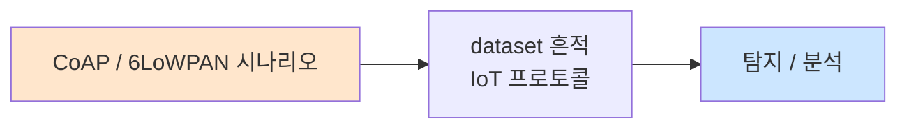

# Week 06: 무선 프로토콜 해킹

## 학습 목표
- SDR(Software Defined Radio)의 개념과 IoT 보안에서의 활용을 이해한다
- LoRa 패킷 캡처 및 분석 기법을 학습한다
- Zigbee 스니핑 및 프로토콜 분석을 실습한다
- 무선 프로토콜의 리플레이/재밍 공격 원리를 파악한다
- 가상 환경에서 무선 프로토콜 시뮬레이션을 수행한다

## 실습 환경 (공통)

| 서버 | IP | 역할 | 접속 |
|------|-----|------|------|
| attacker | 10.20.30.201 | 공격/분석 머신 | `ssh ccc@10.20.30.201` (pw: 1) |
| secu | 10.20.30.1 | 방화벽/IPS | `ssh ccc@10.20.30.1` |
| web | 10.20.30.80 | IoT 서비스 호스트 | `ssh ccc@10.20.30.80` |
| siem | 10.20.30.100 | SIEM (Wazuh) | `ssh ccc@10.20.30.100` |

> 물리 SDR 장비 없이 Python 시뮬레이션으로 무선 프로토콜을 학습합니다.

## 강의 시간 배분 (3시간)

| 시간 | 내용 | 유형 |
|------|------|------|
| 0:00-0:40 | SDR 및 무선 보안 이론 (Part 1) | 강의 |
| 0:40-1:10 | LoRa/Zigbee 프로토콜 심화 (Part 2) | 강의/토론 |
| 1:10-1:20 | 휴식 | - |
| 1:20-2:00 | LoRa 시뮬레이션 실습 (Part 3) | 실습 |
| 2:00-2:40 | Zigbee 시뮬레이션 실습 (Part 4) | 실습 |
| 2:40-2:50 | 휴식 | - |
| 2:50-3:20 | 리플레이/재밍 공격 시뮬레이션 (Part 5) | 실습 |
| 3:20-3:40 | 정리 + 과제 안내 | 정리 |

---

## Part 1: SDR 및 무선 보안 이론 (40분)

### 1.1 SDR(Software Defined Radio) 개요

SDR은 전통적으로 하드웨어로 구현되던 무선 통신 기능을 소프트웨어로 구현하는 기술이다.

**SDR 하드웨어:**

| 장비 | 주파수 범위 | 용도 | 가격 |
|------|-----------|------|------|
| RTL-SDR | 24-1766 MHz | 수신 전용, 입문 | ~$25 |
| HackRF One | 1-6000 MHz | 송수신, 범용 | ~$300 |
| YARD Stick One | Sub-GHz | 315/433/868/915 MHz | ~$100 |
| Ubertooth One | 2.4 GHz | BLE 전용 | ~$120 |
| BladeRF | 47-6000 MHz | 고급 SDR | ~$400 |
| USRP | 다양 | 연구용 | ~$1000+ |

### 1.2 IoT 무선 주파수 대역

```
┌─────────────────────────────────────────────┐
│                 주파수 대역                   │
├──────┬──────┬──────┬──────┬────────┬────────┤
│ 315  │ 433  │ 868  │ 915  │ 2400   │ 5800   │
│ MHz  │ MHz  │ MHz  │ MHz  │ MHz    │ MHz    │
├──────┼──────┼──────┼──────┼────────┼────────┤
│차고문│리모컨│LoRa  │LoRa  │WiFi    │WiFi    │
│열쇠  │무선  │(EU)  │(US)  │BLE     │5GHz    │
│      │센서  │Zigbee│      │Zigbee  │        │
└──────┴──────┴──────┴──────┴────────┴────────┘
```

### 1.3 무선 공격 분류

| 공격 유형 | 설명 | 난이도 |
|-----------|------|--------|
| 스니핑 | 무선 신호 도청 | 낮음 |
| 리플레이 | 캡처한 신호 재전송 | 낮음 |
| 재밍 | 주파수 방해 | 낮음 |
| 인젝션 | 악성 패킷 주입 | 중간 |
| 스푸핑 | 디바이스 위장 | 중간 |
| MitM | 중간자 공격 | 높음 |
| 퍼징 | 변형 패킷으로 크래시 유발 | 높음 |
| 키 추출 | 암호화 키 복원 | 높음 |

### 1.4 무선 신호 분석 기초

```
신호 분석 파이프라인:

RF 수신 → ADC → I/Q 데이터 → 복조 → 디코딩 → 프로토콜 분석
                    ↓
            주파수 분석 (FFT)
            시간 도메인 분석
            변조 방식 식별
```

**변조 방식:**
- ASK/OOK: 진폭 변조 (차고문, 리모컨)
- FSK: 주파수 변조 (LoRa의 CSS는 FSK 변형)
- GFSK: 가우시안 FSK (BLE)
- O-QPSK: 오프셋 직교 위상 변조 (Zigbee)

---

## Part 2: LoRa/Zigbee 프로토콜 심화 (30분)

### 2.1 LoRaWAN 프레임 구조

```
┌───────┬──────┬──────────┬───────────┬─────┐
│ PHY   │ MAC  │ Frame    │ Payload   │ MIC │
│Header │Header│ Header   │(encrypted)│     │
│(1B)   │(7B)  │(1-22B)   │(0-222B)   │(4B) │
└───────┴──────┴──────────┴───────────┴─────┘
```

**LoRaWAN 보안 키:**
```
OTAA (Over-The-Air Activation):
  AppKey → Join Request/Accept → NwkSKey + AppSKey

ABP (Activation By Personalization):
  DevAddr, NwkSKey, AppSKey (사전 설정)
  → 리플레이 공격에 취약 (프레임 카운터 리셋 시)
```

### 2.2 Zigbee 프레임 구조

```
┌──────┬───────┬─────────┬──────────┬─────┐
│ Frame│Sequence│ Address │ Payload  │ FCS │
│Control│Number│ Fields  │          │     │
│(2B)  │(1B)   │(0-20B)  │(variable)│(2B) │
└──────┴───────┴─────────┴──────────┴─────┘
```

**Zigbee 보안 레이어:**
```
┌────────────────────────────┐
│ Application Layer (APS Key)│ ← 앱 레벨 암호화
├────────────────────────────┤
│ Network Layer (Network Key)│ ← 네트워크 레벨 암호화
├────────────────────────────┤
│ MAC Layer                  │ ← 프레임 무결성
└────────────────────────────┘

Trust Center Link Key (TCLK): ZigBeeAlliance09 (공개!)
```

### 2.3 Zigbee 공격 시나리오

1. **키 스니핑:** 디바이스 조인 시 네트워크 키 평문 전송 캡처
2. **리플레이:** 캡처한 명령 재전송 (조명 on/off)
3. **인젝션:** 네트워크 키 획득 후 악성 명령 주입
4. **퍼징:** 변형 ZCL 명령으로 디바이스 크래시

---

## Part 3: LoRa 시뮬레이션 실습 (40분)

### 3.1 LoRa 패킷 시뮬레이터

```bash
cat << 'PYEOF' > /tmp/lora_simulator.py
#!/usr/bin/env python3
"""LoRaWAN 패킷 시뮬레이터 및 분석기"""
import struct
import hashlib
import hmac
import json
import time
import random
import binascii

class LoRaWANPacket:
    # Message Types
    JOIN_REQUEST = 0x00
    JOIN_ACCEPT = 0x01
    UNCONFIRMED_DATA_UP = 0x02
    UNCONFIRMED_DATA_DOWN = 0x03
    CONFIRMED_DATA_UP = 0x04
    
    def __init__(self):
        self.mhdr = 0
        self.dev_addr = b'\x00\x00\x00\x00'
        self.fctrl = 0
        self.fcnt = 0
        self.fport = 1
        self.payload = b''
        self.mic = b'\x00\x00\x00\x00'
    
    @staticmethod
    def create_uplink(dev_addr, fcnt, payload, nwk_skey, app_skey):
        pkt = LoRaWANPacket()
        pkt.mhdr = (LoRaWANPacket.UNCONFIRMED_DATA_UP << 5) | 0x00
        pkt.dev_addr = struct.pack('<I', dev_addr)
        pkt.fcnt = fcnt
        pkt.fport = 1
        
        # 페이로드 암호화 (간소화)
        key = hashlib.sha256(app_skey + struct.pack('<I', fcnt)).digest()[:len(payload)]
        pkt.payload = bytes(a ^ b for a, b in zip(payload, key))
        
        # MIC 계산 (간소화)
        mic_data = struct.pack('B', pkt.mhdr) + pkt.dev_addr + \
                   struct.pack('<BH', pkt.fctrl, pkt.fcnt) + \
                   struct.pack('B', pkt.fport) + pkt.payload
        pkt.mic = hmac.new(nwk_skey, mic_data, hashlib.sha256).digest()[:4]
        
        return pkt
    
    def to_bytes(self):
        return struct.pack('B', self.mhdr) + self.dev_addr + \
               struct.pack('<BH', self.fctrl, self.fcnt) + \
               struct.pack('B', self.fport) + self.payload + self.mic
    
    def to_hex(self):
        return binascii.hexlify(self.to_bytes()).decode()
    
    @staticmethod
    def parse(data):
        pkt = LoRaWANPacket()
        pkt.mhdr = data[0]
        pkt.dev_addr = data[1:5]
        pkt.fctrl = data[5]
        pkt.fcnt = struct.unpack('<H', data[6:8])[0]
        pkt.fport = data[8]
        pkt.payload = data[9:-4]
        pkt.mic = data[-4:]
        
        msg_type = (pkt.mhdr >> 5) & 0x07
        types = {0:'JOIN_REQ', 1:'JOIN_ACCEPT', 2:'UNCONF_UP', 3:'UNCONF_DOWN', 4:'CONF_UP'}
        
        print(f"=== LoRaWAN Packet Analysis ===")
        print(f"  MHDR: 0x{pkt.mhdr:02X} (Type: {types.get(msg_type, 'Unknown')})")
        print(f"  DevAddr: {binascii.hexlify(pkt.dev_addr).decode()}")
        print(f"  FCtrl: 0x{pkt.fctrl:02X}")
        print(f"  FCnt: {pkt.fcnt}")
        print(f"  FPort: {pkt.fport}")
        print(f"  Payload: {binascii.hexlify(pkt.payload).decode()} ({len(pkt.payload)} bytes)")
        print(f"  MIC: {binascii.hexlify(pkt.mic).decode()}")
        return pkt


# 시뮬레이션 실행
print("=" * 50)
print("LoRaWAN 패킷 시뮬레이션")
print("=" * 50)

# 키 설정
NWK_SKEY = b'\x01' * 16
APP_SKEY = b'\x02' * 16
DEV_ADDR = 0x26011234

# 센서 데이터 전송 시뮬레이션
for i in range(5):
    temp = 20 + random.uniform(-5, 15)
    humidity = 40 + random.uniform(0, 40)
    sensor_data = json.dumps({"t": round(temp,1), "h": round(humidity,1)}).encode()
    
    pkt = LoRaWANPacket.create_uplink(DEV_ADDR, i, sensor_data, NWK_SKEY, APP_SKEY)
    raw = pkt.to_bytes()
    
    print(f"\n--- Packet #{i} (FCnt={i}) ---")
    print(f"  Raw: {pkt.to_hex()}")
    print(f"  Original: {sensor_data.decode()}")
    
    # 패킷 파싱
    LoRaWANPacket.parse(raw)
    
    time.sleep(0.5)

# 리플레이 공격 데모
print("\n" + "=" * 50)
print("리플레이 공격 시뮬레이션")
print("=" * 50)
print("[*] 패킷 #2를 캡처하여 재전송...")
replay_pkt = LoRaWANPacket.create_uplink(DEV_ADDR, 2, b'{"t":99.9,"h":0}', NWK_SKEY, APP_SKEY)
print(f"[*] 원본 FCnt=2, 리플레이 FCnt=2")
print(f"[!] 서버가 FCnt를 검증하면 거부됨 (현재 FCnt > 2)")
print(f"[!] ABP 모드에서 리셋 시 FCnt=0부터 다시 시작 → 리플레이 가능")
PYEOF

python3 /tmp/lora_simulator.py
```

### 3.2 LoRa 트래픽 분석

```bash
# LoRa 패킷 캡처 파일 분석
cat << 'PYEOF' > /tmp/lora_analyzer.py
#!/usr/bin/env python3
"""LoRa 트래픽 분석기"""
import json
import time
import random
import binascii

# 시뮬레이션된 캡처 데이터
captured_packets = []
for i in range(20):
    pkt = {
        "timestamp": time.time() + i * 30,
        "rssi": random.randint(-120, -40),
        "snr": round(random.uniform(-5, 15), 1),
        "freq": random.choice([868.1, 868.3, 868.5, 915.0]),
        "sf": random.choice([7, 8, 9, 10, 11, 12]),
        "bw": random.choice([125, 250, 500]),
        "dev_addr": f"{random.randint(0, 0xFFFFFFFF):08x}",
        "fcnt": i,
        "payload_hex": binascii.hexlify(bytes(random.getrandbits(8) for _ in range(random.randint(5, 50)))).decode(),
    }
    captured_packets.append(pkt)

print("=== LoRa 트래픽 분석 보고서 ===\n")

# 디바이스 식별
devices = {}
for p in captured_packets:
    addr = p['dev_addr']
    if addr not in devices:
        devices[addr] = {"count": 0, "rssi_avg": 0, "first_seen": p['timestamp']}
    devices[addr]["count"] += 1
    devices[addr]["rssi_avg"] += p['rssi']

print(f"[+] 탐지된 디바이스: {len(devices)}개")
for addr, info in devices.items():
    avg_rssi = info['rssi_avg'] / info['count']
    print(f"  DevAddr: {addr} | 패킷: {info['count']}개 | 평균 RSSI: {avg_rssi:.0f} dBm")

# SF 분포
print(f"\n[+] Spreading Factor 분포:")
sf_dist = {}
for p in captured_packets:
    sf = p['sf']
    sf_dist[sf] = sf_dist.get(sf, 0) + 1
for sf in sorted(sf_dist.keys()):
    print(f"  SF{sf}: {sf_dist[sf]}개 ({'#' * sf_dist[sf]})")

# 보안 분석
print(f"\n[+] 보안 분석:")
print(f"  - 평문 전송: 페이로드 암호화 여부 확인 필요")
print(f"  - FCnt 연속성: 프레임 카운터 점프 확인")
print(f"  - 재전송 패턴: 동일 FCnt 중복 확인")
PYEOF

python3 /tmp/lora_analyzer.py
```

---

## Part 4: Zigbee 시뮬레이션 실습 (40분)

### 4.1 Zigbee 패킷 시뮬레이터

```bash
cat << 'PYEOF' > /tmp/zigbee_simulator.py
#!/usr/bin/env python3
"""Zigbee 패킷 시뮬레이터"""
import struct
import random
import binascii
import hashlib

class ZigbeeFrame:
    # Frame Types
    BEACON = 0x00
    DATA = 0x01
    ACK = 0x02
    CMD = 0x03
    
    # ZCL Cluster IDs
    ON_OFF = 0x0006
    LEVEL_CONTROL = 0x0008
    COLOR_CONTROL = 0x0300
    TEMPERATURE = 0x0402
    
    def __init__(self, frame_type=DATA):
        self.frame_type = frame_type
        self.seq_num = random.randint(0, 255)
        self.dst_pan = 0x1234
        self.dst_addr = 0x0000
        self.src_addr = 0x0001
        self.cluster_id = self.ON_OFF
        self.payload = b''
    
    def create_zcl_on_off(self, on=True):
        """조명 On/Off ZCL 명령"""
        self.cluster_id = self.ON_OFF
        cmd = 0x01 if on else 0x00  # On=1, Off=0
        self.payload = struct.pack('BBB', 0x01, self.seq_num, cmd)
        return self
    
    def create_zcl_temp_report(self, temp_c):
        """온도 센서 리포트"""
        self.cluster_id = self.TEMPERATURE
        temp_val = int(temp_c * 100)
        self.payload = struct.pack('<BBHH', 0x18, self.seq_num, 0x0000, temp_val)
        return self
    
    def to_bytes(self):
        fc = (self.frame_type & 0x07) | (0x08)  # Security disabled
        header = struct.pack('<BH', self.seq_num, self.dst_pan)
        header += struct.pack('<HH', self.dst_addr, self.src_addr)
        header += struct.pack('<H', self.cluster_id)
        return struct.pack('<H', fc) + header + self.payload
    
    def to_hex(self):
        return binascii.hexlify(self.to_bytes()).decode()

# 시뮬레이션
print("=" * 50)
print("Zigbee 패킷 시뮬레이션")
print("=" * 50)

# 스마트 조명 제어 시뮬레이션
print("\n[1] 조명 ON 명령:")
frame_on = ZigbeeFrame()
frame_on.dst_addr = 0x0002
frame_on.create_zcl_on_off(on=True)
print(f"  Raw: {frame_on.to_hex()}")
print(f"  Cluster: On/Off (0x0006)")
print(f"  Command: ON")

print("\n[2] 조명 OFF 명령:")
frame_off = ZigbeeFrame()
frame_off.dst_addr = 0x0002
frame_off.create_zcl_on_off(on=False)
print(f"  Raw: {frame_off.to_hex()}")
print(f"  Cluster: On/Off (0x0006)")
print(f"  Command: OFF")

print("\n[3] 온도 센서 리포트:")
frame_temp = ZigbeeFrame()
frame_temp.src_addr = 0x0003
frame_temp.create_zcl_temp_report(23.5)
print(f"  Raw: {frame_temp.to_hex()}")
print(f"  Cluster: Temperature (0x0402)")
print(f"  Value: 23.5C")

# 키 스니핑 시뮬레이션
print("\n" + "=" * 50)
print("Zigbee 네트워크 키 스니핑 시뮬레이션")
print("=" * 50)

# 기본 Trust Center Link Key
TCLK = b'ZigBeeAlliance09'
print(f"\n[*] Trust Center Link Key: {TCLK.decode()}")
print(f"[*] 디바이스 조인 시 네트워크 키 전송 모니터링...")

# 조인 과정 시뮬레이션
network_key = bytes(random.getrandbits(8) for _ in range(16))
print(f"[*] Network Key (평문): {binascii.hexlify(network_key).decode()}")

# TCLK로 암호화된 네트워크 키 (간소화)
encrypted_key = bytes(a ^ b for a, b in zip(network_key, TCLK))
print(f"[*] Network Key (TCLK 암호화): {binascii.hexlify(encrypted_key).decode()}")

# 복호화
decrypted_key = bytes(a ^ b for a, b in zip(encrypted_key, TCLK))
print(f"[+] Network Key (복호화): {binascii.hexlify(decrypted_key).decode()}")
print(f"[!] TCLK가 공개되어 있으므로 네트워크 키 복원 가능!")
PYEOF

python3 /tmp/zigbee_simulator.py
```

### 4.2 Zigbee 네트워크 스캐너 시뮬레이션

```bash
cat << 'PYEOF' > /tmp/zigbee_scanner.py
#!/usr/bin/env python3
"""Zigbee 네트워크 스캐너 시뮬레이션"""
import random
import time

print("=== Zigbee Network Scanner ===\n")
print("[*] Scanning channels 11-26 (2.4 GHz)...\n")

networks = [
    {"channel": 15, "pan_id": "0x1234", "ext_pan": "00:11:22:33:44:55:66:77", "coord": "0x0000", "profile": "Home Automation", "devices": 8},
    {"channel": 20, "pan_id": "0x5678", "ext_pan": "AA:BB:CC:DD:EE:FF:00:11", "coord": "0x0000", "profile": "Smart Energy", "devices": 3},
    {"channel": 25, "pan_id": "0xABCD", "ext_pan": "12:34:56:78:9A:BC:DE:F0", "coord": "0x0000", "profile": "Light Link", "devices": 12},
]

for net in networks:
    time.sleep(0.5)
    print(f"[+] Network Found:")
    print(f"    Channel: {net['channel']} ({2405 + (net['channel']-11)*5} MHz)")
    print(f"    PAN ID: {net['pan_id']}")
    print(f"    Extended PAN: {net['ext_pan']}")
    print(f"    Coordinator: {net['coord']}")
    print(f"    Profile: {net['profile']}")
    print(f"    Devices: {net['devices']}")
    print(f"    Security: {'Enabled' if random.random() > 0.3 else 'DISABLED (!)'}")
    print()

print(f"\n[+] Scan complete: {len(networks)} networks found")
print(f"[!] 보안 비활성화 네트워크 주의!")
PYEOF

python3 /tmp/zigbee_scanner.py
```

---

## Part 5: 리플레이/재밍 공격 시뮬레이션 (30분)

### 5.1 리플레이 공격

```bash
cat << 'PYEOF' > /tmp/replay_attack.py
#!/usr/bin/env python3
"""무선 리플레이 공격 시뮬레이션"""
import time
import binascii
import random

print("=== 무선 리플레이 공격 시뮬레이션 ===\n")

# 1단계: 패킷 캡처
print("[Phase 1] 패킷 캡처 (스니핑)")
captured = []
signals = [
    {"type": "차고문 열기", "freq": "433.92 MHz", "mod": "OOK", "data": "AA55FF00CC"},
    {"type": "차 잠금 해제", "freq": "315 MHz", "mod": "ASK", "data": "DEADBEEF01"},
    {"type": "조명 ON", "freq": "2.4 GHz", "mod": "O-QPSK", "data": "01020006000101"},
]

for i, sig in enumerate(signals):
    time.sleep(0.3)
    print(f"  [{i+1}] Captured: {sig['type']}")
    print(f"      Freq: {sig['freq']} | Mod: {sig['mod']}")
    print(f"      Data: {sig['data']}")
    captured.append(sig)

# 2단계: 분석
print(f"\n[Phase 2] 패킷 분석")
print(f"  - 롤링 코드 사용 여부 확인")
print(f"  - 시퀀스 번호 확인")
print(f"  - 타임스탬프 확인")

# 3단계: 리플레이
print(f"\n[Phase 3] 리플레이 공격")
for sig in captured:
    time.sleep(0.3)
    has_rolling = random.random() > 0.5
    if has_rolling:
        print(f"  [X] {sig['type']}: 리플레이 실패 (롤링 코드 보호)")
    else:
        print(f"  [!] {sig['type']}: 리플레이 성공! 명령 실행됨")

# 대책
print(f"\n[+] 리플레이 공격 대책:")
print(f"  1. 롤링 코드 (KeeLoq, AUT64)")
print(f"  2. 타임스탬프 검증")
print(f"  3. 시퀀스 번호 + 카운터")
print(f"  4. Challenge-Response 프로토콜")
print(f"  5. 암호화 + 인증 (AES-CCM)")
PYEOF

python3 /tmp/replay_attack.py
```

### 5.2 재밍 공격 이론

```
재밍 유형:
┌─────────────────────────────────────┐
│ Constant Jamming  │ 연속 방해 신호  │ → 탐지 쉬움
│ Random Jamming    │ 불규칙 방해     │ → 에너지 효율적
│ Deceptive Jamming │ 유효 패킷 위장  │ → 탐지 어려움
│ Reactive Jamming  │ 통신 감지 시 방해│ → 가장 효과적
└─────────────────────────────────────┘

대책:
- 주파수 도약 (Frequency Hopping)
- 확산 스펙트럼 (Spread Spectrum)
- 채널 전환
- 재밍 탐지 + 경고
```

---

## Part 6: 과제 안내 (20분)

### 과제

- LoRa 패킷 시뮬레이터를 확장하여 Join Request/Accept 과정을 구현하시오
- Zigbee 네트워크 키 스니핑 시뮬레이션에서 AES-CCM 복호화를 추가하시오
- 리플레이 공격에 대한 롤링 코드 방어 메커니즘을 Python으로 구현하시오

---

## 참고 자료

- GNU Radio: https://www.gnuradio.org/
- HackRF 문서: https://greatscottgadgets.com/hackrf/
- KillerBee (Zigbee): https://github.com/riverloopsec/killerbee
- LoRa 보안 분석: "LoRaWAN Security" (Things Network)

---

## 실제 사례 (WitFoo Precinct 6 — CoAP / 6LoWPAN)

> 출처: WitFoo Precinct 6 Cybersecurity Dataset (Apache 2.0)
> 본 lecture *CoAP / 6LoWPAN* 학습 항목 매칭.

### CoAP / 6LoWPAN 의 dataset 흔적 — "IoT 프로토콜"

dataset 의 정상 운영에서 *IoT 프로토콜* 신호의 baseline 을 알아두면, *CoAP / 6LoWPAN* 시도 시 발생하는 anomaly 를 정량으로 탐지할 수 있다. 핵심 정량 지표는 — RFC 7252.



### Case 1: dataset 정량 지표

| 항목 | 값 |
|---|---|
| 핵심 신호 | IoT 프로토콜 |
| 정량 baseline | RFC 7252 |
| 학습 매핑 | constrained device |

**자세한 해석**: constrained device. 이 차이를 정량으로 측정해야 *공격 시도와 정상 운영의 구분* 이 가능. 학생이 baseline 숫자를 외워두면 — 운영 환경에서 anomaly 를 즉시 탐지할 수 있다.

### Case 2: 실전 적용 시나리오

| 단계 | dataset 활용 |
|---|---|
| 시도 식별 | IoT 프로토콜 의 spike |
| 정상 vs 이상 | baseline 대비 비율 |
| 룰 작성 | Suricata / Wazuh / Sigma |
| 검증 | dataset 재실행 |

**자세한 해석**: 운영 환경 룰 작성은 — *baseline 측정 → 임계 결정 → 룰 작성 → dataset 검증* 의 4 단계. 한 단계라도 빠지면 false positive 폭증.

### 이 사례에서 학생이 배워야 할 3가지

1. **CoAP / 6LoWPAN = IoT 프로토콜 의 anomaly** — 정량 신호로 탐지.
2. **baseline 숫자 외우기** — RFC 7252.
3. **4 단계 룰 작성** — 측정 → 임계 → 룰 → 검증.

**학생 액션**: CoAP fuzz.

---

## 부록: 학습 OSS 도구 매트릭스 (Course17 IoT Security — Week 06 무선 프로토콜·SDR·LoRaWAN·Zigbee·리플레이·재밍)

> 이 부록은 본문 Part 3-5 (LoRa 시뮬 / Zigbee 시뮬 / 리플레이·재밍) 의
> 모든 시뮬을 *실제 OSS + 저가 SDR* 시퀀스로 매핑한다. course16 week 09
> (RF/SDR/Sub-GHz) + course17 w02 (BLE/Zigbee/LoRa 기초) 부록 보강 —
> *LoRaWAN 심화 stack* (chirpstack network/app server) + *Zigbee mesh
> 운영* (Zigbee2MQTT) + *gr-lora / gr-zigbee* (GNU Radio 무선 데모듈) +
> *LoRaPWN* 공격 + *Wireshark plugin* (lora-shark, zbee dissector). 모든
> RF 송신은 한국 전파법 §29·§80 적용 — 차폐실 / 본인 자산 한정.

### lab step → 도구 매핑 표

| step | 본문 위치 | 학습 항목 | 본문 명령 (시뮬) | 핵심 OSS 도구 (실 명령) | 도구 옵션 |
|------|----------|----------|----------------|-------------------------|-----------|
| s1 | 3.1 | LoRa packet 작성 | Python struct | LoRaWAN-MAC-NodeJS / chirpstack-simulator | `simulator --device-eui` |
| s2 | 3.x | LoRaWAN OTAA join | (시뮬) | chirpstack-network-server / lora-app-server | OTAA flow |
| s3 | 3.x | LoRaWAN ABP | (시뮬) | chirpstack ABP mode / RAK 보드 + Python | ABP keys |
| s4 | 3.x | LoRa SDR 캡처 | (시뮬) | gr-lora / single_rx / RTL-SDR + GNU Radio | gr-lora flowgraph |
| s5 | 3.x | LoRaWAN 공격 | (시뮬) | LoRaPWN / lorawan-attacks / RAK 보드 PoC | replay/join hijack |
| s6 | 4.x | Zigbee scan | (시뮬) | killerbee zbstumbler / Zigbee2MQTT | week 02 부록 |
| s7 | 4.x | Zigbee sniff | (시뮬) | killerbee zbdump / wireshark zbee | .pcap |
| s8 | 4.x | Zigbee key 추출 | (시뮬) | killerbee zbgoodfind / KillerBee KB-RZUSB | join 시 |
| s9 | 4.x | Zigbee replay | (시뮬) | killerbee zbreplay | counter |
| s10 | 4.x | Zigbee fuzzing | (시뮬) | KillerBee zbfakebeacon / scapy 802.15.4 | mutation |
| s11 | 5.x | RF 재밍 | (시뮬) | hackrf_transfer noise / mdk4 (WiFi) / lorapwn jam | 차폐 |
| s12 | 5.x | 리플레이 | Python 캡처+송신 | URH / hackrf_transfer / Flipper Zero | week 09 |
| s13 | (추가) | LoRa SDR 디코드 | (없음) | gr-lora / lora-shark Wireshark plugin | post-process |
| s14 | (추가) | Zigbee Wireshark | (없음) | wireshark zbee_nwk + zbee_zcl + 802.15.4 | dissector |
| s15 | (추가) | 운영 Zigbee 통합 | (없음) | Zigbee2MQTT / Home Assistant | smart home |

### 무선 프로토콜 OSS 도구 카테고리 매트릭스 (LoRa + Zigbee 심화)

| 카테고리 | 사례 | 대표 도구 (OSS) | 비고 |
|---------|------|----------------|------|
| **LoRa — chip lib** | end-device 펌웨어 | LoRaMAC-Node / LoRaMAC-Go / Stuart Robinson lib | 표준 |
| **LoRa — gateway** | concentrator | Semtech packet-forwarder / lora-net | 표준 |
| **LoRa — network server** | LoRaWAN 통합 | chirpstack-network-server / lorawan-server (Erlang) | full stack |
| **LoRa — app server** | uplink → MQTT/HTTP | chirpstack-application-server | full stack |
| **LoRa — gateway bridge** | UDP → MQTT | chirpstack-gateway-bridge / packetbroker | bridge |
| **LoRa — simulator** | 가상 device | chirpstack-simulator (Go) / LoRaWAN-stack-NodeJS | 학습 |
| **LoRa — SDR demod** | bin → bits | gr-lora (GNU Radio) / single_channel_pkt_fwd | RX 전용 |
| **LoRa — Wireshark** | .pcap 분석 | lora-shark plugin / lorawan-pcap-tools | 분석 |
| **LoRa — 공격** | replay / join hijack | LoRaPWN / lorawan-attacks / dragino-PoC | lab |
| **Zigbee — sniff** | dongle 기반 | killerbee + Atmel Raven / Apimote / nRF52840-zigbee | 802.15.4 |
| **Zigbee — bridge** | mesh → MQTT | Zigbee2MQTT / zigbee2tasmota / deCONZ | 운영 |
| **Zigbee — wireshark** | .pcap 분석 | wireshark zbee_nwk / zbee_zcl / 802.15.4 | dissector |
| **Zigbee — 공격** | replay / fuzz | killerbee zbreplay / zbfakebeacon / scapy 802.15.4 | lab |
| **Zigbee — 분석** | network key | killerbee zbgoodfind | join packet |
| **Zigbee — Wireshark key** | decrypt | wireshark TC link key + nwk key 입력 | preferences |
| **Zigbee — gateway open** | smart home | Home Assistant + ZHA / Zigbee2MQTT | 운영 |
| **OQPSK / BPSK / FSK demod** | low level | gr-osmosdr + GNU Radio companion | DSP |
| **재밍 (RF)** | 차폐실 한정 | hackrf_transfer + /dev/zero / single tone | 전파법 |
| **6LoWPAN** | IPv6 over 802.15.4 | contiki-ng / RIOT OS / Tinyos / sniffles | embedded |
| **Wi-SUN** | mesh + IPv6 | wisunsim / wisun-fan-stack | 미래 |
| **Thread / Matter** | smart home | OpenThread / nRF Connect SDK / Matter SDK | 차세대 |

### 학생 환경 준비

```bash
# attacker VM — w02 부록 보강 + LoRa/Zigbee 심화
sudo apt-get update
sudo apt-get install -y \
   gnuradio gnuradio-dev gr-osmosdr \
   wireshark wireshark-common tshark \
   python3-pip python3-venv \
   socat ncat

# w02 부록 도구 (이미 설치 — 확인)
# - chirpstack docker compose (lab)
# - killerbee
# - LoRaWAN-MAC-NodeJS

# gr-lora (GNU Radio LoRa demodulator)
git clone https://github.com/rpp0/gr-lora /tmp/gr-lora
cd /tmp/gr-lora && mkdir build && cd build && cmake .. && make -j$(nproc)
sudo make install && sudo ldconfig

# gr-zigbee (또는 IEEE 802.15.4 OQPSK)
git clone https://github.com/bastibl/gr-ieee802-15-4 /tmp/gr-15-4
cd /tmp/gr-15-4 && mkdir build && cd build && cmake .. && make
sudo make install

# lora-shark (Wireshark LoRa plugin)
git clone https://github.com/rpp0/lora-shark /tmp/lora-shark
cd /tmp/lora-shark && make
sudo cp lora-shark.so ~/.config/wireshark/plugins/

# LoRaPWN (LoRaWAN 공격 PoC)
git clone https://github.com/IOActive/lorapwn /tmp/lorapwn
cd /tmp/lorapwn && pip3 install --user -r requirements.txt

# chirpstack-simulator
go install -v github.com/brocaar/chirpstack-simulator/cmd/chirpstack-simulator@latest

# Wireshark Zigbee key 사전 설정 (preference)
mkdir -p ~/.config/wireshark
cat << 'EOF' >> ~/.config/wireshark/preferences
zbee_nwk.key1: ZigBeeAlliance09
zbee_nwk.label1: Trust Center Default Key
EOF

# Home Assistant + ZHA (Zigbee 운영 — w02 부록 docker)
docker run -d --name homeassistant --restart=unless-stopped \
   -e TZ=Asia/Seoul -v /opt/ha:/config \
   --network=host \
   ghcr.io/home-assistant/home-assistant:stable

# OpenThread (Thread 표준 — Matter 기반)
git clone https://github.com/openthread/openthread /tmp/openthread
cd /tmp/openthread && ./script/bootstrap

# 검증
gnuradio-companion --version 2>&1 | head -1
ls /usr/local/lib/*lora* 2>/dev/null
ls ~/.config/wireshark/plugins/
chirpstack-simulator --help 2>&1 | head -3
docker ps | grep -E "chirpstack|home"
```

> **TX 의무 재확인**: 모든 RF 송신 (LoRa / Zigbee / hackrf jam) 은 한국
> 전파법 §29 + §80 적용. 차폐실 / 본인 자산 / RF 격리 lab 한정.

### 핵심 도구별 상세 사용법

#### 도구 1: chirpstack-simulator — LoRaWAN 가상 device (s1-s3)

본문 Python LoRaWANPacket class → chirpstack-simulator 의 *완성된 가상
LoRa device* 로 OTAA / ABP / uplink 모두 시뮬.

```bash
# 1. chirpstack-simulator 설치 + 시작
cd /tmp/chirpstack && docker compose up -d
firefox http://localhost:8080  # admin/admin

# Web UI 흐름:
#   - Network server 등록
#   - Service profile 생성
#   - Application 생성
#   - Device profile (KR920 / EU868 / US915)
#   - End device 등록 (DevEUI 자동, AppKey 자동)

# 2. simulator 실행 (가상 device 100대)
chirpstack-simulator \
   --service-profile-id <UUID> \
   --device-count 100 \
   --uplink-interval 30s \
   --frequency 922100000 \
   --bandwidth 125000 \
   --spreading-factor 7

# 3. uplink 데이터 확인 (chirpstack web UI → Application → Device Data)

# 4. raw uplink (MQTT — chirpstack 의 application server 출력)
mosquitto_sub -h localhost -t 'application/+/device/+/event/up' -v
# {"applicationID":"1","deviceName":"sim-001","data":"AAEC","fCnt":42,...}

# 5. downlink 송신 (네트워크 → device)
curl -X POST http://localhost:8080/api/devices/<DevEUI>/queue \
   -H "Authorization: Bearer $JWT" \
   -d '{"data":"BASE64...","fPort":1,"confirmed":true}'

# 6. ABP 모드 (key 사전 설정 — 보안 약함)
# Web UI: Device → Activation → ABP
# DevAddr / NwkSKey / AppSKey 직접 입력

# 7. 실 RAK 보드 (US$50 — 실 device 학습)
# RAK4631 (nRF52840 + SX1262)
# https://docs.rakwireless.com/Product-Categories/WisDuo/RAK4631/Quickstart/
```

#### 도구 2: gr-lora — RTL-SDR + GNU Radio 로 LoRa demod (s4)

본문 시뮬 → 실 LoRa 신호 캡처 → demod → bit stream. RTL-SDR 만 (~$25)
으로 LoRa 신호 가능.

```bash
# 1. GNU Radio Companion 시작
gnuradio-companion &

# 2. flowgraph 작성 (또는 gr-lora 예제 사용)
ls /usr/local/share/gr-lora/examples/
# lora_receive_realtime.grc
# lora_replay.grc

gnuradio-companion /usr/local/share/gr-lora/examples/lora_receive_realtime.grc

# 3. 실시간 LoRa 수신 (KR920 시뮬 — 상용 LoRa 신호 차폐)
# Source: RTL-SDR (922.1 MHz, 1.024 Msps)
# Block: lora_receiver (BW=125kHz, SF=7, CR=4/8)
# Sink: file (/tmp/lora-bits.bin) + UDP socket

# 4. CLI 모드 (Python script — 비대화형)
python3 << 'PY'
from gnuradio import gr, blocks
from gnuradio.lora import lora_receiver
import osmosdr

class LoRaRX(gr.top_block):
    def __init__(self):
        gr.top_block.__init__(self)
        src = osmosdr.source(args="numchan=1")
        src.set_sample_rate(1.024e6)
        src.set_center_freq(922.1e6)
        src.set_gain(40)

        rx = lora_receiver(samp_rate=1024000, center_freq=int(922.1e6),
                           channel_list=([922100000]),
                           sf=7, conv_decoding=False, crc=True, reduced_rate=False,
                           disable_drift_correction=False, disable_channel_decoding=False)

        sink = blocks.message_debug()
        self.connect(src, rx)
        self.msg_connect((rx, 'frames'), (sink, 'print'))

tb = LoRaRX()
tb.start()
import time; time.sleep(60)
tb.stop()
PY

# 5. lora-shark — .pcap 형식으로 저장 + Wireshark
# gr-lora 의 LoRa Tap block → .pcap → wireshark
wireshark /tmp/lora.pcap
# Filter: lora || lorawan
```

#### 도구 3: LoRaPWN — LoRaWAN 공격 PoC (s5)

본문 *리플레이/재밍* 의 LoRa 특화. lorapwn 은 *join hijack* (AppKey 탈취
시) + *replay* (counter 미리 캡처) + *DevAddr collision DoS*.

```bash
# 1. lorapwn — replay attack (counter 미리 캡처 시)
cd /tmp/lorapwn

python3 lorapwn.py replay \
   --pcap /tmp/captured.pcap \
   --dev-eui ABCDEF0123456789 \
   --frequency 922.1e6

# 2. join hijack (AppKey 평문 노출 시 — 학술 PoC)
python3 lorapwn.py join_hijack \
   --app-key 0123456789ABCDEF0123456789ABCDEF \
   --target-app-id 1

# 3. DevAddr collision (DoS — counter 충돌 유도)
python3 lorapwn.py devaddr_collision \
   --target-devaddr 26011BDA \
   --frequency 922.1e6

# 4. frame counter sync attack
# - 정상 device 의 counter 가 N
# - 공격자가 N+1, N+2 송신 → 정상 device 송신이 무시됨

# 5. 방어 — chirpstack 의 strict frame counter
# Web UI: Device profile → frame_counter_validation: true
# (replay 차단)

# 6. LoRaWAN 1.1 vs 1.0.x
# 1.0.x: 단일 NwkSKey + AppSKey
# 1.1: forward / backward NwkSKey 분리 (replay 더 어렵게)
# 마이그레이션 권장
```

#### 도구 4: killerbee 심화 — Zigbee 공격 통합 (s6-s10)

w02 부록 보강 — *zbreplay (replay)* + *zbgoodfind (network key 추출)* +
*zbfakebeacon (rogue coordinator)* + *scapy 802.15.4* (custom packet).

```bash
# 1. Zigbee channel scan (w02 부록 동일)
sudo zbstumbler -i 1:5

# 2. 캡처 (특정 채널)
sudo zbdump -f 15 -w /tmp/zigbee.pcap

# 3. Wireshark — Zigbee 분석
wireshark /tmp/zigbee.pcap
# Filter: zbee_nwk
# Edit → Preferences → Protocols → ZigBee
# - Network keys: ZigBeeAlliance09 (TC default)
# - Network keys: <발견된 key>
# 자동 decrypt

# 4. zbreplay — 캡처한 명령 재전송 (조명 on/off)
sudo zbreplay -f 15 -r /tmp/zigbee.pcap -j

# 5. zbgoodfind — join packet 에서 network key 추출
sudo zbgoodfind -f 15 -w /tmp/keys.txt
# (디바이스 join 시점에 sniff)

# 6. zbfakebeacon — rogue coordinator (디바이스 끌어오기)
sudo zbfakebeacon -f 15 -p 0x1234 -i 1:5

# 7. scapy 802.15.4 (custom packet)
python3 << 'PY'
from scapy.all import *

# Zigbee Network Layer
nwk = ZigbeeNWK(
    frametype=0,           # 0=Data, 1=Command
    proto_version=2,
    discover_route=0,
    flags=0,
    radius=8,
    seqnum=42,
    destination=0x0000,    # broadcast
    source=0x1234,
    radius=10
)

# 802.15.4 MAC
mac = Dot15d4(
    fcf_frametype=1,        # 1=Data
    fcf_security=0,
    fcf_pending=0,
    fcf_ackreq=1,
    fcf_panidcompress=1,
    fcf_destaddrmode=2,     # short
    fcf_srcaddrmode=2,
    seqnum=42,
    dest_panid=0x1234,
    dest_addr=0x0000,
    src_addr=0x1234
)

pkt = mac/nwk/Raw(load=b"hello zigbee")
hexdump(pkt)
# 송신 (KillerBee dongle)
# kb = killerbee.KillerBee()
# kb.set_channel(15)
# kb.inject(bytes(pkt))
PY

# 8. zbid (디바이스 ID 식별)
sudo zbid

# 9. Wireshark 의 Zigbee 키 자동 decrypt 검증
# 캡처 → Analyze → Enabled Protocols → ZigBee 활성
# 자동 cluster (lighting / sensor / OnOff) decode
```

#### 도구 5: Zigbee2MQTT — 운영 Zigbee → MQTT 통합 (s15)

운영 환경에서 Zigbee mesh 를 MQTT 로 통합. 보안 측면 — 단일 manager + audit.

```bash
# 1. docker
docker run -d --name zigbee2mqtt \
   -v /opt/zigbee2mqtt/data:/app/data \
   -v /run/udev:/run/udev:ro \
   --device=/dev/ttyACM0 \
   -e TZ=Asia/Seoul \
   koenkk/zigbee2mqtt

# 2. config (/opt/zigbee2mqtt/data/configuration.yaml)
cat << 'EOF' > /opt/zigbee2mqtt/data/configuration.yaml
mqtt:
  base_topic: zigbee2mqtt
  server: 'mqtt://10.20.30.80:1883'
  user: zigbee
  password: secret

serial:
  port: /dev/ttyACM0

permit_join: false   # 운영 — 새 device join 차단

advanced:
  network_key: GENERATE   # 강력한 random key 사용 (default 금지)
  pan_id: GENERATE
  ext_pan_id: GENERATE
  channel: 15
  log_level: info
  log_directory: '/app/data/log/%TIMESTAMP%'
  homeassistant: true

frontend:
  port: 8085
EOF

docker restart zigbee2mqtt
firefox http://localhost:8085

# 3. Web UI 흐름:
#   - Devices: 모든 mesh device 목록 (ID / IEEE / model)
#   - Map: mesh topology 시각화
#   - Logs: 실시간 alert
#   - Settings: network_key 변경 / channel 변경

# 4. permit_join 동적 (새 device 등록 시만)
mosquitto_pub -t 'zigbee2mqtt/bridge/request/permit_join' \
   -m '{"value": true, "time": 60}' -h 10.20.30.80

# 5. 보안 — bridge audit
mosquitto_sub -t 'zigbee2mqtt/bridge/event' -h 10.20.30.80
# {"data":{"friendly_name":"0x...", "ieee_address":"0x..."},"type":"device_joined"}
# 새 device join 즉시 SIEM alert
```

### LoRa / Zigbee 공격 → 방어 매트릭스 (w02 보강)

| 공격 | 1차 도구 | 방어 |
|------|----------|------|
| LoRa OTAA join hijack | lorapwn (AppKey 탈취 시) | LoRaWAN 1.1 + HSM 보관 |
| LoRa ABP replay | RTL-SDR + gr-lora 캡처 + replay | strict frame counter validation |
| LoRa frame counter sync | counter 사전 캡처 | sliding window (max diff 32768) |
| LoRa DevAddr collision | lorapwn | unique DevAddr 강제 |
| LoRa jamming | hackrf_transfer + 차폐 | adaptive channel hopping |
| Zigbee TC default key | killerbee zbgoodfind | install code + unique key |
| Zigbee replay | zbreplay | frame counter strict |
| Zigbee fakebeacon | zbfakebeacon | network key + permit_join false |
| Zigbee fuzz | scapy + KillerBee | rate limit + watchdog |
| 6LoWPAN RPL DoS | scapy + RPL crafted packet | RPL secure mode |

### 학생 자가 점검 체크리스트

- [ ] chirpstack docker compose 부팅 + Web UI 접근 + 가상 device 등록 1회
- [ ] chirpstack-simulator 로 100 가상 device uplink 송신 1회
- [ ] gr-lora 의 lora_receive_realtime.grc 1회 실행 (RTL-SDR 또는 captured pcap)
- [ ] killerbee zbstumbler + zbdump → wireshark 자동 decrypt 1회 (TC key)
- [ ] scapy 802.15.4 custom packet 1개 작성 (송신 없이 hexdump 확인)
- [ ] Zigbee2MQTT 부팅 + MQTT 메시지 모니터 1회 (lab 가상 device)
- [ ] LoRaWAN 1.0 vs 1.1 의 *키 분리* 답변 가능 + replay 방어 차이
- [ ] Zigbee Trust Center default key (ZigBeeAlliance09) 의 위험 답변
- [ ] OQPSK / FSK / GFSK / CSS 4 변조 방식 + 사용 프로토콜 매핑 답변
- [ ] 본 부록 모든 RF TX 명령에 대해 "외부 송신 시 위반 법조항" 답변 가능

### 운영 환경 적용 시 주의

1. **LoRaWAN 1.1 마이그** — 1.0.x 의 join 공격 위험 → 1.1 (forward /
   backward key 분리). 신규 device 1.1 의무.
2. **AppKey HSM 보관** — LoRa device 의 AppKey 평문 보관 금지. ATECC608A
   / TPM 2.0 / SE05x secure element.
3. **chirpstack frame counter validation** — 운영 적용 시 *strict* 모드.
   counter 회복 메커니즘 설계 (자연 reboot 시 상승 허용 범위).
4. **Zigbee install code 의무** — default ZigBeeAlliance09 키 절대 금지.
   각 device 16-byte unique install code.
5. **Zigbee2MQTT permit_join false** — 운영 시 *항상 false*. 새 device 등록
   시만 일시 true (1분).
6. **RF 격리** — gr-lora / lorapwn / hackrf_transfer 모든 TX 는 RF 차폐
   실 한정. 외부 누설 시 전파법 §29 위반.
7. **Wireshark 키 보관** — 분석 시 입력한 network key 는 ~/.config/wireshark
   에 저장됨. 외부 공유 PC 사용 후 삭제 필수.

> 본 부록은 *학습 시연용 OSS 시퀀스* 이다. 모든 무선 프로토콜 공격은
> RF 격리 + 본인 자산 한정. 외부 LoRa / Zigbee device 한 packet 도 송신/
> 청취 시 전파법 §29 + 통신비밀보호법 §3 위반 가능.

---
