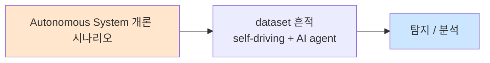

# Week 01: CPS 보안 개론 — 사이버물리시스템과 위협 모델

## 학습 목표
- 사이버물리시스템(CPS)의 정의와 구성 요소를 이해한다
- CPS와 전통 IT 시스템의 보안 차이점을 설명할 수 있다
- CPS 위협 모델링 기법(STRIDE, PASTA)을 적용할 수 있다
- 실제 CPS 공격 사례(Stuxnet, Triton 등)를 분석할 수 있다
- 가상 환경에서 CPS 네트워크를 스캔하고 자산을 식별할 수 있다

## 실습 환경 (공통)

| 서버 | IP | 역할 | 접속 |
|------|-----|------|------|
| attacker | 10.20.30.201 | 공격/분석 머신 | `ssh ccc@10.20.30.201` (pw: 1) |
| secu | 10.20.30.1 | 방화벽/IPS (nftables, Suricata) | `ssh ccc@10.20.30.1` |
| web | 10.20.30.80 | 웹서버 (JuiceShop:3000, Apache:80) | `ssh ccc@10.20.30.80` |
| siem | 10.20.30.100 | SIEM (Wazuh Dashboard:443, OpenCTI:8080) | `ssh ccc@10.20.30.100` |
| manager | 10.20.30.200 | AI/관리 (Ollama LLM) | `ssh ccc@10.20.30.200` |

**LLM API:** `${LLM_URL:-http://localhost:8003}`

## 강의 시간 배분 (3시간)

| 시간 | 내용 | 유형 |
|------|------|------|
| 0:00-0:30 | 이론: CPS 정의와 구조 (Part 1) | 강의 |
| 0:30-1:00 | 이론: CPS 위협 모델링 (Part 2) | 강의/토론 |
| 1:00-1:10 | 휴식 | - |
| 1:10-1:50 | 사례: 주요 CPS 공격 분석 (Part 3) | 강의/토론 |
| 1:50-2:30 | 실습: CPS 네트워크 스캔과 자산 식별 (Part 4) | 실습 |
| 2:30-2:40 | 휴식 | - |
| 2:40-3:10 | 실습: 위협 모델 작성 실습 (Part 5) | 실습 |
| 3:10-3:30 | 과제 안내 + 정리 | 정리 |

---

## 용어 해설 (드론/로봇/자율시스템 보안 과목)

| 용어 | 영문 | 설명 | 비유 |
|------|------|------|------|
| **CPS** | Cyber-Physical System | 사이버 컴포넌트와 물리적 프로세스가 결합된 시스템 | 뇌(사이버)가 몸(물리)을 제어 |
| **드론** | Drone / UAV | 무인 항공 시스템, 원격 또는 자율 비행체 | 하늘을 나는 로봇 |
| **자율주행** | Autonomous Driving | 사람 개입 없이 스스로 주행하는 시스템 | 운전사 없는 택시 |
| **ROS2** | Robot Operating System 2 | 로봇 개발 미들웨어 프레임워크 | 로봇의 운영체제 |
| **PLC** | Programmable Logic Controller | 산업 제어 장치 | 공장의 두뇌 |
| **SCADA** | Supervisory Control and Data Acquisition | 산업 감시 제어 시스템 | 공장 중앙 통제실 |
| **GPS 스푸핑** | GPS Spoofing | 위조 GPS 신호로 위치를 속이는 공격 | 가짜 지도로 길을 잘못 안내 |
| **센서 퓨전** | Sensor Fusion | 여러 센서 데이터를 결합하는 기술 | 눈+귀+코 정보를 종합 판단 |
| **CAN 버스** | Controller Area Network | 차량 내부 통신 네트워크 | 자동차의 신경계 |
| **DDS** | Data Distribution Service | 실시간 분산 통신 미들웨어 | 로봇의 메신저 앱 |
| **OT** | Operational Technology | 물리적 프로세스를 제어하는 기술 | 공장 기계를 직접 조종하는 기술 |
| **적대적 입력** | Adversarial Input | AI 모델을 속이도록 설계된 입력 | 사람 눈에는 정상이지만 AI를 혼동시키는 이미지 |
| **V2X** | Vehicle-to-Everything | 차량과 주변 환경 간 통신 | 자동차가 세상과 대화 |
| **지오펜싱** | Geofencing | 가상 경계선으로 이동 범위를 제한 | 보이지 않는 울타리 |
| **킬 체인** | Kill Chain | 공격의 단계별 진행 모델 | 공격의 레시피 |

---

## Part 1: CPS 정의와 구조 (0:00-0:30)

### 1.1 사이버물리시스템이란?

**CPS(Cyber-Physical System)**는 컴퓨팅, 네트워크, 물리적 프로세스가 긴밀하게 통합된 시스템이다.

```
┌─────────────────────────────────────────────┐
│              사이버물리시스템 (CPS)            │
│                                             │
│  ┌──────────┐    ┌──────────┐   ┌────────┐  │
│  │  센서     │───▶│  컴퓨팅   │──▶│ 액추에이터│ │
│  │(Sensor)  │    │(Computing)│   │(Actuator)│ │
│  └──────────┘    └──────────┘   └────────┘  │
│       ▲               │              │       │
│       │          ┌────▼─────┐        │       │
│       │          │ 네트워크  │        │       │
│       │          │(Network) │        │       │
│       │          └──────────┘        ▼       │
│       └──────── 물리적 환경 ─────────┘       │
└─────────────────────────────────────────────┘
```

**핵심 구성 요소:**

| 구성 요소 | 역할 | 예시 |
|-----------|------|------|
| 센서 | 물리적 환경 측정 | GPS, LiDAR, 카메라, 온도센서 |
| 컴퓨팅 | 데이터 처리 및 의사결정 | MCU, SoC, GPU |
| 액추에이터 | 물리적 환경에 작용 | 모터, 밸브, 프로펠러 |
| 네트워크 | 구성 요소 간 통신 | WiFi, CAN, DDS, Modbus |

### 1.2 CPS의 분류

```
CPS 분류
├── 무인 시스템 (Unmanned Systems)
│   ├── 드론 (UAV/UAS)
│   ├── 자율주행차 (Autonomous Vehicles)
│   └── 수중 로봇 (AUV)
├── 산업 제어 시스템 (ICS)
│   ├── SCADA
│   ├── PLC/DCS
│   └── 스마트 그리드
├── 로봇 시스템 (Robotic Systems)
│   ├── 산업용 로봇
│   ├── 서비스 로봇
│   └── 군사용 로봇
└── 커넥티드 시스템
    ├── V2X (차량 통신)
    ├── IoT/IIoT
    └── 스마트 시티
```

### 1.3 IT 보안 vs CPS 보안

| 차원 | IT 보안 | CPS 보안 |
|------|---------|----------|
| **최우선 가치** | 기밀성 (CIA의 C) | 안전성/가용성 (Safety/Availability) |
| **공격 영향** | 데이터 유출, 서비스 중단 | 물리적 피해, 인명 사고 |
| **패치 주기** | 수시 업데이트 가능 | 다운타임 불가, 긴 생명주기 |
| **프로토콜** | TCP/IP, HTTP | Modbus, CAN, MAVLink, DDS |
| **환경** | 클라우드/데이터센터 | 공장, 도로, 하늘, 바다 |
| **실시간성** | 최선 노력(best-effort) | 경성 실시간(hard real-time) |

> **핵심 차이:** CPS에서 사이버 공격은 물리 세계에 직접적 피해를 줄 수 있다. 드론 해킹은 추락, 자율주행차 해킹은 교통사고, PLC 해킹은 공장 폭발로 이어질 수 있다.

---

## Part 2: CPS 위협 모델링 (0:30-1:00)

### 2.1 CPS 공격 표면

```
                    ┌── 무선 통신 (WiFi, RF, GPS)
                    ├── 센서 입력 (LiDAR, 카메라, 레이더)
  공격 표면 ────────├── 제어 명령 채널 (MAVLink, ROS topic)
                    ├── OTA 업데이트 채널
                    ├── 물리적 접근 (USB, JTAG, 시리얼)
                    └── 클라우드/지상국 연결
```

### 2.2 STRIDE 위협 모델 (CPS 적용)

| 위협 | 설명 | CPS 예시 |
|------|------|----------|
| **S**poofing | 신원 위장 | GPS 스푸핑으로 드론 위치 조작 |
| **T**ampering | 데이터 변조 | 센서 데이터 주입 공격 |
| **R**epudiation | 부인 | 자율주행 로그 삭제 |
| **I**nformation Disclosure | 정보 유출 | 드론 영상 스트림 도청 |
| **D**enial of Service | 서비스 거부 | RF 재밍으로 드론 통신 차단 |
| **E**levation of Privilege | 권한 상승 | 펌웨어 변조로 비행 제한 해제 |

### 2.3 CPS 킬 체인

```
정찰 ──▶ 무기화 ──▶ 전달 ──▶ 익스플로잇 ──▶ 설치 ──▶ C2 ──▶ 물리적 영향
 │          │         │          │           │        │         │
 │          │         │          │           │        │         │
 정보수집    악성      무선/OTA   취약점      백도어    원격     파괴/탈취
 자산식별   펌웨어     물리접근   프로토콜     루트킷   제어채널  안전침해
```

### 2.4 CPS 특수 위협 카테고리

**1) 센서 스푸핑/블라인딩**
- GPS 스푸핑: 위조 신호로 위치 속이기
- LiDAR 스푸핑: 레이저로 가짜 장애물 투사
- 카메라 블라인딩: 강한 빛으로 카메라 무력화

**2) 통신 가로채기/변조**
- MAVLink 명령어 인젝션
- ROS2 토픽 하이재킹
- CAN 버스 메시지 위조

**3) AI 모델 공격**
- 적대적 패치: 정지 표지판을 속도제한으로 오인
- 모델 포이즈닝: 학습 데이터 오염
- 모델 추출: API를 통한 모델 역공학

---

## Part 3: 주요 CPS 공격 사례 (1:10-1:50)

### 3.1 Stuxnet (2010)

```
목표: 이란 나탄즈 핵 시설 우라늄 농축 원심분리기
공격: Siemens S7-300 PLC 악성코드 → 원심분리기 회전속도 변조
결과: 약 1,000대 원심분리기 파괴
교훈: 국가 수준 CPS 공격의 현실화
```

**공격 체인:**
1. USB를 통한 초기 감염
2. Windows 제로데이 4개 활용
3. Siemens Step 7 프로젝트 파일 감염
4. PLC 코드 변조 → 원심분리기 주파수 조작
5. 정상 수치를 표시하여 운영자 기만

### 3.2 Triton/TRISIS (2017)

```
목표: 중동 석유화학 시설 안전계장시스템(SIS)
공격: Schneider Triconex SIS 컨트롤러 악성코드
결과: 안전 시스템 무력화 → 폭발 위험
교훈: 안전 시스템도 공격 대상
```

### 3.3 드론 하이재킹 사례

```
2011: 이란 - 미국 RQ-170 드론 GPS 스푸핑으로 포획
2015: SkyJack - Parrot AR.Drone WiFi deauth + 재연결 공격
2023: 우크라이나 전쟁 - 다수의 드론 해킹/재밍 사례
```

### 3.4 자율주행차 공격 연구

```
2015: Jeep Cherokee 원격 해킹 (Charlie Miller & Chris Valasek)
      → CAN 버스를 통한 원격 조향/브레이크 제어
2020: Tencent Keen Lab - Tesla Autopilot 적대적 공격
      → 도로 위 스티커로 차선 변경 유도
```

---

## Part 4: CPS 네트워크 스캔 실습 (1:50-2:30)

### 4.1 CPS 네트워크 자산 식별

CPS 환경에서는 일반 IT 기기와 OT 기기가 혼재한다. 먼저 네트워크를 스캔하여 자산을 식별한다.

```bash
# 실습 네트워크 스캔
nmap -sn 10.20.30.0/24

# 서비스 버전 탐지
nmap -sV -p 80,443,502,1883,4840,11434 10.20.30.0/24

# OT 프로토콜 포트 확인
# 502: Modbus, 1883: MQTT, 4840: OPC-UA, 47808: BACnet
nmap -p 502,1883,4840,47808,20000 10.20.30.0/24
```

### 4.2 CPS 프로토콜 특성 분석

```bash
# 실습환경에서 열린 포트와 서비스 매핑
nmap -sV --version-intensity 5 10.20.30.200

# Ollama API를 CPS 분석에 활용
curl -s ${LLM_URL:-http://localhost:8003}/api/generate \
  -d '{
    "model":"gemma3:4b",
    "prompt":"List the top 5 cyber-physical system protocols and their default ports",
    "stream":false,
    "options":{"num_predict":150}
  }' | python3 -c "import sys,json; print(json.load(sys.stdin)['response'])"
```

### 4.3 가상 CPS 환경 구성 확인

```bash
# Python으로 간단한 UDP 기반 "드론 시뮬레이터" 확인
python3 -c "
import socket
sock = socket.socket(socket.AF_INET, socket.SOCK_DGRAM)
sock.settimeout(2)
# 가상 드론 제어 포트 테스트
try:
    sock.sendto(b'PING', ('10.20.30.200', 9999))
    data, addr = sock.recvfrom(1024)
    print(f'Response from {addr}: {data.decode()}')
except socket.timeout:
    print('No drone simulator running - will set up in next labs')
finally:
    sock.close()
"
```

---

## Part 5: 위협 모델 작성 실습 (2:40-3:10)

### 5.1 LLM을 활용한 CPS 위협 모델링

```bash
# LLM에게 드론 시스템 위협 모델 요청
curl -s ${LLM_URL:-http://localhost:8003}/api/chat \
  -d '{
    "model":"gemma3:4b",
    "messages":[
      {"role":"system","content":"You are a CPS security expert. Provide STRIDE threat analysis."},
      {"role":"user","content":"Analyze threats for a commercial delivery drone system with WiFi control, GPS navigation, and camera payload. Use STRIDE framework."}
    ],
    "stream":false,
    "options":{"num_predict":300}
  }' | python3 -c "import sys,json; print(json.load(sys.stdin)['message']['content'])"
```

### 5.2 자산-위협 매핑 테이블

```bash
# Python으로 위협 매핑 테이블 생성
python3 << 'PYEOF'
assets = {
    "GPS 수신기": ["Spoofing", "DoS(재밍)"],
    "WiFi 제어 채널": ["Spoofing", "Tampering", "Information Disclosure", "DoS"],
    "비행 컨트롤러": ["Tampering", "Elevation of Privilege"],
    "카메라": ["Information Disclosure", "DoS(블라인딩)"],
    "펌웨어": ["Tampering", "Elevation of Privilege"],
    "지상 통제소": ["Spoofing", "Tampering", "Information Disclosure"]
}

print("=" * 70)
print(f"{'자산':<20} {'STRIDE 위협':<50}")
print("=" * 70)
for asset, threats in assets.items():
    print(f"{asset:<20} {', '.join(threats):<50}")
print("=" * 70)
PYEOF
```

---

## Part 6: 과제 안내 (3:10-3:30)

### 과제

**과제 1:** 본인이 선택한 CPS(드론/로봇/자율주행차/ICS 중 택1)에 대해 STRIDE 위협 모델을 작성하시오.
- 자산 목록 (최소 5개)
- 각 자산별 STRIDE 위협 식별
- 위협별 위험도 평가 (High/Medium/Low)
- 대응 방안 제시

**과제 2:** Stuxnet 또는 Triton 중 하나를 선택하여 킬 체인 분석 보고서를 작성하시오.

---

## 참고 자료

- NIST SP 800-82: Guide to ICS Security
- MITRE ATT&CK for ICS: https://attack.mitre.org/techniques/ics/
- IEEE CPS Security Framework
- "Cyber-Physical Systems Security" - Griffor et al.
- Stuxnet 분석: Langner, Ralph. "To Kill a Centrifuge"

---

## 📂 실습 참조 파일 가이드

> 이번 주 실습에서 **실제로 조작하는** 솔루션의 기능·경로·파일·설정·UI 요점입니다.

### CCC Bastion Agent
> **역할:** CCC 자율 운영 에이전트 — 스킬/플레이북/경험 학습  
> **실행 위치:** `bastion (10.20.30.201)`  
> **접속/호출:** TUI `./dev.sh bastion`, API `http://10.20.30.200:8003` (Bastion /ask·/chat)

**주요 경로·파일**

| 경로 | 역할 |
|------|------|
| `packages/bastion/agent.py` | 메인 에이전트 루프 |
| `packages/bastion/skills.py` | 스킬 정의 |
| `packages/bastion/playbooks/` | 정적 플레이북 YAML |
| `data/bastion/experience/` | 수집된 경험 (pass/fail) |

**핵심 설정·키**

- `LLM_BASE_URL / LLM_MODEL` — Ollama 연결
- `CCC_API_KEY` — ccc-api 인증
- `max_retry=2` — 실패 시 self-correction 재시도

**로그·확인 명령**

- ``docs/test-status.md`` — 현재 테스트 진척 요약
- ``bastion_test_progress.json`` — 스텝별 pass/fail 원시

**UI / CLI 요점**

- 대화형 TUI 프롬프트 — 자연어 지시 → 계획 → 실행 → 검증
- `/a2a/mission` (API) — 자율 미션 실행
- Experience→Playbook 승격 — 반복 성공 패턴 저장

> **해석 팁.** 실패 시 output을 분석해 **근본 원인 교정**이 설계의 핵심. 증상 회피/땜빵은 금지.

---

## 실제 사례 (WitFoo Precinct 6 — Autonomous System 개론)

> 출처: WitFoo Precinct 6 Cybersecurity Dataset (Apache 2.0)
> 본 lecture *Autonomous System 개론* 학습 항목 매칭.

### Autonomous System 개론 의 dataset 흔적 — "self-driving + AI agent"

dataset 의 정상 운영에서 *self-driving + AI agent* 신호의 baseline 을 알아두면, *Autonomous System 개론* 시도 시 발생하는 anomaly 를 정량으로 탐지할 수 있다. 핵심 정량 지표는 — L0~L5 자율 수준.



### Case 1: dataset 정량 지표

| 항목 | 값 |
|---|---|
| 핵심 신호 | self-driving + AI agent |
| 정량 baseline | L0~L5 자율 수준 |
| 학습 매핑 | 자율시스템 분류 |

**자세한 해석**: 자율시스템 분류. 이 차이를 정량으로 측정해야 *공격 시도와 정상 운영의 구분* 이 가능. 학생이 baseline 숫자를 외워두면 — 운영 환경에서 anomaly 를 즉시 탐지할 수 있다.

### Case 2: 실전 적용 시나리오

| 단계 | dataset 활용 |
|---|---|
| 시도 식별 | self-driving + AI agent 의 spike |
| 정상 vs 이상 | baseline 대비 비율 |
| 룰 작성 | Suricata / Wazuh / Sigma |
| 검증 | dataset 재실행 |

**자세한 해석**: 운영 환경 룰 작성은 — *baseline 측정 → 임계 결정 → 룰 작성 → dataset 검증* 의 4 단계. 한 단계라도 빠지면 false positive 폭증.

### 이 사례에서 학생이 배워야 할 3가지

1. **Autonomous System 개론 = self-driving + AI agent 의 anomaly** — 정량 신호로 탐지.
2. **baseline 숫자 외우기** — L0~L5 자율 수준.
3. **4 단계 룰 작성** — 측정 → 임계 → 룰 → 검증.

**학생 액션**: L1~5 분류.

