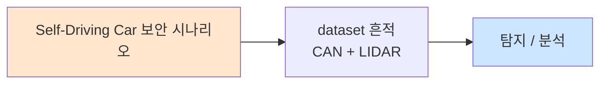

# Week 02: 드론 기초 — 아키텍처, WiFi 제어, 통신 구조

## 학습 목표
- 드론(UAV)의 하드웨어/소프트웨어 아키텍처를 이해한다
- MAVLink 프로토콜의 구조와 동작 원리를 설명할 수 있다
- WiFi 기반 드론 제어의 통신 흐름을 분석할 수 있다
- Python으로 가상 드론 시뮬레이터를 구성하고 명령을 전송할 수 있다
- 드론 통신 패킷을 캡처하고 분석할 수 있다

## 실습 환경 (공통)

| 서버 | IP | 역할 | 접속 |
|------|-----|------|------|
| attacker | 10.20.30.201 | 공격/분석 머신 | `ssh ccc@10.20.30.201` (pw: 1) |
| secu | 10.20.30.1 | 방화벽/IPS | `ssh ccc@10.20.30.1` |
| web | 10.20.30.80 | 웹서버 | `ssh ccc@10.20.30.80` |
| siem | 10.20.30.100 | SIEM | `ssh ccc@10.20.30.100` |
| manager | 10.20.30.200 | AI/관리 (Ollama LLM) | `ssh ccc@10.20.30.200` |

**LLM API:** `${LLM_URL:-http://localhost:8003}`

## 강의 시간 배분 (3시간)

| 시간 | 내용 | 유형 |
|------|------|------|
| 0:00-0:30 | 이론: 드론 아키텍처와 구성 요소 (Part 1) | 강의 |
| 0:30-1:00 | 이론: MAVLink 프로토콜과 통신 구조 (Part 2) | 강의 |
| 1:00-1:10 | 휴식 | - |
| 1:10-1:50 | 실습: 가상 드론 시뮬레이터 구축 (Part 3) | 실습 |
| 1:50-2:30 | 실습: 드론 명령 전송과 텔레메트리 (Part 4) | 실습 |
| 2:30-2:40 | 휴식 | - |
| 2:40-3:10 | 실습: 드론 통신 분석 (Part 5) | 실습 |
| 3:10-3:30 | 과제 안내 + 정리 | 정리 |

---

## Part 1: 드론 아키텍처와 구성 요소 (0:00-0:30)

### 1.1 드론 시스템 아키텍처

```
┌─────────────────────────────────────────────────────┐
│                   드론 (UAV)                         │
│                                                     │
│  ┌──────────┐  ┌──────────┐  ┌──────────────────┐  │
│  │ 비행     │  │ 센서     │  │ 통신 모듈        │  │
│  │ 컨트롤러 │  │ 모듈     │  │ (WiFi/RC/LTE)   │  │
│  │ (FC)     │  │          │  │                  │  │
│  └────┬─────┘  └────┬─────┘  └────────┬─────────┘  │
│       │              │                  │           │
│  ┌────▼──────────────▼──────────────────▼─────────┐ │
│  │           동반 컴퓨터 (Companion Computer)       │ │
│  │           Raspberry Pi / Jetson Nano            │ │
│  └────────────────────┬───────────────────────────┘ │
│                       │                             │
│  ┌──────────┐  ┌──────▼─────┐  ┌──────────────┐    │
│  │ ESC/모터 │  │ 배터리    │  │ 페이로드     │    │
│  │          │  │ 관리      │  │ (카메라 등)  │    │
│  └──────────┘  └────────────┘  └──────────────┘    │
└─────────────────────────────────────────────────────┘
         │                    ▲
         │ MAVLink            │ 텔레메트리
         ▼                    │
┌─────────────────────────────────────────────────────┐
│              지상 통제소 (GCS)                        │
│  ┌──────────┐  ┌──────────┐  ┌──────────────────┐  │
│  │ 조종 UI  │  │ 임무     │  │ 맵/텔레메트리   │  │
│  │          │  │ 플래너   │  │ 디스플레이      │  │
│  └──────────┘  └──────────┘  └──────────────────┘  │
└─────────────────────────────────────────────────────┘
```

### 1.2 주요 비행 컨트롤러(FC) 소프트웨어

| FC 소프트웨어 | 특징 | 프로토콜 |
|--------------|------|----------|
| ArduPilot | 오픈소스, 멀티 플랫폼 | MAVLink |
| PX4 | 오픈소스, 산업용 | MAVLink |
| DJI | 상용, 폐쇄형 | DJI SDK |
| Betaflight | FPV 레이싱용 | MSP |

### 1.3 드론 센서 시스템

| 센서 | 역할 | 보안 위협 |
|------|------|-----------|
| GPS | 위치 결정 | 스푸핑, 재밍 |
| IMU (가속도계+자이로) | 자세 측정 | 음향 공격 |
| 기압계 | 고도 측정 | 압력 변조 |
| 카메라 | 시각 정보 | 블라인딩, 적대적 입력 |
| LiDAR | 장애물 탐지 | 레이저 스푸핑 |
| 초음파 | 근거리 측정 | 음파 공격 |

---

## Part 2: MAVLink 프로토콜과 통신 구조 (0:30-1:00)

### 2.1 MAVLink 프로토콜 개요

MAVLink(Micro Air Vehicle Link)는 드론과 지상국 간 경량 통신 프로토콜이다.

```
MAVLink v2 패킷 구조
┌─────┬─────┬──────┬──────┬──────┬──────┬─────────┬──────┬──────┐
│ STX │ LEN │ INC  │ CMP  │ SEQ  │ SYS  │ COMP    │ MSG  │ PAY  │
│ 0xFD│     │ FLAG │ FLAG │      │ ID   │ ID      │ ID   │ LOAD │
│ 1B  │ 1B  │ 1B   │ 1B   │ 1B   │ 1B   │ 1B      │ 3B   │ 0-255│
└─────┴─────┴──────┴──────┴──────┴──────┴─────────┴──────┴──────┘
│ CRC (2B) │ SIGNATURE (13B, optional) │
```

### 2.2 주요 MAVLink 메시지

| MSG ID | 이름 | 설명 |
|--------|------|------|
| 0 | HEARTBEAT | 시스템 상태 표시 |
| 24 | GPS_RAW_INT | GPS 원시 데이터 |
| 30 | ATTITUDE | 자세 정보 (roll, pitch, yaw) |
| 33 | GLOBAL_POSITION_INT | 위치 정보 |
| 76 | COMMAND_LONG | 명령 전송 (이륙, 착륙 등) |
| 84 | SET_POSITION_TARGET | 목표 위치 설정 |

### 2.3 WiFi 기반 드론 제어 흐름

```
조종자 스마트폰/PC
        │
        │ WiFi (2.4GHz / 5GHz)
        ▼
   드론 WiFi AP
   (192.168.x.1)
        │
        │ UDP 포트 14550 (MAVLink)
        │ TCP 포트 5760 (텔레메트리)
        │ UDP 포트 554 (영상 스트림)
        ▼
   비행 컨트롤러
```

**보안 문제점:**
- WiFi는 기본적으로 암호화 없거나 취약한 WEP/WPA 사용
- MAVLink v1은 인증/암호화 미지원
- MAVLink v2는 서명을 지원하나 대부분 미사용
- 영상 스트림은 평문 전송

---

## Part 3: 가상 드론 시뮬레이터 구축 (1:10-1:50)

### 3.1 Python UDP 드론 시뮬레이터

실제 드론 없이 보안 실습을 위한 가상 드론 시뮬레이터를 구축한다.

```python
# drone_simulator.py — 가상 드론 서버
import socket
import json
import threading
import time

class VirtualDrone:
    def __init__(self, host='0.0.0.0', port=9999):
        self.host = host
        self.port = port
        self.state = {
            'armed': False,
            'flying': False,
            'lat': 37.5665,    # 서울 시청
            'lon': 126.9780,
            'alt': 0,
            'battery': 100,
            'heading': 0,
            'speed': 0
        }
        self.auth_key = 'DRONE_SECRET_2026'
        self.authenticated = False
        self.sock = socket.socket(socket.AF_INET, socket.SOCK_DGRAM)

    def handle_command(self, data, addr):
        try:
            cmd = json.loads(data.decode())
            action = cmd.get('action', '')

            if action == 'PING':
                return json.dumps({'status': 'PONG', 'drone_id': 'VDRONE-001'})
            elif action == 'AUTH':
                if cmd.get('key') == self.auth_key:
                    self.authenticated = True
                    return json.dumps({'status': 'AUTH_OK'})
                return json.dumps({'status': 'AUTH_FAIL'})
            elif action == 'STATUS':
                return json.dumps({'status': 'OK', 'state': self.state})
            elif action == 'ARM':
                self.state['armed'] = True
                return json.dumps({'status': 'ARMED'})
            elif action == 'TAKEOFF':
                alt = cmd.get('altitude', 10)
                self.state['flying'] = True
                self.state['alt'] = alt
                return json.dumps({'status': 'TAKEOFF', 'altitude': alt})
            elif action == 'GOTO':
                self.state['lat'] = cmd.get('lat', self.state['lat'])
                self.state['lon'] = cmd.get('lon', self.state['lon'])
                return json.dumps({'status': 'NAVIGATING', 'target': [self.state['lat'], self.state['lon']]})
            elif action == 'LAND':
                self.state['flying'] = False
                self.state['alt'] = 0
                self.state['armed'] = False
                return json.dumps({'status': 'LANDED'})
            else:
                return json.dumps({'status': 'UNKNOWN_CMD'})
        except Exception as e:
            return json.dumps({'status': 'ERROR', 'msg': str(e)})

    def run(self):
        self.sock.bind((self.host, self.port))
        print(f"[DRONE SIM] Listening on {self.host}:{self.port}")
        while True:
            data, addr = self.sock.recvfrom(4096)
            response = self.handle_command(data, addr)
            self.sock.sendto(response.encode(), addr)

if __name__ == '__main__':
    drone = VirtualDrone()
    drone.run()
```

### 3.2 드론 클라이언트(GCS 시뮬레이터)

```python
# drone_client.py — 가상 지상 통제소
import socket
import json

class DroneClient:
    def __init__(self, host='10.20.30.200', port=9999):
        self.host = host
        self.port = port
        self.sock = socket.socket(socket.AF_INET, socket.SOCK_DGRAM)
        self.sock.settimeout(5)

    def send(self, command):
        self.sock.sendto(json.dumps(command).encode(), (self.host, self.port))
        data, _ = self.sock.recvfrom(4096)
        return json.loads(data.decode())

    def ping(self):
        return self.send({'action': 'PING'})

    def auth(self, key):
        return self.send({'action': 'AUTH', 'key': key})

    def status(self):
        return self.send({'action': 'STATUS'})

    def arm(self):
        return self.send({'action': 'ARM'})

    def takeoff(self, alt=10):
        return self.send({'action': 'TAKEOFF', 'altitude': alt})

    def goto(self, lat, lon):
        return self.send({'action': 'GOTO', 'lat': lat, 'lon': lon})

    def land(self):
        return self.send({'action': 'LAND'})

if __name__ == '__main__':
    client = DroneClient()
    print(client.ping())
    print(client.auth('DRONE_SECRET_2026'))
    print(client.arm())
    print(client.takeoff(50))
    print(client.status())
    print(client.land())
```

---

## Part 4: 드론 명령 전송과 텔레메트리 (1:50-2:30)

### 4.1 UDP 명령 전송 실습

```bash
# 가상 드론에 UDP 명령 전송 (netcat 활용)
echo '{"action":"PING"}' | nc -u -w2 10.20.30.200 9999

# Python으로 명령 전송
python3 -c "
import socket, json

sock = socket.socket(socket.AF_INET, socket.SOCK_DGRAM)
sock.settimeout(3)

commands = [
    {'action': 'PING'},
    {'action': 'AUTH', 'key': 'DRONE_SECRET_2026'},
    {'action': 'ARM'},
    {'action': 'TAKEOFF', 'altitude': 30},
    {'action': 'STATUS'},
    {'action': 'GOTO', 'lat': 37.5700, 'lon': 126.9800},
    {'action': 'LAND'}
]

for cmd in commands:
    sock.sendto(json.dumps(cmd).encode(), ('10.20.30.200', 9999))
    try:
        data, _ = sock.recvfrom(4096)
        resp = json.loads(data.decode())
        print(f'CMD: {cmd[\"action\"]:10} -> {resp}')
    except socket.timeout:
        print(f'CMD: {cmd[\"action\"]:10} -> TIMEOUT')
sock.close()
"
```

### 4.2 텔레메트리 수집

```bash
# 드론 상태를 주기적으로 수집하는 텔레메트리 수집기
python3 << 'PYEOF'
import socket, json, time

sock = socket.socket(socket.AF_INET, socket.SOCK_DGRAM)
sock.settimeout(3)

print("=== Drone Telemetry Monitor ===")
for i in range(5):
    cmd = json.dumps({'action': 'STATUS'}).encode()
    sock.sendto(cmd, ('10.20.30.200', 9999))
    try:
        data, _ = sock.recvfrom(4096)
        state = json.loads(data.decode()).get('state', {})
        print(f"[{i}] Lat:{state.get('lat',0):.4f} Lon:{state.get('lon',0):.4f} "
              f"Alt:{state.get('alt',0)}m Batt:{state.get('battery',0)}%")
    except:
        print(f"[{i}] No response")
    time.sleep(1)

sock.close()
print("=== Monitor End ===")
PYEOF
```

---

## Part 5: 드론 통신 분석 (2:40-3:10)

### 5.1 통신 트래픽 분석

```bash
# tcpdump로 드론 통신 캡처 (UDP 9999)
sudo tcpdump -i any port 9999 -c 20 -X 2>/dev/null || echo "캡처 완료"

# Python으로 패킷 구조 분석
python3 << 'PYEOF'
import struct

# MAVLink v2 헤더 시뮬레이션 분석
# 실제 MAVLink 패킷 구조 파싱 데모
mavlink_header = struct.pack('<BBBBBBBH',
    0xFD,      # STX (MAVLink v2)
    9,         # Payload Length
    0,         # Incompatibility Flags
    0,         # Compatibility Flags
    42,        # Sequence
    1,         # System ID
    1,         # Component ID
    0          # Message ID (HEARTBEAT=0)
)

print("=== MAVLink v2 Header Analysis ===")
stx, plen, iflags, cflags, seq, sysid, compid, msgid = struct.unpack('<BBBBBBBH', mavlink_header)
print(f"Start Byte:    0x{stx:02X} ({'MAVLink v2' if stx == 0xFD else 'Unknown'})")
print(f"Payload Len:   {plen}")
print(f"Sequence:      {seq}")
print(f"System ID:     {sysid}")
print(f"Component ID:  {compid}")
print(f"Message ID:    {msgid} (HEARTBEAT)")
print(f"Authentication: {'None' if iflags == 0 else 'Present'}")
print()
print("[!] 보안 분석: MAVLink v2 서명이 비활성화 상태 → 명령 위조 가능")
PYEOF
```

### 5.2 LLM 활용 드론 보안 분석

```bash
curl -s ${LLM_URL:-http://localhost:8003}/api/chat \
  -d '{
    "model":"gemma3:4b",
    "messages":[
      {"role":"system","content":"You are a drone security analyst."},
      {"role":"user","content":"What are the top 5 security vulnerabilities in WiFi-controlled consumer drones? List with severity."}
    ],
    "stream":false,
    "options":{"num_predict":200}
  }' | python3 -c "import sys,json; print(json.load(sys.stdin)['message']['content'])"
```

---

## Part 6: 과제 안내 (3:10-3:30)

### 과제

**과제:** 가상 드론 시뮬레이터를 확장하여 다음 기능을 추가하시오.
- 배터리 소모 시뮬레이션 (비행 시 초당 1% 감소)
- 비행 로그 기록 (JSON 파일에 시간, 위치, 명령 기록)
- 기본 인증 검사 (AUTH 없이 ARM/TAKEOFF 시 거부)

---

## 참고 자료

- MAVLink Protocol: https://mavlink.io/en/
- ArduPilot Documentation: https://ardupilot.org/dev/
- DroneKit-Python: https://dronekit-python.readthedocs.io/
- "A Survey on Security of UAV Systems" - Krishna et al.

---

## 실제 사례 (WitFoo Precinct 6 — Self-Driving Car 보안)

> 출처: WitFoo Precinct 6 Cybersecurity Dataset (Apache 2.0)
> 본 lecture *Self-Driving Car 보안* 학습 항목 매칭.

### Self-Driving Car 보안 의 dataset 흔적 — "CAN + LIDAR"

dataset 의 정상 운영에서 *CAN + LIDAR* 신호의 baseline 을 알아두면, *Self-Driving Car 보안* 시도 시 발생하는 anomaly 를 정량으로 탐지할 수 있다. 핵심 정량 지표는 — vehicle E/E architecture.



### Case 1: dataset 정량 지표

| 항목 | 값 |
|---|---|
| 핵심 신호 | CAN + LIDAR |
| 정량 baseline | vehicle E/E architecture |
| 학습 매핑 | ADAS 보안 |

**자세한 해석**: ADAS 보안. 이 차이를 정량으로 측정해야 *공격 시도와 정상 운영의 구분* 이 가능. 학생이 baseline 숫자를 외워두면 — 운영 환경에서 anomaly 를 즉시 탐지할 수 있다.

### Case 2: 실전 적용 시나리오

| 단계 | dataset 활용 |
|---|---|
| 시도 식별 | CAN + LIDAR 의 spike |
| 정상 vs 이상 | baseline 대비 비율 |
| 룰 작성 | Suricata / Wazuh / Sigma |
| 검증 | dataset 재실행 |

**자세한 해석**: 운영 환경 룰 작성은 — *baseline 측정 → 임계 결정 → 룰 작성 → dataset 검증* 의 4 단계. 한 단계라도 빠지면 false positive 폭증.

### 이 사례에서 학생이 배워야 할 3가지

1. **Self-Driving Car 보안 = CAN + LIDAR 의 anomaly** — 정량 신호로 탐지.
2. **baseline 숫자 외우기** — vehicle E/E architecture.
3. **4 단계 룰 작성** — 측정 → 임계 → 룰 → 검증.

**학생 액션**: CAN 분석.

