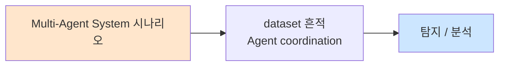

# Week 10: ROS2 보안 — DDS, 토픽 스니핑, 명령 인젝션

## 학습 목표
- DDS 프로토콜의 보안 취약점을 심층 분석할 수 있다
- ROS2 토픽 스니핑과 명령 인젝션 공격을 실습할 수 있다
- ROS2 DDS Security 플러그인을 구성하고 적용할 수 있다
- 로봇 통신에 대한 IDS 규칙을 작성할 수 있다
- ROS2 보안 아키텍처를 설계할 수 있다

## 실습 환경 (공통)

| 서버 | IP | 역할 | 접속 |
|------|-----|------|------|
| attacker | 10.20.30.201 | 공격/분석 머신 | `ssh ccc@10.20.30.201` (pw: 1) |
| secu | 10.20.30.1 | 방화벽/IPS | `ssh ccc@10.20.30.1` |
| web | 10.20.30.80 | 웹서버 | `ssh ccc@10.20.30.80` |
| siem | 10.20.30.100 | SIEM | `ssh ccc@10.20.30.100` |
| manager | 10.20.30.200 | AI/관리 (Ollama LLM) | `ssh ccc@10.20.30.200` |

**LLM API:** `${LLM_URL:-http://localhost:8003}`

## 강의 시간 배분 (3시간)

| 시간 | 내용 | 유형 |
|------|------|------|
| 0:00-0:30 | 이론: DDS 프로토콜 심층 분석 (Part 1) | 강의 |
| 0:30-1:00 | 이론: ROS2 공격 벡터 (Part 2) | 강의 |
| 1:00-1:10 | 휴식 | - |
| 1:10-1:50 | 실습: ROS2 토픽 스니핑 (Part 3) | 실습 |
| 1:50-2:30 | 실습: ROS2 명령 인젝션 (Part 4) | 실습 |
| 2:30-2:40 | 휴식 | - |
| 2:40-3:10 | 실습: ROS2 보안 강화 (Part 5) | 실습 |
| 3:10-3:30 | 과제 안내 + 정리 | 정리 |

---

## Part 1: DDS 프로토콜 심층 분석 (0:00-0:30)

### 1.1 DDS 통신 계층

```
DDS 프로토콜 스택
┌─────────────────────────────────────┐
│  Application (ROS2 Node)            │
├─────────────────────────────────────┤
│  DCPS (Data-Centric Publish/Sub)    │
│  ├── Topic, DataWriter, DataReader  │
│  └── QoS Policy                     │
├─────────────────────────────────────┤
│  RTPS (Real-Time Publish Subscribe) │
│  ├── SPDP (Discovery - multicast)   │
│  ├── SEDP (Endpoint Discovery)      │
│  └── Data Exchange (unicast)        │
├─────────────────────────────────────┤
│  UDP / TCP Transport                │
│  ├── Multicast: 239.255.0.1:7400    │
│  └── Unicast: dynamic ports         │
└─────────────────────────────────────┘
```

### 1.2 DDS Discovery 프로세스

```
Discovery 과정 (보안 취약점):

1. SPDP (Simple Participant Discovery)
   - 멀티캐스트(239.255.0.1:7400)로 참여자 공지
   - 모든 네트워크 참여자가 수신 가능
   → 공격자: 네트워크 정찰 가능

2. SEDP (Simple Endpoint Discovery)
   - 토픽, 타입, QoS 정보 교환
   - 어떤 데이터가 발행/구독되는지 노출
   → 공격자: 공격 대상 토픽 식별

3. Data Exchange
   - 매칭된 엔드포인트 간 데이터 교환
   - 기본: 평문 UDP
   → 공격자: 데이터 스니핑/인젝션
```

### 1.3 DDS 보안 (DDS Security)

```
DDS Security 플러그인 구조:
┌─────────────────────────────────────┐
│  Authentication     — PKI 기반 인증  │
│  Access Control     — 토픽별 접근제어 │
│  Cryptographic      — 암호화/서명    │
│  Logging            — 보안 감사 로그  │
│  Data Tagging       — 데이터 태깅    │
└─────────────────────────────────────┘

문제: 대부분의 ROS2 배포에서 보안 플러그인이 비활성화 상태
```

---

## Part 2: ROS2 공격 벡터 (0:30-1:00)

### 2.1 ROS2 공격 분류

| 공격 | 대상 | 방법 | 영향 |
|------|------|------|------|
| 토픽 스니핑 | DDS 토픽 | 멀티캐스트 수신 | 센서 데이터 유출 |
| 토픽 인젝션 | /cmd_vel 등 | 가짜 메시지 발행 | 로봇 제어 탈취 |
| 서비스 사칭 | ROS2 서비스 | 가짜 서비스 응답 | 잘못된 결과 |
| 파라미터 변조 | 노드 파라미터 | 파라미터 서비스 호출 | 동작 변경 |
| 노드 스푸핑 | 노드 이름 | 동일 이름 노드 | 통신 교란 |
| DoS | DDS 네트워크 | 대량 메시지 발행 | 서비스 마비 |

### 2.2 주요 위험 토픽

```
위험 토픽 목록:
/cmd_vel          ← 이동 속도 명령 (가장 위험)
/joint_states     ← 관절 상태/제어
/gripper/command  ← 그리퍼 열기/닫기
/navigation/goal  ← 목표 위치
/emergency_stop   ← 긴급 정지
/arm/trajectory   ← 로봇 팔 궤적

정보 유출 토픽:
/camera/image     ← 카메라 영상
/scan             ← LiDAR 스캔
/odom             ← 위치 정보
/map              ← 환경 지도
/diagnostics      ← 시스템 진단
```

---

## Part 3: ROS2 토픽 스니핑 (1:10-1:50)

### 3.1 DDS Discovery 시뮬레이션

```bash
python3 << 'PYEOF'
import json
import random
from collections import defaultdict

class DDSDiscoverySimulator:
    """DDS Discovery 프로세스 시뮬레이터"""

    def __init__(self):
        self.participants = {}
        self.endpoints = defaultdict(list)

    def spdp_announce(self, participant_name, ip, domain_id=0):
        """SPDP 참여자 공지 시뮬레이션"""
        self.participants[participant_name] = {
            "ip": ip,
            "domain_id": domain_id,
            "guid": f"GUID_{hash(participant_name) % 10000:04d}"
        }
        return f"SPDP: {participant_name} announced on 239.255.0.1:7400"

    def sedp_discover(self, participant_name, topics):
        """SEDP 엔드포인트 발견 시뮬레이션"""
        for topic in topics:
            self.endpoints[participant_name].append(topic)
        return f"SEDP: {participant_name} publishes {topics}"

    def attacker_scan(self):
        """공격자 관점: 네트워크 스캔"""
        results = {
            "participants": self.participants,
            "topic_map": dict(self.endpoints),
        }
        return results

# DDS 네트워크 시뮬레이션
dds = DDSDiscoverySimulator()

# 로봇 노드들이 네트워크에 참여
print("=== DDS Discovery - Attacker Perspective ===")
print()
print("[Phase 1] SPDP - Participant Discovery (Multicast)")

nodes = [
    ("lidar_driver", "192.168.1.10", ["/scan", "/diagnostics"]),
    ("camera_node", "192.168.1.10", ["/camera/image", "/camera/depth"]),
    ("nav_controller", "192.168.1.10", ["/cmd_vel", "/odom", "/map"]),
    ("arm_controller", "192.168.1.10", ["/joint_states", "/arm/trajectory"]),
    ("safety_node", "192.168.1.10", ["/emergency_stop", "/robot_status"]),
]

for name, ip, topics in nodes:
    result = dds.spdp_announce(name, ip)
    print(f"  {result}")

print()
print("[Phase 2] SEDP - Endpoint Discovery")
for name, ip, topics in nodes:
    result = dds.sedp_discover(name, topics)
    print(f"  {result}")

print()
print("[Phase 3] Attacker Network Map")
scan = dds.attacker_scan()
print("  Discovered Participants:")
for name, info in scan['participants'].items():
    print(f"    {name}: IP={info['ip']} GUID={info['guid']}")
print()
print("  Topic Map:")
for node, topics in scan['topic_map'].items():
    for t in topics:
        risk = "CRITICAL" if t in ('/cmd_vel', '/arm/trajectory', '/emergency_stop') else \
               "HIGH" if t in ('/joint_states', '/gripper/command') else "MEDIUM"
        print(f"    [{risk:8}] {node} → {t}")

print()
print("[!] Full robot topology discovered without authentication!")
print("[!] Attack targets identified: /cmd_vel, /arm/trajectory")
PYEOF
```

### 3.2 토픽 데이터 스니핑

```bash
python3 << 'PYEOF'
import json
import random

print("=== ROS2 Topic Sniffing Simulation ===")
print()

# 스니핑된 토픽 데이터
sniffed_data = {
    "/scan": {
        "header": {"stamp": {"sec": 1700000000, "nanosec": 0}, "frame_id": "laser_frame"},
        "ranges": [random.uniform(0.3, 10.0) for _ in range(10)],
        "angle_min": -3.14,
        "angle_max": 3.14,
    },
    "/cmd_vel": {
        "linear": {"x": 0.5, "y": 0.0, "z": 0.0},
        "angular": {"x": 0.0, "y": 0.0, "z": 0.2},
    },
    "/odom": {
        "pose": {"position": {"x": 3.14, "y": 1.59, "z": 0.0},
                 "orientation": {"z": 0.174, "w": 0.985}},
        "twist": {"linear": {"x": 0.5}, "angular": {"z": 0.2}},
    },
    "/camera/image": {
        "width": 640, "height": 480, "encoding": "rgb8",
        "data_size": "921600 bytes",
    },
    "/robot_status": {
        "battery": 72, "state": "NAVIGATING",
        "uptime": 3600, "errors": [],
    },
}

for topic, data in sniffed_data.items():
    print(f"[SNIFFED] Topic: {topic}")
    print(f"  Data: {json.dumps(data, indent=2)[:200]}")
    print()

print("[Security Impact]")
print("  - Robot position tracked: x=3.14, y=1.59")
print("  - Current velocity known: 0.5 m/s")
print("  - Camera feed accessible: 640x480 RGB")
print("  - Battery level: 72% — robot mobility time estimated")
print("  - Environment map could be reconstructed from /scan data")
PYEOF
```

---

## Part 4: ROS2 명령 인젝션 (1:50-2:30)

### 4.1 /cmd_vel 인젝션 공격

```bash
python3 << 'PYEOF'
import json
import time

class ROS2Attacker:
    """ROS2 명령 인젝션 공격 시뮬레이터"""

    def __init__(self):
        self.injected = []

    def inject_cmd_vel(self, linear_x, angular_z, note=""):
        """속도 명령 인젝션"""
        msg = {
            "topic": "/cmd_vel",
            "data": {
                "linear": {"x": linear_x, "y": 0.0, "z": 0.0},
                "angular": {"x": 0.0, "y": 0.0, "z": angular_z}
            },
            "injected_by": "attacker",
            "note": note,
        }
        self.injected.append(msg)
        return msg

    def inject_emergency_stop(self, cancel=False):
        """긴급 정지 명령 인젝션"""
        msg = {
            "topic": "/emergency_stop",
            "data": {"stop": not cancel},
            "injected_by": "attacker",
        }
        self.injected.append(msg)
        return msg

    def inject_navigation_goal(self, x, y, theta):
        """목표 위치 인젝션"""
        msg = {
            "topic": "/navigation/goal",
            "data": {"x": x, "y": y, "theta": theta},
            "injected_by": "attacker",
        }
        self.injected.append(msg)
        return msg

attacker = ROS2Attacker()

print("=== ROS2 Command Injection Attack ===")
print()

# 공격 1: 로봇 급정지
print("[Attack 1] Emergency Stop Injection")
msg = attacker.inject_emergency_stop()
print(f"  Injected: {json.dumps(msg['data'])}")
print(f"  Effect: Robot immediately stops all motion")
print(f"  Risk: Could cause collisions in multi-robot environment")
print()

# 공격 2: 속도 명령 변조
print("[Attack 2] Velocity Command Injection")
attacks = [
    (2.0, 0.0, "Full speed forward — collision risk"),
    (-1.0, 0.0, "Reverse — unexpected backward motion"),
    (0.0, 3.14, "Spin in place — disorientation"),
    (1.5, 1.0, "Erratic movement — spiral path"),
]
for vx, wz, note in attacks:
    msg = attacker.inject_cmd_vel(vx, wz, note)
    print(f"  [INJECT] linear.x={vx:+.1f} angular.z={wz:+.2f} — {note}")
print()

# 공격 3: 목표 위치 변경
print("[Attack 3] Navigation Goal Hijack")
msg = attacker.inject_navigation_goal(99.0, 99.0, 0)
print(f"  Injected goal: x=99.0, y=99.0")
print(f"  Effect: Robot navigates to attacker-chosen location")
print()

# 공격 4: 센서 데이터 위조
print("[Attack 4] Fake Sensor Data Injection")
fake_scan = {"topic": "/scan", "ranges": [0.1] * 360, "note": "All obstacles very close"}
print(f"  Injected fake LiDAR data: all ranges = 0.1m")
print(f"  Effect: Robot thinks surrounded by obstacles → stuck/emergency stop")
print()

print(f"=== Total injected messages: {len(attacker.injected)} ===")
print()
print("[Lesson] All attacks possible because:")
print("  1. DDS has no authentication by default")
print("  2. Any node can publish to any topic")
print("  3. No message signing or integrity check")
print("  4. Multicast allows easy topic discovery")
PYEOF
```

---

## Part 5: ROS2 보안 강화 (2:40-3:10)

### 5.1 DDS Security 설정 시뮬레이션

```bash
python3 << 'PYEOF'
import json

class ROS2SecurityConfig:
    """ROS2 DDS Security 설정 생성기"""

    def __init__(self):
        self.permissions = {}
        self.governance = {}

    def generate_governance(self):
        """거버넌스 XML 설정 생성"""
        return {
            "domain_access_rules": {
                "domain_id": 0,
                "allow_unauthenticated_participants": False,
                "enable_discovery_protection": True,
                "enable_liveliness_protection": True,
                "enable_read_access_control": True,
                "enable_write_access_control": True,
                "topic_rules": [
                    {"topic": "/cmd_vel", "enable_write_access": True, "enable_read_access": True,
                     "metadata_protection": "ENCRYPT", "data_protection": "ENCRYPT"},
                    {"topic": "/scan", "enable_write_access": True, "enable_read_access": True,
                     "metadata_protection": "SIGN", "data_protection": "NONE"},
                    {"topic": "/emergency_stop", "enable_write_access": True, "enable_read_access": True,
                     "metadata_protection": "ENCRYPT", "data_protection": "ENCRYPT"},
                ]
            }
        }

    def generate_permissions(self, node_name, allowed_topics):
        """노드별 권한 설정 생성"""
        return {
            "node": node_name,
            "subject_name": f"CN={node_name},O=RobotOrg",
            "validity": {"not_before": "2024-01-01T00:00:00", "not_after": "2026-12-31T23:59:59"},
            "allow": [
                {"publish": [t for t in allowed_topics if t.startswith("pub:")]},
                {"subscribe": [t for t in allowed_topics if t.startswith("sub:")]},
            ],
            "deny": [{"publish": ["*"], "subscribe": ["*"]}]
        }

sec = ROS2SecurityConfig()

print("=== ROS2 DDS Security Configuration ===")
print()

# 거버넌스 설정
gov = sec.generate_governance()
print("[Governance Policy]")
print(f"  Unauthenticated participants: {'DENIED' if not gov['domain_access_rules']['allow_unauthenticated_participants'] else 'ALLOWED'}")
print(f"  Discovery protection: {'ENABLED' if gov['domain_access_rules']['enable_discovery_protection'] else 'DISABLED'}")
print()
print("  Topic Security Policies:")
for rule in gov['domain_access_rules']['topic_rules']:
    print(f"    {rule['topic']:<20} Data:{rule['data_protection']:<10} Meta:{rule['metadata_protection']}")
print()

# 노드별 권한
print("[Node Permissions]")
node_perms = {
    "nav_controller": ["pub:/cmd_vel", "sub:/scan", "sub:/odom", "pub:/map"],
    "lidar_driver": ["pub:/scan", "pub:/diagnostics"],
    "camera_node": ["pub:/camera/image", "pub:/camera/depth"],
    "safety_node": ["pub:/emergency_stop", "sub:/robot_status", "sub:/cmd_vel"],
}

for node, perms in node_perms.items():
    print(f"  {node}:")
    pub = [p.replace("pub:/","") for p in perms if p.startswith("pub:")]
    sub = [p.replace("sub:/","") for p in perms if p.startswith("sub:")]
    print(f"    Publish:   {', '.join(pub)}")
    print(f"    Subscribe: {', '.join(sub)}")
print()

# 보안 적용 전후 비교
print("[Security Comparison]")
print(f"  {'Attack':<30} {'Before':>10} {'After':>10}")
print(f"  {'-'*30} {'-'*10} {'-'*10}")
attacks = [
    ("Topic Sniffing", "POSSIBLE", "BLOCKED"),
    ("Command Injection", "POSSIBLE", "BLOCKED"),
    ("Discovery Scan", "POSSIBLE", "BLOCKED"),
    ("Node Spoofing", "POSSIBLE", "BLOCKED"),
    ("Parameter Tampering", "POSSIBLE", "BLOCKED"),
]
for attack, before, after in attacks:
    print(f"  {attack:<30} {before:>10} {after:>10}")
PYEOF
```

---

## Part 6: 과제 안내 (3:10-3:30)

### 과제

**과제:** ROS2 로봇 보안 감사 보고서를 작성하시오.
- DDS Discovery를 통한 네트워크 정찰 결과
- 위험 토픽 식별 및 인젝션 테스트 결과
- DDS Security 적용 방안 (거버넌스, 퍼미션)
- 네트워크 세그멘테이션 설계

---

## 참고 자료

- ROS2 Security Design: https://design.ros2.org/articles/ros2_dds_security.html
- DDS Security Specification v1.1: OMG
- "ROS2 Robot Vulnerabilities" - Alias Robotics
- SROS2 (Secure ROS2): https://github.com/ros2/sros2

---

## 실제 사례 (WitFoo Precinct 6 — Multi-Agent System)

> 출처: WitFoo Precinct 6 Cybersecurity Dataset (Apache 2.0)
> 본 lecture *Multi-Agent System* 학습 항목 매칭.

### Multi-Agent System 의 dataset 흔적 — "Agent coordination"

dataset 의 정상 운영에서 *Agent coordination* 신호의 baseline 을 알아두면, *Multi-Agent System* 시도 시 발생하는 anomaly 를 정량으로 탐지할 수 있다. 핵심 정량 지표는 — MAS 통신 보안.



### Case 1: dataset 정량 지표

| 항목 | 값 |
|---|---|
| 핵심 신호 | Agent coordination |
| 정량 baseline | MAS 통신 보안 |
| 학습 매핑 | agent protocol |

**자세한 해석**: agent protocol. 이 차이를 정량으로 측정해야 *공격 시도와 정상 운영의 구분* 이 가능. 학생이 baseline 숫자를 외워두면 — 운영 환경에서 anomaly 를 즉시 탐지할 수 있다.

### Case 2: 실전 적용 시나리오

| 단계 | dataset 활용 |
|---|---|
| 시도 식별 | Agent coordination 의 spike |
| 정상 vs 이상 | baseline 대비 비율 |
| 룰 작성 | Suricata / Wazuh / Sigma |
| 검증 | dataset 재실행 |

**자세한 해석**: 운영 환경 룰 작성은 — *baseline 측정 → 임계 결정 → 룰 작성 → dataset 검증* 의 4 단계. 한 단계라도 빠지면 false positive 폭증.

### 이 사례에서 학생이 배워야 할 3가지

1. **Multi-Agent System = Agent coordination 의 anomaly** — 정량 신호로 탐지.
2. **baseline 숫자 외우기** — MAS 통신 보안.
3. **4 단계 룰 작성** — 측정 → 임계 → 룰 → 검증.

**학생 액션**: MAS sim.

