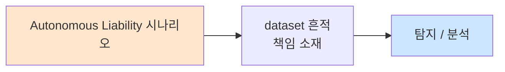

# Week 12: V2X/자동차 보안 — CAN 버스, ECU, 커넥티드카

## 학습 목표
- V2X(Vehicle-to-Everything) 통신의 구조와 보안 위협을 이해한다
- CAN 버스의 동작 원리와 보안 취약점을 심층 분석할 수 있다
- ECU 아키텍처와 자동차 네트워크 토폴로지를 설명할 수 있다
- python-can으로 CAN 메시지를 생성하고 분석할 수 있다
- 커넥티드카의 원격 공격 표면을 매핑할 수 있다

## 실습 환경 (공통)

| 서버 | IP | 역할 | 접속 |
|------|-----|------|------|
| attacker | 10.20.30.201 | 공격/분석 머신 | `ssh ccc@10.20.30.201` (pw: 1) |
| secu | 10.20.30.1 | 방화벽/IPS | `ssh ccc@10.20.30.1` |
| web | 10.20.30.80 | 웹서버 | `ssh ccc@10.20.30.80` |
| siem | 10.20.30.100 | SIEM | `ssh ccc@10.20.30.100` |
| manager | 10.20.30.200 | AI/관리 (Ollama LLM) | `ssh ccc@10.20.30.200` |

**LLM API:** `${LLM_URL:-http://localhost:8003}`

## 강의 시간 배분 (3시간)

| 시간 | 내용 | 유형 |
|------|------|------|
| 0:00-0:30 | 이론: 자동차 네트워크 아키텍처 (Part 1) | 강의 |
| 0:30-1:00 | 이론: V2X 통신과 보안 (Part 2) | 강의 |
| 1:00-1:10 | 휴식 | - |
| 1:10-1:50 | 실습: CAN 버스 시뮬레이션과 분석 (Part 3) | 실습 |
| 1:50-2:30 | 실습: CAN 공격과 방어 (Part 4) | 실습 |
| 2:30-2:40 | 휴식 | - |
| 2:40-3:10 | 실습: 커넥티드카 공격 표면 분석 (Part 5) | 실습 |
| 3:10-3:30 | 과제 안내 + 정리 | 정리 |

---

## Part 1: 자동차 네트워크 아키텍처 (0:00-0:30)

### 1.1 차량 내부 네트워크

```
┌──────────────────────────────────────────────────────┐
│                  차량 네트워크 아키텍처                 │
│                                                      │
│  ┌──────────┐  ┌──────────┐  ┌──────────────────┐   │
│  │ 파워트레인│  │ 섀시     │  │ 인포테인먼트     │   │
│  │ 도메인    │  │ 도메인   │  │ 도메인           │   │
│  │          │  │          │  │                  │   │
│  │ 엔진 ECU │  │ ABS ECU  │  │ 헤드유닛 (IVI)  │   │
│  │ 변속기ECU│  │ ESC ECU  │  │ 네비게이션       │   │
│  │ 배터리ECU│  │ 에어백ECU│  │ WiFi/BT 모듈    │   │
│  └────┬─────┘  └────┬─────┘  └────────┬─────────┘   │
│       │              │                  │             │
│  ═════╪══════════════╪══════════════════╪═════════    │
│       │    CAN Bus (High Speed 500kbps) │             │
│  ═════╪══════════════╪══════════════════╪═════════    │
│       │              │                  │             │
│  ┌────▼──────────────▼──────────────────▼─────────┐  │
│  │            Central Gateway ECU                  │  │
│  │  (도메인 간 통신 중재, 방화벽 역할)              │  │
│  └──────────────────┬─────────────────────────────┘  │
│                     │                                │
│  ┌──────────┐  ┌────▼─────┐  ┌──────────────────┐   │
│  │ ADAS     │  │ 텔레매틱스│  │ OBD-II 포트     │   │
│  │ 도메인   │  │ 도메인   │  │ (진단)           │   │
│  │          │  │          │  │                  │   │
│  │ 카메라   │  │ 4G/5G   │  │ CAN 직접 접근    │   │
│  │ 레이더   │  │ V2X     │  │                  │   │
│  │ LiDAR   │  │ GPS     │  │                  │   │
│  └──────────┘  └──────────┘  └──────────────────┘   │
└──────────────────────────────────────────────────────┘
```

### 1.2 CAN 버스 프레임 구조

```
CAN 2.0A Standard Frame
┌─────┬─────┬─────┬────┬──────────┬─────┬─────┬─────┬─────┐
│ SOF │ ID  │ RTR │ IDE│ DLC      │DATA │ CRC │ ACK │ EOF │
│ 1b  │ 11b │ 1b  │ 1b │ 4b       │0-8B │ 15b │ 2b  │ 7b  │
└─────┴─────┴─────┴────┴──────────┴─────┴─────┴─────┴─────┘

ID: 중재 ID (낮을수록 높은 우선순위)
DLC: Data Length Code (0-8 bytes)
DATA: 최대 8 바이트 페이로드
CRC: 15-bit CRC

CAN FD (Flexible Data-rate):
  - 최대 64 바이트 데이터
  - 최대 8 Mbps 속도
  - 하위 호환
```

### 1.3 차량 ECU 통신 예시

| CAN ID | ECU | 데이터 | 의미 |
|--------|-----|--------|------|
| 0x100 | 엔진 | RPM, 속도, 온도 | 엔진 상태 |
| 0x200 | 브레이크 | 압력, ABS 상태 | 제동 제어 |
| 0x300 | 조향 | 각도, 토크 | 조향 제어 |
| 0x400 | 에어백 | 센서, 전개상태 | 안전 장치 |
| 0x500 | ADAS | 객체, 차선 | 자율주행 |
| 0x600 | 변속기 | 기어, 토크 | 변속 제어 |
| 0x7DF | OBD-II | 진단 요청 | 표준 진단 |

---

## Part 2: V2X 통신과 보안 (0:30-1:00)

### 2.1 V2X 통신 유형

```
V2X (Vehicle-to-Everything)
│
├── V2V (Vehicle-to-Vehicle)
│   ├── 충돌 회피
│   ├── 군집 주행
│   └── 긴급 브레이크 경고
│
├── V2I (Vehicle-to-Infrastructure)
│   ├── 신호등 정보
│   ├── 도로 상태
│   └── 속도 제한
│
├── V2P (Vehicle-to-Pedestrian)
│   ├── 보행자 감지
│   └── 스쿨존 경고
│
├── V2N (Vehicle-to-Network)
│   ├── 클라우드 서비스
│   ├── OTA 업데이트
│   └── 원격 진단
│
└── V2G (Vehicle-to-Grid)
    ├── 충전 관리
    └── 에너지 거래
```

### 2.2 V2X 보안 위협

| 위협 | 설명 | 영향 |
|------|------|------|
| 메시지 위조 | 가짜 V2V/V2I 메시지 | 잘못된 주행 판단 |
| 리플레이 | 이전 메시지 재전송 | 시간 지연된 정보 |
| Sybil 공격 | 다수의 가짜 차량 생성 | 교통 혼란 |
| 위치 위조 | 가짜 GPS 위치 | 잘못된 충돌 경고 |
| DoS | 대량 메시지 | 통신 마비 |
| 프라이버시 | 차량 추적 | 이동 경로 감시 |

---

## Part 3: CAN 버스 시뮬레이션과 분석 (1:10-1:50)

### 3.1 가상 CAN 버스 시뮬레이터

```bash
python3 << 'PYEOF'
import struct
import random
import time

class VirtualCANBus:
    """가상 CAN 버스 (python-can 대체)"""

    def __init__(self):
        self.messages = []
        self.filters = []

    def send(self, arb_id, data, dlc=8):
        msg = {
            "timestamp": time.time(),
            "arbitration_id": arb_id,
            "data": data[:dlc],
            "dlc": dlc,
            "is_extended_id": arb_id > 0x7FF,
        }
        self.messages.append(msg)
        return msg

    def recv(self, timeout=1.0):
        if self.messages:
            return self.messages.pop(0)
        return None

    def set_filters(self, filters):
        self.filters = filters

class VirtualVehicle:
    """가상 차량 ECU 시뮬레이터"""

    def __init__(self, bus):
        self.bus = bus
        self.speed = 60  # km/h
        self.rpm = 2500
        self.steering = 0
        self.brake = 0
        self.gear = 4

    def engine_ecu_broadcast(self):
        """엔진 ECU: 속도, RPM"""
        speed_bytes = struct.pack('>H', self.speed * 100)
        rpm_bytes = struct.pack('>H', self.rpm)
        data = speed_bytes + rpm_bytes + bytes(4)
        return self.bus.send(0x100, data)

    def brake_ecu_broadcast(self):
        """브레이크 ECU"""
        data = struct.pack('>BBbbbbbb', self.brake, 0, 0, 0, 0, 0, 0, 0)
        return self.bus.send(0x200, data)

    def steering_ecu_broadcast(self):
        """조향 ECU"""
        angle_bytes = struct.pack('>h', self.steering * 10)
        data = angle_bytes + bytes(6)
        return self.bus.send(0x300, data)

# 시뮬레이션
bus = VirtualCANBus()
vehicle = VirtualVehicle(bus)

print("=== Virtual CAN Bus Traffic Monitor ===")
print()

# 정상 차량 트래픽 생성
print("[Normal Vehicle Traffic]")
for i in range(5):
    vehicle.speed = 60 + random.randint(-5, 5)
    vehicle.rpm = 2500 + random.randint(-200, 200)
    vehicle.steering = random.randint(-5, 5)

    msgs = [
        vehicle.engine_ecu_broadcast(),
        vehicle.brake_ecu_broadcast(),
        vehicle.steering_ecu_broadcast(),
    ]

    for msg in msgs:
        data_hex = msg['data'].hex()
        print(f"  ID:0x{msg['arbitration_id']:03X} [{msg['dlc']}] {data_hex}")

print()
print("[CAN Traffic Analysis]")
print(f"  Total messages: {len(bus.messages)}")

# ID별 통계
id_counts = {}
for msg in bus.messages:
    aid = msg['arbitration_id']
    id_counts[aid] = id_counts.get(aid, 0) + 1

print("  ID Distribution:")
id_names = {0x100: "Engine", 0x200: "Brake", 0x300: "Steering"}
for aid, count in sorted(id_counts.items()):
    name = id_names.get(aid, "Unknown")
    print(f"    0x{aid:03X} ({name}): {count} messages")
PYEOF
```

### 3.2 CAN 메시지 디코딩

```bash
python3 << 'PYEOF'
import struct

def decode_can_message(arb_id, data):
    """CAN 메시지 디코딩"""
    if arb_id == 0x100:  # Engine
        speed = struct.unpack('>H', data[0:2])[0] / 100.0
        rpm = struct.unpack('>H', data[2:4])[0]
        return f"Engine: Speed={speed:.1f} km/h, RPM={rpm}"

    elif arb_id == 0x200:  # Brake
        pressure = data[0]
        return f"Brake: Pressure={pressure}%"

    elif arb_id == 0x300:  # Steering
        angle = struct.unpack('>h', data[0:2])[0] / 10.0
        return f"Steering: Angle={angle:.1f} deg"

    elif arb_id == 0x7DF:  # OBD-II
        return f"OBD-II Diagnostic Request"

    return f"Unknown ID:0x{arb_id:03X}"

# 캡처된 CAN 프레임 분석
print("=== CAN Message Decoder ===")
print()

frames = [
    (0x100, bytes.fromhex("176400000CE40000")),
    (0x200, bytes.fromhex("1E00000000000000")),
    (0x300, bytes.fromhex("FFD80000000000000"[:16])),
    (0x100, bytes.fromhex("1D4C00000D480000")),
    (0x7DF, bytes.fromhex("0201000000000000")),
]

for arb_id, data in frames:
    decoded = decode_can_message(arb_id, data[:8])
    print(f"  ID:0x{arb_id:03X} Data:{data[:8].hex()} → {decoded}")
PYEOF
```

---

## Part 4: CAN 공격과 방어 (1:50-2:30)

### 4.1 CAN 공격 시나리오

```bash
python3 << 'PYEOF'
import struct

class CANAttackSimulator:
    def __init__(self):
        self.attack_log = []

    def injection_attack(self, target_id, malicious_data, desc):
        """CAN 메시지 인젝션"""
        self.attack_log.append({
            "type": "injection",
            "id": target_id,
            "data": malicious_data,
            "desc": desc
        })
        return {"id": target_id, "data": malicious_data.hex(), "status": "INJECTED"}

    def dos_attack(self, count=20):
        """CAN Bus-off 공격"""
        results = []
        for i in range(count):
            self.attack_log.append({"type": "dos", "id": 0x000, "data": b'\xFF'*8})
            results.append(f"Frame {i}: ID=0x000 (highest priority)")
        return results

    def replay_attack(self, captured_frames):
        """리플레이 공격"""
        results = []
        for frame in captured_frames:
            self.attack_log.append({"type": "replay", **frame})
            results.append(f"Replayed ID:0x{frame['id']:03X}")
        return results

    def fuzzing_attack(self, target_id, count=5):
        """CAN 퍼징"""
        import random
        results = []
        for i in range(count):
            data = bytes(random.randint(0, 255) for _ in range(8))
            self.attack_log.append({"type": "fuzz", "id": target_id, "data": data})
            results.append(f"Fuzz {i}: ID:0x{target_id:03X} Data:{data.hex()}")
        return results

attacker = CANAttackSimulator()

print("=== CAN Bus Attack Simulation ===")
print()

# 공격 1: 조향 명령 인젝션
print("[Attack 1] Steering Injection — Turn right 45 degrees")
data = struct.pack('>h', 450) + bytes(6)  # 45.0도
result = attacker.injection_attack(0x300, data, "Force right turn")
print(f"  {result}")
print(f"  [DANGER] Vehicle steering overridden!")
print()

# 공격 2: 브레이크 비활성화
print("[Attack 2] Brake Disable")
data = bytes(8)  # 브레이크 압력 0
result = attacker.injection_attack(0x200, data, "Disable brakes")
print(f"  {result}")
print(f"  [CRITICAL] Brakes disabled — vehicle cannot stop!")
print()

# 공격 3: DoS — 다른 ECU 통신 차단
print("[Attack 3] CAN DoS — Bus Flooding")
results = attacker.dos_attack(5)
for r in results[:3]:
    print(f"  {r}")
print(f"  ... ({len(results)} frames total)")
print(f"  [!] Legitimate ECU messages blocked by arbitration")
print()

# 공격 4: 퍼징
print("[Attack 4] CAN Fuzzing — Discover hidden functions")
results = attacker.fuzzing_attack(0x7DF, 5)
for r in results[:3]:
    print(f"  {r}")
print(f"  [!] Random data may trigger unexpected ECU behavior")
print()

# CAN IDS
print("=== CAN IDS Detection Results ===")
print()
ids_rules = [
    ("Message frequency anomaly", "0x300 sent 100x/sec (normal: 10/sec)", "HIGH"),
    ("Unknown arbitration ID", "0x000 not in baseline", "MEDIUM"),
    ("Data range violation", "Steering angle 45deg exceeds 30deg max", "CRITICAL"),
    ("Brake pressure zero", "0x200 data all zeros while speed > 0", "CRITICAL"),
]
for rule, detail, severity in ids_rules:
    print(f"  [{severity:8}] {rule}")
    print(f"            {detail}")
PYEOF
```

---

## Part 5: 커넥티드카 공격 표면 분석 (2:40-3:10)

### 5.1 원격 공격 표면 매핑

```bash
python3 << 'PYEOF'
print("=== Connected Vehicle Attack Surface Map ===")
print()

attack_surface = {
    "Short Range (< 10m)": {
        "Bluetooth": ["Headunit pairing exploit", "Audio injection", "Phone book theft"],
        "NFC": ["Key fob relay attack", "Payment spoofing"],
        "OBD-II": ["Direct CAN access", "ECU reprogramming", "Mileage tampering"],
        "USB": ["Malicious media file", "Firmware injection"],
    },
    "Medium Range (10m-1km)": {
        "WiFi": ["Infotainment exploit", "MitM on vehicle hotspot"],
        "DSRC/C-V2X": ["V2V message forgery", "Sybil attack"],
        "Key Fob RF": ["Relay attack (car theft)", "Jamming"],
        "Tire Pressure (TPMS)": ["Fake pressure alerts", "Tracking"],
    },
    "Long Range (1km+)": {
        "Cellular (4G/5G)": ["Telematics API exploit", "Remote command", "Tracking"],
        "GPS": ["Spoofing", "Jamming"],
        "Cloud/Backend": ["OTA server compromise", "API vulnerability", "Data breach"],
        "App (Mobile)": ["API key theft", "Remote unlock exploit"],
    },
}

total = 0
for category, interfaces in attack_surface.items():
    print(f"[{category}]")
    for interface, attacks in interfaces.items():
        print(f"  {interface}:")
        for a in attacks:
            print(f"    - {a}")
            total += 1
    print()

print(f"Total attack vectors: {total}")
print()

# Jeep Cherokee 사례 분석
print("=== Case Study: Jeep Cherokee Remote Hack (2015) ===")
print()
kill_chain = [
    ("1. Initial Access", "Cellular network → Sprint IP scan → Uconnect head unit"),
    ("2. Code Execution", "D-Bus service exploit on QNX-based IVI system"),
    ("3. Lateral Movement", "IVI → CAN bus via SPI bridge chip"),
    ("4. Physical Impact", "CAN messages → steering, brakes, transmission control"),
    ("5. Result", "Full remote control of vehicle while driving on highway"),
]
for step, detail in kill_chain:
    print(f"  {step}")
    print(f"    {detail}")

print()
print("[Lessons]")
print("  1. Network segmentation between IVI and safety-critical CAN is essential")
print("  2. Cellular interfaces must be hardened (firewall, auth)")
print("  3. CAN gateway must filter messages between domains")
print("  4. OTA update capability means remote code execution is possible")
PYEOF
```

### 5.2 LLM 활용 V2X 보안 분석

```bash
curl -s ${LLM_URL:-http://localhost:8003}/api/chat \
  -d '{
    "model":"gemma3:4b",
    "messages":[
      {"role":"system","content":"You are an automotive cybersecurity expert."},
      {"role":"user","content":"What are the key differences between DSRC and C-V2X for V2X communication, and their respective security considerations? Answer in 5 bullet points."}
    ],
    "stream":false,
    "options":{"num_predict":200}
  }' | python3 -c "import sys,json; print(json.load(sys.stdin)['message']['content'])"
```

---

## Part 6: 과제 안내 (3:10-3:30)

### 과제

**과제:** 커넥티드카 보안 아키텍처를 설계하시오.
- CAN 도메인 분리 및 게이트웨이 방화벽 규칙
- V2X 메시지 인증 체계
- 원격 접근 보안 (텔레매틱스, OTA)
- CAN IDS/IPS 탐지 규칙 10개

---

## 참고 자료

- "The Car Hacker's Handbook" - Craig Smith
- "Remote Exploitation of an Unaltered Passenger Vehicle" - Miller & Valasek
- ISO/SAE 21434: Road Vehicles - Cybersecurity Engineering
- AUTOSAR SecOC: Secure Onboard Communication

---

## 실제 사례 (WitFoo Precinct 6 — Autonomous Liability)

> 출처: WitFoo Precinct 6 Cybersecurity Dataset (Apache 2.0)
> 본 lecture *Autonomous Liability* 학습 항목 매칭.

### Autonomous Liability 의 dataset 흔적 — "책임 소재"

dataset 의 정상 운영에서 *책임 소재* 신호의 baseline 을 알아두면, *Autonomous Liability* 시도 시 발생하는 anomaly 를 정량으로 탐지할 수 있다. 핵심 정량 지표는 — 법적 책임 분배.



### Case 1: dataset 정량 지표

| 항목 | 값 |
|---|---|
| 핵심 신호 | 책임 소재 |
| 정량 baseline | 법적 책임 분배 |
| 학습 매핑 | regulation |

**자세한 해석**: regulation. 이 차이를 정량으로 측정해야 *공격 시도와 정상 운영의 구분* 이 가능. 학생이 baseline 숫자를 외워두면 — 운영 환경에서 anomaly 를 즉시 탐지할 수 있다.

### Case 2: 실전 적용 시나리오

| 단계 | dataset 활용 |
|---|---|
| 시도 식별 | 책임 소재 의 spike |
| 정상 vs 이상 | baseline 대비 비율 |
| 룰 작성 | Suricata / Wazuh / Sigma |
| 검증 | dataset 재실행 |

**자세한 해석**: 운영 환경 룰 작성은 — *baseline 측정 → 임계 결정 → 룰 작성 → dataset 검증* 의 4 단계. 한 단계라도 빠지면 false positive 폭증.

### 이 사례에서 학생이 배워야 할 3가지

1. **Autonomous Liability = 책임 소재 의 anomaly** — 정량 신호로 탐지.
2. **baseline 숫자 외우기** — 법적 책임 분배.
3. **4 단계 룰 작성** — 측정 → 임계 → 룰 → 검증.

**학생 액션**: liability paper.

