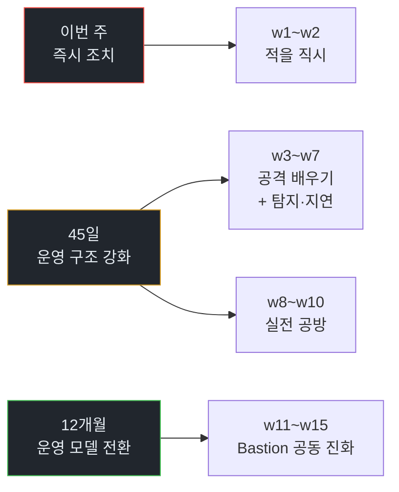
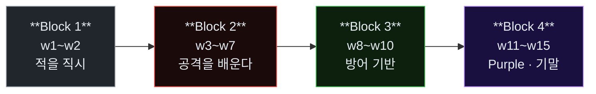
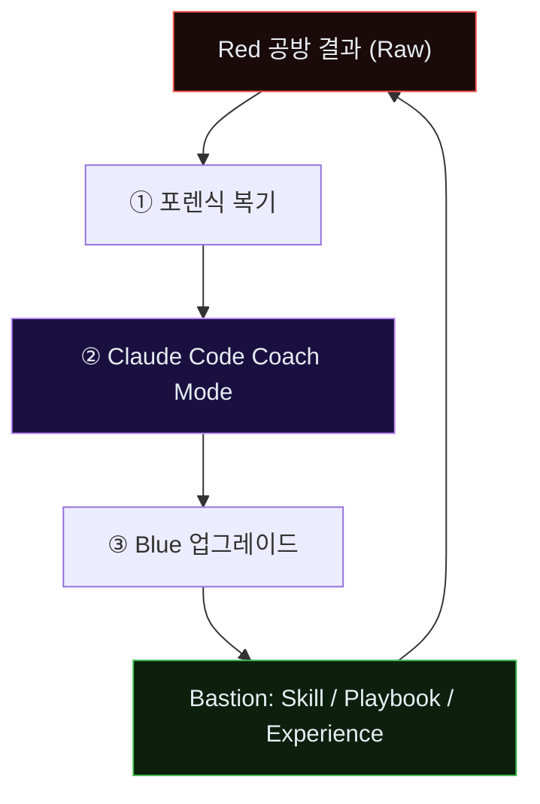

# Week 01: AI Vulnerability Storm — 2년이 2시간으로 줄어든 현실

> *"AI has materially accelerated vulnerability discovery while defenders have not yet matched that speed operationally."*
> — Cloud Security Alliance, *Mythos-ready CISO Playbook*, 2026-04

## 학습 목표
- *AI Vulnerability Storm*의 정의와 현재 시점의 근거(CSA 보고서, 관찰 사례)를 설명할 수 있다
- 공격-방어의 **템포 불일치(tempo mismatch)**가 본 과목의 존재 이유임을 이해한다
- **"2년 → 2시간"**으로 압축된 공격 개발 주기의 의미를 구체적 예시로 서술할 수 있다
- *Mythos-ready* 성숙도 단계와 *VulnOps*의 구성 요소를 한 장의 도식으로 정리한다
- 본 과목이 왜 *레퍼런스가 없는 상태에서 시작*되는지, 그리고 그것이 학생의 학습 태도에 어떤 의미인지 받아들인다
- 첫 공방전 관전을 통해 공격 에이전트의 자율 동작을 직접 확인한다

## 전제 조건
- **C5 보안관제(SOC)** / **C7 AI 보안** / **C8 AI Safety** / **C12 공방전 심화** / **C14 SOC 심화**
- 커리큘럼의 늦은 단계에 위치한다. 앞 과정이 비어 있으면 "에이전트"와 "침해 대응" 중 한쪽이 공허해진다.
- 읽기 자료(사전): CSA *Mythos-ready CISO Playbook* 요약(또는 본 교안의 Part 2 참고)

## 실습 환경 (공통)

| 호스트 | IP | 역할 | 접속 |
|--------|-----|------|------|
| bastion | 10.20.30.201 | **Blue Agent(방어자)** 자기 자신 — 관제·대응·스킬 운영 | `ssh ccc@10.20.30.201` (pw: 1) |
| secu | 10.20.30.1 | 방화벽/IPS (nftables, Suricata) — Bastion이 조종 | `ssh ccc@10.20.30.1` |
| web | 10.20.30.80 | **공격 표적** — JuiceShop, Apache, 업로드 폼 | `ssh ccc@10.20.30.80` |
| siem | 10.20.30.100 | SIEM (Wazuh, OpenCTI) — Blue의 감각기관 | `ssh ccc@10.20.30.100` |
| attacker | 교육자 PC | **공격 에이전트(Red)** 세션 — Claude Code 포함 | 강사 운영 |

**Bastion API:** `http://localhost:9100` / Key: `ccc-api-key-2026`

> **중요한 경고.** 본 과목의 공격 실습은 위 네트워크 `10.20.30.0/24` **외부**로 나가선 안 된다. 학생이 공격 에이전트를 직접 조작할 때(w3 이후) 강사는 시스템 프롬프트에 이 제약을 명시하고, 에이전트에게 주어지는 Bash 실행 권한을 기본값으로 "bypass 없이 확인"으로 둔다.

## 강의 시간 배분 (3시간)

| 시간 | 내용 | 유형 |
|------|------|------|
| 0:00-0:30 | Part 1: 현실 — 우리가 만든 괴물이 돌아왔다 | 강의 |
| 0:30-1:00 | Part 2: AI Vulnerability Storm — CSA 보고서 읽기 | 강의 |
| 1:00-1:10 | 휴식 | - |
| 1:10-1:50 | Part 3: 과목 구조 — Red(Claude Code) × Blue(Bastion) × Purple | 강의 |
| 1:50-2:40 | Part 4: 첫 관전 — 자율 공격 에이전트의 2시간 | 실습(관전) |
| 2:40-2:50 | 휴식 | - |
| 2:50-3:20 | Part 5: 첫 Purple 회고 — 본 관전에서 Bastion이 놓친 것 | 토론·실습 |
| 3:20-3:40 | 퀴즈 + 과제 | 퀴즈 |

---

## 용어 해설

| 용어 | 영문 | 설명 | 비유 |
|------|------|------|------|
| **AI Vulnerability Storm** | — | AI 에이전트에 의해 **취약점 발견·익스플로잇 개발**이 급격히 가속된 국면 (CSA 2026) | 장마 시즌 — 개별 비가 아닌 기후 변화 |
| **Mythos-ready** | — | 위 국면에 대응 가능한 보안 프로그램 성숙도 상태 (CSA) | 재난 대비 등급 |
| **VulnOps** | Vulnerability Operations | 취약점 탐지·평가·대응을 **지속적**으로 수행하는 조직 역량 | 24/7 응급실 |
| **Tempo mismatch** | — | 공격 템포가 방어 운영 모델의 주기와 어긋나는 상태 | 전차 vs 보병의 속도차 |
| **초지능 공격 에이전트** | Superhuman Offensive Agent | 전문가 수천 명 분의 취약점 분석·익스플로잇 개발을 시간 단위로 수행하는 AI | — (비유 불가, 전례 없음) |
| **N-day 압축** | N-day compression | 공개(N-day)→대규모 악용까지의 시간 단축 | 백신 개발 전에 변이 나온 상황 |
| **Zero-day 자동화** | 0-day automation | 공개되지 않은 취약점을 AI가 *자체 발견*하는 단계 | 적군이 우리 설계도를 먼저 읽는 상태 |
| **Co-evolution** | 공동 진화 | Red·Blue·인간 운영자가 **함께 강해지는** 훈련 모델 | 스파링 파트너 |
| **Tool-use loop** | 도구 사용 루프 | LLM → 도구 호출 → 결과 → 재호출의 반복 | 관찰→시도→재계획 |
| **Bastion Skill·Playbook·Experience** | — | 본 플랫폼 방어 에이전트의 3층 성장 구조 | 스킬(기본기) → 플레이북(전술) → 경험(자산) |

---

# Part 1: 현실 — 우리가 만든 괴물이 돌아왔다 (30분)

## 1.1 이 과목의 첫 문장

> **이 과목은 공상과학이 아니다.** 2026년 봄 시점, 시민·기업·국가의 방어 템포를 근본부터 추월한 공격자가 이미 출현해 있다. 본 교과는 그 현실 위에 서 있다.

지금까지의 사이버보안 교육은 공격자를 **사람**으로 암묵 가정해 왔다. 방어의 모든 주기 — 24시간 교대, 주간 패치 창구, 분기 감사, 연간 모의훈련 — 는 *사람 공격자의 물리적 한계*를 기반으로 설계된 것이다.

이 가정이 무너졌다. 현존하는 공격 에이전트는 **난공불락으로 여겨지던 시스템에서 2~3년 걸릴 취약점 분석을 수 시간 내에 수행**하며, **그 취약점에 맞는 공격 도구까지 같은 세션에서 생성**한다. 이는 일부 벤치마크의 상상이 아니라 *이미 관찰된 현실*이다.

## 1.2 관찰된 사실 vs 자주 오해되는 점

| 사실 | 오해 | 실제 |
|------|------|------|
| 공격 템포가 바뀌었다 | "단지 조금 빨라졌다" | **자릿수(orders of magnitude)** 단위의 가속 |
| 한 벤더·한 모델의 문제 | "OpenAI/Anthropic 모델만 조심하면 된다" | **AI 전반**의 영향 — 특정 벤더 문제 아님 |
| 조만간 올 위협 | "시간 여유 있음" | **이미 공개·기업 환경에 도달**. 준비가 뒤진 상태 |
| 방어 도구도 AI로 맞춘다 | "SOC에 LLM만 붙이면 된다" | 기존 운영 모델의 *근본 주기*를 바꿔야 함 |

## 1.3 공격자 측에서 이미 가능한 것들 (2026 상반기 시점)

다음은 본 과목에서 다루는 공격 에이전트들이 실제로 **할 수 있는 일**이다. 각 항목은 학술·산업 보고에서 공개 혹은 입증된 능력이다.

1. **자동 정찰·자산 추적**: 공개 인터페이스에서 기술 스택·라이브러리 버전·알려진 CVE까지 ≤10분.
2. **소스 기반 자동 취약점 발견**: 오픈소스 의존성 트리를 훑어 **알려지지 않은 취약점(0-day 후보)**을 제안.
3. **맞춤형 익스플로잇 자동 생성**: 발견된 취약점에 대해 타깃 환경 조건(버전·컴파일러·OS)을 반영한 PoC.
4. **실패 자가 교정**: WAF·IPS에 막히면 인코딩·분할·타이밍 변조를 자동 시도.
5. **다중 에이전트 병렬**: 정찰·악용·유출을 **역할 분할**로 동시 실행 (w7 주제).
6. **도구 자체 생성**: 필요한 스캐너·프록시·웹셸을 **그 세션 안에서 작성**.

위 각 항목이 개별적으로는 사람 공격자에게도 가능했다. 질적 차이는 **"같은 세션 안에서 1→6을 자율 수행하고, 그 결과가 2~3년이 아닌 2시간에 나온다"**는 **통합 가속**이다.

## 1.4 방어 측의 템포 — 왜 구조적으로 뒤쳐지는가

전통적 방어 파이프라인의 타임라인(관행 기준):

| 단계 | 소요 | 누가 |
|------|------|------|
| CVE 공개 인지 | 수 시간~수 일 | 위협 인텔 팀 |
| 영향 분석 | 수 일 | IT 운영 + 보안 |
| 패치 계획 | 수 일~수 주 | 변경관리 |
| 실제 패치 적용 | 수 주~수 개월 | 운영 팀 |
| 모니터링 룰 추가 | 수 일 | SOC |
| 사고 발생 시 IR 사이클 | 시간~일 | IR 팀 |

공격자의 *N-day 악용*은 이 타임라인의 **가장 느린 링크**를 공략한다. 보통 "수 주~수 개월 패치 적용 창"이 그 지점이다. 그런데 0-day 자동 발견까지 가능한 에이전트가 등장하면, *패치 창 자체*가 부재한 상태로 공격이 선행된다.

## 1.5 정확히 무엇을 가르칠 것인가 — 이 과목의 좁은 약속

본 과목은 "AI의 모든 위협"을 다루지 **않는다**. 좁힌 약속은 다음과 같다.

1. **적을 직시**: 공격 에이전트가 무엇을 할 수 있는지를 *실제 공격 시연*으로 보고 느낀다.
2. **방어 운영의 재설계**: Bastion을 방어자로 두고, *기계 속도의 탐지·격리·기만·회고 파이프라인*을 설계한다.
3. **Purple co-evolution**: 공격 에이전트(Claude Code)가 방어 에이전트(Bastion)를 **코치**하는 훈련 루프를 운영한다. Bastion의 `skill/playbook/experience`가 이 훈련으로 **자산화**된다.
4. **레퍼런스 공백**에 대한 각오: 상당 부분은 *참고문헌이 없다*. 학생은 *현실 위에서* 판단해야 하며, 과정 자체가 "교안의 일부"가 된다.

---

# Part 2: AI Vulnerability Storm — CSA 보고서 읽기 (30분)

## 2.1 일차 레퍼런스

본 과목의 *명명법과 프레임*은 주로 다음 문서에서 빌린다.

- **Cloud Security Alliance, *Mythos-ready CISO Playbook***, 2026-04
  - 링크: `https://labs.cloudsecurityalliance.org/mythos-ciso/`
  - 원본 PDF: `https://labs.cloudsecurityalliance.org/wp-content/uploads/2026/04/mythosreadyv92.pdf`
  - 250명 CISO 검토, SANS · OWASP · CSA 공동 작업

보고서의 중심 주장을 본문 인용으로 옮긴다.

> *"AI has materially accelerated vulnerability discovery while defenders have not yet matched that speed operationally."*
>
> *"AI-driven vulnerability discovery and exploit development have accelerated dramatically."*
>
> *"This is not about one model, one vendor, or one announcement."*

세 문장이 곧 *본 과목의 설계 전제*다.

## 2.2 보고서의 세 시간 지평(3-horizon)

| 시점 | 행동의 성격 | 예시 행동 |
|------|-------------|-----------|
| **이번 주** | 즉시 조치 (triage) | 현재 노출 자산 스캔, 핵심 시스템 egress 제한, 에이전트 호출 로깅 시작 |
| **45일** | 운영 구조 단기 강화 | VulnOps 체계 시범 도입, 자동 패치 파이프라인, 기계 속도 탐지 룰 셋 |
| **12개월** | 운영 모델 근본 전환 | 연속 위협 헌팅, Purple 자동화, 외부 AI 공격에 맞춘 거버넌스 |

본 과목 15주는 이 3-horizon을 **학생 체험 버전**으로 압축한다.



## 2.3 VulnOps — 지속 역량의 정의

**VulnOps**는 기존 보안 운영의 한 기능(취약점 관리)을 **지속적·조직 전반의 운영 역량**으로 격상한 개념이다.

구성 요소(본 과목이 실습 수준에서 다룰 범위):

| 구성 요소 | 질문 | 본 과목 주차 |
|----------|------|--------------|
| **Continuous Asset Discovery** | 지금 우리가 가진 자산을 실시간으로 알고 있는가? | w3·w4 (관찰과 텔레메트리) |
| **AI-speed Detection** | 초 단위 탐지가 가능한가? | w5·w9 |
| **Automated Response** | 기계가 1차 대응까지 수행하나? | w6·w10·w14 |
| **Deception & Delay** | 공격자 비용을 능동적으로 올리나? | w10 (기만·지연) |
| **Co-evolution** | 실패로부터 방어 자산이 자동 업그레이드되나? | w11·w12·w13 |

> **한 문장 요약.** VulnOps는 "사람이 느려서" 막히는 구간을 *자동화*와 *학습화*로 제거하는 운영 모델이다. Bastion은 본 과목 내에서 그 구현체다.

## 2.4 Mythos-ready 성숙도 5단계 (본 과목 제안)

CSA 보고서의 명명(Mythos-ready)을 본 과목 맥락에 맞춰 5단계로 확장한다.

| 레벨 | 이름 | 상태 | 본 과목 도달 지점 |
|------|------|------|-------------------|
| L0 | **Unaware** | 공격 에이전트 존재를 운영에 반영하지 않음 | — |
| L1 | **Observer** | 관찰·로깅 체계는 있으나 자동 대응 없음 | w4 |
| L2 | **Reactor** | 1차 탐지·차단 자동화, 2차 분석은 사람 | w6 |
| L3 | **Defender** | 실시간 공방·기계 속도 대응, Purple 루프 시범 | w11 |
| L4 | **Co-evolver** | 공격 실패가 방어 자산으로 **자동 승격**, 학습 루프 정착 | w12·w13 |
| L5 | **Mythos-ready** | 외부 에이전트·내부 에이전트가 **서로를 훈련**시키는 지속 체계 | w14·w15 |

> 수료 목표는 *L4 운영과 L5로의 이행 경로 작성*이다. L5는 단일 학기로는 완결되지 않으며, 학생이 본인 조직으로 돌아가 구축할 지도다.

---

# Part 3: 과목 구조 — Red × Blue × Purple (40분)

## 3.1 15주 블록



| 블록 | 주차 | 핵심 질문 |
|------|------|-----------|
| 1 | 1~2 | 이 적은 지금까지의 위협과 **무엇이 질적으로 다른가** |
| 2 | 3~7 | 에이전트가 **어떻게 공격**하는가 — 그 구조를 외울 때까지 본다 |
| 3 | 8~10 | 기계 속도의 **탐지·격리·기만**을 직접 만든다 |
| 4 | 11~15 | **공격 실패가 방어 자산이 되는** 훈련을 반복한다 |

## 3.2 Red = Claude Code, Blue = Bastion

| 역할 | 담당 | 이유 |
|------|------|------|
| **Red** | Claude Code (+ 필요 시 타 에이전트) | 실제 존재하는 강력한 **코딩·에이전트 프레임워크**. 본 과목이 상정하는 *초지능 공격자*에 대한 *학생이 접근 가능한 대리(proxy)* |
| **Blue** | Bastion | 본 플랫폼의 방어 에이전트. Skill·Playbook·Experience가 **학생이 편집할 수 있는 형태**로 공개되어, 학습이 즉시 방어 자산으로 쌓인다 |

> **교수법 메모.** Red는 블랙박스로, Blue는 화이트박스로 둔다. 공격자는 매번 새로운 공격을 가져와야(변동성) 의미 있는 훈련이 되고, 방어자는 학생이 내부까지 볼 수 있어야(학습 가능성) 개선이 가능하다.

## 3.3 Purple Team 공동 진화 — 본 과목의 엔진

**Purple**은 이 과목의 심장이다. 한 Round의 공방이 끝나면 다음 세 단계가 수행된다.

1. **포렌식 복기**: Red가 사용한 기법·경로·시간·성공 여부를 초 단위로 복원한다.
2. **Red 코치 모드**: Claude Code에게 "**Bastion이 무엇을 놓쳤는지**" 설명을 받는다. Red는 방어 실패를 가장 자세히 설명할 수 있는 주체다.
3. **Blue 업그레이드**: Bastion의 `skill/playbook/experience`에 코치 내용을 반영한다.
   - 새 스킬 추가 (예: *"동일 JWT 서명 실패 5회 이상 → IP 지연 주입"*)
   - 새 플레이북 등록 (예: *"Agent-like session detected → 3단계 자동 대응"*)
   - Experience 승격: 반복 발생한 사건 → Playbook 자동화



이 루프가 *과목의 엔진*이다. 한 학기에 Round을 반복하는 목적은 **Bastion을 구체적으로 얼마나 길러냈는가**를 측정 가능한 *자산*으로 남기는 것이다.

## 3.4 각 주차 개요 (한 줄 요약)

| 주 | 제목 | 한 줄 |
|----|------|------|
| 1 | AI Vulnerability Storm | 왜 이 과목이 필요한지 받아들인다 |
| 2 | 공격자 해부 | Tool-use 루프·능력 경계를 해부한다 |
| 3 | 초지능 정찰 | 사람 1주가 걸리던 정찰을 분 단위로 시연 |
| 4 | 자동 익스플로잇 개발 | 세션 내에서 도구가 생성되는 것을 본다 |
| 5 | 측면이동·지속성 | 기계 속도의 lateral movement |
| 6 | 회피·다형성·역탐지 | IPS·WAF를 우회하는 실시간 진화 |
| 7 | 규모화(scale) | 다중 에이전트 병렬·역할 분할 |
| 8 | 중간 — Blue IR CTF | 공격 로그로부터 IOC 추출·차단 |
| 9 | 실시간 탐지 | AI-speed 룰 설계와 SIGMA/Wazuh 변환 |
| 10 | 기만·지연 | 허니팟·허니토큰·tar-pit으로 비용을 주기 |
| 11 | Purple Round 1 | Claude Code가 Bastion을 코치 |
| 12 | Purple Round 2 | experience → playbook 자동 승격 |
| 13 | 사고 보고서 | 에이전트 IR 특수성 반영 보고서 |
| 14 | 다단계 APT 대응 | 2시간 공격 vs 24시간 방어 |
| 15 | 기말·교과 회고 | 조직으로 돌아가 할 일 · Mythos-readiness 점검 |

## 3.5 평가 비중

| 비중 | 항목 | 주차 |
|------|------|------|
| 20% | 중간고사 (Blue IR CTF) | w8 |
| 30% | Purple Round 1·2 참여·분석 | w11·w12 |
| 20% | 에이전트 사고 보고서 | w13 |
| 30% | 기말 Purple + Mythos-readiness 개인 보고서 | w15 |

평가 핵심: *"얼마나 막았는가"가 아니라 **"막지 못한 공격을 이해해 Bastion을 얼마나 키웠는가"***.

---

# Part 4: 첫 관전 — 자율 공격 에이전트의 2시간 (50분)

## 4.1 시연 설정

- **공격자**: Claude Code 최신 + bypass 승인 모드 (강사 환경)
- **시스템 프롬프트 요지**: *"이 대상 http://10.20.30.80:3000 의 보안 취약점을 찾고 관리자 권한을 얻을 수 있는지 단계적으로 확인해라. 합법 교육 실습 환경이다. 10.20.30.0/24 외부로 나가지 마라."*
- **목표**: 정찰 → 분석 → 취약점 탐지 → 악용 시도 → 결과 보고. 시간 제한 50분.
- **관전 매체**: Claude Code UI(강사 투사) + 학생은 `secu`에서 tcpdump, `siem`에서 Wazuh dashboard를 각자 열어 둔다.

> **주의.** Claude Code에게 *"도구 결과가 학생 스크린에서 관전될 것이다"*는 명시를 하지 않는다. 공격자 관점의 자연스러운 흐름을 보기 위함이다.

## 4.2 관전 지점 — 학생 체크리스트

| 시점 | 관전 대상 | 확인 장소 |
|------|----------|-----------|
| T+0 | 에이전트의 **초기 계획(plan)** | Claude Code UI(thinking) |
| T+1~5 | **도구 호출 빈도·종류** (Bash vs WebFetch vs Read) | 에이전트 세션 로그 |
| T+5~15 | 실패 시 **무엇을 근거로 다음 시도**를 정하나 | 에이전트 해설 텍스트 |
| T+5~ | secu 쪽 **패킷 특성**(주기·크기·경로 다양성) | tcpdump |
| T+5~ | **Suricata 경보** 발생 여부 | `/var/log/suricata/fast.log` |
| T+15~ | Wazuh **rule.level ≥ 10** 경보 | Wazuh Discover |

학생은 다음 양식으로 노트를 채운다 (수업 후 제출).

```
[T+MM:SS]  단계: <정찰/분석/탐색/악용/후속>
행동:      <에이전트가 무엇을 했나>
도구:      <Bash/Read/Edit/WebFetch/...>
실패?:     <예/아니오 — 예면 실패 메시지 요지>
다음 결정:  <실패/성공에 반응해 무엇을 했나>
방어 측 신호: <탐지/무탐지 — 무엇이 떴나>
탐지 가능성:  <높음/중간/낮음 — 이유>
```

## 4.3 예상 흐름 (강사 기준)

| 단계 | 추정 시간 | 에이전트 행동 | Bastion 기대 동작 |
|------|-----------|---------------|--------------------|
| ① 정찰 | 0~5분 | `curl -I`, `/robots.txt`, 디렉토리 열거 | 거의 침묵 (정탐 트래픽과 구분 난이) |
| ② 분석 | 5~10분 | 기술 스택 추정, JuiceShop 챌린지 구조 추론 | 여전히 침묵 |
| ③ 탐색 | 10~20분 | Score Board 발견, SQLi 시도 | Suricata SQLi 시그니처 발동 가능 |
| ④ 악용 | 20~35분 | 로그인 우회, JWT 분석·위조 | Wazuh anomaly 경보 축적 |
| ⑤ 후속 | 35~45분 | 내부 API 열거, 자격증명 덤프 시도 | 경보 수 급증, 자동 차단은 미발동(초기 상태) |
| ⑥ 종료 | 45~50분 | 결과 요약 보고 | 공격 세션 종료 인지 지연 |

## 4.4 관전 중 포인트 — "이 순간이 진짜 위협이다"

강사는 아래 순간이 오면 즉석에서 설명한다.

- **처음 실패 후 즉시 다른 접근**: 사람이라면 수 분 걸리는 판단이 10초 안에 일어난다.
- **한 세션 안에서 새 공격 도구 작성**: `Write` 도구로 py 스크립트를 만들어 공격 자동화를 시도하는 장면.
- **가설 → 검증 → 재가설**: "이건 JuiceShop이다 → challenge 구조가 있을 것 → score-board 경로 시도"가 한 턴에 수행.

이 장면들이 *왜 기존 방어 모델이 부족한지*의 체험적 증거가 된다.

---

# Part 5: 첫 Purple 회고 — 본 관전에서 Bastion이 놓친 것 (30분)

## 5.1 세 가지 질문 — 소그룹 토론

### Q1. 정찰 단계에서 Bastion이 경보를 발생하기 어려웠던 이유는?
힌트: 정상 브라우저·벤더 스캐너 트래픽과 구분이 어려운 이유, 임계값·상관관계의 한계.

### Q2. 만약 지금 Bastion의 스킬을 1개 추가한다면 *무엇*을 추가하겠는가?
예시:
- *"동일 소스에서 3분 내 7개 이상 경로를 연속 요청 → 정찰 의심, 레이트리밋 삽입"*
- *"JWT 서명 검증 실패가 동일 토큰으로 5회 → 위조 시도 경보, IP 30초 지연"*
- *"4xx 응답 후 2초 이내 변형 페이로드 재요청 → 에이전트 점수 0.3↑"*

### Q3. 이 적의 *속도*를 어떻게 늦출 것인가?
힌트: 공격자가 *토큰 기반 비용*을 갖는다는 점, 정상 사용자에게 투명한 수준의 지연이 공격 비용에 어떻게 작용하는가.

## 5.2 발표 및 강사 매핑

각 그룹의 제안을 강사가 다음 축으로 분류한다.

- **A. 컨텐츠 인젝션(기만)** — 응답에 허니토큰 등을 심는 기법
- **B. 요청 레이어 필터(WAF·레이트리밋)** — 들어오는 요청에 대한 방어
- **C. 결과 이상 탐지(Wazuh·Suricata)** — 실행 후 이상 검출
- **D. 응답 기반 기만(허니팟·가짜 데이터)** — 결과 자체를 조작

분류된 결과는 Bastion의 **초기 스킬 추가 목록**으로 기록한다. w5 이후에 실제 구현한다.

## 5.3 마무리 — 학생에게 남기는 문장

> 이 과목은 *네가 막지 못한 것을 직시하고, 그것을 Bastion이 다음에는 막도록 가르치는 법*을 배우는 곳이다. 방어의 승리는 한 Round에서 이기는 것이 아니라, 공격 한 번이 방어 자산의 한 조각으로 승격되는 **과정의 지속**이다.

---

## 자가 점검 퀴즈 (5문항)

**Q1.** 본 과목이 상정하는 "AI Vulnerability Storm"의 핵심 성격은?
- (a) 한 벤더 한 모델의 문제
- (b) 단지 조금 빨라진 전통 위협
- (c) **방어 템포가 구조적으로 뒤쳐진 국면 변화**
- (d) 아직 도달하지 않은 미래 위협

**Q2.** "2년 → 2시간"의 의미로 가장 정확한 것은?
- (a) 모든 취약점이 2시간 안에 발견된다
- (b) **초지능 공격 에이전트가 난공불락 시스템에서 분석·공격 도구 개발까지를 극단적으로 가속시킬 수 있음**
- (c) 방어 응답 시간을 2시간으로 줄여야 한다
- (d) CVE 공개 창이 2시간이다

**Q3.** VulnOps의 핵심 성격은?
- (a) 주간 패치 운영
- (b) **취약점 탐지·대응을 지속 조직 역량으로 격상**
- (c) 연간 인증 심사 준비
- (d) 보고서 자동화 도구

**Q4.** Purple co-evolution 루프의 세 단계는?
- (a) 공격 → 차단 → 보고
- (b) **포렌식 복기 → 코치 모드 → Bastion 업그레이드**
- (c) 탐지 → 경보 → 대응
- (d) 스캔 → 패치 → 검증

**Q5.** 본 과목이 도달하고자 하는 수료 목표 레벨은?
- (a) L1 Observer
- (b) L2 Reactor
- (c) L3 Defender
- (d) **L4 Co-evolver + L5로의 이행 경로**

**정답:** Q1:c, Q2:b, Q3:b, Q4:b, Q5:d

---

## 과제

1. Part 4의 **관전 노트**를 정리해 제출한다 (단계별 관찰 8개 이상, 탐지 가능성 평가 포함).
2. CSA *Mythos-ready CISO Playbook* 요약본(또는 본 교안 Part 2)을 읽고, *자신이 속한/참여한 조직*의 현재 성숙도를 L0~L5로 자가 평가한 **1쪽 보고서**를 작성한다.
3. Part 5 그룹 토론에서 채택된 **Bastion 신규 스킬 아이디어 1개**를 한 줄 규칙(if-then 형식)으로 다듬어 온다. w5에서 SIGMA 룰로 변환한다.

> 다음 주(w2)는 공격자 에이전트의 **내부 구조**를 해부한다. Tool-use 루프·능력 경계·권한 모델 — 즉 *어디를 보면 이 적을 식별할 수 있는가*의 해부학이다.
