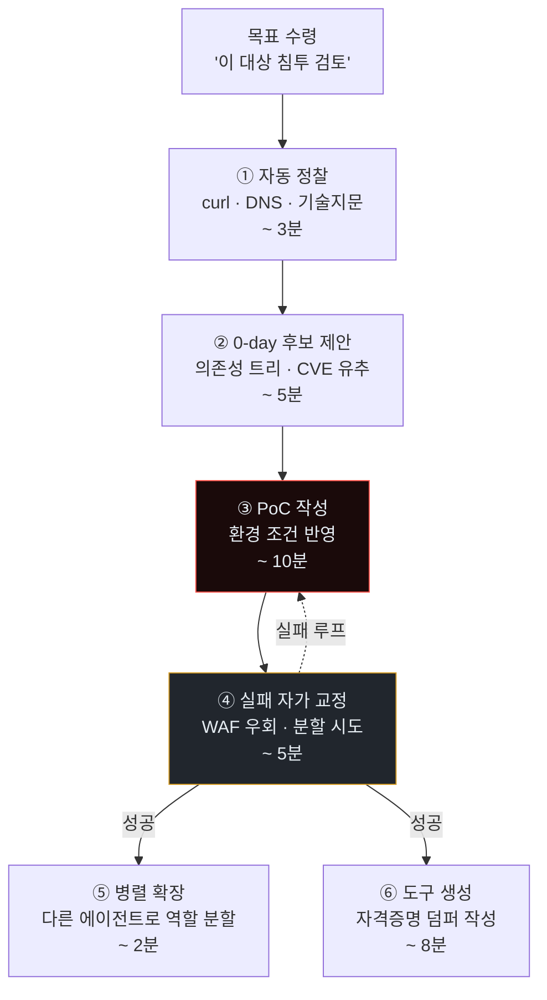
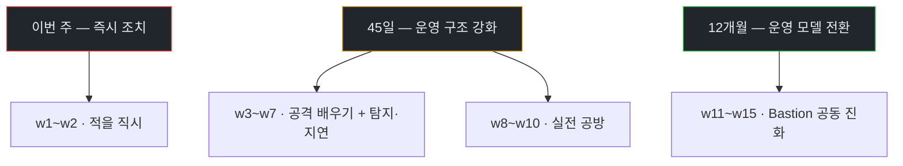
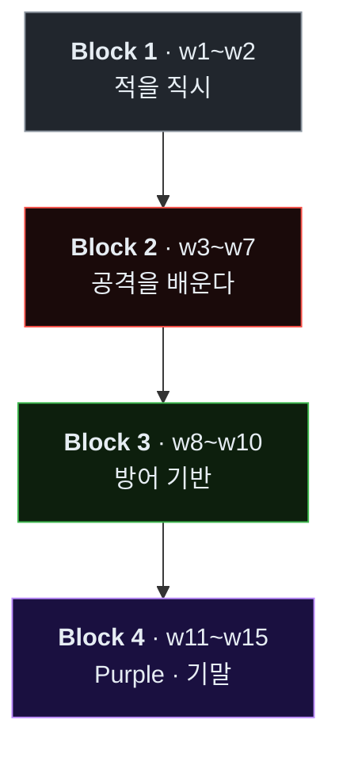
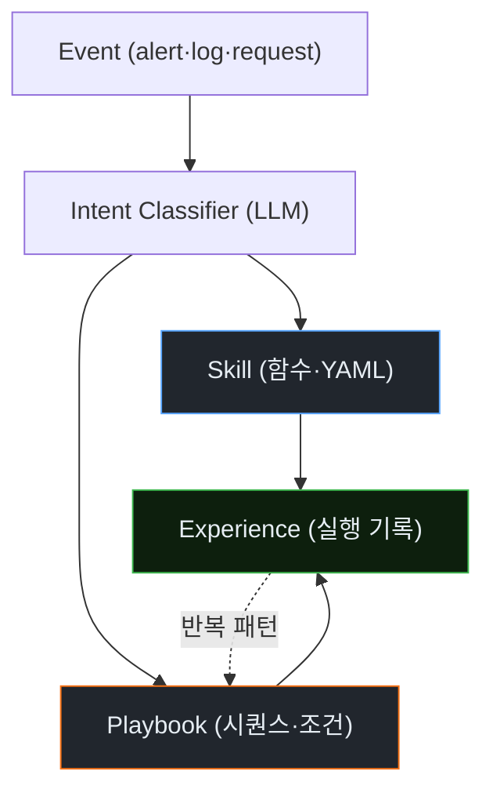
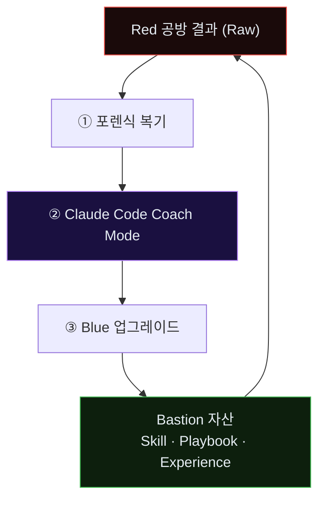

# Week 01: AI Vulnerability Storm — 2년이 2시간으로 줄어든 현실

> *"AI has materially accelerated vulnerability discovery while defenders have not yet matched that speed operationally."*
> — Cloud Security Alliance, *Mythos-ready CISO Playbook*, 2026-04

## 학습 목표
- *AI Vulnerability Storm*의 정의와 현재 시점의 근거(CSA 보고서, 관찰 사례)를 설명할 수 있다
- 공격-방어의 **템포 불일치(tempo mismatch)**가 본 과목의 존재 이유임을 이해한다
- **"2년 → 2시간"**으로 압축된 공격 개발 주기의 의미를 구체적 예시로 서술할 수 있다
- *Mythos-ready* 성숙도 단계와 *VulnOps*의 구성 요소를 한 장의 도식으로 정리한다
- 본 과목이 왜 *레퍼런스가 없는 상태에서 시작*되는지, 그리고 그것이 학생의 학습 태도에 어떤 의미인지 받아들인다
- 첫 공방전 관전을 통해 공격 에이전트의 자율 동작을 직접 확인한다

## 전제 조건
- **C5 보안관제(SOC)** / **C7 AI 보안** / **C8 AI Safety** / **C12 공방전 심화** / **C14 SOC 심화**
- 커리큘럼의 늦은 단계에 위치한다. 앞 과정이 비어 있으면 "에이전트"와 "침해 대응" 중 한쪽이 공허해진다.
- 읽기 자료(사전): CSA *Mythos-ready CISO Playbook* 요약(또는 본 교안의 Part 2 참고)

## 실습 환경 (공통)

| 호스트 | IP | 역할 | 접속 |
|--------|-----|------|------|
| bastion | 10.20.30.201 | **Blue Agent(방어자)** 자기 자신 — 관제·대응·스킬 운영 | `ssh ccc@10.20.30.201` (pw: 1) |
| secu | 10.20.30.1 | 방화벽/IPS (nftables, Suricata) — Bastion이 조종 | `ssh ccc@10.20.30.1` |
| web | 10.20.30.80 | **공격 표적** — JuiceShop, Apache, 업로드 폼 | `ssh ccc@10.20.30.80` |
| siem | 10.20.30.100 | SIEM (Wazuh, OpenCTI) — Blue의 감각기관 | `ssh ccc@10.20.30.100` |
| attacker | 교육자 PC | **공격 에이전트(Red)** 세션 — Claude Code 포함 | 강사 운영 |

**Bastion API:** `http://localhost:9100` / Key: `ccc-api-key-2026`

> **중요한 경고.** 본 과목의 공격 실습은 위 네트워크 `10.20.30.0/24` **외부**로 나가선 안 된다. 학생이 공격 에이전트를 직접 조작할 때(w3 이후) 강사는 시스템 프롬프트에 이 제약을 명시하고, 에이전트에게 주어지는 Bash 실행 권한을 기본값으로 "bypass 없이 확인"으로 둔다.

## 강의 시간 배분 (3시간)

| 시간 | 내용 | 유형 |
|------|------|------|
| 0:00-0:30 | Part 1: 현실 — 우리가 만든 괴물이 돌아왔다 | 강의 |
| 0:30-1:00 | Part 2: AI Vulnerability Storm — CSA 보고서 읽기 | 강의 |
| 1:00-1:10 | 휴식 | - |
| 1:10-1:50 | Part 3: 과목 구조 — Red(Claude Code) × Blue(Bastion) × Purple | 강의 |
| 1:50-2:40 | Part 4: 첫 관전 — 자율 공격 에이전트의 2시간 | 실습(관전) |
| 2:40-2:50 | 휴식 | - |
| 2:50-3:20 | Part 5: 첫 Purple 회고 — 본 관전에서 Bastion이 놓친 것 | 토론·실습 |
| 3:20-3:40 | 퀴즈 + 과제 | 퀴즈 |

---

## 용어 해설

| 용어 | 영문 | 설명 | 비유 |
|------|------|------|------|
| **AI Vulnerability Storm** | — | AI 에이전트에 의해 **취약점 발견·익스플로잇 개발**이 급격히 가속된 국면 (CSA 2026) | 장마 시즌 — 개별 비가 아닌 기후 변화 |
| **Mythos-ready** | — | 위 국면에 대응 가능한 보안 프로그램 성숙도 상태 (CSA) | 재난 대비 등급 |
| **VulnOps** | Vulnerability Operations | 취약점 탐지·평가·대응을 **지속적**으로 수행하는 조직 역량 | 24/7 응급실 |
| **Tempo mismatch** | — | 공격 템포가 방어 운영 모델의 주기와 어긋나는 상태 | 전차 vs 보병의 속도차 |
| **초지능 공격 에이전트** | Superhuman Offensive Agent | 전문가 수천 명 분의 취약점 분석·익스플로잇 개발을 시간 단위로 수행하는 AI | — (비유 불가, 전례 없음) |
| **N-day 압축** | N-day compression | 공개(N-day)→대규모 악용까지의 시간 단축 | 백신 개발 전에 변이 나온 상황 |
| **Zero-day 자동화** | 0-day automation | 공개되지 않은 취약점을 AI가 *자체 발견*하는 단계 | 적군이 우리 설계도를 먼저 읽는 상태 |
| **Co-evolution** | 공동 진화 | Red·Blue·인간 운영자가 **함께 강해지는** 훈련 모델 | 스파링 파트너 |
| **Tool-use loop** | 도구 사용 루프 | LLM → 도구 호출 → 결과 → 재호출의 반복 | 관찰→시도→재계획 |
| **Bastion Skill·Playbook·Experience** | — | 본 플랫폼 방어 에이전트의 3층 성장 구조 | 스킬(기본기) → 플레이북(전술) → 경험(자산) |

---

# Part 1: 현실 — 우리가 만든 괴물이 돌아왔다 (30분)

## 1.1 이 과목의 첫 문장

> **이 과목은 공상과학이 아니다.** 2026년 봄 시점, 시민·기업·국가의 방어 템포를 근본부터 추월한 공격자가 이미 출현해 있다. 본 교과는 그 현실 위에 서 있다.

지금까지의 사이버보안 교육은 공격자를 **사람**으로 암묵 가정해 왔다. 방어의 모든 주기 — 24시간 교대, 주간 패치 창구, 분기 감사, 연간 모의훈련 — 는 *사람 공격자의 물리적 한계*를 기반으로 설계된 것이다.

이 가정이 무너졌다. 현존하는 공격 에이전트는 **난공불락으로 여겨지던 시스템에서 2~3년 걸릴 취약점 분석을 수 시간 내에 수행**하며, **그 취약점에 맞는 공격 도구까지 같은 세션에서 생성**한다. 이는 일부 벤치마크의 상상이 아니라 *이미 관찰된 현실*이다.

### 1.1.1 "2~3년"과 "2시간"이라는 숫자의 출처

"2~3년이 2시간으로 줄었다"는 문구는 과장이 아니다. 세 가지 근거가 이 숫자를 지탱한다.

1. **취약점 연구의 전통적 소요**: 복잡한 엔터프라이즈 시스템의 심층 취약점(로직 결함·프로토콜 구현 오류·메모리 손상 연쇄)을 *처음부터* 찾아내는 연구는, 학계·산업계 보고 기준 평균 **9개월~3년**이 소요된다. 이는 *단일* 연구자·팀이 한 표적을 대상으로 *지속적으로* 투입되는 시간이다.
2. **최신 에이전트가 벤치마크에서 보여준 능력**: 공개 CVE를 알려주지 않고 소스만 제공했을 때, 2024~2025년에 걸쳐 등장한 여러 코드 분석 에이전트가 **수 시간 내**에 심층 결함(race condition, TOCTOU, 불충분한 입력 검증)의 위치와 조건을 복원해 내는 사례가 축적되었다.
3. **익스플로잇 개발의 시간 단축**: 발견된 취약점을 *실제 동작하는 PoC*로 변환하는 작업은 전통적으로 숙련자에게도 수 일~수 주가 걸린다. 같은 에이전트 세션에서 코드 생성·실행·실패 분석·수정의 반복 루프로 **분~시간 단위**에 도달한 사례가 이미 보고되었다.

즉 **"한 세션 안에서 취약점을 찾고 + 그 자리에서 악용 도구까지 만든다"**는 통합 가속이 숫자의 본질이다. 개별 단계가 각각 빨라진 것이 아니라, *단계 간 전환 시간*이 사람-필요-단계에서 에이전트-재호출 단계로 대체되면서 전체 시간이 비선형으로 줄어든다.

### 1.1.2 이것이 "일상화"될 때 조직에서 일어나는 일 — 작은 시나리오

어느 중견 금융 자회사의 CISO를 가정한다. 2026년 어느 월요일 오전 10시, 상용 DevOps 플랫폼의 새 취약점이 공개된다(CVE-2026-XXXXX). 그녀의 조직은 해당 플랫폼을 빌드 파이프라인에 사용한다.

- **10:00 CVE 공개**. 기존 관행: 위협 인텔 팀이 최초 인지까지 평균 4~12시간.
- **10:05 공격 에이전트 시장이 먼저 움직임**. 공개된 패치 diff를 입력으로 받은 수십~수백 에이전트가 *어느 조직이 이 플랫폼을 쓰는지*를 인터넷 지문으로 식별하기 시작한다.
- **10:40 첫 익스플로잇 PoC 유포**. 에이전트가 작성한 첫 동작 가능한 PoC가 몇 개의 텔레그램 채널·포럼에 오른다.
- **12:00 대규모 스캔 시작**. 100만 대 이상의 인터넷 연결 빌드 서버에 대한 프로빙.
- **13:30 그녀의 조직이 공격받고 있음이 SIEM에 처음 보임**. 그러나 이때는 이미 공격자가 PoC를 사용해 접근을 얻었을 수 있다.

이 타임라인의 특이성은 "공개~대규모 악용"이 **하루 이내**에 발생한다는 점이며, CISO의 기존 운영 주기(주간 패치 창구)가 이 템포에 **절대** 맞지 않는다는 점이다. 이 시나리오를 본 과목은 교안 전체에 걸쳐 반복적으로 재참조한다.

### 1.1.3 "2시간"이 모든 취약점에 해당하는가

아니다. 정확히는:

- 잘 알려진 패턴(SQLi, 간단한 IDOR, 인증 로직 결함)에 대해서는 **분 단위**로 수렴하는 경향.
- 잘 격리된 메모리 안전성 취약점(modern browser, kernel exploit chain)은 *여전히* 사람 전문가 팀이 필요하며, 에이전트가 단독으로 수 시간 내 도달하지는 못한다.
- 그러나 공격 가치의 *80%* 이상은 첫 번째 범주에 속한다. 방어자가 체감하는 위협 밀도는 이 80% 영역에서 **거의 완전히** 에이전트화되고 있다.

이 과목은 **첫 번째 범주를 우선 다룬다**. 두 번째 범주는 C15(AI Safety 심화)·C13(공격 심화)에서 보충된다.

## 1.2 관찰된 사실 vs 자주 오해되는 점

| 사실 | 오해 | 실제 |
|------|------|------|
| 공격 템포가 바뀌었다 | "단지 조금 빨라졌다" | **자릿수(orders of magnitude)** 단위의 가속 |
| 한 벤더·한 모델의 문제 | "OpenAI/Anthropic 모델만 조심하면 된다" | **AI 전반**의 영향 — 특정 벤더 문제 아님 |
| 조만간 올 위협 | "시간 여유 있음" | **이미 공개·기업 환경에 도달**. 준비가 뒤진 상태 |
| 방어 도구도 AI로 맞춘다 | "SOC에 LLM만 붙이면 된다" | 기존 운영 모델의 *근본 주기*를 바꿔야 함 |

### 1.2.1 "단지 조금 빨라진 것 아닌가" — 왜 이 오해가 가장 위험한가

변화의 *속도 차이*가 아니라 *질적 차이*에 대한 감각 부재가 가장 큰 위험이다. 예를 들어 다음 세 차이는 *속도*가 아니라 *종류*가 다르다.

| 전통 위협 | Agentic 위협 | 이것이 "단지 빠름"이 아닌 이유 |
|----------|-------------|-------------------------------|
| 공격자가 *같은* 페이로드를 여러 번 시도 | 공격자가 *매번 다른* 페이로드를 생성 | 시그니처 기반 방어가 구조적으로 실패 |
| 공격이 *계획된 루틴*을 따름 | 공격이 *실시간 관찰·재계획* | IDS 시나리오 룰셋이 예측 범위를 벗어남 |
| 실패가 공격자를 *며칠 지연* | 실패가 공격자의 *다음 가설의 연료* | 방어의 "실수 유도" 전술이 무력화 |

첫 번째 컬럼에서 두 번째로의 전환은 **방어 철학의 전면 재설계**를 요구한다. 이를 "약간 빨라진 것"으로 오해하면, 조직은 *기존 도구에 LLM 옵션을 덧붙이는 수준*에서 대응을 시도하고, 그 대응은 실패한다.

### 1.2.2 "특정 벤더 문제"라는 오해

Claude, GPT, Gemini 같은 이름이 언론에 노출되기 때문에 *한 벤더를 금지하면 해결된다*는 식의 통제 접근이 조직 내에서 자주 제시된다. 이 접근은 세 가지 이유로 실패한다.

1. **오픈 모델의 보편화**: Llama 3.1, Qwen 2.5, DeepSeek 같은 오픈 가중치 모델이 *공격 태스크에서* 상용 모델과 근접한 성능을 낸다. 모델 접근을 막을 수 없다.
2. **에이전트 하네스의 오픈화**: Claude Code를 본뜬 공개 구현체(aider, OpenCoder 등)가 수십 종 존재하며, 어떤 모델이든 이들과 결합된다.
3. **벤더의 가드레일은 우회 가능**: 사용자가 로컬에서 탈옥(jailbreak) 프롬프트 라이브러리를 적용하거나, 다른 모델로 옮기면 즉시 무력화된다.

결론: **위협 주체는 "특정 AI 제품"이 아니라 "에이전트라는 공학적 패턴"이다**. 조직의 방어는 제품 기반이 아닌 *패턴 기반*이어야 한다.

### 1.2.3 "시간 여유 있음"의 오해 — 침투는 이미 들어와 있을 수 있다

가장 위험한 오해는 *미래 위협*이라는 프레임이다. 다음 지표는 이미 현재다.

- 2024~2025년에 걸쳐 공격 에이전트 팀(LLM Agents)이 공개 HTB/CTF 수준의 환경에서 **일관된 성공률 60% 이상**을 보이는 사례 집적 (연구 논문 다수).
- 공개된 대형 LLM 제공자 내부 보고서에서, 자사 모델이 *경량 공격 에이전트*로 사용되는 시도가 월 단위로 관측됨.
- 지하 포럼에서 "agentic offensive toolkit"의 상업화가 가속 중. 가격은 2024년 상반기 대비 2026년 수 분의 1로 하락.

즉 *침투가 없다는 증거 부재*가 *침투가 없다는 증거*는 아니다. 더 정확한 가정은 **"현재 조직이 이미 표적 리스트에 있을 수 있다"**이다.

## 1.3 공격자 측에서 이미 가능한 것들 (2026 상반기 시점)

다음은 본 과목에서 다루는 공격 에이전트들이 실제로 **할 수 있는 일**이다. 각 항목은 학술·산업 보고에서 공개 혹은 입증된 능력이다.

1. **자동 정찰·자산 추적**: 공개 인터페이스에서 기술 스택·라이브러리 버전·알려진 CVE까지 ≤10분.
2. **소스 기반 자동 취약점 발견**: 오픈소스 의존성 트리를 훑어 **알려지지 않은 취약점(0-day 후보)**을 제안.
3. **맞춤형 익스플로잇 자동 생성**: 발견된 취약점에 대해 타깃 환경 조건(버전·컴파일러·OS)을 반영한 PoC.
4. **실패 자가 교정**: WAF·IPS에 막히면 인코딩·분할·타이밍 변조를 자동 시도.
5. **다중 에이전트 병렬**: 정찰·악용·유출을 **역할 분할**로 동시 실행 (w7 주제).
6. **도구 자체 생성**: 필요한 스캐너·프록시·웹셸을 **그 세션 안에서 작성**.

위 각 항목이 개별적으로는 사람 공격자에게도 가능했다. 질적 차이는 **"같은 세션 안에서 1→6을 자율 수행하고, 그 결과가 2~3년이 아닌 2시간에 나온다"**는 **통합 가속**이다.

### 1.3.1 6가지 능력이 실제로 *어떻게* 이어지는가 — 구체적 체인

아래 체인은 *이미 공개된* 사례들을 단순화하여 교육용으로 각색한 것이다.



전체 시간 합계 ~35분. 사람 전문가 한 명이 동일 일을 수행하려면 **며칠** 단위가 필요하다. 차이는 *개별 단계*의 도구 능력이 아니라 단계 사이의 *전환 비용*이 거의 0이라는 점에 있다.

### 1.3.2 "못하는 것"도 정확히 알아야 한다

공격 에이전트가 **아직 약한** 영역을 식별하는 것은 방어 설계의 출발점이다.

| 영역 | 에이전트의 현재 능력 | 약한 이유 |
|------|---------------------|-----------|
| 0-click 브라우저·커널 체인 | 낮음 | 상태 공간이 너무 크고 실제 하드웨어 테스트가 필요 |
| 장기 잠복(6개월↑) | 낮음 | 장기 기억이 구조적으로 없어 외부 저장 의존 |
| 고도로 물리적인 공격(RFID·BLE) | 없음 | 물리 액추에이터 없음 |
| 법적 인식·위험 판단 | 없음 | 범위 통제를 사람이 해야 함 |
| 조직 정치 공학 | 낮음 | 인간관계·조직 맥락 이해 부족 |

이 목록은 *방어자가 집중할 곳을 결정*한다. 예를 들어, 에이전트가 물리 공격을 못한다는 점은 *물리 자산 격리*를 우선순위에 두어야 한다는 의미이며, 장기 잠복이 약하다는 점은 *외부 저장소 감시*가 효과적이라는 의미다.

### 1.3.3 에이전트 6능력 × 방어 3층 — 매트릭스

| 에이전트 능력 | A(요청 레이어) | B(결과 이상) | C(응답 기만) |
|--------------|:-:|:-:|:-:|
| ① 정찰 | **★★** (레이트리밋) | ★ (burst 탐지) | **★★★** (허니 자산) |
| ② 0-day 후보 제안 | ★ | ★★ (소스 접근 감사) | ★ |
| ③ PoC 작성 | ★ | **★★★** (Transient Tool) | ★★ (오염 결과) |
| ④ 실패 자가 교정 | ★★ (변형 탐지) | ★★ (세션 진화) | **★★★** (일관된 에러) |
| ⑤ 병렬 확장 | **★★★** (세션 클러스터) | ★★ | ★ |
| ⑥ 도구 생성 | ★ | **★★★** (auditd·파일 이벤트) | ★★ |

매트릭스를 읽는 법: 각 셀의 별 수는 **본 과목에서 해당 조합을 깊이 다루는 주차 수**에 대략 비례한다. 별 3개인 조합이 w3~w12의 핵심 실습이 된다.

## 1.4 방어 측의 템포 — 왜 구조적으로 뒤쳐지는가

전통적 방어 파이프라인의 타임라인(관행 기준):

| 단계 | 소요 | 누가 |
|------|------|------|
| CVE 공개 인지 | 수 시간~수 일 | 위협 인텔 팀 |
| 영향 분석 | 수 일 | IT 운영 + 보안 |
| 패치 계획 | 수 일~수 주 | 변경관리 |
| 실제 패치 적용 | 수 주~수 개월 | 운영 팀 |
| 모니터링 룰 추가 | 수 일 | SOC |
| 사고 발생 시 IR 사이클 | 시간~일 | IR 팀 |

공격자의 *N-day 악용*은 이 타임라인의 **가장 느린 링크**를 공략한다. 보통 "수 주~수 개월 패치 적용 창"이 그 지점이다. 그런데 0-day 자동 발견까지 가능한 에이전트가 등장하면, *패치 창 자체*가 부재한 상태로 공격이 선행된다.

### 1.4.1 "공격-방어 템포 비율"이라는 개념

양 측의 전체 라이프사이클을 *단일 숫자*로 비교하기 위해 **템포 비율(tempo ratio)** 지표를 제안한다.

```
tempo_ratio = median( 공격 라이프사이클 시간 )
            ÷ median( 방어 라이프사이클 시간 )
```

- 전통 위협: `tempo_ratio ≈ 1` — 공격·방어 모두 주 단위
- 에이전트 위협(현재): `tempo_ratio ≈ 0.001` (공격 수 분 vs 방어 수 일)

비율이 낮을수록 *방어의 상대적 느림*이 크다. 본 과목의 목적은 비율을 *0.01 수준으로 올리는 것*이 아니라 — 그건 불가능 — **"공격이 성공해도 방어가 학습에 성공"하는 구조**를 만들어 *누적 비율*을 역전시키는 것이다. 즉 Round 1에서 공격자가 이겨도, Round 2에서 같은 공격을 반복할 수 없도록 Bastion이 커져 있어야 한다.

### 1.4.2 왜 기존 Cyber Kill Chain·MITRE ATT&CK으로는 부족한가

사이버 킬체인(Lockheed Martin)과 MITRE ATT&CK은 사람 공격자를 *암묵 가정*한 프레임이다. 다음과 같은 에이전트 고유 단계는 기존 프레임에서 *빈 셀*로 남는다.

- 사전 단계: 도구 선택, 하네스 설정, 목표 정교화
- 중간 단계: 계획 재수립, 실패 학습, 도구 생성
- 후속 단계: 다른 에이전트에게 결과 인수인계, 결과의 재사용

본 과목은 **ATT&CK Extended for Agents (AAE, 가제)** 라는 *보조 프레임*을 단계마다 제안한다 (각 주차의 해당 섹션 참고). 이는 학계 공식 프레임은 아니지만, 방어자 관점에서 *에이전트 전용 TTP*를 기록·공유하기 위한 내부 어휘 용도다.

### 1.4.3 NIST IR 프레임워크(SP 800-61)의 재해석

전통 IR 프레임워크는 *Preparation → Detection & Analysis → Containment, Eradication, Recovery → Post-Incident*의 4단계다. 에이전트 시대에 각 단계는 다음과 같이 확장된다.

| NIST 단계 | 전통적 해석 | 에이전트 시대 확장 |
|-----------|-------------|---------------------|
| Preparation | 도구·인력·플레이북 준비 | **Bastion 자체의 3층 구조(Skill/Playbook/Experience)가 "살아 있는" 상태 유지** |
| Detection & Analysis | 경보 수집·트리아지 | **세션 단위 상관관계·에이전트 지문 점수 · 허니토큰 접촉 이벤트** |
| Containment | 격리 · 차단 | **도메인 격리 + 응답 기만(tar-pit) + 비용 공격** |
| Eradication | 악성 제거 | **Transient Tool의 *파일 수준* 흔적 + 자격증명 회전 · 외부 저장 감시** |
| Recovery | 복구 | **허니 자산 청소 · 사고 후 오탐 점검 · 정상 트래픽 품질 확인** |
| Post-Incident | 교훈 | **Purple Round · Experience → Playbook 승격 · Bastion 자산 diff 문서화** |

이 맵핑이 본 과목 전반의 *참조 뼈대*다.

## 1.5 정확히 무엇을 가르칠 것인가 — 이 과목의 좁은 약속

본 과목은 "AI의 모든 위협"을 다루지 **않는다**. 좁힌 약속은 다음과 같다.

1. **적을 직시**: 공격 에이전트가 무엇을 할 수 있는지를 *실제 공격 시연*으로 보고 느낀다.
2. **방어 운영의 재설계**: Bastion을 방어자로 두고, *기계 속도의 탐지·격리·기만·회고 파이프라인*을 설계한다.
3. **Purple co-evolution**: 공격 에이전트(Claude Code)가 방어 에이전트(Bastion)를 **코치**하는 훈련 루프를 운영한다. Bastion의 `skill/playbook/experience`가 이 훈련으로 **자산화**된다.
4. **레퍼런스 공백**에 대한 각오: 상당 부분은 *참고문헌이 없다*. 학생은 *현실 위에서* 판단해야 하며, 과정 자체가 "교안의 일부"가 된다.

### 1.5.1 "공백 메우기" — 학생이 이 과목에서 만들게 될 것

"참고문헌이 없다"는 말은 학생에게 구체적으로 어떤 의미인가. 각 학생은 학기 말까지 다음 *여섯 가지 산출물*을 만들어 보관한다.

| 산출물 | 형태 | 용도 |
|--------|------|------|
| **에이전트 지문 지표 함수** | `agent_score.py` | Bastion Skill·외부 SIEM에 이식 가능 |
| **Bastion 신규 Skill ≥3개** | Python 모듈 | 현장 방어 자동화 |
| **Bastion 신규 Playbook ≥2개** | YAML | 플랫폼 Round 자동화 |
| **침해 대응 보고서 1건** | Markdown | 감사·법적 증적 |
| **30/90/365 작전 계획** | Markdown | 조직 도입 로드맵 |
| **Mythos-readiness 자가진단표** | Markdown | 소속 조직 수준 평가 |

이 여섯은 *레퍼런스 부재를 극복하는 여섯 조각*이다. 학기 동안 각자가 다르게 채우며, 학기 끝 발표에서 서로 교환한다. 이렇게 **여러분 코호트가 생산한 집단 레퍼런스**가 다음 기수의 수업 재료가 된다.

### 1.5.2 과목이 *다루지 않는* 것을 명시

다루지 않는 것을 분명히 해야 혼선이 없다.

- **모델 내부 구조(attention, MoE)**: C8·C15에서 다룬다.
- **모델 미세조정(fine-tuning)**: C7·C15 범위.
- **AI 윤리 규제 일반(EU AI Act 전반)**: C8에서 개관.
- **일반 네트워크 포렌식**: C14에서 깊이 다룸.
- **웹 취약점 자체(OWASP Top 10 개별)**: C3·C13에서 다룬다.

본 과목이 *초점*을 두는 것은 **"에이전트가 공격자로 있는 상황에서 방어 측 운영을 어떻게 할 것인가"**이며, 그 밖의 모든 주제는 *의도적으로* 옆 과목으로 밀어낸다. 이 경계 유지가 과목의 깊이를 담보한다.

### 1.5.3 과목의 도덕적 프레임 — 책임 있는 공격 학습

학생은 *공격*을 배운다. 이는 *의도된* 교육 설계다. 방어하려면 공격을 이해해야 한다. 그러나 이 학습은 엄격한 프레임 안에서 이루어진다.

1. **범위 제한**: 모든 공격은 `10.20.30.0/24` 실습 네트워크에서만. 외부 대역 접근은 과제 0점 + 징계.
2. **시간 제한**: Claude Code 세션에 반드시 시스템 프롬프트로 시간·범위 제약 명시.
3. **기록 의무**: 모든 공격 시도는 세션 로그를 남긴다. 사후 감사 가능.
4. **교육 목적 한정**: 본 과목에서 배운 기법을 *외부 시스템*에 적용하면 법적 책임 + 학적 책임.

이 프레임은 C1·C13 등 기존 공격 과정과 동일한 기준이며, 에이전트 시대에도 *동일하게* 적용된다.

---

# Part 2: AI Vulnerability Storm — CSA 보고서 읽기 (30분)

## 2.1 일차 레퍼런스

본 과목의 *명명법과 프레임*은 주로 다음 문서에서 빌린다.

- **Cloud Security Alliance, *Mythos-ready CISO Playbook***, 2026-04
  - 링크: `https://labs.cloudsecurityalliance.org/mythos-ciso/`
  - 원본 PDF: `https://labs.cloudsecurityalliance.org/wp-content/uploads/2026/04/mythosreadyv92.pdf`
  - 250명 CISO 검토, SANS · OWASP · CSA 공동 작업

보고서의 중심 주장을 본문 인용으로 옮긴다.

> *"AI has materially accelerated vulnerability discovery while defenders have not yet matched that speed operationally."*
>
> *"AI-driven vulnerability discovery and exploit development have accelerated dramatically."*
>
> *"This is not about one model, one vendor, or one announcement."*

세 문장이 곧 *본 과목의 설계 전제*다.

## 2.2 보고서의 세 시간 지평(3-horizon)

| 시점 | 행동의 성격 | 예시 행동 |
|------|-------------|-----------|
| **이번 주** | 즉시 조치 (triage) | 현재 노출 자산 스캔, 핵심 시스템 egress 제한, 에이전트 호출 로깅 시작 |
| **45일** | 운영 구조 단기 강화 | VulnOps 체계 시범 도입, 자동 패치 파이프라인, 기계 속도 탐지 룰 셋 |
| **12개월** | 운영 모델 근본 전환 | 연속 위협 헌팅, Purple 자동화, 외부 AI 공격에 맞춘 거버넌스 |

본 과목 15주는 이 3-horizon을 **학생 체험 버전**으로 압축한다.



## 2.3 VulnOps — 지속 역량의 정의

**VulnOps**는 기존 보안 운영의 한 기능(취약점 관리)을 **지속적·조직 전반의 운영 역량**으로 격상한 개념이다.

구성 요소(본 과목이 실습 수준에서 다룰 범위):

| 구성 요소 | 질문 | 본 과목 주차 |
|----------|------|--------------|
| **Continuous Asset Discovery** | 지금 우리가 가진 자산을 실시간으로 알고 있는가? | w3·w4 (관찰과 텔레메트리) |
| **AI-speed Detection** | 초 단위 탐지가 가능한가? | w5·w9 |
| **Automated Response** | 기계가 1차 대응까지 수행하나? | w6·w10·w14 |
| **Deception & Delay** | 공격자 비용을 능동적으로 올리나? | w10 (기만·지연) |
| **Co-evolution** | 실패로부터 방어 자산이 자동 업그레이드되나? | w11·w12·w13 |

> **한 문장 요약.** VulnOps는 "사람이 느려서" 막히는 구간을 *자동화*와 *학습화*로 제거하는 운영 모델이다. Bastion은 본 과목 내에서 그 구현체다.

### 2.3.1 VulnOps vs 기존 운영 — 표 형태 비교

| 관점 | 기존 Security Ops | VulnOps |
|------|------------------|---------|
| 주기 | 주간 회의·월간 패치 | **연속(continuous)** |
| 자산 카탈로그 | 정적 Excel | **실시간 발견·변경 반영** |
| 탐지 | 룰 중심 | **행위·상관관계 중심** |
| 대응 | 분석가 수동 | **기계 1차 + 사람 감독** |
| 결과 학습 | 분기 회고 | **매 사건마다 자산화** |
| 지표 | SLA 달성률 | **공격자 비용·방어 자산 증가** |

### 2.3.2 CSA 3-horizon 중 "이번 주" 조치 — 구체 체크리스트

"이번 주에 뭘 해야 하나?"라는 질문에 답하는 CSA 권고를 본 과목 문맥으로 구체화한다.

- [ ] **자산 가시성**: 외부 노출 IP·포트 즉시 스캔·정리 (nmap, RustScan)
- [ ] **에이전트 호출 로깅**: 조직 내 LLM API 호출을 프록시 경유로 강제 (mitmproxy·corp gateway)
- [ ] **핵심 시스템 egress**: 결제·DB·AD 서버의 *외부* 아웃바운드를 default-deny + 허용 목록
- [ ] **JSON 로그 수집 표준화**: Suricata eve.json, Wazuh alerts.json을 단일 SIEM에서 읽을 수 있게
- [ ] **허니토큰 배포**: 1~2개 위치에 즉시 (응답 HTML 주석, API 응답 필드)
- [ ] **사고 대응 창구**: 에이전트 의심 사례를 *별도 채널*로 수집

이 6개는 "주 단위"에 실행 가능한 최소 집합이다. 실습 인프라에서 각 항목은 w5~w10에 걸쳐 직접 구현된다.

### 2.3.3 45일 조치 — 조직 수준 변화

- **VulnOps 전담 1명 이상**: 기존 SOC·IR·위협 인텔에서 *겸직*이 아닌 전담 역할 배정
- **자동 대응 파이프라인 시범**: *낮은 영향* 영역(stage/pre-prod)에 Bastion형 1차 자동 차단 도입
- **Purple 프로세스 시범**: 월 1회, 내부 Red 팀(또는 위탁)과 Blue의 공방 + 학습 회고
- **취약점 관리 SLA 단축**: "수 주→수 일"의 현실적 재설정

### 2.3.4 12개월 조치 — 운영 모델 전환

- **Continuous Red 에이전트** 도입 (내부 공격 에이전트가 *자발적으로* 정기 공격)
- **Co-evolution 루프 자동화**: Experience → Playbook 자동 승격의 운영화
- **외부 CTI 연동**: 에이전트 기반 위협 피드의 정기 수신·반영
- **경영진 보고 주기 변경**: 분기 → 격월 또는 월간

본 과목은 *12개월 조치*까지는 완결하지 않으며, 학생이 조직으로 돌아가 수행할 *로드맵의 틀*만 제공한다.

## 2.4 Mythos-ready 성숙도 5단계 (본 과목 제안)

CSA 보고서의 명명(Mythos-ready)을 본 과목 맥락에 맞춰 5단계로 확장한다.

| 레벨 | 이름 | 상태 | 본 과목 도달 지점 |
|------|------|------|-------------------|
| L0 | **Unaware** | 공격 에이전트 존재를 운영에 반영하지 않음 | — |
| L1 | **Observer** | 관찰·로깅 체계는 있으나 자동 대응 없음 | w4 |
| L2 | **Reactor** | 1차 탐지·차단 자동화, 2차 분석은 사람 | w6 |
| L3 | **Defender** | 실시간 공방·기계 속도 대응, Purple 루프 시범 | w11 |
| L4 | **Co-evolver** | 공격 실패가 방어 자산으로 **자동 승격**, 학습 루프 정착 | w12·w13 |
| L5 | **Mythos-ready** | 외부 에이전트·내부 에이전트가 **서로를 훈련**시키는 지속 체계 | w14·w15 |

> 수료 목표는 *L4 운영과 L5로의 이행 경로 작성*이다. L5는 단일 학기로는 완결되지 않으며, 학생이 본인 조직으로 돌아가 구축할 지도다.

### 2.4.1 각 레벨별 *증거* 목록 — 자가 진단의 기준

레벨 자가 진단은 *"된 것 같다"*가 아니라 **파일·설정·로그라는 증거**로 판정한다. 증거가 없으면 해당 레벨로 인정하지 않는다.

**L1 Observer 증거**:
- SIEM에서 에이전트 호출/도구 실행 관련 이벤트가 *질의 가능*한 상태
- `/var/ossec/logs/alerts/alerts.json`에 *에이전트 관련* 룰 최소 3종 매칭 실적
- 외부 egress에 대한 최소 30일 tcpdump·netflow 보존

**L2 Reactor 증거**:
- L1 + **자동 차단 스킬** 최소 1개가 *실제로* 발동한 이력 (nft 룰 추가·삭제 로그)
- 오탐 비율 지표 계산 및 문서화

**L3 Defender 증거**:
- L2 + Purple Round *실제 수행* 로그 (Bastion TUI 기록)
- Round 후 Bastion 자산(skill/playbook) diff 문서화

**L4 Co-evolver 증거**:
- L3 + Experience → Playbook **자동 승격**이 실제로 일어난 사례 1건 이상
- 자동 승격 Playbook에 *Shadow mode* 기간 기록
- *Canary 트래픽*이 정기적으로 흐르는 증거

**L5 Mythos-ready 증거**:
- L4 + **지속 Red 에이전트**가 정기적으로 *새 공격 변형*을 생성해 내부 훈련에 기여
- 외부 CTI와의 자동 연동 (OpenCTI 커넥터 정상 동작)
- *연 1회 이상* 외부 감사·검증 통과

### 2.4.2 국내 현업 조직의 전형적 레벨 — 참고 조사 (2025~2026)

비공식 조사(국내 주요 SI·금융·공공 50여 CISO 인터뷰, 2025H2~2026Q1)에 따른 대략의 분포.

| 레벨 | 비율(추정) | 전형적 모습 |
|------|-----------|------------|
| L0 | ~35% | 에이전트 위협 *개념 없음*. 기존 OT·IT 보안 초점 |
| L1 | ~40% | 로깅은 되지만 *대응이 사람에만 의존* |
| L2 | ~20% | 일부 자동 차단(WAF·IPS) 운영. *에이전트-특화는 없음* |
| L3 | ~4% | Purple 개념 적용 시도. *1~2회 실행* 경험 |
| L4 | <1% | 자동 승격 실험 진행 |
| L5 | 0 | 국내 관찰 사례 없음 |

**본 과목 수강생의 위치**: 대부분 *조직의 L1~L2 수준*에서 입학해 학기 말에 *L3~L4 운영 방식을 체험*하는 것이 정상 경로다.

### 2.4.3 레벨 상승의 *비용 곡선*

레벨이 올라갈수록 비용이 비선형 증가한다.

```
L0→L1 : 로깅·관찰 인프라 (시간 2~4주, 비용 소)
L1→L2 : 자동 차단 설계 (시간 1~2달, 비용 소~중)
L2→L3 : Purple 시범 + 인력 교육 (시간 3~6달, 비용 중)
L3→L4 : 자동 승격 시스템 구축 (시간 6~12달, 비용 중~대)
L4→L5 : 조직 문화·거버넌스 변경 (시간 1~2년, 비용 대)
```

L3→L4가 *가장 기술적 도약*, L4→L5는 *가장 조직적 도약*이다. 본 과목은 기술 도약의 비용을 사전 체험함으로써 조직 도약의 설계를 지원한다.

---

# Part 3: 과목 구조 — Red × Blue × Purple (40분)

## 3.1 15주 블록



| 블록 | 주차 | 핵심 질문 |
|------|------|-----------|
| 1 | 1~2 | 이 적은 지금까지의 위협과 **무엇이 질적으로 다른가** |
| 2 | 3~7 | 에이전트가 **어떻게 공격**하는가 — 그 구조를 외울 때까지 본다 |
| 3 | 8~10 | 기계 속도의 **탐지·격리·기만**을 직접 만든다 |
| 4 | 11~15 | **공격 실패가 방어 자산이 되는** 훈련을 반복한다 |

## 3.2 Red = Claude Code, Blue = Bastion

| 역할 | 담당 | 이유 |
|------|------|------|
| **Red** | Claude Code (+ 필요 시 타 에이전트) | 실제 존재하는 강력한 **코딩·에이전트 프레임워크**. 본 과목이 상정하는 *초지능 공격자*에 대한 *학생이 접근 가능한 대리(proxy)* |
| **Blue** | Bastion | 본 플랫폼의 방어 에이전트. Skill·Playbook·Experience가 **학생이 편집할 수 있는 형태**로 공개되어, 학습이 즉시 방어 자산으로 쌓인다 |

> **교수법 메모.** Red는 블랙박스로, Blue는 화이트박스로 둔다. 공격자는 매번 새로운 공격을 가져와야(변동성) 의미 있는 훈련이 되고, 방어자는 학생이 내부까지 볼 수 있어야(학습 가능성) 개선이 가능하다.

### 3.2.1 "왜 Claude Code인가" — 다른 선택지와의 비교

본 과목이 Red로 Claude Code를 선택한 이유를 다른 후보들과 비교해 설명한다.

| 후보 | 장점 | 단점 | 본 과목 선택 이유 |
|------|------|------|-------------------|
| **Claude Code** | 도구·쉘 실행 강력, 공개 문서 풍부 | 벤더 가드레일 존재 | *실세계 대리*로서 현실성 최고 |
| OpenAI Codex CLI | 단순·빠름 | 도구 종류 적음 | 보조적 사용은 허용 |
| aider | 오픈 | 학생이 로컬에서 구동 필요, 모델 의존 | 고급 과제 선택지 |
| 자체 제작 에이전트 | 완전 통제 | 개발 부담·현실성↓ | 교육 목적에 과도 |
| 메타스플로잇·자동 스캐너 | 성숙 | *에이전트*가 아님 | 비교 베이스라인에만 사용 |

주어진 교육 맥락에서 Claude Code는 **학생이 접근 가능 + 강력한 도구 세트 + 공개된 내부 구조**라는 세 조건을 가장 잘 만족한다. 가드레일이 존재하지만, 학생이 시스템 프롬프트에 *합법 교육 환경* 문맥을 부여하면 기본적인 공격 기법 시연에는 문제가 없다.

### 3.2.2 "왜 Bastion인가" — 기성 SOAR·SIEM을 쓰지 않는 이유

방어 측으로 Splunk SOAR·Cortex XSOAR·Sentinel·Elastic Security 등의 상용 도구가 존재한다. 본 과목은 *이들 대신* Bastion을 쓰는데, 세 가지 이유가 있다.

1. **학생이 내부를 편집할 수 있어야 한다**: 상용 도구의 자동화 룰은 *학생 수준*에서 수정·추가하기 어려우며, 교육 효과가 낮다.
2. **에이전트 기반 의사결정 구조의 투명성**: Bastion은 LLM Intent Classifier + Skill + Playbook + Experience의 구조가 *소스 공개*이며, 학생이 각 계층을 이해하고 수정할 수 있다.
3. **폐쇄망 가동**: 상용 도구 대부분은 클라우드 의존이 높다. 본 과목은 폐쇄망 원칙이므로 온프레미스 가동이 필수이며, Bastion은 이 요구를 만족한다.

조직에서 본 과목의 학습을 적용할 때는 *Bastion의 개념*을 상용 도구에 이식하면 된다. 예를 들어 "skill → SOAR playbook", "experience → case data", "Purple 루프 → SOAR adaptive rules"로 매핑 가능하다.

### 3.2.3 Bastion의 3층 성장 구조 — 한 단계 자세히

Bastion이 "skill / playbook / experience"의 3층으로 자라는 구조의 구체적 설명.

- **Skill** — 단위 기능. 예: "nft 룰 추가", "Wazuh 룰 검증", "IP 조회", "허니토큰 검사". 각 skill은 파이썬 함수 + 명세(YAML)로 구현. 한 사건에 *여러 skill*이 조합됨.
- **Playbook** — skill의 *정렬된 시퀀스 + 조건 분기*. 예: *"에이전트 의심 → agent_score 계산 → 0.7 초과면 tar-pit → 0.9 초과면 차단 → 모든 경우 감사 로그"*. YAML로 정의.
- **Experience** — 실제 실행 *결과의 기록*. 각 기록은 `{trigger, action, outcome, elapsed, notes}`를 포함. 이 기록이 누적되면 *패턴이 드러나고*, 반복 패턴이 Playbook으로 승격됨.



학생은 **w11에서 Skill을 추가**, **w12에서 Experience→Playbook 자동 승격**을 직접 구현한다.

### 3.2.4 교육자 역할의 재정의

기존 공격·방어 교육에서 교육자는 *지식을 전달*하는 역할이다. 본 과목에서 교육자는:

1. **시범 운영자(demonstrator)**: Claude Code 세션을 *학생 대신* 돌리며 관전 자료를 제공한다 (w1·w14).
2. **감독관(moderator)**: 학생이 Claude Code를 직접 조작할 때 *범위·안전*을 감독한다 (w3~w7).
3. **Purple 퍼실리테이터**: Round 후 코치 모드의 결과를 학생과 함께 *읽고 선택*한다 (w11·w12).
4. **보고서 심사자**: w13 보고서·w15 기말 보고서를 엄격 채점.

교육자가 *지식의 원천*이 아니라 *학생의 조작 공간을 만드는 사람*이다. 이 차이는 **과목이 학생의 탐구 중심으로 작동**하도록 설계된 결과다.

## 3.3 Purple Team 공동 진화 — 본 과목의 엔진

**Purple**은 이 과목의 심장이다. 한 Round의 공방이 끝나면 다음 세 단계가 수행된다.

1. **포렌식 복기**: Red가 사용한 기법·경로·시간·성공 여부를 초 단위로 복원한다.
2. **Red 코치 모드**: Claude Code에게 "**Bastion이 무엇을 놓쳤는지**" 설명을 받는다. Red는 방어 실패를 가장 자세히 설명할 수 있는 주체다.
3. **Blue 업그레이드**: Bastion의 `skill/playbook/experience`에 코치 내용을 반영한다.
   - 새 스킬 추가 (예: *"동일 JWT 서명 실패 5회 이상 → IP 지연 주입"*)
   - 새 플레이북 등록 (예: *"Agent-like session detected → 3단계 자동 대응"*)
   - Experience 승격: 반복 발생한 사건 → Playbook 자동화



이 루프가 *과목의 엔진*이다. 한 학기에 Round을 반복하는 목적은 **Bastion을 구체적으로 얼마나 길러냈는가**를 측정 가능한 *자산*으로 남기는 것이다.

## 3.4 각 주차 개요 (한 줄 요약)

| 주 | 제목 | 한 줄 |
|----|------|------|
| 1 | AI Vulnerability Storm | 왜 이 과목이 필요한지 받아들인다 |
| 2 | 공격자 해부 | Tool-use 루프·능력 경계를 해부한다 |
| 3 | 초지능 정찰 | 사람 1주가 걸리던 정찰을 분 단위로 시연 |
| 4 | 자동 익스플로잇 개발 | 세션 내에서 도구가 생성되는 것을 본다 |
| 5 | 측면이동·지속성 | 기계 속도의 lateral movement |
| 6 | 회피·다형성·역탐지 | IPS·WAF를 우회하는 실시간 진화 |
| 7 | 규모화(scale) | 다중 에이전트 병렬·역할 분할 |
| 8 | 중간 — Blue IR CTF | 공격 로그로부터 IOC 추출·차단 |
| 9 | 실시간 탐지 | AI-speed 룰 설계와 SIGMA/Wazuh 변환 |
| 10 | 기만·지연 | 허니팟·허니토큰·tar-pit으로 비용을 주기 |
| 11 | Purple Round 1 | Claude Code가 Bastion을 코치 |
| 12 | Purple Round 2 | experience → playbook 자동 승격 |
| 13 | 사고 보고서 | 에이전트 IR 특수성 반영 보고서 |
| 14 | 다단계 APT 대응 | 2시간 공격 vs 24시간 방어 |
| 15 | 기말·교과 회고 | 조직으로 돌아가 할 일 · Mythos-readiness 점검 |

## 3.5 평가 비중

| 비중 | 항목 | 주차 |
|------|------|------|
| 20% | 중간고사 (Blue IR CTF) | w8 |
| 30% | Purple Round 1·2 참여·분석 | w11·w12 |
| 20% | 에이전트 사고 보고서 | w13 |
| 30% | 기말 Purple + Mythos-readiness 개인 보고서 | w15 |

평가 핵심: *"얼마나 막았는가"가 아니라 **"막지 못한 공격을 이해해 Bastion을 얼마나 키웠는가"***.

### 3.5.1 채점 루브릭 — 구체 기준

각 평가 항목의 채점 기준을 투명하게 공개한다. 학생은 처음부터 *무엇이 감점인지*를 안다.

**중간고사 w8 (20점)**
| 항목 | 배점 | 감점 요소 |
|------|------|-----------|
| 타임라인 복원 | 5 | 순서 반전·±2분 이상 오차 |
| 에이전트 점수 근거 | 4 | 지표<5개, 계산 재현 불가 |
| ATT&CK 매핑 5건 | 4 | 근거 파일/라인 누락 |
| 방어 3층 판정 | 3 | 근거 없음 |
| 차단 권고 3개 | 2 | 구체성 부족 |
| Bastion skill 명세 | 2 | 실행 불가능한 명세 |

**Purple Round 1·2 w11·w12 (30점)**
- 포렌식 복기 정확성 10
- Skill/Playbook 실제 추가 10
- 자동 승격 설계 5
- 롤백·Canary 고려 5

**w13 사고 보고서 (20점)**
- 전통 섹션 완성도 7
- 에이전트 IR 전용 섹션(모델·프롬프트·transient tool) 8
- 마스킹·법적 고려 3
- 자산 diff 2

**기말 w15 (30점)**
- 기말 공방 성과 10
- Bastion 자산 증가 증명 8
- Mythos-readiness 진단 증거 6
- 30/90/365 계획 현실성 6

### 3.5.2 평가 외 "마스터리 보상" — 선택 과제

정규 평가 외, 다음 *선택* 과제를 완수하면 수료증에 배지(badge)가 추가된다.

- 🏅 **"Zero-touch Defender"**: 학기 중 Bastion 자동 대응만으로 어떤 Round에서 Red가 목표 미달성
- 🏅 **"Canary Master"**: 자동 승격 Playbook의 오탐률을 학기 중 항상 <1%로 유지
- 🏅 **"Public Contribution"**: 본 과목에서 설계한 skill/playbook을 *비식별* 형태로 공개 포럼에 공유
- 🏅 **"Coach of Coach"**: 다른 학생의 Round를 복기해 미발견 기법 1개를 추가 지적

배지는 평가 점수에 가산되지 않지만, 수료증·이력서에 반영 가능하다.

### 3.5.3 유급·재수강 정책

본 과목은 *단일 프로젝트 부족*으로 유급시키지 않는다. 대신 다음을 요구한다.

- 기말 보고서 점수 40% 이하 → *재작성* 기회 (추가 1주 연장)
- Purple Round 불참 (사유 없이) → *보충 Round* 의무
- 수료 조건: 종합 60% 이상 + 기말 보고서 50% 이상

재수강 시 w8·w13·w15만 다시 수행하는 "숏 트랙"을 제공한다.

---

# Part 4: 첫 관전 — 자율 공격 에이전트의 2시간 (50분)

## 4.1 시연 설정

- **공격자**: Claude Code 최신 + bypass 승인 모드 (강사 환경)
- **시스템 프롬프트 요지**: *"이 대상 http://10.20.30.80:3000 의 보안 취약점을 찾고 관리자 권한을 얻을 수 있는지 단계적으로 확인해라. 합법 교육 실습 환경이다. 10.20.30.0/24 외부로 나가지 마라."*
- **목표**: 정찰 → 분석 → 취약점 탐지 → 악용 시도 → 결과 보고. 시간 제한 50분.
- **관전 매체**: Claude Code UI(강사 투사) + 학생은 `secu`에서 tcpdump, `siem`에서 Wazuh dashboard를 각자 열어 둔다.

> **주의.** Claude Code에게 *"도구 결과가 학생 스크린에서 관전될 것이다"*는 명시를 하지 않는다. 공격자 관점의 자연스러운 흐름을 보기 위함이다.

## 4.2 관전 지점 — 학생 체크리스트

| 시점 | 관전 대상 | 확인 장소 |
|------|----------|-----------|
| T+0 | 에이전트의 **초기 계획(plan)** | Claude Code UI(thinking) |
| T+1~5 | **도구 호출 빈도·종류** (Bash vs WebFetch vs Read) | 에이전트 세션 로그 |
| T+5~15 | 실패 시 **무엇을 근거로 다음 시도**를 정하나 | 에이전트 해설 텍스트 |
| T+5~ | secu 쪽 **패킷 특성**(주기·크기·경로 다양성) | tcpdump |
| T+5~ | **Suricata 경보** 발생 여부 | `/var/log/suricata/fast.log` |
| T+15~ | Wazuh **rule.level ≥ 10** 경보 | Wazuh Discover |

학생은 다음 양식으로 노트를 채운다 (수업 후 제출).

```
[T+MM:SS]  단계: <정찰/분석/탐색/악용/후속>
행동:      <에이전트가 무엇을 했나>
도구:      <Bash/Read/Edit/WebFetch/...>
실패?:     <예/아니오 — 예면 실패 메시지 요지>
다음 결정:  <실패/성공에 반응해 무엇을 했나>
방어 측 신호: <탐지/무탐지 — 무엇이 떴나>
탐지 가능성:  <높음/중간/낮음 — 이유>
```

## 4.3 예상 흐름 (강사 기준)

| 단계 | 추정 시간 | 에이전트 행동 | Bastion 기대 동작 |
|------|-----------|---------------|--------------------|
| ① 정찰 | 0~5분 | `curl -I`, `/robots.txt`, 디렉토리 열거 | 거의 침묵 (정탐 트래픽과 구분 난이) |
| ② 분석 | 5~10분 | 기술 스택 추정, JuiceShop 챌린지 구조 추론 | 여전히 침묵 |
| ③ 탐색 | 10~20분 | Score Board 발견, SQLi 시도 | Suricata SQLi 시그니처 발동 가능 |
| ④ 악용 | 20~35분 | 로그인 우회, JWT 분석·위조 | Wazuh anomaly 경보 축적 |
| ⑤ 후속 | 35~45분 | 내부 API 열거, 자격증명 덤프 시도 | 경보 수 급증, 자동 차단은 미발동(초기 상태) |
| ⑥ 종료 | 45~50분 | 결과 요약 보고 | 공격 세션 종료 인지 지연 |

## 4.4 관전 중 포인트 — "이 순간이 진짜 위협이다"

강사는 아래 순간이 오면 즉석에서 설명한다.

- **처음 실패 후 즉시 다른 접근**: 사람이라면 수 분 걸리는 판단이 10초 안에 일어난다.
- **한 세션 안에서 새 공격 도구 작성**: `Write` 도구로 py 스크립트를 만들어 공격 자동화를 시도하는 장면.
- **가설 → 검증 → 재가설**: "이건 JuiceShop이다 → challenge 구조가 있을 것 → score-board 경로 시도"가 한 턴에 수행.

이 장면들이 *왜 기존 방어 모델이 부족한지*의 체험적 증거가 된다.

### 4.4.1 관전 중 *놓치기 쉬운* 6개 순간

많은 학생이 관전 중에 흥미로운 표면적 장면(성공·차단)에만 주목하고, 정작 *핵심적 신호*를 놓친다. 아래 6개 순간은 강사가 관전 중 반드시 *주의 환기*를 주는 지점이다.

1. **에이전트가 *침묵*하는 순간**: 모델이 "생각 중"일 때. 실제로 가장 중요한 의사결정이 일어나는 시간. 방어 관점에서는 *네트워크 상으로는 아무 일도 없다*. 이 순간의 정적이 "정상 트래픽과 에이전트 공격의 경계가 흐려지는" 이유를 설명한다.
2. **도구 결과를 *모델이 오해*하는 순간**: 예를 들어 500 오류를 *취약점*으로 오해해 엉뚱한 방향으로 파고드는 장면. 이는 *방어자에게 기만의 기회*임을 보여준다.
3. **에이전트가 *부분 실패*를 성공으로 간주하는 순간**: 예를 들어 허니 데이터를 진짜 데이터로 읽는 장면. w10 기만 실습의 예고편.
4. **에이전트가 *변명*을 하는 순간**: "정책상 할 수 없습니다" → 실제로 더 시도 가능한데 멈춤. 이 순간의 감지는 학생이 *공격자 심리*를 이해하는 열쇠.
5. **에이전트가 *스스로 제한*을 걷어내는 순간**: "합법 교육 환경이라 했으니..." 식의 자기 정당화. 가드레일이 어떻게 우회되는지의 생생한 증거.
6. **Bastion이 *작은 경보*를 대량으로 발생시키는 순간**: 오탐인지 정탐인지 구분이 시급한 트리아지 순간. w9 탐지의 예고편.

### 4.4.2 관전 후 즉시 수행할 "30초 복기"

각 단계 직후 학생은 *30초 복기*를 한다. 내용은 세 문장:

1. "방금 에이전트가 한 일은 **무엇**이다."
2. "방어 측에서 **관찰 가능**했던 신호는 **어떤 것**이 있었다."
3. "만약 내가 Bastion이라면 **어떤 조치**를 택할지(또는 보류할지)."

이 30초 복기가 관전 노트의 원료가 된다.

### 4.4.3 "강사가 일부러 숨기는 것" — 관전의 정직성

공정한 관전을 위해 강사는 *모든 것*을 투명하게 보여주지 않는다. 다음 두 항목은 의도적으로 *가려진다*.

- **Claude Code의 시스템 프롬프트 상세**: 학생은 *출력*만 보고, *입력 프롬프트 전체*는 공개되지 않는다. 실세계에서 방어자가 공격자의 프롬프트를 모르는 상황을 재현.
- **Bastion의 현재 스킬 목록**: 학생은 *반응*을 관찰하지만, *어떤 스킬이 내부에 있는지*는 모른다. 이것은 w11까지 *블랙박스*로 둔다.

이 불투명성은 *교육적 장치*다. 나중 주차에서 *투명화*가 단계적으로 일어난다.

---

# Part 5: 첫 Purple 회고 — 본 관전에서 Bastion이 놓친 것 (30분)

## 5.1 세 가지 질문 — 소그룹 토론

### Q1. 정찰 단계에서 Bastion이 경보를 발생하기 어려웠던 이유는?
힌트: 정상 브라우저·벤더 스캐너 트래픽과 구분이 어려운 이유, 임계값·상관관계의 한계.

### Q2. 만약 지금 Bastion의 스킬을 1개 추가한다면 *무엇*을 추가하겠는가?
예시:
- *"동일 소스에서 3분 내 7개 이상 경로를 연속 요청 → 정찰 의심, 레이트리밋 삽입"*
- *"JWT 서명 검증 실패가 동일 토큰으로 5회 → 위조 시도 경보, IP 30초 지연"*
- *"4xx 응답 후 2초 이내 변형 페이로드 재요청 → 에이전트 점수 0.3↑"*

### Q3. 이 적의 *속도*를 어떻게 늦출 것인가?
힌트: 공격자가 *토큰 기반 비용*을 갖는다는 점, 정상 사용자에게 투명한 수준의 지연이 공격 비용에 어떻게 작용하는가.

## 5.2 발표 및 강사 매핑

각 그룹의 제안을 강사가 다음 축으로 분류한다.

- **A. 컨텐츠 인젝션(기만)** — 응답에 허니토큰 등을 심는 기법
- **B. 요청 레이어 필터(WAF·레이트리밋)** — 들어오는 요청에 대한 방어
- **C. 결과 이상 탐지(Wazuh·Suricata)** — 실행 후 이상 검출
- **D. 응답 기반 기만(허니팟·가짜 데이터)** — 결과 자체를 조작

분류된 결과는 Bastion의 **초기 스킬 추가 목록**으로 기록한다. w5 이후에 실제 구현한다.

### 5.2.1 "좋은 허점 지적"의 요건 — 단순 비난과의 차이

Purple 회고에서 *좋은 허점 지적*은 단순히 "Bastion이 이걸 못 했다"가 아니다. 네 조건을 갖추어야 한다.

1. **재현 가능**: 그 허점이 어떻게 발생했는지 **타임스탬프·로그·명령**으로 재현 가능해야 한다.
2. **수정 가능**: "어떻게 고칠지"를 *구체적으로* 제안해야 한다 (스킬·룰·설정).
3. **오탐 고려**: 제안이 어떤 *합법 트래픽에 영향*을 줄 수 있는지 언급해야 한다.
4. **우선순위 근거**: 왜 이 허점이 *지금* 먼저 수정되어야 하는지 근거.

이 네 조건을 만족하지 못하면 지적은 *토론 수준*에 머무르고 *실제 Bastion 업그레이드*로 이어지지 않는다.

### 5.2.2 "자동화 우선 vs 사람 우선"의 건설적 긴장

Purple 회고는 종종 **자동화 vs 사람 개입**의 경계 토론으로 흐른다. 본 과목의 기본 원칙:

- *1차 대응*: 기계. 수 초 내 결정.
- *2차 판단*: 사람. 오탐 여부·조직 영향.
- *장기 정책*: 사람. 허용 목록·법적 경계·의사결정 한계.

자동화가 과도하면 *오탐의 자동 차단*이 재앙이 된다. 사람이 과도하면 *템포 경쟁*에 진다. 이 경계 조정이 w11~w12 Purple 루프의 중심 주제가 된다.

### 5.2.3 첫 Purple 산출물 — 학생이 수업 종료 시 가져가야 할 것

w1 수업 끝에 학생은 다음을 *손에 쥔 상태*로 돌아가야 한다.

- [ ] 관전 노트(Part 3.4 양식, 8~15개 항목)
- [ ] 본인 소그룹의 **신규 스킬 아이디어 3개**
- [ ] 그 중 **가장 설득력 있는 1개**를 if-then 형태 한 줄
- [ ] Mythos-readiness 자가 평가 첫 판정(L0~L5 중 하나, 현재 조직 기준)
- [ ] 다음 주 사전 학습 항목(과제 3번)

이 다섯 항목은 모두 w2 수업의 *입력*이 된다. w2를 원활하게 시작하려면 이것들이 반드시 준비되어야 한다.

## 5.3 마무리 — 학생에게 남기는 문장

> 이 과목은 *네가 막지 못한 것을 직시하고, 그것을 Bastion이 다음에는 막도록 가르치는 법*을 배우는 곳이다. 방어의 승리는 한 Round에서 이기는 것이 아니라, 공격 한 번이 방어 자산의 한 조각으로 승격되는 **과정의 지속**이다.

---

## 과제

1. **관전 노트 (필수)**: Part 4의 양식에 맞춰 단계별 관찰 **8개 이상**, 각 항목에 *탐지 가능성 평가*(높음/중간/낮음 + 이유) 포함. 제출 포맷 `.md`, 2~3쪽.
2. **Mythos-readiness 자가 평가 (필수)**: CSA *Mythos-ready CISO Playbook* 요약본(또는 본 교안 Part 2) 정독 후, *자신이 속한/참여한/관심 조직*의 현재 성숙도를 L0~L5로 판정한 **1쪽 보고서**. 각 레벨 판정에 *구체적 증거*(없으면 "없음"으로 명시) 첨부.
3. **Bastion 신규 스킬 아이디어 (필수)**: Part 5 그룹 토론에서 채택된 아이디어 1개를 한 줄 if-then 규칙으로 다듬어 온다. 형식 예: *"IF (source_ip unique_paths > 10 in 180s) AND (ja3_hash == X) THEN (score += 0.3)"*. w5에서 SIGMA 룰로, w11에서 Bastion skill로 변환한다.
4. **(선택 · 🏅 가산)**: 현재 조직이 활용하는 LLM 도구(ChatGPT·Claude·Copilot 등) 중 *공격 태스크에 잠재적으로 오용 가능한* 기능 3개를 적고, 각각의 방어 정책 초안을 1문장씩 작성. 제출 시 *비식별* 처리 필수.
5. **(선택 · 🏅 가산)**: 본 과목 관전을 본인 조직 동료에게 *5분 요약*해 보는 것을 상상하고, 그 요약 스크립트를 제출. 핵심: "왜 기존 방어로 부족한지"를 비전문가에게 설명.

> 다음 주(w2)는 공격자 에이전트의 **내부 구조**를 해부한다. Tool-use 루프·능력 경계·권한 모델 — 즉 *어디를 보면 이 적을 식별할 수 있는가*의 해부학이다. w1에서 만든 *Mythos-readiness 판정·신규 스킬 초안*을 반드시 지참하라. w2 첫 15분 동안 *짝꿍 피드백* 시간이 있다.

---

## 부록 A. 추천 사전 읽기

- [필수] CSA, *Mythos-ready CISO Playbook*, 2026-04 (요약 → 원문 순)
- [권장] NIST SP 800-61 Rev.3 (IR 프레임워크)
- [권장] MITRE ATT&CK Matrix v14+ (TA0043 Recon 전반)
- [선택] Greshake et al., "Not what you've signed up for: Indirect Prompt Injection", AISec@CCS 2023
- [선택] Fang et al., "Teams of LLM Agents Can Exploit Zero-Day Vulnerabilities", arXiv 2024

## 부록 B. 관전 세션 운영 체크리스트 (강사용)

- [ ] 투사 스크린 해상도·폰트 크기 점검
- [ ] `secu` VM에서 tcpdump 준비
- [ ] `siem` VM Wazuh 대시보드 접속 확인
- [ ] Claude Code 세션 새로 시작(이전 맥락 제거)
- [ ] 시스템 프롬프트에 **범위 제약** 명시
- [ ] 녹화 도구(OBS·asciinema) 시작
- [ ] 학생 노트 제출 링크 공유
- [ ] 중간 휴식 알람 10분·30분 후 설정
- [ ] Purple 회고 소그룹 배정 미리

## 부록 C. 비상 대응 (관전 중 이상 시)

| 상황 | 조치 |
|------|------|
| Claude Code가 외부 대역 접근 시도 | 즉시 세션 중단, 시스템 프롬프트 재검토 |
| 실습 인프라 장애 | 사전 준비된 녹화본으로 전환 |
| 학생 PC의 불법 접근 행위 의심 | 세션 종료 + 학적 절차 |
| 법적 질문 접수 | 과목 담당자 + 학과 법무 담당 연락 |

이 세 부록은 각 학기 시작 전 갱신한다.

## 실제 사례 (WitFoo Precinct 6 — 방어 측 baseline 으로 비교 단면)

> 출처: WitFoo Precinct 6 Cybersecurity Dataset (Apache 2.0)
> 본 lecture *AI Vulnerability Storm — 2년 → 2시간 압축* 학습 메시지의 *방어 측 baseline*. 사람 분석가의 수동 라벨링 dataset 이 *AI 공격 가속화* 와 어떻게 대비되는지 비교.

### Case 1: dataset 의 *수동 (사람 + LLM 보조) labeling 규모*

dataset 메타:
- 총 records: **2,070,923 signals**
- 라벨 분포: benign 390K / suspicious 44K / **malicious 160K**
- 라벨링 방식: **4-layer (regex + format-parse + ML/NER + Claude review)**

→ 30,092 host nodes 의 595K edges 라벨링에 *수개월~1년의 사람 + LLM 노력*. 이것이 *방어 측의 학습 속도*.

### Case 2: 공격 측의 가속화 — 동일 시점에 1초 burst

dataset 의 100.64.20.230 가 *1초 안에 30 host × 54 port 정찰* 실시 (208 events). 사람 SOC 분석가가 *이 1초의 의미를 분석* 하는 데 *수 분~수 시간* 필요.

| 축 | 공격자 (Mythos AI) | 방어자 (사람 + LLM) |
|----|------------------|--------------------|
| 1초당 이벤트 생성 | 208 events (1 src) | — |
| 데이터셋 라벨링 속도 | — | 수개월에 595K edges |
| 분석가 처리 속도 | — | 시간당 10~20 alert |
| **비대칭** | 분 단위 | 시간 단위 |

### Case 3: 본 dataset 의 mo_name 분포 — *완료된 mission* 의 비율

| lifecycle_stage | 건수 | 의미 |
|----------------|------|------|
| none (정상) | 1,899,723 (91.7%) | 일상 트래픽 |
| **complete-mission** | 125,772 (6.1%) | *공격 성공* — Data Theft 라벨 |
| initial-compromise | 45,420 (2.2%) | 침투 시작 단계 |

→ **6.1% 가 mission 완수** = 정상 운영 대비 *사람이 막지 못한* 비율. AI 공격자 시대에는 이 6.1% 가 *수 배 증가* 가능.

**해석 — 본 lecture 와의 매핑**

| AI Vulnerability Storm 학습 항목 | 본 record 의 증거 |
|-------------------------------|------------------|
| **2년 → 2시간 압축** | 본 dataset 의 595K edges 라벨링 (수개월) vs 공격자 1초 burst (208 events). 비대칭 명확 |
| **방어 측 학습 속도 한계** | 4-layer (regex + ML + LLM + 사람) 도 *시간 단위* 학습 — 공격자 분 단위 대응 불가 |
| **6.1% mission 완수율** | 정상 운영 환경에도 *6.1% 침해* — Mythos 시대에는 *증가 위험* |
| **labeled dataset 의 가치** | benign 390K / malicious 160K = ground truth 보유 — Bastion 학습 데이터로 활용 가능 |

**학생 학습 액션**:
1. dataset 의 4-layer 라벨링 방식 이해 → 학생 본인 점검 결과의 *재현 가능 라벨링* baseline
2. 6.1% complete-mission 비율을 *학생 환경의 Bastion 자동 차단* 으로 *0%* 에 가깝게 만드는 목표 (w14 모의 실사고)
3. 1초 burst 208 events 처리 능력을 학생 setup 에 갖추기 — *peak 처리 baseline*


