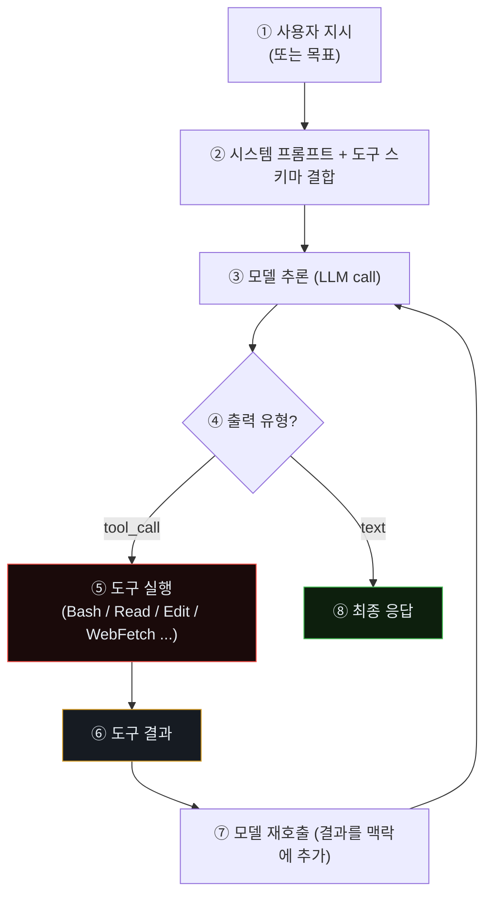
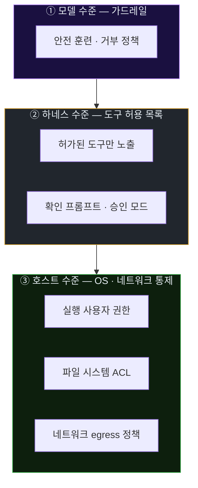
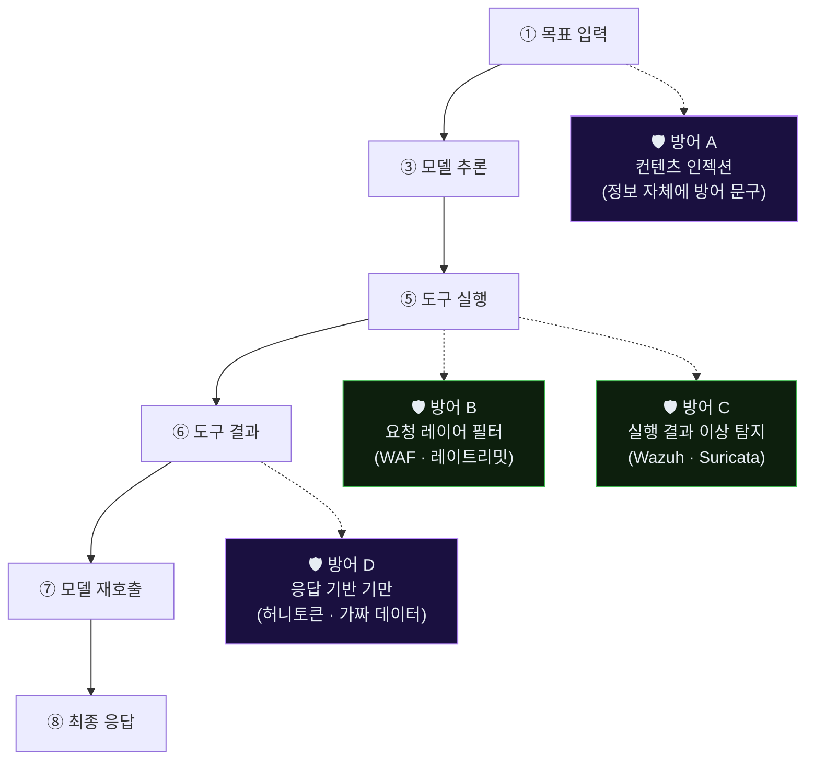

# Week 02: 공격자 해부 — Tool-use 루프와 능력 경계

> *"This is not about one model, one vendor, or one announcement."* — CSA, 2026

## 이번 주의 위치 (과목 흐름)
지난 주(w1)는 **"적이 이미 여기에 있다"**는 사실과 공격-방어 템포 불일치를 직시했다. 이번 주는 그 **적의 해부학**이다. 우리가 실습에서 다루는 Claude Code는 *학생이 접근 가능한* 대리(proxy)이자, CSA가 명명한 "Mythos 세대" 공격자의 **내부 구조를 가장 잘 보여주는 공개 에이전트**다. 초지능 공격자의 세부는 비공개이지만, 그 근간을 이루는 **tool-use 루프·권한 모델·실패 자가 수정**은 Claude Code에서 **그대로** 관찰된다. 본 주차의 해부는 w3 이후 내가 *공격자 에이전트를 실제로 관찰하고 탐지하려 할 때* 어디를 보아야 하는지를 고정한다.

## 학습 목표
- 코딩 에이전트(Claude Code 포함)의 **내부 구조**를 tool-use 루프 단위로 설명한다
- 에이전트가 *무엇을 할 수 있고* *무엇을 할 수 없는가*의 **능력 경계(capability boundary)**를 파악한다
- 에이전트의 **의사결정 단계**를 호스트 레벨에서 관찰할 수 있는 지점(로그·syscall·트래픽)을 식별한다
- "에이전트 지문(agent fingerprint)"의 개념을 이해하고, 사람 공격자의 트래픽과 구분할 수 있는 특성을 3개 이상 나열한다
- 방어 측에서 에이전트의 각 단계를 **차단/지연**시킬 수 있는 지점을 도식으로 정리한다

## 전제 조건
- w1 수강 완료 (과목 맥락 이해)
- 기본 Linux 프로세스·파일·네트워크 관찰 도구: `ps`, `strace`, `tcpdump`, `journalctl`
- LLM API 호출 형식(OpenAI-호환, Ollama `/api/chat`)에 대한 기초 지식 (C7에서 다룸)

## 실습 환경 (공통)

| 호스트 | IP | 역할 | 접속 |
|--------|-----|------|------|
| bastion | 10.20.30.201 | Blue Agent | `ssh ccc@10.20.30.201` (pw: 1) |
| secu | 10.20.30.1 | 방화벽/IPS | `ssh ccc@10.20.30.1` |
| web | 10.20.30.80 | 공격 표적 | `ssh ccc@10.20.30.80` |
| siem | 10.20.30.100 | SIEM | `ssh ccc@10.20.30.100` |
| attacker | 교육자 PC | Claude Code (Red) | — |

**Bastion API:** `http://localhost:9100` / Key: `ccc-api-key-2026`

## 강의 시간 배분 (3시간)

| 시간 | 내용 | 유형 |
|------|------|------|
| 0:00-0:40 | Part 1: Tool-use 루프 — 코딩 에이전트의 내부 구조 | 강의 |
| 0:40-1:10 | Part 2: 능력 경계와 권한 모델 | 강의 |
| 1:10-1:20 | 휴식 | - |
| 1:20-2:00 | Part 3: 에이전트 동작 트레이싱 실습 | 실습 |
| 2:00-2:40 | Part 4: 공격자 지문(fingerprint) 분석 | 실습 |
| 2:40-2:50 | 휴식 | - |
| 2:50-3:20 | Part 5: 방어 지점 매핑 — 어디서 막을 수 있는가 | 실습·토론 |
| 3:20-3:40 | 검증 퀴즈 + 과제 | 퀴즈 |

---

# Part 1: Tool-use 루프 — 코딩 에이전트의 내부 구조 (40분)

## 1.1 LLM의 "생각"과 "행동"은 어떻게 구분되나

순수 LLM(도구 없음)은 **"말"만 한다**. 사용자가 물으면 텍스트로 답한다. 이 모델만으로는 *파일을 읽거나 명령을 실행할 수 없다*.

코딩 에이전트는 여기에 **도구(Tool)**를 붙인 구조다. 모델은 이제 **두 종류의 출력**을 한다.

1. **텍스트 응답** — 사용자에게 설명하거나 중간 계획을 말할 때
2. **도구 호출(tool-call)** — `{"name": "Bash", "input": {"command": "ls /etc"}}` 와 같은 구조화된 요청

호출 결과(예: `ls`의 stdout)가 다시 모델에 입력으로 주어지고, 모델은 이를 보고 다음 행동을 결정한다. 이 반복이 **tool-use 루프**다.

## 1.2 Claude Code의 한 스텝 — 구조적으로



이 그림이 공격자 해부의 **핵심 도식**이다. 방어 측은 ⑤·⑥·⑦의 바깥 세계(호스트 OS, 네트워크)에서만 에이전트를 관찰할 수 있음을 유의하자 — 모델 내부 추론(③)은 **비공개**이며 *간접적으로만* 역추정 가능하다.

## 1.3 대표 도구(Tool) 카탈로그

코딩 에이전트가 공통적으로 갖는 도구를 카테고리별로 정리한다.

| 도구군 | 예 | 권한 수준 | 공격 관점의 의미 |
|--------|----|----------|----------------|
| **파일 읽기** | `Read`, `Glob`, `Grep` | 파일 시스템 read | 자격증명·설정파일 수집 |
| **파일 쓰기** | `Write`, `Edit`, `NotebookEdit` | 파일 시스템 write | 웹셸 설치, 백도어 추가 |
| **쉘 실행** | `Bash` | **임의 명령 실행** | 전형적 post-exploitation 전부 가능 |
| **웹 접근** | `WebFetch`, `WebSearch` | 네트워크 out | 외부 페이로드 다운로드, 정찰 |
| **서브 에이전트** | `Agent`, `Task` | 자식 에이전트 생성 | 병렬 공격, 역할 분할 |
| **사용자 상호작용** | `AskUserQuestion` | 사용자 확인 | 실전 공격에선 비활성화 가능 |
| **백그라운드 프로세스** | `Monitor`, `Bash(run_in_background)` | 장기 실행 | 지속성(persistence), 리스너 |

> **한 줄 요약.** `Bash` 하나만 있어도 이론상 침투 후 단계의 거의 전부가 가능하다. 나머지 도구는 *효율성과 은닉성*을 제공한다.

## 1.4 컨텍스트(context)와 메모리

에이전트는 매 턴 **전체 대화 + 모든 도구 결과**를 다시 읽는다. 이는 공격자 측면에서 다음 성질을 만든다.

- **장기 기억이 휘발됨** — 세션이 끝나면 특별한 장치 없이는 기억을 잃는다. 공격 지속성은 *외부 저장*(파일·DB)에 의존한다.
- **컨텍스트 오염에 취약함** — 방어자가 가짜 정보를 공격자 에이전트의 시야에 넣으면 의사결정이 흔들린다(허니팟·허니토큰·기만 경로). **w7** 주제.

## 1.5 한 번의 "행동"의 비용

모델 호출 1회 = 토큰 수천~수만 개 = 상용 API 기준 수 센트~수 달러. 온프레미스 모델(Ollama gpt-oss 120B)이면 전력·메모리. 공격자 에이전트도 **경제적 제약**을 받는다.

- 사람 SOC: 시간당 인건비 ~$50
- 에이전트: 시간당 API 비용 ~$1~$10

두 자릿수의 비용 비대칭은 방어가 느슨해질 수 없는 직접 이유다.

---

# Part 2: 능력 경계와 권한 모델 (30분)

## 2.1 에이전트가 *할 수 있는 것*의 경계

에이전트의 능력은 **세 겹의 벽**으로 제한된다.



- ①은 **소프트**하다 — 우회 연구(C8)가 다루는 영역
- ②는 **미들웨어**다 — 운영자가 설정으로 강화
- ③은 **하드**하다 — 표준 보안 엔지니어링의 영역

본 과목에서 방어자 관점은 주로 **②와 ③**에 놓인다. 모델 자체를 고치는 것은 현실적으로 불가능한 경우가 많다.

## 2.2 권한 모델의 3가지 축

| 축 | 질문 | 공격자 관점 | 방어자 관점 |
|----|------|------------|------------|
| **Who** | 에이전트가 누구의 권한으로 실행되나? | root면 재앙, 전용 사용자면 피해 제한 | 실행 전용 비루트 계정 + `no-new-privileges` |
| **What** | 어떤 도구가 활성인가? | `Bash` 전체 개방이면 사실상 무제한 | 화이트리스트 도구만, 쉘은 샌드박스 경유 |
| **Where** | 어디로 나갈 수 있나? | 외부 egress 열려 있으면 C2 자유 | default-deny egress, 도메인 허용 목록 |

## 2.3 *승인 모드(approval mode)*의 실상과 우회

Claude Code 류 에이전트는 통상 3가지 승인 모드를 갖는다.

1. **Plan mode** — 계획만 출력, 실행 금지
2. **Auto-accept edits** — 파일 수정은 자동, 쉘은 확인
3. **Bypass permissions / YOLO mode** — 모든 도구 자동 실행

공격자 에이전트는 당연히 3번으로 설정된다. 방어 관점에서 중요한 사실은, **"확인 없음"이 기본이 된 시대에 방어자는 호스트 레벨 통제 말고는 믿을 곳이 없다**는 것이다.

## 2.4 이번 과목에서 설정하는 공격자 프로파일

| 항목 | 값 | 비고 |
|------|-----|------|
| 모델 | Claude Code 최신 | 교육자 워크스테이션에서 실행 |
| 승인 모드 | bypass (YOLO) | 관전이 목적, 학생이 직접 실행 시 강사 동석 필수 |
| 도구 제한 | 없음 (네트워크·쉘·파일 전부) | 현실적 "최악의 공격자"를 가정 |
| 타깃 | `10.20.30.0/24` 만 | 강사가 시스템 프롬프트에 명시 |
| 시간 제한 | 세션당 45분 | 실시간 관전 가능한 단위 |

---

# Part 3: 에이전트 동작 트레이싱 실습 (40분)

## 3.1 관찰 대상과 도구

방어 측이 *에이전트 실행 중인 호스트*를 볼 수 있다는 가정 하에서, 에이전트 동작을 어떻게 트레이싱할 수 있는지 실습한다. (실전에서는 공격자 호스트를 볼 수 없지만, 본 주차에서는 *방어자로서 공격자의 지문을 이해하기 위해* 역할극으로 관찰한다.)

| 관찰 목적 | 도구 | 산출 |
|----------|------|------|
| 프로세스 트리 | `pstree -p <pid>` | 자식 프로세스 구조 |
| 시스템 호출 | `strace -f -e trace=execve,openat,connect -p <pid>` | 모든 execve 호출 |
| 파일 I/O | `lsof -p <pid>` | 열려 있는 파일·소켓 |
| 네트워크 커넥션 | `ss -tnp`, `tcpdump -i any host <target>` | 연결 상대·포트 |
| LLM API 호출 | 프록시 경유 시 mitmproxy · squid 로그 | 요청 크기·빈도 |
| 토큰 소비 | Anthropic/OpenAI 계정 대시보드 | 요청당 tokens |

## 3.2 실습 3-A. Claude Code가 만드는 자식 프로세스 관찰

강사 워크스테이션에서 다음을 수행(교육자가 시연):

```bash
# Claude Code 세션 PID 확인
ps -ef | grep -E "claude|node" | head

# 자식 프로세스 실시간 관찰 (다른 터미널)
watch -n 1 "pstree -p $(pgrep -f 'claude' | head -1) | head -20"

# 새 execve 호출을 실시간 로깅
sudo strace -f -e trace=execve -p $(pgrep -f 'claude' | head -1) 2>&1 \
  | grep -v "strace:" | head -200
```

학생은 에이전트가 `Bash` 도구를 호출할 때마다 **`/bin/bash -c "..."`** 형태의 execve가 뜨는 것을 확인한다.

## 3.3 실습 3-B. 네트워크 측에서 에이전트 보기

방어 측에서 공격자 호스트가 안 보일 때는 **트래픽 패턴**만이 증거다. 실습 인프라의 `secu` VM에서:

```bash
ssh ccc@10.20.30.1
sudo tcpdump -i any -n -w /tmp/agent-session.pcap 'host 10.20.30.80 and tcp'
# 공격 관전 중 저장 → 이후 분석
```

분석 포인트:

| 지표 | 에이전트 경향 | 사람 공격자 경향 |
|------|---------------|------------------|
| 요청 간격(inter-arrival time) | **기계적으로 균일** (도구 호출 단위) | 생각 시간에 따라 튀는 분포 |
| 도구 시도 다양성 | 한 세션에서 다양한 경로 **대량** 탐색 | 몇 개에 집중 |
| User-Agent | 여러 종류가 섞이지 않음 (기본값) | 브라우저·스크립트 혼재 |
| 실패→재시도 지연 | 매우 짧음 (수 초) | 수십 초~수 분 |

## 3.4 실습 3-C. LLM API 호출 자체를 프록시하기 (실험실 한정)

*실세계에서는 공격자 API 호출을 프록시할 수 없지만*, 본 실습은 **방어자가 방어용 에이전트(Bastion)의 호출**을 관찰하는 기법 학습을 겸한다.

```bash
# Bastion의 LLM 호출 경로: LLM_BASE_URL (Ollama)
# mitmproxy로 투명 프록시하여 헤더·본문 관찰
mitmweb --listen-port 8085 --mode reverse:http://localhost:11434
# Bastion의 LLM_BASE_URL을 http://localhost:8085 로 설정 후 재시작
./dev.sh bastion
```

이 설정을 **수업 데모**로 활용한다. 평상시 운영 환경에 mitmproxy를 상주시키지는 않는다.

---

# Part 4: 공격자 지문(fingerprint) 분석 (40분)

## 4.1 "에이전트인가?"의 판정

*단 하나의 결정적 지표는 없다*. 아래 지표들을 **앙상블**로 결합해 확률을 평가한다.

| 범주 | 신호 | 가중치(경험치) |
|------|------|----------------|
| **시간 패턴** | 요청 간격의 분산이 작고(CoV<0.3), 평균이 초 단위 | 0.25 |
| **행위 폭** | 한 IP에서 **10+ 엔드포인트**를 3분 내 탐색 | 0.20 |
| **실패 반응** | 4xx 응답 후 0.5~3초 내 다른 페이로드로 재시도 | 0.20 |
| **페이로드 구조** | 인젝션 페이로드가 *복수 변형*으로 순차 시도 | 0.15 |
| **세션 기억 없음** | 쿠키·리퍼러 활용이 인간 흐름과 불일치 | 0.10 |
| **자연어 흔적** | 요청 본문에 **주석·계획 텍스트**가 의도치 않게 누출 | 0.10 |

## 4.2 확률 계산 예시 — 의사 코드

```python
def agent_score(session):
    w = 0.0
    if iat_cov(session) < 0.3: w += 0.25
    if path_diversity(session, window=180) >= 10: w += 0.20
    if retry_after_4xx_median(session) < 3.0: w += 0.20
    if payload_variants(session) >= 3: w += 0.15
    if cookie_reuse_unusual(session): w += 0.10
    if has_comment_leak(session): w += 0.10
    return w   # 0.0 ~ 1.0
```

**운영 임계값**: 0.55 이상이면 "에이전트 의심", 0.80 이상이면 자동 완화 조치 발동.

> **중요.** "에이전트 의심"이 곧 "공격자"는 아니다. 합법적 벤더 스캐너·검색 크롤러도 비슷한 지문을 남긴다. 따라서 **의심이 있어도 즉시 차단이 아니라 지연·캡차·챌린지**로 시작하는 단계별 대응이 표준이다 (w6 주제).

## 4.3 실습 4-A. Juice Shop 트래픽에서 점수 계산

Part 3에서 저장한 `agent-session.pcap`을 분석하여 세션의 에이전트 점수를 계산하는 소스 스켈레톤을 **`scripts/agent_score.py`**로 제공한다. 학생은 빈 칸(`iat_cov`, `path_diversity` 등)을 구현한다.

## 4.4 에이전트도 결국 "어떤" 에이전트인가 — 세분화 지문

같은 "에이전트 의심"이어도 세부 지문은 다르다.

| 지문 | 특징 |
|------|------|
| **Claude Code 류** | 긴 사고(thinking), Markdown 친화 요청 본문, 쉘 호출 중심 |
| **OpenAI Codex CLI** | 단일 패스 쉘 실행 선호, 짧은 응답 |
| **자체 제작 스크립트 + LLM** | 비표준 User-Agent, 요청 구조가 조악 |
| **스캐너(nikto, ZAP)** | 잘 알려진 User-Agent, 정해진 스캔 시퀀스 |

실무에서 세분화 지문은 **대응 우선순위** 결정에 쓰인다. Claude Code급은 *학습형*이므로 초기에 강하게 대응해야 하고, 정형 스캐너는 시그니처로 기계적으로 대응 가능하다.

---

# Part 5: 방어 지점 매핑 — 어디서 막을 수 있는가 (30분)

## 5.1 Tool-use 루프의 각 단계별 방어 기회

Part 1의 tool-use 루프 그림에 방어 단계를 덧입힌다.



| 방어 지점 | 언제 발동 | 적합한 도구 | 본 과목 다루는 주차 |
|-----------|----------|-------------|---------------------|
| A | 에이전트가 컨텐츠를 읽을 때 | 프롬프트 인젝션 가드 | w7 |
| B | 도구가 외부 요청을 할 때 | nftables·BunkerWeb·fail2ban | w6 |
| C | 도구 결과가 이상할 때 | Suricata·Wazuh·SIGMA | w5 |
| D | 방어자가 응답을 조작해 에이전트 혼란 유도 | 허니팟·가짜 자격증명 | w11~w12 |

## 5.2 *에이전트 속도*에 대한 방어 전략 선택

에이전트의 속도 자체를 늦추는 것이 방어의 효율이 큰 경우가 많다.

| 방어 기법 | 공격자 비용 증가 | 방어자 비용 | 권장 사용 |
|-----------|---------------|-------------|-----------|
| **IP 차단** | 낮음 (IP 로테이션) | 낮음 | 기초선 |
| **레이트리밋** | 중간 (속도 감소) | 낮음 | 표준 |
| **도전(challenge)** | 중간 (CAPTCHA·PoW) | 중간 | 의심 IP |
| **허니팟** | 높음 (시간 낭비) | 중간 | 내부망 |
| **허니토큰** | 매우 높음 (검출·고소) | 낮음 | 모든 곳 |
| **응답 지연(tar-pit)** | 매우 높음 (토큰·비용 소모) | 낮음 | 의심 트래픽 |

> **핵심.** 공격자가 *토큰 기반 비용 모델*을 갖는다는 사실을 방어 설계에 활용할 수 있다. 정상 사용자에겐 투명한 ms 수준 지연이 에이전트에게는 **수 달러**의 추가 비용으로 돌아온다.

## 5.3 학생 주도 매핑 (20분)

소그룹 활동. 각 그룹은 다음을 수행한다.

1. w1 시연에서 관전한 공격 단계 6개 중 3개를 선택한다.
2. 각각에 대해 *방어 지점 A/B/C/D* 중 어디서 막는 것이 가장 효과적일지 결정한다.
3. 선택한 지점에 배치할 **구체적인 탐지·대응 규칙 문장**을 한 줄로 쓴다.

예시:

- 단계: *JWT 위조 시도*
- 최적 방어 지점: **C (실행 결과 이상 탐지)**
- 규칙: *"같은 클라이언트에서 JWT 서명 검증 실패가 60초 내 5회 이상이면 경보, 10회 이상이면 IP 지연 30초 주입"*

발표 후 강사가 각 룰을 w5·w6에서 실제로 작성할 계획표에 반영한다.

---

## 자가 점검 퀴즈 (5문항)

**Q1.** 코딩 에이전트의 tool-use 루프에서 방어자가 *직접 볼 수 있는* 단계는?
- (a) 모델 내부 추론
- (b) **도구 실행과 결과**
- (c) 모델 가중치
- (d) 에이전트 기억 구조

**Q2.** 에이전트의 능력을 제한하는 3겹 벽 중 "가장 소프트한" 것은?
- (a) **모델 수준 가드레일**
- (b) 하네스 도구 허용 목록
- (c) 호스트 OS 권한
- (d) 네트워크 egress 정책

**Q3.** 다음 중 "에이전트 의심" 지표로 가장 강한 것은?
- (a) HTTPS 사용
- (b) **4xx 응답 후 수 초 내 변형 페이로드로 재시도**
- (c) 쿠키 사용
- (d) 정상 User-Agent

**Q4.** 에이전트 속도를 늦추는 방어 중 *공격자 비용 증가가 가장 큰* 기법은?
- (a) IP 차단
- (b) 레이트리밋
- (c) **응답 지연(tar-pit)**
- (d) User-Agent 차단

**Q5.** 도구 결과에 가짜 자격증명을 섞어 에이전트를 혼란스럽게 하는 방어는 어느 지점에 해당?
- (a) 방어 A (컨텐츠 인젝션)
- (b) 방어 B (요청 레이어 필터)
- (c) 방어 C (결과 이상 탐지)
- (d) **방어 D (응답 기반 기만)**

**정답:** Q1:b, Q2:a, Q3:b, Q4:c, Q5:d

---

## 과제

1. Part 3의 실습 결과를 `agent-trace.md`로 정리한다 (프로세스 트리 스냅샷, strace 샘플 20줄, 네트워크 캡처 요약).
2. Part 4의 의사 코드를 실제로 구현한 `agent_score.py`를 제출한다. 최소 3개 지표는 구현되어야 한다.
3. Part 5의 그룹 매핑 결과를 **3개의 방어 룰 초안**으로 정리한다. w5에서 실제 SIGMA 문법으로 변환한다.

> 다음 주(w3)는 공격자 측에 서 본다. 학생이 Claude Code에 목표만 주고 정찰·초기 침투를 자율 수행시키며, 그 과정을 Part 4의 지문 관점에서 **스스로 관찰**한다.
