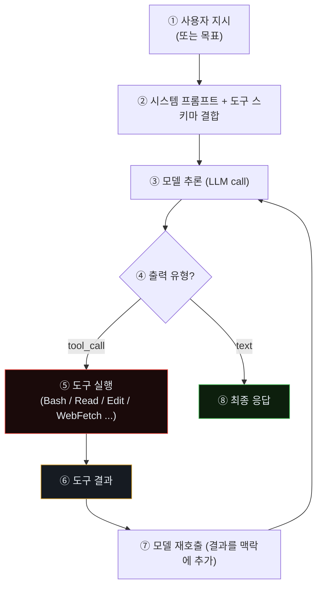
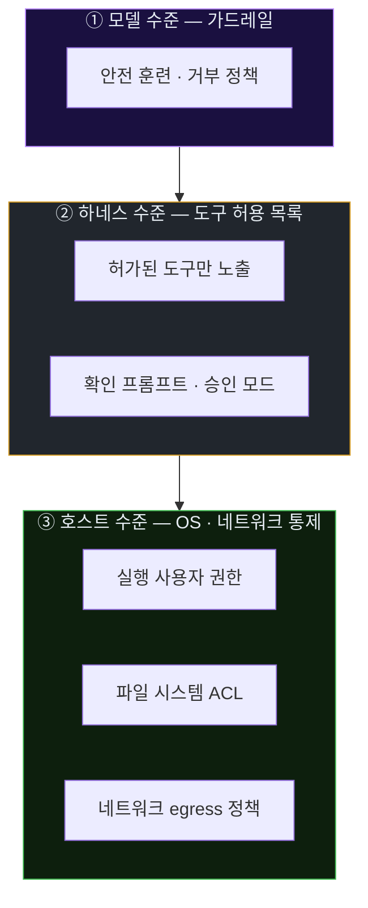
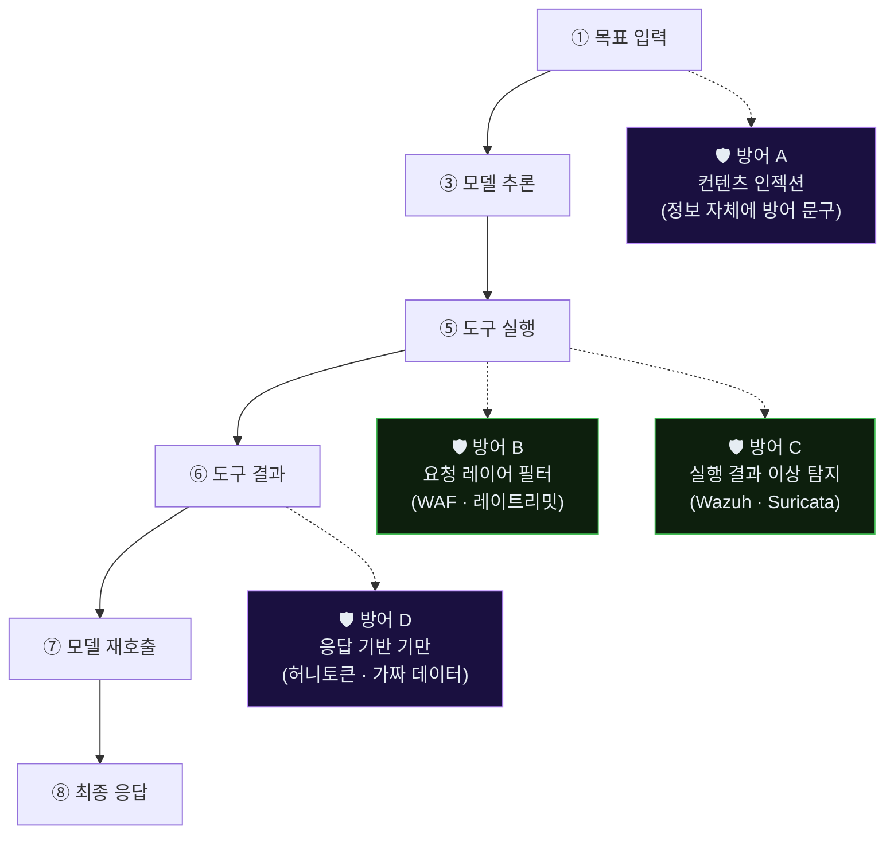

# Week 02: 공격자 해부 — Tool-use 루프와 능력 경계

> *"This is not about one model, one vendor, or one announcement."* — CSA, 2026

## 이번 주의 위치 (과목 흐름)
지난 주(w1)는 **"적이 이미 여기에 있다"**는 사실과 공격-방어 템포 불일치를 직시했다. 이번 주는 그 **적의 해부학**이다. 우리가 실습에서 다루는 Claude Code는 *학생이 접근 가능한* 대리(proxy)이자, CSA가 명명한 "Mythos 세대" 공격자의 **내부 구조를 가장 잘 보여주는 공개 에이전트**다. 초지능 공격자의 세부는 비공개이지만, 그 근간을 이루는 **tool-use 루프·권한 모델·실패 자가 수정**은 Claude Code에서 **그대로** 관찰된다. 본 주차의 해부는 w3 이후 내가 *공격자 에이전트를 실제로 관찰하고 탐지하려 할 때* 어디를 보아야 하는지를 고정한다.

## 학습 목표
- 코딩 에이전트(Claude Code 포함)의 **내부 구조**를 tool-use 루프 단위로 설명한다
- 에이전트가 *무엇을 할 수 있고* *무엇을 할 수 없는가*의 **능력 경계(capability boundary)**를 파악한다
- 에이전트의 **의사결정 단계**를 호스트 레벨에서 관찰할 수 있는 지점(로그·syscall·트래픽)을 식별한다
- "에이전트 지문(agent fingerprint)"의 개념을 이해하고, 사람 공격자의 트래픽과 구분할 수 있는 특성을 3개 이상 나열한다
- 방어 측에서 에이전트의 각 단계를 **차단/지연**시킬 수 있는 지점을 도식으로 정리한다

## 전제 조건
- w1 수강 완료 (과목 맥락 이해)
- 기본 Linux 프로세스·파일·네트워크 관찰 도구: `ps`, `strace`, `tcpdump`, `journalctl`
- LLM API 호출 형식(OpenAI-호환, Ollama `/api/chat`)에 대한 기초 지식 (C7에서 다룸)

## 실습 환경 (공통)

| 호스트 | IP | 역할 | 접속 |
|--------|-----|------|------|
| bastion | 10.20.30.201 | Blue Agent | `ssh ccc@10.20.30.201` (pw: 1) |
| secu | 10.20.30.1 | 방화벽/IPS | `ssh ccc@10.20.30.1` |
| web | 10.20.30.80 | 공격 표적 | `ssh ccc@10.20.30.80` |
| siem | 10.20.30.100 | SIEM | `ssh ccc@10.20.30.100` |
| attacker | 교육자 PC | Claude Code (Red) | — |

**Bastion API:** `http://localhost:9100` / Key: `ccc-api-key-2026`

## 강의 시간 배분 (3시간)

| 시간 | 내용 | 유형 |
|------|------|------|
| 0:00-0:40 | Part 1: Tool-use 루프 — 코딩 에이전트의 내부 구조 | 강의 |
| 0:40-1:10 | Part 2: 능력 경계와 권한 모델 | 강의 |
| 1:10-1:20 | 휴식 | - |
| 1:20-2:00 | Part 3: 에이전트 동작 트레이싱 실습 | 실습 |
| 2:00-2:40 | Part 4: 공격자 지문(fingerprint) 분석 | 실습 |
| 2:40-2:50 | 휴식 | - |
| 2:50-3:20 | Part 5: 방어 지점 매핑 — 어디서 막을 수 있는가 | 실습·토론 |
| 3:20-3:40 | 검증 퀴즈 + 과제 | 퀴즈 |

---

# Part 1: Tool-use 루프 — 코딩 에이전트의 내부 구조 (40분)

## 1.1 LLM의 "생각"과 "행동"은 어떻게 구분되나

순수 LLM(도구 없음)은 **"말"만 한다**. 사용자가 물으면 텍스트로 답한다. 이 모델만으로는 *파일을 읽거나 명령을 실행할 수 없다*.

코딩 에이전트는 여기에 **도구(Tool)**를 붙인 구조다. 모델은 이제 **두 종류의 출력**을 한다.

1. **텍스트 응답** — 사용자에게 설명하거나 중간 계획을 말할 때
2. **도구 호출(tool-call)** — `{"name": "Bash", "input": {"command": "ls /etc"}}` 와 같은 구조화된 요청

호출 결과(예: `ls`의 stdout)가 다시 모델에 입력으로 주어지고, 모델은 이를 보고 다음 행동을 결정한다. 이 반복이 **tool-use 루프**다.

### 1.1.1 한 턴의 JSON 레벨 — 실제로 오가는 구조

실제 API 단에서 한 턴이 어떻게 표현되는지 (Anthropic Messages API 기준, 단순화).

```json
// 모델의 응답 (tool_use)
{
  "role": "assistant",
  "content": [
    {"type": "text", "text": "먼저 시스템 정보를 확인하겠습니다."},
    {"type": "tool_use", "id": "tu_01",
     "name": "Bash",
     "input": {"command": "uname -a && id"}}
  ]
}

// 다음 턴에 하네스가 결과를 user 메시지로 재주입
{
  "role": "user",
  "content": [
    {"type": "tool_result", "tool_use_id": "tu_01",
     "content": "Linux web 6.8.0-107 #107 ... x86_64\nuid=33(www-data) ..."}
  ]
}
```

중요한 관찰:
- 모델은 *텍스트*(중간 설명)와 *구조화된 tool_use*(실행 요청)를 한 응답 안에서 **섞어 낸다**.
- 하네스는 tool_use를 *외부에서* 실행해 결과를 다시 넣는다. 이 경계가 **방어자의 가시성 경계**다.
- `tool_use_id`로 호출-결과 쌍이 연결된다. 동일 턴에 여러 tool이 호출되면 병렬 처리되어 하네스가 결과를 묶어 다음 턴에 준다.

방어자가 이해해야 할 사실: 모델 내부의 *의도 문장*은 tool_result가 돌아오기 전에 이미 기록되어 있다. 이것이 **프롬프트 인젝션 공격의 핵심 취약점**이 된다 — w7에서 다룸.

### 1.1.2 tool-use 루프의 종료 조건

루프는 언제 끝나는가.

1. 모델이 tool_use 없이 **text만 반환**할 때 (작업 완료 선언)
2. 하네스가 설정한 **최대 턴 수**(예: 50턴)를 초과할 때
3. **토큰 비용 상한** 도달
4. **사용자 개입**(중단·새 지시)
5. 도구 실행에서 **치명적 오류**(권한 거부·세션 종료 등)

이 다섯 중 **2~5**는 방어자가 *유발*할 수 있는 종료 조건이다. 즉 루프를 *단절*시키는 것이 방어의 목표 중 하나다.

- 턴 수 제한: 공격자가 에이전트를 *빠르게 소모*시키도록 *토큰 낭비* 유도 (w10 tar-pit)
- 비용 상한: 공격자 측 API 비용 증가 (응답 지연·길이 증폭)
- 치명적 오류: 권한 모델로 *도구 접근 차단* (w6 격리)

이런 관점에서 방어는 단일 경보·차단이 아니라 **적의 루프를 깨는 설계**가 된다.

### 1.1.3 왜 "루프"인가 — 선형 공격과의 차이

전통적 스캐너(nikto, nmap)는 *선형*이다: 스크립트가 정해진 순서로 실행. 에이전트는 *피드백 루프*다: 결과가 다음 결정을 바꾼다. 이 차이가 만드는 방어적 의미:

| 구분 | 선형 공격 | 에이전트 루프 |
|------|----------|---------------|
| 시그니처 유효성 | **강함** — 고정된 패턴 | **약함** — 매 루프 패턴 변화 |
| 방어자의 *기만* 효과 | 약함 — 결과가 공격자 의사결정에 영향 안 줌 | **매우 강함** — 결과가 다음 루프의 입력 |
| 반응의 *학습* | 없음 | **있음** — 실패에서 학습 |

이것이 **"허니토큰·오염 응답이 왜 에이전트에 특히 효과적인가"**의 구조적 설명이다. 선형 스캐너에게 허니토큰을 주어도 별 의미가 없지만, 루프 에이전트에게는 *다음 수십 턴의 방향을 바꾸는* 파괴력이 있다.

## 1.2 Claude Code의 한 스텝 — 구조적으로



이 그림이 공격자 해부의 **핵심 도식**이다. 방어 측은 ⑤·⑥·⑦의 바깥 세계(호스트 OS, 네트워크)에서만 에이전트를 관찰할 수 있음을 유의하자 — 모델 내부 추론(③)은 **비공개**이며 *간접적으로만* 역추정 가능하다.

## 1.3 대표 도구(Tool) 카탈로그

코딩 에이전트가 공통적으로 갖는 도구를 카테고리별로 정리한다.

| 도구군 | 예 | 권한 수준 | 공격 관점의 의미 |
|--------|----|----------|----------------|
| **파일 읽기** | `Read`, `Glob`, `Grep` | 파일 시스템 read | 자격증명·설정파일 수집 |
| **파일 쓰기** | `Write`, `Edit`, `NotebookEdit` | 파일 시스템 write | 웹셸 설치, 백도어 추가 |
| **쉘 실행** | `Bash` | **임의 명령 실행** | 전형적 post-exploitation 전부 가능 |
| **웹 접근** | `WebFetch`, `WebSearch` | 네트워크 out | 외부 페이로드 다운로드, 정찰 |
| **서브 에이전트** | `Agent`, `Task` | 자식 에이전트 생성 | 병렬 공격, 역할 분할 |
| **사용자 상호작용** | `AskUserQuestion` | 사용자 확인 | 실전 공격에선 비활성화 가능 |
| **백그라운드 프로세스** | `Monitor`, `Bash(run_in_background)` | 장기 실행 | 지속성(persistence), 리스너 |

> **한 줄 요약.** `Bash` 하나만 있어도 이론상 침투 후 단계의 거의 전부가 가능하다. 나머지 도구는 *효율성과 은닉성*을 제공한다.

### 1.3.1 각 도구의 *방어 관찰 지점* — 어떻게 탐지하나

각 도구군이 실행되었을 때 방어자가 볼 수 있는 흔적을 정리한다.

| 도구군 | 호스트 흔적 | 네트워크 흔적 | SIEM 룰 아이디어 |
|--------|-------------|---------------|-----------------|
| **Read/Glob/Grep** | 파일 읽기 (auditd `-w <path> -p r`) | 없음 | 다수 `.env`, `.ssh`, `id_rsa` 연속 읽기 → 경보 |
| **Write/Edit** | 파일 생성·수정 (auditd `-p wa`) | 없음 | `/tmp`·`/var/tmp`에 실행 가능 스크립트 생성 |
| **Bash** | `/bin/bash -c ...` execve | 명령 결과 전파 | 짧은 간격 다수 execve, `curl|wget` 연쇄 |
| **WebFetch/WebSearch** | 네트워크 아웃바운드 | 외부 HTTP 요청 | egress 정책 위반, DNS 이상 |
| **Agent/Task** | 자식 프로세스 트리 | — | 동일 부모의 병렬 세션 |
| **Monitor/background** | 장시간 실행 프로세스 | 지속 연결 | 장기 idle 프로세스, cron·systemd 신규 유닛 |

예를 들어 Bash 도구의 검출은 auditd로 다음처럼 구성한다.

```bash
sudo auditctl -a always,exit -F arch=b64 -S execve -k agent_bash
# 조회
sudo ausearch -k agent_bash --start recent | head
```

이 작업은 *기본 베이스라인*이다. w5~w6에서 이 신호를 Bastion 스킬로 연결한다.

### 1.3.2 도구 *허용 목록*의 3단 구조

방어 측이 설계하는 도구 허용 모델은 일반적으로 3단이다.

1. **전부 차단**: 실험실·샌드박스. 에이전트를 *실행 자체* 막음
2. **최소 허용**: Read·WebFetch만. 에이전트 *질의* 용도만 인정
3. **실행 허용 + 감사**: Bash·Write까지 허용하되 *모든 호출이 감사됨*. 실무 일반 설정

본 실습 인프라는 *3번* 설정을 가정한다. Bastion은 이 가정에서 *감사 로그를 자동 해석*하는 책임을 진다.

### 1.3.3 *화이트리스트 경로*의 패러독스

"`/tmp`만 쓰기 허용"으로 풀면 에이전트의 공격은 *`/tmp`에 집중*된다. 반대로 "`/home/attacker`만 허용"도 비슷하다. 허용 목록은 공격자를 *특정 경로에 몰아넣는* 효과가 있으므로, 그 경로를 **가장 면밀히 감시**하는 방식으로 활용해야 한다.

본 과목의 실습에서는 `/tmp` + `/var/tmp`를 감시 핫스팟으로 지정한다.

## 1.4 컨텍스트(context)와 메모리

에이전트는 매 턴 **전체 대화 + 모든 도구 결과**를 다시 읽는다. 이는 공격자 측면에서 다음 성질을 만든다.

- **장기 기억이 휘발됨** — 세션이 끝나면 특별한 장치 없이는 기억을 잃는다. 공격 지속성은 *외부 저장*(파일·DB)에 의존한다.
- **컨텍스트 오염에 취약함** — 방어자가 가짜 정보를 공격자 에이전트의 시야에 넣으면 의사결정이 흔들린다(허니팟·허니토큰·기만 경로). **w7** 주제.

## 1.5 한 번의 "행동"의 비용

모델 호출 1회 = 토큰 수천~수만 개 = 상용 API 기준 수 센트~수 달러. 온프레미스 모델(Ollama gpt-oss 120B)이면 전력·메모리. 공격자 에이전트도 **경제적 제약**을 받는다.

- 사람 SOC: 시간당 인건비 ~$50
- 에이전트: 시간당 API 비용 ~$1~$10

두 자릿수의 비용 비대칭은 방어가 느슨해질 수 없는 직접 이유다.

### 1.5.1 비용 계산 예 — 현실감을 주는 숫자

한 번의 공격 세션(60분, 중간 복잡도)에서 공격자가 소비하는 토큰의 대략치.

| 항목 | 토큰 추정 |
|------|-----------|
| 시스템 프롬프트 + 도구 스키마 | ~8K (고정) |
| 한 턴 평균 입력 (누적 context) | ~20K |
| 한 턴 평균 출력 | ~1K |
| 턴 수 | 30~60 |
| 총 입력 | ~1M |
| 총 출력 | ~60K |

상용 모델의 가격(2026 상반기, 대략): 입력 $3/M, 출력 $15/M. 공격 1회 ≈ $4 내외. *저렴*해 보이지만:

- **공격자가 실패할 때마다** 세션이 길어지고 비용이 선형 증가.
- **방어자가 tar-pit**으로 응답을 늘어지게 하면, 같은 결과를 얻기 위해 *2~5배 세션*이 필요 → $8~$20.
- **방어자가 허니 응답**으로 공격자를 엉뚱한 방향으로 밀어넣으면, 공격자가 *완전 실패*하고 $20도 낭비.

방어자가 공격자의 비용을 10배로 만들 수 있다면, *동일 방어 예산*으로도 공격자의 ROI를 부수는 것이 가능하다.

### 1.5.2 "공격자 ROI" — 방어 설계의 단일 지표

본 과목이 제안하는 방어 설계의 *최상위 지표*는 **공격자의 ROI(투자 대비 수익)을 음수로 만든다**이다.

```
공격자_ROI = (기대 획득 가치) - (시도 비용 + 실패 확률 비용)
```

- 기대 획득 가치는 타깃 자산의 가치 — 방어자가 줄이기 어려움
- 시도 비용은 토큰·시간 — 방어자가 **tar-pit·오염 응답으로 증가 가능**
- 실패 확률은 방어자가 **기만·탐지로 증가 가능**

즉 방어의 두 레버: **(1) 비용 증가, (2) 실패 확률 증가**. 본 과목 w6·w10이 이 둘을 집중 다룬다.

### 1.5.3 비용 모델의 한계 — "돈이 아닌 공격자"

주의: 위 비용 모델은 *경제적 합리성*을 가정한다. 다음 주체에게는 적용이 약하다.

- **국가 지원 공격자**: 예산이 사실상 무제한
- **이념 동기 공격자**: ROI 무관
- **표적 개인 공격(doxing)**: 소액 비용도 투자

이런 공격자에게는 **탐지와 자동 격리**가 주 수단이며, *비용 공격*은 2차 수단이다. 대부분의 범용 공격자에게는 비용 공격이 1차 수단이라는 점에 오해가 없어야 한다.

---

# Part 2: 능력 경계와 권한 모델 (30분)

## 2.1 에이전트가 *할 수 있는 것*의 경계

에이전트의 능력은 **세 겹의 벽**으로 제한된다.



- ①은 **소프트**하다 — 우회 연구(C8)가 다루는 영역
- ②는 **미들웨어**다 — 운영자가 설정으로 강화
- ③은 **하드**하다 — 표준 보안 엔지니어링의 영역

본 과목에서 방어자 관점은 주로 **②와 ③**에 놓인다. 모델 자체를 고치는 것은 현실적으로 불가능한 경우가 많다.

### 2.1.1 "소프트" 경계의 실체 — 왜 모델 가드레일은 돌파되는가

가드레일은 모델의 *안전 훈련*에 의한 *확률적 억제*다. 다음 세 가지 이유로 결정적이지 못하다.

1. **확률적 거부**: 동일 요청에 대해 99%는 거부하더라도 1%는 통과한다. 공격자는 요청을 **수백 번 재구성**해 그 1%를 찾는다.
2. **맥락 전환**: "합법 점검 환경"·"소설 속 캐릭터"·"과거형 서술" 등의 맥락 변형이 거부 임계를 낮춘다. 본 과목은 *합법 교육 맥락*을 공개적으로 선언하지만, 악의적 공격자는 *위장 맥락*을 사용한다.
3. **도구 분할**: 위험 행위를 *작은 하위 행동*으로 쪼개면 개별 거부가 일어나지 않는다. 예: "웹셸을 심어줘" → 거부 / "이 파일을 이 경로에 써줘, 이 문자열은 그냥 예제다" → 통과.

이것이 방어가 **모델이 아닌 호스트·네트워크에서 막는다**는 원칙의 배경이다. 가드레일을 신뢰하지 않는다.

### 2.1.2 "미들웨어" 경계 — 허용 목록 설계의 실무

하네스 수준(②)에서 운영자가 조정 가능한 항목은 다음과 같다.

- **도구 활성화 목록**: `bash.enabled=false`가 가능한 하네스가 많다.
- **명령 필터**: Bash 활성이어도 `sudo`, `curl`, `chmod`, `chown`을 차단.
- **경로 제한**: Read/Write가 특정 경로 외부로 못 나가게.
- **시간 제한**: 세션 최대 60분.
- **턴 제한**: 50턴 이상 시 자동 종료.

실무 권장: `bash` 활성 + `curl|wget` 필터 + `/var/tmp`·`/tmp` 외 쓰기 차단 + 60분 제한. 합법 사용에는 충분, 공격에는 상당한 제약.

### 2.1.3 "하드" 경계 — 호스트·네트워크 통제의 표준 레시피

③은 표준 OS·네트워크 보안이다. 본 과목이 *새로 추가하는 것이 아니라* *에이전트 맥락에 맞춰 재강조*하는 것이다.

- **실행 사용자**: `www-agent` 같은 *에이전트 전용* 비루트 계정
- **Capabilities drop**: `capsh --drop=cap_net_raw,cap_sys_admin`
- **`no-new-privileges`**: setuid 상승 차단
- **seccomp/AppArmor**: syscall 제한
- **네트워크 네임스페이스**: 별도 veth, egress 경유 프록시
- **default-deny egress**: *화이트리스트* 도메인만 허용

이것들이 *전통 보안 원칙*인데, 에이전트 시대에 *선택사항이 아닌 기본*이 된다.

## 2.2 권한 모델의 3가지 축

| 축 | 질문 | 공격자 관점 | 방어자 관점 |
|----|------|------------|------------|
| **Who** | 에이전트가 누구의 권한으로 실행되나? | root면 재앙, 전용 사용자면 피해 제한 | 실행 전용 비루트 계정 + `no-new-privileges` |
| **What** | 어떤 도구가 활성인가? | `Bash` 전체 개방이면 사실상 무제한 | 화이트리스트 도구만, 쉘은 샌드박스 경유 |
| **Where** | 어디로 나갈 수 있나? | 외부 egress 열려 있으면 C2 자유 | default-deny egress, 도메인 허용 목록 |

## 2.3 *승인 모드(approval mode)*의 실상과 우회

Claude Code 류 에이전트는 통상 3가지 승인 모드를 갖는다.

1. **Plan mode** — 계획만 출력, 실행 금지
2. **Auto-accept edits** — 파일 수정은 자동, 쉘은 확인
3. **Bypass permissions / YOLO mode** — 모든 도구 자동 실행

공격자 에이전트는 당연히 3번으로 설정된다. 방어 관점에서 중요한 사실은, **"확인 없음"이 기본이 된 시대에 방어자는 호스트 레벨 통제 말고는 믿을 곳이 없다**는 것이다.

### 2.3.1 Bypass 모드가 만든 문화적 전환

Bypass(YOLO) 모드의 일상화는 *기술적 문제*가 아니라 **문화적 전환**이기도 하다.

- 과거: "자동화는 위험 → 사람이 꼭 확인"
- 현재: "생산성을 위해 → 기본은 자동, 예외만 확인"

이 전환이 합법 개발자의 생산성에는 이롭지만, 에이전트 오용의 판정 기준도 함께 약해진다. 방어자는 **"자동 실행이 기본이라는 가정 하에서" 로깅과 사후 감사를 강화**하는 것 외에 선택지가 없다.

### 2.3.2 Bastion의 승인 모델 — Blue 쪽 설계

Red의 승인 모델(Plan/Auto/Bypass)과 **대칭**으로, Blue(Bastion)도 승인 모델을 갖는다. 본 과목에서 Bastion은:

- **Observe-only mode**: 관찰만 (w1·w4)
- **Reactive mode**: 1차 자동 대응 (w6 이후)
- **Auto-upgrade mode**: Experience → Playbook 자동 승격 (w12 이후)

공격 측 Bypass에 **방어 측 Reactive/Auto-upgrade**로 응답하는 구조다. 즉 공격자가 *확인 없이* 움직이므로, 방어자도 *확인 없이* 1차 대응해야 템포가 맞는다.

### 2.3.3 "사람 확인"이 여전히 필요한 순간

모든 것을 자동화하면 안 된다. 다음 결정은 반드시 *사람 승인*이 유지되어야 한다.

- **조직 외부 IP 장기 차단**: 정상 파트너 IP 차단 시 사업 영향
- **시스템 재부팅·서비스 중단**: 가용성 영향
- **법적 절차 관련 결정**: 신고·공유·통지
- **고가치 자산에 대한 긴급 격리**

이들은 Bastion의 Playbook에서 *"human_approval_required: true"* 태그로 표시한다. w12에서 이 필드를 상세 다룬다.

## 2.4 이번 과목에서 설정하는 공격자 프로파일

| 항목 | 값 | 비고 |
|------|-----|------|
| 모델 | Claude Code 최신 | 교육자 워크스테이션에서 실행 |
| 승인 모드 | bypass (YOLO) | 관전이 목적, 학생이 직접 실행 시 강사 동석 필수 |
| 도구 제한 | 없음 (네트워크·쉘·파일 전부) | 현실적 "최악의 공격자"를 가정 |
| 타깃 | `10.20.30.0/24` 만 | 강사가 시스템 프롬프트에 명시 |
| 시간 제한 | 세션당 45분 | 실시간 관전 가능한 단위 |

---

# Part 3: 에이전트 동작 트레이싱 실습 (40분)

## 3.1 관찰 대상과 도구

방어 측이 *에이전트 실행 중인 호스트*를 볼 수 있다는 가정 하에서, 에이전트 동작을 어떻게 트레이싱할 수 있는지 실습한다. (실전에서는 공격자 호스트를 볼 수 없지만, 본 주차에서는 *방어자로서 공격자의 지문을 이해하기 위해* 역할극으로 관찰한다.)

| 관찰 목적 | 도구 | 산출 |
|----------|------|------|
| 프로세스 트리 | `pstree -p <pid>` | 자식 프로세스 구조 |
| 시스템 호출 | `strace -f -e trace=execve,openat,connect -p <pid>` | 모든 execve 호출 |
| 파일 I/O | `lsof -p <pid>` | 열려 있는 파일·소켓 |
| 네트워크 커넥션 | `ss -tnp`, `tcpdump -i any host <target>` | 연결 상대·포트 |
| LLM API 호출 | 프록시 경유 시 mitmproxy · squid 로그 | 요청 크기·빈도 |
| 토큰 소비 | Anthropic/OpenAI 계정 대시보드 | 요청당 tokens |

## 3.2 실습 3-A. Claude Code가 만드는 자식 프로세스 관찰

강사 워크스테이션에서 다음을 수행(교육자가 시연):

```bash
# Claude Code 세션 PID 확인
ps -ef | grep -E "claude|node" | head

# 자식 프로세스 실시간 관찰 (다른 터미널)
watch -n 1 "pstree -p $(pgrep -f 'claude' | head -1) | head -20"

# 새 execve 호출을 실시간 로깅
sudo strace -f -e trace=execve -p $(pgrep -f 'claude' | head -1) 2>&1 \
  | grep -v "strace:" | head -200
```

학생은 에이전트가 `Bash` 도구를 호출할 때마다 **`/bin/bash -c "..."`** 형태의 execve가 뜨는 것을 확인한다.

## 3.3 실습 3-B. 네트워크 측에서 에이전트 보기

방어 측에서 공격자 호스트가 안 보일 때는 **트래픽 패턴**만이 증거다. 실습 인프라의 `secu` VM에서:

```bash
ssh ccc@10.20.30.1
sudo tcpdump -i any -n -w /tmp/agent-session.pcap 'host 10.20.30.80 and tcp'
# 공격 관전 중 저장 → 이후 분석
```

분석 포인트:

| 지표 | 에이전트 경향 | 사람 공격자 경향 |
|------|---------------|------------------|
| 요청 간격(inter-arrival time) | **기계적으로 균일** (도구 호출 단위) | 생각 시간에 따라 튀는 분포 |
| 도구 시도 다양성 | 한 세션에서 다양한 경로 **대량** 탐색 | 몇 개에 집중 |
| User-Agent | 여러 종류가 섞이지 않음 (기본값) | 브라우저·스크립트 혼재 |
| 실패→재시도 지연 | 매우 짧음 (수 초) | 수십 초~수 분 |

## 3.4 실습 3-C. LLM API 호출 자체를 프록시하기 (실험실 한정)

*실세계에서는 공격자 API 호출을 프록시할 수 없지만*, 본 실습은 **방어자가 방어용 에이전트(Bastion)의 호출**을 관찰하는 기법 학습을 겸한다.

```bash
# Bastion의 LLM 호출 경로: LLM_BASE_URL (Ollama)
# mitmproxy로 투명 프록시하여 헤더·본문 관찰
mitmweb --listen-port 8085 --mode reverse:http://localhost:11434
# Bastion의 LLM_BASE_URL을 http://localhost:8085 로 설정 후 재시작
./dev.sh bastion
```

이 설정을 **수업 데모**로 활용한다. 평상시 운영 환경에 mitmproxy를 상주시키지는 않는다.

### 3.4.1 mitmproxy 없이 관찰하는 법 — 실전 방어자 관점

실세계 방어자는 공격자 호스트에 접근할 수 없다. 그래서 *네트워크 단*의 관찰이 전부다. 공격자가 상용 API를 호출하면 그 트래픽은 Anthropic·OpenAI 도메인으로 나가는데, 조직 네트워크 egress 로그에 다음과 같은 신호가 남는다.

```text
# 예: 에이전트 세션 중 외부 egress
tcpdump: 수 초 간격으로 api.anthropic.com:443 방향 TLS 요청
요청 크기: 10~100KB (입력 토큰 누적으로 증가)
응답 크기: 1~10KB (tool_use JSON)
IAT(요청 간격) 평균: 3~10s, 분산 작음
```

이 자체가 **에이전트 지문**이다. 조직이 *자사 직원*의 에이전트 사용을 허용하더라도, *공격 패턴*과 구분 가능한 신호가 존재한다: 공격 세션은 *짧은 시간에 수십 회*, 업무용은 *간헐적·수 분~수십 분* 간격.

### 3.4.2 Suricata로 에이전트 API 호출 식별

Suricata는 SNI·TLS 지문(JA3/JA4)을 통해 대략의 *어디에·무엇이* 갔는지 식별한다. 다음 룰은 *api.anthropic.com*·*api.openai.com* 호출을 이벤트로 기록한다.

```
alert tls any any -> any 443 (msg:"Claude API egress";
  tls.sni; content:"api.anthropic.com"; nocase;
  sid:1005001; rev:1; classtype:policy-violation; )
alert tls any any -> any 443 (msg:"OpenAI API egress";
  tls.sni; content:"api.openai.com"; nocase;
  sid:1005002; rev:1; classtype:policy-violation; )
```

이것은 *정책 경보*다. 차단은 하지 않고, **분포를 본다**. 어떤 소스에서 얼마나 많이 나가는지. 조직에 *에이전트 사용 자체*를 금지할지는 정책 결정이며, 본 교안은 *관찰·계량*만 다룬다.

### 3.4.3 실습 3-D. 온프레미스 LLM 호출 관찰(Ollama)

폐쇄망 환경에서는 Ollama 자체가 관찰 지점이 된다.

```bash
# Ollama 요청 로그 (journalctl 기반)
ssh ccc@10.20.30.201
journalctl -u ollama -n 50 --no-pager | grep -Ei 'POST|GET'

# 모델 호출 빈도·지속 모델 확인
curl -s http://10.20.30.201:11434/api/ps
```

학생은 **Bastion이 돌 때** vs **학생이 직접 호출할 때**의 패턴을 비교한다. Bastion은 *주기적*이고 *도구 연관*이지만, 사람 호출은 *단발성*이다.

### 3.4.4 실습 산출물 정리

각 실습의 결과를 본인 `~/ccc/artifacts/w02/` 에 저장한다.

```
artifacts/w02/
  pstree-snapshot.txt
  strace-sample.txt       # 20~50줄 샘플
  agent-session.pcap      # 2~5MB
  ollama-journal.txt
  observation-notes.md    # 본인 관찰 요약 (1~2쪽)
```

이 번들이 *w5 탐지 룰*과 *w11 스킬 추가*의 입력이 된다.

---

# Part 4: 공격자 지문(fingerprint) 분석 (40분)

## 4.1 "에이전트인가?"의 판정

*단 하나의 결정적 지표는 없다*. 아래 지표들을 **앙상블**로 결합해 확률을 평가한다.

| 범주 | 신호 | 가중치(경험치) |
|------|------|----------------|
| **시간 패턴** | 요청 간격의 분산이 작고(CoV<0.3), 평균이 초 단위 | 0.25 |
| **행위 폭** | 한 IP에서 **10+ 엔드포인트**를 3분 내 탐색 | 0.20 |
| **실패 반응** | 4xx 응답 후 0.5~3초 내 다른 페이로드로 재시도 | 0.20 |
| **페이로드 구조** | 인젝션 페이로드가 *복수 변형*으로 순차 시도 | 0.15 |
| **세션 기억 없음** | 쿠키·리퍼러 활용이 인간 흐름과 불일치 | 0.10 |
| **자연어 흔적** | 요청 본문에 **주석·계획 텍스트**가 의도치 않게 누출 | 0.10 |

## 4.2 확률 계산 예시 — 의사 코드

```python
def agent_score(session):
    w = 0.0
    if iat_cov(session) < 0.3: w += 0.25
    if path_diversity(session, window=180) >= 10: w += 0.20
    if retry_after_4xx_median(session) < 3.0: w += 0.20
    if payload_variants(session) >= 3: w += 0.15
    if cookie_reuse_unusual(session): w += 0.10
    if has_comment_leak(session): w += 0.10
    return w   # 0.0 ~ 1.0
```

**운영 임계값**: 0.55 이상이면 "에이전트 의심", 0.80 이상이면 자동 완화 조치 발동.

> **중요.** "에이전트 의심"이 곧 "공격자"는 아니다. 합법적 벤더 스캐너·검색 크롤러도 비슷한 지문을 남긴다. 따라서 **의심이 있어도 즉시 차단이 아니라 지연·캡차·챌린지**로 시작하는 단계별 대응이 표준이다 (w6 주제).

## 4.3 실습 4-A. Juice Shop 트래픽에서 점수 계산

Part 3에서 저장한 `agent-session.pcap`을 분석하여 세션의 에이전트 점수를 계산하는 소스 스켈레톤을 **`scripts/agent_score.py`**로 제공한다. 학생은 빈 칸(`iat_cov`, `path_diversity` 등)을 구현한다.

### 4.3.1 구현 힌트 — 각 지표의 파이썬 스니펫

```python
import statistics as st
from collections import Counter

def iat_cov(session_requests):
    """요청 간격의 변동 계수(Coefficient of Variation)"""
    times = sorted(r.timestamp for r in session_requests)
    if len(times) < 2: return 1.0
    iat = [b-a for a, b in zip(times, times[1:])]
    m = st.mean(iat)
    if m == 0: return 0.0
    return st.pstdev(iat) / m

def path_diversity(session_requests, window=180):
    """최근 window초 내 고유 경로 수"""
    if not session_requests: return 0
    t_last = max(r.timestamp for r in session_requests)
    recent = [r for r in session_requests if r.timestamp >= t_last - window]
    return len({r.path for r in recent})

def retry_after_4xx_median(session_requests):
    """4xx 응답 후 다음 요청까지 지연의 중앙값(초)"""
    times = []
    srt = sorted(session_requests, key=lambda r: r.timestamp)
    for a, b in zip(srt, srt[1:]):
        if 400 <= a.status < 500:
            times.append(b.timestamp - a.timestamp)
    return st.median(times) if times else 999.0

def payload_variants(session_requests):
    """POST/GET 요청 본문의 서로 다른 변형 개수"""
    return len({r.body_hash for r in session_requests if r.body_hash})

def cookie_reuse_unusual(session_requests):
    """동일 IP에서 서로 다른 쿠키 세션 다수"""
    cookies = Counter(r.cookie for r in session_requests if r.cookie)
    return len(cookies) >= 3 and max(cookies.values()) < 5
```

각 함수의 매개변수(window, 임계 등)는 *본인의 w1 관전 데이터*에 맞춰 보정한다.

### 4.3.2 임계값 보정 — 정상 트래픽과의 분리

정상 트래픽 샘플과 w1 관전 세션에서 각 지표의 *분포*를 보고 경계를 잡는다.

```bash
# 관전 pcap을 세션 단위 JSON으로 변환하는 간단 스크립트 (예시)
python3 scripts/pcap_to_sessions.py /tmp/agent-session.pcap > /tmp/sessions.json
python3 scripts/agent_score.py /tmp/sessions.json \
  | tee /tmp/scores.txt
```

출력 예:
```
session=s1 iat_cov=0.15 path_div=18 retry_med=1.1 variants=5 score=0.85
session=s2 iat_cov=0.60 path_div=4  retry_med=8.0 variants=1 score=0.10
session=s3 iat_cov=0.22 path_div=9  retry_med=2.5 variants=3 score=0.60
```

*정상 세션*이 0.1~0.3, *에이전트 세션*이 0.6~0.9에 집중되면 임계값 0.5를 기준으로 쓸 수 있다.

### 4.3.3 한계 — 지문의 오탐원

앞서 말한 대로 "에이전트 의심"이 곧 "공격자"는 아니다. 다음은 *에이전트 지문*을 보이는 합법 트래픽 예다.

- **CI/CD 러너**: 정기적·대량 요청. IAT 작고 경로 다양.
- **모바일 동기화 앱**: 백그라운드 API 호출 패턴.
- **검색 엔진 크롤러**: Googlebot·Bingbot 등. User-Agent로 구분 가능.
- **사내 자동화 스크립트**: 시스템 헬스체크 루틴.

이들을 **명시적 화이트리스트**에 올리는 것이 w5 탐지 룰의 **전제 작업**이다. 본인의 조직 트래픽을 관찰해 사전 목록을 만들어 둘 것.

## 4.4 에이전트도 결국 "어떤" 에이전트인가 — 세분화 지문

같은 "에이전트 의심"이어도 세부 지문은 다르다.

| 지문 | 특징 |
|------|------|
| **Claude Code 류** | 긴 사고(thinking), Markdown 친화 요청 본문, 쉘 호출 중심 |
| **OpenAI Codex CLI** | 단일 패스 쉘 실행 선호, 짧은 응답 |
| **자체 제작 스크립트 + LLM** | 비표준 User-Agent, 요청 구조가 조악 |
| **스캐너(nikto, ZAP)** | 잘 알려진 User-Agent, 정해진 스캔 시퀀스 |

실무에서 세분화 지문은 **대응 우선순위** 결정에 쓰인다. Claude Code급은 *학습형*이므로 초기에 강하게 대응해야 하고, 정형 스캐너는 시그니처로 기계적으로 대응 가능하다.

---

# Part 5: 방어 지점 매핑 — 어디서 막을 수 있는가 (30분)

## 5.1 Tool-use 루프의 각 단계별 방어 기회

Part 1의 tool-use 루프 그림에 방어 단계를 덧입힌다.



| 방어 지점 | 언제 발동 | 적합한 도구 | 본 과목 다루는 주차 |
|-----------|----------|-------------|---------------------|
| A | 에이전트가 컨텐츠를 읽을 때 | 프롬프트 인젝션 가드 | w7 |
| B | 도구가 외부 요청을 할 때 | nftables·BunkerWeb·fail2ban | w6 |
| C | 도구 결과가 이상할 때 | Suricata·Wazuh·SIGMA | w5 |
| D | 방어자가 응답을 조작해 에이전트 혼란 유도 | 허니팟·가짜 자격증명 | w11~w12 |

## 5.2 *에이전트 속도*에 대한 방어 전략 선택

에이전트의 속도 자체를 늦추는 것이 방어의 효율이 큰 경우가 많다.

| 방어 기법 | 공격자 비용 증가 | 방어자 비용 | 권장 사용 |
|-----------|---------------|-------------|-----------|
| **IP 차단** | 낮음 (IP 로테이션) | 낮음 | 기초선 |
| **레이트리밋** | 중간 (속도 감소) | 낮음 | 표준 |
| **도전(challenge)** | 중간 (CAPTCHA·PoW) | 중간 | 의심 IP |
| **허니팟** | 높음 (시간 낭비) | 중간 | 내부망 |
| **허니토큰** | 매우 높음 (검출·고소) | 낮음 | 모든 곳 |
| **응답 지연(tar-pit)** | 매우 높음 (토큰·비용 소모) | 낮음 | 의심 트래픽 |

> **핵심.** 공격자가 *토큰 기반 비용 모델*을 갖는다는 사실을 방어 설계에 활용할 수 있다. 정상 사용자에겐 투명한 ms 수준 지연이 에이전트에게는 **수 달러**의 추가 비용으로 돌아온다.

## 5.3 학생 주도 매핑 (20분)

소그룹 활동. 각 그룹은 다음을 수행한다.

1. w1 시연에서 관전한 공격 단계 6개 중 3개를 선택한다.
2. 각각에 대해 *방어 지점 A/B/C/D* 중 어디서 막는 것이 가장 효과적일지 결정한다.
3. 선택한 지점에 배치할 **구체적인 탐지·대응 규칙 문장**을 한 줄로 쓴다.

예시:

- 단계: *JWT 위조 시도*
- 최적 방어 지점: **C (실행 결과 이상 탐지)**
- 규칙: *"같은 클라이언트에서 JWT 서명 검증 실패가 60초 내 5회 이상이면 경보, 10회 이상이면 IP 지연 30초 주입"*

발표 후 강사가 각 룰을 w5·w6에서 실제로 작성할 계획표에 반영한다.

---

## 과제

1. **Part 3 관찰 번들 (필수)**: `artifacts/w02/` 디렉토리로 제출. 포함: `pstree-snapshot.txt`, `strace-sample.txt`(20줄 이상), `agent-session.pcap`(부분), `ollama-journal.txt`(가능한 경우), `observation-notes.md`(1~2쪽).
2. **`agent_score.py` 구현 (필수)**: Part 4.3.1의 파이썬 스니펫을 기반으로 최소 3개 지표(iat_cov·path_diversity·retry_after_4xx_median) 구현 + w1 관전 데이터로 실행한 결과 포함.
3. **방어 룰 초안 3개 (필수)**: Part 5의 그룹 매핑 결과를 3개의 if-then 규칙으로 정리. 각 룰에 *최적 방어 지점*(A/B/C/D) 명시.
4. **(선택 · 🏅 가산)**: 본인이 접근 가능한 *사내 에이전트*(예: 개인용 Claude Code)의 tool-use 로그를 *비식별*로 1회 분석. 어느 도구가 얼마나 호출됐는가를 표로.
5. **(선택 · 🏅 가산)**: Part 4.3.3의 *오탐원* 목록에 본인 조직의 3개 이상 사례를 추가.

### 사전 학습 (w3)

- MITRE ATT&CK **Reconnaissance (TA0043)** 전 기법 일독
- `tcpdump`·`tshark` 기본 필터 문법 복습
- Claude Code의 **WebFetch** 도구 문서 읽기

> 다음 주(w3)는 공격자 측에 서 본다. 학생이 Claude Code에 목표만 주고 정찰·초기 침투를 자율 수행시키며, 그 과정을 Part 4의 지문 관점에서 **스스로 관찰**한다. 본 주차에 만든 `agent_score.py`를 w3 세션 결과에 *즉시 적용*해 볼 예정.

---

## 부록 A. Tool-use 루프의 *알려진 변종*

에이전트 구현체에 따라 루프의 세부가 조금씩 다르다.

| 구현 | 특징 |
|------|------|
| Claude Code | tool_use 병렬, 긴 thinking, markdown 친화 |
| OpenAI Codex CLI | 단순 함수호출, 짧은 응답 |
| aider | 편집 중심, 쉘 실행은 사용자 확인 선호 |
| OpenHands | 다중 에이전트 역할 분할 내장 |
| LangChain Agent | ReAct 패턴의 고전 — text 중심 |

방어자는 각 변종의 *패턴 차이*를 내부 카탈로그로 관리하면 세분화 대응이 쉬워진다.

## 부록 B. 관찰 기법 *부작용*에 대한 주의

- **strace**: 대상 프로세스의 성능을 2~10배 느리게 만든다. 운영 중 장시간 적용 금지.
- **auditd**: 디스크 I/O 증가. 로그 로테이션·보존 정책 필수.
- **tcpdump**: 패킷 드롭 가능. `-B` 버퍼 튜닝 고려.
- **mitmproxy**: TLS 재서명 → CA 트러스트 설정 필요. 사고 재현에 주의.

이 부작용은 *교육 환경에서는 무시*해도 되지만, *운영 환경*에 관찰을 이식할 때는 반드시 평가해야 한다.

---

## 실제 사례 (WitFoo Precinct 6)

> **출처**: [WitFoo Precinct 6 Cybersecurity Dataset](https://huggingface.co/datasets/witfoo/precinct6-cybersecurity) (Apache 2.0)
> **익명화**: RFC5737 TEST-NET / ORG-NNNN / HOST-NNNN 으로 sanitized

본 주차 (2주차) 학습 주제와 직접 연관된 *실제* incident:

### Kerberos AS-REP roasting — krbtgt 외부 유출

> **출처**: WitFoo Precinct 6 / `incident-2024-08-002` (anchor: `anc-7c9fb0248f47`) · sanitized
> **시점**: 2024-08-15 11:02 ~ 11:18 (16 분)

**관찰**: win-dc01 의 PreAuthFlag=False 계정 3건 식별 + AS-REP 응답이 외부 IP 198.51.100.42 로 유출.

**MITRE ATT&CK**: **T1558.004 (AS-REP Roasting)**

**IoC**:
  - `198.51.100.42`
  - `krbtgt-hash:abc123def`

**학습 포인트**:
- PreAuthentication 비활성화 계정이 곧 공격 표면 (서비스/legacy/오설정)
- Hash 추출 → hashcat 으로 오프라인 brute force → Domain Admin 가능성
- 탐지: DC 의 EID 4768 + AS-REP 패킷 길이 / 외부 destination IP
- 방어: 모든 계정 PreAuth 활성, krbtgt 분기별 회전, FIDO2 도입


**본 강의와의 연결**: 위 사례는 강의의 핵심 개념이 어떻게 *실제 운영 환경*에서 일어나는지 보여준다. 학생은 이 패턴을 (1) 공격자 입장에서 재현 가능한가 (2) 방어자 입장에서 탐지 가능한가 (3) 자기 인프라에서 동일 신호가 있는지 검색 가능한가 — 3 관점에서 평가한다.

---

> 더 많은 사례 (총 5 anchor + 외부 표준 7 source) 는 KG (Knowledge Graph) 페이지에서 검색 가능.
> Cyber Range 실습 중 학습 포인트 박스 (📖) 에 동일 anchor 가 자동 노출된다.
