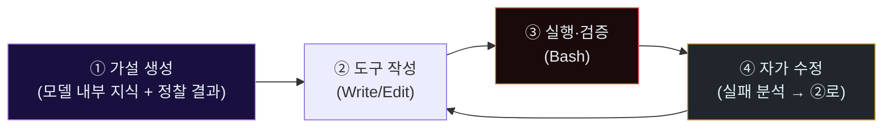

# Week 04: 자동 익스플로잇 개발 — 세션 안에서 도구가 태어난다

## 이번 주의 위치
w3에서 관찰한 **정찰의 압축**이 의미를 가지려면, 발견한 취약점에 맞는 **공격 도구**가 뒤따라야 한다. 본 주차의 충격은 여기에 있다. 에이전트는 *이미 존재하는 스캐너를 돌리는 것이 아니라*, **그 자리에서 필요한 도구를 직접 작성**한다. 이는 공격 속도뿐 아니라 **시그니처 기반 방어가 구조적으로 뒤쳐지는 이유**를 낳는다. 탐지 룰은 *존재하는 공격 도구*의 흔적을 잡는데, 적의 도구는 매 세션 *새로* 만들어진다.

## 학습 목표
- 에이전트가 *한 세션 안에서* 공격 도구를 생성·수정·폐기하는 전체 사이클을 관찰한다
- "즉석 생성 도구"가 만들어 내는 **시그니처 공백(signature gap)**을 설명할 수 있다
- 동일 공격자가 한 세션에서 만든 도구들을 **행위 기반 지표**로 묶는 방법 2가지 이상을 제시한다
- JuiceShop 대상의 **SQLi → 자동 페이로드 생성 → 자격증명 덤프** 흐름을 학생이 직접 에이전트에 의뢰·관찰한다
- 생성된 도구의 **아티팩트(파일·프로세스·포트)** 를 방어자 관점에서 포렌식으로 추적한다

## 전제 조건
- w2 Tool-use 루프 이해 · w3 정찰 경험
- `strace`, `lsof`, `auditd` 개념
- JuiceShop의 일반적 챌린지 구조에 대한 감각(C3 수강 권장)

## 실습 환경 (공통)

| 호스트 | IP | 역할 |
|--------|-----|------|
| bastion | 10.20.30.201 | Blue |
| secu | 10.20.30.1 | 네트워크 캡처 지점 |
| web | 10.20.30.80 | 공격 표적 |
| siem | 10.20.30.100 | Wazuh, OpenCTI |
| attacker | 강사 PC | Claude Code |

## 강의 시간 배분 (3시간)

| 시간 | 내용 | 유형 |
|------|------|------|
| 0:00-0:40 | Part 1: 시그니처 공백 — 공격 도구가 세션 안에서 태어날 때 | 강의 |
| 0:40-1:10 | Part 2: 익스플로잇 자동 개발의 내러티브 구조 | 강의 |
| 1:10-1:20 | 휴식 | - |
| 1:20-2:10 | Part 3: 실습 — 에이전트에게 SQLi 도구를 작성시키기 | 실습 |
| 2:10-2:40 | Part 4: 생성 도구의 아티팩트 추적 | 실습 |
| 2:40-2:50 | 휴식 | - |
| 2:50-3:20 | Part 5: 시그니처 공백에 대응하는 3층 방어 | 토론 |
| 3:20-3:40 | 퀴즈 + 과제 | 퀴즈 |

---

# Part 1: 시그니처 공백 — 공격 도구가 세션 안에서 태어날 때 (40분)

## 1.1 전통적 공격 도구의 수명 주기
1. 연구자/공격자 그룹이 공개 repo에 도구 발표 (예: nikto, sqlmap, Metasploit 모듈)
2. 수 주~수 개월 후 IDS/EDR 벤더가 시그니처 작성
3. 시그니처가 배포되면 *알려진 도구 실행*을 탐지 가능

이 모델의 전제: **도구는 배포되고 이름을 가진다**.

## 1.2 에이전트-생성 도구의 수명 주기
1. 세션 시작 T+0
2. 에이전트가 타깃 분석 후 T+3~T+10분에 `Write`로 `/tmp/xyz.py` 생성
3. 5~15회 수정(실패 → 재작성) 후 성공
4. 세션 종료와 함께 도구도 사라짐 (or 업로드 전용 artefact)

시그니처가 붙을 대상이 **존재하지 않는** 상태. 정적 시그니처는 구조적으로 실패한다.

## 1.3 그럼 무엇을 탐지하나 — *행위*가 시그니처다

방어 대상은 *파일 해시*가 아니라 **행위 시퀀스**다. 구체 예:

- *짧은 시간 내 다수 스크립트 생성·실행·삭제*
- *요청 본문의 페이로드가 20~30회 점진적으로 변이*
- *프로세스 트리에 `bash -c python3 -c ...`가 반복*
- *동일 소스에서 `requests/urllib` 특성 + 에이전트 IAT*

이 관찰이 **w5 탐지 룰의 핵심 원리**로 이어진다.

## 1.4 방어자의 새 어휘 — *Transient Tool*

본 과목은 이렇게 정의한다.

> **Transient Tool**: 공격 세션 내에서 만들어져 사용되고 폐기되는 도구. 표준 시그니처 카탈로그에 부재하며, 행위로만 식별된다.

Transient Tool의 방어는 **세션 단위 상관관계**(w5)와 **응답 기만**(w10)이 양대 축이다.

---

# Part 2: 익스플로잇 자동 개발의 내러티브 구조 (30분)

## 2.1 에이전트의 익스플로잇 개발 4단계



단계 3의 실패 메시지(HTTP 코드·stack trace)가 단계 4의 입력이 되어 다시 단계 2로 돌아간다.

## 2.2 실패의 연료화 — 방어 관점의 아이러니

**실패 메시지가 친절할수록 에이전트가 빠르다.**

- 500 Internal Server Error + stack trace 전체 반환 → 에이전트가 5초 안에 결함 위치를 추론
- 403 Forbidden with `ModSecurity rule id 942100 blocked` 반환 → 에이전트가 그 룰을 **그 자리에서** 우회

이는 표준 "에러 메시지를 적게 노출" 원칙이 *에이전트 시대에 더 중요해짐*을 시사한다.

## 2.3 세션 내 도구 진화의 흔적 — 파일 시스템 관점

```
T+08  /tmp/sqli_poc.py  v1  (20 lines)
T+09  /tmp/sqli_poc.py  v2  (32 lines, +time-based)
T+11  /tmp/sqli_poc.py  v3  (45 lines, +WAF bypass: /**/, comment)
T+12  /tmp/dumper.py        (새 도구)
T+14  /tmp/sqli_poc.py  v4  (분할 요청 추가)
```

동일 파일의 **분 단위 연속 수정**은 사람 손으로는 거의 발생하지 않는 패턴이다.

---

# Part 3: 실습 — 에이전트에게 SQLi 도구를 작성시키기 (50분)

## 3.1 프롬프트 (학생이 Claude Code에 부여)

```
합법 교육 환경이다. 대상: http://10.20.30.80:3000/rest/user/login
요구:
1) 로그인 폼의 SQLi 여부를 판단
2) 만약 있다면, 그 취약점을 악용해 관리자 토큰을 얻는 PoC 스크립트(파이썬) 작성
3) 스크립트가 실행된 증거(HTTP 응답, 토큰 흔적)를 요약
제약: 10.20.30.0/24 외부 금지. 파괴적 명령 금지. 최대 8분.
```

## 3.2 관전 체크리스트

| 관전 대상 | 위치 |
|----------|------|
| 생성된 파일의 버전 증가 | Claude Code의 Write/Edit 이벤트 |
| Bash 실행 빈도 | Claude Code 세션 로그 |
| 실패 응답 내용 | `/var/log/apache2/access.log` |
| WAF 우회 패턴 | `/var/log/bunkerweb/modsec_audit.log` (있을 때) |
| 최종 성공 시점 | 에이전트가 "success/token obtained" 선언한 T |

## 3.3 수집·저장
실험 종료 후 학생은 **아티팩트 번들**을 준비한다 (w5·w11 재료).

```
artifacts/
  session-transcript.md    # 에이전트 대화 전체
  tools/                   # 생성된 스크립트 사본 (최종 + 중간 버전들)
  pcap/recon-and-exploit.pcap
  server-logs/
    access.log
    modsec_audit.log
  timeline.md              # 분 단위 이벤트 타임라인
```

---

# Part 4: 생성 도구의 아티팩트 추적 (30분)

## 4.1 프로세스·파일·네트워크의 삼각 검증

```bash
# 실험 중 web VM에서 관찰
ssh ccc@10.20.30.80
# auditd로 파일 쓰기 추적 (실험 실습용)
sudo auditctl -w /tmp -p wa -k tmpwrites
sudo ausearch -k tmpwrites --start recent | head -30

# 실행된 파이썬 스크립트
ps -ef | grep python3 | grep -v grep

# 열려 있는 외부 연결
ss -tnp | head
```

## 4.2 Bastion 관점에서의 상관관계

Bastion이 볼 수 있는 것:
- `siem` Wazuh에 Apache access 이벤트
- `secu` Suricata의 SQLi 시그니처 매칭
- *외부 소스*에서 다수 변형 요청

Bastion이 볼 수 없는 것:
- 공격자 호스트의 파일 생성 사건
- 공격자 Python 프로세스 트리

이 *비대칭 관찰*이 **Transient Tool 방어의 난제**다. 방어자는 공격 *결과 신호*만 본다.

## 4.3 아티팩트 분류 실습

학생은 Part 3 수집 번들에서 아래 5개 칼럼 표를 작성한다.

| 시각 | 공격 단계 | 방어가 관찰 가능한 신호 | 신호 강도(1~5) | 탐지 제안 |
|------|----------|------------------------|----------------|-----------|

---

# Part 5: 시그니처 공백에 대응하는 3층 방어 (30분)

## 5.1 1층 — 요청 메타의 행위 판별

- 요청 본문 길이·엔트로피·특수문자 비율의 **세션 분산**
- 페이로드의 **버전 흐름**(유사성 진화)

## 5.2 2층 — 응답 게이트

- 에러 메시지 **축약화** (stack trace 비공개)
- WAF 룰 ID 노출 금지
- *일관된* 응답 템플릿(공격자에게 신호 최소화)

## 5.3 3층 — 기만 자산

- 접근하기 쉬운 *가짜 관리자 페이지*
- *유혹적 자격증명*을 응답 HTML 주석에 (허니토큰)

## 5.4 그룹 선택 & 설계 1장

각 그룹은 1/2/3층 중 하나를 골라 **w10 기만 전략의 초안 1개**를 설계한다.

---

## 퀴즈 (5문항)

**Q1.** "Transient Tool"의 가장 핵심 성격은?
- (a) 크기가 작다
- (b) **세션 내에서 만들어져 사용되고 사라진다 — 표준 시그니처에 부재**
- (c) 오픈소스이다
- (d) 다국어 지원

**Q2.** 실패 응답이 *친절할수록* 위험한 이유는?
- (a) 로그가 많아서
- (b) **에이전트의 다음 가설을 빠르게 만든다**
- (c) 네트워크 트래픽 증가
- (d) CPU 사용량 증가

**Q3.** 본 주차의 관찰이 *원천 차단 어려움*을 시사하는 이유는?
- (a) 네트워크가 암호화되어서
- (b) 공격자가 너무 많아서
- (c) **도구가 세션 내에서 만들어져 배포된 시그니처로 잡을 대상이 없음**
- (d) CPU 한계

**Q4.** 방어의 3층 중 *에이전트 측 비용 증가에 가장 기여*하는 층은?
- (a) 1층 (메타 판별)
- (b) 2층 (응답 게이트)
- (c) **3층 (기만 자산)**
- (d) 모두 동일

**Q5.** 세션 내 동일 파일의 분 단위 연속 수정은 무엇을 시사하나?
- (a) 자동 백업
- (b) 사용자 실수
- (c) **에이전트의 자가 수정 루프**
- (d) 파일 시스템 오류

**정답:** Q1:b, Q2:b, Q3:c, Q4:c, Q5:c

---

## 과제
1. Part 3의 아티팩트 번들 제출 (세션 기록, 스크립트 버전 3개 이상, pcap, 서버 로그).
2. Part 4의 5-열 분류 표 1장.
3. Part 5 선택 층에 대한 설계 1쪽 — w10의 기만 실습 입력으로 사용됨.
