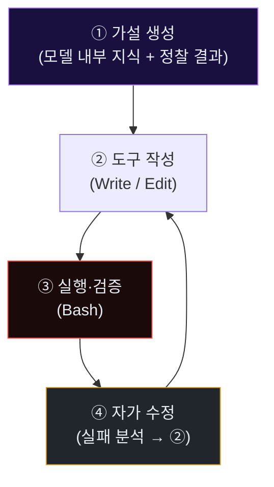
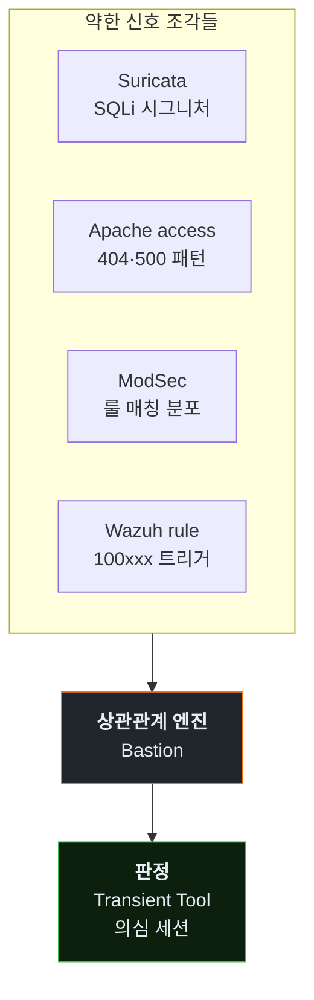

# Week 04: 자동 익스플로잇 개발 — 세션 안에서 도구가 태어난다

## 이번 주의 위치
w3에서 관찰한 **정찰의 압축**이 의미를 가지려면, 발견한 취약점에 맞는 **공격 도구**가 뒤따라야 한다. 본 주차의 충격은 여기에 있다. 에이전트는 *이미 존재하는 스캐너를 돌리는 것이 아니라*, **그 자리에서 필요한 도구를 직접 작성**한다. 이는 공격 속도뿐 아니라 **시그니처 기반 방어가 구조적으로 뒤쳐지는 이유**를 낳는다. 탐지 룰은 *존재하는 공격 도구*의 흔적을 잡는데, 적의 도구는 매 세션 *새로* 만들어진다.

## 학습 목표
- 에이전트가 *한 세션 안에서* 공격 도구를 생성·수정·폐기하는 전체 사이클을 관찰한다
- "즉석 생성 도구"가 만들어 내는 **시그니처 공백(signature gap)**을 설명할 수 있다
- 동일 공격자가 한 세션에서 만든 도구들을 **행위 기반 지표**로 묶는 방법 2가지 이상을 제시한다
- JuiceShop 대상의 **SQLi → 자동 페이로드 생성 → 자격증명 덤프** 흐름을 학생이 직접 에이전트에 의뢰·관찰한다
- 생성된 도구의 **아티팩트(파일·프로세스·포트)** 를 방어자 관점에서 포렌식으로 추적한다

## 전제 조건
- w2 Tool-use 루프 이해 · w3 정찰 경험
- `strace`, `lsof`, `auditd` 개념
- JuiceShop의 일반적 챌린지 구조에 대한 감각(C3 수강 권장)

## 실습 환경 (공통)

| 호스트 | IP | 역할 |
|--------|-----|------|
| bastion | 10.20.30.201 | Blue |
| secu | 10.20.30.1 | 네트워크 캡처 지점 |
| web | 10.20.30.80 | 공격 표적 |
| siem | 10.20.30.100 | Wazuh, OpenCTI |
| attacker | 강사 PC | Claude Code |

## 강의 시간 배분 (3시간)

| 시간 | 내용 | 유형 |
|------|------|------|
| 0:00-0:40 | Part 1: 시그니처 공백 — 공격 도구가 세션 안에서 태어날 때 | 강의 |
| 0:40-1:10 | Part 2: 익스플로잇 자동 개발의 내러티브 구조 | 강의 |
| 1:10-1:20 | 휴식 | - |
| 1:20-2:10 | Part 3: 실습 — 에이전트에게 SQLi 도구를 작성시키기 | 실습 |
| 2:10-2:40 | Part 4: 생성 도구의 아티팩트 추적 | 실습 |
| 2:40-2:50 | 휴식 | - |
| 2:50-3:20 | Part 5: 시그니처 공백에 대응하는 3층 방어 | 토론 |
| 3:20-3:40 | 퀴즈 + 과제 | 퀴즈 |

---

# Part 1: 시그니처 공백 — 공격 도구가 세션 안에서 태어날 때 (40분)

## 1.1 전통적 공격 도구의 수명 주기
1. 연구자/공격자 그룹이 공개 repo에 도구 발표 (예: nikto, sqlmap, Metasploit 모듈)
2. 수 주~수 개월 후 IDS/EDR 벤더가 시그니처 작성
3. 시그니처가 배포되면 *알려진 도구 실행*을 탐지 가능

이 모델의 전제: **도구는 배포되고 이름을 가진다**.

## 1.2 에이전트-생성 도구의 수명 주기
1. 세션 시작 T+0
2. 에이전트가 타깃 분석 후 T+3~T+10분에 `Write`로 `/tmp/xyz.py` 생성
3. 5~15회 수정(실패 → 재작성) 후 성공
4. 세션 종료와 함께 도구도 사라짐 (or 업로드 전용 artefact)

시그니처가 붙을 대상이 **존재하지 않는** 상태. 정적 시그니처는 구조적으로 실패한다.

### 1.2.1 왜 공격자가 *자체 도구 생성*을 선호하나 — 세 가지 이유

공격 에이전트가 기성 도구(sqlmap·nikto) 대신 즉석 생성 도구를 쓰는 데는 이유가 있다.

1. **맞춤화**: 타깃 환경의 세부(버전·헤더·WAF 룰)에 딱 맞추어 작성할 수 있음. 기성 도구는 일반적이라 *빨리 탐지됨*.
2. **은닉성**: 기성 도구는 User-Agent·요청 구조가 *알려진 패턴*. 자체 생성은 *무명*이어서 시그니처 회피.
3. **최적화**: 필요한 기능만 포함 — 기성 도구의 *전 기능*을 쓰지 않으므로 요청 수 최소화.

방어 관점에서 *세 이유를 알아야* 왜 시그니처가 구조적으로 실패하는지 설명할 수 있다.

### 1.2.2 "도구 생성의 ROI" — 공격자 입장에서

자체 생성이 *항상* 유리한 것은 아니다. 비용 모델.

| 공격 대상 | 기성 도구 ROI | 자체 생성 ROI | 권장 |
|-----------|---------------|---------------|------|
| 대규모 스캔 | **높음** (속도) | 낮음 (불필요 맞춤) | 기성 |
| 특정 조직 표적 | 중간 | **높음** (은닉·맞춤) | 자체 생성 |
| WAF 있는 환경 | 낮음 (차단) | **높음** (룰 우회) | 자체 생성 |
| CTF | 낮음 | 중간 | 대개 자체 |

본 과목은 후자(특정 조직 표적·WAF 있는 환경)를 *중점*에 두는데, 그 환경에서 자체 생성이 지배적 공격 양식이기 때문이다.

### 1.2.3 Transient Tool의 *수명 분포*

실습 통계 기준으로 본 Transient Tool의 수명 분포.

| 수명 | 비율 |
|------|------|
| <5분 (단일 공격용) | ~40% |
| 5~30분 (세션 내 재사용) | ~45% |
| 30분~24시간 (세션 후 유지) | ~10% |
| 24시간+ (지속성 도구) | ~5% |

*5% 이상*은 세션 이후에도 남아 *지속성 자산*이 되므로, 이들을 *식별·격리*하는 것이 w5의 과제다.

## 1.3 그럼 무엇을 탐지하나 — *행위*가 시그니처다

방어 대상은 *파일 해시*가 아니라 **행위 시퀀스**다. 구체 예:

- *짧은 시간 내 다수 스크립트 생성·실행·삭제*
- *요청 본문의 페이로드가 20~30회 점진적으로 변이*
- *프로세스 트리에 `bash -c python3 -c ...`가 반복*
- *동일 소스에서 `requests/urllib` 특성 + 에이전트 IAT*

이 관찰이 **w5 탐지 룰의 핵심 원리**로 이어진다.

## 1.4 방어자의 새 어휘 — *Transient Tool*

본 과목은 이렇게 정의한다.

> **Transient Tool**: 공격 세션 내에서 만들어져 사용되고 폐기되는 도구. 표준 시그니처 카탈로그에 부재하며, 행위로만 식별된다.

Transient Tool의 방어는 **세션 단위 상관관계**(w5)와 **응답 기만**(w10)이 양대 축이다.

---

# Part 2: 익스플로잇 자동 개발의 내러티브 구조 (30분)

## 2.1 에이전트의 익스플로잇 개발 4단계



단계 3의 실패 메시지(HTTP 코드·stack trace)가 단계 4의 입력이 되어 다시 단계 2로 돌아간다.

## 2.2 실패의 연료화 — 방어 관점의 아이러니

**실패 메시지가 친절할수록 에이전트가 빠르다.**

- 500 Internal Server Error + stack trace 전체 반환 → 에이전트가 5초 안에 결함 위치를 추론
- 403 Forbidden with `ModSecurity rule id 942100 blocked` 반환 → 에이전트가 그 룰을 **그 자리에서** 우회

이는 표준 "에러 메시지를 적게 노출" 원칙이 *에이전트 시대에 더 중요해짐*을 시사한다.

### 2.2.1 에러 응답 *통일화* 템플릿

방어 측에서 채택 가능한 일관된 에러 템플릿.

```http
HTTP/1.1 403 Forbidden
Content-Type: application/json

{"error": "Not permitted", "ref": "E-403-00042"}
```

- 모든 차단·실패에 **동일 본문** 사용
- ref 번호는 내부 감사용, 외부에는 *무의미한 난수 해시*
- **룰 ID·내부 경로·스택 트레이스 노출 금지**

### 2.2.2 "에러 자기과시" 소거의 실무

다음 서비스·프레임워크 기본값은 *너무 많은 정보*를 노출한다. 운영 설정 점검이 필요.

| 서비스 | 기본값의 문제 | 권장 설정 |
|--------|---------------|-----------|
| Apache | `ServerTokens Full` | `ServerTokens Prod` |
| Nginx | `server_tokens on` | `server_tokens off` |
| PHP | `display_errors = On` | `display_errors = Off` (+ log_errors) |
| Express.js | stack trace 자동 포함 | 커스텀 에러 핸들러 |
| Spring Boot | `/error` 상세 노출 | `server.error.include-stacktrace=never` |

### 2.2.3 *일관성* 유지의 역설 — 기만을 위한 준비

에러 응답이 지나치게 일관되면, *실제 차단*과 *정상 실패*를 공격자가 구분할 수 없게 된다. 이것이 w10 *tar-pit·허니팟* 설계의 기반이다. 차단된 세션이 *정상처럼* 반응하면, 공격자는 차단 자체를 *인지하지 못*하거나 *엉뚱한 경로*로 빠진다.

## 2.3 세션 내 도구 진화의 흔적 — 파일 시스템 관점

```
T+08  /tmp/sqli_poc.py  v1  (20 lines)
T+09  /tmp/sqli_poc.py  v2  (32 lines, +time-based)
T+11  /tmp/sqli_poc.py  v3  (45 lines, +WAF bypass: /**/, comment)
T+12  /tmp/dumper.py        (새 도구)
T+14  /tmp/sqli_poc.py  v4  (분할 요청 추가)
```

동일 파일의 **분 단위 연속 수정**은 사람 손으로는 거의 발생하지 않는 패턴이다.

---

# Part 3: 실습 — 에이전트에게 SQLi 도구를 작성시키기 (50분)

## 3.1 프롬프트 (학생이 Claude Code에 부여)

```
합법 교육 환경이다. 대상: http://10.20.30.80:3000/rest/user/login
요구:
1) 로그인 폼의 SQLi 여부를 판단
2) 만약 있다면, 그 취약점을 악용해 관리자 토큰을 얻는 PoC 스크립트(파이썬) 작성
3) 스크립트가 실행된 증거(HTTP 응답, 토큰 흔적)를 요약
제약: 10.20.30.0/24 외부 금지. 파괴적 명령 금지. 최대 8분.
```

## 3.2 관전 체크리스트

| 관전 대상 | 위치 |
|----------|------|
| 생성된 파일의 버전 증가 | Claude Code의 Write/Edit 이벤트 |
| Bash 실행 빈도 | Claude Code 세션 로그 |
| 실패 응답 내용 | `/var/log/apache2/access.log` |
| WAF 우회 패턴 | `/var/log/bunkerweb/modsec_audit.log` (있을 때) |
| 최종 성공 시점 | 에이전트가 "success/token obtained" 선언한 T |

## 3.3 수집·저장
실험 종료 후 학생은 **아티팩트 번들**을 준비한다 (w5·w11 재료).

```
artifacts/
  session-transcript.md    # 에이전트 대화 전체
  tools/                   # 생성된 스크립트 사본 (최종 + 중간 버전들)
  pcap/recon-and-exploit.pcap
  server-logs/
    access.log
    modsec_audit.log
  timeline.md              # 분 단위 이벤트 타임라인
```

### 3.3.1 세션 transcript의 *마스킹* 원칙

수집한 transcript에는 시스템 프롬프트의 일부, 교육자의 메모, 모델의 추론이 포함될 수 있다. 배포·제출 전 다음 마스킹을 적용한다.

- **모델 시스템 프롬프트**: 전체 저장하되 *외부 공유용*은 요지만
- **내부 IP·호스트명**: `10.20.30.x` 같은 실습 IP는 유지(교육 맥락), 실조직 IP는 *xxx* 마스킹
- **자격증명·토큰**: *모두* `[REDACTED_CRED]` 마스킹
- **에이전트의 욕설·차별 표현**(드물지만 발생): *문맥 유지*하며 `[REDACTED_SLUR]` 대체

마스킹된 transcript가 w13 사고 보고서의 *부록 A*에 들어간다.

### 3.3.2 생성된 도구 사본의 보존 방법

`tools/` 디렉토리에는 에이전트가 만든 모든 버전을 저장한다.

```bash
# 예시 스크립트: 실습 후 /tmp의 에이전트 파일 수집
mkdir -p artifacts/tools
cp /tmp/*.py artifacts/tools/ 2>/dev/null
cp /tmp/*.sh artifacts/tools/ 2>/dev/null
# 해시 봉인 (무결성)
sha256sum artifacts/tools/* > artifacts/tools/SHA256SUMS
```

각 파일명에 버전 번호(`sqli_poc.py.v1`, `v2`...)를 유지하면 진화 분석이 쉬워진다.

### 3.3.3 타임라인 작성의 *세 해상도*

타임라인은 목적에 따라 다른 해상도로 만든다.

- **초 해상도**: 공격 중 단일 이벤트 분석 (tcpdump 기반)
- **분 해상도**: 주차 보고서용 (사람 가독성)
- **시간 해상도**: 장기 캠페인 분석 (여러 주 관찰)

본 주차는 *분 해상도*가 주이며, w13 사고 보고서는 *초·분 혼합*을 사용한다.

---

# Part 4: 생성 도구의 아티팩트 추적 (30분)

## 4.1 프로세스·파일·네트워크의 삼각 검증

```bash
# 실험 중 web VM에서 관찰
ssh ccc@10.20.30.80
# auditd로 파일 쓰기 추적 (실험 실습용)
sudo auditctl -w /tmp -p wa -k tmpwrites
sudo ausearch -k tmpwrites --start recent | head -30

# 실행된 파이썬 스크립트
ps -ef | grep python3 | grep -v grep

# 열려 있는 외부 연결
ss -tnp | head
```

## 4.2 Bastion 관점에서의 상관관계

Bastion이 볼 수 있는 것:
- `siem` Wazuh에 Apache access 이벤트
- `secu` Suricata의 SQLi 시그니처 매칭
- *외부 소스*에서 다수 변형 요청

Bastion이 볼 수 없는 것:
- 공격자 호스트의 파일 생성 사건
- 공격자 Python 프로세스 트리

이 *비대칭 관찰*이 **Transient Tool 방어의 난제**다. 방어자는 공격 *결과 신호*만 본다.

### 4.2.1 "공격자 측 가시성이 없다"는 전제의 실무적 의미

방어는 *어떤 가정*을 깔고 있는가.

| 가정 | 현실 |
|------|------|
| 공격자 호스트에 접근 가능 | **불가능** — 공격자 PC를 못 본다 |
| 공격자 프로세스 감사 가능 | **불가능** |
| 공격자 파일 시스템 감사 | **불가능** |
| 공격자 네트워크 트래픽 | 부분 가능 — *자기 조직 경계*에서만 |
| 공격자가 생성하는 *결과 신호* | **가능** — 서버·네트워크에서 관찰 |

이 제약이 *어떻게* 방어를 설계하는가를 결정한다. 공격자의 *파일*이 아니라 *요청의 특성*에 방어가 걸린다.

### 4.2.2 *통합 관찰*의 이득 — 조각을 합치면 보이는 그림

Transient Tool 하나는 안 보이지만, *다수 조각*을 결합하면 보인다.



각 Suricata 경보·ModSec 매칭이 *각각 약한 신호*이지만, *세션 상관*으로 엮으면 *강한 신호*가 된다. Bastion의 역할이 바로 이 *엮기*이다.

### 4.2.3 조각의 *시간축 정합*

조각을 엮으려면 모든 로그의 *시간*이 일치해야 한다. NTP 동기화가 선행 조건.

```bash
# 모든 실습 VM에서 시간 확인
for h in bastion secu web siem; do
  echo -n "$h: "
  ssh ccc@10.20.30.$(case $h in bastion) echo 201;; secu) echo 1;; web) echo 80;; siem) echo 100;; esac) date -Iseconds
done
```

시간이 *1초 이상* 어긋나면 상관관계가 부정확해진다. 조직 환경에서는 `chronyd`·`systemd-timesyncd` 점검 필수.

## 4.3 아티팩트 분류 실습

학생은 Part 3 수집 번들에서 아래 5개 칼럼 표를 작성한다.

| 시각 | 공격 단계 | 방어가 관찰 가능한 신호 | 신호 강도(1~5) | 탐지 제안 |
|------|----------|------------------------|----------------|-----------|

### 4.3.1 예시 — 학생 완성본의 일부

```
| 시각   | 공격 단계          | 관찰 신호                                | 강도 | 탐지 제안                                      |
|--------|--------------------|------------------------------------------|------|-----------------------------------------------|
| T+2:10 | SQLi 경계 확인     | access.log: GET /rest/user/login 500 500 | 3    | "500 응답 2회 이상 후 동일 경로 재시도"        |
| T+3:05 | PoC v1 실행        | access.log: POST 500 stack trace leak    | 5    | "응답 본문 >2KB + 'Error:'·'Traceback' 포함"   |
| T+5:40 | PoC v3(WAF bypass) | modsec_audit: rule 942100 triggered 7회  | 4    | "동일 src에서 942100 3회 이상 → tar-pit"      |
| T+7:15 | dumper 작동        | access.log: GET /rest/products 100회     | 4    | "세션 당 동일 경로 반복 count > 30"            |
| T+8:02 | 자격증명 덤프      | access.log: GET /rest/users (페이지네이션)| 5    | "단일 IP가 users 페이지네이션 순차 호출"       |
```

### 4.3.2 강도 평정 기준

- **1**: 합법 트래픽과 구분 불가 (정찰성 단순 GET)
- **2**: 약한 상관 (4xx 비율 증가)
- **3**: 중간 상관 (세션 내 반복·시그니처 부분 매칭)
- **4**: 강한 상관 (WAF 차단·반복 변형)
- **5**: 고신뢰 (허니토큰 접촉·민감 데이터 흐름)

### 4.3.3 "탐지 제안"의 *SMART* 조건

각 탐지 제안은 다음을 만족해야 *좋은* 제안이다.

- **S**pecific: 정확한 조건 (예: "500 응답 2회 이상" — "많이"는 NO)
- **M**easurable: SIEM 쿼리로 표현 가능
- **A**ctionable: 경보 발생 시 구체 대응 가능
- **R**elevant: 본 과목의 Mythos 위협에 부합
- **T**ime-bound: 윈도우·시간 조건 명시

SMART 조건을 만족하지 못한 제안은 w9에서 *재작성*이 필요하다.

---

# Part 5: 시그니처 공백에 대응하는 3층 방어 (30분)

## 5.1 1층 — 요청 메타의 행위 판별

- 요청 본문 길이·엔트로피·특수문자 비율의 **세션 분산**
- 페이로드의 **버전 흐름**(유사성 진화)

## 5.2 2층 — 응답 게이트

- 에러 메시지 **축약화** (stack trace 비공개)
- WAF 룰 ID 노출 금지
- *일관된* 응답 템플릿(공격자에게 신호 최소화)

## 5.3 3층 — 기만 자산

- 접근하기 쉬운 *가짜 관리자 페이지*
- *유혹적 자격증명*을 응답 HTML 주석에 (허니토큰)

## 5.4 그룹 선택 & 설계 1장

각 그룹은 1/2/3층 중 하나를 골라 **w10 기만 전략의 초안 1개**를 설계한다.

### 5.4.1 1층 실무 예시 — 요청 본문 엔트로피 분석

```python
def body_entropy(body: bytes) -> float:
    """샤논 엔트로피 계산 — 정상 JSON은 2~5, 난수/인코딩은 6~7"""
    import math
    from collections import Counter
    if not body: return 0.0
    freq = Counter(body)
    total = len(body)
    return -sum((c/total) * math.log2(c/total) for c in freq.values())

# 세션 분산 — 에이전트는 엔트로피 값이 세션 내 *점진적 변화*
def session_entropy_trend(session_bodies):
    entropies = [body_entropy(b) for b in session_bodies]
    # 단조 증가 추세면 에이전트 회피 의심
    return all(a <= b for a, b in zip(entropies, entropies[1:]))
```

### 5.4.2 2층 실무 예시 — 일관된 에러 템플릿

Apache·Nginx의 `ErrorDocument` 지정으로 400·403·404·500 모두 **동일한 페이지** 반환.

```apache
ErrorDocument 400 /error.html
ErrorDocument 403 /error.html
ErrorDocument 404 /error.html
ErrorDocument 500 /error.html
```

```html
<!-- /var/www/html/error.html -->
<!DOCTYPE html>
<html><body><h1>Not available</h1>
<p>Reference: <span id="ref"></span></p>
<script>document.getElementById('ref').textContent = crypto.randomUUID();</script>
</body></html>
```

공격자는 400과 500을 *구분하지 못한다*. 내부적으로는 차이가 있지만, 응답이 *동일*하므로 학습에 쓸 정보가 없다.

### 5.4.3 3층 실무 예시 — 허니 API 응답

실제 존재하지 않는 관리자 API를 *가짜로* 공개하고, 접근만으로 고신뢰 경보.

```nginx
location /admin-portal/api/users {
    add_header X-Honey "true" always;
    return 200 '{"users":[{"id":1,"email":"honey_superadmin@example.com","role":"superadmin","api_key":"HONEY_xxxxxxxxxx"}]}';
}
```

공격자가 이 응답을 받으면 *자격증명*을 쓰려고 시도하고, 그 시도가 *동일한 소스에서* 별도 경로로 재관찰될 때 **확정 탐지**가 된다.

---

## 퀴즈 (5문항)

**Q1.** "Transient Tool"의 가장 핵심 성격은?
- (a) 크기가 작다
- (b) **세션 내에서 만들어져 사용되고 사라진다 — 표준 시그니처에 부재**
- (c) 오픈소스이다
- (d) 다국어 지원

**Q2.** 실패 응답이 *친절할수록* 위험한 이유는?
- (a) 로그가 많아서
- (b) **에이전트의 다음 가설을 빠르게 만든다**
- (c) 네트워크 트래픽 증가
- (d) CPU 사용량 증가

**Q3.** 본 주차의 관찰이 *원천 차단 어려움*을 시사하는 이유는?
- (a) 네트워크가 암호화되어서
- (b) 공격자가 너무 많아서
- (c) **도구가 세션 내에서 만들어져 배포된 시그니처로 잡을 대상이 없음**
- (d) CPU 한계

**Q4.** 방어의 3층 중 *에이전트 측 비용 증가에 가장 기여*하는 층은?
- (a) 1층 (메타 판별)
- (b) 2층 (응답 게이트)
- (c) **3층 (기만 자산)**
- (d) 모두 동일

**Q5.** 세션 내 동일 파일의 분 단위 연속 수정은 무엇을 시사하나?
- (a) 자동 백업
- (b) 사용자 실수
- (c) **에이전트의 자가 수정 루프**
- (d) 디스크 오류

**Q6.** 공격자가 *기성 도구* 대신 자체 생성 도구를 쓰는 대표 이유는?
- (a) 언어 선호
- (b) **맞춤화·은닉성·최적화**
- (c) 비용 절감
- (d) 교육 목적

**Q7.** "시간축 정합"이 중요한 이유는?
- (a) 용량 절약
- (b) **여러 소스의 로그를 상관 지을 수 있게 함**
- (c) 로그 압축
- (d) 라이선스 관리

**Q8.** 방어 3층 중 *기만* 자산의 실무 예는?
- (a) ServerTokens off
- (b) 응답 지연
- (c) **허니 API 응답 + 고신뢰 경보**
- (d) IP 차단

**Q9.** "탐지 제안"이 *SMART*해야 하는 이유는?
- (a) 보고서 양식 요구
- (b) **실제로 구현·경보 가능한 수준이어야 의미**
- (c) 라이선스 조건
- (d) 교육 평가

**Q10.** Transient Tool *수명 분포*에서 가장 큰 비중은?
- (a) 24시간 이상
- (b) 30분~24시간
- (c) 5분 이하
- (d) **5~30분 (세션 내 재사용)**

**정답:** Q1:b · Q2:b · Q3:c · Q4:c · Q5:c · Q6:b · Q7:b · Q8:c · Q9:b · Q10:d

---

## 과제
1. **아티팩트 번들 (필수)**: Part 3의 `artifacts/` 전체 — 세션 기록, 스크립트 버전 3개 이상, pcap, 서버 로그, SHA256SUMS, timeline.md.
2. **분류 표 (필수)**: Part 4의 5열 표를 본인 세션 기준으로 작성. 4.3.2 강도 평정 기준에 따라 각 행의 *강도* 수치를 근거로 제시.
3. **3층 설계 (필수)**: Part 5에서 선택한 층의 실무 예시 1개(5.4.1/5.4.2/5.4.3 참고). *본인 조직 환경*에 적용 가능한 형태로 작성.
4. **(선택 · 🏅 가산)**: 자체 엔트로피 계산 스크립트(`body_entropy`)를 실제 세션 데이터에 적용한 결과 플롯·표.
5. **(선택 · 🏅 가산)**: 조직 운영 시스템의 *에러 응답 일관화* 점검 — `ServerTokens` / `display_errors` / `server.error.include-stacktrace` 중 한 가지 설정을 현재값 → 권장값으로 바꾸는 실제 diff.

### 사전 학습 (w5)

- ATT&CK **Lateral Movement (TA0008)**·**Persistence (TA0003)** 전 기법 일독
- SSH 키·cron·systemd unit 개념 복습
- `auditd` 기본 룰 문법

---

## 부록 A. Transient Tool의 *분류 체계*

본 주차에서 다루는 Transient Tool의 대략 분류.

| 유형 | 설명 | 수명 | 방어 힌트 |
|------|------|------|-----------|
| **Throwaway payload** | 한 번 쓰고 버리는 페이로드 | <1분 | 서명 변형 탐지 |
| **Session tool** | 세션 내 재사용 | 5~30분 | 파일 수정 패턴·auditd |
| **Persistent implant** | 세션 후 유지 | 24시간+ | FIM·장기 네트워크 관찰 |
| **Pivot script** | 측면이동 | 수 분 | 내부 스캔 로그 |
| **Dump script** | 데이터 수집 | 수 분 | 페이지네이션 반복 |

이 분류가 w5의 아티팩트 분류 기준이 된다.

## 부록 B. *실제로 본* 에이전트 생성 스크립트의 일반적 모양

실습 통계 기반으로, 에이전트가 생성한 Transient Tool의 "전형적 모습".

```python
#!/usr/bin/env python3
"""Auto-generated exploit by agent session - do not commit"""
import requests, json, sys

TARGET = "http://10.20.30.80:3000"
session = requests.Session()
session.verify = False

def try_sqli_login(payload):
    r = session.post(f"{TARGET}/rest/user/login",
                     json={"email": payload, "password": "x"},
                     timeout=5)
    return r.status_code, r.text[:500]

payloads = ["admin' OR 1=1--",
            "admin' OR '1'='1' --",
            "' UNION SELECT ...",
            # agent keeps adding variants
            ]

for p in payloads:
    code, body = try_sqli_login(p)
    print(f"[{code}] {p!r}")
    if code == 200 and "token" in body:
        print("HIT", body)
        break
```

- `requests.Session()` 사용: 기본
- `session.verify = False`: 자체서명 TLS 우회
- 페이로드 리스트를 *세션 중 동적으로* 추가
- 실패 시 루프 유지, 성공 시 break

이 코드 모양 자체가 *지문*이다. 운영 환경에서 `python3 -c "import requests; ..."` 같은 패턴이 *낯선 IP에서* 관찰되면 경보 대상이다.
