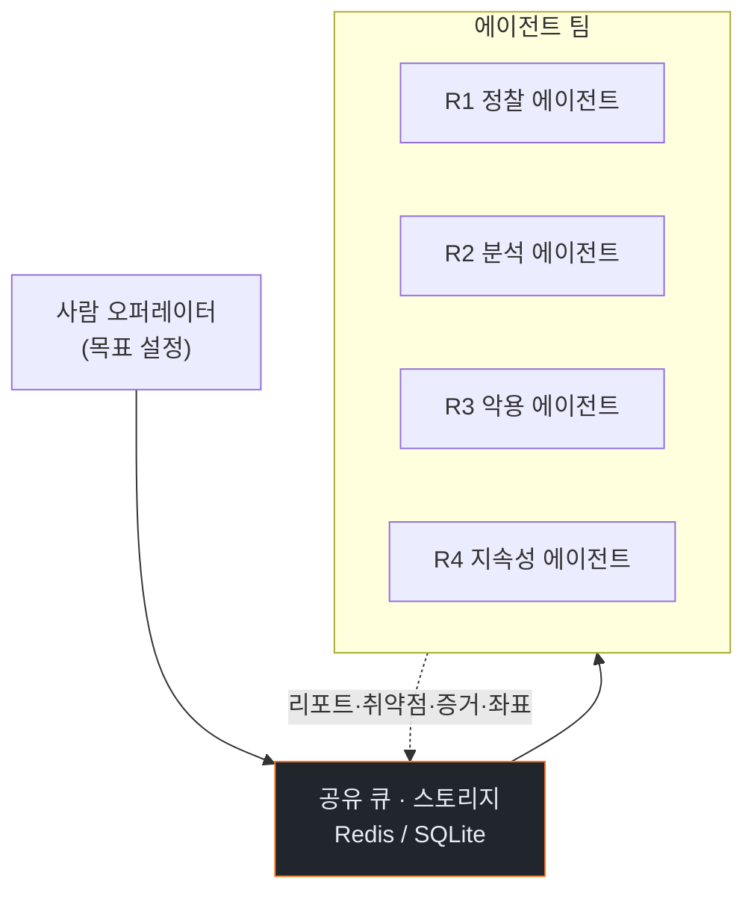
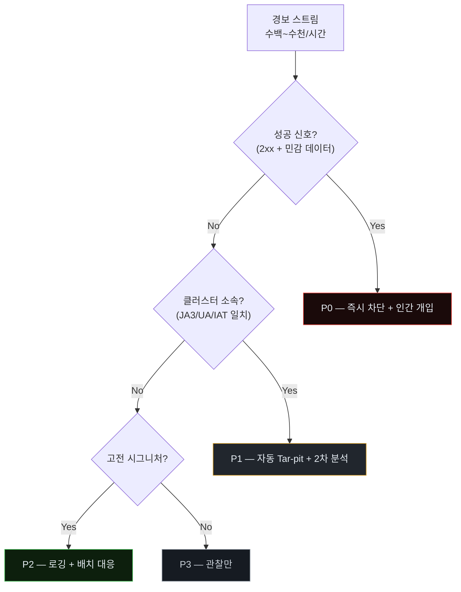
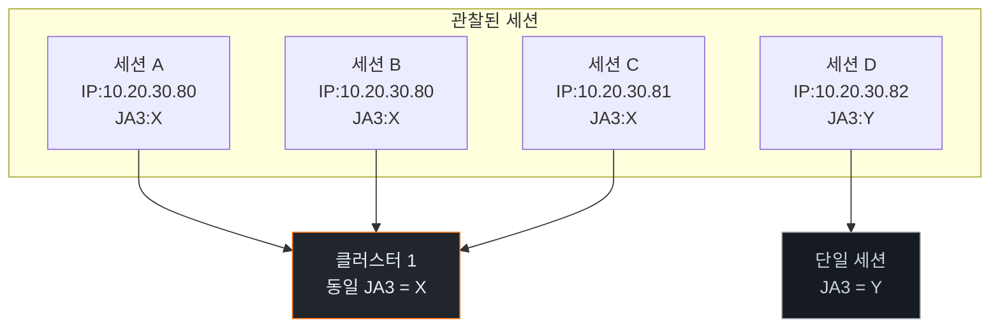
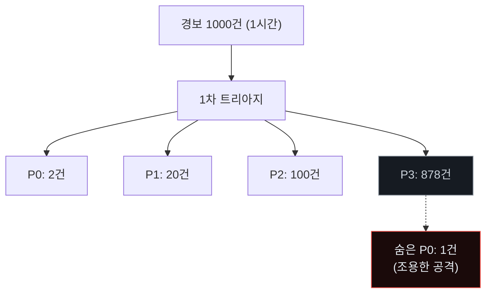
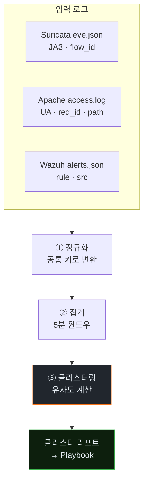
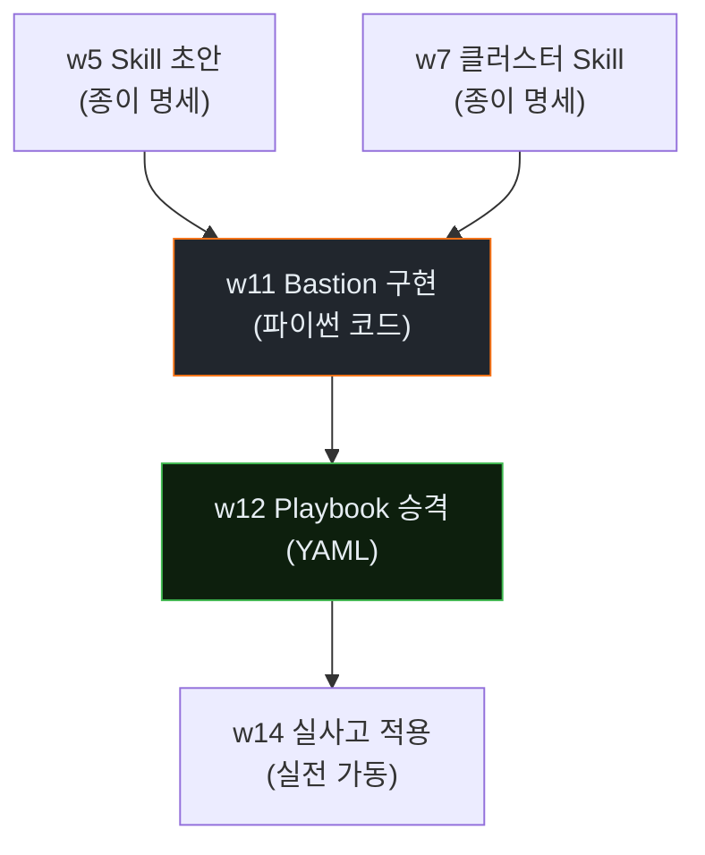

# Week 07: 규모화(scale) — 다중 에이전트 병렬·역할 분할

## 이번 주의 위치
지금까지 본 위협은 *한 에이전트*의 이야기였다. 실세계 "AI Vulnerability Storm"의 두려움은 *한 에이전트가 아주 똑똑하다*는 것에 더해, **수십~수백 에이전트가 서로 다른 역할을 나눠 동시에 공격**한다는 점에서 온다. 본 주차는 이 "다중 에이전트 공격"을 관측 범위 안에서 소규모로 재현해 보고, 방어 측이 *대량 정탐·오탐 속에서 진짜를 식별*하는 문제를 직면한다.

## 학습 목표
- 다중 에이전트 공격의 역할 분할 모델(정찰 · 악용 · 유출 · 지속) 을 설명한다
- 병렬 공격이 단일 에이전트 공격과 방어 부담에서 **어떻게 다른지** 서술한다
- 실습에서 3개 이상 Claude Code 세션을 병렬 실행해 공격 강도 분포를 관찰한다
- 방어 측의 경보 폭주 상황에서 *트리아지(triage) 우선순위*를 결정하는 원칙 3가지를 도출한다
- Bastion의 *세션 간 상관관계 스킬*의 필요성을 스스로 정당화한다

## 전제 조건
- w3~w6 완료 (정찰·익스플로잇·측면이동·회피 이해)
- 실습 인프라의 성능 한계 이해 (다중 세션 부하)

## 강의 시간 배분 (3시간)

| 시간 | 내용 | 유형 |
|------|------|------|
| 0:00-0:40 | Part 1: 규모화의 구조 — 역할·속도·독립성 | 강의 |
| 0:40-1:10 | Part 2: 방어 부담의 정량화 | 강의 |
| 1:10-1:20 | 휴식 | - |
| 1:20-2:10 | Part 3: 다중 에이전트 병렬 실습 (3개 세션) | 실습 |
| 2:10-2:40 | Part 4: 경보 폭주 속 트리아지 | 실습 |
| 2:40-2:50 | 휴식 | - |
| 2:50-3:20 | Part 5: 세션 간 상관관계 스킬 설계 | 설계 |
| 3:20-3:40 | 퀴즈 + 과제 | 퀴즈 |

---

# Part 1: 규모화의 구조 (40분)

## 1.1 역할 분할 예
| 에이전트 | 역할 | 관심 |
|----------|------|------|
| R1 — 정찰자 | 외부 자산·서비스 매핑 | 넓게 |
| R2 — 분석자 | 특정 프레임워크 취약점 연구 | 깊게 |
| R3 — 악용자 | R1/R2 결과에 따라 공격 | 신속 |
| R4 — 지속성 | 성공 후 지속·증거 숨김 | 은밀 |
| R5 — 유출자 | 데이터 추출·외부 채널 | 안전 |

## 1.2 멀티에이전트 특유 성질
- *독립적 맥락*: 서로 다른 컨텍스트 → 탐지 어려움
- *비동기 타이밍*: 동일 IP로 보이지 않도록 분산
- *메시지 큐·공유 메모리*를 **공격자 측 서버**에서 조율

## 1.3 왜 이것이 방어에 치명적인가
- 방어의 관찰은 *한 세션·한 IP* 중심
- 공격은 **N개 세션의 조합**이 한 계획을 실행
- **상관관계 분석 능력**이 곧 방어의 핵심 역량이 됨

### 1.3.1 "다중 에이전트 오케스트레이션"의 기술적 구현

공격자 측 멀티에이전트는 단순히 Claude Code 여러 탭을 여는 것이 아니다. *의미 있는 공격*을 위해 다음 구성요소가 필요하다.

- **공유 스토리지**: 발견 사항·자격증명·진행 상황 기록 (Redis·SQLite)
- **메시지 큐**: 한 에이전트가 다른 에이전트에게 작업 위임 (RabbitMQ·단순 파일 큐)
- **스케줄러**: 역할별 실행 시점 조정
- **오퍼레이터(사람)**: 전체 진행을 감독

예시 아키텍처:



각 에이전트가 *독립 프로세스*로, *독립 Claude Code 세션*으로 돌고, 큐를 통해 *간접 통신*한다. 방어 측은 큐를 볼 수 없으며, *에이전트의 요청 결과*만 본다.

### 1.3.2 사람 오퍼레이터의 *규모*

사람 1명이 5~10개 에이전트를 동시 운영할 수 있다. 오퍼레이터 10명이 조직되면 *50~100 에이전트 팀*. 전통 APT 조직 규모에 *수 개월의 인력비*로 도달 가능하다. 이것이 "비대칭 위협"의 구체적 실체다.

### 1.3.3 실습에서 시뮬레이션 범위

본 실습 인프라의 제한으로 *3개 에이전트*만 병렬 운영. 실세계 위협의 *맛보기* 규모이지만, 방어 관점의 *상관관계 분석* 학습에는 충분하다.

---

# Part 2: 방어 부담의 정량화 (30분)

## 2.1 경보 볼륨의 증가

| 에이전트 수 | 초당 요청 | 경보 발생 예 |
|-------------|-----------|-------------|
| 1 | 5~10 | 수십/시간 |
| 5 | 25~50 | 수백/시간 |
| 20 | 100+ | 수천/시간 (분석가 한 명 초과) |

## 2.2 분석가 병목
- 분석가 1명의 경보 처리 용량: 10~20/시간 (깊이 분석 기준)
- 20 에이전트 → 초과량 **수십 배**
- *자동화 없이는* 방어 지속 불가능

## 2.3 "조용한 에이전트 1개"의 위협
- 다수 에이전트가 *소음*을 만들고, 한 에이전트가 *조용히* 실제 공격
- 방어의 *저-우선순위 버킷*에 들어가 놓치기 쉬움

### 2.3.1 이 패턴에 대한 방어 — *전역 볼륨이 급증할 때* 동시 *저소음 세션*을 특히 주목

경보 볼륨이 평소보다 *5배 이상 증가*하면, Bastion은 다음 룰을 발동한다.

```
IF alert_volume_5min > baseline * 5
THEN
  # 자동 트리아지 강화
  for session in all_active_sessions:
    if session.alert_count < 2 and session.active_duration > 10min:
      session.priority += 1   # 조용한 세션을 *오히려 상향*
```

즉 *폭주 = 위장* 이라는 가설을 자동화한다. *관찰력이 분산되는 순간*, 숨은 공격이 드러날 가능성이 올라간다.

### 2.3.2 "볼륨 정점" 탐지 알고리즘

```python
def detect_noise_storm(alerts, baseline_alerts_per_5min=30):
    from collections import defaultdict
    import time
    now = time.time()
    recent = [a for a in alerts if now - a.ts < 300]
    if len(recent) > baseline_alerts_per_5min * 5:
        # 대량 경보 발생 중. 조용한 세션을 별도 리스트로 반환.
        sessions_with_few_alerts = [s for s in active_sessions()
                                    if alert_count(s, 300) < 2
                                    and session_age(s) > 600]
        return {"noise_storm": True, "quiet_sessions_to_watch": sessions_with_few_alerts}
    return None
```

### 2.3.3 Canary를 이 상황에 활용

w12에서 다룰 Canary 트래픽도 *노이즈 스톰* 감지에 유용하다. 평상시 Canary의 응답 시간이 *지표*가 되므로, 공격 중 응답 시간이 *비정상*이면 조용한 공격의 흔적일 수 있다.

---

# Part 3: 다중 에이전트 병렬 실습 (50분)

## 3.1 실습 세팅
- 강사 PC에 Claude Code 3개 세션 열기(탭 3개)
- 각 세션에 역할을 주어 **병렬로 실행**

## 3.2 프롬프트 (세션별)

세션 A (정찰):
```
합법 환경. 대상 http://10.20.30.80. 외부 관점에서 자산·서비스만 매핑하고 공격은 시도하지 마라. 10분.
```

세션 B (웹 공격):
```
합법 환경. http://10.20.30.80:3000 에 SQLi/XSS를 탐지·악용하라. 15분.
```

세션 C (API):
```
합법 환경. http://10.20.30.80/api 경로 탐색 후 인증·인가 결함을 찾아라. 15분.
```

세 세션을 *동시에* 시작.

## 3.3 수집
- secu tcpdump: 전 트래픽
- siem: 경보 분당 발생량
- 각 세션 로그

### 3.3.1 *세션 시작의 동시성* 구현 힌트

세 세션을 정확히 같은 시각에 시작하려면:

```bash
# 교육자 터미널에서 3개 세션을 백그라운드 동시 발사
# (실제는 Claude Code는 인터랙티브이므로 수동 조율)
# 실습에서는 강사가 "3-2-1-시작" 구령으로 동시성 확보
```

실무에서는 공격자가 *스케줄러*로 분·초 단위 정확하게 동시 시작. 본 실습은 *수 초 차이*가 허용되며, 방어 측의 *시간 윈도우*에 함께 들어가는지가 중요.

### 3.3.2 경보 발생량 측정

```bash
# siem에서 분당 경보 발생량
sudo jq -c 'select(.timestamp)' /var/ossec/logs/alerts/alerts.json | \
  awk -F'"timestamp":"' '{split($2, a, "T"); split(a[2], b, ":"); print b[1] ":" b[2]}' | \
  sort | uniq -c | sort -k2 | tail -20
```

이 데이터가 *4.1의 트리아지 우선순위*와 2.3.2의 *노이즈 스톰 탐지*의 입력이다.

### 3.3.3 실습 산출물

```
artifacts/w07/
  session-A.log / session-B.log / session-C.log
  pcap/all-traffic.pcap
  wazuh-alerts-1hour.json
  alert-volume-by-minute.csv
  cluster-attempt.json   # Part 4 결과
```

---

# Part 4: 경보 폭주 속 트리아지 (30분)

## 4.1 경보 우선순위 원칙 (본 주차 제안)

| 우선 | 기준 | 예 |
|------|------|----|
| P0 | **성공 신호** (2xx 응답 + 민감 데이터 흐름) | 자격증명 유출 |
| P1 | 상관된 세션군 (동일 User-Agent 지문·TLS) | 역할 분할 공격 |
| P2 | 고전형 시그니처 매칭 | 전통 SQLi/XSS |
| P3 | 정탐과 구분 애매 | 일반 스캔 |

## 4.2 세션 클러스터링 — 개념
- 같은 시점에 발생한 경보 중 *User-Agent*, *TLS JA3/JA4*, *요청 리듬*의 유사도로 묶기
- 묶인 클러스터를 **하나의 공격 단위로** 처리

## 4.3 실습
- Part 3의 세션 3개가 실제로 **한 클러스터**로 잡히는가
- IP가 같으면 쉽지만, 다르면? → JA3/JA4 + IAT 조합이 해결의 실마리

### 4.3.1 트리아지 흐름 다이어그램



### 4.3.2 클러스터 판정의 의사 결정



IP가 달라도 JA3가 같으면 동일 *도구 프로세스*로 간주.

### 4.3.3 트리아지 실패 케이스 — "P3에 묻힌 P0"

위 흐름도에서 *P3*로 내려간 경보 중 *실제로는 P0급*인 것을 찾아내는 게 어려운 이유:



*P3* 878건을 사람이 다 보는 것은 불가능. 자동 *랜덤 샘플링*(5%)이나 *클러스터-외 세션 특별 검토* 같은 전략이 필요.

---

# Part 5: 세션 간 상관관계 스킬 설계 (30분)

## 5.1 Skill: `cluster_agent_sessions`
- input: 최근 30분 연결 로그 (secu + siem)
- logic:
  - 세션 간 JA3/JA4 일치
  - 세션 간 IAT 분포 유사(KS test)
  - 세션 간 요청 경로 유사도
- output: 클러스터 ID, 구성 세션 리스트
- action: 클러스터 전체에 대한 단일 경보 승격

## 5.2 그룹 과제
각 그룹은 위 스킬의 **유사도 임계값**을 w3·w7의 실제 데이터에서 보정한 안을 제시.

### 5.2.1 상관관계 스킬의 데이터 흐름



### 5.2.2 유사도 임계값 보정 예

| 축 | 느슨 | 표준 | 엄격 |
|----|------|------|------|
| JA3 | 정확 일치 | 정확 일치 | 정확 일치 |
| UA | 정확 일치 | 클래스(브라우저·CLI) | 카테고리 |
| IAT 분포 (KS test p) | p>0.1 | p>0.2 | p>0.3 |
| 경로 유사도 (Jaccard) | >0.3 | >0.5 | >0.7 |
| 요구 | 3축 중 2축 일치 | 3축 중 2축 일치 | 3축 중 3축 일치 |

*엄격*은 오탐↓ 탐지율↓, *느슨*은 오탐↑ 탐지율↑. 실무는 *표준*에서 시작해 오탐률을 보고 조정.

### 5.2.3 스킬 승격 경로



각 주차 산출물이 *Bastion 내부 자산*으로 축적되는 경로가 명확해야 한다.

---

## 퀴즈 (5문항)

**Q1.** 다중 에이전트의 *역할 분할*이 방어에 치명적인 근본 이유는?
- (a) 네트워크 대역폭 초과
- (b) **공격 한 계획이 여러 세션·IP에 흩어져 전통적 단일 세션 분석으로 드러나지 않음**
- (c) 로그 용량
- (d) 상용 라이선스

**Q2.** "조용한 에이전트 1개" 전략의 의미는?
- (a) 네트워크 지연 감소
- (b) **소음을 만드는 여럿이 감춰 주는 동안 실제 공격은 낮은 우선순위에서 진행**
- (c) 에이전트 비용 절감
- (d) 로그 축약

**Q3.** 경보 우선순위 P0의 핵심 기준은?
- (a) 로그 많음
- (b) 빈도 높음
- (c) **성공 신호(2xx + 민감 데이터 흐름)**
- (d) 시그니처 매칭

**Q4.** 세션 클러스터링의 *현실적* 특성 축 조합은?
- (a) IP만
- (b) **JA3/JA4 + User-Agent + IAT 분포**
- (c) MAC 주소
- (d) 사용자명

**Q5.** 본 주차 결과가 Bastion에 등록될 주차는?
- (a) w8
- (b) w10
- (c) **w11 Purple Round 1**
- (d) w15

**Q6.** "노이즈 스톰" 탐지가 *조용한 세션을 상향*하는 이유는?
- (a) 공평성
- (b) **폭주 = 위장 가설, 관찰력 분산 시 숨은 공격 가능성 상승**
- (c) 성능 최적화
- (d) UI 가독성

**Q7.** 다중 에이전트의 *공유 큐*를 방어자가 볼 수 있나?
- (a) 예, SIEM에서
- (b) **아니오 — 공격자 측 인프라이므로 불가**
- (c) 부분적으로
- (d) 항상 볼 수 있어야 한다

**Q8.** *P3*에 묻힌 *P0*을 찾는 실무 기법은?
- (a) 전수 검사
- (b) **샘플링 + 클러스터-외 세션 특별 검토**
- (c) 오토스케일링
- (d) 로그 삭제

**Q9.** 스킬 승격 경로 w5·w7 → w11·w12의 의미는?
- (a) 별개 과제
- (b) **종이 설계 → 코드 구현 → Playbook 자동화의 누적 경로**
- (c) 주차 간 시험
- (d) 학점 변경

**Q10.** 클러스터링 임계값 "표준"을 권장하는 이유는?
- (a) 법적 요건
- (b) **오탐·탐지 균형의 시작점, 이후 운영 데이터로 조정**
- (c) 비용 절감
- (d) 교수자 편의

**정답:** Q1:b · Q2:b · Q3:c · Q4:b · Q5:c · Q6:b · Q7:b · Q8:b · Q9:b · Q10:b

---

## 과제
1. **3세션 타임라인 (필수)**: Part 3의 A/B/C 세션의 요청 타임스탬프를 하나의 타임라인 그래프로 합성. 도구 권장: matplotlib·plotly.
2. **트리아지 P0~P3 할당 (필수)**: Part 4의 결과를 경보별 표로. 할당 근거(4.3.1 흐름도 어느 분기로 흘러갔는지) 명시.
3. **임계값 보정안 (필수)**: Part 5.2.2 표에서 *본인 관찰 데이터* 기반 선택을 한 줄 근거와 함께 제시.
4. **(선택 · 🏅 가산)**: "노이즈 스톰" 탐지 스크립트(`detect_noise_storm`)를 본인 데이터에 적용한 결과.
5. **(선택 · 🏅 가산)**: 다음 주(w8) 준비: w1~w7 산출물(점수 함수·스킬 명세·관전 노트)를 하나의 `summary.md`로 통합.

---

## 부록 A. 실세계 멀티에이전트 공격 사례 *외형*

(모든 사례는 교육용 *가공·단순화*. 실제 공격 조직명 아님.)

**사례 α — 공급망 정찰 캠페인**: 50개 기업을 동시 조사. R1 정찰팀이 각 기업의 외부 API를 병렬 맵핑, R2 분석팀이 공통 라이브러리 취약점을 찾고, R3가 취약한 기업만 순차 공격. 한 주 동안 3개 기업 침투.

**사례 β — 금융 내부 침투**: 피싱으로 1개 발판 확보 후 에이전트 5개 투입. R1이 내부 스캔, R2가 AD 분석, R3가 Kerberoast, R4가 DC 장악, R5가 데이터 수집. 총 4시간.

**사례 γ — 공공 클라우드 침투**: 퍼블릭 S3 스캐너 + IAM 분석 에이전트. 수천 조직의 S3 버킷을 동시 관찰. 잘못된 IAM 정책 보유 조직만 자동 악용.

방어자는 사례마다 *패턴*을 식별해 *본인 조직의 노출*을 조사해야 한다.

## 부록 B. Bastion *상관관계 엔진*의 최소 API 제안

```python
class CorrelationEngine:
    def ingest(self, event): ...   # Suricata·Wazuh·Apache·auditd 이벤트
    def cluster(self, window=300) -> list[Cluster]: ...
    def score_cluster(self, cluster: Cluster) -> float: ...
    def triage(self, cluster: Cluster) -> Priority: ...  # P0~P3
    def emit_action(self, cluster: Cluster, priority: Priority): ...
```

이 API를 w11에서 구현하고, w12에서 Playbook이 소비한다.
