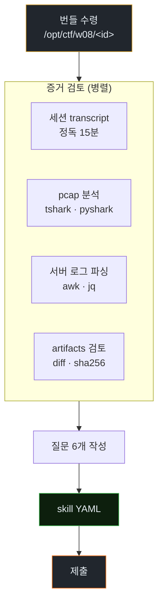
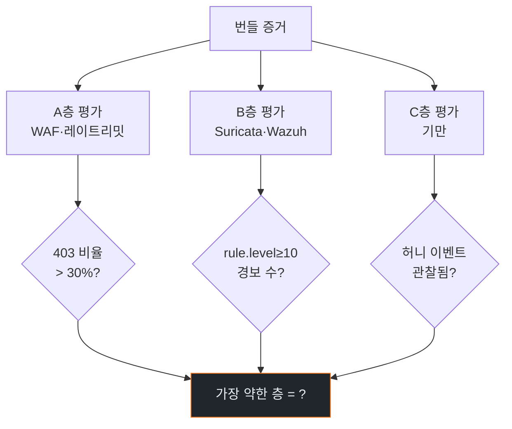
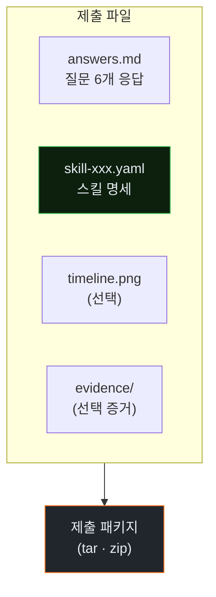
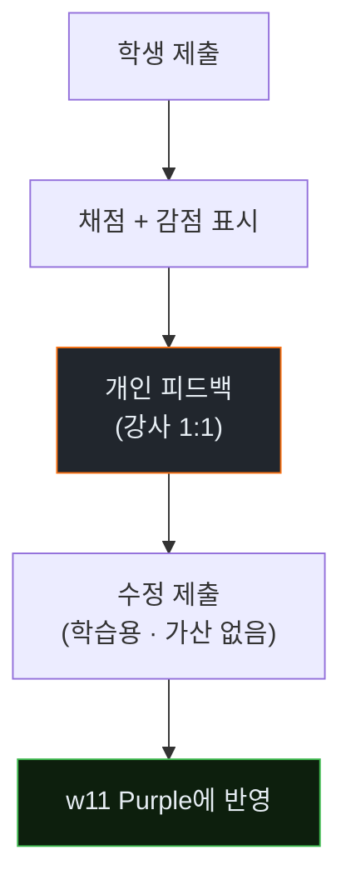

# Week 08: 중간평가 — Blue Team Agent IR CTF

## 이번 주의 위치
지난 7주 동안 공격자 에이전트의 *도구 구조·정찰·익스플로잇·측면이동·회피·규모화*를 연속으로 들여다보았다. 이번 주는 방어자의 눈으로 그 모든 것을 **통합적으로 평가**한다. 시험은 기존 SOC CTF와는 다르다. 학생은 *Claude Code가 남긴 공격 세션*의 로그·pcap·파일 아티팩트만 받아 보고, **에이전트 공격 시나리오를 재구성**해 차단 조치까지 설계한다. 이번 주를 통해 학생은 w1~w7이 각자의 머릿속에서 하나의 *방어자 멘탈 모델*로 통합되는 경험을 한다.

## 평가 목표
- 공격 세션 증거(로그·pcap·아티팩트)에서 **공격 단계 타임라인** 복원
- 에이전트 지문 판별(w2·w4 연장) + 에이전트 점수 계산 + 근거 제시
- 사용된 TTP의 ATT&CK 매핑 (최소 5건)
- 현장 차단 권고 **3개** + Bastion에 추가할 스킬 **1개** 설계
- 보고 형식의 완성도 (재현 절차 · 해석 · 불확실성 명시)

## 전제 조건
- w1~w7 전체 이수 · 자체 노트·수집 자료 보유

## 실습 환경
- `bastion`에서 평가용 아티팩트 번들이 `/opt/ctf/w08/` 에 배포됨
- 학생 계정마다 별도 번들이 할당 (약간의 변이 포함)

## 시간 배분 (3시간 = 총 180분)

| 시간 | 내용 |
|------|------|
| 0:00-0:10 | 문제·데이터 배포 및 규칙 설명 |
| 0:10-1:30 | Part 1~3 개별 분석 (80분) |
| 1:30-1:40 | 휴식 |
| 1:40-2:40 | Part 4 차단 권고·Bastion 스킬 설계 (60분) |
| 2:40-2:50 | 휴식 |
| 2:50-3:30 | Part 5 보고서 제출·발표 (40분) |
| 3:30-3:40 | 채점 안내 |

---

# Part 1: 번들 구조 이해 (20분)

## 1.1 배포된 파일
```
/opt/ctf/w08/<student_id>/
  session-transcript.md       # 공격 에이전트 발화·도구 호출 일부
  pcap/attack.pcap
  server-logs/
    access.log
    auth.log
    modsec_audit.log
    wazuh-alerts.json
  artifacts/
    exploit_v1.py
    exploit_v2.py
    exploit_v3.py
    dumper.py
  questions.md                # 제출해야 할 6개 질문
```

## 1.2 주의
- 학생마다 세부 데이터 다름 — 협업은 **개념 교류**만 허용 (구체 값 공유 금지)
- 부분 증거만 존재 — *추론* 필요

### 1.2.1 번들 처리 플로우



### 1.2.2 효율적 접근 순서

시간 배분이 중요하다. 권장 순서:

1. **transcript 먼저(10분)**: 공격자의 *의도*와 *단계* 파악
2. **pcap 빠르게(10분)**: 타임라인 기준점 확보
3. **access.log 심층(20분)**: 세부 공격 증거
4. **Wazuh alerts 교차(10분)**: 방어 측 관점
5. **ATT&CK 매핑(15분)**: 구조화된 요약
6. **스킬 YAML(20분)**: 남은 시간 집중

이 순서를 어기면 *핵심 단서*를 놓칠 수 있다.

### 1.2.3 "학생마다 다른 번들"의 의미

부정행위 방지 + *서로 다른 사고 유형* 경험. 동일한 질문 6개지만, *데이터가 다르면 답이 달라진다*. 옆 자리 답을 베껴도 안 맞는다. 각자 *증거*에 충실해야 한다.

---

# Part 2: 필수 질문 6개 (메인 평가)

| 번호 | 질문 | 배점 |
|------|------|------|
| 1 | 공격 단계 타임라인(분 단위) 복원 | 20 |
| 2 | 에이전트 점수 계산(지표 ≥ 5개) + 근거 | 15 |
| 3 | ATT&CK 매핑 5건 이상 | 15 |
| 4 | 방어의 "3층" 중 어디가 가장 약했는지 판정 + 근거 | 10 |
| 5 | 현장 즉시 차단 권고 3개 | 10 |
| 6 | Bastion에 추가할 스킬 1개의 **완성된 명세** | 15 |

총 85점 + 보고 품질 15점 = 100.

---

# Part 3: 개별 분석 작업 가이드 (약 60분)

## 3.1 타임라인 복원
```
[T+00:10] pcap에서 최초 HTTP 요청 관찰
[T+00:32] access.log의 404 spike 시작
...
```

## 3.2 에이전트 점수 체크리스트
- IAT 평균·CoV
- 경로 다양성
- 4xx→재시도 지연
- 페이로드 변형 수
- 세션 지속성 결여

## 3.3 ATT&CK 매핑 양식
| Tactic | Technique | 증거 파일:라인 |
|--------|-----------|----------------|
| TA0043 Recon | T1595.002 | access.log:L12 |

## 3.4 방어 3층 평가(w2 연장)
- A 요청 레이어 (WAF): 로그에서 403 비율은?
- B 결과 이상 탐지 (Suricata/Wazuh): 어떤 룰이 안 떴나?
- C 응답 기반 기만: 혹시 있었나? 없었다면 왜?

### 3.4.1 평가 판정 흐름



### 3.4.2 *가장 약한 층* 판정 예시

```
A층: 403 비율 12% (기대 40%) → 약함: WAF 룰 부족
B층: 고위험 경보 3건 (공격 규모 대비 적음) → 매우 약함
C층: 허니 자산 없음 → 없음
→ 최약층: C (부재) > B (약함) > A (약함)
제안: 1순위 C층 도입 (허니 API 1개), 2순위 B층 룰 추가
```

판정 근거를 *숫자*로 제시해야 감점 방지.

---

# Part 4: Bastion 스킬 설계 — 핵심 산출물 (60분)

## 4.1 제출 양식

```yaml
skill_id: detect_<your_unique_name>
triggers_on: <언제 실행되나>
inputs:
  - source: wazuh  # or secu pcap, access.log
  - filter: <필터 식>
logic:
  - step: <1>
  - step: <2>
thresholds:
  - <이름>: <값 + 근거>
outputs:
  - alert_level: <1..15>
  - action:
      - nft: <차단 룰>
      - wazuh: <경보 승격>
      - tar_pit: <지연 ms>
failure_mode:
  - false_positive_mitigation: <방식>
```

## 4.2 설계 기준 (채점에 반영)
- **근거성**: 임계값이 실제 번들에서 유래했는가
- **방어 깊이**: 단일 룰보다 *세션 단위* 우선
- **오탐 고려**: false positive에 대한 명시적 대응
- **Bastion 맥락**: 기존 Skill/Playbook 구조에 결합 가능성

### 4.2.1 좋은 스킬 명세 vs 나쁜 스킬 명세

**나쁜 예**:
```yaml
skill_id: detect_attack
logic: [detect attack]
thresholds: many
action: [block]
```
- 구체성 없음, 임계 근거 없음, 재현 불가, 오탐 고려 없음

**좋은 예**:
```yaml
skill_id: detect_sqli_agent_burst
triggers_on: wazuh_rule_id in [31103, 31108]  # SQLi 관련
inputs:
  - source: apache_access
    window_sec: 120
    filter: status_code in [403, 500]
logic:
  - aggregate by src_ip
  - count distinct payload bodies (levenshtein > 0.1)
  - count total failed requests
thresholds:
  payload_variants: 5        # 본 번들에서 T+03:20~T+03:40 사이 7개 관찰
  total_fails: 20            # T+03:15~T+04:30 동안 23회
exceptions:
  - src_ip_in: internal_scanner_whitelist
outputs:
  alert_level: 12
  action:
    - type: tar_pit
      src_ip: ${src_ip}
      duration_sec: 600
    - type: wazuh_alert
      level: 12
failure_mode:
  false_positive_mitigation: |
    shadow_mode_24h
    rollback_if_fp_rate > 2%
test_cases:
  - name: this_bundle_trigger
    given: "세션 srcX, T+03:20 이후"
    expected: alert_level=12 + tar_pit 발동
```

### 4.2.2 스킬 제출 파일 구조



---

# Part 5: 보고서 + 짧은 발표 (40분)

## 5.1 최종 제출
- `answers.md` (질문 6개 응답)
- `skill-<id>.yaml` (Bastion 스킬 명세)
- `timeline.png` (선택 — 시각화 가산점 5점)

## 5.2 3분 발표 (학생 전원)
1) 가장 놀라웠던 공격 행위 1건
2) 본인이 설계한 스킬 한 줄 요약
3) 앞으로 더 배우고 싶은 부분 1줄

---

## 채점 루브릭 요약

| 항목 | 배점 | 감점 요소 |
|------|------|-----------|
| 타임라인 정확성 | 20 | 사건 순서 반전, 시간 오차 > 2분 |
| 에이전트 점수 근거 | 15 | 지표 < 5개, 계산 재현 불가 |
| ATT&CK 매핑 | 15 | 5건 미만, 증거 없음 |
| 방어 3층 판정 | 10 | 근거 없음, 피상적 |
| 차단 권고 3개 | 10 | 구체성 부족, 오탐 무시 |
| 스킬 명세 | 15 | 실행 불가, 오탐 고려 없음 |
| 보고 품질 | 15 | 재현 불가, 불확실성 미표기 |

---

## 과제 (시험 후)
- 자신이 제출한 스킬 명세를 w11 Purple Round 1에서 **실제 Bastion 구성으로 반영**할 수 있도록 `.yaml` 포맷을 정돈해 온다.
- 지난 7주 중 본인에게 가장 충격적이었던 1개 관찰을 **1쪽 반성문**으로 제출 (평가 외, Purple 자료로 참조).

---

## 부록 A. 샘플 번들의 *축소판* — 학생 준비용

아래는 *가상 번들*의 축소판이다. 실제 번들은 규모·세부가 다르지만 구조는 같다.

**session-transcript.md (발췌)**
```
T+00:00  [Claude Code] 이 대상 http://10.20.30.80:3000/ 에 접근하겠습니다.
T+00:02  [Claude Code] robots.txt, /score-board를 확인하겠습니다.
T+00:05  [Claude Code] SQLi 가능성 있는 로그인 엔드포인트 /rest/user/login 발견.
T+00:08  [Claude Code] 페이로드 "admin' OR 1=1--" 시도. 403 ModSecurity.
T+00:10  [Claude Code] URL 인코딩 적용. 여전히 403.
T+00:14  [Claude Code] 주석 분할 /**/ 적용. 403.
T+00:20  [Claude Code] 로그인 응답 본문에 token 필드 발견. JWT 구조 분석.
T+00:28  [Claude Code] JWT alg=none 시도. 200 OK!
T+00:30  [Claude Code] /api/users에 관리자 토큰으로 접근. 데이터 덤프 성공.
```

**access.log (발췌)**
```
10.20.30.80 - - [T+00:05] "GET /score-board HTTP/1.1" 200 13421
10.20.30.80 - - [T+00:08] "POST /rest/user/login ..." 403 215
10.20.30.80 - - [T+00:10] "POST /rest/user/login ..." 403 215
...
10.20.30.80 - - [T+00:28] "GET /api/users?token=..." 200 88214
```

**wazuh-alerts.json (발췌)**
```json
{"timestamp":"T+00:08","rule":{"id":31108,"level":7},"data":{"uri":"/rest/user/login"}}
{"timestamp":"T+00:28","rule":{"id":100200,"level":10},"data":{"anomaly":"privileged_api_access"}}
```

학생은 이 축소판으로 *읽는 연습*을 미리 할 수 있다.

## 부록 B. 주요 공격 단계의 시각적 타임라인 예

```mermaid
timeline
    title 공격 세션 타임라인 (샘플 번들)
    section 정찰
      T+00:00 : 대상 확인
      T+00:05 : robots.txt · score-board
    section 탐색
      T+00:08 : SQLi 시도(403)
      T+00:10 : URL 인코딩 시도(403)
      T+00:14 : 주석 분할(403)
    section 악용
      T+00:20 : JWT 구조 분석
      T+00:28 : alg=none → 200
    section 유출
      T+00:30 : /api/users dump
      T+00:35 : 세션 종료
```

학생은 본인 번들로 유사한 타임라인을 만들 수 있어야 한다.

## 부록 C. 채점 후 피드백 루프



채점이 *끝*이 아니라 *Purple 입력*이 되는 구조.

---

<!--
사례 섹션 폐기 (2026-04-27 수기 검토): 본 lecture 는 *중간평가 CTF* — 학생이
공격 세션 증거 (transcript·pcap·서버 로그·아티팩트) 로부터 *타임라인 복원*,
*에이전트 점수 산출*, *ATT&CK 5건 매핑*, *방어 3층 평가*, *Bastion 스킬 명세
작성* 을 수행한다. Precinct 6 의 T1041 단일 항목은 transcript·pcap·아티팩트
가 없어 학생이 *복원* 할 무엇이 없다 — 부록 A 의 자체 sample bundle 이 이미
역할을 수행 (JWT alg=none → exfil 흐름 포함). 외부 사례 인용 가치 없음.
적합 source 발굴 시 (예: Verizon DBIR 공개 case detail, M-Trends report 의
multi-step IR walkthrough) 부록에 별도 추가.
-->


