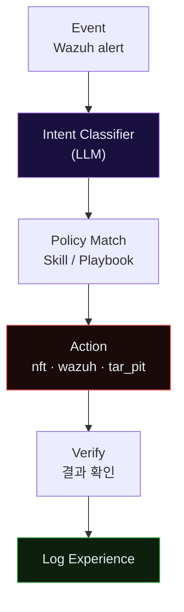
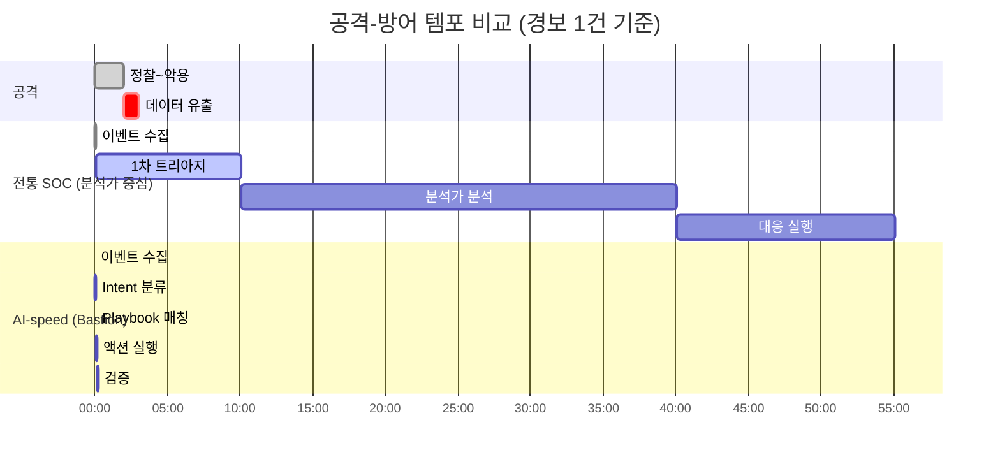
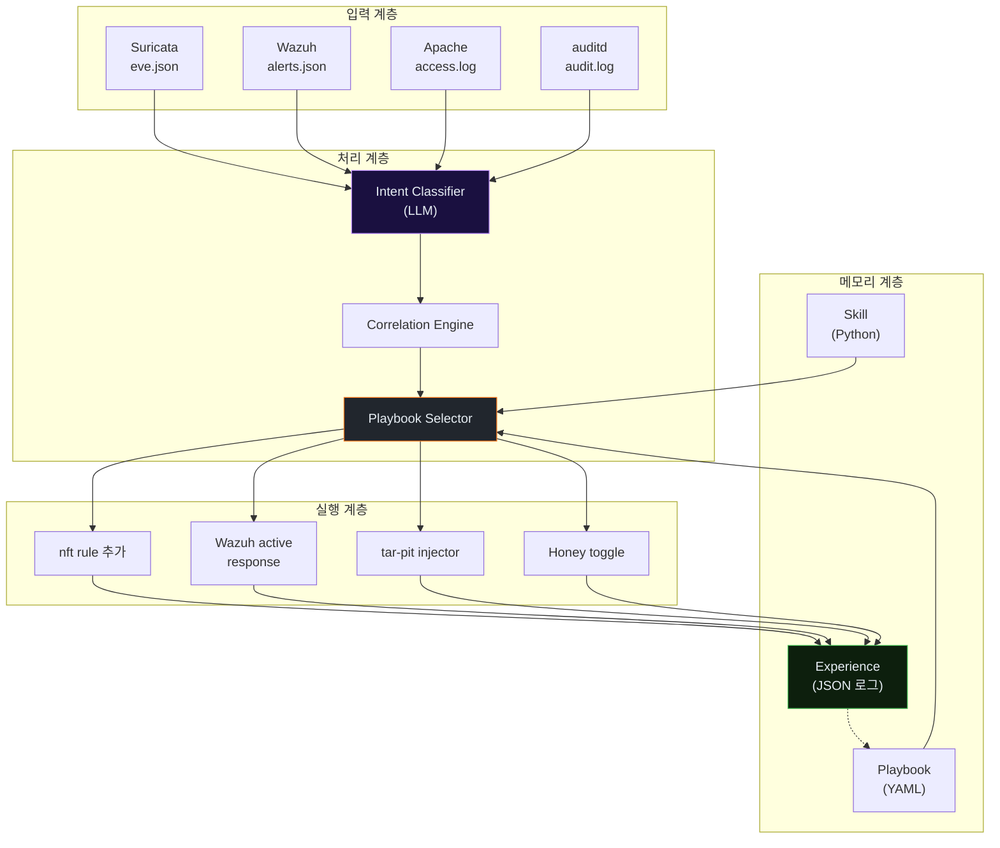
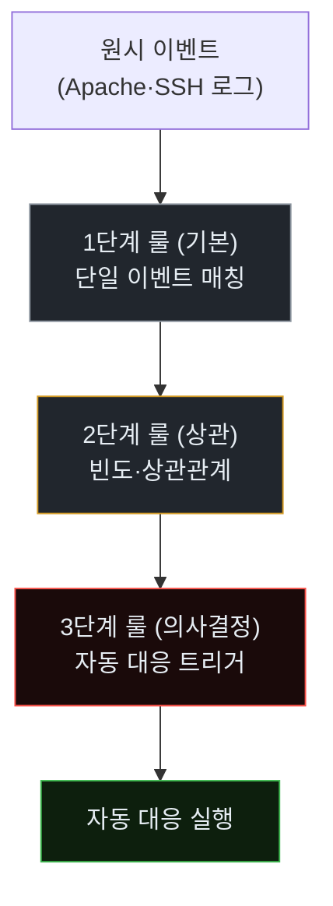
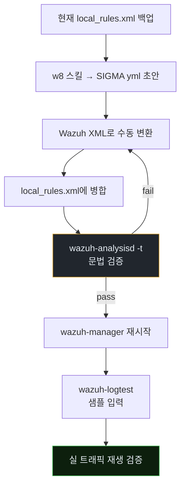
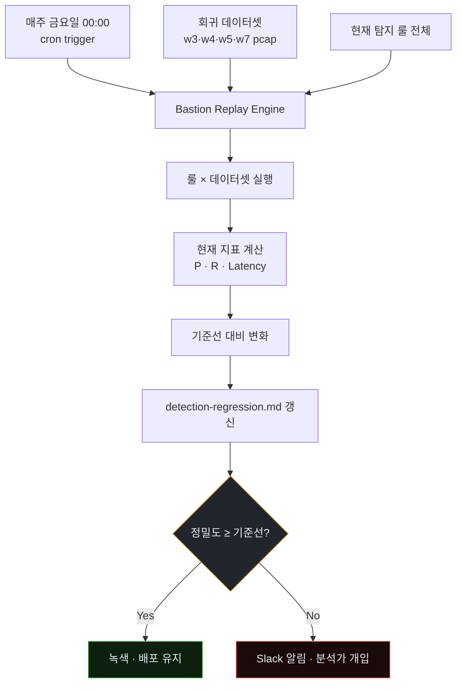
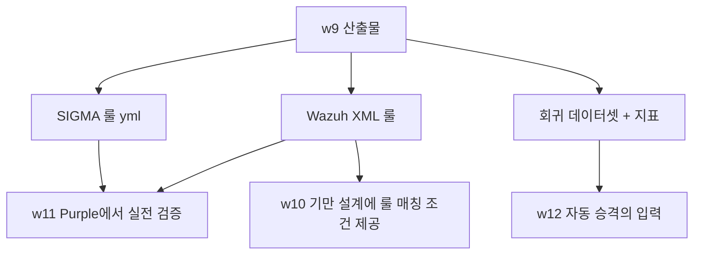
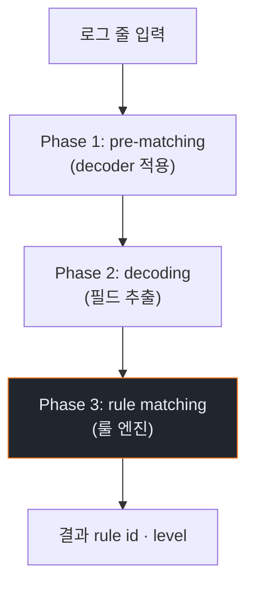

# Week 09: 실시간 탐지 — AI 속도에 맞춘 탐지 룰 엔지니어링

## 이번 주의 위치
w8에서 학생은 *공격 증거*만 보고 방어 개선안을 제시했다. 이번 주부터는 **그 개선안을 Bastion 인프라에 실제로 구현**한다. 목표는 AI 속도에 맞춘 탐지 — 즉 *분 단위가 아닌 초 단위 대응*을 가능하게 하는 룰 엔지니어링이다. SIGMA·Wazuh·Suricata 3계층에서 어떻게 얇고 빠른 룰을 짜고, 오탐을 어떻게 억제하는지를 다룬다.

## 학습 목표
- SIGMA → Wazuh/ELK 변환 파이프라인을 이해하고 직접 시도한다
- Suricata IDS 룰 간의 의존 관계(parent→child)로 *변형 대응*을 자동화한다
- Wazuh rule.level 체계와 상관관계(root/frequency) 옵션을 활용한다
- 세션 단위 상관 룰을 1건 작성해 Bastion에 통합한다
- 룰 품질 지표(정밀도·재현율·탐지 지연)를 측정한다

## 전제 조건
- C5·C14 수강 (SIGMA·Wazuh 경험)
- w3·w5·w6·w8의 실습 자료 보유

## 강의 시간 배분 (3시간)

| 시간 | 내용 |
|------|------|
| 0:00-0:30 | Part 1: AI-speed detection — 초 단위 파이프라인 |
| 0:30-1:00 | Part 2: SIGMA 룰의 정밀 설계 |
| 1:00-1:10 | 휴식 |
| 1:10-2:10 | Part 3: 실습 — 내 룰을 Wazuh에 심기 |
| 2:10-2:40 | Part 4: Suricata 변형 룰 자동 파생 |
| 2:40-2:50 | 휴식 |
| 2:50-3:20 | Part 5: 룰 품질 측정과 회귀 테스트 |
| 3:20-3:40 | 퀴즈 + 과제 |

---

# Part 1: AI-speed Detection — 초 단위 파이프라인 (30분)

## 1.1 분 단위 SOC vs 초 단위 필요

| 단계 | 기존 SOC 소요 | AI-speed 목표 |
|------|---------------|---------------|
| 이벤트 수집 | 초 단위 (이미 OK) | 초 단위 |
| 룰 평가 | 초 단위 (이미 OK) | 초 단위 |
| 경보 트리아지 | 수 분~수 시간 (분석가) | **10초 이내 1차 자동 판단** |
| 대응 실행 | 수십 분~수 시간 | **30초 이내 1차 자동 대응** |

대응의 1차 자동화가 본 주차의 지향.

## 1.2 Bastion의 자동 대응 경로(요약)


- I·P·V 각 단계의 목표 지연: **1~5초**
- 전체 E→A: 목표 **≤30초**

### 1.2.1 템포 비교 — 인간 SOC vs AI-speed



공격이 *3분*에 끝나는데 전통 SOC은 *55분*이 걸린다. AI-speed는 *17초* 안에 1차 대응 진입.

### 1.2.2 Bastion 내부 컴포넌트 상세



이 그림이 w11~w12에서 구현할 *구조*의 전체 지도다.

### 1.2.3 *사람은 어디에 남는가*

자동화로 밀려나지 않는 사람의 역할.

| 역할 | 책임 |
|------|------|
| **정책 결정자** | 화이트리스트·허용 도메인·임계값 정의 |
| **롤백 승인자** | 자동 대응 실패 시 빠른 롤백 판단 |
| **회고 리더** | Purple Round의 복기·교훈 정리 |
| **법무·감사 대응** | 외부 기관 소통, 증적 관리 |
| **문화 리더** | VulnOps 문화 형성, 팀원 코칭 |

사람은 *전술*에서 빠져서 *전략*에 집중한다.

---

# Part 2: SIGMA 룰의 정밀 설계 (30분)

## 2.1 SIGMA 기본 구조
```yaml
title: Agent-like request burst on JuiceShop
status: experimental
logsource:
  product: apache
  service: access
detection:
  selection:
    cs-uri-stem|contains:
      - "/rest/"
  timeframe: 120s
  condition: selection | count() by c-ip > 60
falsepositives:
  - Internal monitoring bots
level: medium
```

## 2.2 실무 팁
- `timeframe`을 짧게 + `count`를 타이트하게 — *IAT*가 기계적인 세션을 잘 잡음
- `falsepositives` 섹션에 합법 출처(내부 모니터·벤더 스캐너) 명시
- `fields`에 *왜 경보인지*를 즉시 이해할 키를 포함

## 2.3 Wazuh로 변환
```bash
sigmac -t wazuh rule.yml > local_rules.xml.piece
# Manager에 병합 후 문법 검증
sudo /var/ossec/bin/wazuh-analysisd -t
sudo systemctl restart wazuh-manager
```

## 2.4 Wazuh `<rule>` 요소의 쓸모 있는 옵션
- `<if_matched_sid>` — 부모 룰이 매칭된 뒤에만
- `<frequency>`, `<timeframe>` — 세션 상관
- `<options>no_log</options>` — 운영 잡음 억제

### 2.4.1 SIGMA → Wazuh 변환의 제약과 해법

모든 SIGMA 룰이 Wazuh로 *자동* 변환되는 것은 아니다. 제약:

- SIGMA의 `timeframe`·`count` → Wazuh의 `frequency`·`timeframe`으로 매핑 가능
- SIGMA의 `aggregation by field` → Wazuh에서는 **같은 필드가 decoder에 포함**되어야 동작
- SIGMA의 `near` (이벤트 근접) → Wazuh `<if_sid>` 체인으로 수동 변환

변환 실패 시 **수동으로** 작성. 아래는 w8의 스킬 명세를 Wazuh 룰로 *직접* 쓴 예.

```xml
<group name="agent_ir">

  <!-- 부모 룰: 로그인 실패 -->
  <rule id="100110" level="5">
    <if_sid>5710</if_sid>
    <description>SSH login failure (base)</description>
    <group>authentication_failed</group>
  </rule>

  <!-- 1분 내 5회 이상 → 상관 룰 -->
  <rule id="100111" level="10" frequency="5" timeframe="60">
    <if_matched_sid>100110</if_matched_sid>
    <same_source_ip/>
    <description>Agent-like credential brute (5 fails in 60s)</description>
    <group>agent_credential_access,attack</group>
    <mitre>
      <id>T1110.001</id>
    </mitre>
  </rule>

  <!-- 10회 이상 → 고위험 -->
  <rule id="100112" level="13" frequency="10" timeframe="60">
    <if_matched_sid>100110</if_matched_sid>
    <same_source_ip/>
    <description>Agent-like brute storm — auto-block trigger</description>
    <group>agent_credential_access,attack,auto_respond</group>
    <mitre><id>T1110.001</id></mitre>
  </rule>

</group>
```

### 2.4.2 룰 계층화의 도식



L1~L2는 *경보만*, L3에서 *대응* 결합. 대응 룰을 L2와 섞으면 오탐 차단이 발생한다.

---

# Part 3: 실습 — 내 룰을 Wazuh에 심기 (60분)

## 3.1 학생별 룰 초안
w8에서 설계한 스킬의 **탐지 로직**을 SIGMA 형식으로 변환한다.

## 3.2 `siem` VM에 반영
```bash
ssh ccc@10.20.30.100
sudo nano /var/ossec/etc/rules/local_rules.xml
# <rule id="100200" level="10"> ...
sudo /var/ossec/bin/wazuh-analysisd -t
sudo systemctl restart wazuh-manager
```

## 3.3 검증
- `wazuh-logtest`로 샘플 로그 입력 → Phase 3에서 내 룰 매칭되는지
- 실제 트래픽(w3·w4 재생) 재생해서 경보 발생 여부

## 3.4 재현·기록
- 룰 초안(.xml)
- logtest 출력
- 샘플 경보(`alerts.json` 한 줄)

### 3.4.1 실습의 권장 순서



### 3.4.2 *재현 패키지* 구조

```
artifacts/w09/
  sigma/agent_brute.yml
  wazuh/local_rules.diff
  logtest-output.txt
  alerts-sample.json
  regression-metrics.csv
```

이 패키지가 w11 Purple에서 *진짜로 동작하는가*의 증거가 된다.

### 3.4.3 자주 보는 오류와 해결

| 오류 | 원인 | 해결 |
|------|------|------|
| `2>/dev/null` 만 나옴 | 문법 오류 | `wazuh-analysisd -t` 상세 출력 |
| 매칭되지 않음 | decoder에 필드 없음 | 커스텀 decoder 작성 |
| 중복 경보 | 부모·자식 룰 동시 매칭 | `<options>no_email_alert</options>` |
| 경보 레벨 무시 | `<options>no_log</options>` | 의도적이면 유지, 아니면 제거 |

---

# Part 4: Suricata 변형 룰 자동 파생 (30분)

## 4.1 파생 개념
- 부모 룰이 매칭되면, **그 요청 본문의 변형**을 자동 생성해 **아들 룰**로 저장
- w6 롤링 탐지의 구현 축 하나

## 4.2 스니펫(개념)
```python
def derive_variants(parent_payload):
    yield parent_payload.replace(" ", "/**/")
    yield parent_payload.upper()
    import base64; yield base64.b64encode(parent_payload.encode()).decode()
```

## 4.3 실무 주의
- 아들 룰은 **별도 sid 범위**로 관리 (운영 정리 용이)
- 누적 증가 방지 — 오래된 아들 룰은 TTL로 제거

---

# Part 5: 룰 품질 측정과 회귀 테스트 (30분)

## 5.1 지표
- **정밀도(Precision)** = TP/(TP+FP)
- **재현율(Recall)** = TP/(TP+FN)
- **탐지 지연(Detection Latency)** = 최초 공격 요청 → 경보 발생 시각 차
- **오탐 밀도** = 일평균 FP/(시간)

## 5.2 회귀 데이터셋
- w3·w4·w5·w7의 세션 pcap을 **고정 데이터셋**으로 보관
- 룰 수정 시 데이터셋에 재실행해 지표 회귀 확인
- 이 "회귀 셋"이 **w14 모의실사고 대응의 기준선**이 된다

## 5.3 자동화 아이디어
- 매 주 금요일 자동 실행 → `docs/detection-regression.md` 업데이트
- 정밀도 감소 시 Slack·메일 경보

### 5.3.1 회귀 테스트 자동화 구조



### 5.3.2 회귀 테스트의 *측정 단위*

| 지표 | 목표 | 경보 기준 |
|------|------|-----------|
| 정밀도 | ≥ 90% | 5%p 이상 하락 |
| 재현율 | ≥ 70% | 10%p 이상 하락 |
| 탐지 지연(p50) | ≤ 10s | 2배 증가 |
| 오탐 밀도 | ≤ 2/일 | 5배 증가 |

### 5.3.3 본 주차 산출물과 후속 주차 연결



---

## 퀴즈 (5문항)

**Q1.** AI-speed detection의 핵심 대상은?
- (a) 수집 속도
- (b) **트리아지·대응의 초 단위화**
- (c) 스토리지 확장
- (d) UI 반응 속도

**Q2.** Wazuh `<if_matched_sid>` 옵션의 가치는?
- (a) 로그 용량 감소
- (b) **부모 룰 매칭 조건 위의 상관관계 룰 작성**
- (c) 정확도 감소
- (d) 성능 저하

**Q3.** 룰 품질 지표 중 *탐지 지연*이 중요한 이유는?
- (a) 로그 압축을 위해
- (b) **AI-speed 공격 앞에서 절대적 반응 시간이 곧 승부**
- (c) 저장 용량 최적화
- (d) CPU 사용률 관리

**Q4.** Suricata 아들 룰을 별도 sid 범위로 관리하는 이유는?
- (a) 보안상 필수
- (b) **운영 정리 및 TTL 관리 용이**
- (c) 라이선스
- (d) 네트워크 성능

**Q5.** 회귀 데이터셋의 핵심 목적은?
- (a) 저장 편의
- (b) **룰 수정 시 지표 회귀 여부 즉시 확인**
- (c) 교육 자료
- (d) 법적 증적

**Q6.** 룰 계층화(L1~L3)에서 *자동 대응*은 어느 층에 두나?
- (a) L1
- (b) L2
- (c) **L3**
- (d) 모두

**Q7.** SIGMA를 Wazuh로 변환할 때 자동화가 안 되는 항목은?
- (a) timeframe
- (b) count
- (c) **near (이벤트 근접)**
- (d) 기본 selection

**Q8.** Bastion의 Intent Classifier가 *LLM 기반*인 이유는?
- (a) 빠르기만 하면 됨
- (b) **비정형 텍스트(로그·설명)의 의도 분류에 전통 ML보다 유리**
- (c) 비용 절감
- (d) 법적 요건

**Q9.** 회귀 테스트의 *오탐 밀도 경보 기준*은?
- (a) 1.1배
- (b) 2배
- (c) **5배**
- (d) 10배

**Q10.** 매주 금요일 자동 회귀 실행이 *전통 SOC 관행*과 차별되는 점은?
- (a) 주말 운영
- (b) **고정 데이터셋에서 지표 회귀를 자동 확인 — 사람 리뷰 없이**
- (c) 예산
- (d) UI

**정답:** Q1:b · Q2:b · Q3:b · Q4:b · Q5:b · Q6:c · Q7:c · Q8:b · Q9:c · Q10:b

---

## 과제
1. **SIGMA + Wazuh 실장 (필수)**: 내 SIGMA 룰의 `.yml` + 변환된 Wazuh `.xml` + `wazuh-logtest` 출력 스크린샷. 3.4.2 재현 패키지 구조로 제출.
2. **회귀 지표 (필수)**: 본인 룰을 w3·w4·w5·w7의 pcap에 재생한 정밀도·재현율·탐지 지연 표. 5.3.2 기준 대비 판정.
3. **w11 Purple 결합 계획서 1쪽 (필수)**: 본 주차에서 만든 Wazuh 룰이 w11 Purple Round에서 어떤 트리거로 Bastion 스킬을 호출할지 설계.
4. **(선택 · 🏅 가산)**: `detection-regression.md` 자동화 스크립트 작성 (cron 진입점 + 지표 계산 + 리포트 갱신).
5. **(선택 · 🏅 가산)**: 본인 룰이 *오탐*을 일으킬 수 있는 정상 트래픽 패턴 3종을 식별·기록.

---

## 부록 A. Wazuh 룰 작성 시 참고 SID 대역

| 대역 | 용도 |
|------|------|
| 1~99999 | OSSEC/Wazuh 기본 룰 |
| 100000~100099 | 예약 (학습용) |
| **100100~100999** | 과목 실습용 (학생 배정) |
| 100101~100199 | w9 (본인 룰) |
| 100200~100299 | w10 (기만) |
| 100300~100399 | w11·12 (Purple 추가) |
| 100400~100499 | w14 (실사고 대응) |

본 과목 모든 커스텀 룰은 **100100+** 사용. 다른 대역을 쓰면 벤더 룰셋과 충돌 가능.

## 부록 B. `wazuh-logtest`의 Phase 이해



Phase 3에서 *내 커스텀 룰 ID*가 뜨면 정상. 다른 룰만 뜨면 *decoder나 조건 문제*다.

---

## 실제 사례 (WitFoo Precinct 6)

> **출처**: [WitFoo Precinct 6 Cybersecurity Dataset](https://huggingface.co/datasets/witfoo/precinct6-cybersecurity) (Apache 2.0)
> **익명화**: RFC5737 TEST-NET / ORG-NNNN / HOST-NNNN 으로 sanitized

본 주차 (9주차) 학습 주제와 직접 연관된 *실제* incident:

### 스피어 피싱 첨부파일 — HTA + PowerShell downloader

> **출처**: WitFoo Precinct 6 / `incident-2024-08-004` (anchor: `anc-cbdabf2e6c87`) · sanitized
> **시점**: 2024-08-18 (Initial Access)

**관찰**: user@victim.example 이 invoice.hta 첨부 실행 → mshta.exe → cmd → powershell -enc <base64 payload>.

**MITRE ATT&CK**: **T1566.001 (Spearphishing Attachment)**, **T1059.001 (PowerShell)**, **T1218.005 (Mshta)**

**IoC**:
  - `invoice.hta`
  - `mshta.exe → cmd → powershell -enc`

**학습 포인트**:
- HTA 가 IE/MSHTA 통해 신뢰 zone 으로 실행 — 클라이언트 측 첫 발판
- AppLocker 또는 Windows Defender ASR 룰로 mshta.exe child process 차단 가능
- 탐지: Sysmon EID 1 (process create), parent=mshta.exe child=cmd/powershell
- 방어: 이메일 게이트웨이 첨부 sandboxing, .hta 차단, ASR 룰, EDR 프로세스 트리


**본 강의와의 연결**: 위 사례는 강의의 핵심 개념이 어떻게 *실제 운영 환경*에서 일어나는지 보여준다. 학생은 이 패턴을 (1) 공격자 입장에서 재현 가능한가 (2) 방어자 입장에서 탐지 가능한가 (3) 자기 인프라에서 동일 신호가 있는지 검색 가능한가 — 3 관점에서 평가한다.

---

> 더 많은 사례 (총 5 anchor + 외부 표준 7 source) 는 KG (Knowledge Graph) 페이지에서 검색 가능.
> Cyber Range 실습 중 학습 포인트 박스 (📖) 에 동일 anchor 가 자동 노출된다.
