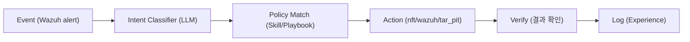

# Week 09: 실시간 탐지 — AI 속도에 맞춘 탐지 룰 엔지니어링

## 이번 주의 위치
w8에서 학생은 *공격 증거*만 보고 방어 개선안을 제시했다. 이번 주부터는 **그 개선안을 Bastion 인프라에 실제로 구현**한다. 목표는 AI 속도에 맞춘 탐지 — 즉 *분 단위가 아닌 초 단위 대응*을 가능하게 하는 룰 엔지니어링이다. SIGMA·Wazuh·Suricata 3계층에서 어떻게 얇고 빠른 룰을 짜고, 오탐을 어떻게 억제하는지를 다룬다.

## 학습 목표
- SIGMA → Wazuh/ELK 변환 파이프라인을 이해하고 직접 시도한다
- Suricata IDS 룰 간의 의존 관계(parent→child)로 *변형 대응*을 자동화한다
- Wazuh rule.level 체계와 상관관계(root/frequency) 옵션을 활용한다
- 세션 단위 상관 룰을 1건 작성해 Bastion에 통합한다
- 룰 품질 지표(정밀도·재현율·탐지 지연)를 측정한다

## 전제 조건
- C5·C14 수강 (SIGMA·Wazuh 경험)
- w3·w5·w6·w8의 실습 자료 보유

## 강의 시간 배분 (3시간)

| 시간 | 내용 |
|------|------|
| 0:00-0:30 | Part 1: AI-speed detection — 초 단위 파이프라인 |
| 0:30-1:00 | Part 2: SIGMA 룰의 정밀 설계 |
| 1:00-1:10 | 휴식 |
| 1:10-2:10 | Part 3: 실습 — 내 룰을 Wazuh에 심기 |
| 2:10-2:40 | Part 4: Suricata 변형 룰 자동 파생 |
| 2:40-2:50 | 휴식 |
| 2:50-3:20 | Part 5: 룰 품질 측정과 회귀 테스트 |
| 3:20-3:40 | 퀴즈 + 과제 |

---

# Part 1: AI-speed Detection — 초 단위 파이프라인 (30분)

## 1.1 분 단위 SOC vs 초 단위 필요

| 단계 | 기존 SOC 소요 | AI-speed 목표 |
|------|---------------|---------------|
| 이벤트 수집 | 초 단위 (이미 OK) | 초 단위 |
| 룰 평가 | 초 단위 (이미 OK) | 초 단위 |
| 경보 트리아지 | 수 분~수 시간 (분석가) | **10초 이내 1차 자동 판단** |
| 대응 실행 | 수십 분~수 시간 | **30초 이내 1차 자동 대응** |

대응의 1차 자동화가 본 주차의 지향.

## 1.2 Bastion의 자동 대응 경로(요약)


- I·P·V 각 단계의 목표 지연: **1~5초**
- 전체 E→A: 목표 **≤30초**

---

# Part 2: SIGMA 룰의 정밀 설계 (30분)

## 2.1 SIGMA 기본 구조
```yaml
title: Agent-like request burst on JuiceShop
status: experimental
logsource:
  product: apache
  service: access
detection:
  selection:
    cs-uri-stem|contains:
      - "/rest/"
  timeframe: 120s
  condition: selection | count() by c-ip > 60
falsepositives:
  - Internal monitoring bots
level: medium
```

## 2.2 실무 팁
- `timeframe`을 짧게 + `count`를 타이트하게 — *IAT*가 기계적인 세션을 잘 잡음
- `falsepositives` 섹션에 합법 출처(내부 모니터·벤더 스캐너) 명시
- `fields`에 *왜 경보인지*를 즉시 이해할 키를 포함

## 2.3 Wazuh로 변환
```bash
sigmac -t wazuh rule.yml > local_rules.xml.piece
# Manager에 병합 후 문법 검증
sudo /var/ossec/bin/wazuh-analysisd -t
sudo systemctl restart wazuh-manager
```

## 2.4 Wazuh `<rule>` 요소의 쓸모 있는 옵션
- `<if_matched_sid>` — 부모 룰이 매칭된 뒤에만
- `<frequency>`, `<timeframe>` — 세션 상관
- `<options>no_log</options>` — 운영 잡음 억제

---

# Part 3: 실습 — 내 룰을 Wazuh에 심기 (60분)

## 3.1 학생별 룰 초안
w8에서 설계한 스킬의 **탐지 로직**을 SIGMA 형식으로 변환한다.

## 3.2 `siem` VM에 반영
```bash
ssh ccc@10.20.30.100
sudo nano /var/ossec/etc/rules/local_rules.xml
# <rule id="100200" level="10"> ...
sudo /var/ossec/bin/wazuh-analysisd -t
sudo systemctl restart wazuh-manager
```

## 3.3 검증
- `wazuh-logtest`로 샘플 로그 입력 → Phase 3에서 내 룰 매칭되는지
- 실제 트래픽(w3·w4 재생) 재생해서 경보 발생 여부

## 3.4 재현·기록
- 룰 초안(.xml)
- logtest 출력
- 샘플 경보(`alerts.json` 한 줄)

---

# Part 4: Suricata 변형 룰 자동 파생 (30분)

## 4.1 파생 개념
- 부모 룰이 매칭되면, **그 요청 본문의 변형**을 자동 생성해 **아들 룰**로 저장
- w6 롤링 탐지의 구현 축 하나

## 4.2 스니펫(개념)
```python
def derive_variants(parent_payload):
    yield parent_payload.replace(" ", "/**/")
    yield parent_payload.upper()
    import base64; yield base64.b64encode(parent_payload.encode()).decode()
```

## 4.3 실무 주의
- 아들 룰은 **별도 sid 범위**로 관리 (운영 정리 용이)
- 누적 증가 방지 — 오래된 아들 룰은 TTL로 제거

---

# Part 5: 룰 품질 측정과 회귀 테스트 (30분)

## 5.1 지표
- **정밀도(Precision)** = TP/(TP+FP)
- **재현율(Recall)** = TP/(TP+FN)
- **탐지 지연(Detection Latency)** = 최초 공격 요청 → 경보 발생 시각 차
- **오탐 밀도** = 일평균 FP/(시간)

## 5.2 회귀 데이터셋
- w3·w4·w5·w7의 세션 pcap을 **고정 데이터셋**으로 보관
- 룰 수정 시 데이터셋에 재실행해 지표 회귀 확인
- 이 "회귀 셋"이 **w14 모의실사고 대응의 기준선**이 된다

## 5.3 자동화 아이디어
- 매 주 금요일 자동 실행 → `docs/detection-regression.md` 업데이트
- 정밀도 감소 시 Slack·메일 경보

---

## 퀴즈 (5문항)

**Q1.** AI-speed detection의 핵심 대상은?
- (a) 수집 속도
- (b) **트리아지·대응의 초 단위화**
- (c) 스토리지 확장
- (d) UI 반응 속도

**Q2.** Wazuh `<if_matched_sid>` 옵션의 가치는?
- (a) 로그 용량 감소
- (b) **부모 룰 매칭 조건 위의 상관관계 룰 작성**
- (c) 정확도 감소
- (d) 성능 저하

**Q3.** 룰 품질 지표 중 *탐지 지연*이 중요한 이유는?
- (a) 로그 압축을 위해
- (b) **AI-speed 공격 앞에서 절대적 반응 시간이 곧 승부**
- (c) 저장 용량 최적화
- (d) CPU 사용률 관리

**Q4.** Suricata 아들 룰을 별도 sid 범위로 관리하는 이유는?
- (a) 보안상 필수
- (b) **운영 정리 및 TTL 관리 용이**
- (c) 라이선스
- (d) 네트워크 성능

**Q5.** 회귀 데이터셋의 핵심 목적은?
- (a) 저장 편의
- (b) **룰 수정 시 지표 회귀 여부 즉시 확인**
- (c) 교육 자료
- (d) 법적 증적

**정답:** Q1:b, Q2:b, Q3:b, Q4:b, Q5:b

---

## 과제
1. 내 SIGMA 룰의 .yml + Wazuh .xml + logtest 출력 스크린샷.
2. 회귀 데이터셋에서 측정한 정밀도·재현율·탐지 지연 표.
3. Bastion skill과의 결합 계획서(1쪽) — w11 Purple의 입력.
