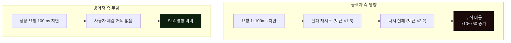
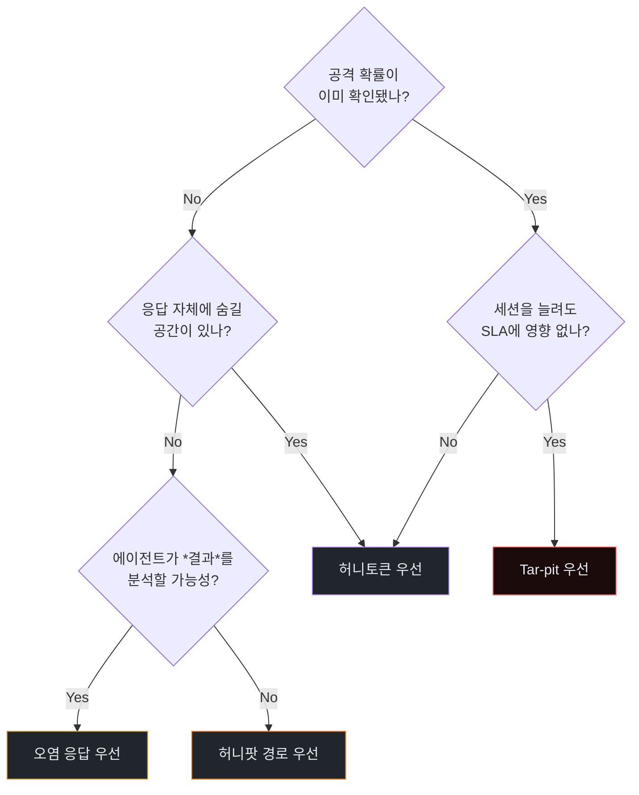
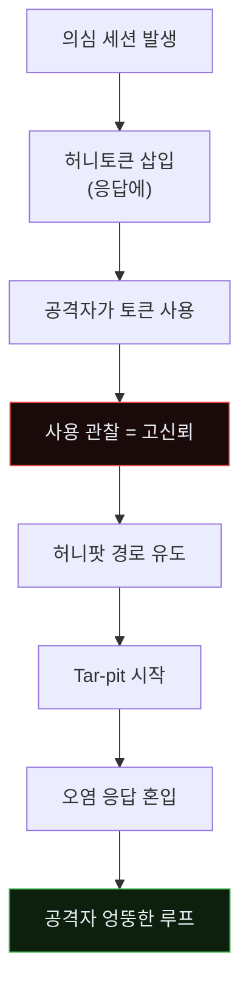
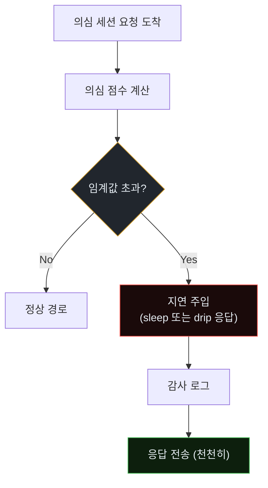
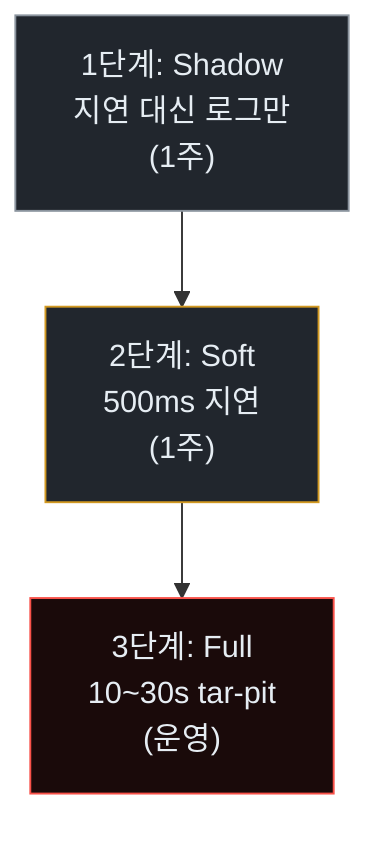
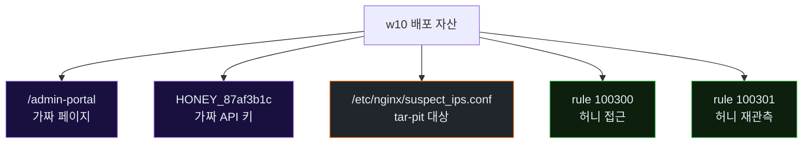

# Week 10: 기만과 지연 — 공격자의 비용을 올리는 능동 방어

## 이번 주의 위치
탐지(w9)만으로는 수십 에이전트 병렬 공격을 당해낼 수 없다. 이번 주는 방어를 **능동**으로 바꾼다. 공격자 에이전트가 *토큰 기반 비용 모델*을 갖는다는 성질을 이용해, **정상 사용자에겐 보이지 않는 지연·가짜 자산·오염된 응답**으로 공격 비용을 비대칭적으로 증가시키는 방어 설계를 다룬다. 본 주차는 w11·w12 Purple에서 Bastion에 등록될 "Deception Skill"의 씨앗이다.

## 학습 목표
- 기만(deception)과 지연(delay)의 운영 원칙 — *정상에겐 투명, 공격자에게 비싸게* — 을 이해한다
- 허니토큰·허니팟·tar-pit·오염 응답 네 가지 기법의 실무 경계를 구분한다
- JuiceShop 주변에 *관리자 미끼 페이지*와 *페이크 관리자 토큰*을 설계·배포한다
- Bastion의 *응답 조작 스킬* 초안을 작성한다
- 기만 설계가 법적·운영적으로 가질 수 있는 부작용을 검토한다

## 전제 조건
- w4·w5·w6 (공격의 페이로드 진화·측면이동 이해)
- 웹 서버 설정 경험 · Apache/Nginx reverse proxy 기초

## 강의 시간 배분 (3시간)

| 시간 | 내용 |
|------|------|
| 0:00-0:30 | Part 1: 비대칭 비용의 원리 |
| 0:30-1:00 | Part 2: 기만의 4가지 형태 |
| 1:00-1:10 | 휴식 |
| 1:10-2:00 | Part 3: 실습 — 허니토큰·가짜 관리자 페이지 |
| 2:00-2:40 | Part 4: tar-pit — 토큰 비용 공격 |
| 2:40-2:50 | 휴식 |
| 2:50-3:20 | Part 5: 법적·운영 검토 |
| 3:20-3:40 | 퀴즈 + 과제 |

---

# Part 1: 비대칭 비용의 원리 (30분)

## 1.1 공격자 비용 구조
- 요청 1개 = 모델 입력·출력 토큰 수천~수만
- 지연 1초 = 리소스 점유 1초
- 오염된 응답 분석 = 추가 추론

## 1.2 방어 투입 비용
- 정상 요청에 ms 단위 지연 주입 = 사용자 체감 미미
- 허니팟 페이지 1개 = 서버 자원 거의 0
- 가짜 자격증명 생성 = 운영 무료

**핵심.** 공격자의 토큰은 *돈*, 방어자의 지연은 *공짜*에 가깝다.

## 1.3 비대칭 공식
```
공격자_추가비용 ≈ 요청수 × (토큰/요청) × 단가
방어자_추가비용 ≈ 정상트래픽 × ms_지연 × 서비스 품질 손실
```

정상 트래픽의 품질 손실은 *지연의 제곱이 아닌 선형*, 공격자의 비용은 *실패 재시도의 지수적 증가*. 전형적 비대칭.

### 1.3.1 비대칭의 시각화 — "작은 지연이 큰 비용으로"



### 1.3.2 정량 시뮬레이션 — 지연 주입의 ROI

| 지연 (의심 세션) | 공격 세션 평균 시간 | 공격자 추가 토큰 | 방어자 SLA 손실 |
|------------------|---------------------|------------------|-----------------|
| 0 ms | 8분 | 0 | 0 |
| 500 ms | 12분 | +60% | 0 (정상은 영향 안 받음) |
| 2 s | 25분 | +210% | 0 |
| 10 s | 1시간+ | +700% | 0 |
| 30 s (tar-pit) | 포기 or 수 시간 | +수천% | 0 |

공격자의 *포기 임계*는 보통 +500% 지점. 이 지점까지 올리는 것이 tar-pit의 목표.

### 1.3.3 기만의 *심리적* 효과

공격자 에이전트(그리고 그를 운영하는 사람)에게 *무엇인가를 얻고 있다*는 착각을 심어 *계속 시도*하게 만드는 것도 기만의 일부다.

- 가짜 관리자 페이지에 "성공" 응답 → 에이전트가 *추가 자원* 탐색
- 오염된 users 엔드포인트 → 에이전트가 *데이터 추출*에 시간 투입
- 허니 JWT → *위조 시도*에 토큰 소모

---

# Part 2: 기만의 4가지 형태 (30분)

## 2.1 허니토큰(Honey Token)
- 응답 HTML 주석, JWT 페이로드, API 응답 필드에 *절대 쓰이지 않는 값*을 심음
- 그 값이 공격자 경로에서 다시 관찰되면 **고신뢰 공격 확정**

## 2.2 허니팟 경로(Honeypot Path)
- `/admin-backup`, `/internal/debug` 등 매력적 경로를 **접근 시 경보 + 지연**

## 2.3 Tar-pit
- 특정 의심 세션에 **일부러 응답을 천천히** 돌려줌 (30초~수 분)
- 에이전트는 *토큰·시간 소모* 심각

## 2.4 오염 응답(Decoy Data)
- 공격 성공 흔적에 *그럴듯한 가짜 데이터* 반환
- 공격자는 가짜 데이터 분석에 시간·추론 비용 소모

### 2.4.1 4가지 형태의 선택 기준



### 2.4.2 네 기법 배치 전략 — *의심 점수*별

| 의심 점수 | 권장 기법 | 이유 |
|-----------|----------|------|
| <0.4 | (없음) | 정상 사용자 보호 |
| 0.4~0.6 | 허니토큰 | 관찰만, 차단 없음 |
| 0.6~0.8 | + 허니팟 경로 | 고신뢰 확인 |
| >0.8 | + 오염 응답 + Tar-pit | 자원 소모 유도 |

### 2.4.3 기법 조합의 연쇄 효과



---

# Part 3: 실습 — 허니토큰·가짜 관리자 페이지 (50분)

## 3.1 허니토큰 실습
- `web`에 `/admin-portal` 가짜 경로 생성 (Apache alias)
- 페이지 내에 가짜 JWT, 가짜 API key 하나씩
- Wazuh에 해당 문자열 **로그 발견 시 rule.level 15 경보** 룰

## 3.2 가짜 관리자 페이지 뼈대
```apache
<Location /admin-portal>
  # 가짜 페이지 - 접근만 해도 경보
  ErrorDocument 200 /fake_admin.html
</Location>
```
```html
<!-- /var/www/html/fake_admin.html -->
<!DOCTYPE html>
<html><body>
  <h1>Admin Console (internal only)</h1>
  <!-- API_KEY=HONEY_87af3b1c_DO_NOT_REMOVE -->
  <form>...</form>
</body></html>
```

## 3.3 Wazuh 룰
```xml
<rule id="100300" level="15">
  <if_matched_sid>31108</if_matched_sid> <!-- Apache access log -->
  <match>/admin-portal</match>
  <description>Honeypot page accessed — high confidence attacker</description>
</rule>
```

## 3.4 검증
- `curl http://10.20.30.80/admin-portal` → Wazuh rule 100300 발동 확인
- 정상 사용자는 접근 방법 없음 → FP=0

### 3.4.1 허니토큰 *재관측* 룰

허니토큰이 *유출된 이후* 어디선가 *다시 사용*되면 고신뢰 공격이다. 모든 로그 스트림을 이 값으로 상시 grep.

```xml
<!-- rule id 100301: 허니 API 키 재관측 -->
<rule id="100301" level="15">
  <regex>HONEY_87af3b1c_DO_NOT_REMOVE</regex>
  <description>Honey credential reused — CONFIRMED attacker</description>
  <group>honey_trigger,attack,confirmed</group>
</rule>
```

이 룰이 뜨면 *즉시 소스 IP 전면 차단 + 엄격 트리아지*.

### 3.4.2 허니 자산 *버전 관리*

허니 자산은 주기적으로 *교체*해야 한다. 공개 유출 시 공격자가 *이미 아는 허니*를 회피하기 때문.

- 매월 1회 토큰·키·페이지 교체
- 이전 버전은 *별도 recall 룰* 유지 (과거 유출 공격 탐지)

### 3.4.3 허니 자산 배포 체크리스트

- [ ] 내부 문서에 *노출되지 않음*
- [ ] 정상 기능과 *격리*
- [ ] 모든 응답에서 *일관되게* 보임
- [ ] 접근 시 *동일 형태로 로그됨*
- [ ] 경보 룰이 *즉시 발동*
- [ ] 자격증명이 *진짜 시스템에서 거부됨* (확정)

---

# Part 4: Tar-pit — 토큰 비용 공격 (40분)

## 4.1 구현 경로
- BunkerWeb/Nginx에 **의심 세션 태그**
- 태그된 세션에 응답 지연 주입 (`limit_req_zone` + `ngx_http_delay`)

## 4.2 지연 프로파일
| 의심 점수 | 지연 | 비고 |
|-----------|------|------|
| <0.4 | 0ms | 정상 |
| 0.4~0.6 | 200ms | 감지 안 되는 미세 지연 |
| 0.6~0.8 | 1~3s | 에이전트에게 작은 짐 |
| >0.8 | 10~30s | tar-pit |

## 4.3 안전장치
- 정상 사용자는 절대 >0.4로 분류되지 않도록 **화이트리스트 IP**
- 내부 시스템 간 통신 제외

## 4.4 측정
- 공격 세션 1건당 평균 소요 시간 **증가율**을 측정
- w3 대비 w10 이후 재측정하여 증가 폭 기록

### 4.4.1 Tar-pit 동작의 내부 흐름



### 4.4.2 Nginx 구현 예

```nginx
# /etc/nginx/conf.d/tarpit.conf
map $remote_addr $is_suspect {
    default 0;
    include /etc/nginx/suspect_ips.conf;   # 의심 IP 목록 (Bastion이 동적 갱신)
}

server {
    listen 8080;
    location / {
        if ($is_suspect = 1) {
            # 10초 지연 주입 (ngx_http_echo_module)
            echo_sleep 10;
        }
        proxy_pass http://localhost:3000;
    }
}
```

Bastion이 `/etc/nginx/suspect_ips.conf`를 *의심 점수*에 따라 갱신하고 `nginx -s reload`를 실행한다.

### 4.4.3 Tar-pit의 세 단계 배포



각 단계에서 오탐률·정상 트래픽 영향을 측정하고, 문제 없을 때만 다음 단계로.

---

# Part 5: 법적·운영 검토 (30분)

## 5.1 법적 고려
- 허니토큰 배포는 *저장 의도가 없는 일반 사용자가 저장되지 않을 것* 조건 만족 필요
- 공격자 신원 역추적은 **법적 절차** 경유 원칙
- 가짜 자격증명이 *진짜 시스템에서 사용 가능*하지 않도록 철저히

## 5.2 운영 주의
- 허니 자산을 **운영 문서에 남기지 않음** (내부 직원 오접근 방지)
- Tar-pit 적용 대상에 **SLA 영향 모니터링**
- 실습 종료 후 **미끼 청소** 표준 절차 보유

## 5.3 감사·증적
- 허니 자산 접근 이벤트는 **감사 로그 장기 보존**
- IR 보고서(w13)에 해당 경로·반응 자동 포함

---

## 퀴즈 (5문항)

**Q1.** 비대칭 비용의 핵심 성질은?
- (a) 공격자 비용만 크다
- (b) **공격자 비용은 지수적, 방어자 비용은 선형적**
- (c) 방어자 비용만 크다
- (d) 양측 동일

**Q2.** 허니토큰의 검출 원리는?
- (a) 파일 해시
- (b) **절대 쓰이지 않는 값의 재출현**
- (c) 평균 응답 시간
- (d) 인증 실패율

**Q3.** Tar-pit의 *위험*은?
- (a) 서버 비용
- (b) **정상 사용자 오분류 시 체감 품질 저하**
- (c) 라이선스
- (d) 저장 용량

**Q4.** 가짜 관리자 페이지의 경보 강도(rule.level)가 높아야 하는 이유는?
- (a) 시각화 때문
- (b) **정상 경로로 접근 불가능한 경로의 접근은 고신뢰 공격 신호**
- (c) 로그 가독성
- (d) 네트워크 최적화

**Q5.** 법적 관점에서 *진짜 시스템에서 사용 가능한 가짜 자격증명*은?
- (a) **절대 배포하지 않는다**
- (b) 일부 허용
- (c) 내부에만 배포
- (d) 암호화해 배포

**Q6.** 공격자 *포기 임계*로 알려진 추가 비용 증가율은?
- (a) +50%
- (b) +200%
- (c) **+500%**
- (d) +5000%

**Q7.** 허니토큰이 *재관측*되면 판정은?
- (a) 의심
- (b) 경보
- (c) **고신뢰 공격 확정**
- (d) 관찰만

**Q8.** 기만 4가지 중 *세션을 길게* 끄는 것이 핵심인 것은?
- (a) 허니토큰
- (b) 허니팟 경로
- (c) **Tar-pit**
- (d) 오염 응답

**Q9.** Tar-pit *3단계 배포*의 1단계는?
- (a) 10초 지연 즉시
- (b) **Shadow (로그만, 지연 없음)**
- (c) 차단 즉시
- (d) 운영

**Q10.** 허니 자산 *버전 관리*가 필요한 이유는?
- (a) 저장 용량
- (b) **공개 유출 시 공격자가 이미 아는 허니를 회피하기 때문**
- (c) 라이선스
- (d) 법적 요건

**정답:** Q1:b · Q2:b · Q3:b · Q4:b · Q5:a · Q6:c · Q7:c · Q8:c · Q9:b · Q10:b

---

## 과제
1. **허니토큰 배포 (필수)**: Part 3의 가짜 관리자 페이지 + Wazuh 룰 배포. `curl` 테스트 + 경보 발생 증거 스크린샷.
2. **Tar-pit 측정 (필수)**: Part 4의 단계별 지연 프로파일 적용 후 *공격 세션 시간 증가율* 측정 표. 4.4.3 3단계 중 본인이 수행한 단계 명시.
3. **법적·운영 체크리스트 (필수)**: Part 5의 체크리스트를 조직 도입용 양식으로 정리 (1쪽).
4. **(선택 · 🏅 가산)**: Nginx tarpit 설정을 *본인 실습 인프라*에 실제 적용한 증거.
5. **(선택 · 🏅 가산)**: 허니 자산 *버전 관리 정책* 설계 1쪽 (교체 주기·recall 룰).

---

## 부록 A. 본 주차 배포 자산 정리



## 부록 B. *공격자 입장의 기만 경험* — 교육적 중요성

수업에서 학생이 *방어자*로서 기만을 배운 뒤, *공격자* 역할로 돌아가 직접 허니토큰에 걸려 보는 세션이 있다. 이 경험이:

- "내가 만든 허니가 얼마나 매력적이었나" 객관화
- "공격자가 허니를 인지하는 순간의 패턴" 학습
- "역설계로 탐지 로직을 공격자가 유추하는 능력" 체감

본 경험은 w11 Purple Round의 *Red-Blue 역할 전환*에 유용하다.

---

<!--
사례 섹션 폐기 (2026-04-27 수기 검토): 본 lecture 는 *기만·지연* (deception
& tar-pit) — 허니토큰 / 허니팟 경로 / Tar-pit / 오염 응답 4개 능동 방어
기법, 비대칭 비용 모델, 의심 점수 단계별 배포 전략이 핵심이다. Precinct 6
의 T1041 단일 항목은 *허니 자산 접촉* / *Tar-pit 응답 시간 증가* / *오염
data 분석* 흔적이 0이며 능동 방어 효과 측정에 활용되지 않는다. 폐기.
재추가 source 후보: TrapX·Illusive Networks 공개 case study, CIRT.SK 의
honeytoken 활용 보고서.
-->


