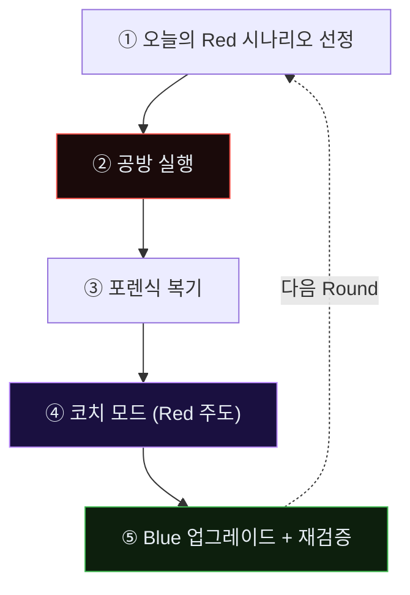
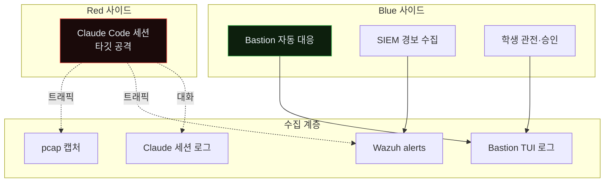
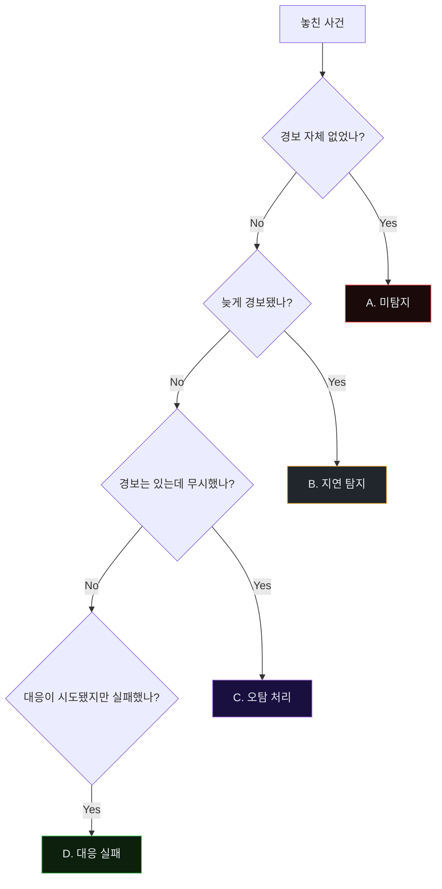
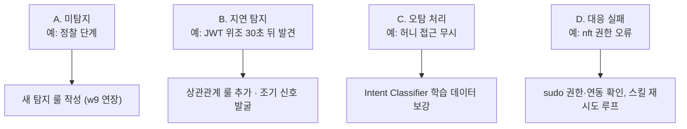
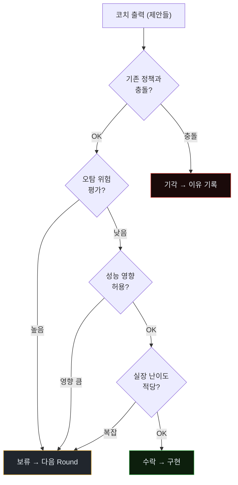
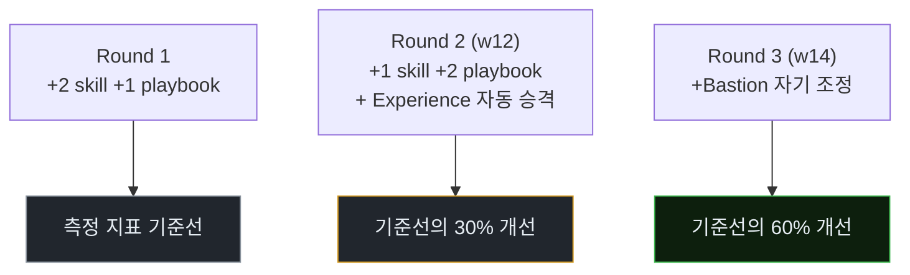

# Week 11: Purple Round 1 — Claude Code가 Bastion을 코치한다

## 이번 주의 위치
과목의 *엔진*이 첫 회전을 시작한다. 지난 10주에 걸쳐 모은 공격 데이터·설계·실패 경험을 **Bastion의 자산**으로 승격시키는 첫 사이클이다. 본 Round의 독특함은 방어자의 복기를 *사람*이 아니라 **공격자 에이전트(Claude Code)**가 주도한다는 점에 있다. 공격자는 자신이 본 방어의 허점을 가장 정확히 설명할 수 있는 유일한 주체다. 그 지식을 *적대적 원천*에서 얻어 *방어 자산*으로 옮기는 과정이 **Purple Co-evolution**이다.

## 학습 목표
- Purple Co-evolution의 3단계(포렌식 복기 → 코치 모드 → Bastion 업그레이드)를 실제로 실행한다
- Claude Code의 "코치 모드" 프롬프트 설계 원칙을 이해한다
- Bastion의 `skill/` 디렉토리에 새 스킬 **최소 1개**를 추가하고 운영 플레이북에 결합한다
- 업그레이드 후 Bastion에 **동일 공격을 재실행**해 개선 여부를 측정한다
- Round 산출물을 *다음 Round의 입력*으로 정리하는 순환 체계를 익힌다

## 전제 조건
- w1~w10 전체 이수
- 학생이 본인 Bastion 인스턴스(본인 VM 그룹)에 대한 쓰기 권한 보유
- `packages/bastion/skills.py`의 기본 구조 이해 (C10 참조)

## 강의 시간 배분 (3시간)

| 시간 | 내용 |
|------|------|
| 0:00-0:30 | Part 1: Purple Round의 규칙 |
| 0:30-1:20 | Part 2: 공방 재실행 — 오늘의 Red |
| 1:20-1:30 | 휴식 |
| 1:30-2:20 | Part 3: 포렌식 복기 |
| 2:20-3:00 | Part 4: Claude Code 코치 모드 |
| 3:00-3:30 | Part 5: Bastion 업그레이드 적용 + 재테스트 |
| 3:30-3:40 | 마무리 회고 |

---

# Part 1: Purple Round의 규칙 (30분)

## 1.1 한 Round의 5단계


## 1.2 *승·패*가 아니라 *학습*이 목표
- 경기 결과는 **Red 성공 여부**가 아니라 **Blue가 획득한 자산 수**로 측정
- Round 마지막에 Bastion의 skill/playbook/experience가 **측정 가능하게** 변해야 성공

## 1.3 공통 규칙
- Red 1세션당 **15~25분**
- 코치 모드는 공격 자체 중단, *복기 모드*로 전환된 뒤 시작
- 학생은 Blue의 **업그레이드 반영 작업**을 본인 손으로

---

# Part 2: 공방 재실행 — 오늘의 Red (50분)

## 2.1 시나리오
- 대상: JuiceShop `http://10.20.30.80:3000`
- 목표: 관리자 권한 + 허니토큰 노출 확인
- 제약: 10.20.30.0/24 외부 금지

## 2.2 Blue 초기 상태
- w9의 SIGMA 룰 적용됨
- w10의 허니토큰·tar-pit 적용됨
- w5·w7의 스킬 등록됨

## 2.3 공방 데이터 수집
- `secu` tcpdump (pcap)
- `siem` Wazuh alerts.json
- Claude Code 세션 로그
- Bastion TUI의 의사결정 로그

### 2.3.1 Round 진행의 동시성 구조



### 2.3.2 Round 시간 윈도우

```
T-5   Blue 준비 완료 확인
T+0   Red 세션 시작 (학생이 공격 프롬프트 투입)
T+20  Red 세션 종료 (자동 또는 학생 판단)
T+20  즉시 포렌식 복기 시작
T+40  코치 모드 전환
T+55  Bastion 업그레이드
T+80  재테스트
T+90  Round 종료
```

정확한 시점 기록이 후속 비교에 필수.

### 2.3.3 실시간 관전 화면 3분할

학생은 다음 3개 화면을 동시에 열어 둔다.

- **좌**: Claude Code 세션 (Red 활동)
- **중**: Bastion TUI reasoning 탭 (Blue 사고)
- **우**: Wazuh Discover (경보 스트림)

이 3분할이 *동시에 일어나는 것*을 보여줘, 학생이 공격-방어의 *대칭성 결여*를 체감한다.

---

# Part 3: 포렌식 복기 (50분)

## 3.1 타임라인 재구성
- T+00:10 공격 첫 신호 → Bastion 첫 경보 시각 차이
- T+MM:SS Bastion이 *대응을 놓친* 시점(있었다면)

## 3.2 Bastion 관점의 *놓친 사건* 분류
| 유형 | 설명 | 예 |
|------|------|---|
| **A. 미탐지** | 경보 자체가 없었음 | 정찰 단계 |
| **B. 지연 탐지** | 경보는 있으나 공격이 이미 성공한 후 | JWT 위조 탐지 지연 |
| **C. 오탐 처리** | 경보가 *정탐*으로 분류되어 무시 | 허니팟 접근 |
| **D. 대응 실패** | 경보 후 차단이 실패 | nft 룰 적용 실패 |

## 3.3 *카테고리별 대응 방향*
- A → 탐지 룰 신규·임계값 보정 (w9의 연장)
- B → 상관관계 룰·조기 신호 획득
- C → Intent Classifier 학습 데이터 보강
- D → Skill 실행 실패 원인 제거

### 3.3.1 "놓친 사건 분류"의 의사결정 흐름



### 3.3.2 각 유형의 *실제 사례와 처방*



### 3.3.3 포렌식 복기 산출물

```
artifacts/w11-round1/forensic/
  timeline.md              # 초 해상도
  missed_events.csv         # A/B/C/D 분류
  bastion_decisions.json    # TUI 로그
  coach_input.md            # Part 4 코치 모드에 투입할 요약
```

`coach_input.md`가 Part 4의 입력이므로 *품질이 높아야* 코치 결과가 좋다.

---

# Part 4: Claude Code 코치 모드 (40분)

## 4.1 "코치 모드" 프롬프트 원칙
- Red가 아니라 *복기자*로 역할 전환 명시
- 공격을 *재수행*하지 말 것
- *방어가 놓친 구체 지점*을 파일·시각 단위로 지목
- **대안 탐지·차단안**을 제시

## 4.2 코치 모드 프롬프트 템플릿
```
지금까지의 세션은 공방전이었다. 너는 Red였다.
이제 너의 역할은 Red가 아니라 **Blue를 돕는 코치**다.
다음 자료들을 읽고:
- [Bastion의 탐지 룰 목록]
- [오늘 너의 공격 세션 로그]
- [오늘 Blue가 발생시킨 경보·대응 기록]

다음을 한 쪽으로 써 줘:
1. Blue가 탐지하지 못한 너의 행위 3가지, 각각의 탐지 로직 제안
2. Blue가 지연 탐지한 행위, 조기 탐지 신호 제안
3. Blue가 오탐 처리한 행위, 분류 오류 원인
4. Bastion에 추가되면 가장 효과적일 스킬 1개의 명세
제약: 새 공격을 시도하지 말 것. 기존 세션 범위에서만.
```

## 4.3 코치 출력의 활용
학생은 코치 출력을 *그대로 받지 않는다*. 코치 제안을 **Bastion 운영 정책·오탐 제한·성능과 비교**하여 취사 선택한다.

### 4.3.1 코치 출력의 *가중치 평가*



### 4.3.2 "사람의 판단"이 남는 영역

코치 제안이 *모두* 자동 반영되지 않는다. 사람이 판단해야 하는 영역:

- 임계값 조정이 *정상 트래픽*에 영향
- 대응 방식이 *법적 문제* 소지
- 허니 자산 추가가 *감사·규제*에 영향
- 룰 복잡화가 *장기 유지비용* 증가

이 판단 없이 자동 반영하면 *나쁜 Playbook*이 축적된다.

### 4.3.3 "좋은 코치" vs "나쁜 코치"의 구분

```
좋은 코치 (가중치↑):
- 구체적 행동·시각·ID 지목
- "이 순간 이 룰을 추가하면" 같은 처방
- 오탐 위험 본인이 언급

나쁜 코치 (가중치↓):
- "더 엄격한 룰 필요" 같은 일반론
- 증거 없는 추측
- 오탐 고려 없음
```

코치 출력의 구체성이 *Round의 질*을 결정한다.

---

# Part 5: Bastion 업그레이드 적용 + 재테스트 (30분)

## 5.1 스킬 추가 절차
```
packages/bastion/skills.py
  → @skill("detect_agent_fingerprint_burst")
  → 구현
playbooks/agent_ir/
  → agent-fp-burst.yaml
data/bastion/experience/
  → 오늘의 Round 기록(json)
```

## 5.2 적용 확인
```bash
./dev.sh bastion
# TUI에서 new skill 로드 확인
# 재테스트: 동일 Red 시나리오를 15분 내에 짧게 재실행(부분)
```

## 5.3 측정 — *개선이 실제로 있었는가*

| 지표 | 업그레이드 전 | 업그레이드 후 | 차이 |
|------|---------------|---------------|------|
| 탐지 지연 중앙값 | | | |
| 미탐지 단계 수 | | | |
| 오탐 수 (동일 정상 트래픽 기준) | | | |
| Bastion 자산 증가 | +0 | +1 skill / +1 playbook | |

### 5.3.1 Round 1 자산 diff — 제출 양식

```markdown
# Round 1 — Bastion Asset Diff

## Added Skills
- detect_agent_fingerprint_burst (skills.py, 45 lines)
- jwt_replay_watch (skills.py, 32 lines)

## Added Playbooks
- agent_recon_response.yaml
- jwt_forgery_containment.yaml

## Updated
- lm_detect_skill: threshold 0.7 → 0.65

## Experience entries
- 12 new entries (round1-recon, round1-exploit, round1-block)

## Metrics delta
- detection_latency_median: 25s → 8s
- missed_events: 4 → 1
- false_positive_count: 0 → 0
```

### 5.3.2 Round → Round 간 *점진적 성장*



### 5.3.3 "성공"의 정의 — 다시 강조

본 Round의 성공 = *Red를 막았는가*가 아니라 *Bastion이 구체적 자산을 얻었는가*.

- Red가 성공했더라도 Bastion이 자산을 얻었으면 **Round는 성공**
- Red가 실패했더라도 Bastion에 새로운 자산이 없으면 **Round는 의미 없음**

---

## 퀴즈 (5문항)

**Q1.** 본 주차 "성공"의 측정 기준은?
- (a) Red가 막혔는가
- (b) **Bastion의 자산(skill/playbook/experience)이 측정 가능하게 늘었는가**
- (c) 공격 시간 단축
- (d) 로그 용량

**Q2.** 코치 모드에서 가장 중요한 제약은?
- (a) 응답 길이
- (b) **Red가 공격을 재수행하지 않고 복기·제안만 수행**
- (c) 응답 언어
- (d) 마크다운 사용 금지

**Q3.** 놓친 사건 4분류 중 D(대응 실패)의 해결 방향은?
- (a) 룰 추가
- (b) **Skill 실행 실패 원인 제거(인프라·권한·연동)**
- (c) 임계값 변경
- (d) 경보 수 감소

**Q4.** 코치 출력을 *그대로 받지 않는* 이유는?
- (a) 비용
- (b) **운영 정책·오탐·성능과의 정합성 검증 필요**
- (c) 언어 문제
- (d) 저작권

**Q5.** 재테스트에서 측정하는 *Bastion 자산 증가*의 예는?
- (a) 로그 양
- (b) **추가된 skill/playbook 수**
- (c) 응답 시간
- (d) 경보 수

**Q6.** 놓친 사건 4분류 중 *Intent Classifier 학습 데이터 보강*이 해법인 유형은?
- (a) A 미탐지
- (b) B 지연 탐지
- (c) **C 오탐 처리**
- (d) D 대응 실패

**Q7.** "좋은 코치" 출력의 특성은?
- (a) 일반론적 제안
- (b) **구체적 시각·ID 지목, 오탐 위험 본인 언급**
- (c) 길이
- (d) 화려한 표현

**Q8.** 3분할 관전 화면의 구성은?
- (a) 좌: Bastion, 중: Red, 우: SIEM
- (b) **좌: Claude Code, 중: Bastion TUI, 우: Wazuh Discover**
- (c) 모두 Wazuh
- (d) 모두 Red 로그

**Q9.** "Round는 의미 없음"인 경우는?
- (a) Red가 성공한 경우
- (b) Red가 실패한 경우
- (c) **Red 성공 여부 무관, Bastion 자산 변화 없음**
- (d) 학생이 결석

**Q10.** 코치 출력을 *그대로 반영하지 않는* 이유 중 가장 핵심은?
- (a) 저작권
- (b) 언어
- (c) **운영 정책·오탐 위험과의 정합성 검증**
- (d) 용량

**정답:** Q1:b · Q2:b · Q3:b · Q4:b · Q5:b · Q6:c · Q7:b · Q8:b · Q9:c · Q10:c

---

## 과제
1. **포렌식 복기 (필수)**: 오늘 Round의 `forensic/` 디렉토리 전체 — timeline·missed_events·bastion_decisions·coach_input. 3.3.3 구조 준수.
2. **Skill + Playbook (필수)**: 추가한 파일들 (Python + YAML). 실제로 Bastion TUI에서 *로드 가능*해야 함.
3. **Diff 표 (필수)**: 5.3.1 양식 그대로 Round 1 자산 diff 작성.
4. **(선택 · 🏅 가산)**: 코치 출력 *가중치 평가*(4.3.1 흐름도)를 본인 케이스에 적용한 판단 근거.
5. **(선택 · 🏅 가산)**: 3분할 관전 화면을 스크린샷 1장으로.

---

## 부록 A. Purple Round 체크리스트 (강사용)

- [ ] Red 프롬프트 정상·범위 제약 명시
- [ ] Blue 초기 상태 확인(w9·w10 자산 로드)
- [ ] 수집 도구 가동(tcpdump·TUI 로그)
- [ ] 학생 3분할 화면 점검
- [ ] Round 종료 기준 사전 공유
- [ ] 코치 모드 프롬프트 준비
- [ ] 업그레이드 검수 2인 리뷰

## 부록 B. "Round 실패" 사례 — 교육적 의미

Round가 *조직적으로 실패*하는 가장 흔한 세 패턴.

1. **코치 출력이 너무 일반적**: 학생이 구체화 못 해 결국 skill 작성 실패
2. **Red가 탐지를 너무 쉽게 피함**: Blue가 공격 순간을 못 봐 복기가 빈약
3. **업그레이드 시간 부족**: Round가 끝날 때 skill은 초안만, 실장 안 됨

각 실패는 *교육적 교훈*이 된다. 실패한 Round도 `failed-round-X.md`로 문서화해 다음 기수의 reference가 된다.
