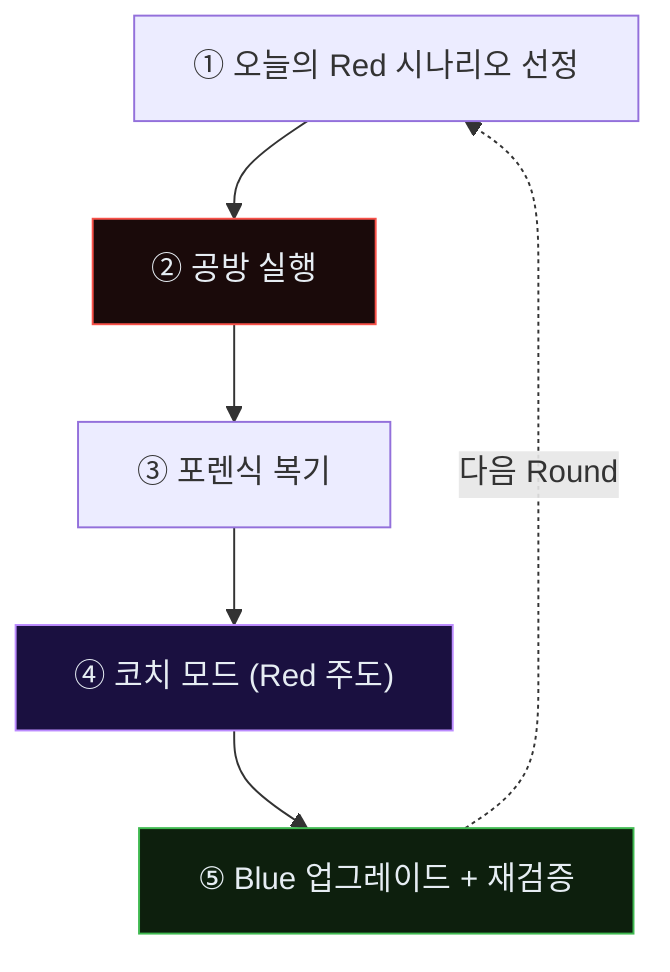

# Week 11: Purple Round 1 — Claude Code가 Bastion을 코치한다

## 이번 주의 위치
과목의 *엔진*이 첫 회전을 시작한다. 지난 10주에 걸쳐 모은 공격 데이터·설계·실패 경험을 **Bastion의 자산**으로 승격시키는 첫 사이클이다. 본 Round의 독특함은 방어자의 복기를 *사람*이 아니라 **공격자 에이전트(Claude Code)**가 주도한다는 점에 있다. 공격자는 자신이 본 방어의 허점을 가장 정확히 설명할 수 있는 유일한 주체다. 그 지식을 *적대적 원천*에서 얻어 *방어 자산*으로 옮기는 과정이 **Purple Co-evolution**이다.

## 학습 목표
- Purple Co-evolution의 3단계(포렌식 복기 → 코치 모드 → Bastion 업그레이드)를 실제로 실행한다
- Claude Code의 "코치 모드" 프롬프트 설계 원칙을 이해한다
- Bastion의 `skill/` 디렉토리에 새 스킬 **최소 1개**를 추가하고 운영 플레이북에 결합한다
- 업그레이드 후 Bastion에 **동일 공격을 재실행**해 개선 여부를 측정한다
- Round 산출물을 *다음 Round의 입력*으로 정리하는 순환 체계를 익힌다

## 전제 조건
- w1~w10 전체 이수
- 학생이 본인 Bastion 인스턴스(본인 VM 그룹)에 대한 쓰기 권한 보유
- `packages/bastion/skills.py`의 기본 구조 이해 (C10 참조)

## 강의 시간 배분 (3시간)

| 시간 | 내용 |
|------|------|
| 0:00-0:30 | Part 1: Purple Round의 규칙 |
| 0:30-1:20 | Part 2: 공방 재실행 — 오늘의 Red |
| 1:20-1:30 | 휴식 |
| 1:30-2:20 | Part 3: 포렌식 복기 |
| 2:20-3:00 | Part 4: Claude Code 코치 모드 |
| 3:00-3:30 | Part 5: Bastion 업그레이드 적용 + 재테스트 |
| 3:30-3:40 | 마무리 회고 |

---

# Part 1: Purple Round의 규칙 (30분)

## 1.1 한 Round의 5단계


## 1.2 *승·패*가 아니라 *학습*이 목표
- 경기 결과는 **Red 성공 여부**가 아니라 **Blue가 획득한 자산 수**로 측정
- Round 마지막에 Bastion의 skill/playbook/experience가 **측정 가능하게** 변해야 성공

## 1.3 공통 규칙
- Red 1세션당 **15~25분**
- 코치 모드는 공격 자체 중단, *복기 모드*로 전환된 뒤 시작
- 학생은 Blue의 **업그레이드 반영 작업**을 본인 손으로

---

# Part 2: 공방 재실행 — 오늘의 Red (50분)

## 2.1 시나리오
- 대상: JuiceShop `http://10.20.30.80:3000`
- 목표: 관리자 권한 + 허니토큰 노출 확인
- 제약: 10.20.30.0/24 외부 금지

## 2.2 Blue 초기 상태
- w9의 SIGMA 룰 적용됨
- w10의 허니토큰·tar-pit 적용됨
- w5·w7의 스킬 등록됨

## 2.3 공방 데이터 수집
- `secu` tcpdump (pcap)
- `siem` Wazuh alerts.json
- Claude Code 세션 로그
- Bastion TUI의 의사결정 로그

---

# Part 3: 포렌식 복기 (50분)

## 3.1 타임라인 재구성
- T+00:10 공격 첫 신호 → Bastion 첫 경보 시각 차이
- T+MM:SS Bastion이 *대응을 놓친* 시점(있었다면)

## 3.2 Bastion 관점의 *놓친 사건* 분류
| 유형 | 설명 | 예 |
|------|------|---|
| **A. 미탐지** | 경보 자체가 없었음 | 정찰 단계 |
| **B. 지연 탐지** | 경보는 있으나 공격이 이미 성공한 후 | JWT 위조 탐지 지연 |
| **C. 오탐 처리** | 경보가 *정탐*으로 분류되어 무시 | 허니팟 접근 |
| **D. 대응 실패** | 경보 후 차단이 실패 | nft 룰 적용 실패 |

## 3.3 *카테고리별 대응 방향*
- A → 탐지 룰 신규·임계값 보정 (w9의 연장)
- B → 상관관계 룰·조기 신호 획득
- C → Intent Classifier 학습 데이터 보강
- D → Skill 실행 실패 원인 제거

---

# Part 4: Claude Code 코치 모드 (40분)

## 4.1 "코치 모드" 프롬프트 원칙
- Red가 아니라 *복기자*로 역할 전환 명시
- 공격을 *재수행*하지 말 것
- *방어가 놓친 구체 지점*을 파일·시각 단위로 지목
- **대안 탐지·차단안**을 제시

## 4.2 코치 모드 프롬프트 템플릿
```
지금까지의 세션은 공방전이었다. 너는 Red였다.
이제 너의 역할은 Red가 아니라 **Blue를 돕는 코치**다.
다음 자료들을 읽고:
- [Bastion의 탐지 룰 목록]
- [오늘 너의 공격 세션 로그]
- [오늘 Blue가 발생시킨 경보·대응 기록]

다음을 한 쪽으로 써 줘:
1. Blue가 탐지하지 못한 너의 행위 3가지, 각각의 탐지 로직 제안
2. Blue가 지연 탐지한 행위, 조기 탐지 신호 제안
3. Blue가 오탐 처리한 행위, 분류 오류 원인
4. Bastion에 추가되면 가장 효과적일 스킬 1개의 명세
제약: 새 공격을 시도하지 말 것. 기존 세션 범위에서만.
```

## 4.3 코치 출력의 활용
학생은 코치 출력을 *그대로 받지 않는다*. 코치 제안을 **Bastion 운영 정책·오탐 제한·성능과 비교**하여 취사 선택한다.

---

# Part 5: Bastion 업그레이드 적용 + 재테스트 (30분)

## 5.1 스킬 추가 절차
```
packages/bastion/skills.py
  → @skill("detect_agent_fingerprint_burst")
  → 구현
playbooks/agent_ir/
  → agent-fp-burst.yaml
data/bastion/experience/
  → 오늘의 Round 기록(json)
```

## 5.2 적용 확인
```bash
./dev.sh bastion
# TUI에서 new skill 로드 확인
# 재테스트: 동일 Red 시나리오를 15분 내에 짧게 재실행(부분)
```

## 5.3 측정 — *개선이 실제로 있었는가*

| 지표 | 업그레이드 전 | 업그레이드 후 | 차이 |
|------|---------------|---------------|------|
| 탐지 지연 중앙값 | | | |
| 미탐지 단계 수 | | | |
| 오탐 수 (동일 정상 트래픽 기준) | | | |
| Bastion 자산 증가 | +0 | +1 skill / +1 playbook | |

---

## 퀴즈 (5문항)

**Q1.** 본 주차 "성공"의 측정 기준은?
- (a) Red가 막혔는가
- (b) **Bastion의 자산(skill/playbook/experience)이 측정 가능하게 늘었는가**
- (c) 공격 시간 단축
- (d) 로그 용량

**Q2.** 코치 모드에서 가장 중요한 제약은?
- (a) 응답 길이
- (b) **Red가 공격을 재수행하지 않고 복기·제안만 수행**
- (c) 응답 언어
- (d) 마크다운 사용 금지

**Q3.** 놓친 사건 4분류 중 D(대응 실패)의 해결 방향은?
- (a) 룰 추가
- (b) **Skill 실행 실패 원인 제거(인프라·권한·연동)**
- (c) 임계값 변경
- (d) 경보 수 감소

**Q4.** 코치 출력을 *그대로 받지 않는* 이유는?
- (a) 비용
- (b) **운영 정책·오탐·성능과의 정합성 검증 필요**
- (c) 언어 문제
- (d) 저작권

**Q5.** 재테스트에서 측정하는 *Bastion 자산 증가*의 예는?
- (a) 로그 양
- (b) **추가된 skill/playbook 수**
- (c) 응답 시간
- (d) 경보 수**정답:** Q1:b, Q2:b, Q3:b, Q4:b, Q5:b

---

## 과제
1. 오늘 Round의 포렌식 복기 문서(.md).
2. 추가한 skill 파일과 playbook 파일 (코드 + YAML).
3. 업그레이드 전/후 지표 비교 표. w12의 입력으로 사용.
