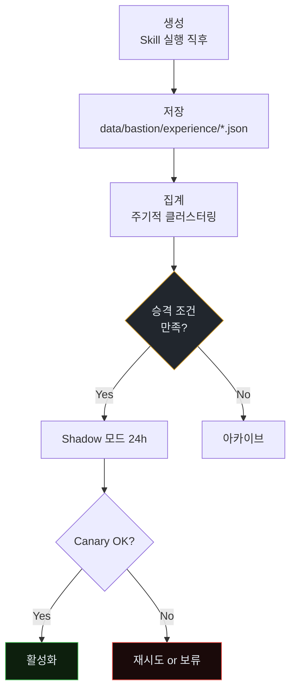
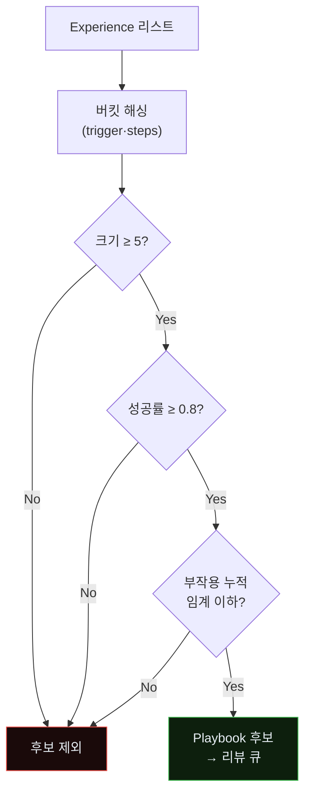
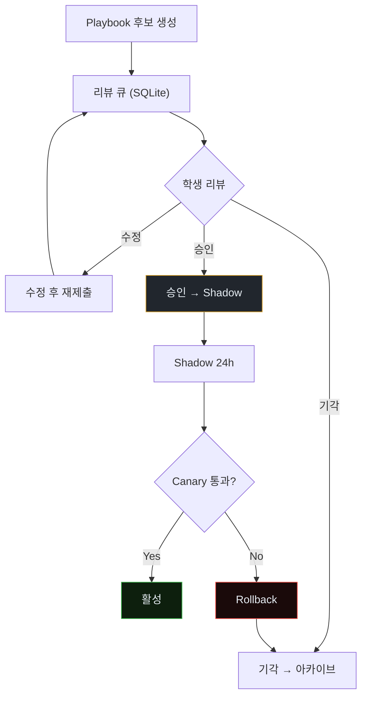
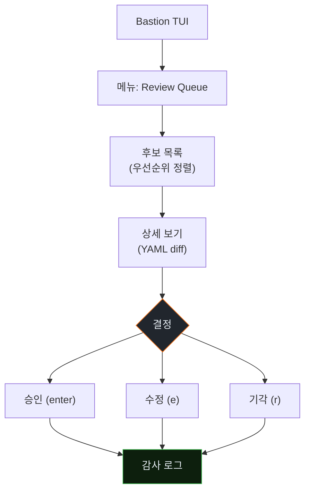
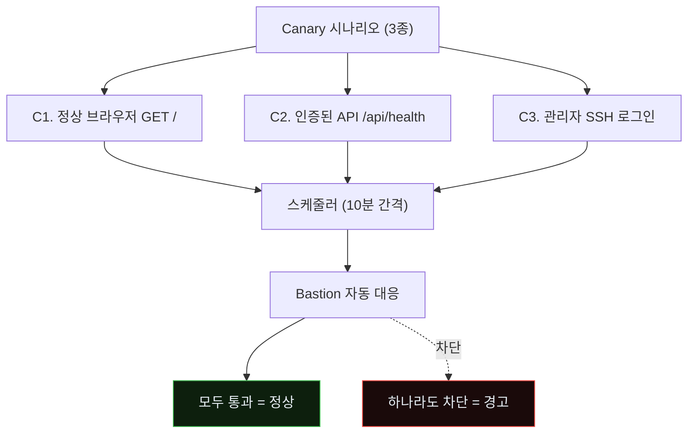
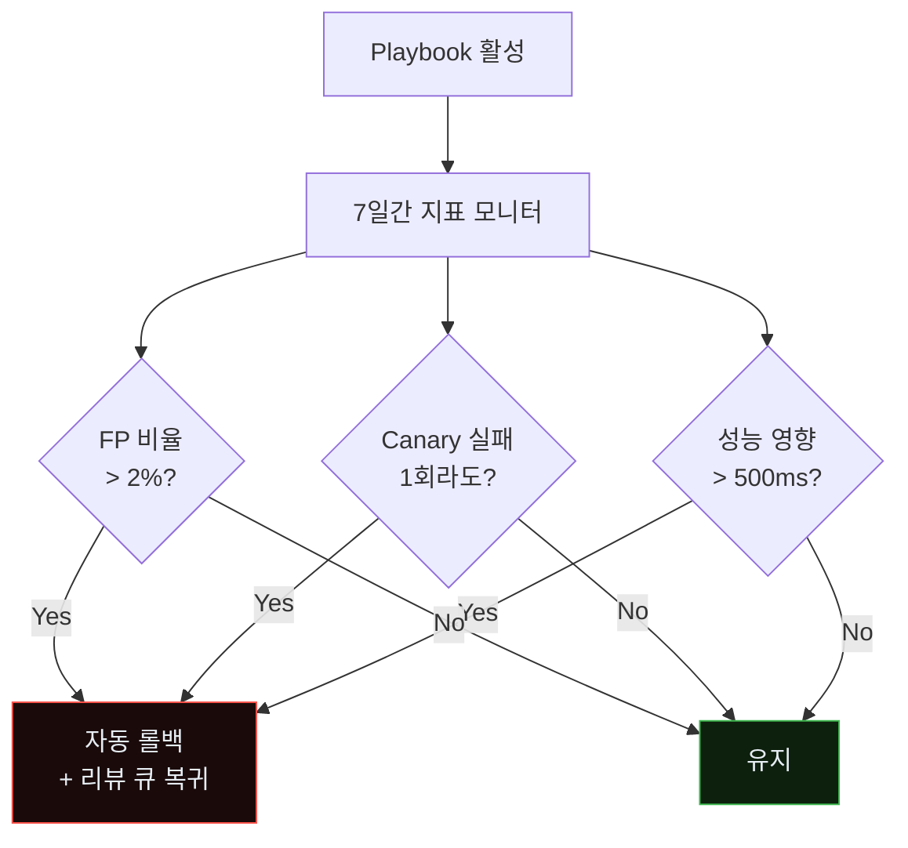
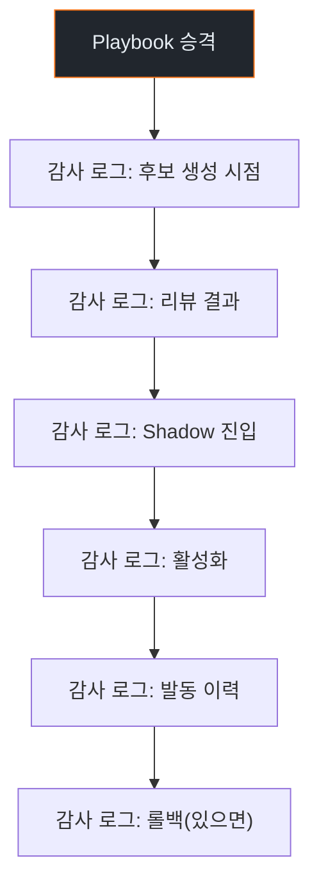

# Week 12: Purple Round 2 — Experience → Playbook 자동 승격

## 이번 주의 위치
w11에서 *한 사람·한 Round*로 Bastion을 업그레이드하는 법을 익혔다. 그러나 실세계 방어는 *수많은 사건·수많은 실패*에 대해 **자동화된 학습 루프**가 필요하다. 이번 주는 Bastion의 *3층 성장 구조*에서 가장 중요한 전환 — **Experience(경험) 로그가 반복 발생할 때 Playbook(플레이북)으로 자동 승격** — 을 실제 구현·관찰한다. 이 자동 승격이 L4 Co-evolver의 운영적 핵심이다.

## 학습 목표
- Bastion의 3층 구조(Skill / Playbook / Experience)의 상호작용을 설명한다
- 반복 패턴 검출 알고리즘을 설계해 Experience 로그에서 후보를 추출한다
- 후보를 *승격 전 검증* 단계를 거쳐 Playbook으로 등록하는 절차를 구현한다
- 잘못된 승격(잘못된 패턴의 자동화)을 예방하는 인간 검수·롤백 체계를 설계한다
- 본 주차 자동 승격 결과를 w13 사고 보고서와 w14 종합 시뮬레이션 재료로 남긴다

## 전제 조건
- w11 Round 1 완료 + Experience 로그 축적
- `data/bastion/experience/` 파일 구조 이해
- Python으로 간단한 클러스터링·빈도 분석 가능

## 강의 시간 배분 (3시간)

| 시간 | 내용 |
|------|------|
| 0:00-0:30 | Part 1: Experience의 정의와 형태 |
| 0:30-1:00 | Part 2: 반복 패턴 검출 알고리즘 |
| 1:00-1:10 | 휴식 |
| 1:10-2:00 | Part 3: 승격 파이프라인 구현 |
| 2:00-2:40 | Part 4: 잘못된 승격 방지 |
| 2:40-2:50 | 휴식 |
| 2:50-3:20 | Part 5: Round 2 실행 & 재측정 |
| 3:20-3:40 | 퀴즈 + 과제 |

---

# Part 1: Experience의 정의와 형태 (30분)

## 1.1 Experience 엔트리 예
```json
{
  "id": "exp_2026-04-18T21:10_001",
  "trigger": {
    "event_type": "wazuh_alert",
    "rule_id": 100200,
    "src_ip": "10.20.30.50"
  },
  "action": {
    "skill": "detect_agent_fingerprint_burst",
    "steps": ["tar_pit_inject(10s)", "nft_block_24h"]
  },
  "outcome": "success",
  "elapsed_s": 3.2,
  "notes": "..."
}
```

## 1.2 Experience의 3가지 유형
- **success** — 의도한 결과
- **partial** — 일부 단계만 성공 (qa_fallback과 유사)
- **fail** — 실행 자체 실패 또는 오탐 확인

## 1.3 Experience → Playbook으로 승격되려면
- 최근 N일 내 유사 Experience **k회 이상**
- 성공률 **≥ 임계(예 0.8)**
- 부작용(오탐·성능) 누적 **≤ 임계**

### 1.3.1 Experience의 "수명 주기"



### 1.3.2 Experience 3유형의 상호 의미

| 유형 | 해석 | 다음 Round 영향 |
|------|------|-----------------|
| success | 의도 달성 | 클러스터 승격 유력 |
| partial | 일부 단계만 | 2~3회 더 관찰 후 판단 |
| fail | 실행 실패·오탐 | 스킬 디버깅·화이트리스트 검토 |

### 1.3.3 *나쁜 Experience*가 누적될 때의 위험

잘못된 라벨링이 쌓이면 *나쁜 Playbook*이 자동 승격된다. 예: 내부 테스트 트래픽을 반복 *공격*으로 태그 → 내부 IP 차단 Playbook 자동 승격 → 운영 장애.

방지책은 4장의 *Canary + Shadow + 화이트리스트 + 인간 승인* 4층 장치.

---

# Part 2: 반복 패턴 검출 알고리즘 (30분)

## 2.1 유사도 정의
- `trigger` 필드 유사도: 동일 rule_id + 유사 src_cluster
- `action.steps` 유사도: 동일 skill + 단계 Jaccard 유사도 > 0.7

## 2.2 클러스터링
```python
def cluster_experiences(exps, min_k=5):
    # 간단 해시 기반 버킷
    buckets = {}
    for e in exps:
        key = (e["trigger"]["rule_id"], tuple(sorted(e["action"]["steps"])))
        buckets.setdefault(key, []).append(e)
    return [v for v in buckets.values() if len(v) >= min_k]
```

## 2.3 승격 점수
```python
def promotion_score(cluster):
    succ = sum(1 for e in cluster if e["outcome"] == "success")
    total = len(cluster)
    return succ / total
```

## 2.4 결정 규칙
- `promotion_score ≥ 0.8` && `len(cluster) ≥ 5` → Playbook 후보

### 2.4.1 승격 결정 플로우



### 2.4.2 "부작용 누적 임계" 계산법

```python
def side_effect_score(cluster):
    # 오탐 = outcome 'fail' 중 false_positive 표기
    fp = sum(1 for e in cluster if e.get("fp_flag"))
    # 성능 영향 = elapsed > 10s 건수
    slow = sum(1 for e in cluster if e.get("elapsed_s", 0) > 10)
    # 정상 트래픽 영향 = canary_hit 이벤트
    canary = sum(1 for e in cluster if e.get("hit_canary"))
    total = len(cluster)
    return (fp * 3 + slow + canary * 5) / total
```

임계: `side_effect_score < 0.3`이면 *부작용 누적 OK*.

### 2.4.3 실제 Experience 데이터에 적용

본인의 w11 Round 1 Experience들을 불러와 위 함수를 *실제로* 돌려 본다. 클러스터가 1개도 승격 기준 미달이면 *정상*이다 — Round 1만으로는 데이터가 충분치 않다. Round 2(이번 주)의 목적이 이를 충분화하는 것.

---

# Part 3: 승격 파이프라인 구현 (50분)

## 3.1 구조
```
scripts/bastion_promote.py
  ├── load_experiences()
  ├── cluster_experiences()
  ├── score_clusters()
  ├── draft_playbook(cluster)  # YAML 초안 생성
  └── queue_for_review(playbook_draft)
```

## 3.2 YAML 드래프트 예
```yaml
playbook_id: pb-agent-fp-burst
source_experiences: 7
avg_success: 0.86
triggers:
  wazuh_rule_id: 100200
  src_cluster_size: ">=3"
steps:
  - skill: detect_agent_fingerprint_burst
    args: {window: 180}
  - skill: tar_pit_inject
    args: {duration_s: 10}
  - skill: nft_block
    args: {ttl: 86400}
verify:
  - alert_count_after_5m: "<=1"
rollback:
  - unblock_nft
```

## 3.3 검수 큐
- 승격 후보는 즉시 활성 아님 — **리뷰 큐**에 적재
- 학생(관리자)이 TUI에서 *승인*하면 활성화

### 3.3.1 리뷰 큐의 구조



### 3.3.2 리뷰 체크리스트

학생이 Playbook 후보를 리뷰할 때 확인.

- [ ] `source_experiences` ≥ 5
- [ ] `avg_success` ≥ 0.8
- [ ] `rollback` 단계 존재
- [ ] `verify` 단계 존재
- [ ] `triggers` 명확, 오남용 가능성 검토
- [ ] `steps`가 기존 Skill들만 사용
- [ ] `exceptions`(화이트리스트) 반영
- [ ] `human_approval_required` 필요성 평가

### 3.3.3 TUI 리뷰 인터페이스 구조



---

# Part 4: 잘못된 승격 방지 (40분)

## 4.1 실패 시나리오 예
- 오탐이 반복되는 케이스를 "성공"으로 오기록 → 정상 사용자 차단 자동화
- 특정 내부 테스트 트래픽을 공격으로 분류한 Experience 축적

## 4.2 방지 장치
- **Canary 트래픽**: 정상 패턴을 주기적으로 흘려 *자동 차단되지 않는지* 검증
- **Shadow mode**: 승격 후보 Playbook을 처음 24시간은 *로그만*
- **화이트리스트 우회**: 특정 소스·패턴은 자동 승격에서 제외
- **인간 승인 의무**: 영향 범위가 *외부 통신 차단* 이상이면 승인 없이 활성화 금지

## 4.3 롤백
- 모든 Playbook에 `rollback` 단계 강제
- Playbook 활성화 후 7일 내 *부작용 지표*가 임계 초과하면 자동 롤백

### 4.3.1 Canary 트래픽의 설계

Canary는 정상 패턴을 *주기적*으로 흘려 자동 차단되지 않는지 검증한다.



### 4.3.2 Canary 실장 코드 예

```python
# scripts/canary.py
import requests, time, logging, sys

SCENARIOS = [
    {"name": "normal_get", "url": "http://10.20.30.80/",
     "headers": {"User-Agent": "Mozilla/5.0 ..."}},
    {"name": "api_health", "url": "http://10.20.30.80/api/health",
     "headers": {"Authorization": "Bearer ${CANARY_TOKEN}"}},
    # SSH scenario은 paramiko·fabric로 별도
]

def run_all():
    results = []
    for sc in SCENARIOS:
        try:
            r = requests.get(sc["url"], headers=sc["headers"], timeout=5)
            results.append((sc["name"], r.status_code, r.elapsed.total_seconds()))
        except Exception as e:
            results.append((sc["name"], "ERROR", str(e)))
    return results

if __name__ == "__main__":
    while True:
        for name, code, elapsed in run_all():
            logging.info(f"canary {name}: {code} {elapsed}s")
            if code != 200:
                # Slack/Wazuh 경보
                pass
        time.sleep(600)  # 10분
```

### 4.3.3 자동 롤백 로직



---

# Part 5: Round 2 실행 & 재측정 (30분)

## 5.1 시나리오
- 같은 JuiceShop 대상
- w11에서 추가한 스킬 + w12에서 승격된 Playbook 활성

## 5.2 측정
| 지표 | Round 1 | Round 2 | 차이 |
|------|---------|---------|------|
| 탐지 지연 중앙값 | | | |
| 미탐지 단계 수 | | | |
| 자동 대응 발동 수 | | | |
| 분석가 개입 필요 건수 | | | |

## 5.3 기록
- 측정 결과는 `docs/purple-round-2.md`로 저장
- 가장 큰 **개선**과 가장 큰 **남은 문제**를 각 1건 선정 → w13의 입력

---

## 퀴즈 (5문항)

**Q1.** Experience → Playbook 자동 승격의 **두 필수 조건**은?
- (a) 파일 크기 + 시간
- (b) **클러스터 크기(반복 횟수) + 성공률**
- (c) 네트워크 속도 + CPU
- (d) 운영자 숫자

**Q2.** Shadow mode의 목적은?
- (a) 성능 개선
- (b) **활성화 전 부작용 관측**
- (c) 로그 압축
- (d) 사용자 추적

**Q3.** 잘못된 승격으로 생길 수 있는 대표 위험은?
- (a) 응답 시간 증가
- (b) **정상 사용자 자동 차단**
- (c) 스토리지 부족
- (d) 네트워크 장애

**Q4.** 모든 Playbook에 `rollback`을 강제하는 이유는?
- (a) 표준 준수
- (b) **부작용 발견 시 자동 복구 가능해야 함**
- (c) 감사 대응
- (d) 테스트 편의

**Q5.** 본 주차 측정은 무엇의 *입력*으로 쓰이나?
- (a) w8 중간평가
- (b) **w13 사고 보고서 + w14 종합 시뮬레이션**
- (c) w11 Round 1
- (d) w15 기말만

**Q6.** "나쁜 Experience" 누적이 만드는 장애의 예는?
- (a) 디스크 꽉 참
- (b) **내부 테스트 IP를 공격으로 라벨 → 내부 차단 Playbook 자동 승격 → 운영 장애**
- (c) 네트워크 지연
- (d) UI 버그

**Q7.** 승격 후보 *4층 안전장치*에 해당하지 *않는* 것은?
- (a) Canary 트래픽
- (b) Shadow 모드
- (c) 화이트리스트
- (d) **성능 최적화**

**Q8.** 자동 롤백 트리거에 해당하지 *않는* 것은?
- (a) FP 비율 > 2%
- (b) Canary 실패
- (c) 성능 영향 > 500ms
- (d) **경보 수 증가**

**Q9.** Canary 시나리오의 *주기*로 권장되는 것은?
- (a) 1초
- (b) **10분**
- (c) 1일
- (d) 1주

**Q10.** `side_effect_score` 계산에서 가장 큰 가중치를 받는 신호는?
- (a) 오탐
- (b) 성능 저하
- (c) **Canary 히트**
- (d) 로그 용량

**정답:** Q1:b · Q2:b · Q3:b · Q4:b · Q5:b · Q6:b · Q7:d · Q8:d · Q9:b · Q10:c

---

## 과제
1. **클러스터링 결과 (필수)**: 본인 Experience 로그 대상 `bastion_promote.py` 실행 결과 요약(JSON) + 드래프트 Playbook YAML 1개.
2. **Canary 설계 (필수)**: 4.3.1 다이어그램 기반, 정상 패턴 3종 + 흘리는 주기 + 예상 경보 조건 명시 (1쪽).
3. **Round 2 측정 (필수)**: 5장의 지표 표를 Round 1 대비 비교. `docs/purple-round-2.md`.
4. **(선택 · 🏅 가산)**: TUI 리뷰 큐 동작 스크린샷 (승인·기각 각 1건 이상).
5. **(선택 · 🏅 가산)**: 자동 롤백 시뮬레이션 — 의도적 *오탐 폭증* 환경에서 자동 롤백이 발동하는지 검증.

---

## 부록 A. Playbook 승격 *감사 추적*



모든 단계가 *타임스탬프와 사용자 ID*로 기록. w13 보고서의 감사 섹션에 사용.

## 부록 B. *영구히 자동 승격하지 않을* Playbook

다음 경우는 *반드시* 사람 승인 필요:

- **외부 IP 차단** (정상 파트너 리스크)
- **인증 서비스 변경** (가용성 리스크)
- **정책 변경** (법적 리스크)
- **데이터 격리** (비즈니스 리스크)
- **서비스 재시작** (가용성)

Bastion이 이 목록을 내장하고, 해당 Playbook은 *Shadow만* 통과하고 *활성화에는 반드시 승인*.

---

## 실제 사례 (WitFoo Precinct 6)

> 출처: WitFoo Precinct 6 Cybersecurity Dataset (Apache 2.0)
> Sanitized — RFC5737 TEST-NET / ORG-NNNN / HOST-NNNN 으로 익명화됨.

### Case 1: `T1041` 패턴

```
src=100.64.4.210 dst=172.22.195.168 tech=T1041 mo_name=Data Theft
tactic=TA0010 (Exfiltration) suspicion=0.84
lifecycle=complete-mission
```

**해석**: 위 데이터는 실제 incident 의 sanitized 기록이다. `T1041` MITRE technique 의 행동 패턴이며, 본 강의의 학습 주제와 동일한 운영 맥락에서 발생한다.

### Case 2: `T1041` 패턴

```
src=172.22.36.156 dst=100.64.9.98 tech=T1041 mo_name=Data Theft
tactic=TA0010 (Exfiltration) suspicion=0.92
lifecycle=complete-mission
```

**해석**: 위 데이터는 실제 incident 의 sanitized 기록이다. `T1041` MITRE technique 의 행동 패턴이며, 본 강의의 학습 주제와 동일한 운영 맥락에서 발생한다.

