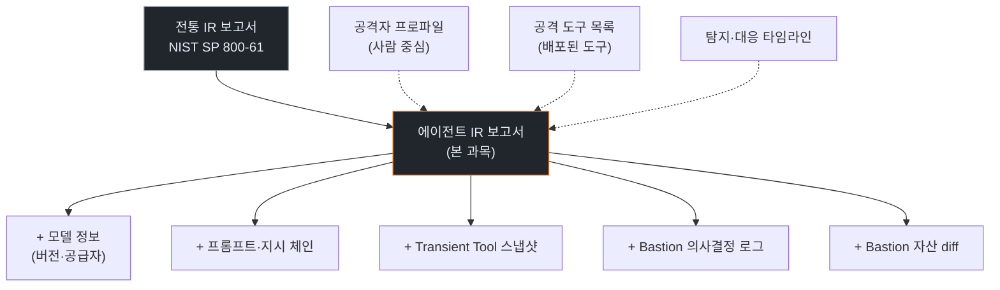
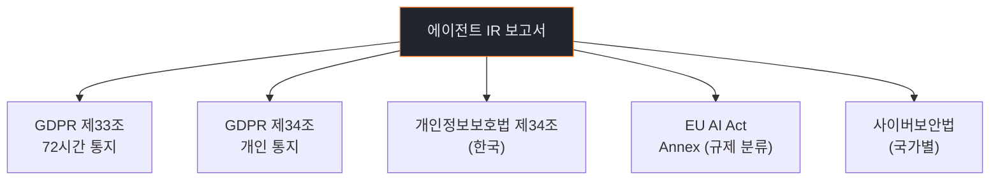
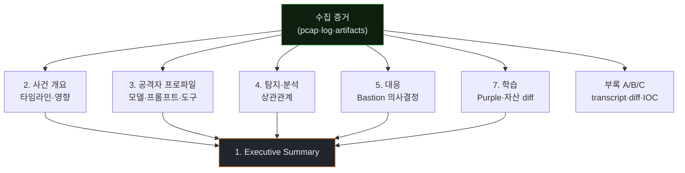
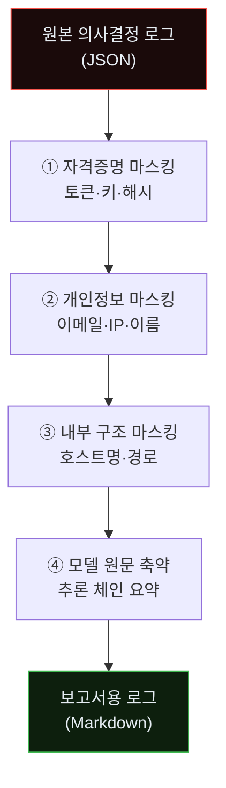
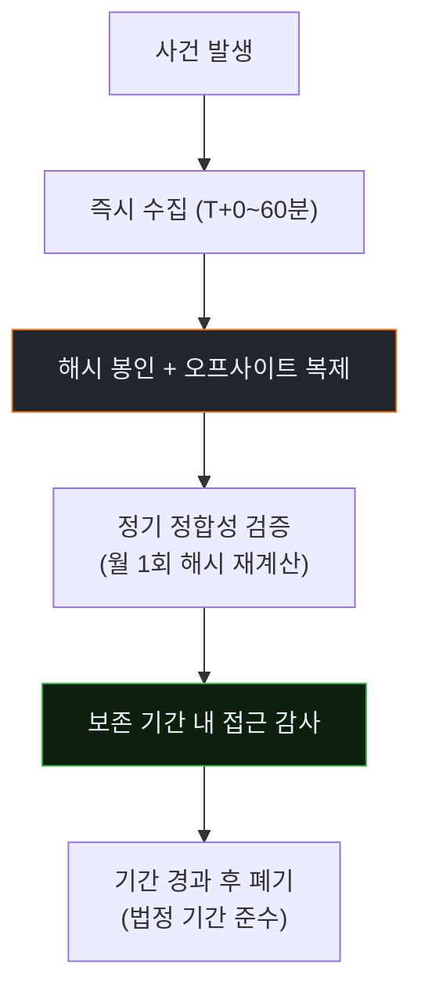
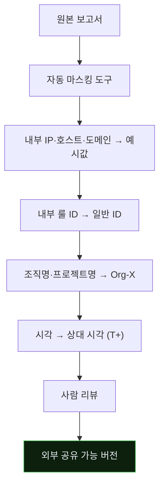

# Week 13: 에이전트 IR 사고 보고서 — 전례 없는 조각들을 기록하기

## 이번 주의 위치
Purple 루프가 두 Round 돌았다. 이제 남은 것은 *조직 밖*과 *나중*에 무엇을 기록으로 남길 것인가다. 에이전트 공격의 IR 보고서는 전통 IR 보고서와 구조가 다르다. **모델 버전·프롬프트·도구 목록·에이전트 의사결정 로그** 등 *전에 없던 필드*가 공적·법적 의미를 갖는다. 이번 주는 그 *전례 없는* 보고서의 서식과 근거를 만든다.

## 학습 목표
- 에이전트 IR 보고서에 포함되어야 할 **고유 섹션**을 식별한다 (모델 버전, 프롬프트 유래, 의사결정 로그, Bastion 자산 변화 등)
- 전통 IR 보고서(NIST SP 800-61)의 구조에서 *유지·변경·추가*를 구분한다
- 본인의 Round 1·2 결과로 실제 보고서 **초안**을 작성한다
- 법적·규제 관점에서 본 보고서가 갖는 위치(GDPR 제33조, 개인정보보호법 제34조 등)에 대응한다
- *증적 보존* 체크리스트를 만든다

## 전제 조건
- w11·w12 Purple 결과 보유
- NIST SP 800-61 IR 프레임워크 숙지 (C5)

## 강의 시간 배분 (3시간)

| 시간 | 내용 |
|------|------|
| 0:00-0:30 | Part 1: 왜 기존 템플릿으로는 부족한가 |
| 0:30-1:00 | Part 2: 에이전트 IR 보고서 골격 |
| 1:00-1:10 | 휴식 |
| 1:10-2:00 | Part 3: 의사결정 로그 작성법 |
| 2:00-2:40 | Part 4: 증적 보존 체크리스트 |
| 2:40-2:50 | 휴식 |
| 2:50-3:20 | Part 5: 초안 작성 워크숍 |
| 3:20-3:40 | 퀴즈 + 과제 |

---

# Part 1: 왜 기존 템플릿으로는 부족한가 (30분)

## 1.1 전통 IR 보고서 표준 구조 (NIST SP 800-61 요약)
- Preparation
- Detection & Analysis
- Containment, Eradication, Recovery
- Post-Incident Activity (Lessons Learned)

## 1.2 여기에서 빠진 정보
| 전통 보고서 | 에이전트 IR에서 누락되는 것 |
|------------|-----------------------------|
| 공격자 프로파일 | 모델 버전·공급자·프롬프트 출처 |
| 공격 도구 목록 | 세션 내에서 *생성*된 Transient Tool |
| 의사결정 기록 | 에이전트의 *추론 체인*과 분기 |
| 패치·복구 | *Bastion 자산 변화*(skill/playbook 차이) |

## 1.3 법적 함의
- GDPR 제33조 72시간 통지·제34조 개인 통지에서 **공격 주체 기술**이 요구될 수 있음
- "주체가 에이전트인가 사람인가"에 따라 책임·통지 구조가 달라짐
- 감독기관이 *AI 공격 주체*를 명시 요구하는 움직임이 관찰됨 (EU AI Act 연동)

### 1.3.1 전통 보고서 → 에이전트 IR 보고서 전환 도식



### 1.3.2 법적·규제 영역 지도



### 1.3.3 "주체가 에이전트"인 보고의 *차별 포인트*

전통: "공격자 집단 X가 SQLi로 침투"
에이전트 IR: "공격 에이전트(Claude Code 4.5 Sonnet, operator: unknown)가 SQLi 자동 생성으로 침투, 내부 프롬프트에 '합법 점검' 위장 포함 추정"

이 차이가 *조치의 방향*도 바꾼다. 전통은 *집단 신원 추적*, 에이전트 IR은 *도구·모델·오퍼레이터 분리 추적*.

---

# Part 2: 에이전트 IR 보고서 골격 (30분)

## 2.1 제안 목차
```
1. 요약 (Executive Summary)
2. 사건 개요
   2.1 타임라인
   2.2 영향 범위
3. 공격자 프로파일
   3.1 모델 정보 (버전·공급자)
   3.2 프롬프트·지시 체인 (가능한 범위)
   3.3 사용된 도구 (포함 Transient Tool 스냅샷)
4. 탐지 및 분석
   4.1 최초 신호·탐지 지연
   4.2 상관관계 분석
5. 대응
   5.1 자동 대응 이력 (Bastion 의사결정 로그)
   5.2 인간 개입 지점
6. 복구 및 검증
7. 학습
   7.1 Purple 결과
   7.2 Bastion 자산 변화 요약
8. 법적·규제 고려사항
9. 부록
   A. Claude Code 세션 transcript (비식별)
   B. Bastion skill/playbook diff
   C. IOC/IOA 목록
```

## 2.2 *필수* 섹션
- 3.1 · 3.3 · 5.1 · 7.2 · 부록 B
- 이 다섯이 본 보고서를 *에이전트 IR*답게 만든다

### 2.2.1 보고서 섹션 간 데이터 흐름



### 2.2.2 각 섹션의 *분량 가이드*

| 섹션 | 권장 분량 |
|------|-----------|
| 1. Executive Summary | 1쪽 |
| 2. 사건 개요 | 2쪽 (타임라인 차트 포함) |
| 3. 공격자 프로파일 | 3쪽 (필수 섹션이므로 가장 두꺼움) |
| 4. 탐지·분석 | 2쪽 |
| 5. 대응 | 2쪽 |
| 6. 복구·검증 | 1쪽 |
| 7. 학습 | 2쪽 |
| 8. 법적·규제 | 1쪽 |
| 부록 | 분량 제한 없음 |

### 2.2.3 섹션 품질 판정 기준

| 섹션 | 좋은 기준 | 나쁜 기준 |
|------|----------|-----------|
| Executive Summary | 의사결정자에게 3분 내 이해 | 기술 용어 나열 |
| 타임라인 | 초 해상도, 증거 파일 참조 | 분 단위, 증거 없음 |
| 공격자 프로파일 | 모델·프롬프트·도구 분리 기재 | "AI가 공격함"만 |
| 대응 로그 | 결정 근거·대안 평가 포함 | 행동만 나열 |
| 학습 | 자산 diff + 다음 조치 | "개선하겠음" |

---

# Part 3: 의사결정 로그 작성법 (50분)

## 3.1 무엇을 기록하나
| 항목 | 예 |
|------|----|
| 시각 | T+MM:SS |
| 관찰(입력) | Wazuh alert 100200 (5회, src=10.x.x.50) |
| 추론(판단) | "에이전트 지문 점수 0.72" |
| 행동 | `tar_pit_inject(10s)` · `nft_block(ttl=1h)` |
| 결과 | 차단 성공, 이후 재시도 2건 감지 |

## 3.2 Bastion 내부 로그 추출
```bash
jq '.' data/bastion/experience/*.json \
  | jq 'select(.id|startswith("exp_2026-04-18"))' > today_decisions.json
```

## 3.3 보고서 인용 원칙
- *그대로 덤프하지 않음* — 개인정보·키·토큰 마스킹
- 추론 체인은 **요약** 형태로 (모델 원문 전체를 넣지 않음)
- 각 결정에 대해 **"만약 틀렸다면 어떻게?"**의 짧은 주석

### 3.3.1 의사결정 로그의 *마스킹 파이프라인*



### 3.3.2 마스킹 샘플 — Before/After

**Before (원본)**:
```json
{"decision":"block_ip","src":"10.20.30.50",
 "reason":"agent_score=0.83, observed JWT=eyJhbGc...",
 "user_email":"alice@company.com",
 "model_chain":"... 300줄의 사고 ..."}
```

**After (보고서용)**:
```json
{"decision":"block_ip","src":"10.xxx.xxx.50",
 "reason":"agent_score=0.83, JWT anomaly observed",
 "user":"[REDACTED_EMAIL]",
 "model_chain":"(요약) 허니 경로 접근 감지 → 차단 권고"}
```

### 3.3.3 "만약 틀렸다면" 주석 예

각 대응 결정에 다음 같은 *사후 반문*을 달아 둔다.

> **만약 이 판정이 오탐이었다면**: 정상 스캐너로 판명될 경우 10분 차단은 SLA 영향 가능. 화이트리스트 추가로 향후 재발 방지.

이 주석이 *학습·감사·법적 대응*에서 모두 유용하다.

---

# Part 4: 증적 보존 체크리스트 (30분)

## 4.1 무엇을 어디까지 보존하나

| 자산 | 보존 위치 | 보존 기간 |
|------|----------|-----------|
| 원본 pcap | 암호화 스토리지 | 1년 이상 |
| Apache access.log · audit.log | SIEM 장기 저장 | 1년 |
| Wazuh alerts | SIEM | 최소 1년 |
| 에이전트 세션 transcript (Red) | 감사 스토리지 | 3년 |
| Bastion Experience · skill/playbook diff | 플랫폼 내부 + 백업 | 3년 |
| IOC/IOA (외부 공유 가능한 형태) | OpenCTI | 영구 |

## 4.2 무결성
- 원본 로그는 **해시 봉인**(sha256)
- 사건 직후 *오프사이트* 복제
- 접근 감사 로그 별도 유지

## 4.3 비식별·개인정보
- 공격 세션 내 *우연히 수집된 개인정보*의 처리 절차
- 필요 최소 원칙

### 4.3.1 증적 보존의 생명 주기



### 4.3.2 해시 봉인 실습 명령

```bash
# 사건 직후
ARTIFACT=/opt/ir/incident-2026-04-19/
find $ARTIFACT -type f -exec sha256sum {} \; > $ARTIFACT/SHA256SUMS
gpg --clearsign $ARTIFACT/SHA256SUMS    # 서명 (GPG 키 관리 전제)

# 오프사이트 복제 (별도 스토리지)
rsync -av --checksum $ARTIFACT offsite:/backup/ir/

# 정기 검증 (월 1회 cron)
cd $ARTIFACT && sha256sum -c SHA256SUMS
```

### 4.3.3 보존 기간의 *법적 근거*

| 자산 | 한국 법적 근거 | 보존 기간 |
|------|----------------|-----------|
| 개인정보 이용 로그 | 개인정보보호법 시행령 제16조 | 1년 (일반) / 3년 (민감) |
| 접근 기록 | 정보통신망법 제48조의2 | 최소 6개월 |
| 정보보호·개인정보보호 관리체계 증적 | ISMS-P | 3년 |
| 사이버 사고 조사 자료 | 정보통신기반보호법 | 3년 |

조직별로 다르므로 *법무팀과 협의*해 최종 기간 결정.

---

# Part 5: 초안 작성 워크숍 (30분)

## 5.1 개인 초안
학생은 본인의 w11·w12 결과로 **보고서 초안 4쪽**을 그 자리에서 작성한다.

## 5.2 상호 리뷰
- 2인 1조로 초안 교환
- 체크리스트:
  - 모델 버전 명시?
  - Transient Tool 스냅샷 포함?
  - 의사결정 로그가 마스킹됐나?
  - Bastion 자산 변화가 정량 표로 있나?

## 5.3 제출
- `report-draft.md` 제출
- 다음 주(w14) 모의 실사고 실행 후 실제 사고 보고서로 확장

---

## 퀴즈 (5문항)

**Q1.** 에이전트 IR 보고서에 *전통 보고서 대비* 추가되는 대표 섹션은?
- (a) 시스템 구성도
- (b) **모델 버전·프롬프트·Transient Tool 스냅샷**
- (c) 예산
- (d) 일반 인사

**Q2.** 의사결정 로그를 *그대로 덤프하지 않는* 이유는?
- (a) 용량 문제
- (b) **개인정보·키·토큰 마스킹 필요 및 요약 가독성**
- (c) 라이선스
- (d) 저작권

**Q3.** 원본 pcap의 *무결성 보존*을 위해 필요한 것은?
- (a) 압축
- (b) **해시 봉인(sha256) + 오프사이트 복제**
- (c) 클라우드 백업만
- (d) 로컬 복제

**Q4.** 본 보고서가 법적으로 중요해질 수 있는 조항 예는?
- (a) GDPR 조항 없음
- (b) **GDPR 제33조 72시간 통지·개인정보보호법 제34조**
- (c) 저작권법
- (d) 상표법

**Q5.** 본 주차 결과가 w14와 어떻게 연결되나?
- (a) 연결 없음
- (b) **모의 실사고 대응의 보고서 템플릿으로 사용**
- (c) 별개 주제
- (d) 과제가 동일

**Q6.** 필수 섹션 5개에 해당하지 *않는* 것은?
- (a) 3.1 모델 정보
- (b) 3.3 사용된 도구
- (c) 5.1 자동 대응 이력
- (d) **1. Executive Summary**

**Q7.** 각 결정에 *"만약 틀렸다면"* 주석을 다는 이유는?
- (a) 분량 채우기
- (b) **학습·감사·법적 대응에 모두 유용**
- (c) 상관없음
- (d) 법적 의무

**Q8.** 해시 봉인의 *오프사이트 복제*가 필수인 이유는?
- (a) 백업 이중화
- (b) **원본 스토리지 장애·삭제·변조 시 원본 재확인 가능**
- (c) 네트워크 우선순위
- (d) 규제 준수 절차

**Q9.** 전통 IR 보고서와 에이전트 IR 보고서의 가장 큰 차이는?
- (a) 분량
- (b) **모델·프롬프트·Transient Tool 관련 섹션의 유무**
- (c) 언어
- (d) 배포 형식

**Q10.** 개인정보 접근 기록의 한국 법적 최소 보존 기간은?
- (a) 1개월
- (b) 3개월
- (c) **6개월**
- (d) 3년

**정답:** Q1:b · Q2:b · Q3:b · Q4:b · Q5:b · Q6:d · Q7:b · Q8:b · Q9:b · Q10:c

---

## 과제
1. **보고서 초안 (필수)**: 본인 w11·w12 결과로 `report-draft.md` 4쪽 이상. 2.2 필수 섹션 5개 모두 포함. 2.2.2 분량 가이드 존중.
2. **Bastion diff (필수)**: w10 이전(초기) vs w12 이후(Round 2 완료)의 skill/playbook 변화 diff.
3. **증적 체크리스트 (필수)**: 4.3의 내용을 본인 조직용으로 정리한 1쪽 양식.
4. **(선택 · 🏅 가산)**: 의사결정 로그 *마스킹 스크립트* 작성 — 3.3.1 파이프라인의 네 단계 모두 포함.
5. **(선택 · 🏅 가산)**: 법무·감사 담당자 *1장 브리핑 요약*. 법적 개념어(GDPR·개인정보보호법 조항)를 정확히 인용.

---

## 부록 A. 보고서 품질 평가 루브릭 (자체 체크용)

| 항목 | 5점 | 3점 | 1점 |
|------|-----|-----|-----|
| Executive Summary | 3분 내 의사결정자 이해 | 대부분 이해 가능 | 기술 용어 나열 |
| 타임라인 | 초 해상도·증거 링크 | 분 해상도 | 대략적 |
| 공격자 프로파일 | 모델·프롬프트·도구 분리 | 부분적 | 통합 서술 |
| 의사결정 로그 | 마스킹·요약·주석 완비 | 일부 | 덤프 상태 |
| 자산 diff | 정량 diff·증거 참조 | 정성적 | 없음 |
| 법적 고려 | 조항 인용·통지 계획 | 일반론 | 없음 |

총점 30점. 21점 이하는 *재작성*.

## 부록 B. 외부 공유 가능한 *익명화 보고서* 생성 절차

외부 공유(포럼·연구 논문·산업 리포트)용으로 보고서를 익명화할 때.



본 과목 산출물도 *익명화 절차*를 거쳐 다음 기수 reference로 공유된다.

---

## 실제 사례 (WitFoo Precinct 6)

> **출처**: [WitFoo Precinct 6 Cybersecurity Dataset](https://huggingface.co/datasets/witfoo/precinct6-cybersecurity) (Apache 2.0)
> **익명화**: RFC5737 TEST-NET / ORG-NNNN / HOST-NNNN 으로 sanitized

본 주차 (13주차) 학습 주제와 직접 연관된 *실제* incident:

### DNS 터널링 — base32 페이로드

> **출처**: WitFoo Precinct 6 / `incident-2024-08-003` (anchor: `anc-3564198ef1bc`) · sanitized
> **시점**: 2024-08-22 22:47 ~ 25:12 (2시간 25분, 1,247 쿼리)

**관찰**: 10.20.30.80 → ns.evil.example 으로 비정상 길이 DNS 쿼리. subdomain 패턴이 base32 인코딩 ([a-z2-7]{40,60}).

**MITRE ATT&CK**: **T1071.004 (DNS C2)**, **T1048.003 (Exfiltration over Unencrypted Non-C2 Protocol)**

**IoC**:
  - `ns.evil.example`
  - `[a-z2-7]{40,60}\.evil\.example`

**학습 포인트**:
- 정상 DNS subdomain 평균 8~15자, 비정상 40~60자 base32 = 강한 신호
- 평균 8.5건/분 안정 송출 — burst 없는 *조용한 누출* 패턴
- 탐지: Suricata `dsize > 50` + base32 정규식, 또는 entropy 기반 분석
- 방어: outbound DNS 화이트리스트, DNS-over-HTTPS 조직 정책, NXDOMAIN 비율 모니터링


**본 강의와의 연결**: 위 사례는 강의의 핵심 개념이 어떻게 *실제 운영 환경*에서 일어나는지 보여준다. 학생은 이 패턴을 (1) 공격자 입장에서 재현 가능한가 (2) 방어자 입장에서 탐지 가능한가 (3) 자기 인프라에서 동일 신호가 있는지 검색 가능한가 — 3 관점에서 평가한다.

---

> 더 많은 사례 (총 5 anchor + 외부 표준 7 source) 는 KG (Knowledge Graph) 페이지에서 검색 가능.
> Cyber Range 실습 중 학습 포인트 박스 (📖) 에 동일 anchor 가 자동 노출된다.
