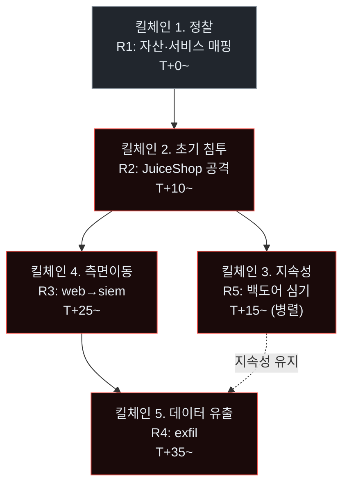
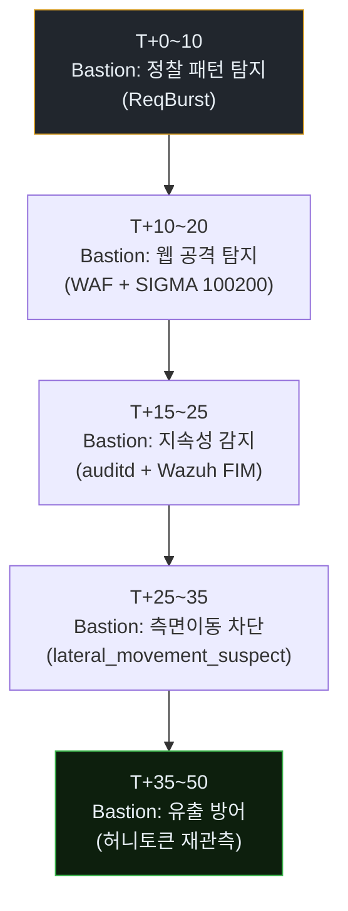
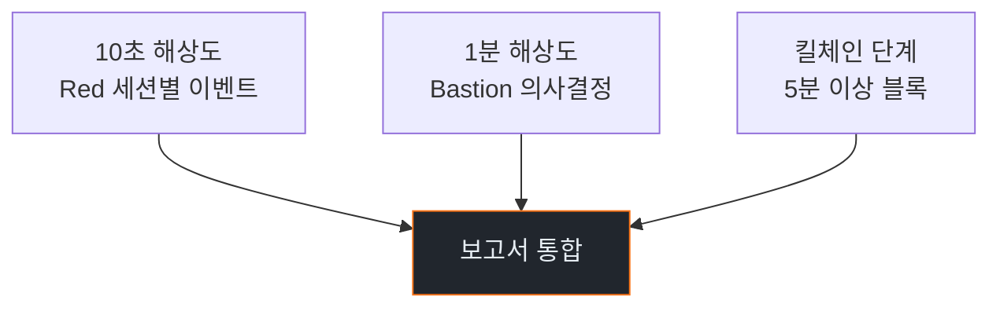
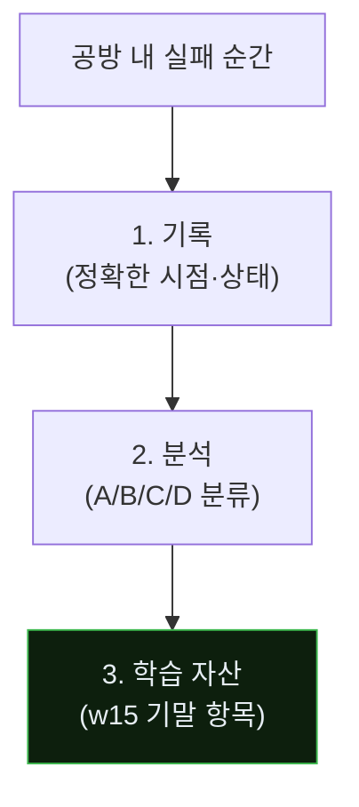

# Week 14: 모의 실사고 — 다단계 Agentic APT 대응

## 이번 주의 위치
w1부터 *개별 기술*을 쌓았고, w11·w12에서 *두 Round의 Purple*로 Bastion을 키웠으며, w13에서 *보고 서식*을 정비했다. 이번 주는 그 모든 것이 시험대에 올라가는 **종합 공방**이다. 공격 시나리오는 단일 기술이 아니라 **킬체인 전 단계**를 포함한 다단계이며, Red(Claude Code)는 *에이전트 팀*으로 가동된다. Blue(Bastion + 학생)는 실시간 대응 + 사후 보고까지 연속 수행한다.

## 학습 목표
- 다단계 Agentic APT 시나리오의 **전체 킬체인**을 방어자 관점에서 관측한다
- 병렬 에이전트 공격에서 **세션 간 상관관계**가 실제로 어떻게 발동되는지 확인한다
- 실시간 대응 중 *자동화된 의사결정*과 *인간 개입*의 적절한 경계를 연습한다
- 사고 종료 후 w13 템플릿으로 **전체 사고 보고서**를 작성한다
- 자신의 Bastion 구성의 현재 수준(L0~L5)을 판정한다

## 전제 조건
- w11·w12 Purple 결과 반영된 Bastion 상태
- w13 보고서 템플릿 숙지

## 강의 시간 배분 (3시간)

| 시간 | 내용 |
|------|------|
| 0:00-0:15 | Part 1: 오늘의 시나리오 브리핑 |
| 0:15-1:45 | Part 2: 실전 공방 (90분) |
| 1:45-1:55 | 휴식 |
| 1:55-2:40 | Part 3: 사고 종료·포렌식 초안 |
| 2:40-2:50 | 휴식 |
| 2:50-3:20 | Part 4: 보고서 작성 (반) |
| 3:20-3:40 | Part 5: 1차 발표 & 쟁점 |

---

# Part 1: 오늘의 시나리오 브리핑 (15분)

## 1.1 오늘의 Red — 5 에이전트 팀
| 에이전트 | 역할 | 시작 시간 |
|----------|------|-----------|
| R1 | 정찰 | T+0 |
| R2 | 웹 악용 (JuiceShop) | T+10 |
| R3 | 측면이동 (web → siem 접근 시도) | T+25 |
| R4 | 데이터 유출 시도 | T+35 |
| R5 | 지속성 주입 | T+15 (병렬) |

## 1.2 Blue (학생 + Bastion)
- Bastion은 w11·w12의 업그레이드 반영 상태
- 학생은 TUI에서 *승인 필요* 이벤트를 빠르게 처리하는 *운영자 역할*

## 1.3 규칙
- 총 공방 시간 90분
- 외부 통신 금지 (10.20.30.0/24 내부만)
- Bastion이 *자동 차단*을 발동하면 학생은 5분 내 *재확인 + 정책 정합성 검토*

### 1.3.1 다단계 Agentic APT의 킬체인



### 1.3.2 Blue의 단계별 대응 목표



### 1.3.3 Round 성공 기준의 재정의

본 w14는 Round 2보다 큰 규모이므로 성공 기준도 조정한다.

| 성공 유형 | 조건 |
|-----------|------|
| **전면 성공** | 5단계 중 4단계 이상을 자동 차단 |
| **부분 성공** | 3단계 차단 + Bastion 자산 diff ≥ 2 skill |
| **경험 성공** | 2단계 이하 차단, 그러나 w15 기말에 투입할 실패 사례 ≥ 3건 수집 |

전면 성공이 기본 목표이지만, *경험 성공*도 *실패*가 아니다 — 기말의 재료가 되기 때문.

---

# Part 2: 실전 공방 (90분)

## 2.1 Blue 작업 흐름
```
① Wazuh/Bastion 경보 모니터
② Bastion TUI reasoning 탭 주시
③ 자동 대응이 뜨면 정책 정합성 체크
④ 수동 개입 필요 시 (예 승인 요청) 처리
⑤ Red의 킬체인 진행 포인트를 메모
```

## 2.2 Red 팀(강사 운영) 지침
- R1~R5 각자 독립 세션
- 실패 시 재시도·변형
- 각 에이전트는 *같은 계획서*를 공유하는 멀티에이전트 프로토콜(가상)으로 가동

## 2.3 관찰 지점 (학생 체크리스트)
- 세션 클러스터링이 실제로 뜨는가?
- 자동 대응이 *몇 단계*까지 막는가?
- 허니토큰 접촉 이벤트가 얼마나 유용했나?
- Bastion이 *놓친* 순간의 성격(A/B/C/D 분류)

### 2.3.1 5-에이전트 공방의 방어 측 관제 보드

```mermaid
flowchart TB
    subgraph Dash["학생이 열어 두는 5분할 화면"]
      D1["1. Red 활동<br/>(5세션 요약)"]
      D2["2. Bastion TUI<br/>(Reasoning)"]
      D3["3. Wazuh Discover<br/>(경보 스트림)"]
      D4["4. 자동 대응 큐<br/>(승인 필요 목록)"]
      D5["5. Canary 상태<br/>(정상 확인)"]
    end
    style Dash fill:#161b22,stroke:#30363d
```



### 2.3.2 우선순위 행동 매트릭스

| Bastion 상태 | 학생 행동 |
|-------------|-----------|
| 자동 대응 발동 + 정상 판단 | *통과* (관찰만) |
| 자동 대응 발동 + 의심 | 2분 내 *재확인 + 정책 확인* |
| 승인 필요 이벤트 | 1분 내 승인·기각 결정 |
| Canary 실패 | 즉시 최근 10분 자동 대응 이력 검토 |
| Bastion 침묵 + Red 전진 | 수동 개입 (nft 추가·세션 차단) |

### 2.3.3 Red 진행 포인트 기록 양식

```
[T+MM:SS] 단계: <정찰/침투/지속/이동/유출>
행위: <구체 활동>
Bastion 반응: <탐지/미탐지/대응/실패>
영향: <발생 손실 또는 위협>
```

이 양식이 Part 3 포렌식 초안의 *씨앗*이다.

---

# Part 3: 사고 종료 · 포렌식 초안 (45분)

## 3.1 종료 선언 기준
- Red가 목표 달성 또는 시간 종료
- Bastion이 *전면 차단*에 도달

## 3.2 아티팩트 수집
```
artifacts/w14/
  pcap/full.pcap
  wazuh/alerts-window.json
  bastion/decisions-log.json
  experience/new-entries.json
  skill_playbook_diff.md
```

## 3.3 초안 포인트
- 킬체인 5단계 중 Bastion이 *자동*으로 차단한 단계
- *인간 승인 필요*였던 단계
- 놓친 단계(있었다면) + 이유

### 3.3.1 사고 복기의 *3시간 해상도*



각 해상도의 자료를 *한 보고서*에 통합해 읽는 사람이 *확대·축소*할 수 있게 한다.

### 3.3.2 포렌식 초안에 반드시 포함할 *비교표*

```
비교 A. 예상 vs 실제
  예상: 전면 성공 (5단계 중 4+ 차단)
  실제: 부분 성공 (3단계 차단)

비교 B. Bastion vs 사람
  자동 대응: 12건
  사람 개입: 3건 (주로 승인 모드)
  미대응: 2건 (A 미탐지)

비교 C. Round 1·2 vs 오늘
  탐지 지연 중앙값: 25s → 8s → 6s
  미탐지: 4 → 1 → 2 (단, 공격 규모 5배↑)
```

이 3개 비교표가 *Executive Summary*의 핵심이 된다.

### 3.3.3 *"놓친 단계"*를 대하는 자세

오늘 Bastion이 막지 못한 단계가 있다면, 이는 *가장 귀한 자료*이다. 기말 보고서(w15)의 중요 섹션 *다음 조치 계획*이 바로 이 미완 부분에서 나온다.

*모두 차단하는 Bastion*은 학습 기회가 적다. *적절히 실패하는 Bastion*이 가장 많이 배운다.

---

# Part 4: 보고서 작성 — 30분 스프린트 (30분)

## 4.1 이번 시간에 끝내야 할 분량
- w13의 템플릿 1~5절
- 각 절 최소 1단락·1표·1그림

## 4.2 Bastion 자산 변화 측정
| 항목 | w11 시작 | w14 종료 | 차이 |
|------|----------|----------|------|
| Skill 수 | | | |
| Playbook 수 | | | |
| Experience 수 | | | |
| 자동 대응 발동 | | | |

---

# Part 5: 1차 발표 & 쟁점 (20분)

## 5.1 학생 2인 발표 (7분 × 2)
- 본인이 가장 잘 막은 단계
- 놓친 단계 + 개선안 1줄

## 5.2 강사 쟁점 제시
- Bastion의 *오탐 누적*은 허용 범위인가?
- Canary 트래픽은 정상 유지됐나?
- 보고서에 *자동 판단 로그*가 적절히 요약됐나?

## 5.3 다음 주(w15) 준비
- 오늘의 보고서 초안을 **기말 보고서 토대**로 사용
- 본 과목 전반의 자기 평가를 위한 자료 정리

---

## 퀴즈 (5문항)

**Q1.** 오늘의 Red 팀 구성에서 R3의 역할은?
- (a) 정찰
- (b) 웹 악용
- (c) **측면이동**
- (d) 지속성

**Q2.** Blue가 자동 대응을 *재확인*해야 하는 이유는?
- (a) 성능 저하 방지
- (b) **정책 정합성과 오탐 누적 관리**
- (c) 사용자 요청
- (d) 라이선스

**Q3.** 세션 클러스터링이 실제로 발동해야 잡히는 공격 유형은?
- (a) 단일 페이로드
- (b) **다중 에이전트 병렬 공격**
- (c) 단일 포트 스캔
- (d) DDoS

**Q4.** 놓친 단계의 분류 A/B/C/D 중 *미탐지*는?
- (a) **A**
- (b) B
- (c) C
- (d) D

**Q5.** 본 주차 결과가 기말(w15)의 무엇으로 확장되나?
- (a) 별도 과제
- (b) **기말 보고서 본체**
- (c) 관련 없음
- (d) 퀴즈 은행

**Q6.** "경험 성공" 기준의 의미는?
- (a) 차단 실패
- (b) **차단은 적지만 w15 기말 재료가 되는 실패 사례 다수 수집**
- (c) 자동 차단만
- (d) 보고서 작성

**Q7.** 5-에이전트 공방에서 *학생이 열어야 할* 5분할 화면에 해당하지 *않는* 것은?
- (a) Red 활동
- (b) Bastion TUI
- (c) Wazuh Discover
- (d) **외부 SNS**

**Q8.** Canary 실패 시 *즉시* 해야 할 행동은?
- (a) 로그 아카이브
- (b) **최근 10분 자동 대응 이력 검토**
- (c) 서비스 재시작
- (d) 학생 귀가

**Q9.** *적절히 실패하는 Bastion*이 학습에 더 유용한 이유는?
- (a) 평가 목적
- (b) **미완 단계가 다음 조치 계획의 원천**
- (c) 비용 절감
- (d) 시간 단축

**Q10.** 포렌식의 *3시간 해상도*에서 가장 좁은 해상도는?
- (a) 킬체인 단계 (5분)
- (b) Bastion 의사결정 (1분)
- (c) **Red 세션별 이벤트 (10초)**
- (d) 분기별 요약

**정답:** Q1:c · Q2:b · Q3:b · Q4:a · Q5:b · Q6:b · Q7:d · Q8:b · Q9:b · Q10:c

---

## 과제
1. **보고서 초안 (필수)**: 오늘의 보고서 초안 4쪽 이상, Bastion diff, 아티팩트 번들 (3.2 구조).
2. **자산 변화 표 (필수)**: Part 4.2의 표를 본인 수치로 채움. w11 시작 ↔ w14 종료 비교.
3. **과목 회고 초안 (필수)**: 본 과목 전반의 자기 회고 1쪽 (w15에서 완성).
4. **(선택 · 🏅 가산)**: 5분할 화면을 *실제 스크린샷*으로 제출.
5. **(선택 · 🏅 가산)**: 본인의 Bastion이 *놓친* 단계에 대한 개선 제안 — w15 기말 작전 계획의 한 항목으로 편입.

---

## 부록 A. 본 주차 Round의 *가상 타임라인* (참고)

```mermaid
timeline
    title w14 — 5 에이전트 공방 (참고 타임라인)
    section 정찰
      T+00:00 : R1 정찰 시작
      T+00:02 : Bastion ReqBurst 경보
    section 침투
      T+10:00 : R2 웹 공격 시작
      T+10:05 : WAF 403 차단
      T+10:20 : R2 JWT 우회 시도
      T+10:45 : JWT 위조 경보 · Bastion tar-pit
    section 지속성
      T+15:00 : R5 지속성 심기
      T+15:10 : auditd FIM 경보
      T+15:30 : Bastion 자동 롤백
    section 측면이동
      T+25:00 : R3 내부 스캔 시도
      T+25:05 : lateral_movement_suspect
      T+25:15 : nft 자동 차단
    section 유출
      T+35:00 : R4 데이터 추출 시도
      T+35:10 : 허니토큰 재관측 → 고신뢰 확정
      T+35:20 : Bastion 전면 차단
      T+50:00 : Round 종료
```

## 부록 B. 공방 실패를 *지적 자산*으로 만드는 3단계



실패는 *없애는* 것이 아니라 *자산화*하는 것이다.
