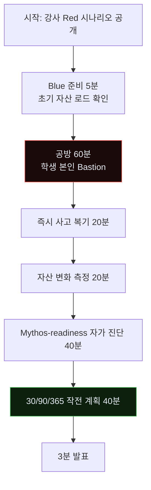
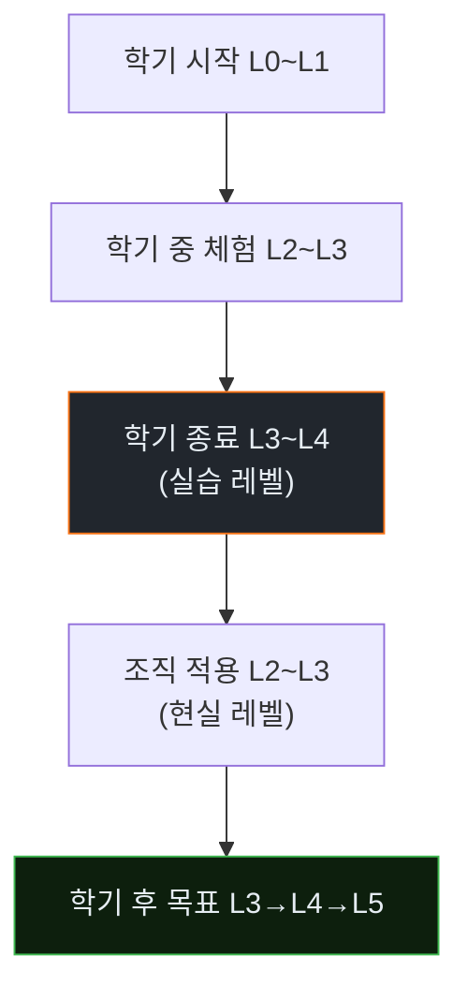
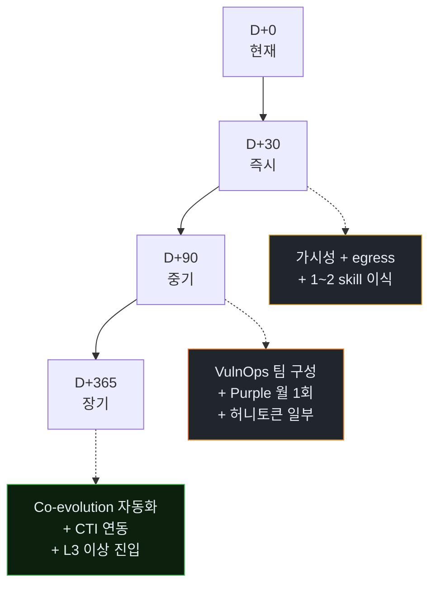
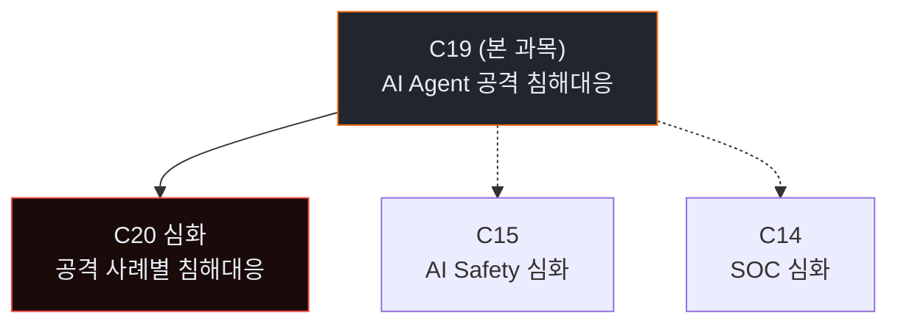

# Week 15: 기말 — 종합 Purple + Mythos-readiness 개인 보고서

## 이번 주의 위치
지난 14주 동안 학생은 공격 에이전트를 관측하고, 자신의 Bastion을 자산으로 길러내는 과정을 반복했다. 기말은 *평가*임과 동시에 **내일부터 조직으로 돌아가 무엇을 할 것인가**에 대한 개인 작전 계획을 작성하는 시간이다. 본 과목이 *레퍼런스 없는 교과*였음을 기억하자 — 각자가 작성하는 이 기말 보고서가, 다음 코호트와 다른 교육기관에 *참고문헌*이 된다.

## 평가 목표
- 종합 Purple 공방에서 주요 TTP를 **탐지·자동 대응·수동 개입**의 올바른 비율로 처리
- Bastion의 **skill/playbook/experience 자산 증가**를 정량적으로 증명
- 본 과목 전반의 **Mythos-readiness 자가 진단**(L0~L5) 보고
- 조직으로 돌아가 **30일/90일/1년**의 실행 계획 작성
- 후속 학습 포인트·커리큘럼 개선 제안 1건

## 전제 조건
- w14까지 전 주차 이수 + 자산 번들 보유

## 실습 환경
- `bastion`에 학생별 최종 상태 유지
- 기말 공방은 강사가 **학생이 한 번도 보지 못한** 변형 시나리오로 수행

## 시간 배분 (3시간 40분)

| 시간 | 내용 |
|------|------|
| 0:00-0:10 | 기말 규칙·시나리오 브리핑 |
| 0:10-1:10 | Part 1: 기말 Purple 공방 (60분) |
| 1:10-1:20 | 휴식 |
| 1:20-2:00 | Part 2: 사고 복기·자산 변화 측정 (40분) |
| 2:00-2:40 | Part 3: Mythos-readiness 자가 진단 (40분) |
| 2:40-2:50 | 휴식 |
| 2:50-3:30 | Part 4: 개인 작전 계획(30/90/365일) 작성 (40분) |
| 3:30-3:40 | Part 5: 3분 발표 |

---

# Part 1: 기말 Purple 공방 (60분)

## 1.1 규칙
- Red는 강사 커스텀 시나리오 (w14 대비 변형·강화)
- 공격 의도: *JuiceShop 관리자 권한* + *siem에 등록된 허니토큰 노출*
- Blue는 본인 Bastion 상태로 대응

## 1.2 승부 기준 — 3단계
- 공격이 성공해도 **Bastion이 올바르게 경보·대응**했다면 부분 점수
- **자동 대응 ≥ 5단계 이상**이 목표
- Bastion이 *한 번도* 오탐으로 정상 트래픽을 차단하지 않으면 가산점

### 1.2.1 기말 공방 흐름 개요



### 1.2.2 기말 시나리오의 *차별화 포인트*

- w14 대비 **에이전트 수 7개**로 확대 (+2)
- **복수 접근 경로** (web + 직접 siem 시도)
- **시간 압박** (60분 → Red가 더 빠름)
- **역공 요소** — Red가 일부러 Bastion의 허점(오탐 유발)을 찌름

### 1.2.3 "부분 점수"의 판정 방식

공격 성공 여부와 별개로 *Bastion이 학습했는가*를 평가한다.

| 상황 | 점수 |
|------|------|
| 공격 차단 + Bastion 자산 증가 | 100% |
| 공격 성공 + Bastion 자산 증가 ≥3 | 80% |
| 공격 성공 + Bastion 자산 증가 0~2 | 50% |
| 공격 성공 + Bastion 자산 감소(롤백) | 30% |
| 오탐으로 정상 차단 | -15% |

---

# Part 2: 사고 복기 · 자산 변화 측정 (40분)

## 2.1 필수 측정
| 지표 | 초기(w0) | 기말(w15) | 증가 |
|------|----------|-----------|------|
| Skill 수 | 기본 | | |
| Playbook 수 | | | |
| Experience 로그 | 0 | | |
| 자동 대응 발동 누적 | | | |
| 오탐 누적 | | | |

## 2.2 복기 서식
- 전체 킬체인 도식 (Mermaid)
- 각 단계에 **탐지·대응 성공/실패**를 색으로 표시
- 각 실패에 대해 **왜 실패했는가** 한 줄

---

# Part 3: Mythos-readiness 자가 진단 (40분)

## 3.1 Level 평가 체크리스트
| 레벨 | 요건 | 본인 상태 (O/X) |
|------|------|------------------|
| L1 Observer | 에이전트 호출·트래픽 기본 로깅 운영 | |
| L2 Reactor | 1차 탐지·자동 차단 발동 | |
| L3 Defender | 실시간 공방 대응 + Purple 1회 이상 | |
| L4 Co-evolver | Experience → Playbook 자동 승격 + 롤백 체계 | |
| L5 Mythos-ready | 외부 위협 인텔 + Canary + 연속 진화 | |

## 3.2 증거 링크
- 각 요건마다 **본인 자료**의 경로·파일명을 증거로 첨부
- 증거 없는 체크는 인정 안 됨

## 3.3 약한 레벨에 대한 메모
- 다음 레벨로 가기 위해 *이미 가지고 있는 부분*
- *없는 부분*
- *필요한 외부 투자*(시간·비용·인력)

### 3.3.1 본인의 Mythos-readiness 평가 흐름



학기에서 *체험한* 레벨과 *조직의 현실* 레벨은 다르다. 솔직한 격차 인식이 계획의 출발.

### 3.3.2 "약한 영역" 분석 템플릿

```
[L<N> → L<N+1> 이행 격차]
  이미 가진 것:
    - <구체 자산·절차>
  없는 것:
    - <구체 부족>
  필요한 외부 투자:
    - 시간: <추정>
    - 비용: <추정>
    - 인력: <추정>
  1순위 다음 조치:
    - <구체 한 문장>
```

이 템플릿으로 *매 레벨 격차*를 평가하면 4장 작전 계획이 구체화된다.

---

# Part 4: 개인 작전 계획(30/90/365일) (40분)

## 4.1 30일 계획 (즉시)
- 조직 내 에이전트 호출 **가시성** 확보 (로깅·프록시)
- 핵심 시스템의 **egress 제한** 점검
- 본 과목에서 얻은 *스킬 명세* 1~2개를 운영 SIEM에 이식

## 4.2 90일 계획 (중기)
- VulnOps 팀·역할 정립
- Purple 프로세스 **월 1회** 시범 운영
- 허니토큰·tar-pit 일부 적용

## 4.3 365일 계획 (장기)
- Co-evolution 루프(자동 승격) 정착
- 외부 위협 인텔 연동(OpenCTI 확장)
- 조직 수준 *Mythos-readiness*를 L3 이상으로 진입

## 4.4 제약
- 조직의 현실적 리소스를 명시(사람 수·예산 범위)
- 의사결정자에게 제출할 수 있는 *1쪽 브리핑 요약* 포함

### 4.4.1 30/90/365 계획의 시각화



### 4.4.2 의사결정자 브리핑 1쪽 양식

```markdown
# Agent IR 도입 제안 — 30/90/365 계획
## 한 줄 요지
"AI Agent 공격에 대한 초기 대응 역량을 L<현재> → L<목표>로 올린다."

## 근거
- 외부: CSA Mythos-ready 보고서, 업계 사고 사례
- 내부: 본인 조직 현재 자산 평가 (별첨)

## 30일 조치 (예산·인력 소)
- ...

## 90일 조치 (예산·인력 중)
- ...

## 365일 조치 (예산·인력 대)
- ...

## 미조치 시 리스크
- ...

## 요청 (의사결정자에게)
- 예산: ~$X
- 인력 배정: N명
- 정책 승인: <항목>
```

### 4.4.3 현실 *거부 시나리오* — "예산이 안 나올 때"

만약 의사결정자가 *예산 거부*하면?

1. **L2 수준으로 타협**: 로그·탐지만이라도 *최소 비용*으로
2. **Pilot 팀만**: 작은 팀에서 PoC 후 확장 요청
3. **외부 보조금 활용**: KISA·정보보호산업육성지원 등 국내 프로그램
4. **문화적 변화부터**: 예산 없이 *교육·인식 개선*만

포기는 절대 선택지가 아니다.

---

# Part 5: 3분 발표 (30분)

각 학생 3분:
1. 본 과목에서 얻은 가장 *근본적* 통찰 1개
2. 자기 조직에서 즉시 시작할 조치 1개
3. 이 과목의 개선 제안 1개

---

## 제출물 체크리스트

- [ ] `final-report.md` (4~10쪽) — Part 2·3·4 통합
- [ ] `skill_playbook_diff.md` (초기 → 기말)
- [ ] `experience-log-summary.json`
- [ ] `mythos-readiness-self-assessment.md`
- [ ] `action-plan-30-90-365.md`
- [ ] 발표 슬라이드 3쪽 (PDF)

---

## 채점 루브릭 요약 (기말 30% 중)

| 항목 | 배점 | 기준 |
|------|------|------|
| 기말 공방 성과 | 30 | 자동 대응 발동 수·오탐 억제 |
| Bastion 자산 증가 | 20 | Skill·Playbook·Experience 증가 증명 |
| Mythos-readiness 진단 | 20 | 증거 첨부 일치도 |
| 30/90/365 계획 | 20 | 현실성·구체성·브리핑 품질 |
| 발표 | 10 | 명료성 |

---

## 마무리

> 이 과목은 *레퍼런스가 없는 곳에서* 시작되었다. 여러분이 만든 보고서·스킬·플레이북이 다음 교육의 레퍼런스가 된다. 조직에 돌아가 30일 안에 **한 가지**라도 바꾸어 내면, 이 과목의 목적은 달성된 것이다. 방어는 한 번의 승리가 아니라 *지속되는 학습*이다 — 그리고 학습은 여러분의 Bastion과, 함께 계속된다.

---

## 부록 A. 후속 과목 안내

이번 과목을 마친 뒤 본인 상황에 따라 추천되는 후속 과목.



**C20 AI Agent 공격 침해대응 심화**: 15가지 서로 다른 에이전트 공격 사례를 각각 공격→탐지→분석→초동대응→보고→재발방지의 전 절차로 학습. *본 과목의 실전 적용*.

## 부록 B. *학기 내내 누적된* 자산의 통계 — 예시

(이전 코호트 평균 기준)

| 자산 유형 | 학기 시작 | 학기 종료 | 평균 증가 |
|-----------|-----------|-----------|-----------|
| 개인 Skill | 0 | 5~8 | +6 |
| 개인 Playbook | 0 | 2~4 | +3 |
| Experience 로그 엔트리 | 0 | 50~200 | +100 |
| SIGMA 룰 | 0 | 3~5 | +4 |
| 허니 자산 | 0 | 2~5 | +3 |
| 보고서 초안 | 0 | 2 (w13·w14) | +2 |
| 자가 진단표 | 0 | 1 | +1 |

이 수치가 *"과목을 거친 학생의 변화"*의 정량 증거다.

---

<!--
사례 섹션 폐기 (2026-04-27 수기 검토): 본 lecture 는 *기말 — 종합 Purple +
Mythos-readiness 자가 진단 + 30/90/365 작전 계획* 이 핵심이며 평가 중심
주차이다. Precinct 6 의 T1041 단일 항목은 *학생 본인 자산 평가* / *조직
도입 계획* / *L0~L5 진단* 어디에도 입력되지 않는다 — 학생은 *본인의*
artifacts 와 진단을 갖고 작업. 폐기.
-->


