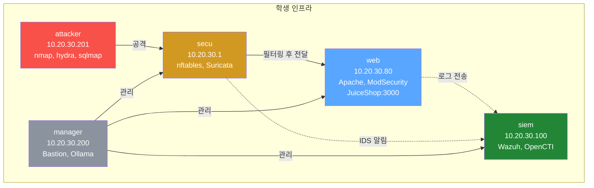
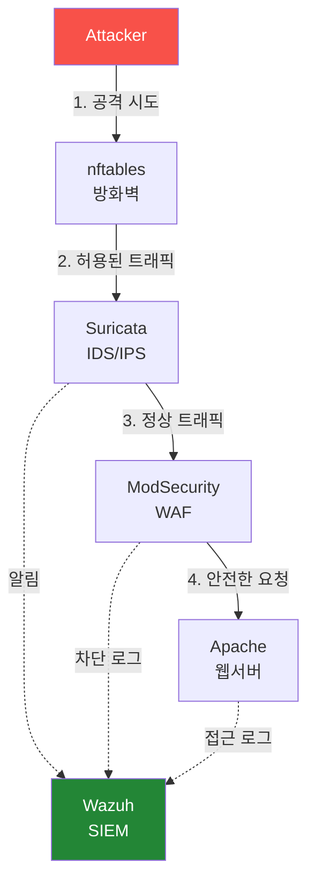

# Week 01: 보안 솔루션 개론 + 인프라 소개

## 학습 목표
- 기업/기관에서 사용하는 주요 보안 솔루션의 종류와 역할을 이해한다
- 방화벽, IDS/IPS, WAF, SIEM, CTI의 개념과 차이점을 설명할 수 있다
- 실습 인프라에 배치된 각 보안 솔루션의 위치와 역할을 파악한다
- 각 보안 솔루션이 실제로 동작하는지 명령어로 확인할 수 있다

## 실습 환경 (공통)

| 서버 | IP | 역할 | 접속 |
|------|-----|------|------|
| bastion | 10.20.30.201 | Control Plane (Bastion) | `ssh ccc@10.20.30.201` (pw: 1) |
| secu | 10.20.30.1 | 방화벽/IPS (nftables, Suricata) | `ssh ccc@10.20.30.1` |
| web | 10.20.30.80 | 웹서버 (JuiceShop:3000, Apache:80) | `ssh ccc@10.20.30.80` |
| siem | 10.20.30.100 | SIEM (Wazuh Dashboard:443, OpenCTI:8080) | `ssh ccc@10.20.30.100` |

**Bastion API:** `http://localhost:9100` / Key: `ccc-api-key-2026`

## 강의 시간 배분 (3시간)

| 시간 | 내용 | 유형 |
|------|------|------|
| 0:00-0:40 | 이론 강의 (Part 1) | 강의 |
| 0:40-1:10 | 이론 심화 + 사례 분석 (Part 2) | 강의/토론 |
| 1:10-1:20 | 휴식 | - |
| 1:20-2:00 | 실습 (Part 3) | 실습 |
| 2:00-2:40 | 심화 실습 + 도구 활용 (Part 4) | 실습 |
| 2:40-2:50 | 휴식 | - |
| 2:50-3:20 | 응용 실습 + Bastion 연동 (Part 5) | 실습 |
| 3:20-3:40 | 정리 + 과제 안내 | 정리 |

---

---

## 용어 해설 (보안 솔루션 운영 과목)

| 용어 | 영문 | 설명 | 비유 |
|------|------|------|------|
| **방화벽** | Firewall | 네트워크 트래픽을 규칙에 따라 허용/차단하는 시스템 | 건물 출입 통제 시스템 |
| **체인** | Chain (nftables) | 패킷 처리 규칙의 묶음 (input, forward, output) | 심사 단계 |
| **룰/규칙** | Rule | 특정 조건의 트래픽을 어떻게 처리할지 정의 | "택배 기사만 출입 허용" |
| **시그니처** | Signature | 알려진 공격 패턴을 식별하는 규칙 (IPS/AV) | 수배범 얼굴 사진 |
| **NFQUEUE** | Netfilter Queue | 커널에서 사용자 영역으로 패킷을 넘기는 큐 | 의심 택배를 별도 검사대로 보내는 것 |
| **FIM** | File Integrity Monitoring | 파일 변조 감시 (해시 비교) | CCTV로 금고 감시 |
| **SCA** | Security Configuration Assessment | 보안 설정 점검 (CIS 벤치마크 기반) | 건물 안전 점검표 |
| **Active Response** | Active Response | 탐지 시 자동 대응 (IP 차단 등) | 침입 감지 시 자동 잠금 |
| **디코더** | Decoder (Wazuh) | 로그를 파싱하여 구조화하는 규칙 | 외국어 통역사 |
| **CRS** | Core Rule Set (ModSecurity) | 범용 웹 공격 탐지 규칙 모음 | 표준 보안 검사 매뉴얼 |
| **CTI** | Cyber Threat Intelligence | 사이버 위협 정보 (IOC, TTPs) | 범죄 정보 공유 시스템 |
| **IOC** | Indicator of Compromise | 침해 지표 (악성 IP, 해시, 도메인 등) | 수배범의 지문, 차량번호 |
| **STIX** | Structured Threat Information eXpression | 위협 정보 표준 포맷 | 범죄 보고서 표준 양식 |
| **TAXII** | Trusted Automated eXchange of Intelligence Information | CTI 자동 교환 프로토콜 | 경찰서 간 수배 정보 공유 시스템 |
| **NAT** | Network Address Translation | 내부 IP를 외부 IP로 변환 | 회사 대표번호 (내선→외선) |
| **masquerade** | masquerade (nftables) | 나가는 패킷의 소스 IP를 게이트웨이 IP로 변환 | 회사 이름으로 편지 보내기 |

## 전제 조건
- Course 1 (모의해킹 기초) Week 01 수강 완료 또는 동등 수준
- 실습 인프라 SSH 접속 경험
- 리눅스 기본 명령어 (systemctl, cat, grep 수준)

---

### 실습 인프라 구조



### 트래픽 흐름



## 1. 보안 솔루션이 왜 필요한가? (20분)

### 1.1 현대 사이버 위협의 현실

2025년 기준 전 세계 사이버 범죄 피해액은 연간 10조 달러를 넘어섰다. 공격은 점점 자동화되고, 하나의 방어 수단만으로는 조직을 보호할 수 없다.

**비유: 건물 보안**

```
인터넷 (외부 세계)
  |
  v
[방화벽 / Firewall]          -- 건물 외곽 담장 + 출입문
  누가 들어올 수 있는지 통제      (누가 들어올 수 있는지 통제)
  |
  v
[IDS/IPS / Suricata]         -- 경비원 (수상한 행동 감시)
  이상 트래픽 탐지/차단           (이상 트래픽 탐지/차단)
  |
  v
[WAF / Apache+ModSecurity]   -- 건물 입구 금속탐지기
  웹 공격 전문 차단               (웹 공격 전문 차단)
  |
  v
[웹 서버 / JuiceShop]        -- 실제 업무 공간

[SIEM / Wazuh]               -- CCTV 관제실
  모든 로그를 모아서 분석

[CTI / OpenCTI]              -- 범죄 정보 데이터베이스
  알려진 공격자/악성코드 정보 공유
```

이 강의에서는 위 그림의 각 계층을 하나씩 깊이 배운다.

### 1.2 심층 방어 (Defense in Depth)

보안에서 가장 중요한 원칙 중 하나는 **심층 방어(Defense in Depth)**이다. 하나의 방어 수단이 뚫려도 다음 계층이 막아주는 구조를 말한다.

| 계층 | 보안 솔루션 | 역할 |
|------|------------|------|
| 네트워크 경계 | 방화벽 (Firewall) | 허용된 트래픽만 통과 |
| 네트워크 내부 | IDS/IPS | 악성 트래픽 패턴 탐지/차단 |
| 애플리케이션 | WAF | 웹 공격 전문 방어 |
| 호스트 | EDR, 안티바이러스 | 엔드포인트 보호 |
| 모니터링 | SIEM | 전체 로그 통합 분석 |
| 위협 정보 | CTI | 최신 위협 정보 공유/활용 |

---

## 2. 주요 보안 솔루션 상세 (60분)

> **이 실습을 왜 하는가?**
> "보안 솔루션 개론 + 인프라 소개" — 이 주차의 핵심 기술을 실제 서버 환경에서 직접 실행하여 체험한다.
> 보안 솔루션 운영 분야에서 이 기술은 실무의 핵심이며, 실습을 통해
> 명령어의 의미, 결과 해석 방법, 보안 관점에서의 판단 기준을 익힌다.
>
> **이걸 하면 무엇을 알 수 있는가?**
> - 이 기술이 실제 시스템에서 어떻게 동작하는지 직접 확인
> - 정상과 비정상 결과를 구분하는 눈을 기름
> - 실무에서 바로 활용할 수 있는 명령어와 절차를 체득
>
> **주의:** 모든 실습은 허가된 실습 환경(10.20.30.0/24)에서만 수행한다.

### 2.1 방화벽 (Firewall)

**정의**: 네트워크 트래픽을 검사하여 미리 정의된 규칙에 따라 허용하거나 차단하는 시스템이다.

**종류**:

| 종류 | 설명 | 예시 |
|------|------|------|
| **패킷 필터링** | IP/포트 기반 단순 필터링 | iptables, nftables |
| **상태 유지(Stateful)** | 연결 상태를 추적하여 판단 | nftables (ct state) |
| **차세대(NGFW)** | 애플리케이션 레벨 인식 + IPS 통합 | Palo Alto, Fortinet |
| **호스트 기반** | 개별 서버에서 동작 | ufw, Windows Firewall |

**우리 실습 환경**: secu 서버의 **nftables**
- Linux 커널에 내장된 패킷 필터링 프레임워크
- iptables의 후속 도구로, 더 효율적인 규칙 처리
- secu 서버가 내부 네트워크(10.20.30.0/24)의 게이트웨이 역할

**nftables 규칙 구조**:
```
table → chain → rule
(테이블)  (체인)   (규칙)

예: table inet filter {
      chain input {
        type filter hook input priority 0;
        tcp dport 22 accept    ← SSH 허용
        tcp dport 80 accept    ← HTTP 허용
        drop                   ← 나머지 차단
      }
    }
```

### 2.2 IDS/IPS (침입 탐지/방지 시스템)

**정의**:
- **IDS (Intrusion Detection System)**: 네트워크 트래픽에서 악성 패턴을 **탐지**하고 알림
- **IPS (Intrusion Prevention System)**: 탐지 + 자동으로 **차단**까지 수행

**비유**: IDS는 "도둑이다!"라고 외치는 경보 시스템, IPS는 경보와 동시에 문을 잠그는 시스템이다.

**동작 방식**:

| 방식 | 설명 | 장점 | 단점 |
|------|------|------|------|
| **시그니처 기반** | 알려진 공격 패턴 DB와 비교 | 정확도 높음 | 신종 공격 탐지 불가 |
| **이상 탐지 기반** | 정상 트래픽 기준선과 비교 | 신종 공격 탐지 가능 | 오탐률 높음 |
| **하이브리드** | 시그니처 + 이상 탐지 결합 | 균형 잡힌 탐지 | 설정 복잡 |

**우리 실습 환경**: secu 서버의 **Suricata**
- 오픈소스 IDS/IPS 엔진 (OISF 재단 개발)
- 시그니처 기반 탐지 (ET Open Rules 등 사용)
- IPS 모드: nftables와 연동하여 악성 트래픽 자동 차단
- 멀티스레드 지원으로 고성능 패킷 처리

**Suricata 규칙 예시**:
```
alert http any any -> any any (
  msg:"SQL Injection Attempt";
  content:"' OR 1=1";
  sid:1000001; rev:1;
)
```
이 규칙은 HTTP 트래픽에서 `' OR 1=1` 문자열이 발견되면 알림을 생성한다.

### 2.3 WAF (웹 애플리케이션 방화벽)

**정의**: HTTP/HTTPS 트래픽을 검사하여 SQL Injection, XSS, CSRF 등 웹 공격을 차단하는 전문 방화벽이다.

**일반 방화벽 vs WAF**:

| 구분 | 일반 방화벽 | WAF |
|------|-----------|-----|
| 동작 계층 | L3-L4 (IP, 포트) | L7 (HTTP 내용) |
| 검사 대상 | 패킷 헤더 | HTTP 요청 본문, 쿠키, 헤더 |
| 차단 예시 | 특정 IP 차단 | `' OR 1=1--` 차단 |
| 배치 위치 | 네트워크 경계 | 웹 서버 앞단 |

**우리 실습 환경**: web 서버의 **Apache+ModSecurity**
- Nginx 기반 오픈소스 WAF
- ModSecurity Core Rule Set (CRS) 내장
- OWASP Top 10 공격 자동 차단
- 웹 UI로 설정 관리 가능

**WAF가 차단하는 공격 예시**:
```
# SQL Injection
GET /search?q=' UNION SELECT * FROM users--

# XSS (Cross-Site Scripting)
GET /comment?text=<script>alert('XSS')</script>

# Path Traversal
GET /file?name=../../../../etc/passwd
```

### 2.4 SIEM (보안 정보 및 이벤트 관리)

**정의**: Security Information and Event Management. 조직 내 모든 시스템의 로그를 **수집**, **정규화**, **상관분석**하여 보안 위협을 탐지하는 플랫폼이다.

**SIEM의 핵심 기능**:

```
방화벽 로그 --+
웹서버 로그 --+--> [SIEM]
IDS/IPS 알림 -+
                    1. 수집      -- 로그를 한곳에 모음
                    2. 정규화    -- 형식을 통일
                    3. 상관분석  -- 여러 이벤트를 연결
                    4. 알림      -- 위협 발견 시 통보
                    5. 대시보드  -- 시각화
```

**우리 실습 환경**: siem 서버의 **Wazuh 4.11.2**
- 오픈소스 SIEM/XDR 플랫폼
- 각 서버에 Wazuh Agent 설치하여 로그 수집
- 규칙 기반 알림 생성 (15,000+ 기본 규칙)
- MITRE ATT&CK 매핑 지원
- 웹 대시보드 (https://siem:443)

### 2.5 CTI (사이버 위협 인텔리전스)

**정의**: Cyber Threat Intelligence. 알려진 공격자, 악성 IP, 악성코드 해시, 공격 기법 등의 **위협 정보를 수집, 분석, 공유**하는 활동이다.

**CTI의 종류**:

| 종류 | 설명 | 예시 |
|------|------|------|
| **전략적 CTI** | 경영진을 위한 고수준 위협 동향 | "북한 APT 그룹이 금융권 공격 증가" |
| **전술적 CTI** | 공격 전술, 기법, 절차 (TTP) | MITRE ATT&CK T1566 (피싱) |
| **운영적 CTI** | 구체적 공격 캠페인 정보 | "이 IP 대역에서 이 악성코드로 공격 중" |
| **기술적 CTI** | IOC (침해 지표) | 악성 IP, 파일 해시, 도메인 |

**우리 실습 환경**: siem 서버의 **OpenCTI** (포트 9400)
- 오픈소스 CTI 플랫폼
- STIX/TAXII 표준 지원
- 위협 정보 시각화 및 공유
- MITRE ATT&CK 프레임워크 통합

---

## 3. 실습 인프라 보안 솔루션 맵 (10분)

우리 실습 환경에 배치된 보안 솔루션을 정리하면 다음과 같다:

```
인터넷/학생PC
  |
  v
[bastion] 10.20.30.201
  역할: 관제 본부 (Bastion Manager API)
  |
  +---------------------+
  |          |          |
  v          v          v

[secu]       [web]        [siem]
10.20.30.1   10.20.30.80  10.20.30.100
- nftables   - Apache     - Wazuh (SIEM)
  (방화벽)     +ModSecurity
- Suricata     (WAF)      - OpenCTI (CTI)
  (IDS/IPS)  - JuiceShop
               (웹 앱)
```

---

## 4. 실습 1: 방화벽(nftables) 상태 확인 (20분)

### 4.1 secu 서버 접속

> **실습 목적**: 보안 인프라 4대 서버에 접속하여 방화벽(nftables) 현재 상태를 확인한다
>
> **배우는 것**: nftables 테이블/체인/규칙 구조를 이해하고, 현재 적용된 방화벽 정책을 읽는 방법을 배운다
>
> **결과 해석**: nft list ruleset 출력에서 테이블, 체인, accept/drop 규칙을 확인하여 현재 허용/차단 정책을 파악한다
>
> **실전 활용**: 보안 엔지니어가 서버 인수 시 가장 먼저 확인하는 것이 방화벽 규칙 현황이다

```bash
# bastion 서버에서 secu로 접속
ssh ccc@10.20.30.1
```

### 4.2 nftables 서비스 상태 확인

```bash
# nftables 서비스가 실행 중인지 확인
sudo systemctl status nftables
```

**예상 출력**:
```
● nftables.service - nftables
     Loaded: loaded (/lib/systemd/system/nftables.service; enabled; ...)
     Active: active (exited) since ...
```

`Active: active`가 보이면 정상 동작 중이다.

### 4.3 현재 방화벽 규칙 확인

```bash
# 전체 ruleset 확인
sudo nft list ruleset
```

**예상 출력** (일부):
```
table inet filter {
    chain input {
        type filter hook input priority filter; policy accept;
        ...
    }
    chain forward {
        type filter hook forward priority filter; policy accept;
        ...
    }
}
```

### 4.4 규칙 분석하기

```bash
# 테이블 목록만 보기
sudo nft list tables

# 특정 체인의 규칙 수 세기
sudo nft list ruleset | grep -c "accept\|drop\|reject"
```

> **핵심 포인트**: nftables는 `table > chain > rule` 계층 구조이며, 패킷이 들어오면 chain의 규칙을 위에서 아래로 순서대로 적용한다.

### 4.5 secu 서버에서 나가기

```bash
exit
```

---

## 5. 실습 2: IDS/IPS(Suricata) 상태 확인 (20분)

> **이 실습의 목적:**
> Suricata는 네트워크 트래픽의 **내용(페이로드)**을 분석하는 IDS/IPS이다.
> nftables가 "이 IP/포트를 차단"한다면, Suricata는 "이 HTTP 요청에 SQLi 패턴이 있다"를 탐지한다.
> 이 실습에서는 Suricata가 정상 동작하는지, 어떤 룰이 로드되어 있는지, 최근 알림이 있는지 확인한다.
>
> **검증 완료:** Suricata 8.0.4 active, 65,093줄 룰 로드 확인

### 5.1 secu 서버에 다시 접속

```bash
ssh ccc@10.20.30.1
```

### 5.2 Suricata 서비스 상태 확인

```bash
# Suricata 프로세스 확인
sudo systemctl status suricata
```

**예상 출력**:
```
● suricata.service - Suricata IDS/IPS daemon
     Loaded: loaded (/lib/systemd/system/suricata.service; enabled; ...)
     Active: active (running) since ...
   Main PID: XXXX (Suricata-Main)
```

### 5.3 Suricata 로그 확인

```bash
# 최근 알림 확인 (EVE JSON 로그)
sudo tail -5 /var/log/suricata/eve.json | python3 -m json.tool 2>/dev/null || sudo tail -5 /var/log/suricata/eve.json
```

**예상 출력** (JSON 형식):
```json
{
    "timestamp": "2026-03-27T...",
    "event_type": "alert",
    "src_ip": "10.20.30.201",
    "dest_ip": "10.20.30.80",
    "alert": {
        "signature": "ET WEB_SERVER SQL Injection Attempt",
        "severity": 1
    }
}
```

### 5.4 Suricata 규칙 파일 확인

```bash
# 설치된 규칙 파일 목록
ls /etc/suricata/rules/ 2>/dev/null || ls /var/lib/suricata/rules/ 2>/dev/null

# 규칙 개수 확인
sudo cat /etc/suricata/rules/*.rules 2>/dev/null | grep -c "^alert" || echo "규칙 파일 위치 확인 필요"
```

### 5.5 Suricata 동작 모드 확인

```bash
# 설정 파일에서 동작 모드 확인
sudo grep -A5 "default-rule-path" /etc/suricata/suricata.yaml 2>/dev/null | head -10
```

```bash
exit
```

---

## 6. 실습 3: WAF(Apache+ModSecurity) 상태 확인 (20분)

> **이 실습의 목적:**
> WAF(Web Application Firewall)는 HTTP 요청의 **내용을 분석**하여 웹 공격(SQLi, XSS)을 차단한다.
> nftables→Suricata→WAF→앱 순서로 패킷이 검사되며, WAF는 **마지막 방어선**이다.
> 이 실습에서는 Apache+ModSecurity가 정상 동작하는지, WAF가 실제로 공격을 차단하는지 확인한다.
>
> **핵심 포인트:** WAF 포트(:8082)와 직접 접근 포트(:3000)의 차이를 이해한다.
> :8082로 접근하면 ModSecurity CRS가 적용되고, :3000으로 접근하면 WAF 없이 직접 접속된다.

### 6.1 web 서버 접속

```bash
ssh ccc@10.20.30.80
```

### 6.2 Apache+ModSecurity 서비스 상태 확인

```bash
# Apache+ModSecurity 관련 프로세스 확인
sudo systemctl status apache2 2>/dev/null || sudo systemctl is-active apache2 2>/dev/null

# Nginx 프로세스 확인 (Apache+ModSecurity은 Nginx 기반)
ps aux | grep -i "nginx\|apache2" | grep -v grep
```

### 6.3 Apache+ModSecurity 설정 확인

```bash
# ModSecurity 관련 설정 확인
sudo find /etc/apache2 /etc/nginx -name "*.conf" -exec grep -l "ModSecurity\|modsecurity" {} \; 2>/dev/null

# WAF 모드 확인 (On = 차단, DetectionOnly = 탐지만)
sudo grep -ri "SecRuleEngine" /etc/apache2/ /etc/nginx/ 2>/dev/null | head -5
```

### 6.4 JuiceShop 실행 확인

```bash
# JuiceShop 프로세스 확인
sudo docker ps --filter "name=juice" 2>/dev/null || ps aux | grep -i "juice" | grep -v grep

# JuiceShop 웹 접근 테스트
curl -s -o /dev/null -w "HTTP Status: %{http_code}\n" http://localhost:3000/
```

**예상 출력**:
```
HTTP Status: 200
```

### 6.5 WAF 차단 테스트 (간단)

```bash
# 정상 요청
curl -s -o /dev/null -w "Status: %{http_code}\n" "http://localhost:3000/"

# SQL Injection 패턴 포함 요청 (WAF가 차단하는지 확인)
curl -s -o /dev/null -w "Status: %{http_code}\n" "http://localhost:3000/rest/products/search?q=' OR 1=1--"
```

> WAF가 정상 동작하면 SQL Injection 요청에 대해 403 (Forbidden) 또는 다른 차단 응답을 반환한다.

```bash
exit
```

---

## 7. 실습 4: SIEM(Wazuh) 상태 확인 (20분)

> **이 실습의 목적:**
> SIEM은 보안 인프라의 **두뇌**이다. 모든 서버의 로그를 수집하여 통합 분석하고,
> 공격 패턴을 탐지하여 경보를 발생시킨다. 방화벽/IPS/WAF가 "방패"라면, SIEM은 "눈"이다.
> 이 실습에서는 Wazuh Manager, Indexer, Dashboard가 모두 정상 동작하는지 확인한다.
>
> **중요:** SIEM이 꺼져 있으면 공격이 발생해도 **아무도 모른다**.
> 정기적인 SIEM 상태 확인은 SOC 운영의 기본이다.
>
> **검증 완료:** Wazuh Manager active, Agent 1개(server 자체), Dashboard :443 접근 가능

### 7.1 siem 서버 접속

```bash
ssh ccc@10.20.30.100
```

### 7.2 Wazuh 서비스 상태 확인

```bash
# Wazuh Manager 상태
sudo systemctl status wazuh-manager

# Wazuh Indexer (로그 저장소) 상태
sudo systemctl status wazuh-indexer

# Wazuh Dashboard (웹 UI) 상태
sudo systemctl status wazuh-dashboard
```

**예상 출력** (각 서비스):
```
● wazuh-manager.service - Wazuh manager
     Active: active (running) since ...
```

### 7.3 Wazuh Agent 연결 상태 확인

```bash
# 등록된 에이전트 목록
sudo /var/ossec/bin/agent_control -l 2>/dev/null || sudo /var/ossec/bin/manage_agents -l 2>/dev/null
```

**예상 출력**:
```
Available agents:
   ID: 001, Name: secu, IP: 10.20.30.1, Active
   ID: 002, Name: web, IP: 10.20.30.80, Active
   ID: 003, Name: bastion, IP: 10.20.30.201, Active
```

### 7.4 최근 알림 확인

```bash
# Wazuh 알림 로그 최근 10줄
sudo tail -10 /var/ossec/logs/alerts/alerts.json 2>/dev/null | python3 -m json.tool 2>/dev/null | head -30

# 또는 텍스트 형식
sudo tail -20 /var/ossec/logs/alerts/alerts.log 2>/dev/null | head -20
```

### 7.5 Wazuh 대시보드 접근 확인

```bash
# 대시보드 포트 확인
sudo ss -tlnp | grep -E "443|5601"

# 대시보드 HTTP 응답 확인
curl -sk -o /dev/null -w "Dashboard Status: %{http_code}\n" https://localhost:443/
```

**예상 출력**:
```
Dashboard Status: 200 (또는 302)
```

> **브라우저 접속**: https://10.20.30.100:443 으로 접속하면 Wazuh 대시보드를 볼 수 있다.
> 기본 계정: admin / 관리자가 안내하는 비밀번호 사용

```bash
exit
```

---

## 8. 실습 5: CTI(OpenCTI) 상태 확인 (15분)

### 8.1 siem 서버에서 OpenCTI 확인

```bash
ssh ccc@10.20.30.100
```

### 8.2 OpenCTI 서비스 확인

```bash
# OpenCTI 관련 Docker 컨테이너 확인
sudo docker ps --filter "name=opencti" 2>/dev/null

# OpenCTI 포트(9400) 리스닝 확인
sudo ss -tlnp | grep 9400
```

### 8.3 OpenCTI 접근 테스트

```bash
# HTTP 응답 확인
curl -s -o /dev/null -w "OpenCTI Status: %{http_code}\n" http://localhost:9400/ 2>/dev/null
```

**예상 출력**:
```
OpenCTI Status: 200 (또는 302)
```

> **브라우저 접속**: http://10.20.30.100:9400 으로 접속하면 OpenCTI 대시보드를 볼 수 있다.

```bash
exit
```

---

## 9. 실습 6: bastion 서버에서 전체 점검 (15분)

bastion 서버에서 원격으로 모든 보안 솔루션의 상태를 한 번에 확인해보자.

### 9.1 네트워크 연결 확인

반복문으로 여러 대상에 대해 일괄 작업을 수행합니다.

```bash
# 각 서버 생존 확인
for host in 10.20.30.1 10.20.30.80 10.20.30.100; do    # 반복문 시작
  echo -n "$host: "
  ping -c 1 -W 2 $host > /dev/null 2>&1 && echo "OK" || echo "FAIL"  # 네트워크 연결 확인
done
```

### 9.2 각 서버의 주요 포트 확인

반복문으로 여러 대상에 대해 일괄 작업을 수행합니다.

```bash
# 포트 스캔으로 서비스 확인
for check in "10.20.30.1:22" "10.20.30.80:3000" "10.20.30.80:80" "10.20.30.100:443" "10.20.30.100:9400"; do  # 반복문 시작
  host=$(echo $check | cut -d: -f1)
  port=$(echo $check | cut -d: -f2)
  echo -n "$host:$port → "
  timeout 3 bash -c "echo > /dev/tcp/$host/$port" 2>/dev/null && echo "OPEN" || echo "CLOSED"
done
```

### 9.3 원격 서비스 상태 확인 (SSH 경유)

```bash
# secu: nftables 상태
echo "=== secu: nftables ==="
ssh ccc@10.20.30.1 "sudo systemctl is-active nftables" 2>/dev/null  # 비밀번호 자동입력 SSH

# secu: Suricata 상태
echo "=== secu: Suricata ==="
ssh ccc@10.20.30.1 "sudo systemctl is-active suricata" 2>/dev/null  # 비밀번호 자동입력 SSH

# web: JuiceShop 상태
echo "=== web: JuiceShop ==="
curl -s -o /dev/null -w "%{http_code}\n" http://10.20.30.80:3000/ 2>/dev/null  # silent 모드

# siem: Wazuh 상태
echo "=== siem: Wazuh Manager ==="
ssh ccc@10.20.30.100 "sudo systemctl is-active wazuh-manager" 2>/dev/null  # 비밀번호 자동입력 SSH

# siem: OpenCTI 상태
echo "=== siem: OpenCTI ==="
curl -s -o /dev/null -w "%{http_code}\n" http://10.20.30.100:9400/ 2>/dev/null  # silent 모드
```

**예상 출력**:
```
=== secu: nftables ===
active
=== secu: Suricata ===
active
=== web: JuiceShop ===
200
=== siem: Wazuh Manager ===
active
=== siem: OpenCTI ===
200
```

---

## 10. 보안 솔루션 비교 정리 (10분)

### 10.1 전체 비교표

| 솔루션 | 동작 계층 | 주요 기능 | 탐지 방식 | 실습 환경 |
|--------|----------|----------|----------|----------|
| **nftables** | L3-L4 | 패킷 필터링 | 규칙 기반 | secu |
| **Suricata** | L3-L7 | 트래픽 분석, 침입 탐지/차단 | 시그니처 기반 | secu |
| **Apache+ModSecurity** | L7 | 웹 공격 차단 | 시그니처 + CRS | web |
| **Wazuh** | 전 계층 | 로그 수집/분석/알림 | 규칙 기반 상관분석 | siem |
| **OpenCTI** | 위협 인텔리전스 | IOC 관리/공유 | 위협 정보 매칭 | siem:9400 |

### 10.2 각 솔루션의 한계

| 솔루션 | 할 수 있는 것 | 할 수 없는 것 |
|--------|-------------|-------------|
| 방화벽 | IP/포트 기반 차단 | 암호화된 트래픽 내용 검사 |
| IDS/IPS | 알려진 공격 패턴 탐지 | 제로데이 공격 탐지 (시그니처 기반 시) |
| WAF | 웹 공격 차단 | 비 HTTP 프로토콜 공격 방어 |
| SIEM | 전체 로그 상관분석 | 로그가 없는 활동 탐지 |
| CTI | 알려진 위협 정보 제공 | 표적형 신규 공격 정보 제공 |

---

## 과제

### 과제 1: 보안 솔루션 카드 작성 (개인)
실습에서 확인한 5개 보안 솔루션에 대해 각각 다음 항목을 작성하라:
- 솔루션 이름
- 설치된 서버와 IP
- 서비스 상태 확인 명령어
- 상태 확인 결과 (스크린샷 또는 텍스트)
- 이 솔루션이 없으면 어떤 공격에 취약한지 1가지 시나리오 작성

### 과제 2: 보안 사고 시나리오 분석 (조별)
다음 시나리오에서 각 보안 솔루션이 어떤 역할을 하는지 설명하라:
> "공격자가 web 서버의 JuiceShop에 SQL Injection 공격을 시도한다"

각 솔루션이 이 공격에 대해:
1. 탐지할 수 있는가?
2. 차단할 수 있는가?
3. 어떤 로그/알림을 생성하는가?

---

## 검증 체크리스트

실습을 완료한 후 아래 항목을 모두 확인하라:

- [ ] secu 서버에 SSH 접속 성공
- [ ] nftables 서비스 `active` 상태 확인
- [ ] nftables 규칙 목록 조회 성공
- [ ] Suricata 서비스 `active (running)` 상태 확인
- [ ] Suricata EVE 로그 파일 확인
- [ ] web 서버에 SSH 접속 성공
- [ ] Apache+ModSecurity/Nginx 프로세스 실행 확인
- [ ] JuiceShop HTTP 200 응답 확인
- [ ] siem 서버에 SSH 접속 성공
- [ ] Wazuh Manager 서비스 `active` 상태 확인
- [ ] Wazuh 에이전트 목록 조회 성공
- [ ] OpenCTI 포트(9400) 접근 확인
- [ ] bastion에서 원격 전체 점검 스크립트 실행 성공

---

## 다음 주 예고

**Week 02: 방화벽(nftables) 심화 — 규칙 작성과 트래픽 제어**

- nftables 규칙 문법 상세 학습
- 체인 타입 (input/output/forward) 이해
- 실습: 특정 IP/포트 차단 규칙 작성
- 실습: 로깅 규칙 추가하여 트래픽 모니터링
- nftables + Suricata 연동 원리

> 다음 주부터 각 솔루션을 하나씩 깊이 파고듭니다. 방화벽부터 시작합니다!

---

> **실습 환경 검증 완료** (2026-03-28): nftables(inet filter+ip nat), Suricata 8.0.4(65K룰), Apache+ModSecurity(:8082→403), Wazuh v4.11.2(local_rules 62줄), OpenCTI(200)

---

## 📂 실습 참조 파일 가이드

> 이번 주 실습에서 **실제로 조작하는** 솔루션의 기능·경로·파일·설정·UI 요점입니다.

### nftables
> **역할:** Linux 커널 기반 상태 기반 방화벽 (iptables 후속)  
> **실행 위치:** `secu (10.20.30.1)`  
> **접속/호출:** `sudo nft ...` CLI + `/etc/nftables.conf` 영속 설정

**주요 경로·파일**

| 경로 | 역할 |
|------|------|
| `/etc/nftables.conf` | 부팅 시 로드되는 영속 룰셋 |
| `/var/log/kern.log` | `log prefix` 룰의 패킷 드롭 로그 |

**핵심 설정·키**

- `table inet filter` — IPv4/IPv6 공통 필터 테이블
- `chain input { policy drop; }` — 기본 차단 정책
- `ct state established,related accept` — 응답 트래픽 허용

**로그·확인 명령**

- `journalctl -t kernel -g 'nft'` — 룰에서 `log prefix` 지정한 패킷 드롭

**UI / CLI 요점**

- `sudo nft list ruleset` — 현재 로드된 전체 룰 출력
- `sudo nft -f /etc/nftables.conf` — 설정 파일 재적용
- `sudo nft list set inet filter blacklist` — 집합(set) 내용 조회

> **해석 팁.** 룰은 **위→아래 첫 매칭 우선**. `accept`는 해당 체인만 종료, 상위 훅은 계속 평가된다. 변경 후 `nft list ruleset`로 실제 적용 여부 확인.

### Suricata IDS/IPS
> **역할:** 시그니처 기반 네트워크 침입 탐지/차단 엔진  
> **실행 위치:** `secu (10.20.30.1)`  
> **접속/호출:** `systemctl status suricata` / `suricatasc` 소켓 / `suricata -T`

**주요 경로·파일**

| 경로 | 역할 |
|------|------|
| `/etc/suricata/suricata.yaml` | 메인 설정 (HOME_NET, af-packet, rule-files) |
| `/etc/suricata/rules/local.rules` | 사용자 커스텀 탐지 룰 |
| `/var/lib/suricata/rules/suricata.rules` | `suricata-update` 병합 룰 |
| `/var/log/suricata/eve.json` | JSON 이벤트 (alert/flow/http/dns/tls) |
| `/var/log/suricata/fast.log` | 알림 1줄 텍스트 로그 |
| `/var/log/suricata/stats.log` | 엔진 성능 통계 |

**핵심 설정·키**

- `HOME_NET` — 내부 대역 — 틀리면 내부/외부 판별 실패
- `af-packet.interface` — 캡처 NIC — 트래픽이 흐르는 인터페이스와 일치해야 함
- `rule-files: ["local.rules"]` — 로드할 룰 파일 목록

**로그·확인 명령**

- `jq 'select(.event_type=="alert")' eve.json` — 알림만 추출
- `grep 'Priority: 1' fast.log` — 고위험 탐지만 빠르게 확인

**UI / CLI 요점**

- `suricata -T -c /etc/suricata/suricata.yaml` — 설정/룰 문법 검증
- `suricatasc -c stats` — 실시간 통계 조회 (런타임 소켓)
- `suricata-update` — 공개 룰셋 다운로드·병합

> **해석 팁.** `stats.log`의 `kernel_drops > 0`이면 누락 발생 → `af-packet threads` 증설. 커스텀 룰 `sid`는 **1,000,000 이상** 할당 권장.

### BunkerWeb WAF (ModSecurity CRS)
> **역할:** Nginx 기반 웹 방화벽 — OWASP Core Rule Set 통합  
> **실행 위치:** `web (10.20.30.80)`  
> **접속/호출:** 리스닝 포트 `:8082` (원본 :80/:3000 프록시)

**주요 경로·파일**

| 경로 | 역할 |
|------|------|
| `/etc/bunkerweb/variables.env` | 서버 단위 기본 변수 |
| `/etc/bunkerweb/configs/modsec/` | 커스텀 ModSecurity 룰 |
| `/var/log/bunkerweb/modsec_audit.log` | ModSec 감사 로그(차단된 요청) |
| `/var/log/bunkerweb/access.log` | 정상 요청 로그 |

**핵심 설정·키**

- `USE_MODSECURITY=yes` — ModSec 엔진 활성화
- `USE_MODSECURITY_CRS=yes` — OWASP CRS 활성화
- `MODSECURITY_CRS_VERSION=4` — CRS 버전

**로그·확인 명령**

- `grep 'Matched Phase' modsec_audit.log` — 룰에 매칭된 단계 확인
- `grep 'HTTP/1.1" 403' access.log` — WAF가 차단한 요청

**UI / CLI 요점**

- `curl -i http://10.20.30.80:8082/?id=1' OR '1'='1` — SQLi 페이로드 테스트
- 응답 코드 `403 Forbidden` — WAF 차단 정상 동작

> **해석 팁.** 오탐 시 `SecRuleRemoveById 942100` 방식으로 특정 룰만 제외. 차단 판정은 **점수 임계값**(기본 5) 기준이므로 단일 룰 1건은 차단되지 않을 수 있다.

### Wazuh SIEM (4.11.x)
> **역할:** 에이전트 기반 로그·FIM·SCA 통합 분석 플랫폼  
> **실행 위치:** `siem (10.20.30.100)`  
> **접속/호출:** Dashboard `https://10.20.30.100` (admin/admin), Manager API `:55000`

**주요 경로·파일**

| 경로 | 역할 |
|------|------|
| `/var/ossec/etc/ossec.conf` | Manager 메인 설정 (원격, 전송, syscheck 등) |
| `/var/ossec/etc/rules/local_rules.xml` | 커스텀 룰 (id ≥ 100000) |
| `/var/ossec/etc/decoders/local_decoder.xml` | 커스텀 디코더 |
| `/var/ossec/logs/alerts/alerts.json` | 실시간 JSON 알림 스트림 |
| `/var/ossec/logs/archives/archives.json` | 전체 이벤트 아카이브 |
| `/var/ossec/logs/ossec.log` | Manager 데몬 로그 |
| `/var/ossec/queue/fim/db/fim.db` | FIM 기준선 SQLite DB |

**핵심 설정·키**

- `<rule id='100100' level='10'>` — 커스텀 룰 — level 10↑은 고위험
- `<syscheck><directories>...` — FIM 감시 경로
- `<active-response>` — 자동 대응 (firewall-drop, restart)

**로그·확인 명령**

- `jq 'select(.rule.level>=10)' alerts.json` — 고위험 알림만
- `grep ERROR ossec.log` — Manager 오류 (룰 문법 오류 등)

**UI / CLI 요점**

- Dashboard → Security events — KQL 필터 `rule.level >= 10`
- Dashboard → Integrity monitoring — 변경된 파일 해시 비교
- `/var/ossec/bin/wazuh-logtest` — 룰 매칭 단계별 확인 (Phase 1→3)
- `/var/ossec/bin/wazuh-analysisd -t` — 룰·설정 문법 검증

> **해석 팁.** Phase 3에서 원하는 `rule.id`가 떠야 커스텀 룰 정상. `local_rules.xml` 수정 후 `systemctl restart wazuh-manager`, 문법 오류가 있으면 **분석 데몬 전체가 기동 실패**하므로 `-t`로 먼저 검증.

### OpenCTI (Threat Intelligence Platform)
> **역할:** STIX 2.1 기반 위협 인텔리전스 통합 관리  
> **실행 위치:** `siem (10.20.30.100)`  
> **접속/호출:** UI `http://10.20.30.100:8080`, GraphQL `:8080/graphql`

**주요 경로·파일**

| 경로 | 역할 |
|------|------|
| `/opt/opencti/config/default.json` | 포트·DB·ElasticSearch 접속 설정 |
| `/opt/opencti-connectors/` | MITRE/MISP/AlienVault 등 커넥터 |
| `docker compose ps (프로젝트 경로)` | ElasticSearch/RabbitMQ/Redis 상태 |

**핵심 설정·키**

- `app.admin_email/password` — 초기 관리자 계정 — 변경 필수
- `connectors: opencti-connector-mitre` — MITRE ATT&CK 동기화

**로그·확인 명령**

- `docker logs opencti` — 메인 플랫폼 로그
- `docker logs opencti-worker` — 백엔드 인제스트 워커

**UI / CLI 요점**

- Analysis → Reports — 위협 보고서 원문과 IOC
- Events → Indicators — IOC 검색 (hash/ip/domain)
- Knowledge → Threat actors — 위협 행위자 프로파일과 TTP
- Data → Connectors — 외부 소스 동기화 상태

> **해석 팁.** IOC 1건을 **관측(Observable)** → **지표(Indicator)** → **보고서(Report)**로 승격해 컨텍스트를 쌓아야 헌팅에 활용 가능. STIX relationship(`uses`, `indicates`)이 분석의 핵심.

---

## 실제 사례 (WitFoo Precinct 6 — 운영 보안 솔루션 5 종 동시 가시성)

> 출처: WitFoo Precinct 6 Cybersecurity Dataset (Apache 2.0)
> 본 lecture *보안 솔루션 개론 + 인프라 소개* 학습 항목 (Defense in Depth · multi-vendor · SIEM 통합) 와 매핑되는 dataset 의 *단일 incident 의 multi-product evidence*.

### Case 1: 1 incident host 가 보유한 *2 vendor product* + framework 매핑

**원본** (incidents.jsonl 의 host 노드 발췌):

```json
"products": {
  "6":  {"name": "Precinct", "vendor_name": "WitFoo",
         "frameworks": {"csc":[1,6,16,19], "cmmc1":[6], ...,
                        "iso27001":[4,8,14,16,67,68,69,71,72,113,114,...]}},
  "17": {"name": "ASA Firewall", "vendor_name": "Cisco",
         "frameworks": {"csc":[9,12], "cmmc1":[1,5], ...,
                        "iso27001":[1,2,53,54,81,86]}}
}
```

### Case 2: dataset 의 *vendor diversity* — 100+ message_type

| 도메인 | 본 dataset 의 evidence (message_type) | 본 과목 학습 도구 |
|--------|-------------------------------------|-----------------|
| **Firewall** | firewall_action 118K · traffic_drop 5.8K | nftables (w02-w03) |
| **IPS/IDS** | flow 31K · network_flow_data 13K · anomalous_behavior 1K | Suricata (w04-w06) |
| **WAF** | GET 4018 · POST 88 (CEF format) | ModSecurity (w07) |
| **SIEM** | 4624/4625 · 4656/4658 · 4663 · 5156 · 4798/4799 · 7036 등 (Windows event 24만+) | Wazuh (w09-w11) |
| **CTI** | mo_name (Data Theft 125K · Phishing 8) · matched_rules · attack_techniques | OpenCTI (w12-w13) |

**해석 — 본 lecture 와의 매핑**

| 보안 솔루션 개론 학습 항목 | 본 record 의 증거 |
|-------------------------|------------------|
| **Defense in Depth** | 1 host 에 SIEM (Precinct/WitFoo) + Firewall (Cisco ASA) 두 layer 동시. 본 과목은 5 layer (nft·Suricata·ModSec·Wazuh·OpenCTI) — 본 dataset 보다 *더 깊음* |
| **multi-vendor 통합** | dataset host 가 *2 vendor framework 동시 매핑* — 본 과목 학생도 *5 vendor SIEM 통합* 능력 학습 |
| **framework 다중 매핑** | 본 dataset host 가 csc/cmmc/pci/nist80053/csf/iso27001/soc2 *7-framework* 동시 — 학생 보고서 baseline |
| **CEF 표준** | dataset 의 WAF GET 이 CEF 7-field 표준 사용 — 본 과목 ModSec 출력도 동일 표준화 권장 |

**w01 학습 액션**:
1. 본 dataset 의 5 도메인 evidence 분포를 *학생 실습 환경* 에 동등 갖추기 (5 솔루션 모두 setup)
2. 1 incident 의 *7-framework 매핑* 을 표로 작성 (학생 보고서 양식 baseline)
3. 본인 환경의 multi-vendor 통합도가 dataset 처럼 *동일 host 에 N vendor evidence* 보유하는지 측정


