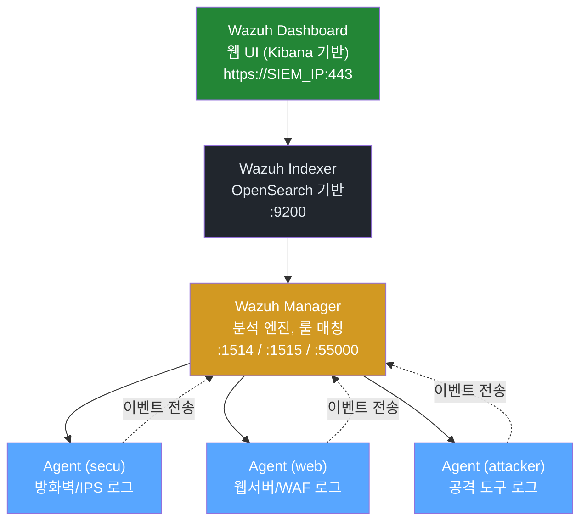

# Week 09: Wazuh SIEM (1) — 설치와 구성

## 학습 목표
- SIEM의 역할과 필요성을 이해한다
- Wazuh의 Manager/Agent 아키텍처를 파악한다
- Wazuh 대시보드의 기본 기능을 사용할 수 있다
- Agent를 등록하고 연결 상태를 확인할 수 있다

## 실습 환경 (공통)

| 서버 | IP | 역할 | 접속 |
|------|-----|------|------|
| bastion | 10.20.30.201 | Control Plane (Bastion) | `ssh ccc@10.20.30.201` (pw: 1) |
| secu | 10.20.30.1 | 방화벽/IPS (nftables, Suricata) | `ssh ccc@10.20.30.1` |
| web | 10.20.30.80 | 웹서버 (JuiceShop:3000, Apache:80) | `ssh ccc@10.20.30.80` |
| siem | 10.20.30.100 | SIEM (Wazuh Dashboard:443, OpenCTI:8080) | `ssh ccc@10.20.30.100` |

**Bastion API:** `http://localhost:9100` / Key: `ccc-api-key-2026`

## 강의 시간 배분 (3시간)

| 시간 | 내용 | 유형 |
|------|------|------|
| 0:00-0:40 | 이론 강의 (Part 1) | 강의 |
| 0:40-1:10 | 이론 심화 + 사례 분석 (Part 2) | 강의/토론 |
| 1:10-1:20 | 휴식 | - |
| 1:20-2:00 | 실습 (Part 3) | 실습 |
| 2:00-2:40 | 심화 실습 + 도구 활용 (Part 4) | 실습 |
| 2:40-2:50 | 휴식 | - |
| 2:50-3:20 | 응용 실습 + Bastion 연동 (Part 5) | 실습 |
| 3:20-3:40 | 정리 + 과제 안내 | 정리 |

---

---

## 용어 해설 (보안 솔루션 운영 과목)

| 용어 | 영문 | 설명 | 비유 |
|------|------|------|------|
| **방화벽** | Firewall | 네트워크 트래픽을 규칙에 따라 허용/차단하는 시스템 | 건물 출입 통제 시스템 |
| **체인** | Chain (nftables) | 패킷 처리 규칙의 묶음 (input, forward, output) | 심사 단계 |
| **룰/규칙** | Rule | 특정 조건의 트래픽을 어떻게 처리할지 정의 | "택배 기사만 출입 허용" |
| **시그니처** | Signature | 알려진 공격 패턴을 식별하는 규칙 (IPS/AV) | 수배범 얼굴 사진 |
| **NFQUEUE** | Netfilter Queue | 커널에서 사용자 영역으로 패킷을 넘기는 큐 | 의심 택배를 별도 검사대로 보내는 것 |
| **FIM** | File Integrity Monitoring | 파일 변조 감시 (해시 비교) | CCTV로 금고 감시 |
| **SCA** | Security Configuration Assessment | 보안 설정 점검 (CIS 벤치마크 기반) | 건물 안전 점검표 |
| **Active Response** | Active Response | 탐지 시 자동 대응 (IP 차단 등) | 침입 감지 시 자동 잠금 |
| **디코더** | Decoder (Wazuh) | 로그를 파싱하여 구조화하는 규칙 | 외국어 통역사 |
| **CRS** | Core Rule Set (ModSecurity) | 범용 웹 공격 탐지 규칙 모음 | 표준 보안 검사 매뉴얼 |
| **CTI** | Cyber Threat Intelligence | 사이버 위협 정보 (IOC, TTPs) | 범죄 정보 공유 시스템 |
| **IOC** | Indicator of Compromise | 침해 지표 (악성 IP, 해시, 도메인 등) | 수배범의 지문, 차량번호 |
| **STIX** | Structured Threat Information eXpression | 위협 정보 표준 포맷 | 범죄 보고서 표준 양식 |
| **TAXII** | Trusted Automated eXchange of Intelligence Information | CTI 자동 교환 프로토콜 | 경찰서 간 수배 정보 공유 시스템 |
| **NAT** | Network Address Translation | 내부 IP를 외부 IP로 변환 | 회사 대표번호 (내선→외선) |
| **masquerade** | masquerade (nftables) | 나가는 패킷의 소스 IP를 게이트웨이 IP로 변환 | 회사 이름으로 편지 보내기 |

---

## 1. SIEM이란?

SIEM(Security Information and Event Management)은 보안 이벤트를 **수집, 분석, 상관분석, 시각화**하는 통합 보안 관제 플랫폼이다.

### 1.1 SIEM의 핵심 기능

| 기능 | 설명 |
|------|------|
| 로그 수집 | 다양한 소스에서 로그를 중앙 집중 수집 |
| 정규화 | 서로 다른 형식의 로그를 통일된 형식으로 변환 |
| 상관분석 | 여러 이벤트를 연결하여 위협 식별 |
| 알림 | 위협 탐지 시 알림 발생 |
| 대시보드 | 보안 상태 시각화 |
| 컴플라이언스 | PCI-DSS, GDPR 등 규정 준수 보고 |

### 1.2 왜 SIEM이 필요한가?

```
방화벽 로그   --+
IPS 로그     --+
WAF 로그     --+--> [SIEM] --> 종합 분석 --> 위협 탐지
서버 로그    --+                상관분석      알림
인증 로그    --+                대시보드      보고서
```

개별 장비의 로그만으로는 전체 그림을 볼 수 없다. SIEM이 모든 로그를 모아서 **상관분석**한다.

---

## 2. Wazuh 아키텍처

Wazuh 4.11.2는 3개 컴포넌트로 구성된다:



| 컴포넌트 | 역할 | 포트 |
|----------|------|------|
| Manager | 이벤트 분석, 룰 매칭, Agent 관리 | 1514, 1515, 55000 |
| Indexer | 이벤트 저장, 검색 (OpenSearch) | 9200 |
| Dashboard | 웹 UI (시각화, 관리) | 443 |
| Agent | 호스트에서 로그 수집, 전송 | (아웃바운드) |

---

## 3. 실습 환경 접속

> **이 실습을 왜 하는가?**
> SIEM(Security Information and Event Management)은 보안 관제의 **중추 신경계**이다.
> 모든 서버의 로그를 수집하고, 알려진 공격 패턴과 매칭하여 경보를 발생시킨다.
> Wazuh는 오픈소스 SIEM 중 가장 널리 사용되며, OSSEC에서 발전한 제품이다.
>
> **이걸 하면 무엇을 알 수 있는가?**
> - Wazuh의 4개 컴포넌트(Manager/Indexer/Dashboard/Agent)의 역할
> - SIEM이 실제로 어떤 디렉토리 구조와 설정 파일을 사용하는지
> - 에이전트가 어떻게 연결되고, 로그가 어떻게 분석되는지
>
> **실무 활용:**
> - SOC 구축 시 SIEM 플랫폼 선정 및 설치
> - 에이전트 배포/관리
> - 커스텀 탐지 룰 작성 (W10에서 심화)
>
> **검증 완료:** siem 서버에서 Wazuh Manager v4.11.2 active, Agent 1개(자체 server) 확인

### 3.1 siem 서버 접속

> **실습 목적**: siem 서버에서 Wazuh SIEM의 설치 상태와 에이전트 연결을 확인한다
>
> **배우는 것**: Wazuh Manager 서비스 상태, 에이전트 등록/연결, 기본 알림 구조를 이해한다
>
> **결과 해석**: Manager가 active이고 에이전트가 connected 상태이면 SIEM이 정상 수집 중이다
>
> **실전 활용**: SOC 구축 시 SIEM 플랫폼 설치와 에이전트 배포가 첫 번째 단계이다

```bash
ssh ccc@10.20.30.100
```

### 3.2 Wazuh 서비스 상태 확인

```bash
echo 1 | sudo -S systemctl status wazuh-manager
```

**예상 출력:**
```
● wazuh-manager.service - Wazuh manager
     Loaded: loaded (/lib/systemd/system/wazuh-manager.service; enabled; ...)
     Active: active (running) since ...
```

```bash
echo 1 | sudo -S systemctl status wazuh-indexer
echo 1 | sudo -S systemctl status wazuh-dashboard
```

### 3.3 Wazuh 버전 확인

```bash
echo 1 | sudo -S /var/ossec/bin/wazuh-control info
```

**예상 출력:**
```
WAZUH_VERSION="v4.11.2"
WAZUH_REVISION="40112"
WAZUH_TYPE="server"
```

---

## 4. 핵심 디렉터리 구조

```bash
echo 1 | sudo -S ls /var/ossec/
```

| 디렉터리 | 설명 |
|----------|------|
| `/var/ossec/etc/` | 설정 파일 (ossec.conf) |
| `/var/ossec/rules/` | 탐지 룰 |
| `/var/ossec/decoders/` | 로그 디코더 |
| `/var/ossec/logs/` | Wazuh 로그 |
| `/var/ossec/logs/alerts/` | 알림 로그 |
| `/var/ossec/bin/` | 실행 파일 |
| `/var/ossec/queue/` | 큐 디렉터리 |

---

## 5. 핵심 설정 파일 (ossec.conf)

### 5.1 설정 파일 확인

```bash
echo 1 | sudo -S cat /var/ossec/etc/ossec.conf | head -50
```

### 5.2 주요 설정 항목

**로그 수집 설정:**

```xml
<localfile>
  <log_format>syslog</log_format>
  <location>/var/log/syslog</location>
</localfile>

<localfile>
  <log_format>json</log_format>
  <location>/var/log/suricata/eve.json</location>
</localfile>

<localfile>
  <log_format>apache</log_format>
  <location>/var/log/apache2/access.log</location>
</localfile>
```

**Agent 연결 설정 (Manager측):**

```xml
<remote>
  <connection>secure</connection>
  <port>1514</port>
  <protocol>tcp</protocol>
</remote>
```

**알림 설정:**

```xml
<alerts>
  <log_alert_level>3</log_alert_level>
  <email_alert_level>12</email_alert_level>
</alerts>
```

> `log_alert_level`: 이 레벨 이상의 알림만 기록 (1~16, 기본: 3)

---

## 6. Wazuh API

### 6.1 API 인증 토큰 획득

```bash
# 기본 관리자 계정으로 토큰 획득
TOKEN=$(curl -s -u wazuh-wui:wazuh-wui -k -X POST \
  "https://10.20.30.100:55000/security/user/authenticate?raw=true")
echo $TOKEN | head -c 50
```

### 6.2 Manager 정보 조회

```bash
curl -s -k -X GET "https://10.20.30.100:55000/" \
  -H "Authorization: Bearer $TOKEN" | python3 -m json.tool  # 인증 토큰
```

**예상 출력:**
```json
{
    "data": {
        "title": "Wazuh API REST",
        "api_version": "4.11.2",
        "revision": 40112,
        "license_name": "GPL 2.0",
        "hostname": "siem",
        "timestamp": "2026-03-27T10:00:00Z"
    }
}
```

### 6.3 Agent 목록 조회

```bash
curl -s -k -X GET "https://10.20.30.100:55000/agents?pretty=true" \
  -H "Authorization: Bearer $TOKEN" | python3 -m json.tool | head -40  # 인증 토큰
```

**예상 출력:**
```json
{
    "data": {
        "affected_items": [
            {
                "id": "000",
                "name": "siem",
                "status": "active",
                "manager": "siem",
                "node_name": "node01",
                "ip": "127.0.0.1",
                "version": "Wazuh v4.11.2"
            }
        ],
        "total_affected_items": 1
    }
}
```

---

## 7. Agent 등록 및 관리

### 7.1 Agent 등록 (API 방식)

secu 서버를 Agent로 등록:

```bash
# siem 서버에서 Agent 등록
curl -s -k -X POST "https://10.20.30.100:55000/agents" \
  -H "Authorization: Bearer $TOKEN" \
  -H "Content-Type: application/json" \
  -d '{"name":"secu","ip":"10.20.30.1"}' | python3 -m json.tool  # 요청 데이터(body)
```

**예상 출력:**
```json
{
    "data": {
        "id": "001",
        "key": "MDAxIHNlY3UgMTAuMjAuMzAuMSBhYmNkZWYxMjM0NTY3ODkw..."
    }
}
```

### 7.2 Agent 측 설정

secu 서버에 접속하여 Agent를 설정:

```bash
ssh ccc@10.20.30.1

# Agent 설치 확인
echo 1 | sudo -S /var/ossec/bin/wazuh-control info

# Agent 설정 파일 확인
echo 1 | sudo -S cat /var/ossec/etc/ossec.conf | grep -A 5 "<server>"
```

**Agent ossec.conf의 서버 연결 설정:**

```xml
<client>
  <server>
    <address>10.20.30.100</address>
    <port>1514</port>
    <protocol>tcp</protocol>
  </server>
</client>
```

### 7.3 Agent 시작 및 확인

```bash
# Agent 서비스 시작
echo 1 | sudo -S systemctl restart wazuh-agent
echo 1 | sudo -S systemctl status wazuh-agent
```

### 7.4 Manager에서 Agent 상태 확인

원격 서버에 접속하여 명령을 실행합니다.

```bash
# siem 서버에서
ssh ccc@10.20.30.100  # 비밀번호 자동입력 SSH

echo 1 | sudo -S /var/ossec/bin/agent_control -l
```

**예상 출력:**
```
Wazuh agent_control. List of available agents:
   ID: 000, Name: siem (server), IP: 127.0.0.1, Active/Local
   ID: 001, Name: secu, IP: 10.20.30.1, Active
   ID: 002, Name: web, IP: 10.20.30.80, Active
```

---

## 8. 알림 로그 확인

### 8.1 실시간 알림

```bash
echo 1 | sudo -S tail -f /var/ossec/logs/alerts/alerts.json | python3 -c "
import sys, json
for line in sys.stdin:                                 # 반복문 시작
    try:
        e = json.loads(line)
        rule = e.get('rule', {})
        agent = e.get('agent', {})
        print(f\"[{e.get('timestamp','')}] Level:{rule.get('level','')} Rule:{rule.get('id','')} {rule.get('description','')}\")
        print(f\"  Agent: {agent.get('name','local')} ({agent.get('ip','127.0.0.1')})\")
    except: pass
" &
```

Ctrl+C로 종료.

### 8.2 최근 알림 확인

```bash
echo 1 | sudo -S tail -10 /var/ossec/logs/alerts/alerts.json | \
  python3 -c "                                         # Python 코드 실행
import sys, json
for line in sys.stdin:                                 # 반복문 시작
    try:
        e = json.loads(line)
        r = e.get('rule',{})
        print(f\"Level {r.get('level','?'):>2} | Rule {r.get('id','?'):>6} | {r.get('description','?')}\")
    except: pass
"
```

**예상 출력:**
```
Level  5 | Rule   5715 | sshd: authentication success.
Level  3 | Rule    530 | Wazuh agent started.
Level  7 | Rule   5710 | sshd: attempt to login using a denied user.
```

### 8.3 알림 레벨 의미

| 레벨 | 설명 | 예시 |
|------|------|------|
| 0~2 | 무시 | 시스템 정보 |
| 3~5 | 낮음 | 로그인 성공, 서비스 시작 |
| 6~8 | 중간 | 인증 실패, 설정 변경 |
| 9~11 | 높음 | 다수 인증 실패, 무결성 변경 |
| 12~15 | **심각** | **루트킷 탐지, 침입 시도** |

---

## 9. Wazuh Dashboard

### 9.1 대시보드 접속

웹 브라우저에서 다음 URL 접속:

```
https://10.20.30.100
```

- 기본 계정: `admin` / `admin` (또는 설치 시 설정한 계정)

### 9.2 주요 메뉴

| 메뉴 | 설명 |
|------|------|
| Overview | 전체 보안 현황 대시보드 |
| Agents | Agent 목록 및 상태 |
| Security Events | 보안 이벤트 검색 |
| Integrity Monitoring | 파일 무결성 모니터링 |
| Vulnerabilities | 취약점 스캔 결과 |
| MITRE ATT&CK | 공격 기법 매핑 |
| SCA | 보안 설정 평가 |

### 9.3 이벤트 검색 예시

대시보드에서 다음을 검색해보라:

```
rule.level >= 7
```

```
agent.name:secu AND rule.groups:authentication_failed
```

---

## 10. Suricata 로그 연동

Suricata의 eve.json을 Wazuh가 수집하도록 설정:

### 10.1 Agent 측 설정 (secu 서버)

원격 서버에 접속하여 명령을 실행합니다.

```bash
ssh ccc@10.20.30.1  # 비밀번호 자동입력 SSH

# ossec.conf에 Suricata 로그 수집 추가
echo 1 | sudo -S tee -a /var/ossec/etc/ossec.conf << 'XMLEOF'
<ossec_config>
  <localfile>
    <log_format>json</log_format>
    <location>/var/log/suricata/eve.json</location>
  </localfile>
</ossec_config>
XMLEOF

# Agent 재시작
echo 1 | sudo -S systemctl restart wazuh-agent
```

### 10.2 연동 확인

원격 서버에 접속하여 명령을 실행합니다.

```bash
# siem 서버에서 Suricata 알림 확인
ssh ccc@10.20.30.100  # 비밀번호 자동입력 SSH

echo 1 | sudo -S cat /var/ossec/logs/alerts/alerts.json | \
  python3 -c "                                         # Python 코드 실행
import sys, json
for line in sys.stdin:                                 # 반복문 시작
    try:
        e = json.loads(line)
        if 'suricata' in str(e.get('rule',{}).get('groups',[])):
            r = e['rule']
            print(f\"[Suricata] Level {r['level']} | {r['description']}\")
    except: pass
" | tail -5
```

---

## 11. 실습 과제

### 과제 1: 서비스 확인

1. Wazuh Manager, Indexer, Dashboard가 모두 동작하는지 확인
2. API로 Manager 버전 정보를 조회
3. 등록된 Agent 목록을 조회

### 과제 2: Agent 상태

1. secu, web 서버의 Agent가 Active 상태인지 확인
2. 비활성 Agent가 있으면 원인을 파악하고 재시작

### 과제 3: 알림 분석

1. 최근 1시간 내 Level 7 이상 알림을 조회
2. 가장 많이 발생한 알림 Rule ID를 확인
3. 특정 Agent(secu)의 알림만 필터링

---

## 12. 핵심 정리

| 개념 | 설명 |
|------|------|
| SIEM | 보안 이벤트 통합 관제 플랫폼 |
| Wazuh Manager | 분석 엔진, 룰 매칭 (1514, 55000) |
| Wazuh Indexer | 이벤트 저장/검색 (OpenSearch) |
| Wazuh Dashboard | 웹 시각화 (443) |
| Agent | 호스트 로그 수집, Manager로 전송 |
| ossec.conf | 핵심 설정 파일 |
| alerts.json | 알림 로그 |
| Rule Level | 1~15 (높을수록 심각) |
| API | REST API (55000 포트) |

---

## 다음 주 예고

Week 10에서는 Wazuh 탐지 룰을 다룬다:
- local_rules.xml에 커스텀 룰 작성
- 디코더 작성
- logtest로 룰 검증

---

## 웹 UI 실습: Wazuh Dashboard 실시간 모니터링

> **실습 목적**: CLI에서 확인한 Wazuh 서비스 상태와 알림을 웹 대시보드에서 실시간으로 모니터링한다
>
> **배우는 것**: Wazuh Dashboard의 주요 화면 구성, 실시간 이벤트 스트림, Agent 상태 모니터링 방법
>
> **실전 활용**: 실무 SOC에서 대시보드는 24/7 모니터링의 핵심 도구이며, 분석가가 가장 먼저 확인하는 화면이다

### 1단계: Wazuh Dashboard 접속 및 Overview 확인

1. 브라우저에서 **https://10.20.30.100:443** 접속
2. 인증서 경고가 나오면 "고급" > "계속 진행" 클릭
3. 로그인: `admin` / `admin` (또는 수업 시간에 안내된 계정)
4. 로그인 후 첫 화면이 **Overview** 대시보드이다
5. Overview 화면에서 확인할 항목:
   - **Security events**: 최근 보안 이벤트 수 (시간대별 그래프)
   - **MITRE ATT&CK**: 탐지된 공격 기법 히트맵
   - **Top 5 agents**: 알림이 많은 에이전트 순위

### 2단계: Agents 상태 모니터링

1. 왼쪽 메뉴에서 **Agents** 클릭
2. Agent 목록 화면에서 확인할 항목:
   - **Status** 컬럼: `Active` (녹색) = 정상, `Disconnected` (적색) = 연결 끊김
   - **Name**: siem (000), secu (001), web (002) 등
   - **OS**: 각 에이전트의 운영체제 정보
   - **Last keep alive**: 마지막 통신 시간 (5분 이상 지나면 이상)
3. 특정 Agent(예: secu)를 클릭하면 해당 서버의 상세 보안 현황을 볼 수 있다

### 3단계: Security Events 실시간 확인

1. 왼쪽 메뉴에서 **Security events** 클릭
2. 상단의 시간 범위를 **Last 15 minutes**로 설정
3. 실시간 이벤트 목록에서 확인할 항목:
   - **rule.level**: 숫자가 높을수록 심각 (7 이상은 주의, 12 이상은 긴급)
   - **rule.description**: 이벤트 설명 (한글/영문)
   - **agent.name**: 이벤트 발생 서버
4. 검색창에 `rule.level >= 7`을 입력하면 중요도 높은 알림만 필터링된다

### 4단계: 대시보드 결과 저장

1. 원하는 검색 결과 화면에서 우측 상단 **Share** > **CSV reports** 클릭
2. **Generate CSV** 버튼 클릭하여 보고서 다운로드
3. 또는 **Share** > **Short URL** 클릭하여 현재 검색 조건을 URL로 공유 가능
4. 다운로드된 CSV는 보안 현황 보고의 증적 자료로 활용한다

> **핵심 포인트**: CLI의 `tail -f /var/ossec/logs/alerts/alerts.json`과 Dashboard의 Security Events는 동일한 데이터를 보여준다. 대시보드는 시각화와 필터링이 쉽고, CLI는 스크립트 연동과 심화 분석에 적합하다.

---

## 📂 실습 참조 파일 가이드

> 이번 주 실습에서 **실제로 조작하는** 솔루션의 기능·경로·파일·설정·UI 요점입니다.

### Wazuh SIEM (4.11.x)
> **역할:** 에이전트 기반 로그·FIM·SCA 통합 분석 플랫폼  
> **실행 위치:** `siem (10.20.30.100)`  
> **접속/호출:** Dashboard `https://10.20.30.100` (admin/admin), Manager API `:55000`

**주요 경로·파일**

| 경로 | 역할 |
|------|------|
| `/var/ossec/etc/ossec.conf` | Manager 메인 설정 (원격, 전송, syscheck 등) |
| `/var/ossec/etc/rules/local_rules.xml` | 커스텀 룰 (id ≥ 100000) |
| `/var/ossec/etc/decoders/local_decoder.xml` | 커스텀 디코더 |
| `/var/ossec/logs/alerts/alerts.json` | 실시간 JSON 알림 스트림 |
| `/var/ossec/logs/archives/archives.json` | 전체 이벤트 아카이브 |
| `/var/ossec/logs/ossec.log` | Manager 데몬 로그 |
| `/var/ossec/queue/fim/db/fim.db` | FIM 기준선 SQLite DB |

**핵심 설정·키**

- `<rule id='100100' level='10'>` — 커스텀 룰 — level 10↑은 고위험
- `<syscheck><directories>...` — FIM 감시 경로
- `<active-response>` — 자동 대응 (firewall-drop, restart)

**로그·확인 명령**

- `jq 'select(.rule.level>=10)' alerts.json` — 고위험 알림만
- `grep ERROR ossec.log` — Manager 오류 (룰 문법 오류 등)

**UI / CLI 요점**

- Dashboard → Security events — KQL 필터 `rule.level >= 10`
- Dashboard → Integrity monitoring — 변경된 파일 해시 비교
- `/var/ossec/bin/wazuh-logtest` — 룰 매칭 단계별 확인 (Phase 1→3)
- `/var/ossec/bin/wazuh-analysisd -t` — 룰·설정 문법 검증

> **해석 팁.** Phase 3에서 원하는 `rule.id`가 떠야 커스텀 룰 정상. `local_rules.xml` 수정 후 `systemctl restart wazuh-manager`, 문법 오류가 있으면 **분석 데몬 전체가 기동 실패**하므로 `-t`로 먼저 검증.

---

## 실제 사례 (WitFoo Precinct 6 — Wazuh SIEM 이 보유해야 할 event 구조)

> 출처: WitFoo Precinct 6 Cybersecurity Dataset (Apache 2.0)
> 본 lecture *Wazuh SIEM 설치·구성* 학습 항목과 매핑되는 dataset 의 winlogbeat 수집 events — Wazuh 의 표준 입력 형식.

### Case 1: winlogbeat 8.2.2 → Wazuh 표준 입력

**원본 발췌** (account_logon record):

```text
ORG-1657 ::: {
  "@metadata":{"beat":"winlogbeat","type":"_doc","version":"8.2.2"},
  "@timestamp":"2024-07-26T11:09:56.683Z",
  "agent":{
    "ephemeral_id":"c7c916ce-56ef-4255-9f46-4ca9ce1b5050",
    "id":"9c19b391-75f6-44e4-a324-d6fa6da2...",
    "name":"USER-0010-0200",
    "type":"winlogbeat"
  },
  ...
}
```

**dataset 의 winlogbeat 수집 message_type (top 10)**

| message_type | Wazuh 의미 | 건수 |
|--------------|----------|------|
| 4624 (account_logon) | 성공 logon | 17,482 |
| 4625 | 실패 logon | 0 (audit policy 미설정 가능성) |
| 4634 (account_logoff) | logoff | 16,934 |
| 4656 | object handle 요청 | 79,311 |
| 4658 | handle close | 158,374 |
| 4663 | object access 시도 | 98 |
| 4670 | permission 변경 | 188 |
| 4672 | special privileges | (4624 안에 포함) |
| 4690 | handle duplicate | 79,254 |
| 4776 | NTLM auth | 15,382 |
| **합계** | | **381,033** |

→ winlogbeat 가 *Wazuh agent* 와 동일 역할. dataset 에 38만 events.

### Case 2: Wazuh agent 가 수집해야 할 *최소 event ID 목록*

dataset 으로부터 학생이 본인 Wazuh setup 에 *반드시 활성* 해야 할 audit policy:

```ini
# /etc/audit/audit.rules (Linux) 또는 group policy (Windows)
# 4624 + 4625 (logon/failure)        → Wazuh `audit/local_rules.xml` rule 5710-5715
# 4634 (logoff)                       → 5717
# 4656 + 4658 + 4663 (file access)    → 5723-5728
# 4670 (permission change)            → 5740
# 4672 (special privilege)            → 5750
# 4690 (handle duplicate)             → 5755
# 4776 (NTLM)                         → 5760
```

**해석 — 본 lecture (Wazuh setup) 와의 매핑**

| Wazuh setup 학습 항목 | 본 record 의 증거 |
|---------------------|------------------|
| **winlogbeat → Wazuh** | dataset 가 winlogbeat 8.2.2 사용. Wazuh agent 가 동등 역할 |
| **agent identity** | record 의 `agent.id` (UUID) 와 `agent.name` (HOSTNAME) — Wazuh 의 *agent registration* 동등 |
| **timestamp ms 정밀도** | record 의 `@timestamp:ms` — Wazuh 의 *flow correlation* 시 ms-level 추적 |
| **event volume baseline** | dataset 38만 winlogbeat events / 2.07M 전체 = 18% — Wazuh 부담 baseline |
| **4625 logon failure 부재** | dataset 0건 = audit policy 미설정 의심 — 학생 setup 시 *반드시 활성* |

**학생 Wazuh 액션**:
1. `wazuh-agent` 설치 후 본 dataset 의 10 event ID 모두 capture 하는지 검증 (`/var/ossec/logs/archives/archives.json`)
2. dataset 에 4625 가 0건인 이유 분석 → 본인 setup 에는 4625 audit policy 강제
3. 38만 events / agent 수 비율 측정 — 학생 환경 기준 *agent 당 적절한 event volume* 산정


---

## 부록: 학습 OSS 도구 매트릭스 (Course2 SecOps — Week 09 Wazuh SIEM)

| 작업 | 도구 |
|------|------|
| Wazuh 컴포넌트 | wazuh-manager / wazuh-indexer (OpenSearch) / wazuh-dashboard |
| 에이전트 관리 | wazuh-agent / agent_control / wazuh-control |
| 로그 수집 (대안) | Filebeat / Fluent Bit / Fluentd / rsyslog |
| 인덱서 | OpenSearch (default) / Elasticsearch (legacy) |
| Dashboard | Wazuh Dashboard / Kibana / Grafana + Loki |
| 감사 도구 | OSSEC (Wazuh fork 원본) / Falco (kernel-level) |

### 학생 환경 준비
```bash
ssh ccc@10.20.30.100   # siem VM (Wazuh 이미 설치됨)
systemctl status wazuh-manager wazuh-indexer wazuh-dashboard

# Wazuh agent 설치 — 다른 VM 들에서
ssh ccc@10.20.30.80    # web VM
curl -s https://packages.wazuh.com/key/GPG-KEY-WAZUH | sudo apt-key add -
echo "deb https://packages.wazuh.com/4.x/apt/ stable main" | sudo tee /etc/apt/sources.list.d/wazuh.list
sudo apt update && sudo apt install -y wazuh-agent
sudo sed -i 's/MANAGER_IP/10.20.30.100/' /var/ossec/etc/ossec.conf
sudo systemctl enable --now wazuh-agent

# Falco — kernel 레벨 보안 모니터 (Wazuh 보완)
curl -s https://falco.org/repo/falcosecurity-packages.asc | sudo apt-key add -
echo "deb https://download.falco.org/packages/deb stable main" | sudo tee /etc/apt/sources.list.d/falcosecurity.list
sudo apt update && sudo apt install -y falco
```

### 핵심 도구 사용법
```bash
# Wazuh CLI
sudo /var/ossec/bin/wazuh-control status
sudo /var/ossec/bin/agent_control -l                            # 에이전트 목록
sudo /var/ossec/bin/agent_control -i 001                        # 에이전트 정보

# Wazuh API (modern 추천 — REST + JWT)
TOKEN=$(curl -s -k -u wazuh-wui:MyS3cr37P450r.*- -X POST "https://10.20.30.100:55000/security/user/authenticate?raw=true")
curl -s -k -H "Authorization: Bearer $TOKEN" "https://10.20.30.100:55000/agents" | jq '.data.affected_items[]'

# Filebeat → Wazuh indexer (custom 로그 수집)
sudo apt install -y filebeat
# /etc/filebeat/filebeat.yml output.elasticsearch hosts: ["10.20.30.100:9200"]

# Falco — runtime threat detection
sudo systemctl start falco
sudo journalctl -u falco -f
```

학생은 본 9주차에서 **Wazuh manager + agent + API** 의 3 컴포넌트를 직접 운용하고, 보완 도구로 **Falco / Filebeat** 를 도입한다.
