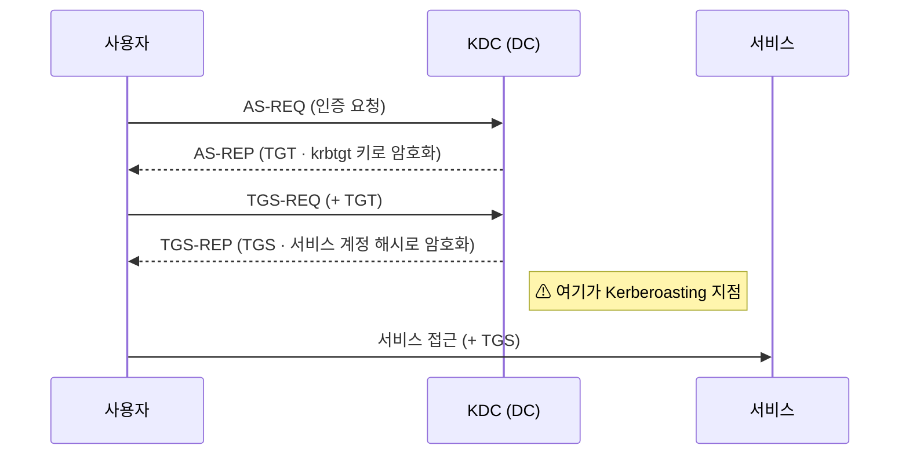
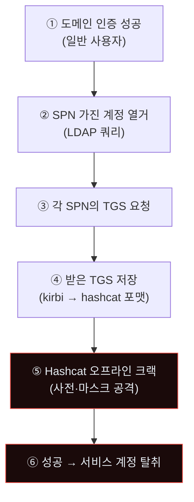
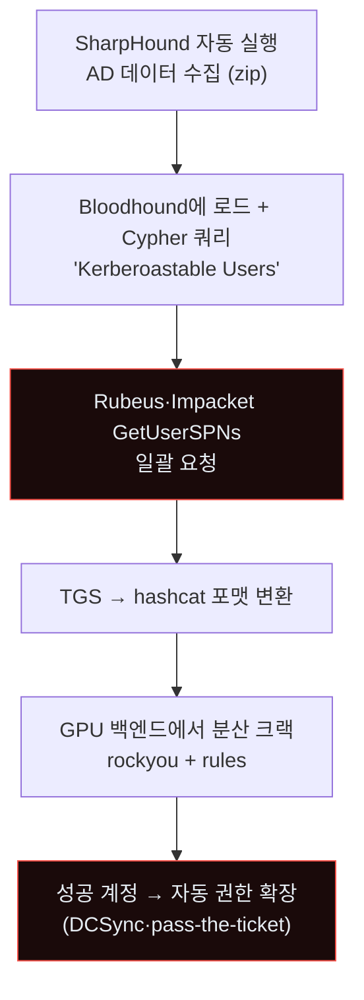
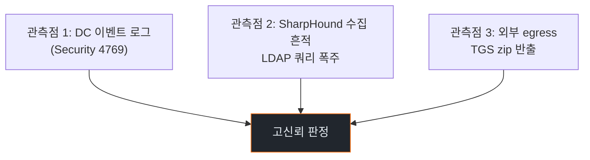
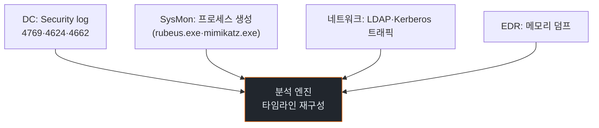
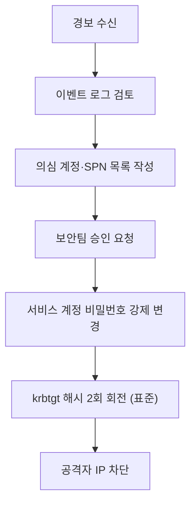
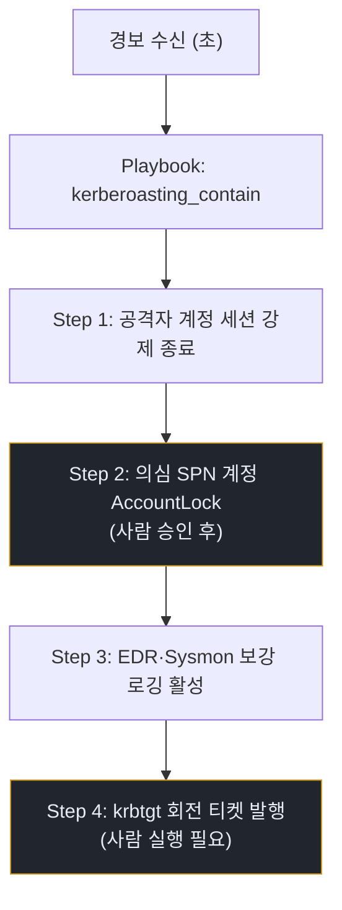
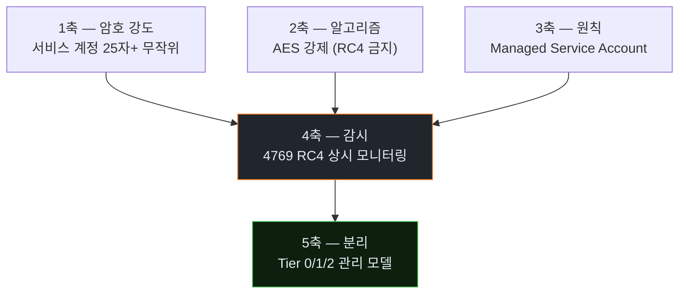
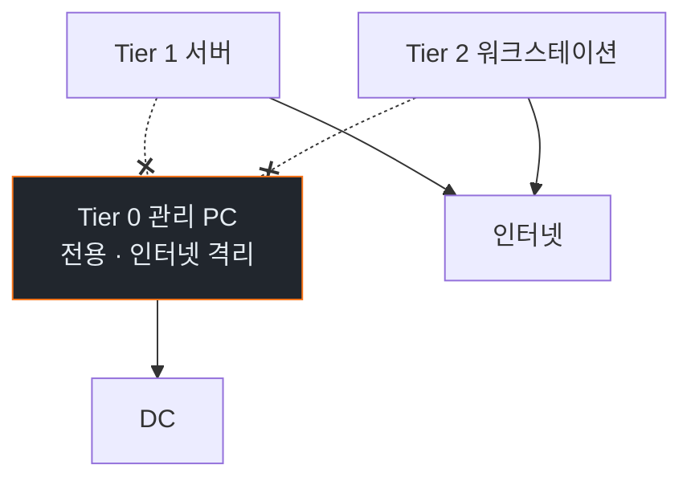

# Week 03: AD Kerberoasting 자동화 — 에이전트가 도메인을 분 단위로 장악한다

## 이번 주의 위치
공급망·웹 입력을 살펴본 뒤, 이번 주는 **기업 내부 인증 인프라**인 Active Directory(AD)의 고전 공격이 *에이전트화*되는 양상을 다룬다. Kerberoasting은 새로운 공격이 아니다. 핵심 변화는 **BloodHound + SharpHound + Hashcat**의 조합을 에이전트가 *연속 파이프라인*으로 수행한다는 점이다. 기존 며칠이 걸리던 AD 침투가 **30~60분**으로 단축된다. 이번 주는 이 공격의 *전체 IR*을 본다.

## 학습 목표
- Kerberos 인증의 *공격 표면*(TGT·TGS·SPN)을 이해한다
- Kerberoasting·AS-REP Roasting·DCSync의 차이를 안다
- 에이전트가 BloodHound 데이터 수집·Cypher 쿼리·티켓 요청·크랙을 *자동화*하는 과정을 관찰한다
- 6단계 IR 절차를 AD 사고에 적용한다
- Human vs Agent 대응 비교 + 조직의 *AD 하드닝* 체크리스트 생성

## 전제 조건
- C19 · C20 w1~w2
- Active Directory 기본 (OU·GPO·Kerberos)
- 해시·크래킹 개념

## 실습 환경 (추가)
- `dc` VM (10.20.30.60) — Samba 4 AD DC 모사 (교육용)
- 샘플 사용자·SPN 미리 배포

## 강의 시간 배분 (3시간)

| 시간 | 내용 |
|------|------|
| 0:00-0:40 | Part 1: 공격 해부 |
| 0:40-1:10 | Part 2: 탐지 |
| 1:10-1:20 | 휴식 |
| 1:20-1:50 | Part 3: 분석 |
| 1:50-2:30 | Part 4: 초동대응 (Human vs Agent) |
| 2:30-2:40 | 휴식 |
| 2:40-3:10 | Part 5: 보고·공유 |
| 3:10-3:30 | Part 6: 재발방지 |
| 3:30-3:40 | 퀴즈 + 과제 |

---

## 용어 해설

| 용어 | 설명 |
|------|------|
| **TGT** | Ticket Granting Ticket — 사용자 로그인 증명서 |
| **TGS** | Ticket Granting Service ticket — 특정 서비스 접근 증명 |
| **SPN** | Service Principal Name — 서비스 식별자 (예: `MSSQLSvc/host:1433`) |
| **Kerberoasting** | SPN을 가진 계정의 TGS를 요청해 *오프라인 크랙* |
| **AS-REP Roasting** | 사전 인증 비활성 계정의 AS-REP를 *오프라인 크랙* |
| **DCSync** | 도메인 복제 권한으로 *전체 해시 덤프* |
| **Golden Ticket** | `krbtgt` 해시로 임의 TGT 위조 |
| **BloodHound** | AD 관계 그래프 분석 도구 |
| **SharpHound** | BloodHound의 *수집기* (.NET) |

---

# Part 1: 공격 해부 (40분)

## 1.1 Kerberos 인증 흐름과 공격점



공격점: **TGS-REP가 *서비스 계정의 암호 해시*로 암호화됨** → 약한 서비스 계정 암호면 *오프라인 크랙 가능*.

## 1.2 Kerberoasting 공격 절차



## 1.3 에이전트 자동화



에이전트의 우위:
- BloodHound의 *Cypher 결과*를 자연어로 *직접 해석* → 우선순위 자동 판단
- 실패 시 *다른 공격 경로*(AS-REP Roasting, Unconstrained Delegation) 자동 전환
- 크랙 완료 시 *즉시* 다음 단계 실행

## 1.4 Kerberoasting의 실제 명령 흐름

### 수집 (Impacket)
```bash
impacket-GetUserSPNs -request domain/user:pass -dc-ip 10.20.30.60
# 각 SPN 계정의 TGS가 `$krb5tgs$23$*` 형식으로 저장됨
```

### 크랙 (Hashcat)
```bash
hashcat -m 13100 tgs.txt rockyou.txt -r rules/best64.rule
# -m 13100 = Kerberos 5 TGS-REP etype 23
```

### 에이전트 통합
```python
# 에이전트 의사 코드
spns = run("impacket-GetUserSPNs ...")
for spn in parse(spns):
    save_hash(spn)
results = run("hashcat -m 13100 ...")
for cracked in parse(results):
    operator = pick_next_move(cracked)  # LLM 판단
    run(operator.cmd)
```

---

# Part 2: 탐지 (30분)

## 2.1 탐지의 3관측점



## 2.2 Windows Event 4769 패턴

- Event ID: **4769** (Kerberos service ticket requested)
- Ticket Encryption Type: **0x17** (RC4-HMAC — 취약)
- Account Name: 일반 사용자
- Service Name: 여러 SPN 계정에 대해 *연속 요청*

### SIGMA 룰

```yaml
title: Kerberoasting — 4769 RC4 burst
logsource:
  product: windows
  service: security
detection:
  selection:
    EventID: 4769
    TicketEncryptionType: '0x17'
  timeframe: 60s
  condition: selection | count(ServiceName) by AccountName > 5
falsepositives:
  - 레거시 서비스 다수 사용
level: high
```

## 2.3 SharpHound 수집 흔적 — LDAP

- LDAP search filter가 `(objectClass=*)` 같은 *대량 조회*
- 결과 크기가 이례적
- 특정 사용자 계정이 *거의 모든 OU*를 조회

## 2.4 Bastion 스킬 — `detect_kerberoasting`

```python
def detect_kerberoasting(windows_events):
    by_user = {}
    for e in windows_events:
        if e.event_id == 4769 and e.ticket_enc_type == "0x17":
            by_user.setdefault(e.account_name, set()).add(e.service_name)
    return [(u, list(s)) for u, s in by_user.items() if len(s) >= 5]
```

---

# Part 3: 분석 (30분)

## 3.1 분석 질문

1. 어떤 사용자 계정이 *공격 시작*인가?
2. 어떤 SPN들이 *열거*됐나?
3. 어떤 TGS가 *실제 크랙 성공*했나?
4. 크랙된 계정으로 *추가 공격* 있었나?
5. DCSync·Golden Ticket 단계까지 진행됐나?

## 3.2 분석 데이터 소스



## 3.3 타임라인 재구성

```
T+00:00 초기 로그인 (4624) — user@domain
T+00:05 LDAP 대량 조회 (SharpHound)
T+00:10 4769 burst — 12 SPN에 대해 RC4 요청
T+00:15 외부 egress (SharpHound zip upload 의심)
T+00:45 (오프라인) 크랙 성공 추정
T+01:00 4624 — 크랙된 서비스 계정으로 로그인
T+01:05 4662 — 도메인 복제 권한 행사 (DCSync 의심)
```

---

# Part 4: 초동대응 (Human vs Agent · 40분)

## 4.1 Human 대응



소요: 2~8시간 (서비스 영향 고려 승인 포함).

## 4.2 Agent(Bastion) 대응



소요: 수 분 (자동 가능 부분) + 사람 승인 절차

### 4.2.1 왜 AD 사고는 *Agent 100% 자동*이 안 되나

AD는 *가용성*이 절대적이다. 잘못된 자동 차단은 *전사 로그인 장애*를 만든다.

- krbtgt 회전 → 전사 재인증 발생 (계획 필요)
- 서비스 계정 잠금 → 해당 서비스 다운
- 계정 잠금 → 정상 사용자 영향 가능

따라서 *억제는 빠르게*, *복구 조치는 사람 승인*으로 분리.

## 4.3 비교표

| 축 | Human | Agent |
|----|-------|-------|
| 첫 탐지 → 초기 격리 | 1~3시간 | **5~30분** |
| krbtgt 회전 결정 | 사람 | 사람 (에이전트는 준비만) |
| 영향 평가 | *강함* | 제한 |
| 24시간 모니터링 | 교대 근무 | **연속** |

---

# Part 5: 보고·상황 공유 (30분)

## 5.1 AD 사고의 특수성

AD 사고는 *도메인 전체 신뢰*에 영향. 다음 단계 공유 필수:

- **CISO·CEO 즉시**: 도메인 장악 가능성은 *사업 연속성 리스크*
- **법무**: GDPR·개인정보 영향 가능 (AD는 직원 정보 보유)
- **감사**: *도메인 복구 절차*가 감사 기록 대상
- **직원**: 강제 로그아웃·비밀번호 재설정 공지

## 5.2 임원 브리핑

```markdown
# Incident — Kerberoasting (D+30min)

**What happened**: 한 일반 계정에서 SPN 다수에 대한 RC4 TGS 요청 burst.
                  Bastion이 세션 종료·권한 제한 완료. krbtgt 회전은 D+1 (계획).

**Impact**: 12 SPN 열거. 크랙 여부 *확인 중*. 직원·고객 영향 *없음*.

**Ask**: krbtgt 2회 회전 (전사 재인증 동반)에 대한 D+1 승인.
```

## 5.3 기술팀 공유

- BloodHound 그래프 + 공격 경로 시각화
- 4769·4662 쿼리 필터 즉시 배포
- EDR에 Rubeus/Mimikatz 시그니처 업데이트

---

# Part 6: 재발방지 (20분)

## 6.1 AD 하드닝 5축



## 6.2 각 축의 구체

### 1축 암호 강도
- 서비스 계정 25자 이상, 무작위 (사람 기억 불가능해야 함)
- MSA(Managed Service Account) 우선 — 암호 자동 관리

### 2축 알고리즘
```
Set-ADUser -Identity svc_account -KerberosEncryptionType AES128,AES256
```
RC4 요청은 *이제 의심*이다.

### 3축 MSA·gMSA
- gMSA(Group Managed Service Account)는 암호가 *자동 회전*
- 관리자가 암호를 모르는 상태가 정상

### 4축 상시 감시
- 4769 RC4 burst에 *즉시 경보*
- BloodHound collection 시도 자체 감지

### 5축 Tier 모델
- Tier 0 (DC·관리자) — 별도 관리 PC, 일반 네트워크 접근 금지
- Tier 1 (서버)
- Tier 2 (워크스테이션)

## 6.3 조직 체크리스트

- [ ] 모든 서비스 계정 암호 25자+·AES 강제
- [ ] gMSA 도입 (가능한 모든 서비스)
- [ ] 4769 RC4 SIGMA 룰 배포
- [ ] BloodHound 수집 흔적 탐지 룰
- [ ] Tier 0 관리 PC 분리
- [ ] krbtgt 연 2회 정기 회전
- [ ] 특권 계정 *별도 MFA*

---

## 과제

1. **공격 재현 (필수)**: 실습 AD에서 Kerberoasting PoC 성공 1건. TGS hash 파일 + 크랙 결과.
2. **6단계 IR 보고서 (필수)**: 공격→탐지→분석→초동대응→보고→재발방지.
3. **Human vs Agent 타임 비교 (필수)**: 두 모드 각각의 경과 시간.
4. **(선택 · 🏅 가산)**: BloodHound Cypher 쿼리 3개로 *공격 경로* 탐색 결과.
5. **(선택 · 🏅 가산)**: gMSA 도입 계획서 1쪽.

---

## 부록 A. 관련 ATT&CK 기법

- T1558.003 — Steal or Forge Kerberos Tickets: Kerberoasting
- T1558.004 — AS-REP Roasting
- T1003.006 — DCSync
- T1207 — Rogue Domain Controller
- T1484.002 — Domain Trust Modification

## 부록 B. *Tier 0 관리 PC* 구성 참고 도식



---

## 실제 사례 (WitFoo Precinct 6 — Kerberos auth + DS object 변경)

> 출처: WitFoo Precinct 6 Cybersecurity Dataset (Apache 2.0)
> 본 lecture *AD Kerberoasting (T1558.003) + DCSync (T1003.006)* 학습 항목과 매핑되는 dataset 의 *Kerberos 4768 + NTLM 4776 + DS object 5136* 통계.

### Case 1: Kerberos auth 분포 — TGT/TGS 발급

| message_type | 의미 | 건수 |
|--------------|------|------|
| 4768 | Kerberos TGT 요청 | 2,703 |
| 4776 | NTLM auth | 15,382 |
| 4624 | logon success (Kerberos+NTLM 혼합) | 17,482 |
| 4634 | logoff | 16,934 |

→ **NTLM 4776 (15K) > Kerberos 4768 (2.7K)** = *NTLM 잔존* 환경. Kerberoasting 보다 **NTLM relay 가 더 위험**.

### Case 2: AD 변경 evidence — DCSync 후보

| message_type | 의미 | 건수 |
|--------------|------|------|
| 5136 | Directory service object modified | **380** |
| 4670 | Permissions on object changed | 188 |
| 4798/4799 | group enumeration | 7,686 |

→ 5136 380건 = AD 객체 변경. T1003.006 DCSync (도메인 컨트롤러에서 hash 추출) 의 *직접 evidence* 일 가능성. 학생 점검 시 *5136 spike 시 source process* 확인 필수.

### Case 3: BloodHound 같은 enumeration 의 *direct evidence* — 4798/4799

dataset 의 4798 (user-local group enum) + 4799 (security-enabled group enum) 합계 **7,686 건** = BloodHound/SharpHound 같은 도구의 *enumeration 시도* 의 reference.

```text
정상 baseline: 4798/4799 = 0.37% of total
SharpHound 실행 시: spike (분 단위에 수천 건 — 본 dataset 의 365일 baseline 와 같음)
```

**해석 — 본 lecture (Kerberoasting) 와의 매핑**

| 학습 항목 | 본 record 의 증거 |
|-----------|------------------|
| **NTLM relay > Kerberoasting** | 본 환경 NTLM 6배 많음 → NTLM disable 우선 |
| **DCSync 의심** | 5136 380건 = 365일 baseline. 분 단위 spike 시 즉시 critical |
| **enumeration 검출** | 4798/4799 7,686건 = SharpHound 행위 baseline |
| **MITRE 매핑** | T1558.003 + T1003.006 + T1069 (Group Discovery) 모두 dataset 매핑 가능 |

**학생 실습 액션**:
1. 본 dataset NTLM:Kerberos 비율 (6:1) 측정 → 학생 환경의 *NTLM disable 진행도* 평가
2. 5136 + 4670 timestamp 시간 분포 → spike 시 *DCSync 의심* 자동 alert
3. SharpHound 실행 시 dataset 7,686 건 baseline 와 비교 → *5분 내 100건+* 시 enumeration 의심


