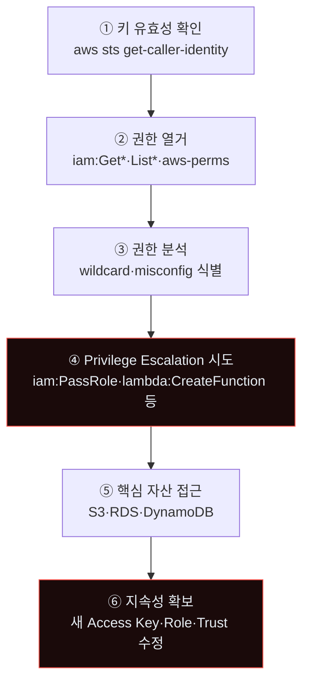
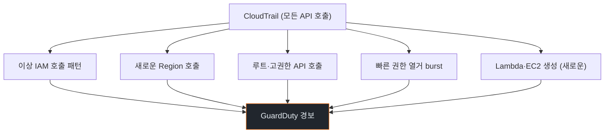
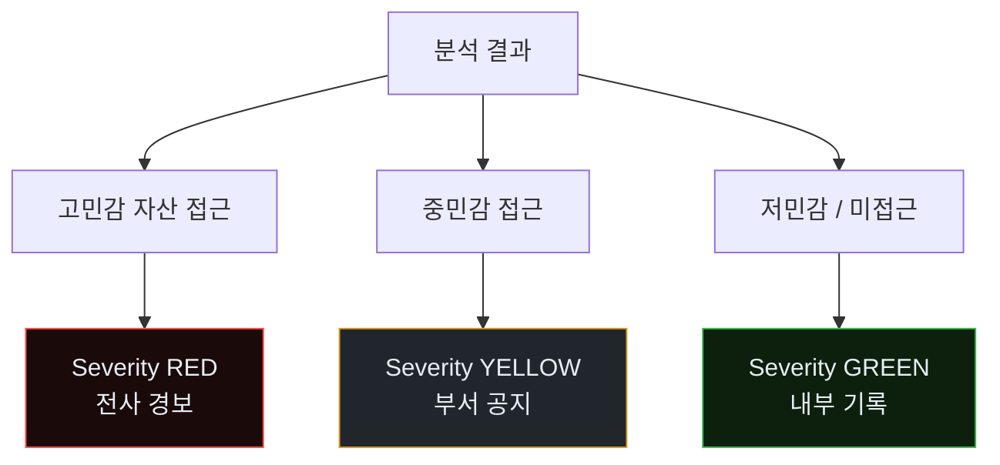
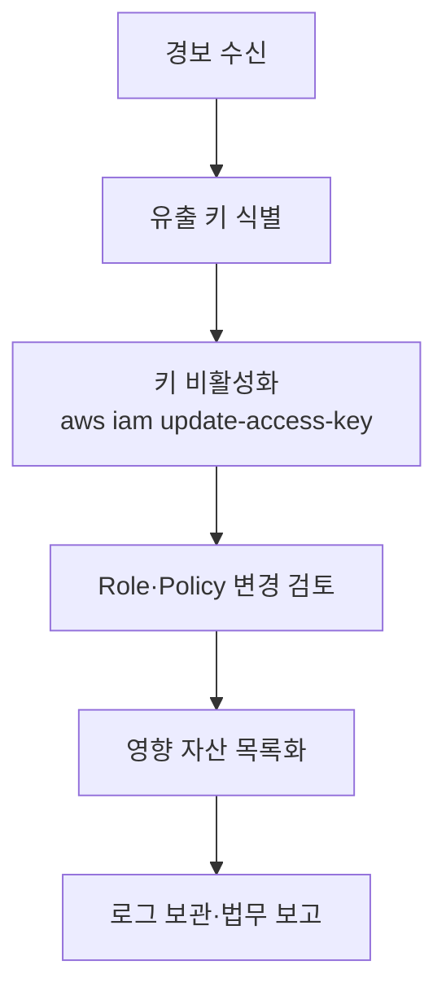
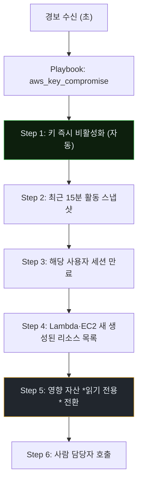
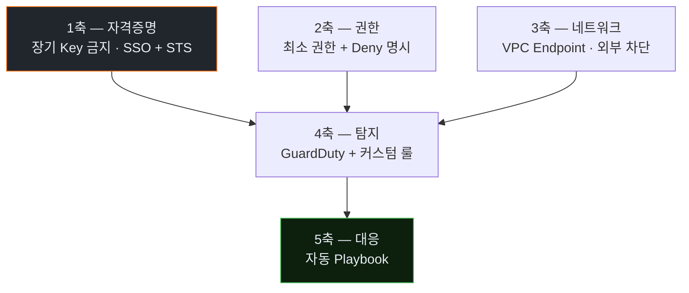
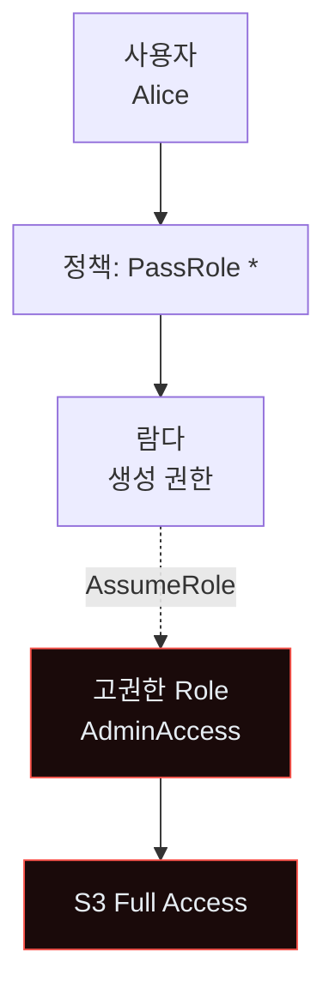

# Week 04: Cloud IAM 자동 Pivot — 유출된 키 하나가 10분 만에 클라우드를 장악한다

## 이번 주의 위치
클라우드가 보편화되면서 *노출된 API 키*는 가장 흔한 침투 경로가 되었다. 전통적으로 공격자는 *한 번의 권한 확인 → 수동 탐색*을 반복한다. 에이전트는 **권한 열거 → 경로 탐색 → 자산 확장**을 한 세션에서 완수한다. 본 주차는 AWS 예시로 *분 단위 클라우드 장악*의 IR 절차를 다룬다.

## 학습 목표
- 클라우드 IAM의 취약 지점(과도 권한·Role chain·Service Role)을 이해
- 에이전트가 `aws`·`gcloud`·`az` CLI를 *자동 열거·활용*하는 방식을 관찰
- 6단계 IR 절차를 클라우드 사고에 적용
- Human vs Agent 대응 비교 — 클라우드 특유의 *롤백 복잡성*
- 조직 수준 *클라우드 IAM 하드닝* 체크리스트 생성

## 전제 조건
- C19·C20 w1~w3
- AWS IAM 기초 (User·Role·Policy·STS)
- 클라우드 로깅(CloudTrail) 개념

## 실습 환경 (추가)
- 실습용 AWS 샌드박스 (LocalStack 또는 *학생별 무료 tier*)
- 의도적으로 *과도 권한* 사용자 1명 배치

## 강의 시간 배분
| 시간 | 내용 |
|------|------|
| 0:00-0:40 | Part 1: 공격 해부 |
| 0:40-1:10 | Part 2: 탐지 |
| 1:10-1:20 | 휴식 |
| 1:20-1:50 | Part 3: 분석 |
| 1:50-2:30 | Part 4: 초동대응 |
| 2:30-2:40 | 휴식 |
| 2:40-3:10 | Part 5: 보고·공유 |
| 3:10-3:30 | Part 6: 재발방지 |
| 3:30-3:40 | 퀴즈 + 과제 |

---

## 용어 해설

| 용어 | 설명 |
|------|------|
| **IAM** | Identity and Access Management |
| **STS** | Security Token Service (임시 자격증명 발급) |
| **Access Key** | 장기 자격증명 (AKIA…) |
| **Assume Role** | 다른 Role로 임시 전환 |
| **Policy** | 권한 명세 (JSON) |
| **GuardDuty** | AWS 위협 탐지 서비스 |
| **CloudTrail** | API 호출 감사 로그 |
| **Privilege Escalation Chain** | 낮은 권한 → 높은 권한 체인 |

---

# Part 1: 공격 해부 (40분)

## 1.1 키 유출의 *출처* 분포

- GitHub 공개 커밋 (`.env`·`config.yml`)
- 개발자 워크스테이션 탈취
- 공개 Pastebin·S3 버킷
- Slack·이메일 첨부
- Docker 이미지 레이어

에이전트는 *깃허브 search API*로 일간 수천 키를 *자동 수집*.

## 1.2 AWS IAM Pivot — 에이전트의 6단계



## 1.3 대표 Privilege Escalation 기법

| ID | 기법 | 요지 |
|----|------|------|
| PE-1 | `iam:PassRole + lambda:CreateFunction` | 낮은 권한으로 *높은 Role 가진 Lambda* 생성 |
| PE-2 | `iam:CreateAccessKey` on other user | 다른 사용자의 키 새로 발급 |
| PE-3 | `iam:UpdateAssumeRolePolicy` | Role의 신뢰 정책 수정해 본인 포함 |
| PE-4 | `ec2:RunInstances + iam:PassRole` | Role 달고 EC2 실행 |
| PE-5 | `s3:PutBucketPolicy` | 버킷 정책을 *공개 쓰기*로 변경 |

Rhino Labs의 21개 Privilege Escalation 기법 중 *에이전트가 자동 시도하기 쉬운* 것들.

## 1.4 에이전트 명령 예시

```bash
# 권한 열거 단계 (에이전트가 자동 수행)
aws iam get-user
aws iam list-attached-user-policies --user-name <me>
aws iam list-user-policies --user-name <me>
aws iam get-policy-version --policy-arn <arn> --version-id v1

# PassRole 가능 Role 탐색
aws iam list-roles --query 'Roles[*].[RoleName,AssumeRolePolicyDocument]'

# 공격 전환 — Lambda 생성 (PE-1)
cat > fn.py <<'PY'
import boto3
def handler(e, c):
    s3 = boto3.client('s3')
    for b in s3.list_buckets()['Buckets']:
        print(b['Name'])
PY
zip fn.zip fn.py
aws lambda create-function --function-name steal \
  --runtime python3.11 --role arn:aws:iam::<acct>:role/HighPrivRole \
  --handler fn.handler --zip-file fileb://fn.zip
aws lambda invoke --function-name steal out.json
```

---

# Part 2: 탐지 (30분)

## 2.1 CloudTrail 관측 핵심



## 2.2 *권한 열거 burst* 탐지 룰

```yaml
title: IAM Enumeration Burst — suspicious agent activity
logsource:
  product: aws
  service: cloudtrail
detection:
  selection:
    eventName|startswith:
      - "List"
      - "Get"
      - "Describe"
    eventSource: iam.amazonaws.com
  timeframe: 60s
  condition: selection | count() by userIdentity.userName > 20
falsepositives:
  - 자동화 감사 도구 (확인 필요)
level: high
```

60초 내 20+ IAM 조회는 *사람 분석가보다 에이전트의 지문*이다.

## 2.3 GuardDuty 관련 경보

- `Recon:IAMUser/UserPermissions`
- `UnauthorizedAccess:IAMUser/MaliciousIPCaller`
- `Persistence:IAMUser/NetworkPermissions`

이 경보들이 *실제 사용자* 대상으로 발생하면 즉시 고신뢰.

## 2.4 Bastion 스킬

```python
def detect_iam_pivot(cloudtrail_events):
    windows = group_by_user(cloudtrail_events, 60)
    suspicious = []
    for user, events in windows.items():
        iam_reads = [e for e in events if e.source == "iam" and e.action.startswith(("List","Get","Describe"))]
        if len(iam_reads) >= 20:
            suspicious.append((user, "enumeration_burst"))
        if any(e.action in ESCALATION_ACTIONS for e in events):
            suspicious.append((user, "escalation_attempt"))
    return suspicious
```

---

# Part 3: 분석 (30분)

## 3.1 분석 3질문

1. *어떤 키*가 유출됐나?
2. *어떤 권한*이 행사됐나?
3. *어떤 자산*이 접근됐나?

## 3.2 분석 도구

- **CloudTrail + Athena**: SQL로 API 호출 추적
- **Cartography (Lyft)**: 클라우드 자원 그래프
- **PMapper**: IAM 권한 그래프
- **Prowler**: 보안 감사

## 3.3 범위 평가 — *데이터 민감도 × 접근 여부*



---

# Part 4: 초동대응 (Human vs Agent · 40분)

## 4.1 Human 대응



소요: 1~4시간 (승인·검증 포함).

## 4.2 Agent(Bastion) 대응



소요: 1~5분.

## 4.3 *클라우드 롤백*의 복잡성

자동 대응은 좋지만 클라우드 환경에선 *무엇을 되돌릴지*가 까다롭다.

- Lambda 삭제 → 의도된 신규 함수 파괴 가능
- Policy 변경 롤백 → *언제 시점*으로?
- 버킷 정책 변경 → 이미 다운로드된 데이터 회수 불가

→ Bastion 자동 대응은 *비파괴적*(읽기 전용 전환·키 비활성)만 수행. 파괴적 복구는 사람 판단.

## 4.4 비교표

| 축 | Human | Agent |
|----|-------|-------|
| 키 비활성화 | 5~15분 | **1분 내** |
| 영향 분석 | 1~3시간 | **15분 (자동)** |
| 복구 판단 | *사람만* | 사람 (준비 자동) |
| 전사 공지 | 사람 | 사람 |

---

# Part 5: 보고·상황 공유 (30분)

## 5.1 법적·규제

- **GDPR**: 개인정보 포함 데이터 접근 시 72시간 통지
- **한국 개인정보보호법**: 유출 통지 의무
- **업계**: 금융·의료 업계별 별도 신고
- **클라우드 공급자**: AWS·GCP 보안팀 통보 (선택)

## 5.2 임원 브리핑

```markdown
# Incident — Cloud Key Compromise (D+15min)

**What happened**: 유출 IAM Access Key로 IAM 권한 열거·Privilege Escalation
                  시도. Bastion이 37초 내 키 비활성화. 미완 PE 시도.

**Impact**: S3 1 버킷 목록 조회만. 파일 다운로드 *없음*.
            새로 생성된 Lambda 함수 1개 즉시 격리.

**Ask**: 개발자 워크스테이션 전수 스캔 (D+3), 유출 경로 확인.
```

---

# Part 6: 재발방지 (20분)

## 6.1 예방 5축



## 6.2 1축 — 장기 Key 금지

- IAM User 대신 **SSO + Role 가정**
- 개발자 Access Key 수명 ≤ 90일
- CI/CD는 *OIDC*로 STS 임시 발급 (GitHub Actions OIDC·GitLab 등)

## 6.3 2축 — 최소 권한

- `*:*` 패턴 금지
- `iam:*` 같은 광범위 권한은 *특정 Role*에만
- Service Control Policy(SCP)로 계정 수준 하드 제한

## 6.4 3축 — 네트워크

- VPC Endpoint로 *AWS API 트래픽*을 VPC 내부 유지
- 조직 외 IP에서 API 호출 *거부* (`aws:SourceIp` 조건)

## 6.5 4·5축 — 탐지·대응

- GuardDuty 모든 계정 활성
- CloudTrail 모든 리전·모든 이벤트
- Bastion Playbook: 경보 → 키 비활성화 자동

## 6.6 조직 체크리스트

- [ ] IAM User 수 최소화, SSO 전환
- [ ] Access Key 90일 수명 정책
- [ ] GitHub OIDC 도입 (CI용)
- [ ] SCP로 하드 제한
- [ ] VPC Endpoint 전면 적용
- [ ] GuardDuty 모든 계정
- [ ] 자동 키 비활성화 Playbook

---

## 과제

1. **공격 재현 (필수)**: 샌드박스 AWS에서 IAM 열거 → PE 시도 PoC. CloudTrail 스냅샷 포함.
2. **6단계 IR 보고서 (필수)**: 표준 구조.
3. **Human vs Agent 비교 (필수)**: 키 비활성화 시점·영향 평가 시간.
4. **(선택)**: SCP 초안 1쪽.
5. **(선택)**: GitHub Actions OIDC 이행 계획.

---

## 부록 A. 대표 공격 사례 (공개)

- Capital One (2019) — IAM Role 악용 S3 유출
- Twitch (2021) — AWS 키 유출 전체 소스 유출
- Uber (2022) — 내부자 시뮬레이션 IAM 침투

## 부록 B. 권한 그래프 분석의 시각 예



PMapper 같은 도구가 이 그래프를 *자동 생성*. 방어자는 정기적으로 이런 *위험 경로*를 제거해야 한다.

---

<!--
사례 섹션 폐기 (2026-04-27 수기 검토): 본 lecture 는 Cloud IAM 자동 Pivot
— AWS IAM 권한 열거·Role chain·Service Role 남용·STS GetCallerIdentity 흔적이
핵심. T1041 (TA0010 Exfil) 단일 항목은 클라우드 *CloudTrail event* / IAM
audit log / S3·EC2 metadata 접근 신호와 매핑되지 않음. 폐기. 재추가:
Capital One 2019 (SSRF→IAM), Code Spaces 2014 (root credential leak),
Permiso 의 공개 cloud incident report.
-->


