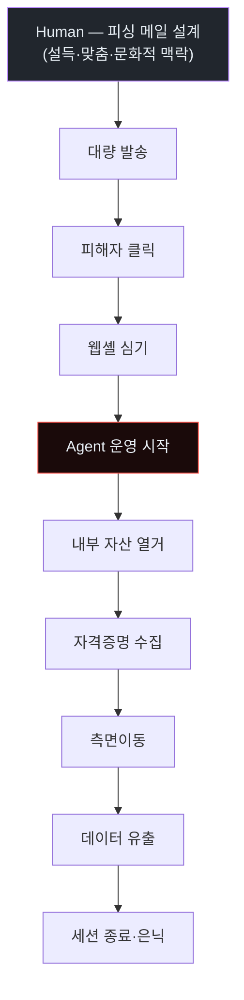
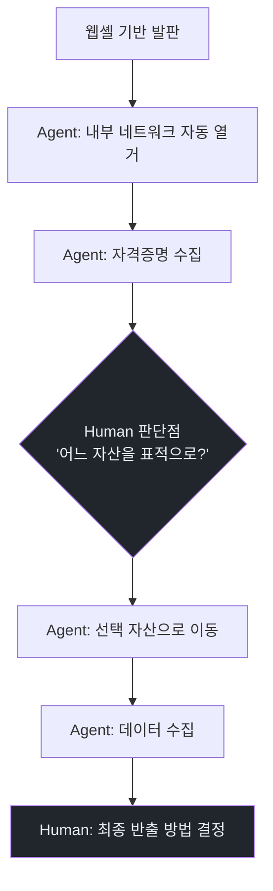
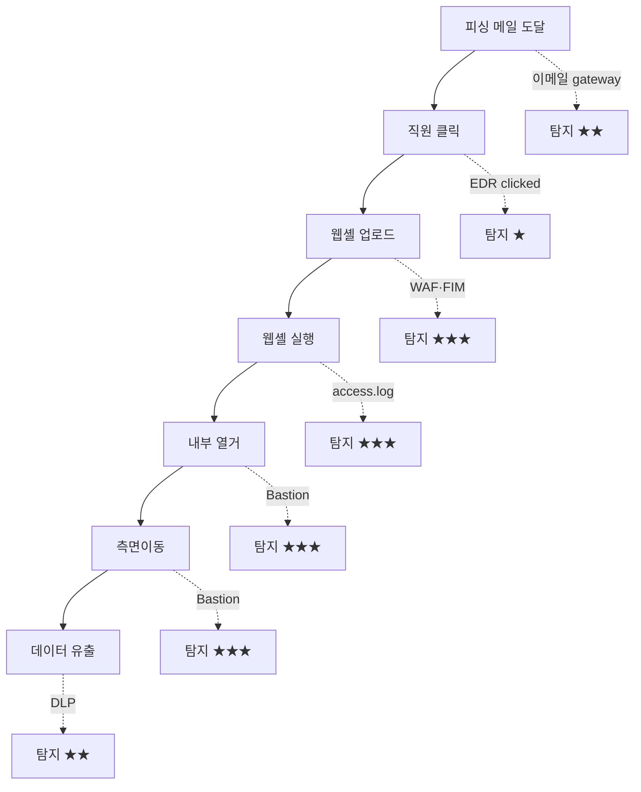
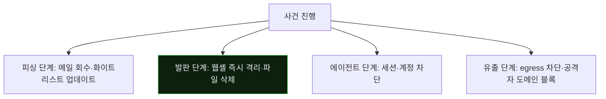
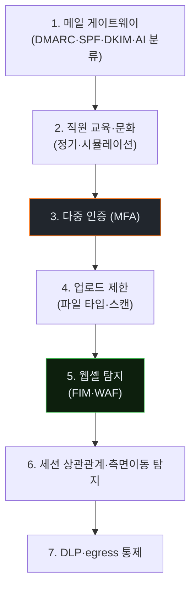

# Week 07: Multi-stage 피싱→웹셸→측면이동 — Human+Agent 하이브리드

## 이번 주의 위치
지금까지 공격자는 *에이전트 단독*이었다. 이번 주는 현실적 공격에 더 가까운 **하이브리드 공격** — 사람이 초기 피싱으로 발판을 확보하고, 에이전트가 *그 이후*를 분 단위로 진행한다. 이 구조가 위험한 이유는 *사람의 감과 에이전트의 속도*가 결합되기 때문이다.

## 학습 목표
- 피싱·초기 접근·웹셸·측면이동의 전체 체인 이해
- Human 공격자와 Agent 공격자가 *역할을 나누는* 방식 관찰
- 6단계 IR 절차를 *체인 공격*에 적용
- 킬체인 각 단계에서의 *Human vs Agent 방어* 비교
- *인간 요소*(직원 보안 인식)와 *기술 요소*의 결합

## 전제 조건
- C19·C20 w1~w6
- 피싱 개념 · 웹셸 기초 · 측면이동 (w5 C19)

## 강의 시간 배분
(본 과정 공통 — 이하 동일 구조)

---

## 용어 해설

| 용어 | 설명 |
|------|------|
| **Spear Phishing** | 표적형 피싱 |
| **OAuth 피싱** | 합법 로그인 페이지로 위장한 OAuth 동의 탈취 |
| **Initial Access Broker** | 초기 접근을 *판매*하는 공격자 생태계 |
| **Webshell** | 침투 후 원격 명령 실행용 웹 스크립트 |
| **Pivot** | 접근 지점에서 다른 자산으로 이동 |
| **BEC** | Business Email Compromise |

---

# Part 1: 공격 해부 (40분)

## 1.1 Human+Agent 하이브리드 체인



- **Human 강점**: 사회적 맥락·언어·심리 (피싱)
- **Agent 강점**: 초기 발판 후 *속도·지속성*

## 1.2 피싱의 진화 — *GenAI가 만든 피싱*

| 전통 피싱 | AI 피싱 |
|-----------|---------|
| 오탈자·어색한 번역 | 자연스러운 현지어 |
| 대량 동일 본문 | *각 수신자에 맞춤* |
| 정적 템플릿 | LinkedIn·공개 소스 기반 *개인화* |
| 주 1회 캠페인 | *매일 새로운* |

결과: 직원 교육이 *오탈자·URL*에 집중한 기존 방식은 *무효화*된다.

## 1.3 웹셸 삽입의 전형

```php
<?php
// small.php - 의도적 단순 (탐지 회피)
if(isset($_REQUEST['c'])) {
    system(base64_decode($_REQUEST['c']));
}
?>
```

에이전트는 이 웹셸에 *명령 요청을 자동 생성*:

```
GET /uploads/small.php?c=aWQ=  # base64 "id"
```

## 1.4 측면이동 — 하이브리드 관점

에이전트가 *분 단위 측면이동*. 사람은 *결정적 순간*만 개입.



---

# Part 2: 탐지 (30분)

## 2.1 각 단계 탐지 가능성



*가장 탐지하기 쉬운 단계*: 웹셸 업로드·실행. 조직은 이 단계를 놓치면 나머지 체인에서 *속도전 패배*.

## 2.2 웹셸 탐지

- 업로드 디렉토리의 *.php·.jsp·.aspx* 생성 이벤트
- WAF의 업로드 필터
- FIM(파일 무결성 모니터링) 경보
- 정적 룰 예: `<?php.*system\(.*base64_decode`

## 2.3 측면이동 탐지 (C19 w5 연장)
- 세션 클러스터링·SPN 조회·ssh 실패

---

# Part 3: 분석 (30분)

## 3.1 체인 재구성

한 사건의 *모든 단계*를 연결. 각 단계에 *시점·증거·영향*.

```
[T+0]   피싱 메일 발송 (공격자 도메인 예: mlmicrosoft-security.com)
[T+10m] 직원 A 클릭 (보안 교육 필요)
[T+15m] OAuth 토큰 발급 (합법 로그인처럼)
[T+30m] 공격자 직원 메일박스 접근
[T+45m] 첨부 경로에서 *내부 공유 위치* 발견
[T+1h]  내부 웹앱에 업로드 (피싱 세션의 *유효 세션 쿠키 활용*)
[T+1h10m] 웹셸 업로드 성공
[T+1h12m] 에이전트 실행 감지 (Bastion)
```

## 3.2 공격 주체 식별

- Human 단계(피싱)의 *인프라* — 도메인 등록 정보, 호스팅 IP
- Agent 단계의 *지문* — IAT·경로 다양성·변형

두 *공격 주체*를 *분리 기술*해야 IR 보고서가 정확하다.

---

# Part 4: 초동대응 (40분)

## 4.1 체인 *단절* 전략



*어느 단계*에서 단절해도 유효. 가능한 *빠른 단계*에서.

## 4.2 Agent 자동 대응

Bastion Playbook: `hybrid_chain_response`
- 웹셸 파일 감지 → 즉시 격리 (파일 이름 변경 + 실행권한 제거)
- 해당 웹 경로 요청 *일시 차단*
- 공격자 도메인 *내부 DNS 싱크홀*
- 직원 A 세션 전체 종료·MFA 재인증 요구

## 4.3 Human 판단점

- 피싱 메일의 *조직 내 전파* 여부 (회수 판단)
- 유출된 *메일 본문*의 민감도
- 공격자 인프라에 대한 *법적 대응* (경찰·CERT)

## 4.4 비교표

| 축 | Human | Agent |
|----|-------|-------|
| 피싱 메일 회수 | 사람 | 이메일 게이트웨이 자동 |
| 웹셸 격리 | 수십 분 | **수 초** |
| 세션 차단 | 사람 승인 | Agent 자동 (사람 승인 옵션) |
| 공격자 인프라 조치 | *사람만* | 사람 |

---

# Part 5: 보고·상황 공유 (30분)

## 5.1 직원 공지의 *신중함*

피싱 대응에선 *전 직원 공지*가 양날의 검.

- **긍정**: 추가 피해 예방
- **부정**: 공격자가 *정보 수집*에 이용

권장: *해당 팀 내부만 즉시*, *전사 공지는 24h 이후 요지만*.

## 5.2 임원 브리핑 (하이브리드 사건 특수)

```markdown
# Incident — Phishing → Webshell → Pivot (D+2h)

**What happened**: AI 맞춤 피싱으로 직원 A의 메일 접근 유출.
                   이후 웹 앱에 웹셸 업로드 시도. Bastion이 웹셸 생성
                   18초 내 감지·격리.

**Impact**: 직원 A 메일 최근 30일 접근. 내부 공유 문서 *열람 여부 확인 중*.
            고객 데이터 영향 *없음*.

**Ask**: 전사 MFA 의무화 D+3 승인. 피싱 대응 교육 월 1회 전환.
```

---

# Part 6: 재발방지 (20분)

## 6.1 *다층 방어* — 체인마다 기회



하나의 층이 실패해도 다음 층이 막는다.

## 6.2 가장 큰 효과 3가지 (2026)

1. **Phishing-resistant MFA** (FIDO2·보안 키) — 패스워드 유출해도 무효
2. **BEC 탐지**: 내부 메일 *변경된 결제 경로*에 대한 검증
3. **Just-in-time 권한**: 특권 접근은 *일회 승인*

## 6.3 체크리스트

- [ ] 전사 FIDO2 MFA
- [ ] 이메일 DMARC reject
- [ ] 피싱 시뮬레이션 월 1회
- [ ] 업로드 파일 타입·크기 제한 + AV 스캔
- [ ] FIM으로 웹 경로 변경 감지
- [ ] DLP로 민감 데이터 유출 감시
- [ ] 특권 접근 JIT

---

## 과제
1. **공격 재현 (필수)**: 피싱 메일 샘플 1건 + 웹셸 업로드 PoC.
2. **6단계 IR 보고서 (필수)**.
3. **체인 단절 시점 기록 (필수)**: 본인 실습에서 *어느 단계*에서 단절됐는지.
4. **(선택)**: FIDO2 MFA 이행 계획.
5. **(선택)**: BEC 탐지 룰 초안.

---

## 부록 A. 대표 하이브리드 사고

- **SolarWinds 공급망 공격** — 사람 설계·에이전트 대규모 악용
- **2023 MGM Resorts** — 사회공학 기반 초기 + 내부 자동화
- **일반 BEC 사건** — 연간 10억 달러+ 피해

## 부록 B. AI 피싱에 대항하는 직원 교육 *새 형태*

전통 교육: 오탈자·URL 확인
2026 교육: **"메시지가 *이상하게 정상*인가?"** — 어색함의 역설. 너무 매끄러운 요구가 오히려 의심 대상.

AI 피싱은 *오히려 완벽*하기에, 기존 체크리스트가 무력. *의심의 기준*이 바뀌어야 한다.

---

<!--
사례 섹션 폐기 (2026-04-27 수기 검토): w07 Multi-stage 피싱→웹셸→측면이동
Human+Agent 하이브리드 — 이메일 클릭→실행→C2→측면이동 multi-stage 흐름이
핵심. T1041 단일 Exfil tag 매핑 X. 폐기. 재추가: KISA 공개 phishing
campaign 분석, Mandiant FIN7 multi-stage walkthrough.
-->


