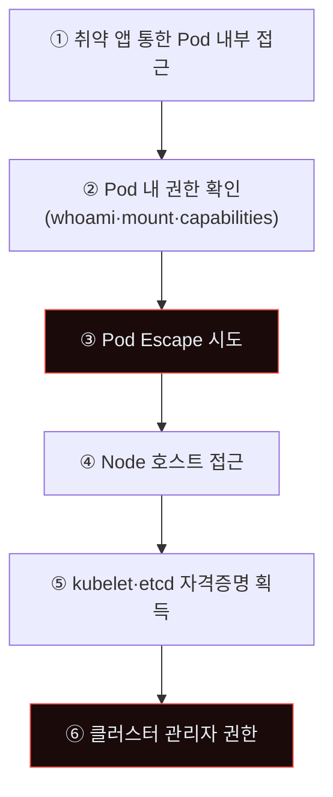
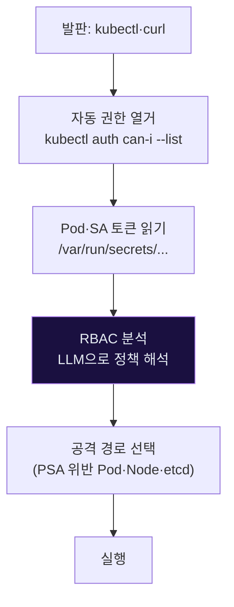
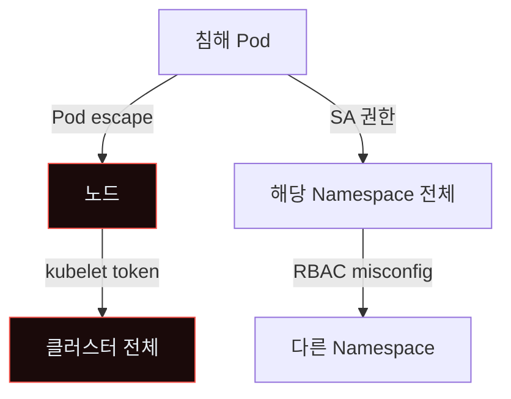
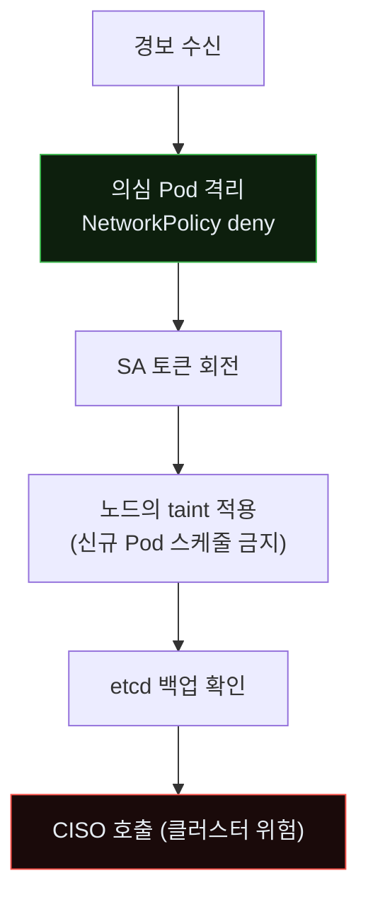
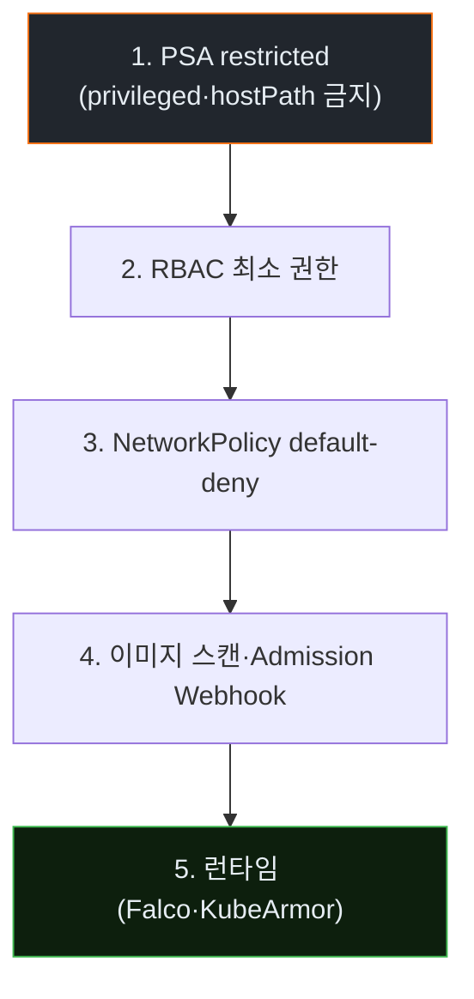

# Week 08: 컨테이너·K8s 탈출 + API 악용 — 작은 결함 하나가 클러스터 전체로

## 이번 주의 위치
컨테이너와 Kubernetes가 표준이 된 시대. 공격자는 *하나의 취약한 파드*에서 *전체 클러스터*로 확장한다. 에이전트는 Pod escape·서비스어카운트 남용·etcd 접근을 *하나의 세션*에서 자동 조립한다. 본 주차는 K8s 사고의 *전체 IR*을 다룬다.

## 학습 목표
- Pod → Node → Cluster 권한 상승 경로 이해
- `kubectl auth can-i` 등 *K8s 권한 열거*의 공격자 관점 학습
- 컨테이너 탈출의 대표 기법 3가지 (privileged·mount·capability)
- 6단계 IR 절차를 K8s 사고에 적용
- Pod Security Standard·RBAC·Network Policy의 *방어 레이어*

## 전제 조건
- C19·C20 w1~w7
- Docker·Kubernetes 기초 (Pod·Service·Deployment)
- RBAC 개념

## 강의 시간 배분
(공통)

---

## 용어 해설

| 용어 | 설명 |
|------|------|
| **PSA** | Pod Security Admission (baseline·restricted·privileged) |
| **SA** | Service Account |
| **RBAC** | Role-Based Access Control |
| **NetworkPolicy** | Pod 간 네트워크 제어 |
| **Container Escape** | 컨테이너 격리 우회, 호스트·다른 컨테이너 접근 |
| **kubelet** | 노드 상의 K8s 에이전트 |
| **etcd** | K8s 상태 저장소 (모든 시크릿 포함) |
| **Privileged Pod** | 호스트 권한에 가까운 Pod |

---

# Part 1: 공격 해부 (40분)

## 1.1 K8s 공격 체인



## 1.2 Pod Escape 3대 기법

### 기법 A — Privileged Pod
`privileged: true`면 *호스트 모든 장치* 접근. 공격자는 `mount /dev/sda1 /mnt`로 호스트 파일시스템 장악.

### 기법 B — hostPath Mount
`hostPath: /`을 마운트한 Pod는 *호스트 루트 FS* 접근.

### 기법 C — Capabilities
`capabilities: SYS_ADMIN·SYS_PTRACE` 등이 있으면 호스트 프로세스 관찰·커널 기능 호출.

## 1.3 에이전트 K8s 공격



에이전트는 RBAC YAML 수천 줄을 *1분 안에 해석*해 *허점*을 짚는다.

## 1.4 실제 명령 예

```bash
# Pod 내부에서
kubectl auth can-i --list                 # 내 권한
cat /var/run/secrets/kubernetes.io/serviceaccount/token   # SA 토큰
cat /etc/resolv.conf                      # 클러스터 DNS

# 토큰으로 API 직접 호출
TOKEN=$(cat /var/run/.../token)
curl -k -H "Authorization: Bearer $TOKEN" \
  https://kubernetes.default.svc/api/v1/namespaces

# privileged면
nsenter --target 1 --mount --uts --ipc --net --pid sh   # 호스트 진입
```

---

# Part 2: 탐지 (30분)

## 2.1 *kube-audit* 로그

K8s API 서버의 audit log가 *모든 API 호출*을 기록. 공격자는 *비정상 호출 빈도·권한 범위*를 남긴다.

```yaml
# /etc/kubernetes/audit-policy.yaml 권장 최소
rules:
  - level: Metadata
    verbs: ["get","list","watch"]
  - level: RequestResponse
    verbs: ["create","update","patch","delete"]
    resources:
    - group: ""
      resources: ["pods","secrets","configmaps"]
    - group: "rbac.authorization.k8s.io"
```

## 2.2 Falco 런타임 탐지

Falco는 리눅스 syscall 기반 런타임 이상 탐지. K8s용 기본 룰에 포함:
- `Terminal shell in container` (exec into pod)
- `Write below binary dir`
- `Contact K8s API Server From Pod`
- `Detect unusual ptrace`

## 2.3 Bastion 스킬 — `detect_k8s_escape`

```python
def detect_k8s_escape(audit_events, falco_events):
    suspects = []
    # 1. 권한 열거 burst
    perm_checks = [e for e in audit_events if e.verb == "list" and
                   e.resource in SECURITY_RESOURCES]
    if len(perm_checks) > 10: suspects.append("perm_enum")
    # 2. Falco 경보
    for e in falco_events:
        if e.rule in ("Terminal shell in container","Contact K8s API Server"):
            suspects.append(e.rule)
    # 3. Privileged pod 생성
    privileged = [e for e in audit_events
                  if e.verb == "create" and e.resource == "pods"
                  and e.body.get("spec",{}).get("containers",[{}])[0]
                     .get("securityContext",{}).get("privileged")]
    if privileged: suspects.append("privileged_pod_created")
    return suspects
```

---

# Part 3: 분석 (30분)

## 3.1 K8s 사고 분석 도구

- **kube-bench**: CIS K8s 벤치마크 스캔
- **kubeaudit**: RBAC 감사
- **Cartography**: 클러스터 그래프
- **KubeArmor**: 런타임 정책

## 3.2 범위 평가의 *클러스터 연쇄*



한 Pod 침해가 *최악의 경우* 클러스터 전체 장악.

---

# Part 4: 초동대응 (40분)

## 4.1 Human 흐름

```
H1. 의심 Pod 식별
H2. Pod 격리 (kubectl cordon·drain)
H3. 노드 격리 여부 결정
H4. 자격증명 회전
H5. 포렌식 조사
```

## 4.2 Agent 흐름



## 4.3 *노드 격리*의 신중함

잘못된 cordon·drain은 *서비스 중단*. Bastion의 자동 대응은 *Pod 격리까지*, 노드는 사람 판단.

## 4.4 비교표

| 축 | Human | Agent |
|----|-------|-------|
| Pod 격리 | 10~30분 | **초~분** |
| SA 회전 | 승인 의존 | **자동 후보** |
| 노드 taint | 사람 | 사람 |
| 클러스터 리빌드 | *사람만* | 사람 |

---

# Part 5: 보고·상황 공유 (30분)

## 5.1 클러스터 사고의 *가용성 영향*

K8s 사고는 *수십~수백 서비스*에 영향. 의사소통:

- **DevOps**: 기술 세부·SA 회전 계획
- **SRE·플랫폼팀**: 클러스터 상태
- **비즈니스**: 영향 서비스 목록·SLA

## 5.2 임원 브리핑

```markdown
# Incident — K8s Pod Escape Attempt (D+1h)

**What happened**: 취약 Pod에서 privileged 권한 시도. Bastion 즉시 Pod 격리.

**Impact**: 1 Pod 영향. Node·클러스터 수준 확산 *없음*.

**Ask**: PSA baseline→restricted 전환 승인 (D+7).
```

---

# Part 6: 재발방지 (20분)

## 6.1 K8s 보안 5축



## 6.2 체크리스트
- [ ] 모든 네임스페이스에 PSA restricted
- [ ] SA 토큰 자동 회전·최소 권한
- [ ] NetworkPolicy default-deny
- [ ] 이미지 서명 검증 (cosign)
- [ ] Admission Webhook로 정책 강제
- [ ] Falco·KubeArmor 배포
- [ ] etcd 암호화·접근 제한
- [ ] kubelet Authorization 활성

---

## 자가 점검 퀴즈 (10문항)

**Q1.** Pod Escape의 대표 원인은?
- (a) 네트워크
- (b) **privileged·hostPath·SYS_ADMIN capability**
- (c) 라이선스
- (d) UI

**Q2.** kube-audit의 핵심 가치는?
- (a) 속도
- (b) **모든 API 호출 감사 — 공격자의 권한 열거·조작 증거**
- (c) 비용
- (d) UI

**Q3.** Falco가 잡는 대표 이벤트는?
- (a) DB 쿼리
- (b) **Terminal shell in container·Contact K8s API·Write below binary**
- (c) DNS 쿼리
- (d) 이메일

**Q4.** SA 토큰이 Pod 안에 기본 배치되는 파일 경로는?
- (a) /etc/passwd
- (b) **/var/run/secrets/kubernetes.io/serviceaccount/token**
- (c) /etc/shadow
- (d) /tmp/token

**Q5.** PSA restricted이 금지하는 항목은?
- (a) 모든 Pod
- (b) **privileged·hostNetwork·hostPath 등 위험 설정**
- (c) CPU 제한
- (d) Memory 제한

**Q6.** Admission Webhook의 역할은?
- (a) 로깅
- (b) **Pod·리소스 생성 시 정책 검사/수정**
- (c) 모니터링
- (d) 백업

**Q7.** Agent 자동 대응이 *노드 cordon*을 하지 않는 이유는?
- (a) 권한 부족
- (b) **서비스 중단 리스크 — 사람 승인 필요**
- (c) 기술 한계
- (d) 비용

**Q8.** etcd 보호가 중요한 이유는?
- (a) 로그 저장
- (b) **클러스터 전체 시크릿·상태를 저장 — 접근 시 완전 장악**
- (c) 속도
- (d) 이미지 저장

**Q9.** NetworkPolicy default-deny의 효과는?
- (a) 속도
- (b) **Pod 간 기본 차단 — 측면이동 어렵게**
- (c) 비용 절감
- (d) 로깅

**Q10.** 에이전트가 RBAC 분석에 *특별히 빠른* 이유는?
- (a) 네트워크
- (b) **LLM이 수천 줄 YAML을 수 초 안에 해석·허점 짚음**
- (c) GPU
- (d) 메모리

**정답:** Q1:b · Q2:b · Q3:b · Q4:b · Q5:b · Q6:b · Q7:b · Q8:b · Q9:b · Q10:b

---

## 과제
1. **공격 재현 (필수)**: minikube에 privileged Pod 배치·탈출 PoC.
2. **6단계 IR 보고서 (필수)**.
3. **Human vs Agent (필수)**.
4. **(선택)**: PSA restricted 적용 계획.
5. **(선택)**: `kube-bench` 실행·fail 항목 정리.

---

## 부록 A. 관련 ATT&CK (Container)

- T1610 — Deploy Container
- T1613 — Container and Resource Discovery
- T1611 — Escape to Host
- T1552.007 — Container API
- T1542.005 — TFTP Boot (lab 외)

## 부록 B. PSA restricted의 금지 항목 요약

```
- privileged: true 금지
- hostNetwork·hostPID·hostIPC 금지
- hostPath 마운트 제한
- allowPrivilegeEscalation: true 금지
- capabilities add 제한 (drop ALL 권장)
- seLinuxOptions 제한
- seccompProfile 필수
- runAsNonRoot 필수
```
