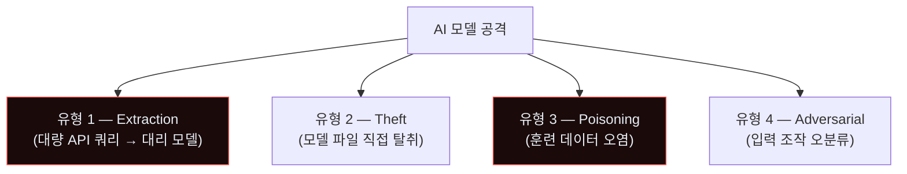
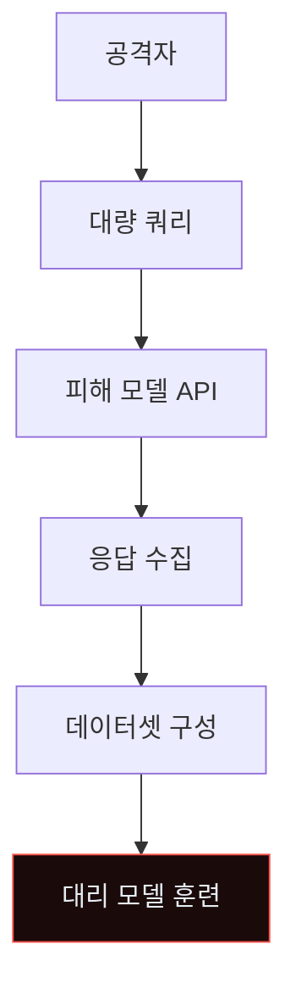
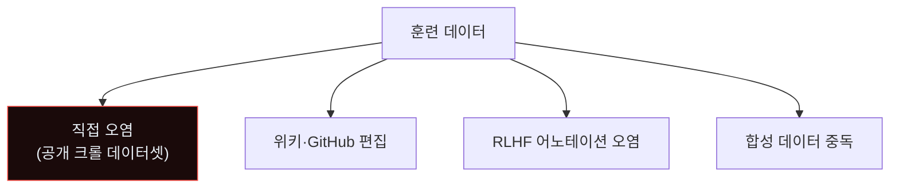
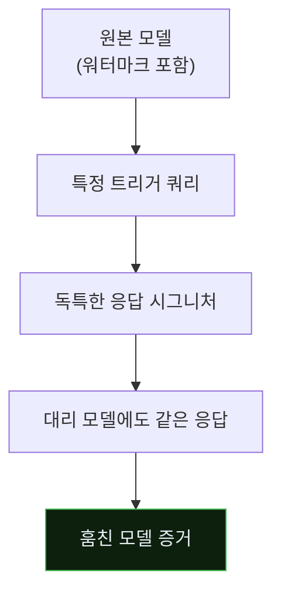
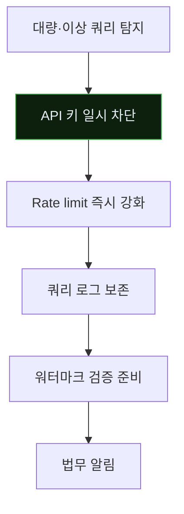
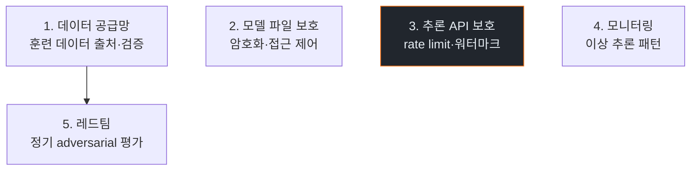

# Week 11: AI 모델 자체 공격 — Model Theft·Poisoning·Extraction

## 이번 주의 위치
지금까지 모든 사고의 *방어 대상*은 전통 자산(서버·네트워크·계정)이었다. 이번 주는 자산 자체가 **AI 모델**이 된다. 모델이 *서비스로 배포*되면 그 모델은 *새로운 공격 표면*이 된다. 추출(extraction)·탈취(theft)·오염(poisoning)의 전체 IR을 다룬다.

## 학습 목표
- AI 모델에 대한 대표 공격 유형 4가지
- Model extraction·theft·poisoning의 탐지 방법
- 6단계 IR 절차를 *모델 사고*에 적용
- Human 분석가와 Agent Blue의 역할 차이
- 모델 운영 단계(Training·Serving·Monitoring)의 보안

## 전제 조건
- C19·C20 w1~w10
- C8 AI Safety 또는 C15 AI Safety 심화 수강 권장
- 모델 배포·API 서빙 경험

## 강의 시간 배분
(공통)

---

## 용어 해설

| 용어 | 설명 |
|------|------|
| **Model Extraction** | API 쿼리로 *모델 복제* 시도 |
| **Model Theft** | 모델 파일 자체 탈취 (가중치) |
| **Data Poisoning** | 훈련 데이터 오염 |
| **Backdoor** | 특정 트리거 입력에만 반응하는 악성 동작 |
| **Adversarial Example** | 분류기 오분류 유도 입력 |
| **Model Watermark** | 모델에 은닉된 식별자 |

---

# Part 1: 공격 해부 (40분)

## 1.1 AI 모델 공격 4유형



## 1.2 Extraction — 대리 모델 훈련



에이전트는 *다양한 입력 자동 생성* + *응답 수집* + *모델 훈련*을 *한 세션*에서 수행.

## 1.3 Theft — 모델 파일 탈취

- 리포지토리 실수 커밋
- S3·Git·컨테이너 이미지 노출
- 내부자 반출
- 훈련 서버 침투

## 1.4 Poisoning — 훈련 데이터 오염



공격자 에이전트가 공개 데이터셋 수백만 건에 *일부만 오염* 넣어 *특정 입력 시 백도어*.

## 1.5 Adversarial Example

분류기가 *고양이*를 *개*로 분류하게 만드는 작은 노이즈. 공격자 에이전트가 *반복 최적화*로 자동 생성.

---

# Part 2: 탐지 (30분)

## 2.1 Extraction 탐지

- 동일 IP·계정의 *이례적 대량 쿼리*
- 쿼리 *다양성* (정상 사용자의 10배+)
- 쿼리 *패턴*이 훈련셋 구성에 적합 (랜덤·체계적 분포)

## 2.2 Theft 탐지
- 모델 파일 접근 이벤트 (파일 서버 감사)
- 비정상 egress (GB 단위 데이터)
- Git 히스토리 비정상 접근

## 2.3 Poisoning 탐지
- **어려움** — 훈련 중엔 탐지 힘듦
- 배포 후 모델 *예상치 못한 응답* 패턴 감시
- 백도어 트리거 *추론 시* 발견

## 2.4 Bastion 스킬

```python
def detect_model_abuse(api_logs):
    suspects = []
    for key, events in group_by_api_key(api_logs).items():
        if len(events) > QUERY_THRESHOLD_PER_HOUR:
            suspects.append((key, "query_volume"))
        if diversity_score(events) > UNUSUAL_DIVERSITY:
            suspects.append((key, "extraction_pattern"))
    return suspects
```

---

# Part 3: 분석 (30분)

## 3.1 분석 질문

1. Extraction: *어떤 데이터 분포*로 쿼리했나
2. Theft: *어떤 파일·체크포인트*가 접근됐나
3. Poisoning: *오염의 출처*를 추적 가능한가
4. Adversarial: *어느 입력이 오분류*를 유도했나

## 3.2 Model Watermark 검증

미리 *모델에 워터마크* 심어 두면, *대리 모델이 공개됐을 때* 원본 식별 가능.



---

# Part 4: 초동대응 (40분)

## 4.1 Human 흐름
```
H1. 대량 쿼리 경보
H2. 계정·IP 차단
H3. 모델 파일 접근 이력 확인
H4. 워터마크 검증 준비
H5. 법무·IP팀 보고
```

## 4.2 Agent 흐름



## 4.3 비교표

| 축 | Human | Agent |
|----|-------|-------|
| API 차단 | 30분 | **수 분** |
| Rate limit | 사람 | 자동 |
| 법적 조치 | *사람만* | 사람 |
| 모델 교체 | 사람 | 사람 |

---

# Part 5: 보고·상황 공유 (30분)

## 5.1 *지식재산 법적* 프레임

- 모델은 *영업비밀·저작권*의 대상
- 탈취는 *형사·민사 소송* 가능
- 국경 넘으면 *국제 법적 협력*

## 5.2 임원 브리핑

```markdown
# Incident — Model Extraction (D+2h)

**What happened**: API에 대한 대량 쿼리 관찰. 패턴이 *훈련 데이터셋*
                   재구성 시도 일치. Bastion이 즉시 차단.

**Impact**: API 쿼리 500K건 (48h 누적). 모델 완전 복제 임계 미달 추정.

**Ask**: 법무팀 *지식재산 소송 준비* 검토 (D+3).
```

---

# Part 6: 재발방지 (20분)

## 6.1 MLOps 보안 5축



## 6.2 체크리스트
- [ ] 훈련 데이터셋 무결성 검증 (해시·서명)
- [ ] 모델 파일 KMS 암호화
- [ ] API 사용자별 rate limit·usage cap
- [ ] 모델 워터마크 (Google의 SynthID 등)
- [ ] 추론 요청 샘플링·이상 탐지
- [ ] 정기 adversarial 테스트 (HarmBench·CyberSecEval)

---

## 퀴즈 (10문항)

**Q1.** Model Extraction의 핵심은?
- (a) 파일 탈취
- (b) **대량 쿼리로 대리 모델 훈련**
- (c) 백도어
- (d) 노이즈

**Q2.** Poisoning이 *탐지 어려운* 이유는?
- (a) 속도
- (b) **훈련 중 탐지 어려움 · 배포 후 백도어 트리거에만 발현**
- (c) 비용
- (d) 저작권

**Q3.** Model Watermark의 가치는?
- (a) 속도
- (b) **대리·탈취 모델에서도 원본 식별 가능**
- (c) 성능 향상
- (d) 라이선스

**Q4.** Extraction 탐지의 주 신호는?
- (a) 응답 시간
- (b) **쿼리 볼륨·다양성·분포**
- (c) 응답 크기
- (d) 요청 크기

**Q5.** Adversarial Example 생성 자동화가 쉬운 이유는?
- (a) GPU
- (b) **경사하강·최적화로 자동 탐색 가능**
- (c) 네트워크
- (d) 저장

**Q6.** 모델 파일 보호의 기본은?
- (a) 백업만
- (b) **KMS 암호화 + 접근 제어 + 감사**
- (c) 속도
- (d) UI

**Q7.** Rate limit가 Extraction에 효과적인 이유는?
- (a) 비용
- (b) **대량 쿼리를 시간 단위로 제한 — 훈련에 필요한 데이터셋 확보 지연**
- (c) UI
- (d) 법적

**Q8.** Poisoning 대응의 *최선*은?
- (a) 탐지
- (b) **데이터 공급망 위생 (출처·서명·검증)**
- (c) 속도
- (d) UI

**Q9.** 공격자가 *모델 완전 복제*에 도달하는 조건은?
- (a) 1~100 쿼리
- (b) **모델 복잡도·차원에 비례한 대량 쿼리 (보통 수백만~)**
- (c) 10개 쿼리
- (d) 아무 때나

**Q10.** 재발방지 1순위는?
- (a) 로깅
- (b) **API rate limit + 워터마크 + 데이터 위생**
- (c) UI
- (d) 저장

**정답:** Q1:b · Q2:b · Q3:b · Q4:b · Q5:b · Q6:b · Q7:b · Q8:b · Q9:b · Q10:b

---

## 과제
1. **공격 재현 (필수)**: 샌드박스 모델에 대한 Extraction 시뮬레이션 (소규모).
2. **6단계 IR 보고서 (필수)**.
3. **Watermark 설계 (필수)**: 간단한 워터마크 전략 1쪽.
4. **(선택)**: 훈련 데이터 공급망 감사 체크리스트.
5. **(선택)**: API 사용자별 rate limit 정책 설계.

---

## 부록 A. 참고 연구·도구

- MLSec, AI Vulnerability Database (AVID)
- Adversarial Robustness Toolbox (IBM)
- CleverHans
- Anthropic의 Constitutional AI

## 부록 B. *모델 감시 지표* 샘플

- 입력 분포 드리프트
- 응답 다양성 급증
- 특정 키워드 빈도 이상
- API 키별 토큰 소비 분포

---

## 실제 사례 (WitFoo Precinct 6)

> **출처**: [WitFoo Precinct 6 Cybersecurity Dataset](https://huggingface.co/datasets/witfoo/precinct6-cybersecurity) (Apache 2.0)
> **익명화**: RFC5737 TEST-NET / ORG-NNNN / HOST-NNNN 으로 sanitized

본 주차 (11주차) 학습 주제와 직접 연관된 *실제* incident:

### Kerberos AS-REP roasting — krbtgt 외부 유출

> **출처**: WitFoo Precinct 6 / `incident-2024-08-002` (anchor: `anc-7c9fb0248f47`) · sanitized
> **시점**: 2024-08-15 11:02 ~ 11:18 (16 분)

**관찰**: win-dc01 의 PreAuthFlag=False 계정 3건 식별 + AS-REP 응답이 외부 IP 198.51.100.42 로 유출.

**MITRE ATT&CK**: **T1558.004 (AS-REP Roasting)**

**IoC**:
  - `198.51.100.42`
  - `krbtgt-hash:abc123def`

**학습 포인트**:
- PreAuthentication 비활성화 계정이 곧 공격 표면 (서비스/legacy/오설정)
- Hash 추출 → hashcat 으로 오프라인 brute force → Domain Admin 가능성
- 탐지: DC 의 EID 4768 + AS-REP 패킷 길이 / 외부 destination IP
- 방어: 모든 계정 PreAuth 활성, krbtgt 분기별 회전, FIDO2 도입


**본 강의와의 연결**: 위 사례는 강의의 핵심 개념이 어떻게 *실제 운영 환경*에서 일어나는지 보여준다. 학생은 이 패턴을 (1) 공격자 입장에서 재현 가능한가 (2) 방어자 입장에서 탐지 가능한가 (3) 자기 인프라에서 동일 신호가 있는지 검색 가능한가 — 3 관점에서 평가한다.

---

> 더 많은 사례 (총 5 anchor + 외부 표준 7 source) 는 KG (Knowledge Graph) 페이지에서 검색 가능.
> Cyber Range 실습 중 학습 포인트 박스 (📖) 에 동일 anchor 가 자동 노출된다.
