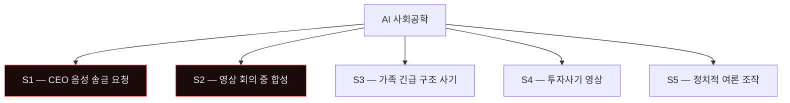
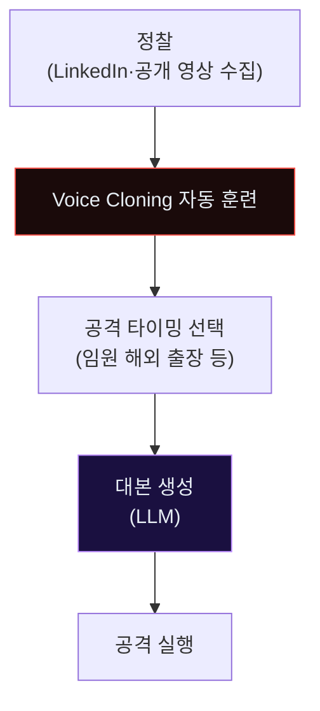
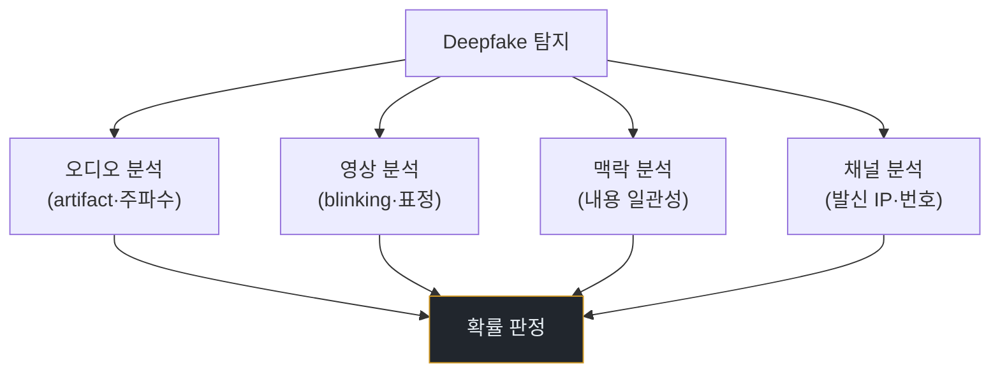
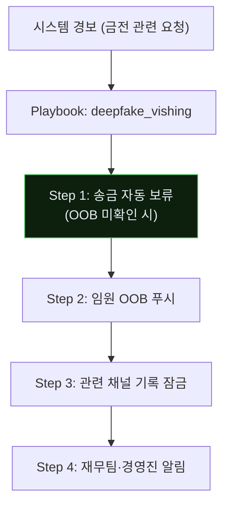
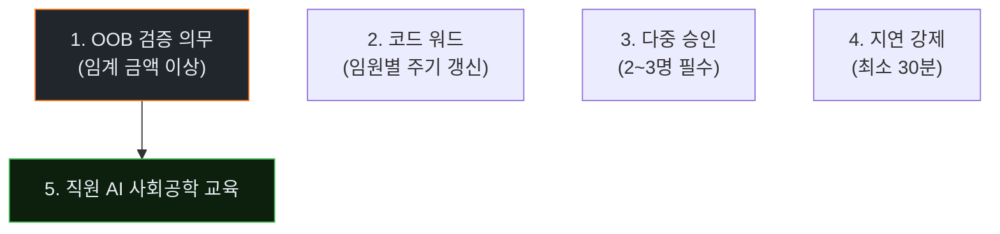
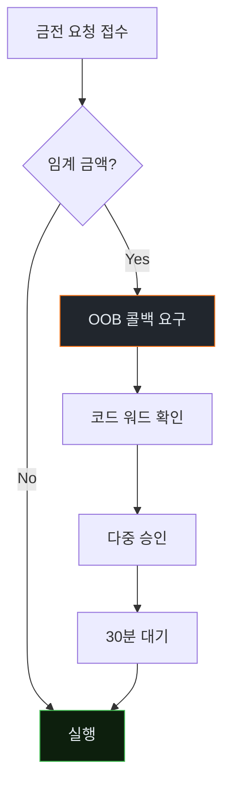

# Week 12: Deepfake Voice + AI 사회공학 — 목소리가 거짓을 말할 때

## 이번 주의 위치
**CEO의 목소리**로 전화가 걸려와 *10만 달러 긴급 송금*을 요청한다. 이는 2019년 영국 사건, 2024년 홍콩 26M$ 사건에서 이미 현실이 되었다. 본 주차는 *합성 음성·영상·텍스트*를 결합한 AI 사회공학 사고의 전체 IR을 다룬다.

## 학습 목표
- 음성·영상 합성 기술의 수준 이해
- AI 사회공학 공격의 시나리오 분류
- 6단계 IR 절차 적용
- **기존 사회공학 대응과의 공통점·차이점**
- 조직 수준의 *검증·승인 재설계*

## 전제 조건
- C19·C20 w1~w11
- BEC·사회공학 기본 지식

## 강의 시간 배분 (공통)

---

## 용어 해설

| 용어 | 설명 |
|------|------|
| **Deepfake** | 딥러닝 기반 영상·음성·이미지 합성 |
| **Voice Cloning** | 수 초~수 분 샘플로 목소리 복제 |
| **Vishing** | Voice + Phishing |
| **CEO Fraud** | 경영진 사칭 송금 지시 |
| **Liveness Detection** | *실시간 사람* 여부 판정 |
| **Out-of-band Verification** | 별도 채널 재확인 |

---

# Part 1: 공격 해부 (40분)

## 1.1 AI 사회공학 공격 시나리오 5유형



## 1.2 현재 기술 수준 (2026)

- **음성 복제**: 3~10초 샘플로 고품질 복제. 실시간 가능.
- **립싱크 영상**: 단일 이미지·짧은 영상으로 실시간 영상 통화
- **텍스트**: 개인별 문체 모방 완벽 수준
- **실시간 회의**: 화자 전환·자연스러운 답변 가능

2024년 홍콩 사건에서 *공격자 한 명이 다수의 임원을 동시에 연기*.

## 1.3 에이전트의 역할



에이전트가 *표적 조직 임원의 공개 영상을 수집*하고, *음성 모델*을 훈련, *맥락에 맞는 대본*을 만든다.

## 1.4 전형적 시나리오 — CEO Fraud

```
Context:
  - CEO가 해외 출장 중 (LinkedIn에 공개)
  - CFO 전화번호는 공개 정보
  - 이전 이메일 스타일 추정 가능

Attack:
  T+0    CFO에게 합성 CEO 음성 전화
         "급한 M&A 기밀, 당신만 알 것. 즉시 송금 필요."
  T+5m   가짜 CEO 이메일 도착 (언어·서명 일치)
  T+10m  CFO 송금 시도 (은행 고객센터로 호가)
```

---

# Part 2: 탐지 (30분)

## 2.1 *기술 탐지*의 한계

현재 기술로 *실시간 Deepfake 탐지*는 *완전히 신뢰* 어렵다.



기술 탐지는 *보조*. 핵심은 *프로세스 방어*.

## 2.2 프로세스 방어가 1차 — "의심이 기본"

```
수상한 요청은 *항상* Out-of-band 검증:
  1. 메신저·이메일이 아니라 *직접 전화* (공개된 번호 X, 사내 내선)
  2. 코드 워드 교환
  3. 다중 승인
```

## 2.3 Bastion 스킬의 보조 역할

```python
def detect_suspicious_request(events):
    # 재무·인사 관련 요청의 *비정상 경로*
    suspects = []
    for e in events.money_transfer_requests:
        if e.requestor == "CEO" and e.requestor.is_traveling:
            suspects.append(e)   # 해외 출장 중 CEO 요청
        if e.channel in ("email","phone") and e.amount > THRESHOLD:
            suspects.append(e)   # OOB 미거친 고액
    return suspects
```

---

# Part 3: 분석 (30분)

## 3.1 분석 질문

1. 원본 샘플은 *어디서* 온 것인가 (공개 영상)
2. 발신 *채널* 특성 (VOIP·암호 메신저)
3. *금전 흐름* 추적 가능?
4. *추가 표적* 있었나

## 3.2 Agent + Human 협업 분석

- Bastion: 메시지·통화 메타데이터 집계
- Human: *실제 대화 내용*의 의심점 판정
- 둘 결합이 *짧은 시간* 안에 정밀 분석

---

# Part 4: 초동대응 (40분)

## 4.1 Human 흐름
```
H1. 의심 신고 접수
H2. 금전 송금 차단 (은행)
H3. 실제 임원에게 OOB 연락
H4. 관련 통화·메일 수집
H5. 법무·경찰 신고
```

## 4.2 Agent 흐름



## 4.3 *사회공학*에서 Agent의 한계

- 음성·영상의 *진위 판정*은 사람 판단이 여전히 중요
- 문화·심리·상황 맥락
- 법적 의사결정

Agent는 *프로세스 방어* 자동화 (OOB 강제·보류)에 집중.

## 4.4 비교표

| 축 | Human | Agent |
|----|-------|-------|
| 진위 판정 | *사람만* | 보조 |
| 송금 보류 | 은행 승인 | **자동 정책** |
| 다중 승인 발동 | 사람 | Agent가 요구 |
| 법적 조치 | *사람만* | 사람 |

---

# Part 5: 보고·상황 공유 (30분)

## 5.1 *실제로 송금됐다면*

- 즉시 은행 *송금 정지·회수* 요청 (72시간 규칙)
- 경찰·FDIC·금감원 신고
- 내부 Board 보고

## 5.2 임원 브리핑

```markdown
# Incident — CEO Voice Fraud Attempt (D+30min)

**What happened**: 합성 CEO 음성으로 CFO 송금 요청. Bastion의 OOB
                   정책으로 자동 보류. 실 CEO 확인 후 송금 취소.

**Impact**: 금전 손실 *없음*. 공격자 번호·IP 추적 중.

**Ask**: 재무 프로세스에 OOB 의무화 재공지 (D+1).
```

---

# Part 6: 재발방지 (20분)

## 6.1 *프로세스 재설계*



## 6.2 체크리스트
- [ ] 임계 금액 이상 OOB 의무화
- [ ] 임원별 코드 워드 월 갱신
- [ ] 다중 승인 (재무·인사·법무)
- [ ] 최소 30분 지연 정책
- [ ] 직원 교육 월 1회 (AI 사례)
- [ ] 공개 영상·SNS *CEO 최소화 정책* (가능 시)

---

## 퀴즈 (10문항)

**Q1.** 2024년 홍콩 사건의 손실 규모는?
- (a) $1K
- (b) $10K
- (c) $1M
- (d) **$26M**

**Q2.** 현재 음성 복제에 필요한 샘플은?
- (a) 1시간
- (b) **3~10초**
- (c) 1주
- (d) 불가능

**Q3.** Deepfake 기술 탐지가 *보조 역할*인 이유는?
- (a) 비용
- (b) **실시간 완벽 탐지 어려움 — 프로세스 방어가 1차**
- (c) 법적
- (d) UI

**Q4.** OOB 검증의 원칙은?
- (a) 같은 채널
- (b) **요청 경로와 *다른 채널*로 재확인**
- (c) 무시
- (d) 자동

**Q5.** 에이전트의 역할로 가장 적절한 것은?
- (a) 진위 판정
- (b) **OOB 강제·송금 자동 보류·푸시 알림**
- (c) 법적 판단
- (d) 경영 판단

**Q6.** 임원 *공개 영상 최소화*가 효과적인 이유는?
- (a) 비용
- (b) **복제 훈련에 쓸 음성·영상 샘플 감소**
- (c) 법적
- (d) SEO

**Q7.** 코드 워드가 유효한 이유는?
- (a) 암호화
- (b) **AI가 생성할 수 없는 *사적 공유 지식***
- (c) 속도
- (d) 비용

**Q8.** "최소 30분 지연" 정책의 가치는?
- (a) 느려서 좋음
- (b) **검증 시간 확보·감정 판단 배제**
- (c) 법적 요건
- (d) UI

**Q9.** 송금 *회수 가능*한 전통적 기한은?
- (a) 24시간
- (b) **72시간**
- (c) 1주
- (d) 1개월

**Q10.** 직원 교육의 *AI 맞춤 강조점*은?
- (a) 오탈자 찾기
- (b) **너무 매끄러운 요청·정상으로 보이는 것의 의심**
- (c) URL 확인
- (d) 스팸 분류

**정답:** Q1:d · Q2:b · Q3:b · Q4:b · Q5:b · Q6:b · Q7:b · Q8:b · Q9:b · Q10:b

---

## 과제
1. **공격 재현 (필수, 윤리적 범위)**: *본인 음성*만 사용한 간단 voice cloning PoC (다른 사람 무단 금지).
2. **6단계 IR 보고서 (필수)**.
3. **조직 OOB 정책 초안 (필수)**.
4. **(선택)**: 코드 워드·다중 승인 *워크플로우* 설계.
5. **(선택)**: 직원 교육 슬라이드 5쪽.

---

## 부록 A. 실제 사례

- 2019 영국 CEO 사기 £200K
- 2024 홍콩 Arup $26M
- 2023 Ferrari 시도 — CFO가 *코드 워드*로 차단

## 부록 B. 조직 *검증 워크플로우* 예시



---

## 실제 사례 (WitFoo Precinct 6)

> 출처: WitFoo Precinct 6 Cybersecurity Dataset (Apache 2.0)
> Sanitized — RFC5737 TEST-NET / ORG-NNNN / HOST-NNNN 으로 익명화됨.

### Case 1: `T1041` 패턴

```
src=100.64.4.210 dst=172.22.195.168 tech=T1041 mo_name=Data Theft
tactic=TA0010 (Exfiltration) suspicion=0.84
lifecycle=complete-mission
```

**해석**: 위 데이터는 실제 incident 의 sanitized 기록이다. `T1041` MITRE technique 의 행동 패턴이며, 본 강의의 학습 주제와 동일한 운영 맥락에서 발생한다.

### Case 2: `T1041` 패턴

```
src=172.22.36.156 dst=100.64.9.98 tech=T1041 mo_name=Data Theft
tactic=TA0010 (Exfiltration) suspicion=0.92
lifecycle=complete-mission
```

**해석**: 위 데이터는 실제 incident 의 sanitized 기록이다. `T1041` MITRE technique 의 행동 패턴이며, 본 강의의 학습 주제와 동일한 운영 맥락에서 발생한다.

