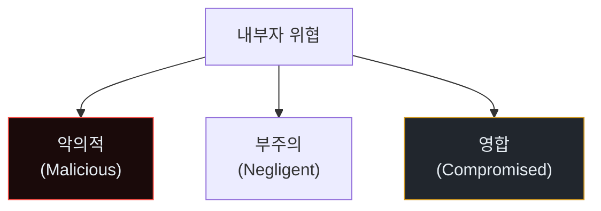
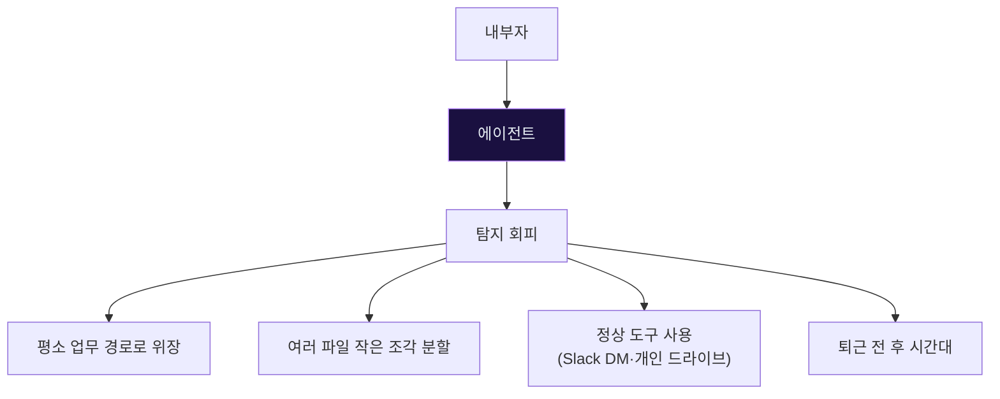
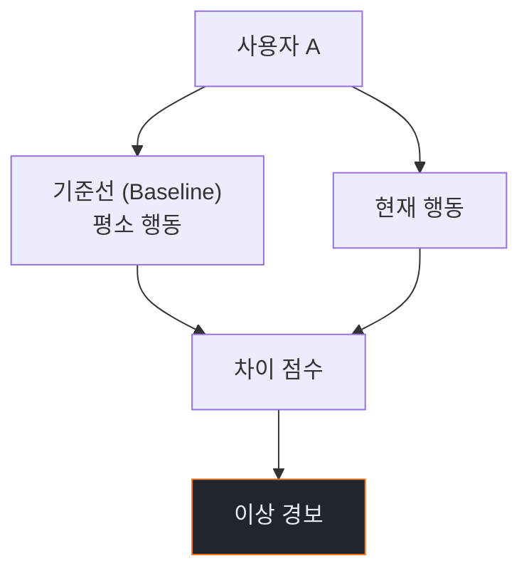
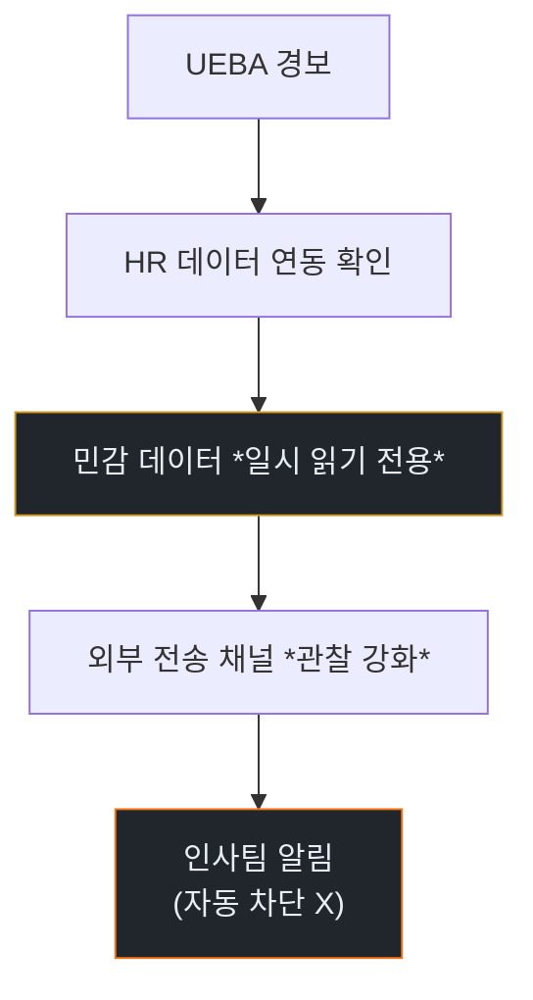
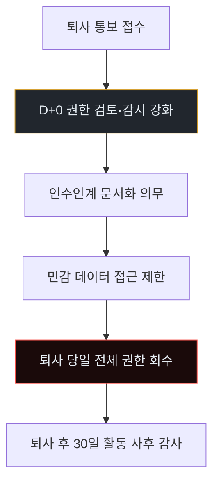

# Week 13: Insider + Agent Weaponization — 내부자가 에이전트를 도구로

## 이번 주의 위치
내부자 위협은 전통 IR에서 가장 어려운 주제다. *허가된 접근*을 가진 사람이 공격을 수행하기 때문. 여기에 에이전트가 가세하면, 내부자가 *정상 업무 범위를 넘는* 작업을 *자동화*해 **탐지 회피** 속도로 수행한다. 본 주차는 이 하이브리드 내부자 사고의 IR을 본다.

## 학습 목표
- 내부자 위협의 3유형 (악의·부주의·영합) 이해
- 에이전트가 내부자에게 주는 *능력 부가*의 구체
- UEBA(User and Entity Behavior Analytics) 원리
- 6단계 IR 절차 — 인사·법무 협업
- 직원 교육·정책·기술의 3축

## 전제 조건
- C19·C20 w1~w12
- UEBA·DLP 기본 개념

## 강의 시간 배분 (공통)

---

## 용어 해설

| 용어 | 설명 |
|------|------|
| **Insider Threat** | 내부 권한 보유자의 위협 |
| **UEBA** | User and Entity Behavior Analytics |
| **DLP** | Data Loss Prevention |
| **JIT Access** | Just-in-time 권한 |
| **PAM** | Privileged Access Management |
| **Zero Trust** | 내부도 신뢰하지 않는 모델 |

---

# Part 1: 공격 해부 (40분)

## 1.1 내부자 3유형



- **악의적**: 퇴사 예정·이직·원한
- **부주의**: 실수 (유출·잘못 공유)
- **영합**: 외부 공격자에 의해 계정·사람이 탈취

## 1.2 에이전트가 주는 *능력*

```
기존 내부자:
  수 시간 — 자료 목록화
  수 시간 — 복사·반출
  수 일 — 발각 회피 절차

에이전트 도움:
  10분 — 전체 공유 드라이브 목록화
  30분 — 자동 카탈로그·요약
  지속 누출 — DNS·압축·분산
```

내부자가 *한 사람*이어도 *팀 규모*의 작업 가능.

## 1.3 탐지 회피 패턴



에이전트는 *내부자의 정상 패턴*을 학습하고 *비슷하게 분포*시킨다.

## 1.4 전형 시나리오

```
context: 개발자 A, 2주 후 경쟁사 이직 예정
T-14d  공개 repo 접근 증가 (정상으로 위장)
T-10d  에이전트가 공유 Wiki·Confluence 전수 크롤링
T-7d   내부 설계 문서 요약본 생성 (개인 드라이브)
T-5d   암호화 아카이브 → 개인 이메일
T-1d   평상 업무 시늉
퇴사 후 경쟁사에 합류
```

---

# Part 2: 탐지 (30분)

## 2.1 UEBA의 역할



기준선 대비 *이례적* 행동 감지:
- 접근 데이터 *양·종류*
- 접근 *시간대*
- *대량 다운로드*
- *개인 채널 공유* 증가

## 2.2 DLP

- 민감 데이터 패턴(주민번호·카드번호·설계도)의 *유출 경로* 감시
- Slack·이메일·USB·클라우드 공유
- 정책 위반 시 차단·경고

## 2.3 Bastion 스킬

```python
def detect_insider_anomaly(user_activity):
    alerts = []
    baseline = get_baseline(user_activity.user, days=30)
    # 볼륨
    if user_activity.data_accessed_mb_7d > baseline.p95_mb * 3:
        alerts.append("volume_anomaly")
    # 접근 종류
    new_systems = set(user_activity.systems_7d) - set(baseline.systems)
    if len(new_systems) > 3:
        alerts.append("new_systems")
    # 시간대
    if off_hours_ratio(user_activity.events) > 0.5:
        alerts.append("off_hours")
    # 퇴사 임박 플래그 (HR 연동)
    if user_activity.user.is_leaving_soon:
        alerts.append("pre_departure_risk")
    return alerts
```

---

# Part 3: 분석 (30분)

## 3.1 분석의 *민감성*

내부자 조사는 *법적·인사적* 영향이 크다.

- 증거 수집은 *인사·법무와 공동*
- 직원 *프라이버시* 존중
- 감사 로그 *접근 통제*

## 3.2 분석 도구
- SIEM + UEBA + HR 시스템 연동
- 이메일·메시징 감사
- 엔드포인트 포렌식

## 3.3 *오탐*의 대가

내부자 오탐 — 정상 직원에 대한 *의심* — 은 *신뢰 훼손*. 엄격한 *검증 임계* 필요.

---

# Part 4: 초동대응 (40분)

## 4.1 Human 흐름
```
H1. UEBA 경보 + HR 플래그
H2. 인사·법무 협의
H3. 증거 보존
H4. 대면 면담 or 권한 제한
H5. 내사·법적 절차
```

## 4.2 Agent 흐름 (제한적)



내부자 사건은 *자동 차단 금지*. 오탐 시 직원 권리 침해 큼. Agent는 *가시성 강화*와 *인사 에스컬레이션*만.

## 4.3 비교표

| 축 | Human | Agent |
|----|-------|-------|
| 경보 식별 | 사람 + UEBA | **UEBA 연속** |
| 대면 대응 | *사람만* | 불가 |
| 권한 조정 | 사람 승인 | 준비만 |
| 법적 절차 | *사람만* | 불가 |

---

# Part 5: 보고·상황 공유 (30분)

## 5.1 *극도로 제한된* 공유

- 관련자(보안·HR·법무) *이외* 공개 금지
- 당사자에게 *정식 절차로만* 통지
- 수사 중에는 *조직 외부 공개* 금지

## 5.2 임원 브리핑 (제한적)

```markdown
# Incident — Potential Insider Risk (Confidential)

**What**: 직원 A(부서 X)의 비정상 데이터 접근 패턴. 퇴사 D-14.

**Action Taken**: 민감 데이터 읽기 전용 전환. HR 면담 예정.

**Legal**: 법무팀과 증거 보존 절차 진행 중.

**Ask**: HR·CEO만 공유. 내사 결과 후 조치.
```

---

# Part 6: 재발방지 (20분)

## 6.1 *퇴사 시나리오* 특별 프로세스



## 6.2 상시 운영

- JIT Access (특권)
- 정기적 권한 재검토
- UEBA + HR 통합
- 퇴사 프로세스 표준화
- 문화: *심리적 안전*·*공정 처우*

## 6.3 체크리스트
- [ ] UEBA 배포·기준선 수립
- [ ] HR 시스템 UEBA 연동 (퇴사 플래그)
- [ ] DLP 민감 데이터 정책
- [ ] JIT 특권 접근
- [ ] 퇴사 표준 프로세스
- [ ] 직원 *조기 경보* 문화 (상담)

---

## 퀴즈 (10문항)

**Q1.** 내부자 3유형은?
- (a) 일반·특권·관리자
- (b) **악의·부주의·영합**
- (c) 기술·사무·경영
- (d) 기타

**Q2.** 에이전트가 내부자에게 주는 주된 능력은?
- (a) 권한
- (b) **속도·규모·위장**
- (c) 네트워크
- (d) 법적 보호

**Q3.** UEBA의 핵심은?
- (a) 룰
- (b) **기준선 대비 이상 점수**
- (c) 블랙리스트
- (d) IP 차단

**Q4.** Bastion의 내부자 대응이 *자동 차단 금지*인 이유는?
- (a) 기술 한계
- (b) **오탐 시 직원 권리·조직 신뢰 침해**
- (c) 비용
- (d) 법적 요건

**Q5.** 퇴사 프로세스의 권장 시작 시점은?
- (a) 퇴사 당일
- (b) **퇴사 통보 접수 즉시 (D+0)**
- (c) 퇴사 1년 전
- (d) 퇴사 후

**Q6.** JIT 특권 접근의 가치는?
- (a) 속도
- (b) **특권이 영구 존재하지 않음 — 남용·유출 최소**
- (c) UI
- (d) 비용

**Q7.** DLP의 역할은?
- (a) 암호화
- (b) **민감 데이터의 유출 경로 감시·차단**
- (c) 백업
- (d) 접근 제어

**Q8.** 영합(Compromised) 내부자의 특징은?
- (a) 악의
- (b) **계정·사람이 외부 공격자에게 탈취·조작**
- (c) 실수
- (d) 권한

**Q9.** 내부자 사건 공유의 *원칙*은?
- (a) 전사 공개
- (b) **관련자(보안·HR·법무) 제한 + 당사자 정식 절차**
- (c) 투명 공개
- (d) 외부 보도

**Q10.** 재발방지의 *문화적* 요소는?
- (a) 강한 감시
- (b) **심리적 안전 + 공정 처우 — 조기 경보 가능 환경**
- (c) 처벌 강화
- (d) 급여 인상

**정답:** Q1:b · Q2:b · Q3:b · Q4:b · Q5:b · Q6:b · Q7:b · Q8:b · Q9:b · Q10:b

---

## 과제
1. **시뮬레이션 재현 (필수)**: 가상 내부자 시나리오 1건 — 데이터 접근 비정상 패턴 생성 + UEBA 탐지 로그.
2. **6단계 IR 보고서 (필수)**.
3. **퇴사 프로세스 초안 (필수)**.
4. **(선택)**: HR·UEBA 연동 설계.
5. **(선택)**: DLP 정책 초안.

---

## 부록 A. 유명 내부자 사건

- Edward Snowden (2013)
- Anthony Levandowski (Waymo·Uber, 2016)
- 최근 2024~2025의 AI 관련 기업 이직 사건들

## 부록 B. 내부자 위협의 *문화적* 관점

조직 문화가 중요:
- 공정한 평가·보상
- 퇴사자에 대한 존엄
- 심리적 안전 (문제 제기 가능)
- 리더십의 투명성

기술만으로는 *내부자 근절* 불가능. 문화 + 기술 + 프로세스의 삼각.

---

## 실제 사례 (WitFoo Precinct 6)

> 출처: WitFoo Precinct 6 Cybersecurity Dataset (Apache 2.0)
> Sanitized — RFC5737 TEST-NET / ORG-NNNN / HOST-NNNN 으로 익명화됨.

### Case 1: `T1041` 패턴

```
src=100.64.4.210 dst=172.22.195.168 tech=T1041 mo_name=Data Theft
tactic=TA0010 (Exfiltration) suspicion=0.84
lifecycle=complete-mission
```

**해석**: 위 데이터는 실제 incident 의 sanitized 기록이다. `T1041` MITRE technique 의 행동 패턴이며, 본 강의의 학습 주제와 동일한 운영 맥락에서 발생한다.

### Case 2: `T1041` 패턴

```
src=172.22.36.156 dst=100.64.9.98 tech=T1041 mo_name=Data Theft
tactic=TA0010 (Exfiltration) suspicion=0.92
lifecycle=complete-mission
```

**해석**: 위 데이터는 실제 incident 의 sanitized 기록이다. `T1041` MITRE technique 의 행동 패턴이며, 본 강의의 학습 주제와 동일한 운영 맥락에서 발생한다.

