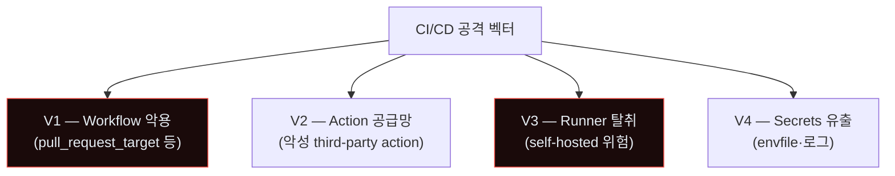
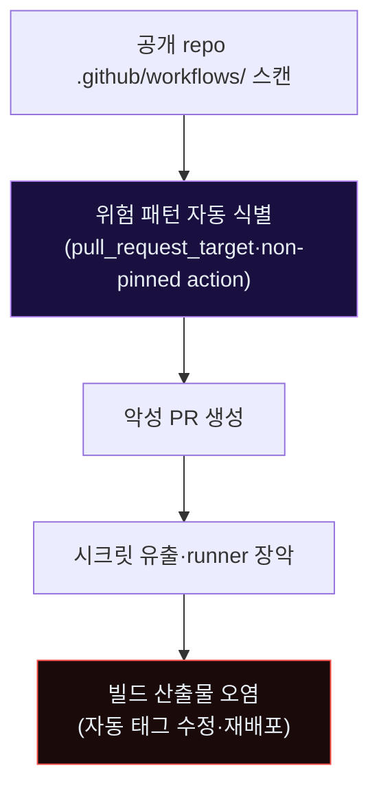
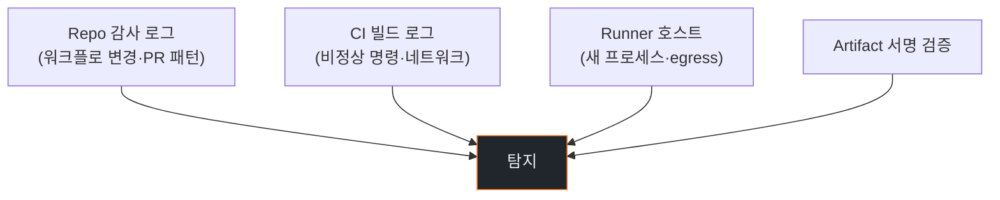
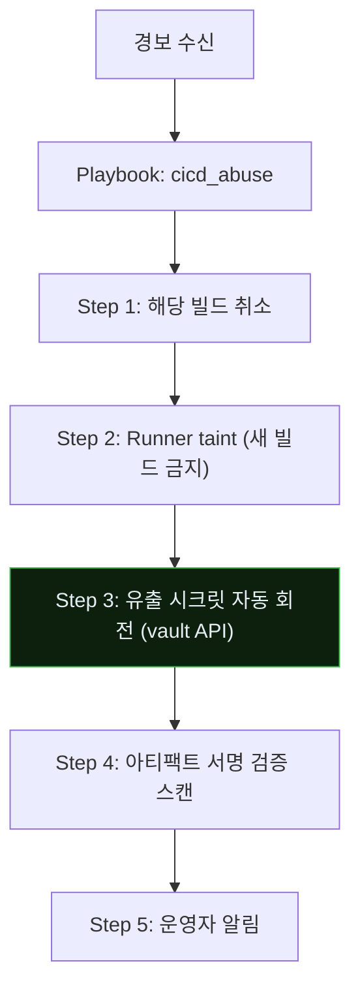
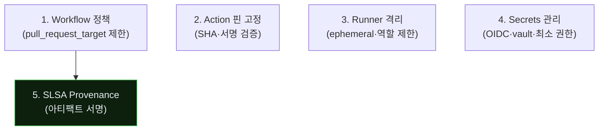

# Week 14: CI/CD 공급망 오염 — GitHub Actions·Jenkins·GitLab

## 이번 주의 위치
조직의 *모든 코드*가 CI/CD 파이프라인을 지난다. 공격자가 파이프라인 자체를 오염시키면 *수백 서비스*에 악성 코드가 자동 배포된다. 에이전트는 GitHub Action workflow·Jenkinsfile의 *취약 패턴*을 자동 스캔해 *Public repo 하나*에서 *조직 전체*로 확장한다.

## 학습 목표
- CI/CD 공격의 4가지 주요 벡터
- GitHub Actions·Jenkins의 *위험 기능*
- 6단계 IR 절차를 파이프라인 사고에 적용
- Secrets 유출·runner 탈취 대응
- 파이프라인 보안의 5축

## 전제 조건
- C19·C20 w1~w13
- CI/CD 경험 (GitHub Actions·Jenkins·GitLab 택 1)

## 강의 시간 배분 (공통)

---

## 용어 해설

| 용어 | 설명 |
|------|------|
| **CI/CD** | Continuous Integration·Delivery |
| **Runner** | 워크플로 실행 VM |
| **GITHUB_TOKEN** | 자동 발급 임시 토큰 |
| **pwn request** | `pull_request_target` 남용 공격 |
| **Artifact** | 빌드 산출물 |
| **SLSA** | Supply-chain Levels for Software Artifacts |
| **Sigstore/cosign** | 아티팩트 서명 |

---

# Part 1: 공격 해부 (40분)

## 1.1 CI/CD 공격 벡터 4가지



## 1.2 V1 — `pull_request_target` 공격

GitHub Actions의 `pull_request_target`는 *base repo의 시크릿*을 사용. 외부 기여자의 PR이 이를 악용하면 *비공개 토큰 유출*.

```yaml
# BAD — 외부 기여자 PR 빌드에 시크릿 노출
on: pull_request_target
jobs:
  test:
    steps:
      - uses: actions/checkout@v4
        with:
          ref: ${{ github.event.pull_request.head.sha }}  # 외부 코드
      - run: npm test
        env:
          API_KEY: ${{ secrets.PROD_API_KEY }}  # 유출 가능
```

## 1.3 V2 — Third-party Action 공급망

`uses: some-user/some-action@v1` — *버전 태그*가 *이동 가능*. 공격자가 태그를 재발행하면 이전 빌드가 *새로운 악성 코드*를 받는다.

SHA pinning 필수:
```yaml
- uses: some-user/some-action@abc1234...  # 해시 고정
```

## 1.4 V3 — Self-hosted Runner 탈취

Self-hosted runner는 *조직 네트워크 내부*. 공격자가 runner를 오염시키면 *내부 망 접근 + 시크릿*.

- 외부 기여자 PR → public repo → runner 실행
- runner에 backdoor 설치
- 이후 *모든 빌드*가 오염

## 1.5 V4 — Secrets 유출

- 빌드 로그에 `echo $SECRET`
- `.env` 파일 artifact로 업로드
- core dump·에러 메시지

## 1.6 에이전트 자동화



---

# Part 2: 탐지 (30분)

## 2.1 관측점



## 2.2 탐지 신호

- **PR 패턴**: 외부 기여자의 *워크플로 수정* 포함
- **빌드 로그**: 외부 egress·도커 이미지 *비지정 풀*
- **Runner**: 새 프로세스·지속적 연결
- **Artifact**: 서명 없음·서명 불일치

## 2.3 Bastion 스킬

```python
def detect_cicd_abuse(events):
    alerts = []
    for pr in events.pull_requests:
        if pr.is_external and modifies_workflow(pr):
            alerts.append(("workflow_modification", pr.id))
    for build in events.builds:
        if has_external_egress(build) and not build.expected_egress:
            alerts.append(("egress_anomaly", build.id))
        if exposes_secret(build.logs):
            alerts.append(("secret_in_log", build.id))
    return alerts
```

---

# Part 3: 분석 (30분)

## 3.1 빌드 로그 *빠른 복기*

```
[T+00:10] PR #1234 merged (external contributor)
[T+00:11] GitHub Actions: test workflow started
[T+00:15] 이상 egress: runner → attacker.example
[T+00:17] 빌드 log에 `API_KEY=eyJ...` 패턴 (시크릿 유출 의심)
[T+00:30] 시크릿 회전 alert
[T+01:00] runner 호스트 이상 프로세스 (bash reverse shell)
```

## 3.2 영향 범위
- 유출된 시크릿의 *범위* (해당 워크플로만? 조직 전체?)
- 이미 배포된 *아티팩트 오염* 여부
- 영향 서비스 목록

---

# Part 4: 초동대응 (40분)

## 4.1 Human 흐름
```
H1. 경보 수신
H2. 해당 빌드 취소·격리
H3. Runner 호스트 격리
H4. 유출 시크릿 전수 회전
H5. 아티팩트 재빌드 검증
H6. 공개 공지 (필요 시)
```

## 4.2 Agent 흐름



## 4.3 비교표

| 축 | Human | Agent |
|----|-------|-------|
| 빌드 취소 | 분 | **초** |
| 시크릿 회전 | 수 시간 | **분 (vault API)** |
| Runner 격리 | 사람 | Agent |
| 영향 서비스 리빌드 | *사람만* | 계획 보조 |

---

# Part 5: 보고·상황 공유 (30분)

## 5.1 *공개 영향* 가능성

오염된 아티팩트가 *이미 배포*됐다면 공급망 사고. 조치:
- **영향 고객 통지**
- **오염 아티팩트 recall** (가능 시)
- **외부 CSA·CERT 공유**

## 5.2 임원 브리핑

```markdown
# Incident — CI/CD Pipeline Compromise (D+2h)

**What**: 외부 PR의 `pull_request_target` 남용으로 runner에서 시크릿 유출.
          Bastion이 자동 시크릿 회전.

**Impact**: 3개 시크릿 유출. 아직 *외부 악용 증거 없음*.
           아티팩트 서명 검증 결과 *오염 없음*.

**Ask**: 모든 `pull_request_target` 워크플로 재검토 승인 (D+1).
```

---

# Part 6: 재발방지 (20분)

## 6.1 CI/CD 보안 5축



## 6.2 체크리스트
- [ ] `pull_request_target` 사용 금지·예외 승인제
- [ ] 모든 Action SHA 핀
- [ ] Self-hosted runner *ephemeral* (매 빌드 재생성)
- [ ] Runner 네트워크 격리 (최소 egress)
- [ ] OIDC 기반 자격증명 (장기 시크릿 제거)
- [ ] Artifact cosign 서명 + 배포 시 검증
- [ ] SLSA level 3+ 목표
- [ ] Dependabot + CodeQL 배포

---

## 퀴즈 (10문항)

**Q1.** `pull_request_target`의 위험은?
- (a) 느림
- (b) **외부 기여자 PR 빌드에 base repo 시크릿 노출**
- (c) 비용
- (d) UI

**Q2.** Action SHA 핀의 필요성은?
- (a) UI
- (b) **태그는 이동 가능 — SHA만이 고정 상태 보장**
- (c) 속도
- (d) 법적

**Q3.** Self-hosted runner의 리스크는?
- (a) 비용
- (b) **조직 내부망 접근 + 외부 PR 실행 조합**
- (c) 속도
- (d) 호환성

**Q4.** Secrets 유출 경로로 흔한 것은?
- (a) 네트워크
- (b) **빌드 로그·env·artifact·core dump**
- (c) DB
- (d) OS

**Q5.** OIDC 기반 자격증명의 장점은?
- (a) 빠름
- (b) **장기 시크릿 제거 · 임시 발급**
- (c) 비용
- (d) UI

**Q6.** cosign의 역할은?
- (a) 속도
- (b) **아티팩트 서명·검증으로 공급망 무결성**
- (c) 네트워크
- (d) 라이선스

**Q7.** SLSA level 3+가 의미하는 것은?
- (a) 가격
- (b) **빌드 출처·공정 검증 수준의 높은 단계**
- (c) 성능
- (d) UI

**Q8.** ephemeral runner의 가치는?
- (a) 속도
- (b) **매 빌드마다 초기화 — 지속성 확보 공격 무력화**
- (c) 비용
- (d) 호환성

**Q9.** CI/CD 경보 수신 시 *즉시* 할 조치는?
- (a) 보고서
- (b) **해당 빌드 취소 + runner 격리 + 시크릿 회전**
- (c) 경영진 통지
- (d) 법적 조치

**Q10.** 재발방지의 *최상위 정책*은?
- (a) 로깅 확대
- (b) **pull_request_target 원칙적 금지·예외 승인**
- (c) 비용 절감
- (d) UI 개선

**정답:** Q1:b · Q2:b · Q3:b · Q4:b · Q5:b · Q6:b · Q7:b · Q8:b · Q9:b · Q10:b

---

## 과제
1. **공격 재현 (필수)**: 샌드박스 GitHub repo에 *의도적 취약 워크플로* + PR 시뮬레이션.
2. **6단계 IR 보고서 (필수)**.
3. **워크플로 감사 (필수)**: 본인 조직 public repo 스캔 결과.
4. **(선택)**: OIDC 이행 계획.
5. **(선택)**: cosign 서명·검증 파이프라인 설계.

---

## 부록 A. 실제 사고

- **2023 GitHub Actions bypass** — Dependabot 봇 명의 PR 이용
- **2024 supply chain incidents** (Sigstore 관련 여러 사건)
- **Codecov bash uploader 2021**

## 부록 B. 워크플로 감사 스크립트 예

```bash
# 조직 모든 repo의 pull_request_target 사용 검색
gh api graphql -f query='...' | jq '.[] | select(.yaml|contains("pull_request_target"))'

# SHA pin 안 된 action 찾기
grep -rE 'uses:.*@v[0-9]' .github/workflows/
```

---

<!--
사례 섹션 폐기 (2026-04-27 수기 검토): w14 CI/CD 공급망 오염 (GitHub Actions·
Jenkins·GitLab). T1041 단일 항목은 GitHub Actions workflow injection /
Jenkinsfile RCE / SLSA provenance 위반 신호와 매핑 X. 폐기. 재추가:
SolarWinds SUNBURST (2020), Codecov bash uploader (2021), Argo Tunnels
abuse (2022) 등 공개 supply chain 사례.
-->


