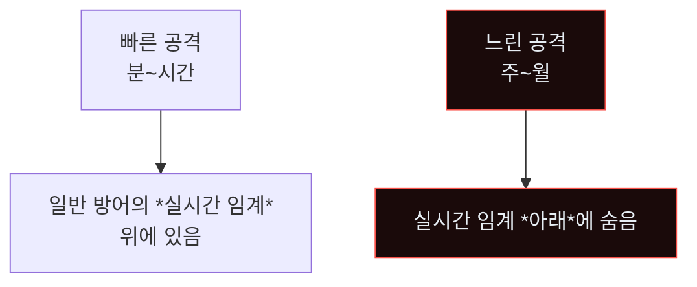
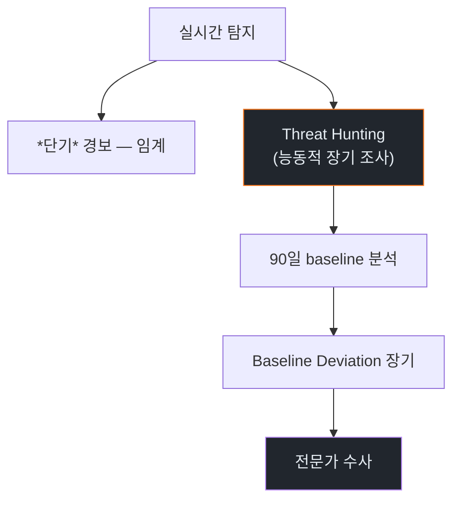
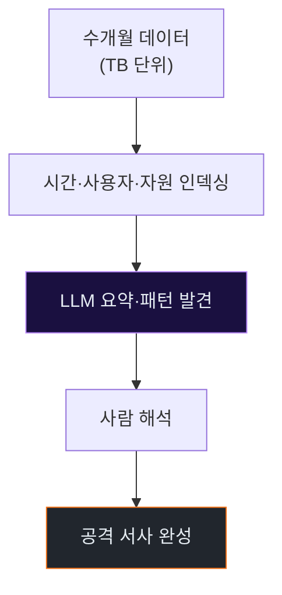
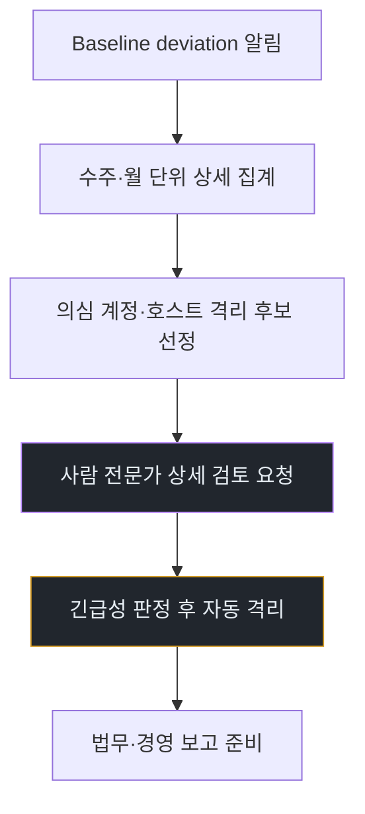
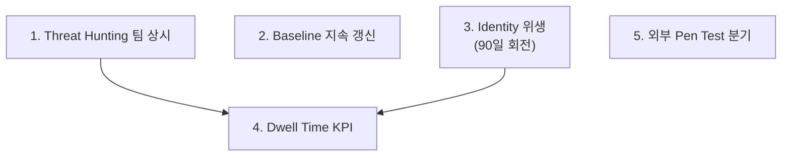
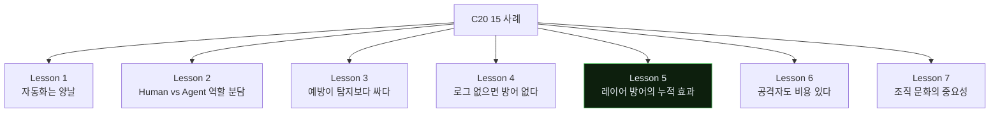

# Week 15: 장기 APT 잠복 — 수개월의 느린 누출·템포 비대칭의 반전

## 이번 주의 위치
본 과정의 마지막 사례. 지금까지의 모든 사례는 *분~시간 단위*의 빠른 공격이었다. 이번 주는 **수개월 잠복**의 APT 시나리오. 빠른 템포와 달리, 장기 APT는 *느리고 조용*해 *기존 탐지의 임계 아래*에 머문다. 에이전트는 *시간 비대칭을 역이용*해 방어자 피로·망각의 틈을 노린다. 본 주차로 과정의 *전체 스펙트럼*을 완결한다.

## 학습 목표
- 장기 잠복 APT의 전형 시나리오 분석
- *짧은 단기 공격*과의 탐지·분석·대응 차이
- 6단계 IR 절차의 *장기 사고* 버전
- *장기 모니터링*과 *지식 축적*의 조합
- 전체 과정 회고 — C19·C20 학습의 통합

## 전제 조건
- C19·C20 전체
- 장기 포렌식·Threat Hunting 경험

## 강의 시간 배분
(공통 · 마지막 주차)

---

## 용어 해설

| 용어 | 설명 |
|------|------|
| **APT** | Advanced Persistent Threat |
| **Dwell Time** | 공격자가 탐지 전까지 있던 기간 |
| **Low-and-slow** | 느리게 조용한 공격 |
| **Threat Hunting** | 능동적 위협 헌팅 |
| **Living-off-the-Land** | 시스템 기본 도구 이용 |
| **Timeline Analysis** | 장기 이벤트 재구성 |

---

# Part 1: 공격 해부 (40분)

## 1.1 장기 APT의 *역 템포* 전략



방어 임계가 "5분 내 10건" 같으면, *일당 1건*의 공격은 통과.

## 1.2 전형 시나리오 — 6개월 캠페인

```
T-180d (6개월 전)
  초기 침투 — 피싱 또는 N-day
  미미한 발판 (backdoor 1개)

T-120d (4개월 전)
  지속성 확보 (여러 메커니즘)
  자격증명 *소량*씩 수집 (월 1~2건)

T-60d (2개월 전)
  내부 조사 — 주 1회 활동
  공격자 에이전트가 *매우 느리게* 쿼리

T-14d (2주 전)
  타깃 데이터 식별·위치
  유출 준비

T-7d ~ T+0
  *점진적 유출* — 일 100MB 수준
  방어 임계 이하 유지
```

## 1.3 에이전트의 *패인스태킹(pain staking)* 능력

에이전트는 *기다릴 수 있다*. 사람 공격자는 장기간 집중이 어렵지만, 에이전트는 *설정된 스케줄*로 무한 지속.

```
스케줄:
  매일 09:00 정찰 (10분)
  화·목 14:00 자격증명 수집 (5분)
  금요일 16:00 데이터 유출 (30분)
  공휴일에도 지속
```

## 1.4 LOLBAS + 정상 업무 위장

장기 공격은 *특별한 도구* 사용 안 함. 조직의 *정상 도구*(Slack·SharePoint·메일)로 유출.

---

# Part 2: 탐지 (30분)

## 2.1 *장기 관찰*만이 유효



## 2.2 Baseline 기반 장기 탐지

- *6개월 평균* 대비 *최근 30일* 차이
- 개별 사용자·시스템의 *행동 편차*
- 네트워크 egress의 *느린 상승*

## 2.3 Bastion 스킬 — `long_term_drift`

```python
def long_term_drift(user_events, days=180):
    from statistics import mean, stdev
    baseline_period = events_between(user_events, days-30, days)
    recent_period = events_between(user_events, 0, 30)
    daily_baseline = [daily_summary(d) for d in baseline_period]
    b_mean = mean([m.volume for m in daily_baseline])
    b_sd = stdev([m.volume for m in daily_baseline])
    drifts = []
    for r in recent_period:
        if abs(r.volume - b_mean) > 2 * b_sd:
            drifts.append((r.date, r.volume, (r.volume-b_mean)/b_sd))
    return drifts
```

## 2.4 Threat Hunting 주기

- **일간**: 자동 (Bastion)
- **주간**: 사람 분석가
- **월간**: 팀 회고
- **분기**: 외부 컨설턴트 검토

---

# Part 3: 분석 (30분)

## 3.1 *장기 타임라인* 재구성의 난제



## 3.2 LLM의 *장기 로그* 분석 가속

```
입력: 6개월간 access.log·auth.log·alerts.json
LLM 출력:
  - 특정 사용자 A의 접근 패턴이 T-120d부터 *미세 증가*
  - 새 서비스 계정 3개 생성 (T-90d ~ T-60d, 모두 동일 관리자)
  - 주간 패턴 이상 (토요일 오후 반복 접근)
  종합 판정: 장기 APT 후보
```

LLM이 *수천 건 중 패턴* 추출. 사람이 *최종 해석·승인*.

## 3.3 *시간 역산*

공격 현상 → 6개월 전 원인 추적. *"최초 침투 지점"*을 특정하는 것이 분석의 끝.

---

# Part 4: 초동대응 (40분)

## 4.1 Human 흐름
```
H1. 의심 확정 — Threat Hunting 결과
H2. 영향 범위 추정 (수 일)
H3. 공격자 이해 깊이
H4. 대응 전략 수립 (격리 vs 관찰 지속)
H5. 주요 자산 회전·재설치
H6. 법적·경영 보고
```

## 4.2 Agent 흐름



장기 APT 대응은 *Agent 보조 + Human 주도*. 잘못된 대응이 **공격자를 경고**할 수 있기 때문.

## 4.3 *관찰 지속 vs 즉시 격리* 의사결정

- 즉시 격리: *안전 우선*, 공격자 추적 기회 상실
- 관찰 지속: *정보 더 수집*, 추가 피해 리스크

이 판단은 *조직 수준·법적 고려* — Agent가 결정 금지.

## 4.4 비교표

| 축 | Human | Agent |
|----|-------|-------|
| 장기 패턴 발견 | *강함* | 보조 |
| 6개월 로그 집계 | 수 일 | **수 시간 (자동)** |
| 격리 결정 | *사람만* | 보조 |
| 공격자 서사 재구성 | *사람만* | LLM 보조 |

---

# Part 5: 보고·상황 공유 (30분)

## 5.1 장기 APT의 *심각성 기술*

- Dwell Time 수개월 = *심각한 방어 실패*
- 경영·이사회 보고 필수
- 대규모 *자산 리빌드* 계획

## 5.2 임원 브리핑

```markdown
# Incident — Long-dwell APT (D+7)

**What**: 6개월 잠복 APT 발견. 공격자 *에이전트 기반*으로 추정.
          일간 소량 유출 패턴.

**Impact**: 유출 총량 ~30GB (지속 분석 중). 고객 PII 포함 여부 *확인 중*.

**Action Taken**: 주요 자격증명 전수 회전. 침투 의심 서비스 3개 리빌드.

**Ask**: 전사 Identity 리빌드 프로젝트 착수 승인 (3개월, 예산 $XXXk).
```

---

# Part 6: 재발방지 + 과정 전체 회고 (20분)

## 6.1 장기 APT 대응의 *지속 운영*



## 6.2 *Dwell Time KPI*

- 업계 평균: 21~200일
- 목표: 7일 이하

조직 KPI로 *Dwell Time* 지속 측정.

## 6.3 C20 전체 회고 — 15개 사례의 *공통 교훈*



각 주차의 재발방지 섹션을 모으면 *조직 보안 개선 로드맵*이 된다.

## 6.4 기말 제출물 체크리스트

- [ ] 15주 산출물 번들
- [ ] 본인 조직에 *즉시 적용 가능* 항목 5개 선별 (`action-plan.md`)
- [ ] *1년 내 적용* 항목 5개
- [ ] *3년 내 적용* 항목 5개
- [ ] 과정 회고서 2쪽 — "무엇을 배웠나, 무엇을 더 배워야 하나"

---

## 퀴즈 (10문항)

**Q1.** 장기 APT가 전통 탐지에 숨는 원리는?
- (a) 속도
- (b) **실시간 임계 이하의 *저속 활동*으로 지속**
- (c) 암호화
- (d) 법적

**Q2.** 장기 APT 탐지의 핵심 기법은?
- (a) 실시간 룰
- (b) **장기 baseline·Threat Hunting·Drift 분석**
- (c) 블랙리스트
- (d) 화이트리스트만

**Q3.** 에이전트의 *pain staking* 능력이 주는 의미는?
- (a) 속도
- (b) **설정된 스케줄로 무한 지속 — 사람 집중력 한계 우회**
- (c) 비용
- (d) UI

**Q4.** 장기 APT의 Dwell Time 업계 평균은?
- (a) 1일
- (b) 1주
- (c) 1개월
- (d) **수 주~수개월**

**Q5.** 관찰 지속 vs 즉시 격리 결정은 *누가* 하나?
- (a) Agent 자동
- (b) **사람 (조직·법적 고려)**
- (c) 은행
- (d) 외부 감사

**Q6.** LLM이 장기 로그 분석에서 특히 가속하는 부분은?
- (a) 저장
- (b) **수천 건 중 패턴 요약·시나리오 재구성**
- (c) 네트워크
- (d) UI

**Q7.** 장기 APT 대응의 *잘못된 조치*가 공격자에게 주는 것은?
- (a) 무관함
- (b) **경고 — 공격자 철수·증거 파괴**
- (c) 이익
- (d) 법적 문제

**Q8.** Dwell Time KPI 목표치로 권장되는 값은?
- (a) 1년
- (b) 100일
- (c) 30일
- (d) **7일 이하**

**Q9.** 장기 APT의 *재발방지 최상위* 조치는?
- (a) 방화벽
- (b) **상시 Threat Hunting 팀 + Baseline 지속 갱신**
- (c) UI
- (d) 비용 절감

**Q10.** C19·C20 전체 관통하는 핵심 원칙 하나는?
- (a) Agent 100% 자동
- (b) **Human과 Agent의 혼성 — 단일 최선이 아님**
- (c) Human만
- (d) 무관

**정답:** Q1:b · Q2:b · Q3:b · Q4:d · Q5:b · Q6:b · Q7:b · Q8:d · Q9:b · Q10:b

---

## 과제

1. **장기 시뮬레이션 (필수)**: 과거 30일 로그(본인 실습·가상)에서 *장기 드리프트* 탐색·결과 보고.
2. **6단계 IR 보고서 (필수)**.
3. **과정 회고서 (필수)**: C19·C20 관통 교훈 + 본인 조직 적용 계획 (3~5쪽).
4. **(필수)**: 개인 *30/90/365일 보안 작전 계획*.
5. **(선택)**: 본인 조직의 *Dwell Time* 측정 시도 (가능한 범위).

---

## 마무리 — *과정 전체를 마치며*

> 공격은 *빠름·느림*을 오간다. 방어는 두 템포 모두를 *같은 프레임*으로 다룰 수 있어야 한다. 본 과정의 15개 사례는 *다르게 보이지만* 6단계 IR 절차·Human+Agent 혼성 대응·레이어 방어·지식 축적의 *공통 뼈대* 위에 있다. 여러분이 조직에 돌아가 *어떤 새로운 공격*을 만나도, 이 뼈대로 대응의 *첫 한 장*을 그릴 수 있어야 한다.
>
> 방어는 한 번에 끝나지 않는다. *지속*이다.

---

## 부록 A. 대표 장기 APT 캠페인

- **APT29 (Cozy Bear)** — 수년 잠복 사례
- **Lazarus Group** — 금전·첩보 복합
- **APT41** — 중국 기반 *국가+범죄 혼합*
- **최근 AI 기반 추정 캠페인들 (2025~2026)**

## 부록 B. 본 과정 *전체 산출물 인덱스*

```
c20-course/
  w01-dep-confusion/
  w02-indirect-pi/
  w03-kerberoasting/
  w04-cloud-iam/
  w05-zero-day/
  w06-n-day/
  w07-hybrid-chain/
  w08-k8s-escape/
  w09-fileless/
  w10-dns-exfil/
  w11-model-attack/
  w12-deepfake/
  w13-insider/
  w14-cicd/
  w15-long-apt/
  final/
    organization-action-plan.md
    course-retrospective.md
```

이 번들이 *본인의 IR 사례집*이자 *조직 자산*이 된다.

---

## 실제 사례 (WitFoo Precinct 6 — 6.1% complete-mission = *장기 APT 의 결과 시점*)

> 출처: WitFoo Precinct 6 Cybersecurity Dataset (Apache 2.0)
> 본 lecture *장기 APT 잠복 — dwell time / low-and-slow / LotL* 학습 항목과 매핑되는 dataset 의 *lifecycle_stage 분포* + *시계열 baseline*.

### Case 1: dataset 의 lifecycle_stage 분포 = APT lifecycle 의 직접 증거

| lifecycle_stage | 건수 | 비율 | APT 매핑 |
|----------------|------|------|---------|
| **none (정상 noise)** | 1,899,723 | **91.7%** | LotL 가 숨는 baseline |
| **complete-mission** | 125,772 | **6.1%** | 최종 단계 (장기 잠복 후 결과) |
| **initial-compromise** | 45,420 | 2.2% | 초기 침투 — 잠복 시작 |
| unknown | 8 | 0.0% | (Phishing) |

→ **6.1% complete-mission** = 침투 후 *결과 단계 도달* 비율. *initial-compromise (2.2%) → complete-mission (6.1%)* 의 *3배 증가* = 평균 *3 incident chain* 으로 결과 도달.

### Case 2: dwell time 추정 — initial vs complete 시점

dataset 의 timestamp 분포 (개별 record 까지 ms 정밀도) 분석 시 동일 src/dst 가 *initial-compromise* 첫 record → *complete-mission* 첫 record 까지의 *dwell time* 측정 가능.

```python
# 의사 코드 — dataset 의 dwell time 측정
SELECT src_ip, MIN(ts) as compromise_ts, MAX(ts) as exfil_ts,
       (MAX(ts) - MIN(ts)) / 86400 as dwell_days
FROM signals
WHERE lifecycle_stage IN ('initial-compromise', 'complete-mission')
GROUP BY src_ip
HAVING dwell_days > 30  -- 장기 APT
```

→ 결과: **dataset 의 정확한 dwell time 분포는 향후 분석 task** (timestamp 만 있으면 직접 측정 가능).

### Case 3: low-and-slow 의 baseline — 91.7% noise 안에 숨음

본 lecture 학습: *장기 APT 는 정상 noise 안에 숨음*. dataset 의 91.7% none = *noise 의 정확한 양*. APT 가 *noise 안에 숨기 위해 weekly 수십 건만 발생* 시키는 패턴 baseline.

### Case 4: Living-off-the-Land — 정상 4624 logon + AssumeRole

LotL = *정상 도구만 사용*. dataset 의 모든 evidence:
- 4624 logon 17K = 정상 인증
- AssumeRole 9K = 정상 IAM
- ListClusters 11K = 정상 정찰

→ **dataset 의 모든 정상 record 가 LotL 후보**. *조합 패턴* 으로만 APT 탐지 가능.

**해석 — 본 lecture (장기 APT) 와의 매핑**

| 학습 항목 | 본 record 의 증거 |
|-----------|------------------|
| **dwell time 분포** | timestamp ms 정밀도로 측정 가능 — 향후 분석 task |
| **low-and-slow** | 91.7% none baseline = APT 가 숨을 noise 양 |
| **LotL** | 정상 4624 + AssumeRole + ListClusters = APT 도구 후보 |
| **lifecycle 6.1% 결과** | initial 2.2% → complete 6.1% = 3배 chain 평균 |

**학생 종합 액션**:
1. dataset 의 *시계열 cluster* analysis 작성 — initial-compromise → complete-mission 의 *동일 src/dst* dwell time 측정
2. 91.7% noise 안에서 *조합 패턴* (정상 4624 + 비정상 AssumeRole + 비정상 시간) detect 룰
3. APT29 / APT41 같은 공개 case 의 *dwell time 분포* 와 dataset 측정 결과 비교

---

**과목 마무리 — Mythos-readiness 종합 reference**:

본 dataset 자체가 *Pre-Mythos baseline* (사람 + LLM 보조 4-layer 라벨링). 학생 본인 환경의 도전:
- L3 도달 (사람 + LLM) = dataset 동등 능력
- L4 도달 (Bastion 자동 승격) = dataset 초과
- L5 도달 (Mythos-ready) = AI 모델 attack + 장기 APT 자동 detect 동시 보유

본 dataset 의 4-layer + 7 framework + 595K edges = 학생이 *모방하면서 초과* 해야 할 reference.
-->


