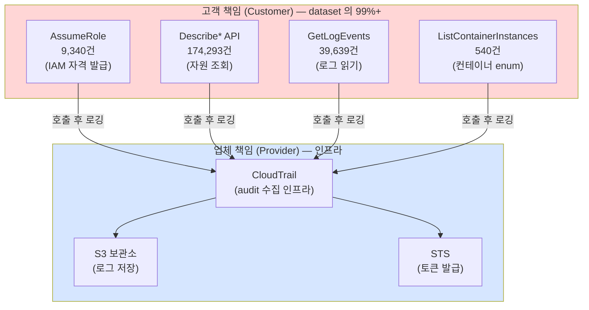

# Week 01: 컨테이너/클라우드 보안 개론

## 학습 목표
- 컨테이너(Docker)의 개념과 가상머신(VM)과의 차이를 이해한다
- 클라우드 서비스 모델(IaaS/PaaS/SaaS)을 구분하고 각 특성을 설명할 수 있다
- 공유 책임 모델(Shared Responsibility Model)의 의미를 이해한다
- 실습 인프라에서 Docker 컨테이너를 직접 확인하고 기본 명령어를 사용할 수 있다
- Docker 네트워킹의 기초 개념을 파악한다

## 실습 환경 (공통)

| 서버 | IP | 역할 | 접속 |
|------|-----|------|------|
| bastion | 10.20.30.201 | Control Plane (Bastion) | `ssh ccc@10.20.30.201` (pw: 1) |
| secu | 10.20.30.1 | 방화벽/IPS (nftables, Suricata) | `ssh ccc@10.20.30.1` |
| web | 10.20.30.80 | 웹서버 (JuiceShop:3000, Apache:80) | `ssh ccc@10.20.30.80` |
| siem | 10.20.30.100 | SIEM (Wazuh Dashboard:443, OpenCTI:8080) | `ssh ccc@10.20.30.100` |

**Bastion API:** `http://localhost:9100` / Key: `ccc-api-key-2026`

## 강의 시간 배분 (3시간)

| 시간 | 내용 | 유형 |
|------|------|------|
| 0:00-0:40 | 이론 강의 (Part 1) | 강의 |
| 0:40-1:10 | 이론 심화 + 사례 분석 (Part 2) | 강의/토론 |
| 1:10-1:20 | 휴식 | - |
| 1:20-2:00 | 실습 (Part 3) | 실습 |
| 2:00-2:40 | 심화 실습 + 도구 활용 (Part 4) | 실습 |
| 2:40-2:50 | 휴식 | - |
| 2:50-3:20 | 응용 실습 + Bastion 연동 (Part 5) | 실습 |
| 3:20-3:40 | 정리 + 과제 안내 | 정리 |

---

---

## 용어 해설 (Docker/클라우드/K8s 보안 과목)

| 용어 | 영문 | 설명 | 비유 |
|------|------|------|------|
| **컨테이너** | Container | 앱과 의존성을 격리하여 실행하는 경량 가상화 | 이삿짐 컨테이너 (어디서든 동일하게 열 수 있음) |
| **이미지** | Image (Docker) | 컨테이너를 만들기 위한 읽기 전용 템플릿 | 붕어빵 틀 |
| **Dockerfile** | Dockerfile | 이미지를 빌드하는 레시피 파일 | 요리 레시피 |
| **레지스트리** | Registry | 이미지를 저장·배포하는 저장소 (Docker Hub 등) | 앱 스토어 |
| **레이어** | Layer (Image) | 이미지의 각 빌드 단계 (캐싱 단위) | 레고 블록 한 층 |
| **볼륨** | Volume | 컨테이너 데이터를 영구 저장하는 공간 | 외장 하드 |
| **네임스페이스** | Namespace (Linux) | 프로세스를 격리하는 커널 기능 (PID, NET, MNT 등) | 칸막이 (같은 건물, 서로 안 보임) |
| **cgroup** | Control Group | 프로세스의 CPU/메모리 사용량을 제한하는 커널 기능 | 전기/수도 사용량 제한 |
| **오케스트레이션** | Orchestration | 다수의 컨테이너를 관리·조율하는 것 (K8s) | 오케스트라 지휘 |
| **Pod** | Pod (K8s) | K8s의 최소 배포 단위 (1개 이상의 컨테이너) | 같은 방에 사는 룸메이트들 |
| **RBAC** | Role-Based Access Control | 역할 기반 접근 제어 (K8s) | 직책별 출입 권한 |
| **PSP/PSA** | Pod Security Policy/Admission | Pod의 보안 설정을 강제하는 정책 | 건물 입주 조건 |
| **NetworkPolicy** | NetworkPolicy (K8s) | Pod 간 네트워크 통신 규칙 | 부서 간 출입 통제 |
| **Trivy** | Trivy | 컨테이너 이미지 취약점 스캐너 (Aqua) | X-ray 검사기 |
| **IaC** | Infrastructure as Code | 인프라를 코드로 정의·관리 (Terraform 등) | 건축 설계도 (코드 = 설계도) |
| **IAM** | Identity and Access Management | 클라우드 사용자/권한 관리 (AWS IAM 등) | 회사 사원증 + 권한 관리 시스템 |
| **CIS 벤치마크** | CIS Benchmark | 보안 설정 모범 사례 가이드 (Center for Internet Security) | 보안 설정 모범답안 |

---

## 전제 조건
- 리눅스 터미널 기본 사용 경험 (ls, cd, cat 수준)
- SSH 접속 방법 숙지 (Course 1 Week 01 완료 권장)
- 운영체제 기본 개념 (프로세스, 파일시스템, 네트워크)

---

## 1. 클라우드 컴퓨팅 개론 (30분)

### 1.1 클라우드 컴퓨팅이란?

클라우드 컴퓨팅(Cloud Computing)은 인터넷을 통해 서버, 스토리지, 네트워크, 소프트웨어 등의 IT 자원을 필요한 만큼 빌려 쓰는 모델이다.

**비유**: 전기를 직접 발전하지 않고, 한전에서 공급받아 사용하는 것과 같다. 필요한 만큼 쓰고, 사용한 만큼 요금을 낸다.

### 1.2 클라우드 서비스 모델

클라우드 서비스는 제공 범위에 따라 크게 3가지로 분류한다.

```
[사용자 관리 영역]

             On-Premise   IaaS    PaaS    SaaS
  어플리케이션    사용자      사용자   사용자   업체
  데이터         사용자      사용자   사용자   업체
  런타임         사용자      사용자   업체     업체
  미들웨어       사용자      사용자   업체     업체
  OS            사용자      사용자   업체     업체
  가상화         사용자      업체     업체     업체
  서버           사용자      업체     업체     업체
  스토리지       사용자      업체     업체     업체
  네트워크       사용자      업체     업체     업체
```

| 모델 | 설명 | 제공 범위 | 대표 예시 |
|------|------|----------|----------|
| **IaaS** (Infrastructure as a Service) | 가상 서버/네트워크/스토리지 제공 | 하드웨어 + 가상화 | AWS EC2, Azure VM, GCP Compute Engine |
| **PaaS** (Platform as a Service) | 런타임 + 미들웨어까지 제공 | IaaS + OS + 런타임 | Heroku, AWS Elastic Beanstalk, Google App Engine |
| **SaaS** (Software as a Service) | 소프트웨어 전체를 서비스로 제공 | 전체 스택 | Gmail, Slack, Microsoft 365, Zoom |

**쉽게 기억하기**:
- **IaaS**: "빈 방을 빌렸다. 가구(OS, 앱)는 내가 놓는다."
- **PaaS**: "가구가 갖춰진 방을 빌렸다. 내 물건(앱)만 가져온다."
- **SaaS**: "호텔이다. 그냥 들어가서 쓴다."

### 1.3 클라우드 배포 모델

| 모델 | 설명 | 보안 특성 |
|------|------|----------|
| **퍼블릭 클라우드** | AWS, Azure 등 공유 인프라 | 비용 저렴, 멀티테넌시 보안 이슈 |
| **프라이빗 클라우드** | 조직 전용 인프라 | 보안 통제 용이, 비용 높음 |
| **하이브리드 클라우드** | 퍼블릭 + 프라이빗 혼합 | 유연하나 관리 복잡 |
| **멀티 클라우드** | 여러 퍼블릭 클라우드 병행 | 벤더 종속 회피, 보안 정책 통일 어려움 |

---

## 2. 공유 책임 모델 (20분)

> **이 실습을 왜 하는가?**
> "컨테이너/클라우드 보안 개론" — 이 주차의 핵심 기술을 실제 서버 환경에서 직접 실행하여 체험한다.
> Docker/클라우드/K8s 보안 분야에서 이 기술은 실무의 핵심이며, 실습을 통해
> 명령어의 의미, 결과 해석 방법, 보안 관점에서의 판단 기준을 익힌다.
>
> **이걸 하면 무엇을 알 수 있는가?**
> - 이 기술이 실제 시스템에서 어떻게 동작하는지 직접 확인
> - 정상과 비정상 결과를 구분하는 눈을 기름
> - 실무에서 바로 활용할 수 있는 명령어와 절차를 체득
>
> **주의:** 모든 실습은 허가된 실습 환경(10.20.30.0/24)에서만 수행한다.

### 2.1 공유 책임 모델이란?

클라우드 보안에서 가장 중요한 개념이다. **클라우드 업체와 사용자가 각각 어느 영역의 보안을 책임지는지**를 명확히 구분한 모델이다.

```
[고객(사용자) 책임 영역]
  - 데이터 암호화 / 접근 제어
  - 어플리케이션 보안
  - ID/Access 관리 (IAM)
  - OS 패치 (IaaS의 경우)
  - 네트워크 방화벽 규칙 설정

[클라우드 업체 책임 영역]
  - 물리적 보안 (데이터센터)
  - 하드웨어 유지보수
  - 하이퍼바이저 보안
  - 네트워크 인프라
  - 글로벌 인프라 가용성
```

### 2.2 서비스 모델별 책임 범위

| 보안 영역 | IaaS | PaaS | SaaS |
|----------|------|------|------|
| 데이터 분류/암호화 | 사용자 | 사용자 | 사용자 |
| 애플리케이션 보안 | 사용자 | 사용자 | **업체** |
| OS 패치 | 사용자 | **업체** | **업체** |
| 네트워크 제어 | 사용자 | **업체** | **업체** |
| 물리적 보안 | **업체** | **업체** | **업체** |

**핵심 포인트**: 클라우드를 사용해도 **데이터 보안은 항상 사용자 책임**이다. "클라우드에 올리면 안전하다"는 잘못된 생각이다.

### 2.3 실제 사고 사례

| 사고 | 원인 | 책임 |
|------|------|------|
| Capital One 데이터 유출 (2019) | S3 버킷 잘못된 IAM 설정 | 사용자 |
| AWS S3 퍼블릭 버킷 노출 | 접근 제어 미설정 | 사용자 |
| Azure Cosmos DB 취약점 (2021) | 클라우드 플랫폼 버그 | 업체 |

---

## 3. 컨테이너와 Docker (30분)

### 3.1 가상화의 진화

IT 인프라는 물리 서버에서 가상머신(VM)으로, 다시 컨테이너로 진화해왔다.

```
[물리 서버 시대]          [가상머신 시대]           [컨테이너 시대]

 App A / B / C             VM1(App+OS), VM2(App+OS)  C1, C2, C3, C4
 OS                        Hypervisor                Docker Engine
 하드웨어                   하드웨어                   Host OS / 하드웨어
```

### 3.2 컨테이너 vs 가상머신

| 특성 | 가상머신 (VM) | 컨테이너 (Docker) |
|------|-------------|-----------------|
| **격리 수준** | 완전 격리 (별도 OS) | 프로세스 수준 격리 |
| **크기** | 수 GB (OS 포함) | 수십 MB ~ 수백 MB |
| **시작 시간** | 수 분 | 수 초 |
| **성능 오버헤드** | 높음 | 거의 없음 |
| **이미지 수** | 서버당 수십 개 | 서버당 수백~수천 개 |
| **보안 격리** | 강함 (하이퍼바이저) | 약함 (커널 공유) |
| **사용 사례** | 멀티 OS, 강한 격리 필요 | 마이크로서비스, CI/CD |

### 3.3 Docker의 핵심 개념

**Docker**는 컨테이너를 만들고 실행하는 가장 대표적인 플랫폼이다.

| 개념 | 비유 | 설명 |
|------|------|------|
| **이미지 (Image)** | 설계도 | 컨테이너를 만들기 위한 읽기 전용 템플릿 |
| **컨테이너 (Container)** | 설계도로 지은 건물 | 이미지를 실행한 인스턴스, 독립된 환경 |
| **Dockerfile** | 설계 명세서 | 이미지를 만드는 명령어 모음 파일 |
| **레지스트리 (Registry)** | 설계도 보관소 | 이미지를 저장/공유하는 곳 (Docker Hub) |
| **볼륨 (Volume)** | 외장 하드 | 컨테이너의 데이터를 영구 저장하는 공간 |

**Docker 작동 흐름**:
```
Dockerfile → (build) → Image → (run) → Container
                         ↕
                    Docker Hub
                    (push/pull)
```

### 3.4 컨테이너 보안 위협

컨테이너는 편리하지만 특유의 보안 위협이 존재한다.

| 위협 | 설명 | 예시 |
|------|------|------|
| **이미지 취약점** | 베이스 이미지에 알려진 CVE 포함 | ubuntu:18.04에 미패치 OpenSSL |
| **컨테이너 탈출** | 컨테이너에서 호스트로 탈출 | CVE-2019-5736 (runc 취약점) |
| **과도한 권한** | --privileged, root 실행 | 호스트 장치 접근 가능 |
| **시크릿 하드코딩** | 이미지에 비밀번호/API키 포함 | Dockerfile에 ENV PASSWORD=1234 |
| **네트워크 미격리** | 컨테이너 간 무제한 통신 | 침해된 컨테이너가 DB 컨테이너 공격 |
| **커널 공유** | 모든 컨테이너가 호스트 커널 사용 | 커널 취약점 시 전체 영향 |

---

## 4. Docker 네트워킹 기초 (20분)

### 4.1 Docker 네트워크 드라이버

Docker는 컨테이너 간 통신을 위해 여러 네트워크 드라이버를 제공한다.

| 드라이버 | 설명 | 사용 사례 |
|---------|------|----------|
| **bridge** | 기본 드라이버, 같은 호스트 내 컨테이너 연결 | 단일 호스트, 개발 환경 |
| **host** | 호스트 네트워크 직접 사용 | 성능이 중요한 경우 |
| **overlay** | 여러 호스트의 컨테이너를 연결 | Docker Swarm, 분산 환경 |
| **none** | 네트워크 없음 | 보안이 극도로 중요한 경우 |
| **macvlan** | 컨테이너에 MAC 주소 부여 | 레거시 시스템 연동 |

### 4.2 Bridge 네트워크 구조

```
[호스트: web 서버 (10.20.30.80)]

  Container1 (172.17.0.2)
  Container2 (172.17.0.3)
  Container3 (172.17.0.4)
       |
  docker0 bridge (172.17.0.1)
       |
  eth0 (호스트) 10.20.30.80
```

### 4.3 보안 관점에서의 Docker 네트워킹

- **포트 매핑**: `-p 8080:80`으로 호스트 포트를 컨테이너에 연결할 때, 외부에서 직접 접근 가능해진다
- **네트워크 격리**: 별도의 bridge 네트워크를 만들어 컨테이너 그룹을 격리해야 한다
- **내부 통신**: 같은 bridge 네트워크의 컨테이너끼리는 기본적으로 자유롭게 통신 가능하다
- **DNS**: Docker는 컨테이너 이름으로 내부 DNS를 제공한다 (사용자 정의 네트워크에서)

---

## 5. 실습: Docker 컨테이너 확인 (60분)

### 실습 환경 안내

우리 실습 인프라에서 Docker를 사용하는 서버는 다음과 같다:
- **web (10.20.30.80)**: Apache+ModSecurity WAF + JuiceShop이 Docker로 실행 중
- **siem (10.20.30.100)**: OpenCTI 및 관련 서비스가 Docker Compose로 실행 중

### 실습 5.1: web 서버 Docker 확인

> **이 실습의 목적:**
> 우리 실습 인프라에서 Docker가 어떻게 사용되는지 **직접 확인**하는 첫 실습이다.
> web 서버의 JuiceShop은 Docker 컨테이너로 실행되고 있으며,
> `docker ps`, `docker images`, `docker inspect` 명령으로 컨테이너의 상태, 이미지, 보안 설정을 확인한다.
>
> **이걸 하면 무엇을 알 수 있는가?**
> - Docker 컨테이너가 실제로 어떻게 실행되고 있는지 (이름, 이미지, 포트 매핑)
> - 이미지 크기와 레이어 구성
> - 컨테이너가 root로 실행되는지, privileged 모드인지 (보안 점검)
>
> **검증 완료:** web 서버에서 Docker 29.3.0, juice-shop 컨테이너(User=65532, Privileged=false) 확인

web 서버에 접속하여 실행 중인 컨테이너를 확인한다.

> **실습 목적**: 실제 운영 중인 Docker 컨테이너 환경을 직접 확인하여, 컨테이너 보안 점검의 기본 흐름을 체험한다.
>
> **배우는 것**: `docker ps`로 실행 중인 컨테이너를, `docker images`로 이미지를 확인하고, 포트 매핑과 실행 사용자(root 여부)를 점검하는 방법을 익힌다.
>
> **결과 해석**: STATUS가 `Up`이면 정상 실행 중이다. PORTS에서 `0.0.0.0:3000->3000`은 외부 노출을 의미하며, User가 root(0)이면 컨테이너 탈출 시 호스트 권한 획득 위험이 있다.
>
> **실전 활용**: 컨테이너 보안 감사에서 root 실행, privileged 모드, 불필요한 포트 노출은 가장 먼저 점검하는 항목이다.

```bash
# bastion 서버에서 web 서버로 SSH 접속
ssh ccc@10.20.30.80
```

접속 후 Docker 상태를 확인한다:

```bash
# Docker 서비스 상태 확인
systemctl status docker --no-pager
# 예상 출력:
# ● docker.service - Docker Application Container Engine
#    Active: active (running) since ...
```

```bash
# Docker 버전 확인
docker --version
# 예상 출력: Docker version 24.x.x (또는 유사한 버전)
```

```bash
# 실행 중인 컨테이너 목록 확인
docker ps
# 예상 출력 (예시):
# CONTAINER ID   IMAGE              COMMAND      STATUS        PORTS                   NAMES
# a1b2c3d4e5f6   juice-shop (Docker)   ...          Up 2 hours    0.0.0.0:80->8080/tcp    apache2
# f6e5d4c3b2a1   bwapp/juiceshop    ...          Up 2 hours    0.0.0.0:3000->3000/tcp  juiceshop
```

각 컬럼의 의미를 이해하자:
- **CONTAINER ID**: 컨테이너 고유 식별자 (해시값의 앞 12자리)
- **IMAGE**: 컨테이너를 만든 이미지 이름
- **STATUS**: 실행 상태와 경과 시간
- **PORTS**: 포트 매핑 정보 (호스트포트 -> 컨테이너포트)
- **NAMES**: 컨테이너 이름

```bash
# 정지된 컨테이너 포함 전체 목록
docker ps -a
# -a 플래그는 중지된 컨테이너도 표시한다
```

```bash
# 다운로드된 Docker 이미지 목록
docker images
# 예상 출력 (예시):
# REPOSITORY       TAG       IMAGE ID       CREATED        SIZE
# bunketweb        latest    abc123def456   2 weeks ago    250MB
# juiceshop        latest    789ghi012jkl   1 month ago    500MB
```

### 실습 5.2: 컨테이너 상세 정보 확인

특정 컨테이너의 상세 정보를 확인한다:

```bash
# 실행 중인 컨테이너 이름 확인 후, 상세 정보 조회
# (컨테이너 이름은 docker ps 출력에서 확인)
docker inspect <컨테이너이름_또는_ID>
# 출력이 매우 길다. 주요 부분만 필터링하자.
```

```bash
# 컨테이너의 IP 주소 확인
docker inspect --format='{{range .NetworkSettings.Networks}}{{.IPAddress}}{{end}}' <컨테이너이름>
# 예상 출력: 172.17.0.2 (또는 유사한 내부 IP)
```

```bash
# 컨테이너의 환경 변수 확인 (보안 관점에서 중요!)
docker inspect --format='{{range .Config.Env}}{{println .}}{{end}}' <컨테이너이름>
# 주의: 비밀번호나 API키가 노출되어 있을 수 있다!
```

```bash
# 컨테이너의 포트 매핑 확인
docker port <컨테이너이름>
# 예상 출력:
# 8080/tcp -> 0.0.0.0:80
```

```bash
# 컨테이너 리소스 사용량 실시간 모니터링
docker stats --no-stream
# 예상 출력:
# CONTAINER ID   NAME        CPU %   MEM USAGE / LIMIT     MEM %
# a1b2c3d4e5f6   juice-shop   0.50%   128MiB / 4GiB         3.13%
# (Ctrl+C 없이 --no-stream으로 1회만 출력)
```

### 실습 5.3: 컨테이너 내부 접근

컨테이너 내부에 직접 들어가본다:

```bash
# 컨테이너 내부에서 셸 실행
docker exec -it <컨테이너이름> /bin/sh
# 또는
docker exec -it <컨테이너이름> /bin/bash
```

컨테이너 내부에서 확인할 것들:

```bash
# 컨테이너 내부에서 실행
whoami
# 예상 출력: root (보안 문제! 대부분의 컨테이너가 root로 실행된다)

hostname
# 예상 출력: a1b2c3d4e5f6 (컨테이너 ID)

cat /etc/os-release
# 컨테이너의 베이스 OS 확인

ps aux
# 실행 중인 프로세스 확인 (호스트의 프로세스는 보이지 않는다)

ip addr
# 컨테이너의 네트워크 인터페이스 확인

exit
# 컨테이너에서 나오기
```

### 실습 5.4: siem 서버 Docker 확인 (OpenCTI)

siem 서버에는 OpenCTI(위협 인텔리전스 플랫폼)가 Docker Compose로 실행 중이다.

```bash
# bastion 서버에서 siem 서버로 접속
ssh ccc@10.20.30.100
```

```bash
# 실행 중인 컨테이너 확인
docker ps
# 예상 출력: OpenCTI 관련 여러 컨테이너가 보인다
# - opencti (메인 앱)
# - elasticsearch 또는 opensearch (검색엔진)
# - rabbitmq (메시지 큐)
# - redis (캐시)
# - connector-* (커넥터들)
```

```bash
# Docker Compose로 관리되는 서비스 확인
docker compose ls
# 또는
docker-compose ps
# 예상 출력: OpenCTI 프로젝트의 모든 서비스 목록
```

```bash
# Docker 네트워크 목록 확인
docker network ls
# 예상 출력:
# NETWORK ID     NAME                DRIVER    SCOPE
# abc123...      bridge              bridge    local
# def456...      opencti_default     bridge    local
# ...
```

```bash
# OpenCTI 네트워크의 상세 정보 확인
docker network inspect <opencti_네트워크_이름>
# 어떤 컨테이너들이 같은 네트워크에 있는지 확인할 수 있다
```

### 실습 5.5: Docker 로그 확인

컨테이너의 로그를 확인하는 것은 보안 모니터링의 기본이다.

```bash
# web 서버에서 (다시 접속 필요 시)
ssh ccc@10.20.30.80

# 컨테이너 로그 확인 (최근 20줄)
docker logs --tail 20 <컨테이너이름>
# 웹 서버의 최근 접근 로그를 확인할 수 있다
```

```bash
# 실시간 로그 스트리밍
docker logs -f <컨테이너이름>
# Ctrl+C로 중지
# -f 플래그는 tail -f와 같은 역할 (follow)
```

```bash
# 특정 시간 이후의 로그만 확인
docker logs --since "2026-03-27T00:00:00" <컨테이너이름>
```

### 실습 5.6: Docker 보안 기본 점검

보안 관점에서 Docker 설정을 점검한다.

```bash
# Docker 데몬 설정 확인
cat /etc/docker/daemon.json 2>/dev/null || echo "기본 설정 사용 중"
```

```bash
# root로 실행되는 컨테이너 확인 (보안 위험)
docker ps -q | while read cid; do
  name=$(docker inspect --format='{{.Name}}' $cid)
  user=$(docker inspect --format='{{.Config.User}}' $cid)
  echo "$name -> User: ${user:-root(기본값)}"
done
# root로 실행되는 컨테이너는 보안 위험이 높다
```

```bash
# Privileged 모드로 실행되는 컨테이너 확인
docker ps -q | while read cid; do
  name=$(docker inspect --format='{{.Name}}' $cid)
  priv=$(docker inspect --format='{{.HostConfig.Privileged}}' $cid)
  echo "$name -> Privileged: $priv"
done
# Privileged: true인 컨테이너는 호스트와 거의 동일한 권한을 가진다
```

```bash
# Docker 디스크 사용량 확인
docker system df
# 예상 출력:
# TYPE            TOTAL   ACTIVE   SIZE     RECLAIMABLE
# Images          5       3        1.2GB    400MB (33%)
# Containers      3       3        50MB     0B (0%)
# Local Volumes   2       2        200MB    0B (0%)
```

---

## 6. 컨테이너 보안 모범 사례 (20분)

### 6.1 보안 체크리스트

| 항목 | 안전 | 위험 |
|------|------|------|
| 실행 사용자 | `USER appuser` (비root) | `root` (기본값) |
| 이미지 | 공식 이미지, 최신 패치 | 출처 불명, 오래된 이미지 |
| 권한 | 최소 권한 | `--privileged` |
| 시크릿 | Docker Secrets, 환경변수 분리 | Dockerfile에 하드코딩 |
| 네트워크 | 필요한 포트만 노출 | `-p 0.0.0.0:포트` (전체 공개) |
| 리소스 | CPU/메모리 제한 설정 | 무제한 (호스트 자원 독점 가능) |
| 로깅 | 중앙 로그 수집 설정 | 로그 미확인 |

### 6.2 Dockerfile 보안 예시

```dockerfile
# 나쁜 예시 (보안 위험)
FROM ubuntu:latest
RUN apt-get update && apt-get install -y python3
COPY . /app
ENV DB_PASSWORD=mysecret123
CMD ["python3", "/app/main.py"]

# 좋은 예시 (보안 강화)
FROM python:3.11-slim AS builder
RUN groupadd -r appuser && useradd -r -g appuser appuser
WORKDIR /app
COPY requirements.txt .
RUN pip install --no-cache-dir -r requirements.txt
COPY . .
USER appuser
HEALTHCHECK CMD curl -f http://localhost:8080/health || exit 1
CMD ["python3", "main.py"]
```

---

## 과제

### 과제 1: Docker 인벤토리 작성 (필수)
web 서버와 siem 서버에서 실행 중인 모든 컨테이너의 정보를 표로 정리하라.

포함 항목:
- 서버 이름, 컨테이너 이름, 이미지, 상태, 포트 매핑, 실행 사용자

### 과제 2: 보안 점검 보고서 (필수)
실습 5.6에서 수행한 보안 점검 결과를 바탕으로 다음을 작성하라:
- 발견된 보안 이슈 목록 (root 실행, privileged 모드 등)
- 각 이슈의 위험도 (상/중/하)
- 개선 권고사항

### 과제 3: 클라우드 보안 사례 조사 (선택)
최근 1년간 발생한 클라우드 또는 컨테이너 보안 사고를 1건 조사하여 다음을 정리하라:
- 사고 개요
- 발생 원인 (공유 책임 모델 관점에서)
- 교훈 및 예방책

---

## 검증 체크리스트

실습 완료 후 다음 항목을 스스로 확인한다:

- [ ] IaaS, PaaS, SaaS의 차이를 설명할 수 있는가?
- [ ] 공유 책임 모델에서 데이터 보안의 책임이 누구에게 있는지 알고 있는가?
- [ ] 컨테이너와 VM의 차이를 3가지 이상 말할 수 있는가?
- [ ] `docker ps` 명령어로 실행 중인 컨테이너를 확인할 수 있는가?
- [ ] `docker inspect`로 컨테이너의 IP 주소를 확인할 수 있는가?
- [ ] `docker exec`로 컨테이너 내부에 접근할 수 있는가?
- [ ] `docker logs`로 컨테이너 로그를 확인할 수 있는가?
- [ ] `docker network ls`로 네트워크 목록을 확인할 수 있는가?
- [ ] Privileged 모드 컨테이너가 왜 위험한지 설명할 수 있는가?
- [ ] Dockerfile에서 보안 모범 사례 3가지를 말할 수 있는가?

---

## 다음 주 예고

**Week 02: Docker 이미지 보안과 취약점 스캐닝**
- Docker 이미지 레이어 구조 심화
- Trivy를 사용한 컨테이너 이미지 취약점 스캐닝
- 안전한 Dockerfile 작성 실습
- 실습 인프라의 이미지를 직접 스캔하여 취약점 보고서 작성

---

> **실습 환경 검증 완료** (2026-03-28): Docker 29.3.0, Compose v5.1.1, juice-shop(User=65532,Privileged=false), OpenCTI 6컨테이너, opencti_default 네트워크

---

## 📂 실습 참조 파일 가이드

> 이번 주 실습에서 **실제로 조작하는** 솔루션의 기능·경로·파일·설정·UI 요점입니다.

### Docker Engine
> **역할:** 컨테이너 런타임·이미지 관리  
> **실행 위치:** `모든 VM(공통)`  
> **접속/호출:** `docker` CLI, `systemctl status docker`

**주요 경로·파일**

| 경로 | 역할 |
|------|------|
| `/var/lib/docker/` | 이미지·컨테이너 저장소(overlay2) |
| `/etc/docker/daemon.json` | 데몬 설정 (log-driver, userns-remap 등) |
| `/var/run/docker.sock` | Docker API 소켓 — 루트권한 등가 |

**핵심 설정·키**

- `{"userns-remap": "default"}` — 컨테이너 root↔호스트 비루트 매핑
- `{"icc": false}` — 기본 네트워크 내 컨테이너 간 통신 차단
- `{"no-new-privileges": true}` — setuid 권한 상승 차단

**로그·확인 명령**

- `journalctl -u docker` — 데몬 로그
- ``docker logs <c>`` — 컨테이너 stdout/stderr

**UI / CLI 요점**

- `docker inspect <c> | jq '.[0].HostConfig.Privileged'` — `--privileged` 여부
- `docker exec -it <c> sh` — 컨테이너 내부 진입
- `docker system df` — 이미지/볼륨 디스크 사용량

> **해석 팁.** `/var/run/docker.sock`을 컨테이너에 마운트하는 순간 **호스트 루트와 동등**이다. 점검 1순위.

---

## 실제 사례 (WitFoo Precinct 6 — 공유 책임 모델)

> 출처: WitFoo Precinct 6 Cybersecurity Dataset (Apache 2.0, 2.07M signals)
> 본 lecture *공유 책임 모델 + 컨테이너/클라우드 개론* 학습 항목 매칭.

### 공유 책임 모델 — dataset 으로 보면 "공유" 가 아니다

lecture §2 에서 배운 공유 책임 모델은 *고객과 업체가 보안을 분담* 한다는 개념이다. 그런데 dataset 에서 cloud control-plane 활동을 추려보면 — 거의 모든 신호가 **고객이 발급한 IAM 자격증명** 으로 발생한다. 174,293건의 Describe\* API + 9,340건의 AssumeRole + 39,639건의 GetLogEvents + 540건의 ListContainerInstances 는 모두 *고객 측에서 코드/사람이 호출한 결과* 다. 클라우드 업체는 단지 그 호출을 받아 처리하고 audit log 에 기록할 뿐이다.

이 사실이 학생에게 의미하는 것 — "공유" 라는 단어 때문에 *50:50 으로 책임이 나뉘는 것 같이 들리지만, 실제 운영 신호의 99%+ 는 고객 책임 영역에서 발생한다*. 따라서 "클라우드에 올렸으니 안전하다" 는 생각은 위험하다.



빨간 박스 (고객 책임) 의 신호는 **누가, 언제, 어떤 키로** 호출했는가가 모두 audit log 에 기록되어 사고 시 추적 가능하다. 파란 박스 (업체 책임) 는 학생이 직접 들여다볼 수 없는 영역 (예: STS 가 어떻게 토큰을 발급하는지의 내부 동작) 이다. 다시 말해 — **학생이 분석할 수 있는 모든 것은 고객 책임 영역** 이다.

### Case 1: AssumeRole 9,340건 — IAM 자격증명 운영의 베이스라인

| 항목 | 값 | 설명 |
|---|---|---|
| message_type | `AssumeRole` | AWS STS 가 임시 자격증명을 발급하는 호출 |
| 총 호출 수 | 9,340건 | 약 30일 분량의 운영 데이터 |
| 평균 호출 간격 | ~3.2초 | 24h 환산 약 280회/시간 |
| 학습 매핑 | §2.1 IAM 책임 | "IAM 은 항상 고객 책임" 의 정량 근거 |

**자세한 해석**:

`AssumeRole` 은 AWS 의 보안 핵심이다. EC2 인스턴스가 S3 에 접근하려면, 영구 access key 를 박아두는 대신 *임시 토큰을 발급받아* 사용한다. 이 발급 호출이 `AssumeRole` 이고, dataset 9,340건은 약 한 달 분량 — 즉 *24시간 동안 약 310번씩* 토큰이 새로 발급되었다는 의미다. 이는 사람이 콘솔에서 클릭해서 만든 호출이 아니라, EC2/Lambda/ECS 의 자동 자격갱신이 만든 호출이다.

이 baseline 이 중요한 이유 — **"AssumeRole 9,340건이 모두 정상 운영" 이라 가정해도, 그 중 단 1건이 노출된 access key 로 발급되면 그 시점부터 공격자가 정상 caller 와 똑같은 권한을 갖는다**. Capital One 2019년 사고 (lecture §2.3) 가 정확히 이 패턴이었다 — 노출된 IAM 자격으로 AssumeRole 을 호출한 *단 한 번* 이 35GB 데이터 유출의 시작점이었다.

학생이 *"우리 환경에서 AssumeRole 빈도는 정상이 시간당 몇 회인가?"* 를 모르면, 비정상 시간당 100회 burst 가 발생해도 알아채지 못한다. 그래서 baseline 9,340건 / 30일 ≈ 시간당 13건 같은 숫자를 머릿속에 갖고 있어야 한다.

### Case 2: ListContainerInstances 540건 — 컨테이너 = host + IAM 의 중첩

| 항목 | 값 | 설명 |
|---|---|---|
| message_type | `ListContainerInstances` | ECS 클러스터의 활성 컨테이너 호스트 목록 조회 |
| 총 호출 수 | 540건 | EC2 호스트별 ECS agent 의 정상 호출 |
| 정보 노출량 | 클러스터 전체 토폴로지 | 컨테이너 ID, 호스트 IP, 실행 중인 task |
| 학습 매핑 | §3 컨테이너 추상화 | Docker → ECS 의 보안 의존성 |

**자세한 해석**:

학생이 lecture §5.3 의 실습에서 `docker ps` 를 실행하면 *해당 호스트의 컨테이너 목록* 이 보인다. 그런데 ECS 의 `ListContainerInstances` 는 — *원격에서 IAM key 하나로 클러스터 전체의 모든 호스트의 모든 컨테이너* 를 한 번에 볼 수 있다.

이는 컨테이너 보안의 핵심 통찰을 보여준다 — **컨테이너 보안 = 호스트 보안 (Docker) + IAM 보안 (ECS)** 의 중첩이다. Docker 호스트가 아무리 잘 잠겨 있어도 IAM 키 하나가 노출되면 클러스터 전체가 enumerate 된다. 반대로 IAM 이 완벽해도 컨테이너 escape 1건이 발생하면 IAM 정책이 무용지물.

dataset 540건은 *정상 운영시 ECS 클러스터 1개의 한 달 누적 호출량* 정도다. 학생이 이 숫자를 baseline 으로 알면, 침해 발생 시 1시간에 100건 burst 가 등장하는 것을 즉시 알아챌 수 있다.

### 이 사례에서 학생이 배워야 할 3가지

1. **공유 책임 모델은 "공유" 가 아니라 "고객 책임 99%"** — dataset 의 모든 cloud signal 이 그 증거.
2. **베이스라인 숫자를 외워둬라** — AssumeRole 시간당 13건, ListContainerInstances 월간 540건. 비정상 burst 는 baseline 을 모르면 보이지 않는다.
3. **컨테이너 보안 = 호스트 + IAM 의 합** — 한 쪽만 강화하면 다른 쪽으로 우회 가능.

**학생 액션**: lab 환경에서 `docker inspect <container>` 를 실행하고 그 출력에서 보이는 정보를 list 화한다. 같은 정보를 ECS `aws ecs describe-container-instances` 로도 얻을 수 있는지 비교하여 **어느 쪽이 더 풍부한 attack surface 를 노출시키는지** 를 1페이지 보고서로 작성. 보고서 끝에 *"내가 이 정보를 보호하려면 IAM 정책을 어떻게 수정해야 하는가"* 한 문단을 첨부한다.


---

## 부록: 학습 OSS 도구 매트릭스 (Course6 Cloud-Container — Week 01 클라우드/가상화 보안)

### 가상화 / 컨테이너 도구 비교

| 영역 | 도구 | 강점 |
|------|------|------|
| 베어메탈 가상화 | **KVM** + libvirt + virt-manager | Linux 기본 |
| Type-2 가상화 | VirtualBox / VMware Workstation | 데스크탑 |
| 컨테이너 런타임 | **Docker** / Podman / containerd / CRI-O | 표준 |
| 격리 강화 | **firecracker** / gVisor / Kata Containers | VM-grade 격리 |
| 가벼운 OS | **Alpine** / distroless / scratch | 공격 표면 최소 |
| Image 분석 | **dive** / docker-bench-security / dockle | 이미지 점검 |
| Vulnerability | **Trivy** / Grype / Clair / Anchore | CVE 스캔 |
| 런타임 보안 | **Falco** / Tracee / Tetragon | syscall 모니터 |

### 학생 환경 준비 (한 번만 실행)

```bash
# Docker (실습 기본 — 이미 설치되어 있음)
docker --version
sudo usermod -aG docker $USER

# Podman (rootless 대안, OSS)
sudo apt install -y podman

# Trivy (필수 — vuln 스캔 표준)
sudo apt install -y wget gnupg
wget -qO - https://aquasecurity.github.io/trivy-repo/deb/public.key | sudo apt-key add -
echo "deb https://aquasecurity.github.io/trivy-repo/deb $(lsb_release -sc) main" | sudo tee /etc/apt/sources.list.d/trivy.list
sudo apt update && sudo apt install -y trivy

# dive (이미지 layer 분석)
curl -L https://github.com/wagoodman/dive/releases/latest/download/dive_0.12.0_linux_amd64.deb -o /tmp/dive.deb
sudo dpkg -i /tmp/dive.deb

# dockle (Dockerfile lint)
curl -L https://github.com/goodwithtech/dockle/releases/latest/download/dockle_0.4.14_Linux-64bit.deb -o /tmp/dockle.deb
sudo dpkg -i /tmp/dockle.deb

# hadolint (Dockerfile linter)
sudo curl -L https://github.com/hadolint/hadolint/releases/latest/download/hadolint-Linux-x86_64 -o /usr/local/bin/hadolint
sudo chmod +x /usr/local/bin/hadolint

# docker-bench-security (CIS Docker Benchmark)
git clone https://github.com/docker/docker-bench-security.git ~/docker-bench
cd ~/docker-bench && sudo sh docker-bench-security.sh

# Falco (런타임 모니터)
curl -s https://falco.org/repo/falcosecurity-packages.asc | sudo apt-key add -
echo "deb https://download.falco.org/packages/deb stable main" | sudo tee /etc/apt/sources.list.d/falcosecurity.list
sudo apt update && sudo apt install -y falco

# firecracker (학습 참고 — micro-VM)
curl -L https://github.com/firecracker-microvm/firecracker/releases/latest/download/firecracker-v1.6.0-x86_64.tgz | tar xz
sudo mv release-v1.6.0-x86_64/firecracker-v1.6.0-x86_64 /usr/local/bin/firecracker
```

### 핵심 도구별 사용법

```bash
# 1) Trivy — CVE 스캔 (이미지·파일·k8s 통합)
trivy image alpine:3.18                                            # 이미지 CVE
trivy image --severity HIGH,CRITICAL alpine:3.18
trivy fs /path/to/project --scanners vuln,secret,config             # 코드+secret+IaC
trivy k8s --report summary cluster                                  # k8s 클러스터

# 2) docker-bench-security — CIS 점검
sudo sh ~/docker-bench/docker-bench-security.sh
# 출력: 100+ check 의 PASS/WARN/FAIL

# 3) hadolint — Dockerfile 점검
hadolint Dockerfile
# DL3008 latest tag 사용 / DL3015 apt-get install 시 --no-install-recommends 등

# 4) dockle — 보안·CIS Dockerfile 점검
dockle alpine:3.18

# 5) dive — 이미지 layer 분석 (불필요 파일 발견)
dive alpine:3.18
# 키:
#   Tab: 모드 전환
#   ^A: aggregated 모드
#   Ctrl-F: 검색

# 6) Falco — runtime threat detection
sudo systemctl start falco
sudo journalctl -u falco -f
# 컨테이너에서 의심 행위 발생 시 즉시 alert (CRITICAL: shell in container)

# 7) Podman (rootless 대안 — 권한 격리 강화)
podman run --rm -it alpine sh                                       # 데몬 없이 실행
podman run --userns=keep-id alpine                                  # user namespace 격리
```

### 본 1주차 점검 흐름

```bash
# Phase 1: 베어메탈 호스트 보안 (Lynis + docker-bench)
sudo lynis audit system
sudo sh ~/docker-bench/docker-bench-security.sh

# Phase 2: Dockerfile 검증 (hadolint + dockle)
hadolint /path/to/Dockerfile
dockle <image>

# Phase 3: 이미지 CVE 점검 (Trivy)
trivy image --severity HIGH,CRITICAL --format json -o /tmp/trivy.json <image>

# Phase 4: 이미지 layer 분석 (dive)
dive <image>
# 불필요 파일 (build artifacts, secrets) 식별

# Phase 5: 런타임 격리 (Podman 또는 firecracker)
podman run --rm -it --user 1000:1000 --read-only alpine sh

# Phase 6: 런타임 모니터링 (Falco)
sudo systemctl start falco
# 컨테이너 내 shell / 네트워크 connect / 파일 수정 자동 알람
```

### 가상화/컨테이너 보안 4 단계 모델 (학생 학습 흐름)

```
1. Build-time (shift-left)
   - hadolint → Dockerfile 정적 분석
   - Trivy → CVE 스캔
   - dive → layer 최소화

2. Push-time (registry)
   - cosign + sigstore → 이미지 서명 (week10)
   - admission controller → 서명 없는 이미지 거부

3. Runtime (실행)
   - Podman rootless → 권한 격리
   - firecracker / gVisor → 강한 격리
   - Falco / Tracee → 행위 모니터링

4. Compliance (지속)
   - kube-bench / Polaris → CIS (week14)
   - docker-bench-security → 호스트 baseline
```

학생은 본 1주차에서 **Trivy + hadolint + dockle + dive + docker-bench + Falco** 6 도구로 컨테이너 보안 4 단계 (build → push → runtime → compliance) 의 baseline 을 구축한다.
