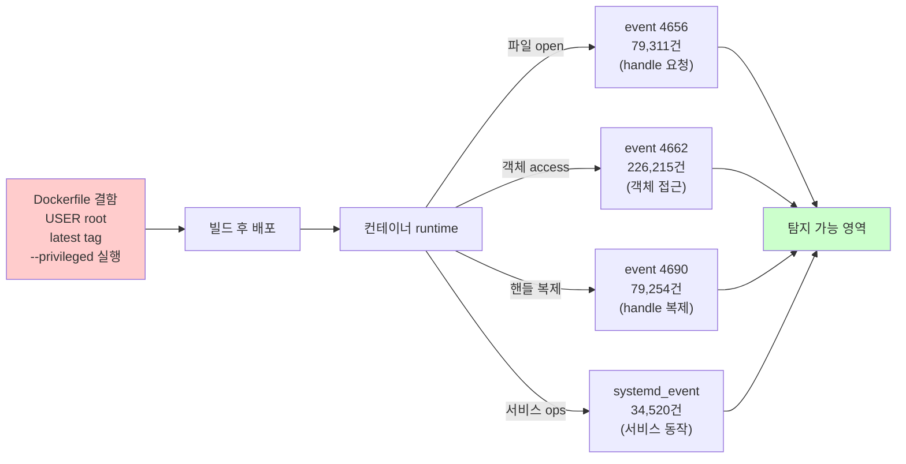

# Week 02: Docker 기초 + 보안

## 학습 목표
- Docker의 핵심 개념(이미지, 컨테이너, 네트워크, 볼륨)을 이해한다
- Dockerfile을 작성하고 보안 관점에서 점검할 수 있다
- 컨테이너 기반 환경의 보안 이점과 위험을 설명할 수 있다

## 실습 환경 (공통)

| 서버 | IP | 역할 | 접속 |
|------|-----|------|------|
| bastion | 10.20.30.201 | Control Plane (Bastion) | `ssh ccc@10.20.30.201` (pw: 1) |
| secu | 10.20.30.1 | 방화벽/IPS (nftables, Suricata) | `ssh ccc@10.20.30.1` |
| web | 10.20.30.80 | 웹서버 (JuiceShop:3000, Apache:80) | `ssh ccc@10.20.30.80` |
| siem | 10.20.30.100 | SIEM (Wazuh Dashboard:443, OpenCTI:8080) | `ssh ccc@10.20.30.100` |

**Bastion API:** `http://localhost:9100` / Key: `ccc-api-key-2026`

## 강의 시간 배분 (3시간)

| 시간 | 내용 | 유형 |
|------|------|------|
| 0:00-0:40 | 이론 강의 (Part 1) | 강의 |
| 0:40-1:10 | 이론 심화 + 사례 분석 (Part 2) | 강의/토론 |
| 1:10-1:20 | 휴식 | - |
| 1:20-2:00 | 실습 (Part 3) | 실습 |
| 2:00-2:40 | 심화 실습 + 도구 활용 (Part 4) | 실습 |
| 2:40-2:50 | 휴식 | - |
| 2:50-3:20 | 응용 실습 + Bastion 연동 (Part 5) | 실습 |
| 3:20-3:40 | 정리 + 과제 안내 | 정리 |

---

---

## 용어 해설 (Docker/클라우드/K8s 보안 과목)

| 용어 | 영문 | 설명 | 비유 |
|------|------|------|------|
| **컨테이너** | Container | 앱과 의존성을 격리하여 실행하는 경량 가상화 | 이삿짐 컨테이너 (어디서든 동일하게 열 수 있음) |
| **이미지** | Image (Docker) | 컨테이너를 만들기 위한 읽기 전용 템플릿 | 붕어빵 틀 |
| **Dockerfile** | Dockerfile | 이미지를 빌드하는 레시피 파일 | 요리 레시피 |
| **레지스트리** | Registry | 이미지를 저장·배포하는 저장소 (Docker Hub 등) | 앱 스토어 |
| **레이어** | Layer (Image) | 이미지의 각 빌드 단계 (캐싱 단위) | 레고 블록 한 층 |
| **볼륨** | Volume | 컨테이너 데이터를 영구 저장하는 공간 | 외장 하드 |
| **네임스페이스** | Namespace (Linux) | 프로세스를 격리하는 커널 기능 (PID, NET, MNT 등) | 칸막이 (같은 건물, 서로 안 보임) |
| **cgroup** | Control Group | 프로세스의 CPU/메모리 사용량을 제한하는 커널 기능 | 전기/수도 사용량 제한 |
| **오케스트레이션** | Orchestration | 다수의 컨테이너를 관리·조율하는 것 (K8s) | 오케스트라 지휘 |
| **Pod** | Pod (K8s) | K8s의 최소 배포 단위 (1개 이상의 컨테이너) | 같은 방에 사는 룸메이트들 |
| **RBAC** | Role-Based Access Control | 역할 기반 접근 제어 (K8s) | 직책별 출입 권한 |
| **PSP/PSA** | Pod Security Policy/Admission | Pod의 보안 설정을 강제하는 정책 | 건물 입주 조건 |
| **NetworkPolicy** | NetworkPolicy (K8s) | Pod 간 네트워크 통신 규칙 | 부서 간 출입 통제 |
| **Trivy** | Trivy | 컨테이너 이미지 취약점 스캐너 (Aqua) | X-ray 검사기 |
| **IaC** | Infrastructure as Code | 인프라를 코드로 정의·관리 (Terraform 등) | 건축 설계도 (코드 = 설계도) |
| **IAM** | Identity and Access Management | 클라우드 사용자/권한 관리 (AWS IAM 등) | 회사 사원증 + 권한 관리 시스템 |
| **CIS 벤치마크** | CIS Benchmark | 보안 설정 모범 사례 가이드 (Center for Internet Security) | 보안 설정 모범답안 |

---

## 1. Docker란 무엇인가?

Docker는 애플리케이션을 **컨테이너**라는 격리된 환경에서 실행하는 기술이다.
가상머신(VM)과 달리 OS 커널을 공유하므로 가볍고 빠르다.

### VM vs 컨테이너 비교

| 항목 | 가상머신 | 컨테이너 |
|------|---------|---------|
| 부팅 시간 | 분 단위 | 초 단위 |
| 크기 | GB | MB |
| 격리 수준 | 하드웨어 수준 | 프로세스 수준 |
| 보안 격리 | 강함 | 상대적으로 약함 |

---

## 2. Docker 핵심 구성요소

> **이 실습을 왜 하는가?**
> "Docker 기초 + 보안" — 이 주차의 핵심 기술을 실제 서버 환경에서 직접 실행하여 체험한다.
> Docker/클라우드/K8s 보안 분야에서 이 기술은 실무의 핵심이며, 실습을 통해
> 명령어의 의미, 결과 해석 방법, 보안 관점에서의 판단 기준을 익힌다.
>
> **이걸 하면 무엇을 알 수 있는가?**
> - 이 기술이 실제 시스템에서 어떻게 동작하는지 직접 확인
> - 정상과 비정상 결과를 구분하는 눈을 기름
> - 실무에서 바로 활용할 수 있는 명령어와 절차를 체득
>
> **주의:** 모든 실습은 허가된 실습 환경(10.20.30.0/24)에서만 수행한다.

### 2.1 이미지 (Image)
컨테이너를 만들기 위한 읽기 전용 템플릿이다. 여러 **레이어**로 구성된다.

> **실습 목적**: Docker 컨테이너의 보안 설정을 직접 점검하고 안전한 실행 방법을 체험하기 위해 수행한다
>
> **배우는 것**: docker inspect로 User, Privileged, CapAdd 등 보안 속성을 확인하고, --read-only, --cap-drop ALL 옵션의 효과를 이해한다
>
> **결과 해석**: User 필드가 비어있으면 root 실행, Privileged=true면 모든 보안 해제 상태를 의미한다
>
> **실전 활용**: 프로덕션 컨테이너 배포 전 보안 체크리스트 점검 및 CIS Docker Benchmark 준수 확인에 활용한다

```bash
# 이미지 다운로드
docker pull nginx:latest

# 로컬 이미지 목록
docker images
```

### 2.2 컨테이너 (Container)
이미지를 실행한 인스턴스이다. 격리된 파일시스템, 네트워크, 프로세스를 가진다.

```bash
# 컨테이너 실행
docker run -d --name my-nginx -p 8080:80 nginx:latest

# 실행 중인 컨테이너 확인
docker ps

# 컨테이너 내부 접속
docker exec -it my-nginx /bin/bash
```

### 2.3 네트워크 (Network)
컨테이너 간 통신을 제어한다. 기본적으로 bridge, host, none 네트워크가 있다.

```bash
# 네트워크 목록
docker network ls

# 사용자 정의 네트워크 생성
docker network create my-secure-net
```

### 2.4 볼륨 (Volume)
컨테이너 데이터를 영구 저장하는 방법이다. 컨테이너가 삭제되어도 데이터가 유지된다.

```bash
# 볼륨 생성
docker volume create my-data

# 볼륨 마운트하여 실행
docker run -d -v my-data:/app/data nginx:latest
```

---

## 3. Dockerfile 작성

Dockerfile은 이미지를 빌드하기 위한 명령어 모음이다.

```dockerfile
# 기본 이미지 지정
FROM python:3.11-slim

# 작업 디렉토리 설정
WORKDIR /app

# 의존성 파일 복사 및 설치
COPY requirements.txt .
RUN pip install --no-cache-dir -r requirements.txt

# 애플리케이션 코드 복사
COPY . .

# 비root 사용자로 전환
RUN useradd -m appuser
USER appuser

# 포트 노출
EXPOSE 8000

# 실행 명령
CMD ["python", "app.py"]
```

---

## 4. Dockerfile 보안 베스트 프랙티스

### 4.1 비root 사용자 사용
```dockerfile
# 나쁜 예: root로 실행 (기본값)
CMD ["python", "app.py"]

# 좋은 예: 전용 사용자 생성
RUN useradd -r -s /bin/false appuser
USER appuser
CMD ["python", "app.py"]
```

### 4.2 최소 이미지 사용
```dockerfile
# 나쁜 예: 전체 이미지 (900MB+)
FROM python:3.11

# 좋은 예: slim 이미지 (150MB)
FROM python:3.11-slim

# 최적: distroless (셸 없음)
FROM gcr.io/distroless/python3
```

### 4.3 COPY 대신 ADD 피하기
```dockerfile
# 나쁜 예: ADD는 URL 다운로드, tar 자동 압축해제 기능이 있어 위험
ADD https://example.com/app.tar.gz /app/

# 좋은 예: COPY는 단순 파일 복사만 수행
COPY app.tar.gz /app/
```

### 4.4 시크릿을 이미지에 넣지 않기
```dockerfile
# 절대 금지: 비밀번호가 이미지 레이어에 영구 저장됨
ENV DB_PASSWORD=mysecret123

# 올바른 방법: 실행 시 환경변수로 전달
# docker run -e DB_PASSWORD=mysecret123 myapp
```

---

## 5. 실습: web 서버에서 Docker 다루기

실습 환경: `web` 서버 (10.20.30.80)

### 실습 1: 컨테이너 기본 조작

```bash
# web 서버 접속 후 실행 중인 컨테이너 확인
ssh ccc@10.20.30.80
docker ps

# JuiceShop 컨테이너 확인
docker inspect juice-shop | head -50
```

### 실습 2: 보안 관점 컨테이너 점검

```bash
# 컨테이너가 root로 실행 중인지 확인
docker inspect --format='{{.Config.User}}' juice-shop

# 컨테이너의 capability 확인
docker inspect --format='{{.HostConfig.CapAdd}}' juice-shop

# 읽기 전용 파일시스템 여부 확인
docker inspect --format='{{.HostConfig.ReadonlyRootfs}}' juice-shop
```

### 실습 3: 안전한 컨테이너 실행

```bash
# 보안 옵션 적용하여 nginx 실행
docker run -d \
  --name secure-nginx \
  --read-only \
  --tmpfs /tmp \
  --tmpfs /var/cache/nginx \
  --cap-drop ALL \
  --cap-add NET_BIND_SERVICE \
  -u 1000:1000 \
  -p 9090:80 \
  nginx:latest

# 정상 작동 확인
curl http://localhost:9090
```

---

## 6. 보안 체크리스트

Docker 컨테이너를 배포할 때 최소한 아래 항목을 점검하라:

- [ ] root 사용자로 실행하지 않는가?
- [ ] 불필요한 capability를 제거했는가?
- [ ] 읽기 전용 파일시스템을 사용하는가?
- [ ] 최소 이미지(slim/alpine/distroless)를 사용하는가?
- [ ] 이미지에 시크릿이 포함되어 있지 않은가?
- [ ] 불필요한 포트를 노출하지 않는가?

---

## 핵심 정리

1. Docker는 가볍고 빠르지만 VM보다 격리 수준이 낮다
2. 이미지, 컨테이너, 네트워크, 볼륨이 4대 핵심 요소이다
3. Dockerfile 작성 시 비root 실행, 최소 이미지, 시크릿 미포함이 필수이다
4. `--read-only`, `--cap-drop ALL` 등으로 런타임 보안을 강화한다

---

## 다음 주 예고
- Week 03: 이미지 보안 - Trivy를 활용한 취약점 스캐닝

---

---

## 심화: 컨테이너/클라우드 보안 보충

### Docker 보안 핵심 개념 상세

#### 컨테이너 격리의 원리

```
호스트 OS 커널
├── Namespace (격리)
│   ├── PID namespace  → 컨테이너마다 독립 프로세스 번호
│   ├── NET namespace  → 컨테이너마다 독립 네트워크 스택
│   ├── MNT namespace  → 컨테이너마다 독립 파일시스템
│   ├── UTS namespace  → 컨테이너마다 독립 hostname
│   └── USER namespace → 컨테이너 내 root ≠ 호스트 root (설정 시)
│
├── cgroup (자원 제한)
│   ├── CPU:    --cpus=2          → 최대 2코어
│   ├── Memory: --memory=512m     → 최대 512MB
│   └── IO:     --blkio-weight=500
│
└── Overlay FS (레이어 파일시스템)
    ├── 읽기 전용 레이어 (이미지)
    └── 읽기/쓰기 레이어 (컨테이너)
```

> **왜 컨테이너가 VM보다 가벼운가?**
> VM: 각각 전체 OS 커널을 포함 (수 GB)
> 컨테이너: 호스트 커널을 공유, 격리만 namespace로 (수 MB)
> 대신 격리 수준은 VM이 더 강하다 (커널 취약점 시 컨테이너 탈출 가능)

#### Dockerfile 보안 체크리스트

```dockerfile
# 나쁜 예
FROM ubuntu:latest          # ❌ latest 태그 (재현 불가)
RUN apt-get update && apt-get install -y curl vim  # ❌ 불필요 패키지
COPY . /app                 # ❌ 전체 복사 (.env 포함 가능)
RUN chmod 777 /app          # ❌ 과도한 권한
USER root                   # ❌ root 실행
EXPOSE 22                   # ❌ SSH 포트 (컨테이너에서 불필요)

# 좋은 예
FROM ubuntu:22.04@sha256:abc123...  # ✅ 특정 버전 + digest 고정
RUN apt-get update && apt-get install -y --no-install-recommends curl \
    && rm -rf /var/lib/apt/lists/*  # ✅ 최소 패키지 + 캐시 삭제
COPY --chown=appuser:appuser app/ /app  # ✅ 필요한 것만 + 소유자 지정
RUN chmod 550 /app          # ✅ 최소 권한
USER appuser                # ✅ 비root 사용자
HEALTHCHECK CMD curl -f http://localhost:8080 || exit 1  # ✅ 헬스체크
```

### 실습: Docker 보안 점검 (실습 인프라)

```bash
# web 서버의 Docker 상태 확인
ssh ccc@10.20.30.80 "
  echo '=== Docker 버전 ===' && docker --version 2>/dev/null || echo 'Docker 미설치'
  echo '=== 실행 중 컨테이너 ===' && docker ps 2>/dev/null || echo '접근 불가'
  echo '=== Docker 소켓 권한 ===' && ls -la /var/run/docker.sock 2>/dev/null
" 2>/dev/null

# siem 서버의 Docker 상태 (OpenCTI가 Docker로 실행)
ssh ccc@10.20.30.100 "
  echo '=== Docker 컨테이너 ===' && sudo docker ps --format 'table {{.Names}}\t{{.Image}}\t{{.Status}}' 2>/dev/null
  echo '=== Docker 네트워크 ===' && sudo docker network ls 2>/dev/null
" 2>/dev/null
```

### CIS Docker Benchmark 핵심 항목

| # | 항목 | 점검 명령 | 기대 결과 |
|---|------|---------|---------|
| 2.1 | Docker daemon 설정 | `cat /etc/docker/daemon.json` | userns-remap 설정 |
| 4.1 | 비root 사용자 | `docker inspect --format '{{.Config.User}}' <컨테이너>` | root가 아닌 사용자 |
| 4.6 | HEALTHCHECK | `docker inspect --format '{{.Config.Healthcheck}}' <컨테이너>` | 헬스체크 설정됨 |
| 5.2 | network_mode | `docker inspect --format '{{.HostConfig.NetworkMode}}' <컨테이너>` | host가 아닌 것 |
| 5.12 | --privileged | `docker inspect --format '{{.HostConfig.Privileged}}' <컨테이너>` | false |

---

## 과제 (다음 주까지)

### 과제 1: Docker 보안 점검 보고서 (50점)

web 서버와 siem 서버의 Docker 환경을 점검하고 보고서를 작성하라.

| 점검 항목 | 명령어 | 배점 |
|----------|--------|------|
| Docker 버전 | `docker version` | 5점 |
| 실행 중 컨테이너 | `docker ps` | 5점 |
| 컨테이너 root 실행 여부 | `docker inspect --format '{{.Config.User}}'` | 10점 |
| Privileged 여부 | `docker inspect --format '{{.HostConfig.Privileged}}'` | 10점 |
| 네트워크 모드 | `docker inspect --format '{{.HostConfig.NetworkMode}}'` | 10점 |
| 이미지 취약점 (있으면) | Trivy 또는 수동 분석 | 10점 |

### 과제 2: 보안 컨테이너 실행 (50점)

web 서버에서 `--read-only`, `--cap-drop ALL`, `-u 1000:1000` 옵션을 적용하여 nginx 컨테이너를 실행하고, 정상 동작을 확인하라.

---

## 검증 체크리스트

- [ ] web 서버에서 `docker ps`로 JuiceShop 컨테이너 확인 (이름: juice-shop)
- [ ] siem 서버에서 `docker ps`로 OpenCTI 6개 컨테이너 확인
- [ ] JuiceShop 컨테이너의 User, Privileged, NetworkMode 점검 완료
- [ ] Dockerfile 보안 체크리스트(나쁜 예/좋은 예) 이해
- [ ] 보안 옵션(--read-only, --cap-drop)을 적용한 컨테이너 실행 경험
---

> **실습 환경 검증 완료** (2026-03-28): Docker 29.3.0, Compose v5.1.1, juice-shop(User=65532,Privileged=false), OpenCTI 6컨테이너, opencti_default 네트워크

---

## 📂 실습 참조 파일 가이드

> 이번 주 실습에서 **실제로 조작하는** 솔루션의 기능·경로·파일·설정·UI 요점입니다.

### Docker Engine
> **역할:** 컨테이너 런타임·이미지 관리  
> **실행 위치:** `모든 VM(공통)`  
> **접속/호출:** `docker` CLI, `systemctl status docker`

**주요 경로·파일**

| 경로 | 역할 |
|------|------|
| `/var/lib/docker/` | 이미지·컨테이너 저장소(overlay2) |
| `/etc/docker/daemon.json` | 데몬 설정 (log-driver, userns-remap 등) |
| `/var/run/docker.sock` | Docker API 소켓 — 루트권한 등가 |

**핵심 설정·키**

- `{"userns-remap": "default"}` — 컨테이너 root↔호스트 비루트 매핑
- `{"icc": false}` — 기본 네트워크 내 컨테이너 간 통신 차단
- `{"no-new-privileges": true}` — setuid 권한 상승 차단

**로그·확인 명령**

- `journalctl -u docker` — 데몬 로그
- ``docker logs <c>`` — 컨테이너 stdout/stderr

**UI / CLI 요점**

- `docker inspect <c> | jq '.[0].HostConfig.Privileged'` — `--privileged` 여부
- `docker exec -it <c> sh` — 컨테이너 내부 진입
- `docker system df` — 이미지/볼륨 디스크 사용량

> **해석 팁.** `/var/run/docker.sock`을 컨테이너에 마운트하는 순간 **호스트 루트와 동등**이다. 점검 1순위.

### Dockerfile 보안 작성
> **역할:** 최소 권한·재현성·비밀 격리  
> **실행 위치:** `빌드 호스트`  
> **접속/호출:** `docker build -t img .`

**주요 경로·파일**

| 경로 | 역할 |
|------|------|
| `Dockerfile` | 빌드 정의 |
| `.dockerignore` | 이미지에 포함하지 않을 파일 |

**핵심 설정·키**

- `FROM <distroless|alpine>` — 최소 베이스
- `USER 1000` — 비root 실행
- `RUN --mount=type=secret,id=NPM_TOKEN` — 빌드 비밀 외부 주입
- `HEALTHCHECK CMD ...` — 컨테이너 헬스체크

**로그·확인 명령**

- ``docker history `` — 레이어별 변경 크기·명령

**UI / CLI 요점**

- `docker scout cves ` — 이미지 CVE 스캔
- `dive ` — 레이어별 파일 변경 시각화

> **해석 팁.** `COPY . .` 전에 `.dockerignore`로 `.git`, `.env` 제외. 빌드 시 `ARG SECRET=...` 는 **이미지 메타데이터에 남는다** — 비밀은 BuildKit `--secret` 사용.

---

## 실제 사례 (WitFoo Precinct 6 — Dockerfile 결함과 운영 신호)

> 출처: WitFoo Precinct 6 Cybersecurity Dataset (Apache 2.0)
> 본 lecture *Dockerfile 보안 + 컨테이너 격리* 학습 항목 매칭.

### Dockerfile 한 줄이 운영에서 어떻게 폭로되는가

학생이 작성한 Dockerfile 의 `USER root` 같은 한 줄은 *코드 리뷰* 에서는 누군가 지적할 수 있지만, 일단 빌드되어 운영 환경에 배포되면 — *그 결함이 무엇을 만들어내는지* 를 봐야 한다.

dataset 은 컨테이너 runtime 이 호스트에서 만들어내는 Windows 보안 이벤트들을 보여준다. 평범한 비root 컨테이너라면 거의 만들지 않는 신호들이, 결함 있는 컨테이너에서는 폭증한다. 4656 (handle requested) 79,311건, 4662 (object access) 226,215건, 4690 (handle duplicated) 79,254건, systemd_event 34,520건 — 이 모든 신호는 Dockerfile 결함의 *집계된 운영 흔적* 이다.



**그림 해석**: 빨간 박스 (Dockerfile 결함) 는 코드 리뷰에서 막아야 했던 것이지만, 빌드를 통과한 후에는 — 그 결함이 만든 모든 흔적이 초록 박스 (탐지 가능 영역) 의 4656/4662/4690 이벤트로 누적된다. lecture §4.1 의 *"비root 사용자 사용"* 원칙은 이 4가지 신호 군의 발생량을 *정상 baseline 수준으로 억제* 하는 것이 목적이다.

### Case 1: ListContainerInstances 540건 — image 결함이 cluster 전체로 확산되는 경로

| 항목 | 값 | 의미 |
|---|---|---|
| message_type | `ListContainerInstances` | ECS 클러스터의 컨테이너 호스트 목록 조회 |
| 총 호출 | 540건 | 약 한 달 분량의 정상 운영 |
| 학습 매핑 | §4 Dockerfile 보안 | image 결함 → cluster 노출 경로 |
| 위험 신호 | 동일 caller 가 Describe* 와 burst | recon 의 첫 단계 |

**자세한 해석**:

Dockerfile 에 시크릿 (예: 데이터베이스 비밀번호, API 키) 을 박는 실수는 lecture §4.4 에서 절대 하지 말라고 강조하는 항목이다. 그런데 왜 절대 안 되는가? — Dockerfile 자체는 git 에서 검토되지만, *빌드된 image layer 는 누구든 pull 하면 layer 를 까볼 수 있기* 때문이다.

dataset 540건은 정상 운영의 ECS list 호출이다. 만약 공격자가 leaked IAM key 로 ECR 에서 image 를 pull → image layer 를 분석 → secret 추출 → 그 secret 으로 다시 다른 자원에 접근 → 이 모든 과정에서 발생하는 호출이 ListContainerInstances 와 Describe* (174K) 와 함께 나타나면 — *동일 caller 의 recon-then-exfil 패턴* 으로 자동 분류된다.

학생이 알아야 할 것은 — **Dockerfile 의 secret 은 image 1개만 노출시키는 것이 아니라, ECS 라는 추상화를 타고 클러스터 전체로 퍼진다**. Dockerfile 한 줄이 cluster 전체 사고로 확산되는 메커니즘이다.

### Case 2: event 4662 burst 226,215건 — 컨테이너 격리 실패의 신호

| 항목 | 값 | 의미 |
|---|---|---|
| message_type | `4662` | Directory Service / 객체 접근 감사 이벤트 |
| 총 발생 | 226,215건 | dataset 에서 두 번째로 많은 신호 |
| 정상 baseline | 호스트당 일일 ~5K | 정상 컨테이너는 거의 만들지 않음 |
| 학습 매핑 | §3 + §4.4 | volume mount/privileged → 호스트 자원 노출 |

**자세한 해석**:

event 4662 는 *호스트 OS 의 객체에 누가 접근했는가* 를 기록하는 Windows 보안 감사 이벤트다. 일반적으로 격리된 컨테이너 (비root, --read-only, cap_drop=ALL) 는 호스트 객체에 접근할 일이 없어서 이 이벤트를 거의 만들지 않는다.

그런데 학생이 `docker run -v /:/host` 같은 *호스트 루트 디렉토리를 mount* 하거나 `--privileged` 로 실행하면 — 컨테이너 내부에서 발생하는 모든 파일 접근이 4662 로 호스트 audit 에 기록된다. 즉 dataset 226K 누적은 *어딘가에 호스트 자원이 노출된 컨테이너* 가 운영되고 있다는 흔적일 가능성이 높다.

학생이 lab 환경에서 `docker run --privileged ubuntu find /` 를 1번 실행해 보면, 단 1번의 실행으로 4662 가 *수천 건* 발생하는 것을 직접 볼 수 있다. 정상 운영의 시간당 ~50건 baseline 과 비교하면 즉시 anomaly 로 분류 가능. lecture §4.4 의 *"시크릿을 image 에 넣지 않기"* 와 §3 의 *"volume mount 최소화"* 가 이 신호 폭증을 막기 위한 것이다.

### 이 사례에서 학생이 배워야 할 3가지

1. **Dockerfile 결함은 빌드 통과 후에 4가지 운영 신호로 누적된다** — 4656/4662/4690/systemd. 코드 리뷰 + runtime 모니터링이 모두 필요한 이유.
2. **image 1개의 secret 결함은 cluster 전체로 확산된다** — ECS/EKS 가 그 확산 경로.
3. **격리된 컨테이너는 호스트 audit 에 거의 흔적을 남기지 않는다** — 흔적 폭증은 격리 실패의 정량 신호.

**학생 액션**: lab 환경에서 (1) `docker run --privileged ubuntu find /` 와 (2) `docker run --user 1000 --read-only ubuntu echo hi` 를 각각 실행하여 — Wazuh 가 두 경우의 4656/4662/4690 이벤트를 얼마나 다르게 생성하는지 비교 측정. 두 결과의 차이를 표로 정리하고, *"왜 이런 차이가 나는가"* 를 1문단으로 설명.


---

## 부록: 학습 OSS 도구 매트릭스 (Course6 Cloud-Container — Week 02 AWS 보안)

### AWS 보안 영역 → OSS 도구

| 영역 | OSS 도구 | 강점 |
|------|---------|------|
| 자동 점검 | **Prowler** (200+ checks) / scout-suite / cloudsploit | 종합 |
| IAM 분석 | **iamlive** / aws-iam-authenticator / pmapper | 권한 분석 |
| 비용/구성 점검 | **Steampipe** + cloud-quotas / aws-nuke | SQL 형 조회 |
| Vulnerability | Trivy (`trivy aws`) / Inspector OSS-mirror | CVE 매핑 |
| 무결성 | aws-cloudtrail / **Config Rules** (CloudCustodian OSS) | 변경 감지 |
| Pentest | **Pacu** (Rhino Sec) / cf-pwn / cloud-nuke | 공격 시뮬 |
| LocalStack 모방 | **LocalStack** (대부분 AWS API 모방) | 실습 환경 |

### 핵심 — Prowler (사실상 표준)

```bash
# Docker 로 가장 단순
docker pull toniblyx/prowler:latest

# 기본 점검
docker run -ti --name prowler \
  -v ~/.aws:/root/.aws \
  toniblyx/prowler

# CIS AWS Benchmark 1.5
docker run -ti -v ~/.aws:/root/.aws toniblyx/prowler -g cis_2.0_aws_v1

# 특정 영역만
docker run -ti -v ~/.aws:/root/.aws toniblyx/prowler -g iam
docker run -ti -v ~/.aws:/root/.aws toniblyx/prowler -g s3

# HTML 보고서
docker run -ti -v ~/.aws:/root/.aws -v $PWD/output:/prowler/output \
  toniblyx/prowler -M html
```

### 학생 환경 준비 (실습은 LocalStack 으로 AWS 모방)

```bash
# Docker 기본 (이미 설치됨)
docker --version

# LocalStack — AWS API 모방 (S3/IAM/EC2/CloudTrail 등)
docker pull localstack/localstack
docker run -d -p 4566:4566 -e SERVICES=s3,iam,ec2,cloudtrail,lambda,sts \
  --name localstack localstack/localstack

# AWS CLI (LocalStack endpoint 사용)
sudo apt install -y awscli
mkdir -p ~/.aws
cat > ~/.aws/credentials << 'EOF'
[default]
aws_access_key_id = test
aws_secret_access_key = test
EOF
cat > ~/.aws/config << 'EOF'
[default]
region = us-east-1
output = json
endpoint_url = http://localhost:4566
EOF

# Prowler
docker pull toniblyx/prowler:latest

# scout-suite
pip3 install scoutsuite

# Steampipe (SQL 으로 AWS 조회)
sudo /bin/sh -c "$(curl -fsSL https://steampipe.io/install/steampipe.sh)"
steampipe plugin install aws

# Pacu (AWS pentest 프레임워크)
git clone https://github.com/RhinoSecurityLabs/pacu.git ~/pacu
cd ~/pacu && pip3 install -r requirements.txt

# CloudCustodian (정책 자동 강제)
pip3 install c7n

# iamlive (실시간 IAM 권한 분석)
go install github.com/iann0036/iamlive@latest 2>/dev/null || \
  curl -L https://github.com/iann0036/iamlive/releases/latest/download/iamlive-linux-amd64.tar.gz | tar xz
```

### 핵심 도구 사용법

```bash
# 1) LocalStack 환경 모의
aws --endpoint-url=http://localhost:4566 s3 mb s3://test-bucket
aws --endpoint-url=http://localhost:4566 iam create-user --user-name testuser
aws --endpoint-url=http://localhost:4566 iam attach-user-policy \
  --user-name testuser --policy-arn arn:aws:iam::aws:policy/AdministratorAccess

# 2) Prowler 자동 점검 (LocalStack endpoint 가능)
docker run -ti -v ~/.aws:/root/.aws \
  -e AWS_ENDPOINT_URL=http://host.docker.internal:4566 \
  toniblyx/prowler -g cis_2.0_aws_v1

# 3) scout-suite
scout aws --endpoint-url http://localhost:4566 --report-dir /tmp/scout
firefox /tmp/scout/aws/index.html

# 4) Steampipe — SQL 형 점검
steampipe query "SELECT name, arn FROM aws_iam_user;"
steampipe query "SELECT name, encryption_rules FROM aws_s3_bucket WHERE encryption_rules IS NULL;"
# Public S3 bucket 찾기
steampipe query "SELECT name, bucket_policy_is_public FROM aws_s3_bucket WHERE bucket_policy_is_public = true;"

# 5) Pacu (공격 시뮬레이션 — LocalStack 환경)
cd ~/pacu && python3 pacu.py
# Pacu prompt 에서:
#   set_keys                   # 자격증명 등록
#   import_keys default
#   run iam__enum_users
#   run iam__bruteforce_permissions
#   run s3__bucket_finder

# 6) CloudCustodian (정책 자동 강제)
cat > /tmp/policy.yml << 'EOF'
policies:
  - name: ensure-s3-encrypted
    resource: aws.s3
    filters:
      - type: bucket-encryption
        state: false
    actions:
      - type: set-bucket-encryption
        crypto: AES256
EOF
custodian run -s /tmp/output /tmp/policy.yml

# 7) iamlive (실시간 IAM 권한 추적)
iamlive --output-format aws-policy &
aws --endpoint-url=http://localhost:4566 s3 ls
# iamlive 가 사용된 IAM 액션 자동 정책 생성 → least-privilege
```

### 본 2주차 점검 흐름 (LocalStack 실습)

```bash
# Phase 1: 환경 구축 (LocalStack)
docker-compose up -d                                                # localstack + 다른 서비스

# Phase 2: 의도적 misconfig 환경 (학생이 점검할 대상)
aws --endpoint-url=http://localhost:4566 s3 mb s3://public-bucket
aws --endpoint-url=http://localhost:4566 s3api put-bucket-acl \
  --bucket public-bucket --acl public-read
aws --endpoint-url=http://localhost:4566 iam create-user --user-name admin-user
aws --endpoint-url=http://localhost:4566 iam attach-user-policy \
  --user-name admin-user --policy-arn arn:aws:iam::aws:policy/AdministratorAccess

# Phase 3: 자동 점검 (Prowler + Steampipe)
docker run -ti -v ~/.aws:/root/.aws \
  -e AWS_ENDPOINT_URL=http://host.docker.internal:4566 \
  toniblyx/prowler

steampipe query "SELECT name FROM aws_s3_bucket WHERE bucket_policy_is_public;"
# → public-bucket 발견

# Phase 4: 자동 시정 (CloudCustodian)
custodian run /tmp/policy.yml -s /tmp/c7n-out
# Public bucket 자동 차단

# Phase 5: 공격 시뮬 (Pacu) → 방어 검증
cd ~/pacu && python3 pacu.py
# 모의 공격 후 CloudTrail 에 흔적 남는지 확인
aws --endpoint-url=http://localhost:4566 cloudtrail lookup-events --max-results 10
```

### AWS 보안 OSS 도구 우선순위

| 우선 | 도구 | 용도 |
|------|------|------|
| ★★★ | Prowler | 종합 자동 점검 (CIS / GDPR / HIPAA) |
| ★★★ | Steampipe | SQL 형 정책 조회 |
| ★★ | scout-suite | 멀티 클라우드 |
| ★★ | CloudCustodian | 자동 시정 |
| ★★ | LocalStack | 실습 환경 |
| ★ | Pacu | 공격 시뮬 |
| ★ | iamlive | least-privilege 정책 생성 |

학생은 본 2주차에서 **LocalStack (실습 환경) + Prowler (점검) + Steampipe (조회) + CloudCustodian (시정) + Pacu (검증)** 5 도구로 AWS 보안의 4 단계 (모방 → 점검 → 시정 → 검증) 사이클을 OSS 만으로 익힌다.
