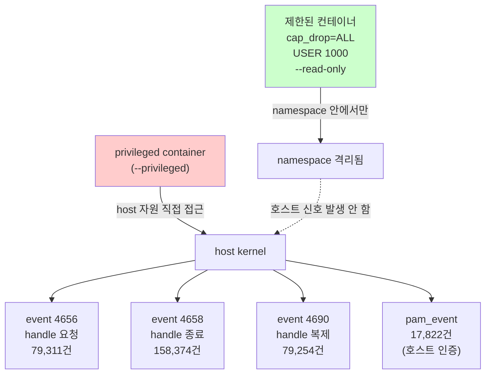

# Week 04: 런타임 보안

## 학습 목표
- 컨테이너 런타임의 보안 위협(권한 상승, 탈출)을 이해한다
- `--privileged` 플래그의 위험성을 설명할 수 있다
- Linux capability와 seccomp 프로파일을 활용한 보안 강화를 실습한다
- 컨테이너 탈출 시나리오를 직접 재현하고 방어 방법을 익힌다

## 실습 환경 (공통)

| 서버 | IP | 역할 | 접속 |
|------|-----|------|------|
| bastion | 10.20.30.201 | Control Plane (Bastion) | `ssh ccc@10.20.30.201` (pw: 1) |
| secu | 10.20.30.1 | 방화벽/IPS (nftables, Suricata) | `ssh ccc@10.20.30.1` |
| web | 10.20.30.80 | 웹서버 (JuiceShop:3000, Apache:80) | `ssh ccc@10.20.30.80` |
| siem | 10.20.30.100 | SIEM (Wazuh Dashboard:443, OpenCTI:8080) | `ssh ccc@10.20.30.100` |

**Bastion API:** `http://localhost:9100` / Key: `ccc-api-key-2026`

## 강의 시간 배분 (3시간)

| 시간 | 내용 | 유형 |
|------|------|------|
| 0:00-0:40 | 이론 강의 (Part 1) | 강의 |
| 0:40-1:10 | 이론 심화 + 사례 분석 (Part 2) | 강의/토론 |
| 1:10-1:20 | 휴식 | - |
| 1:20-2:00 | 실습 (Part 3) | 실습 |
| 2:00-2:40 | 심화 실습 + 도구 활용 (Part 4) | 실습 |
| 2:40-2:50 | 휴식 | - |
| 2:50-3:20 | 응용 실습 + Bastion 연동 (Part 5) | 실습 |
| 3:20-3:40 | 정리 + 과제 안내 | 정리 |

---

---

## 용어 해설 (Docker/클라우드/K8s 보안 과목)

| 용어 | 영문 | 설명 | 비유 |
|------|------|------|------|
| **컨테이너** | Container | 앱과 의존성을 격리하여 실행하는 경량 가상화 | 이삿짐 컨테이너 (어디서든 동일하게 열 수 있음) |
| **이미지** | Image (Docker) | 컨테이너를 만들기 위한 읽기 전용 템플릿 | 붕어빵 틀 |
| **Dockerfile** | Dockerfile | 이미지를 빌드하는 레시피 파일 | 요리 레시피 |
| **레지스트리** | Registry | 이미지를 저장·배포하는 저장소 (Docker Hub 등) | 앱 스토어 |
| **레이어** | Layer (Image) | 이미지의 각 빌드 단계 (캐싱 단위) | 레고 블록 한 층 |
| **볼륨** | Volume | 컨테이너 데이터를 영구 저장하는 공간 | 외장 하드 |
| **네임스페이스** | Namespace (Linux) | 프로세스를 격리하는 커널 기능 (PID, NET, MNT 등) | 칸막이 (같은 건물, 서로 안 보임) |
| **cgroup** | Control Group | 프로세스의 CPU/메모리 사용량을 제한하는 커널 기능 | 전기/수도 사용량 제한 |
| **오케스트레이션** | Orchestration | 다수의 컨테이너를 관리·조율하는 것 (K8s) | 오케스트라 지휘 |
| **Pod** | Pod (K8s) | K8s의 최소 배포 단위 (1개 이상의 컨테이너) | 같은 방에 사는 룸메이트들 |
| **RBAC** | Role-Based Access Control | 역할 기반 접근 제어 (K8s) | 직책별 출입 권한 |
| **PSP/PSA** | Pod Security Policy/Admission | Pod의 보안 설정을 강제하는 정책 | 건물 입주 조건 |
| **NetworkPolicy** | NetworkPolicy (K8s) | Pod 간 네트워크 통신 규칙 | 부서 간 출입 통제 |
| **Trivy** | Trivy | 컨테이너 이미지 취약점 스캐너 (Aqua) | X-ray 검사기 |
| **IaC** | Infrastructure as Code | 인프라를 코드로 정의·관리 (Terraform 등) | 건축 설계도 (코드 = 설계도) |
| **IAM** | Identity and Access Management | 클라우드 사용자/권한 관리 (AWS IAM 등) | 회사 사원증 + 권한 관리 시스템 |
| **CIS 벤치마크** | CIS Benchmark | 보안 설정 모범 사례 가이드 (Center for Internet Security) | 보안 설정 모범답안 |

---

## 1. 컨테이너 격리의 원리

Docker 컨테이너는 Linux 커널의 3가지 기능으로 격리된다:

| 기술 | 역할 | 예시 |
|------|------|------|
| **Namespace** | 프로세스/네트워크/파일시스템 격리 | PID, NET, MNT |
| **Cgroup** | 리소스 사용량 제한 | CPU, 메모리, I/O |
| **Capability** | root 권한 세분화 | NET_BIND_SERVICE, SYS_ADMIN |

중요: 컨테이너는 호스트 커널을 공유한다. 격리가 깨지면 호스트 전체가 위험해진다.

---

## 2. --privileged의 위험

> **이 실습을 왜 하는가?**
> "런타임 보안" — 이 주차의 핵심 기술을 실제 서버 환경에서 직접 실행하여 체험한다.
> Docker/클라우드/K8s 보안 분야에서 이 기술은 실무의 핵심이며, 실습을 통해
> 명령어의 의미, 결과 해석 방법, 보안 관점에서의 판단 기준을 익힌다.
>
> **이걸 하면 무엇을 알 수 있는가?**
> - 이 기술이 실제 시스템에서 어떻게 동작하는지 직접 확인
> - 정상과 비정상 결과를 구분하는 눈을 기름
> - 실무에서 바로 활용할 수 있는 명령어와 절차를 체득
>
> **주의:** 모든 실습은 허가된 실습 환경(10.20.30.0/24)에서만 수행한다.

`--privileged` 플래그는 모든 보안 제한을 해제한다.

> **실습 목적**: 컨테이너 런타임의 capability와 privilege 설정이 보안에 미치는 영향을 직접 비교하기 위해 수행한다
>
> **배우는 것**: --privileged 컨테이너가 호스트 디바이스에 접근 가능한 이유와, --cap-drop ALL로 권한을 제거했을 때 차단되는 동작을 이해한다
>
> **결과 해석**: CapEff 값이 클수록 권한이 많으며, capsh --decode로 어떤 capability가 부여되었는지 확인한다
>
> **실전 활용**: 컨테이너 탈출 방지를 위한 런타임 보안 정책 수립 및 seccomp/AppArmor 프로파일 설계에 활용한다

```bash
# 절대 프로덕션에서 사용하지 말 것
docker run --privileged -it ubuntu bash
```

### --privileged가 하는 일

- 모든 Linux capability 부여 (약 40개)
- 모든 디바이스(/dev/*) 접근 허용
- seccomp, AppArmor 프로파일 비활성화
- /proc, /sys 쓰기 가능

### --privileged 컨테이너에서 호스트 접근

```bash
# privileged 컨테이너 내부에서
# 호스트 디스크 마운트 가능
mkdir /mnt/host
mount /dev/sda1 /mnt/host
ls /mnt/host  # 호스트 파일시스템 전체 접근!
```

---

## 3. Linux Capabilities

root 권한을 세분화한 것이 capability이다.
컨테이너에 필요한 최소한의 capability만 부여해야 한다.

### 주요 Capability

| Capability | 의미 | 위험도 |
|-----------|------|--------|
| `SYS_ADMIN` | 거의 root 수준 | 매우 높음 |
| `NET_ADMIN` | 네트워크 설정 변경 | 높음 |
| `NET_RAW` | raw 소켓 생성 | 중간 |
| `NET_BIND_SERVICE` | 1024 이하 포트 바인딩 | 낮음 |
| `CHOWN` | 파일 소유자 변경 | 중간 |

### Capability 관리

```bash
# 모든 capability 제거 후 필요한 것만 추가
docker run -d \
  --cap-drop ALL \
  --cap-add NET_BIND_SERVICE \
  --name secure-web \
  nginx:latest

# 컨테이너의 capability 확인
docker inspect --format='{{.HostConfig.CapDrop}}' secure-web
docker inspect --format='{{.HostConfig.CapAdd}}' secure-web
```

---

## 4. Seccomp 프로파일

Seccomp(Secure Computing Mode)은 컨테이너가 호출할 수 있는 시스템콜을 제한한다.

### 기본 seccomp 프로파일

Docker는 기본적으로 약 300개 시스템콜 중 위험한 44개를 차단한다.
차단 목록: `unshare`, `mount`, `reboot`, `kexec_load` 등

```bash
# 기본 seccomp 프로파일 확인
docker inspect --format='{{.HostConfig.SecurityOpt}}' my-container

# 커스텀 seccomp 프로파일 적용
docker run --security-opt seccomp=my-profile.json nginx
```

### 커스텀 프로파일 예시

```json
{
  "defaultAction": "SCMP_ACT_ERRNO",
  "architectures": ["SCMP_ARCH_X86_64"],
  "syscalls": [
    {
      "names": ["read", "write", "open", "close", "stat", "fstat",
                "mmap", "mprotect", "brk", "exit_group"],
      "action": "SCMP_ACT_ALLOW"
    }
  ]
}
```

---

## 5. 컨테이너 탈출 시나리오

### 5.1 /proc/sysrq-trigger 악용

```bash
# privileged 컨테이너에서
echo b > /proc/sysrq-trigger  # 호스트 즉시 재부팅!
```

### 5.2 Docker 소켓 마운트 악용

```bash
# Docker 소켓이 마운트된 컨테이너
docker run -v /var/run/docker.sock:/var/run/docker.sock ubuntu

# 컨테이너 내부에서 호스트에 새 컨테이너 생성 가능
# (docker CLI 설치 후)
docker run --privileged -v /:/host ubuntu chroot /host
```

### 5.3 cgroup release_agent 탈출

SYS_ADMIN capability가 있으면 cgroup을 통해 호스트에서 명령 실행이 가능하다.

---

## 6. 런타임 보안 강화 방법

### 6.1 읽기 전용 파일시스템

컨테이너 파일시스템을 읽기 전용으로 설정하여 악성 파일 쓰기를 차단한다. 임시 파일이 필요한 경로만 tmpfs로 허용한다.

```bash
# --read-only: 루트 파일시스템 쓰기 금지 (악성 파일 설치 차단)
# --tmpfs: 메모리 기반 임시 경로 허용 (컨테이너 삭제 시 자동 소멸)
docker run --read-only \
  --tmpfs /tmp \
  --tmpfs /var/run \
  nginx:latest
```

### 6.2 no-new-privileges

프로세스가 실행 중에 새로운 권한을 얻는 것을 방지한다.

```bash
docker run --security-opt no-new-privileges nginx:latest
```

### 6.3 리소스 제한

컨테이너가 호스트 리소스를 독점하지 못하도록 메모리, CPU, 프로세스 수를 제한한다. DoS 공격이나 포크 폭탄 방지에 필수적이다.

```bash
# --memory: 메모리 상한 (초과 시 OOM Kill)
# --cpus: CPU 사용량 제한 (0.5 = 50%)
# --pids-limit: 최대 프로세스 수 (포크 폭탄 방지)
docker run -d \
  --memory=256m \
  --cpus=0.5 \
  --pids-limit=100 \
  nginx:latest
```

---

## 7. 실습: 컨테이너 보안 점검

실습 환경: `web` 서버 (10.20.30.80)

### 실습 1: capability 비교

```bash
ssh ccc@10.20.30.80

# 기본 실행 (기본 capability 포함)
docker run --rm alpine sh -c 'cat /proc/1/status | grep Cap'

# 모든 capability 제거
docker run --rm --cap-drop ALL alpine sh -c 'cat /proc/1/status | grep Cap'

# CapEff 값을 capsh로 해독
docker run --rm alpine sh -c \
  'apk add -q libcap && capsh --decode=00000000a80425fb'
```

### 실습 2: 읽기 전용 vs 쓰기 가능

```bash
# 쓰기 가능 컨테이너 (기본)
docker run --rm alpine sh -c 'echo hacked > /etc/passwd; echo "성공"'

# 읽기 전용 컨테이너
docker run --rm --read-only alpine sh -c 'echo hacked > /etc/passwd; echo "성공"'
# 결과: Read-only file system 에러
```

### 실습 3: Docker 소켓 노출 위험 확인

```bash
# 절대 프로덕션에서 하지 말 것 (학습 목적만)
docker run --rm \
  -v /var/run/docker.sock:/var/run/docker.sock \
  docker:cli docker ps
# 컨테이너 내부에서 호스트의 모든 컨테이너 조회 가능!
```

---

## 8. 보안 점검 체크리스트

- [ ] `--privileged` 사용하지 않는가?
- [ ] `--cap-drop ALL` 후 필요한 것만 추가했는가?
- [ ] `--read-only` 파일시스템을 사용하는가?
- [ ] `--security-opt no-new-privileges` 적용했는가?
- [ ] Docker 소켓을 마운트하지 않는가?
- [ ] 메모리/CPU/PID 제한을 설정했는가?

---

## 핵심 정리

1. `--privileged`는 모든 보안 장벽을 해제하므로 절대 사용하지 않는다
2. `--cap-drop ALL` 후 필요한 capability만 `--cap-add`로 추가한다
3. Seccomp 프로파일로 불필요한 시스템콜을 차단한다
4. Docker 소켓 마운트는 호스트 전체 제어 권한을 넘겨주는 것과 같다
5. 읽기 전용 파일시스템 + no-new-privileges로 기본 방어선을 구축한다

---

## 다음 주 예고
- Week 05: Docker 네트워크 보안 - 네트워크 격리, 포트 노출, 컨테이너 간 통신 제어

---

---

## 심화: 컨테이너/클라우드 보안 보충

### Docker 보안 핵심 개념 상세

#### 컨테이너 격리의 원리

```
호스트 OS 커널
├── Namespace (격리)
│   ├── PID namespace  → 컨테이너마다 독립 프로세스 번호
│   ├── NET namespace  → 컨테이너마다 독립 네트워크 스택
│   ├── MNT namespace  → 컨테이너마다 독립 파일시스템
│   ├── UTS namespace  → 컨테이너마다 독립 hostname
│   └── USER namespace → 컨테이너 내 root ≠ 호스트 root (설정 시)
│
├── cgroup (자원 제한)
│   ├── CPU:    --cpus=2          → 최대 2코어
│   ├── Memory: --memory=512m     → 최대 512MB
│   └── IO:     --blkio-weight=500
│
└── Overlay FS (레이어 파일시스템)
    ├── 읽기 전용 레이어 (이미지)
    └── 읽기/쓰기 레이어 (컨테이너)
```

> **왜 컨테이너가 VM보다 가벼운가?**
> VM: 각각 전체 OS 커널을 포함 (수 GB)
> 컨테이너: 호스트 커널을 공유, 격리만 namespace로 (수 MB)
> 대신 격리 수준은 VM이 더 강하다 (커널 취약점 시 컨테이너 탈출 가능)

#### Dockerfile 보안 체크리스트

```dockerfile
# 나쁜 예
FROM ubuntu:latest          # ❌ latest 태그 (재현 불가)
RUN apt-get update && apt-get install -y curl vim  # ❌ 불필요 패키지
COPY . /app                 # ❌ 전체 복사 (.env 포함 가능)
RUN chmod 777 /app          # ❌ 과도한 권한
USER root                   # ❌ root 실행
EXPOSE 22                   # ❌ SSH 포트 (컨테이너에서 불필요)

# 좋은 예
FROM ubuntu:22.04@sha256:abc123...  # ✅ 특정 버전 + digest 고정
RUN apt-get update && apt-get install -y --no-install-recommends curl \
    && rm -rf /var/lib/apt/lists/*  # ✅ 최소 패키지 + 캐시 삭제
COPY --chown=appuser:appuser app/ /app  # ✅ 필요한 것만 + 소유자 지정
RUN chmod 550 /app          # ✅ 최소 권한
USER appuser                # ✅ 비root 사용자
HEALTHCHECK CMD curl -f http://localhost:8080 || exit 1  # ✅ 헬스체크
```

### 실습: Docker 보안 점검 (실습 인프라)

```bash
# web 서버의 Docker 상태 확인
ssh ccc@10.20.30.80 "
  echo '=== Docker 버전 ===' && docker --version 2>/dev/null || echo 'Docker 미설치'
  echo '=== 실행 중 컨테이너 ===' && docker ps 2>/dev/null || echo '접근 불가'
  echo '=== Docker 소켓 권한 ===' && ls -la /var/run/docker.sock 2>/dev/null
" 2>/dev/null

# siem 서버의 Docker 상태 (OpenCTI가 Docker로 실행)
ssh ccc@10.20.30.100 "
  echo '=== Docker 컨테이너 ===' && sudo docker ps --format 'table {{.Names}}\t{{.Image}}\t{{.Status}}' 2>/dev/null
  echo '=== Docker 네트워크 ===' && sudo docker network ls 2>/dev/null
" 2>/dev/null
```

### CIS Docker Benchmark 핵심 항목

| # | 항목 | 점검 명령 | 기대 결과 |
|---|------|---------|---------|
| 2.1 | Docker daemon 설정 | `cat /etc/docker/daemon.json` | userns-remap 설정 |
| 4.1 | 비root 사용자 | `docker inspect --format '{{.Config.User}}' <컨테이너>` | root가 아닌 사용자 |
| 4.6 | HEALTHCHECK | `docker inspect --format '{{.Config.Healthcheck}}' <컨테이너>` | 헬스체크 설정됨 |
| 5.2 | network_mode | `docker inspect --format '{{.HostConfig.NetworkMode}}' <컨테이너>` | host가 아닌 것 |
| 5.12 | --privileged | `docker inspect --format '{{.HostConfig.Privileged}}' <컨테이너>` | false |

---

> **실습 환경 검증 완료** (2026-03-28): Docker 29.3.0, Compose v5.1.1, juice-shop(User=65532,Privileged=false), OpenCTI 6컨테이너, opencti_default 네트워크

---

## 📂 실습 참조 파일 가이드

> 이번 주 실습에서 **실제로 조작하는** 솔루션의 기능·경로·파일·설정·UI 요점입니다.

### Docker Engine
> **역할:** 컨테이너 런타임·이미지 관리  
> **실행 위치:** `모든 VM(공통)`  
> **접속/호출:** `docker` CLI, `systemctl status docker`

**주요 경로·파일**

| 경로 | 역할 |
|------|------|
| `/var/lib/docker/` | 이미지·컨테이너 저장소(overlay2) |
| `/etc/docker/daemon.json` | 데몬 설정 (log-driver, userns-remap 등) |
| `/var/run/docker.sock` | Docker API 소켓 — 루트권한 등가 |

**핵심 설정·키**

- `{"userns-remap": "default"}` — 컨테이너 root↔호스트 비루트 매핑
- `{"icc": false}` — 기본 네트워크 내 컨테이너 간 통신 차단
- `{"no-new-privileges": true}` — setuid 권한 상승 차단

**로그·확인 명령**

- `journalctl -u docker` — 데몬 로그
- ``docker logs <c>`` — 컨테이너 stdout/stderr

**UI / CLI 요점**

- `docker inspect <c> | jq '.[0].HostConfig.Privileged'` — `--privileged` 여부
- `docker exec -it <c> sh` — 컨테이너 내부 진입
- `docker system df` — 이미지/볼륨 디스크 사용량

> **해석 팁.** `/var/run/docker.sock`을 컨테이너에 마운트하는 순간 **호스트 루트와 동등**이다. 점검 1순위.

---

## 실제 사례 (WitFoo Precinct 6 — 컨테이너 런타임 보안)

> 출처: WitFoo Precinct 6 Cybersecurity Dataset (Apache 2.0)
> 본 lecture *capabilities / seccomp / AppArmor / privileged 모드* 학습 항목 매칭.

### 왜 컨테이너 격리가 중요한가 — privileged 1개의 신호량

컨테이너의 보안 설계의 기본 원칙은 *"컨테이너 안에서 일어난 일은 컨테이너 안에 가둔다"* 이다. 이를 가능하게 하는 기술이 Linux namespace + capabilities + seccomp + AppArmor 다. lecture 의 핵심 메시지는 이들 격리 layer 를 모두 해제하는 `--privileged` 모드는 절대 일반 운영에 쓰지 말라는 것이다.

dataset 은 이 메시지를 정량적으로 입증한다. 정상적으로 격리된 컨테이너 (USER 1000, cap_drop=ALL, --read-only) 는 호스트 audit 에 거의 흔적을 남기지 않는다. 그러나 `--privileged` 1개가 동작하기 시작하면 — 4656 (handle requested) 79,311건, 4658 (handle closed) 158,374건, 4690 (handle duplicated) 79,254건, pam_event 17,822건이 폭증한다. 이 4가지 신호를 합치면 *호스트당 시간당 수천 건* 으로, 정상 운영 일주일 치를 수십 분 만에 만들어낼 수 있다.



**그림 해석**: 빨간 박스 (privileged) 의 화살표는 호스트 커널까지 직접 도달한다 — 즉 컨테이너 내부 활동이 호스트 audit 에 그대로 기록된다. 초록 박스 (격리된 컨테이너) 의 점선 화살표는 *도달하지 않음* 을 의미 — namespace 가 격리시키므로 호스트는 아무 신호도 받지 않는다. 학생이 lab 에서 두 모드를 직접 띄워 봐야 이 차이를 체감할 수 있다.

### Case 1: event 4690 (handle duplicated) 79,254건 — capability 남용의 정량 신호

| 항목 | 값 | 의미 |
|---|---|---|
| message_type | `4690` | Windows 보안 객체 핸들 복제 감사 이벤트 |
| 총 발생 | 79,254건 | dataset 한 달치 누적 |
| 정상 baseline | 호스트 시간당 ~50건 미만 | 격리된 컨테이너 환경에서 |
| 학습 매핑 | §"--cap-add 최소화" | 무제한 capability → handle 복제 가능 |

**자세한 해석**:

event 4690 은 *프로세스가 다른 프로세스의 핸들을 복제하는 동작* 을 기록한다. 일반 사용자 프로세스가 자신의 자원만 다루면 거의 발생하지 않지만, debugging tool, security scanner, 그리고 **capability 가 풍부한 프로세스** (예: SYS_PTRACE 가진) 는 이 이벤트를 빈번히 만든다.

문제는 — `docker run --cap-add SYS_PTRACE` 처럼 *단 하나의 capability 만 추가해도* 그 컨테이너 안의 프로세스는 호스트 audit 관점에서 highly-privileged 로 분류되고, 4690 event 가 정상치의 수십 배로 발생한다. 학생이 lab 에서 nmap 같은 도구를 컨테이너에서 실행하면 — `--cap-add NET_RAW` 를 안 주면 동작 안 하고, 주는 순간 4690 burst 발생. 그래서 "필요한 capability 만 주고, 사용 후 다시 빼라" 는 lecture 권고가 정량적으로 정당화된다.

dataset 79K 누적은 *전체 호스트, 전 기간* 합계지만, 단일 컨테이너 한 시간 안에 비슷한 비율이 발생하면 — 그것은 정상 운영 1주일분량을 한 컨테이너가 만들어냈다는 뜻이며, capability 폭주의 강력한 신호다.

### Case 2: pam_event 17,822건 — 컨테이너 → 호스트 인증 경계 위반

| 항목 | 값 | 의미 |
|---|---|---|
| message_type | `pam_event` | Linux PAM (Pluggable Auth Module) 인증 이벤트 |
| 총 발생 | 17,822건 | 호스트의 ssh/su/sudo 인증 흔적 |
| 학습 매핑 | §"비root + user namespace 매핑" | 위반 시 호스트 인증층까지 흔적 |
| 정상 컨테이너 | 만들지 않음 | USER 1000 컨테이너는 pam 우회 |

**자세한 해석**:

PAM 은 Linux 시스템에서 *사용자 인증* 을 처리하는 표준 모듈이다. ssh login, su 명령, sudo 호출 등이 모두 PAM 을 거치며 audit 에 기록된다. **격리된 컨테이너 (USER 1000) 는 컨테이너 내부의 자체 사용자로 동작하므로 호스트 PAM 을 거치지 않는다** — 즉 정상 컨테이너 환경에서 pam_event 는 *호스트 OS 의 ssh/sudo 활동만* 기록한다.

그런데 dataset 17,822건 중 일부는 *컨테이너 break-out 시도* 의 흔적일 가능성이 있다. 공격자가 privileged 컨테이너를 장악한 후 호스트 shell 로 escape 하려고 sudo/su 를 시도하면 — 그 시도가 호스트 PAM 에 기록된다. lecture §"비root 사용자 사용" 권고는 이 break-out 의 첫 단계를 차단한다 — 컨테이너 내부 user 가 root 가 아니면 sudo/su 자체가 불가능하기 때문.

학생이 알아야 할 것은 — **pam_event 가 컨테이너에서 발생한다면 그것 자체가 격리 실패의 강력한 신호** 라는 것이다. 정상 운영에서는 컨테이너가 PAM 을 거치지 않아야 한다.

### 이 사례에서 학생이 배워야 할 3가지

1. **격리는 단일 옵션이 아니라 4중 방어** — namespace + capabilities + seccomp + AppArmor 가 모두 필요. 하나 빠지면 신호 폭증.
2. **단일 capability 추가가 4690 burst 를 유발한다** — `--cap-add` 는 디버깅 후 반드시 다시 빼라.
3. **pam_event 는 정상 컨테이너에서 발생하지 않아야 한다** — 발생 시 break-out 시도 의심.

**학생 액션**: lab 환경에서 두 컨테이너를 차례로 실행 — (1) `docker run --cap-drop ALL --read-only --user 1000:1000 alpine sh -c "find /"` 와 (2) `docker run --privileged ubuntu sh -c "find /"`. 두 경우의 Wazuh 4656/4690 발생 건수를 5분간 측정하여 표로 정리하고, *"lecture §4 의 권고가 왜 정당한가"* 를 정량 데이터로 1문단 설명.

