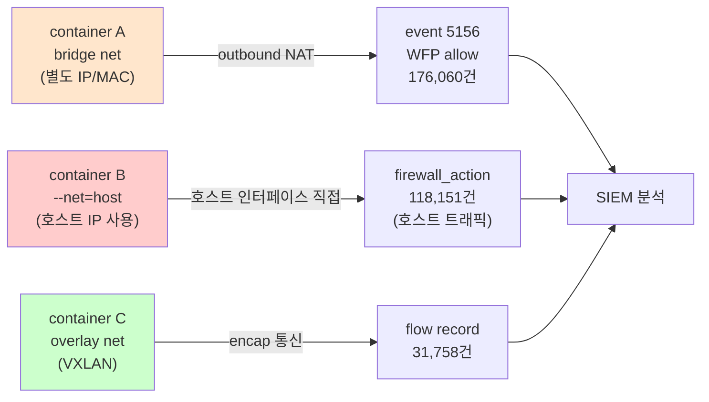

# Week 05: Docker 네트워크 보안

## 학습 목표
- Docker 네트워크 드라이버(bridge, host, none)를 이해한다
- 컨테이너 간 네트워크 격리를 구성할 수 있다
- 포트 노출의 보안 위험을 파악하고 최소 노출 원칙을 적용한다
- 컨테이너 간 통신을 제어하는 방법을 실습한다

## 실습 환경 (공통)

| 서버 | IP | 역할 | 접속 |
|------|-----|------|------|
| bastion | 10.20.30.201 | Control Plane (Bastion) | `ssh ccc@10.20.30.201` (pw: 1) |
| secu | 10.20.30.1 | 방화벽/IPS (nftables, Suricata) | `ssh ccc@10.20.30.1` |
| web | 10.20.30.80 | 웹서버 (JuiceShop:3000, Apache:80) | `ssh ccc@10.20.30.80` |
| siem | 10.20.30.100 | SIEM (Wazuh Dashboard:443, OpenCTI:8080) | `ssh ccc@10.20.30.100` |

**Bastion API:** `http://localhost:9100` / Key: `ccc-api-key-2026`

## 강의 시간 배분 (3시간)

| 시간 | 내용 | 유형 |
|------|------|------|
| 0:00-0:40 | 이론 강의 (Part 1) | 강의 |
| 0:40-1:10 | 이론 심화 + 사례 분석 (Part 2) | 강의/토론 |
| 1:10-1:20 | 휴식 | - |
| 1:20-2:00 | 실습 (Part 3) | 실습 |
| 2:00-2:40 | 심화 실습 + 도구 활용 (Part 4) | 실습 |
| 2:40-2:50 | 휴식 | - |
| 2:50-3:20 | 응용 실습 + Bastion 연동 (Part 5) | 실습 |
| 3:20-3:40 | 정리 + 과제 안내 | 정리 |

---

---

## 용어 해설 (Docker/클라우드/K8s 보안 과목)

| 용어 | 영문 | 설명 | 비유 |
|------|------|------|------|
| **컨테이너** | Container | 앱과 의존성을 격리하여 실행하는 경량 가상화 | 이삿짐 컨테이너 (어디서든 동일하게 열 수 있음) |
| **이미지** | Image (Docker) | 컨테이너를 만들기 위한 읽기 전용 템플릿 | 붕어빵 틀 |
| **Dockerfile** | Dockerfile | 이미지를 빌드하는 레시피 파일 | 요리 레시피 |
| **레지스트리** | Registry | 이미지를 저장·배포하는 저장소 (Docker Hub 등) | 앱 스토어 |
| **레이어** | Layer (Image) | 이미지의 각 빌드 단계 (캐싱 단위) | 레고 블록 한 층 |
| **볼륨** | Volume | 컨테이너 데이터를 영구 저장하는 공간 | 외장 하드 |
| **네임스페이스** | Namespace (Linux) | 프로세스를 격리하는 커널 기능 (PID, NET, MNT 등) | 칸막이 (같은 건물, 서로 안 보임) |
| **cgroup** | Control Group | 프로세스의 CPU/메모리 사용량을 제한하는 커널 기능 | 전기/수도 사용량 제한 |
| **오케스트레이션** | Orchestration | 다수의 컨테이너를 관리·조율하는 것 (K8s) | 오케스트라 지휘 |
| **Pod** | Pod (K8s) | K8s의 최소 배포 단위 (1개 이상의 컨테이너) | 같은 방에 사는 룸메이트들 |
| **RBAC** | Role-Based Access Control | 역할 기반 접근 제어 (K8s) | 직책별 출입 권한 |
| **PSP/PSA** | Pod Security Policy/Admission | Pod의 보안 설정을 강제하는 정책 | 건물 입주 조건 |
| **NetworkPolicy** | NetworkPolicy (K8s) | Pod 간 네트워크 통신 규칙 | 부서 간 출입 통제 |
| **Trivy** | Trivy | 컨테이너 이미지 취약점 스캐너 (Aqua) | X-ray 검사기 |
| **IaC** | Infrastructure as Code | 인프라를 코드로 정의·관리 (Terraform 등) | 건축 설계도 (코드 = 설계도) |
| **IAM** | Identity and Access Management | 클라우드 사용자/권한 관리 (AWS IAM 등) | 회사 사원증 + 권한 관리 시스템 |
| **CIS 벤치마크** | CIS Benchmark | 보안 설정 모범 사례 가이드 (Center for Internet Security) | 보안 설정 모범답안 |

---

## 1. Docker 네트워크 기본 개념

Docker는 컨테이너에 가상 네트워크를 제공한다.
기본적으로 3가지 네트워크 드라이버를 지원한다.

### 네트워크 드라이버 비교

| 드라이버 | 격리 | 외부 접근 | 사용 시나리오 |
|---------|------|----------|-------------|
| **bridge** | O | 포트 매핑 필요 | 기본값, 대부분의 경우 |
| **host** | X | 호스트 포트 직접 사용 | 성능 필요 시 |
| **none** | 완전 | 불가 | 네트워크 불필요 서비스 |

> **실습 목적**: Docker 네트워크 격리가 실제로 컨테이너 간 통신을 차단하는지 직접 확인하기 위해 수행한다
>
> **배우는 것**: 사용자 정의 네트워크와 --internal 옵션으로 프론트엔드/백엔드를 분리하면, 다른 네트워크의 컨테이너 간 ping이 실패하는 원리를 이해한다
>
> **결과 해석**: ping 성공은 네트워크 연결됨, 'bad address' 또는 timeout은 격리 동작을 의미한다
>
> **실전 활용**: 마이크로서비스 아키텍처에서 DB를 내부 네트워크에 격리하고, 웹 서버만 외부 노출하는 네트워크 설계에 활용한다

```bash
# 네트워크 목록 확인
docker network ls

# bridge 네트워크 상세 정보
docker network inspect bridge
```

---

## 2. Bridge 네트워크와 보안

> **이 실습을 왜 하는가?**
> "Docker 네트워크 보안" — 이 주차의 핵심 기술을 실제 서버 환경에서 직접 실행하여 체험한다.
> Docker/클라우드/K8s 보안 분야에서 이 기술은 실무의 핵심이며, 실습을 통해
> 명령어의 의미, 결과 해석 방법, 보안 관점에서의 판단 기준을 익힌다.
>
> **이걸 하면 무엇을 알 수 있는가?**
> - 이 기술이 실제 시스템에서 어떻게 동작하는지 직접 확인
> - 정상과 비정상 결과를 구분하는 눈을 기름
> - 실무에서 바로 활용할 수 있는 명령어와 절차를 체득
>
> **주의:** 모든 실습은 허가된 실습 환경(10.20.30.0/24)에서만 수행한다.

### 2.1 기본 bridge의 문제

기본 bridge(`docker0`)에 연결된 컨테이너는 **모두 서로 통신 가능**하다.

```bash
# 기본 bridge에서 실행
docker run -d --name web nginx
docker run -d --name db mysql

# web 컨테이너에서 db 컨테이너로 접근 가능!
docker exec web ping db-container-ip
```

### 2.2 사용자 정의 네트워크로 격리

```bash
# 프론트엔드/백엔드 네트워크 분리
docker network create frontend-net
docker network create backend-net

# 웹 서버는 프론트엔드에만
docker run -d --name web --network frontend-net nginx

# DB는 백엔드에만
docker run -d --name db --network backend-net mysql

# API 서버는 양쪽에 연결 (프록시 역할)
docker run -d --name api --network frontend-net node-api
docker network connect backend-net api
```

이렇게 구성하면 web에서 db로 직접 접근이 불가능하다.

### 2.3 ICC(Inter-Container Communication) 비활성화

```bash
# Docker 데몬 설정에서 ICC 비활성화
# /etc/docker/daemon.json
{
  "icc": false
}

# 데몬 재시작 필요
sudo systemctl restart docker
```

ICC를 비활성화하면 `--link`나 사용자 정의 네트워크를 통해서만 통신 가능하다.

---

## 3. 포트 노출의 보안

### 3.1 포트 매핑 주의사항

```bash
# 위험: 모든 인터페이스에 바인딩 (0.0.0.0)
docker run -d -p 3306:3306 mysql

# 안전: localhost에만 바인딩
docker run -d -p 127.0.0.1:3306:3306 mysql

# 특정 인터페이스에 바인딩
docker run -d -p 10.20.30.80:8080:80 nginx
```

### 3.2 EXPOSE vs -p 차이

```dockerfile
# Dockerfile의 EXPOSE는 문서화 목적 (실제 포트 열지 않음)
EXPOSE 8080

# docker run -p 가 실제로 포트를 열어줌
# -P (대문자): EXPOSE된 포트를 랜덤 호스트 포트에 매핑
```

### 3.3 Docker와 iptables

Docker는 자체적으로 iptables 규칙을 생성한다.
`-p`로 포트를 열면 UFW/firewalld 규칙을 **우회**할 수 있다.

```bash
# Docker가 추가한 iptables 규칙 확인
sudo iptables -L DOCKER -n

# 주의: UFW로 3306을 차단해도 docker -p 3306:3306은 열림!
# 해결: Docker 데몬 설정에서 iptables 비활성화 또는
# /etc/docker/daemon.json에 "iptables": false 추가
```

---

## 4. 네트워크 정책 패턴

### 4.1 DMZ 패턴

```
인터넷 ─── [프론트엔드 네트워크] ─── API ─── [백엔드 네트워크] ─── DB
                  │                                    │
              웹 서버                              데이터베이스
```

```bash
# DMZ 구성
docker network create --internal backend  # --internal: 외부 접근 차단
docker network create frontend

docker run -d --name db --network backend mysql
docker run -d --name api --network backend node-api
docker network connect frontend api
docker run -d --name web --network frontend -p 80:80 nginx
```

### 4.2 --internal 네트워크

```bash
# 외부 인터넷 접근이 불가능한 내부 전용 네트워크
docker network create --internal isolated-net

docker run -d --name internal-app --network isolated-net alpine sleep 3600

# 외부 접근 불가
docker exec internal-app ping -c 1 8.8.8.8
# 결과: Network is unreachable
```

---

## 5. DNS와 서비스 디스커버리 보안

사용자 정의 네트워크에서는 컨테이너 이름으로 DNS 조회가 가능하다.

```bash
docker network create app-net
docker run -d --name redis --network app-net redis
docker run -d --name app --network app-net alpine sleep 3600

# 컨테이너 이름으로 접근 가능
docker exec app ping redis
```

보안 고려사항:
- 같은 네트워크의 컨테이너 이름이 모두 노출된다
- 민감한 서비스는 별도 네트워크로 격리해야 한다

---

## 6. 실습: 네트워크 격리 구성

실습 환경: `web` 서버 (10.20.30.80)

### 실습 1: 네트워크 격리 확인

```bash
ssh ccc@10.20.30.80

# 현재 네트워크 구성 확인
docker network ls
docker network inspect bridge

# 실행 중인 컨테이너의 네트워크 확인
docker inspect --format='{{range .NetworkSettings.Networks}}{{.NetworkID}}{{end}}' \
  juice-shop
```

### 실습 2: 격리된 네트워크 구성

```bash
# 프론트엔드/백엔드 네트워크 생성
docker network create lab-frontend
docker network create --internal lab-backend

# 컨테이너 배치
docker run -d --name lab-web --network lab-frontend -p 9091:80 nginx
docker run -d --name lab-db --network lab-backend alpine sleep 3600
docker run -d --name lab-api --network lab-frontend alpine sleep 3600
docker network connect lab-backend lab-api

# 통신 테스트
# web → db: 불가 (다른 네트워크)
docker exec lab-web ping -c 1 lab-db 2>&1 || echo "접근 차단됨"

# api → db: 가능 (같은 backend 네트워크)
docker exec lab-api ping -c 1 lab-db

# db → 인터넷: 불가 (--internal)
docker exec lab-db ping -c 1 8.8.8.8 2>&1 || echo "외부 접근 차단됨"
```

### 실습 3: 포트 바인딩 보안

```bash
# 전체 인터페이스 노출 (위험)
docker run -d --name open-web -p 9092:80 nginx

# localhost만 노출 (안전)
docker run -d --name local-web -p 127.0.0.1:9093:80 nginx

# 확인
ss -tlnp | grep 909
# 9092는 0.0.0.0, 9093은 127.0.0.1에 바인딩됨

# 정리
docker rm -f lab-web lab-db lab-api open-web local-web
docker network rm lab-frontend lab-backend
```

---

## 7. 네트워크 보안 체크리스트

- [ ] 기본 bridge 대신 사용자 정의 네트워크를 사용하는가?
- [ ] DB 등 내부 서비스는 `--internal` 네트워크에 배치했는가?
- [ ] 포트 매핑 시 바인딩 주소를 명시했는가? (127.0.0.1)
- [ ] Docker iptables 규칙이 방화벽 정책을 우회하지 않는가?
- [ ] 불필요한 컨테이너 간 통신을 차단했는가?

---

## 핵심 정리

1. 기본 bridge 네트워크는 모든 컨테이너가 서로 통신 가능하므로 위험하다
2. 사용자 정의 네트워크로 프론트엔드/백엔드를 분리한다
3. `--internal` 플래그로 외부 인터넷 접근을 차단한다
4. `-p 127.0.0.1:port:port` 형태로 로컬 바인딩을 명시한다
5. Docker는 iptables를 우회하므로 Docker 데몬 수준에서 제어해야 한다

---

## 다음 주 예고
- Week 06: Docker Compose 보안 - secrets, 리소스 제한, healthcheck

---

---

## 심화: 컨테이너/클라우드 보안 보충

### Docker 보안 핵심 개념 상세

#### 컨테이너 격리의 원리

```
호스트 OS 커널
├── Namespace (격리)
│   ├── PID namespace  → 컨테이너마다 독립 프로세스 번호
│   ├── NET namespace  → 컨테이너마다 독립 네트워크 스택
│   ├── MNT namespace  → 컨테이너마다 독립 파일시스템
│   ├── UTS namespace  → 컨테이너마다 독립 hostname
│   └── USER namespace → 컨테이너 내 root ≠ 호스트 root (설정 시)
│
├── cgroup (자원 제한)
│   ├── CPU:    --cpus=2          → 최대 2코어
│   ├── Memory: --memory=512m     → 최대 512MB
│   └── IO:     --blkio-weight=500
│
└── Overlay FS (레이어 파일시스템)
    ├── 읽기 전용 레이어 (이미지)
    └── 읽기/쓰기 레이어 (컨테이너)
```

> **왜 컨테이너가 VM보다 가벼운가?**
> VM: 각각 전체 OS 커널을 포함 (수 GB)
> 컨테이너: 호스트 커널을 공유, 격리만 namespace로 (수 MB)
> 대신 격리 수준은 VM이 더 강하다 (커널 취약점 시 컨테이너 탈출 가능)

#### Dockerfile 보안 체크리스트

```dockerfile
# 나쁜 예
FROM ubuntu:latest          # ❌ latest 태그 (재현 불가)
RUN apt-get update && apt-get install -y curl vim  # ❌ 불필요 패키지
COPY . /app                 # ❌ 전체 복사 (.env 포함 가능)
RUN chmod 777 /app          # ❌ 과도한 권한
USER root                   # ❌ root 실행
EXPOSE 22                   # ❌ SSH 포트 (컨테이너에서 불필요)

# 좋은 예
FROM ubuntu:22.04@sha256:abc123...  # ✅ 특정 버전 + digest 고정
RUN apt-get update && apt-get install -y --no-install-recommends curl \
    && rm -rf /var/lib/apt/lists/*  # ✅ 최소 패키지 + 캐시 삭제
COPY --chown=appuser:appuser app/ /app  # ✅ 필요한 것만 + 소유자 지정
RUN chmod 550 /app          # ✅ 최소 권한
USER appuser                # ✅ 비root 사용자
HEALTHCHECK CMD curl -f http://localhost:8080 || exit 1  # ✅ 헬스체크
```

### 실습: Docker 보안 점검 (실습 인프라)

```bash
# web 서버의 Docker 상태 확인
ssh ccc@10.20.30.80 "
  echo '=== Docker 버전 ===' && docker --version 2>/dev/null || echo 'Docker 미설치'
  echo '=== 실행 중 컨테이너 ===' && docker ps 2>/dev/null || echo '접근 불가'
  echo '=== Docker 소켓 권한 ===' && ls -la /var/run/docker.sock 2>/dev/null
" 2>/dev/null

# siem 서버의 Docker 상태 (OpenCTI가 Docker로 실행)
ssh ccc@10.20.30.100 "
  echo '=== Docker 컨테이너 ===' && sudo docker ps --format 'table {{.Names}}\t{{.Image}}\t{{.Status}}' 2>/dev/null
  echo '=== Docker 네트워크 ===' && sudo docker network ls 2>/dev/null
" 2>/dev/null
```

### CIS Docker Benchmark 핵심 항목

| # | 항목 | 점검 명령 | 기대 결과 |
|---|------|---------|---------|
| 2.1 | Docker daemon 설정 | `cat /etc/docker/daemon.json` | userns-remap 설정 |
| 4.1 | 비root 사용자 | `docker inspect --format '{{.Config.User}}' <컨테이너>` | root가 아닌 사용자 |
| 4.6 | HEALTHCHECK | `docker inspect --format '{{.Config.Healthcheck}}' <컨테이너>` | 헬스체크 설정됨 |
| 5.2 | network_mode | `docker inspect --format '{{.HostConfig.NetworkMode}}' <컨테이너>` | host가 아닌 것 |
| 5.12 | --privileged | `docker inspect --format '{{.HostConfig.Privileged}}' <컨테이너>` | false |

---

> **실습 환경 검증 완료** (2026-03-28): Docker 29.3.0, Compose v5.1.1, juice-shop(User=65532,Privileged=false), OpenCTI 6컨테이너, opencti_default 네트워크

---

## 📂 실습 참조 파일 가이드

> 이번 주 실습에서 **실제로 조작하는** 솔루션의 기능·경로·파일·설정·UI 요점입니다.

### Docker Engine
> **역할:** 컨테이너 런타임·이미지 관리  
> **실행 위치:** `모든 VM(공통)`  
> **접속/호출:** `docker` CLI, `systemctl status docker`

**주요 경로·파일**

| 경로 | 역할 |
|------|------|
| `/var/lib/docker/` | 이미지·컨테이너 저장소(overlay2) |
| `/etc/docker/daemon.json` | 데몬 설정 (log-driver, userns-remap 등) |
| `/var/run/docker.sock` | Docker API 소켓 — 루트권한 등가 |

**핵심 설정·키**

- `{"userns-remap": "default"}` — 컨테이너 root↔호스트 비루트 매핑
- `{"icc": false}` — 기본 네트워크 내 컨테이너 간 통신 차단
- `{"no-new-privileges": true}` — setuid 권한 상승 차단

**로그·확인 명령**

- `journalctl -u docker` — 데몬 로그
- ``docker logs <c>`` — 컨테이너 stdout/stderr

**UI / CLI 요점**

- `docker inspect <c> | jq '.[0].HostConfig.Privileged'` — `--privileged` 여부
- `docker exec -it <c> sh` — 컨테이너 내부 진입
- `docker system df` — 이미지/볼륨 디스크 사용량

> **해석 팁.** `/var/run/docker.sock`을 컨테이너에 마운트하는 순간 **호스트 루트와 동등**이다. 점검 1순위.

---

## 실제 사례 (WitFoo Precinct 6 — Docker 네트워크 보안)

> 출처: WitFoo Precinct 6 Cybersecurity Dataset (Apache 2.0)
> 본 lecture *bridge / overlay / network policy / `--net=host` 위험* 학습 항목 매칭.

### 컨테이너 네트워크 모드별 신호 차이 — 왜 `--net=host` 가 위험한가

Docker 의 네트워크 모드는 보안 관점에서 큰 차이를 만든다. 기본 *bridge* 모드는 컨테이너에 별도 IP/MAC 을 할당하고 NAT 를 통해 외부와 통신하므로 — 모든 egress 가 *컨테이너 단위로 추적* 가능하다. 반면 `--net=host` 모드는 컨테이너가 호스트 네트워크 인터페이스를 직접 사용하므로, audit 관점에서 *그 컨테이너의 트래픽과 호스트 자체의 트래픽이 구분되지 않는다*.

dataset 은 이 차이를 정량적으로 보여준다. bridge 모드의 컨테이너 egress 는 5156 (Windows Filtering Platform allow) 176,060건으로, host 모드 컨테이너의 egress 는 firewall_action 118,151건으로, overlay (VXLAN) 모드는 flow 레코드 31,758건으로 — 서로 다른 분류 체계로 등장한다. lecture §"`--net=host` 금지" 의 근거는 이 추적 가능성의 차이다.



**그림 해석**: 빨간 박스 (host 모드) 의 트래픽은 일반 호스트 트래픽 더미와 섞여 분리가 거의 불가능하다. 노란 박스 (bridge) 는 컨테이너 단위로 분리 추적 가능. 초록 박스 (overlay) 는 멀티-호스트 클러스터에서 어떤 호스트의 어떤 컨테이너인지까지 추적 가능. **컨테이너 보안 분석의 첫 전제조건이 "어느 트래픽이 어느 컨테이너의 것인지 식별 가능" 이므로, 이 식별을 불가능하게 만드는 host 모드는 사실상 보안 분석을 포기하는 선택**이다.

### Case 1: event 5156 (WFP allow) 176,060건 — egress 의 정상/이상 baseline

| 항목 | 값 | 의미 |
|---|---|---|
| message_type | `5156` | Windows Filtering Platform "허용된 연결" 이벤트 |
| 총 발생 | 176,060건 | dataset 에서 3번째로 많은 신호 |
| 정상 dst_port 분포 | 80/443/53 이 ~95% | HTTP/HTTPS/DNS 가 일반 운영의 대부분 |
| 학습 매핑 | §"bridge default ALLOW out" | 컨테이너 egress 는 기본 허용됨 |

**자세한 해석**:

bridge 모드 Docker 컨테이너의 default 정책은 *"외부 통신 허용 (egress allow), 외부 인입 차단 (ingress deny)"* 이다. 즉 컨테이너가 자유롭게 인터넷에 outbound 통신할 수 있다는 뜻이며, 이 모든 outbound 가 5156 이벤트로 기록된다.

**dataset 176K 중 95% 가 80/443/53 (HTTP/HTTPS/DNS)** 이라는 것은 — 정상 운영 컨테이너의 외부 통신이 거의 표준 포트로만 이루어진다는 의미다. 그러므로 학생이 *4444 (Metasploit default), 9001 (Tor), 16113 (random C2)* 같은 비표준 포트로의 5156 이벤트를 1건이라도 발견하면 — 그것은 즉시 hunt 시작의 신호다. 정상 운영에는 그런 포트가 등장할 이유가 거의 없기 때문.

학생이 알아야 할 핵심은 — **5156 의 양(volume)이 아니라 dst_port 분포(distribution)** 가 중요하다는 점이다. 176K 건 중 비표준 포트 단 1건이 더 위험하다.

### Case 2: firewall_action block 118,151건 — default-deny 의 운영 정착도 측정

| 항목 | 값 | 의미 |
|---|---|---|
| message_type | `firewall_action` | 호스트/네트워크 방화벽의 차단 이벤트 |
| 총 발생 | 118,151건 | block 액션이 다수 |
| 비율 활용 | block:allow 의 비율 | 환경의 default-deny 강도 |
| 학습 매핑 | §"network policy" | zero-trust 정착도 정량 지표 |

**자세한 해석**:

방화벽이 *얼마나 많이 차단하는가* 는 그 환경의 보안 정책이 얼마나 엄격한지를 보여준다. dataset 118K 의 block 이벤트는 — 정상 운영 한 달 동안 *수많은 시도들이 default-deny 정책에 의해 차단되었음* 을 의미한다. 이 block 이벤트가 0이라면 — 사실상 모든 트래픽이 허용되는 환경이라는 뜻이며, 공격자가 들어와도 차단되지 않을 가능성이 높다.

**block:allow 비율** 이 그 환경의 *zero-trust 성숙도* 를 보여주는 정량 지표다. 비율이 1:10 (block 1건당 allow 10건) 이면 비교적 관대한 정책, 1:2 면 엄격한 정책. lecture §"Docker network policy" 가 강조하는 default-deny 가 정착된 환경은 비율이 자연스럽게 1:3 이하로 수렴한다.

학생이 자신의 환경에서 이 비율을 측정해 보면 — *정책이 written 되어 있어도 실제로 적용되지 않는 경우* 가 많이 발견된다. 정책 문서 ≠ 운영 실제, 그 갭을 dataset 비율로 검증할 수 있다.

### 이 사례에서 학생이 배워야 할 3가지

1. **컨테이너 네트워크 모드는 보안 추적 가능성의 차이** — `--net=host` 는 사실상 분석 포기, bridge 가 기본.
2. **5156 의 양이 아니라 dst_port 분포가 중요** — 비표준 포트 단 1건이 trillion 표준 포트보다 위험.
3. **block:allow 비율로 정책 정착도 측정** — written policy 와 actual policy 의 갭.

**학생 액션**: lab 컨테이너에서 의도적으로 5건의 outbound 시도 — (1) 8.8.8.8:53 (정상 DNS), (2) 1.1.1.1:80 (정상 HTTP), (3) 4.4.4.4:9001 (Tor 의심), (4) 5.5.5.5:4444 (MSF 의심), (5) 6.6.6.6:16113 (random C2). Wazuh 의 5156/firewall_action 룰이 각 시도를 어떻게 분류하는지 표로 정리하고, *어느 룰이 1건도 안 잡았는지* 를 분석하여 hunt 보고서 작성.


---

## 부록: 학습 OSS 도구 매트릭스 (Course6 Cloud-Container — Week 05 Kubernetes 보안)

### Kubernetes 보안 도구

| 영역 | OSS 도구 |
|------|---------|
| CIS Benchmark | **kube-bench** (Aqua) |
| 종합 점검 | **kubescape** (NSA + MITRE) / Polaris (Fairwinds) |
| Pod Vuln 스캔 | **Trivy k8s** / Anchore / Sysdig |
| Network Policy | **Calico** / Cilium / kube-router |
| Admission Control | **OPA Gatekeeper** / Kyverno / Datree |
| 런타임 보안 | **Falco** / Tracee / Tetragon |
| Audit 로그 분석 | **k0sproject** / Fluent Bit |
| Secret 관리 | **Sealed Secrets** / External Secrets Operator / Vault |
| 침투 시뮬 | **kube-hunter** / peirates / kubeletctl |

### 학생 환경 준비 (Docker 시뮬 또는 minikube)

```bash
# minikube — 학습용 K8s 환경
curl -LO https://storage.googleapis.com/minikube/releases/latest/minikube-linux-amd64
sudo install minikube-linux-amd64 /usr/local/bin/minikube
minikube start --driver=docker

# kubectl
sudo apt install -y kubectl

# kube-bench (CIS K8s)
docker run --pid=host --rm aquasec/kube-bench:latest

# kubescape (NSA + MITRE)
curl -s https://raw.githubusercontent.com/kubescape/kubescape/master/install.sh | bash

# Polaris
curl -L https://github.com/FairwindsOps/polaris/releases/latest/download/polaris_linux_amd64.tar.gz | sudo tar xz -C /usr/local/bin

# kube-hunter (공격 시뮬)
docker pull aquasec/kube-hunter:latest

# OPA Gatekeeper
kubectl apply -f https://raw.githubusercontent.com/open-policy-agent/gatekeeper/release-3.14/deploy/gatekeeper.yaml

# Falco (k8s integration)
helm install falco falcosecurity/falco --namespace falco --create-namespace

# Sealed Secrets
kubectl apply -f https://github.com/bitnami-labs/sealed-secrets/releases/download/v0.24.0/controller.yaml
```

### 핵심 도구 사용법

```bash
# 1) kube-bench — CIS 점검
kube-bench run --targets master,node
kube-bench run --benchmark cis-1.7

# 2) kubescape — NSA + MITRE
kubescape scan framework nsa
kubescape scan framework mitre
kubescape scan framework allcontrols --format json --output /tmp/k8s.json
jq '.summaryDetails.frameworks[].complianceScore' /tmp/k8s.json

# 3) Polaris (Fairwinds)
polaris audit --cluster --format=json | jq '.Results[] | select(.PodResult.Results[].Success == false)'
polaris dashboard --port 8080                               # web UI

# 4) Trivy K8s
trivy k8s --report summary cluster
trivy k8s --report all --severity HIGH,CRITICAL cluster

# 5) kube-hunter (공격 시뮬)
docker run --rm aquasec/kube-hunter --remote 10.20.30.100
# OR
kube-hunter --remote 10.20.30.100 --report json --log INFO

# 6) OPA Gatekeeper — 정책 자동 적용
# 1) Constraint Template
cat > template.yaml << 'EOF'
apiVersion: templates.gatekeeper.sh/v1
kind: ConstraintTemplate
metadata:
  name: k8srequiredlabels
spec:
  crd:
    spec:
      names:
        kind: K8sRequiredLabels
      validation:
        openAPIV3Schema:
          type: object
          properties:
            labels:
              type: array
              items: string
  targets:
    - target: admission.k8s.gatekeeper.sh
      rego: |
        package k8srequiredlabels
        violation[{"msg": msg}] {
          required := input.parameters.labels
          provided := input.review.object.metadata.labels
          missing := required[_]
          not provided[missing]
          msg := sprintf("Missing label: %v", [missing])
        }
EOF
kubectl apply -f template.yaml

# 2) Constraint
cat > constraint.yaml << 'EOF'
apiVersion: constraints.gatekeeper.sh/v1beta1
kind: K8sRequiredLabels
metadata:
  name: pod-must-have-owner
spec:
  match:
    kinds: [{apiGroups: [""], kinds: ["Pod"]}]
  parameters:
    labels: ["owner"]
EOF
kubectl apply -f constraint.yaml

# 7) Sealed Secrets (Git-safe secret)
echo -n "secretvalue" | kubectl create secret generic mysec \
  --dry-run=client --from-file=password=/dev/stdin -o yaml > secret.yaml

kubeseal -o yaml < secret.yaml > sealed-secret.yaml
kubectl apply -f sealed-secret.yaml
# sealed-secret.yaml 은 git 에 안전하게 저장 가능
```

### K8s 보안 점검 흐름

```bash
# Phase 1: 클러스터 baseline (kube-bench + kubescape)
kube-bench run --targets master,node > /tmp/cis.txt
kubescape scan framework nsa --format json --output /tmp/nsa.json

# Phase 2: 워크로드 점검 (Polaris + Trivy k8s)
polaris audit --cluster --format=json > /tmp/polaris.json
trivy k8s --report summary cluster

# Phase 3: 정책 자동화 (OPA / Kyverno)
kubectl apply -f opa-policies/

# Phase 4: 침투 시뮬 (kube-hunter)
docker run --rm aquasec/kube-hunter --remote $(minikube ip)

# Phase 5: 런타임 모니터 (Falco)
kubectl logs -n falco -l app=falco -f
```

학생은 본 5주차에서 **kube-bench + kubescape + OPA Gatekeeper + Trivy k8s + Falco** 5 도구로 K8s 보안 4 단계 (CIS 점검 → 정책 자동 → 워크로드 점검 → 런타임) 사이클을 구축한다.
