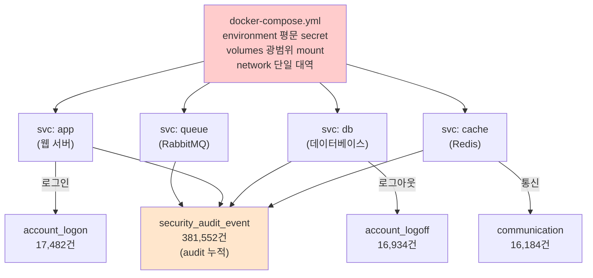

# Week 06: Docker Compose 보안

## 학습 목표
- Docker Compose를 사용하여 다중 컨테이너 환경을 구성할 수 있다
- Docker Secrets로 비밀정보를 안전하게 관리할 수 있다
- 리소스 제한과 healthcheck를 설정할 수 있다
- Compose 파일의 보안 점검 포인트를 파악한다

## 실습 환경 (공통)

| 서버 | IP | 역할 | 접속 |
|------|-----|------|------|
| bastion | 10.20.30.201 | Control Plane (Bastion) | `ssh ccc@10.20.30.201` (pw: 1) |
| secu | 10.20.30.1 | 방화벽/IPS (nftables, Suricata) | `ssh ccc@10.20.30.1` |
| web | 10.20.30.80 | 웹서버 (JuiceShop:3000, Apache:80) | `ssh ccc@10.20.30.80` |
| siem | 10.20.30.100 | SIEM (Wazuh Dashboard:443, OpenCTI:8080) | `ssh ccc@10.20.30.100` |

**Bastion API:** `http://localhost:9100` / Key: `ccc-api-key-2026`

## 강의 시간 배분 (3시간)

| 시간 | 내용 | 유형 |
|------|------|------|
| 0:00-0:40 | 이론 강의 (Part 1) | 강의 |
| 0:40-1:10 | 이론 심화 + 사례 분석 (Part 2) | 강의/토론 |
| 1:10-1:20 | 휴식 | - |
| 1:20-2:00 | 실습 (Part 3) | 실습 |
| 2:00-2:40 | 심화 실습 + 도구 활용 (Part 4) | 실습 |
| 2:40-2:50 | 휴식 | - |
| 2:50-3:20 | 응용 실습 + Bastion 연동 (Part 5) | 실습 |
| 3:20-3:40 | 정리 + 과제 안내 | 정리 |

---

---

## 용어 해설 (Docker/클라우드/K8s 보안 과목)

| 용어 | 영문 | 설명 | 비유 |
|------|------|------|------|
| **컨테이너** | Container | 앱과 의존성을 격리하여 실행하는 경량 가상화 | 이삿짐 컨테이너 (어디서든 동일하게 열 수 있음) |
| **이미지** | Image (Docker) | 컨테이너를 만들기 위한 읽기 전용 템플릿 | 붕어빵 틀 |
| **Dockerfile** | Dockerfile | 이미지를 빌드하는 레시피 파일 | 요리 레시피 |
| **레지스트리** | Registry | 이미지를 저장·배포하는 저장소 (Docker Hub 등) | 앱 스토어 |
| **레이어** | Layer (Image) | 이미지의 각 빌드 단계 (캐싱 단위) | 레고 블록 한 층 |
| **볼륨** | Volume | 컨테이너 데이터를 영구 저장하는 공간 | 외장 하드 |
| **네임스페이스** | Namespace (Linux) | 프로세스를 격리하는 커널 기능 (PID, NET, MNT 등) | 칸막이 (같은 건물, 서로 안 보임) |
| **cgroup** | Control Group | 프로세스의 CPU/메모리 사용량을 제한하는 커널 기능 | 전기/수도 사용량 제한 |
| **오케스트레이션** | Orchestration | 다수의 컨테이너를 관리·조율하는 것 (K8s) | 오케스트라 지휘 |
| **Pod** | Pod (K8s) | K8s의 최소 배포 단위 (1개 이상의 컨테이너) | 같은 방에 사는 룸메이트들 |
| **RBAC** | Role-Based Access Control | 역할 기반 접근 제어 (K8s) | 직책별 출입 권한 |
| **PSP/PSA** | Pod Security Policy/Admission | Pod의 보안 설정을 강제하는 정책 | 건물 입주 조건 |
| **NetworkPolicy** | NetworkPolicy (K8s) | Pod 간 네트워크 통신 규칙 | 부서 간 출입 통제 |
| **Trivy** | Trivy | 컨테이너 이미지 취약점 스캐너 (Aqua) | X-ray 검사기 |
| **IaC** | Infrastructure as Code | 인프라를 코드로 정의·관리 (Terraform 등) | 건축 설계도 (코드 = 설계도) |
| **IAM** | Identity and Access Management | 클라우드 사용자/권한 관리 (AWS IAM 등) | 회사 사원증 + 권한 관리 시스템 |
| **CIS 벤치마크** | CIS Benchmark | 보안 설정 모범 사례 가이드 (Center for Internet Security) | 보안 설정 모범답안 |

---

## 1. Docker Compose 기본

Docker Compose는 여러 컨테이너를 YAML 파일 하나로 정의하고 관리한다.

```yaml
# docker-compose.yaml
version: "3.9"
services:
  web:
    image: nginx:latest
    ports:
      - "80:80"
  db:
    image: postgres:16
    environment:
      POSTGRES_PASSWORD: mysecret  # 이렇게 하면 안 됨!
```

> **실습 목적**: Docker Compose에서 secrets, read_only, cap_drop 등 보안 설정을 일괄 적용하는 방법을 체험하기 위해 수행한다
>
> **배우는 것**: 환경변수 대신 Docker Secrets로 비밀정보를 전달하면 docker inspect에 노출되지 않는 이유와, 리소스 제한으로 DoS를 방지하는 원리를 이해한다
>
> **결과 해석**: docker compose ps에서 (healthy) 상태는 healthcheck 통과, 리소스 제한은 docker stats에서 MEM LIMIT 값으로 확인한다
>
> **실전 활용**: 프로덕션 Compose 파일 작성 시 보안 템플릿으로 활용하며, 보안 감사에서 설정 준수를 증명하는 데 사용한다

```bash
# 실행
docker compose up -d

# 상태 확인
docker compose ps

# 중지 및 삭제
docker compose down
```

---

## 2. Docker Secrets

> **이 실습을 왜 하는가?**
> "Docker Compose 보안" — 이 주차의 핵심 기술을 실제 서버 환경에서 직접 실행하여 체험한다.
> Docker/클라우드/K8s 보안 분야에서 이 기술은 실무의 핵심이며, 실습을 통해
> 명령어의 의미, 결과 해석 방법, 보안 관점에서의 판단 기준을 익힌다.
>
> **이걸 하면 무엇을 알 수 있는가?**
> - 이 기술이 실제 시스템에서 어떻게 동작하는지 직접 확인
> - 정상과 비정상 결과를 구분하는 눈을 기름
> - 실무에서 바로 활용할 수 있는 명령어와 절차를 체득
>
> **주의:** 모든 실습은 허가된 실습 환경(10.20.30.0/24)에서만 수행한다.

환경변수로 비밀번호를 전달하면 `docker inspect`로 노출된다.
Docker Secrets는 비밀정보를 암호화하여 컨테이너에 파일로 전달한다.

### 2.1 파일 기반 Secret

```yaml
version: "3.9"
services:
  db:
    image: postgres:16
    environment:
      POSTGRES_PASSWORD_FILE: /run/secrets/db_password
    secrets:
      - db_password

secrets:
  db_password:
    file: ./secrets/db_password.txt
```

```bash
# 시크릿 파일 생성 (권한 제한)
mkdir -p secrets
echo "MyStr0ngP@ssw0rd" > secrets/db_password.txt
chmod 600 secrets/db_password.txt
```

### 2.2 환경변수 vs Secrets 비교

| 방법 | 보안 수준 | 노출 경로 |
|------|----------|----------|
| `environment:` | 낮음 | docker inspect, /proc/*/environ |
| `.env` 파일 | 낮음 | 파일 접근, docker inspect |
| `secrets:` | 높음 | /run/secrets/ (tmpfs, 메모리) |

---

## 3. 리소스 제한

컨테이너가 호스트 리소스를 독점하지 못하도록 제한한다.
DoS 공격이나 리소스 고갈을 방지하는 핵심 설정이다.

### 3.1 메모리/CPU 제한

```yaml
services:
  app:
    image: myapp:latest
    deploy:
      resources:
        limits:
          cpus: "0.50"      # CPU 50%
          memory: 256M       # 메모리 256MB
        reservations:
          cpus: "0.25"      # 최소 보장 CPU
          memory: 128M       # 최소 보장 메모리
```

### 3.2 PID 제한 (포크 폭탄 방지)

```yaml
services:
  app:
    image: myapp:latest
    pids_limit: 100          # 프로세스 최대 100개
```

### 3.3 스토리지 제한

```yaml
services:
  app:
    image: myapp:latest
    storage_opt:
      size: "1G"             # 컨테이너 디스크 1GB 제한
```

---

## 4. Healthcheck

컨테이너가 정상 작동하는지 주기적으로 검사한다.
문제 발생 시 자동 재시작을 트리거할 수 있다.

```yaml
services:
  web:
    image: nginx:latest
    healthcheck:
      test: ["CMD", "curl", "-f", "http://localhost/"]
      interval: 30s          # 30초마다 검사
      timeout: 10s           # 10초 내 응답 없으면 실패
      retries: 3             # 3회 연속 실패 시 unhealthy
      start_period: 10s      # 시작 후 10초 대기

  db:
    image: postgres:16
    healthcheck:
      test: ["CMD-SHELL", "pg_isready -U postgres"]
      interval: 10s
      timeout: 5s
      retries: 5
```

### Healthcheck 상태 확인

```bash
docker compose ps
# NAME    STATUS
# web     Up 2 minutes (healthy)
# db      Up 2 minutes (healthy)

docker inspect --format='{{.State.Health.Status}}' web
```

---

## 5. Compose 보안 설정 종합

### 5.1 완전한 보안 Compose 파일

```yaml
version: "3.9"

services:
  web:
    image: nginx:1.25-alpine
    read_only: true                    # 읽기 전용 파일시스템
    tmpfs:
      - /tmp
      - /var/cache/nginx
    cap_drop:
      - ALL                            # 모든 capability 제거
    cap_add:
      - NET_BIND_SERVICE               # 필요한 것만 추가
    security_opt:
      - no-new-privileges:true         # 권한 상승 방지
    ports:
      - "127.0.0.1:8080:80"           # localhost만 노출
    networks:
      - frontend
    deploy:
      resources:
        limits:
          cpus: "0.5"
          memory: 128M
    healthcheck:
      test: ["CMD", "curl", "-f", "http://localhost/"]
      interval: 30s
      timeout: 5s
      retries: 3
    restart: unless-stopped

  api:
    image: myapp:latest
    read_only: true
    tmpfs:
      - /tmp
    cap_drop:
      - ALL
    security_opt:
      - no-new-privileges:true
    networks:
      - frontend
      - backend
    environment:
      DB_HOST: db
      DB_PORT: 5432
      DB_PASSWORD_FILE: /run/secrets/db_password
    secrets:
      - db_password
    deploy:
      resources:
        limits:
          cpus: "1.0"
          memory: 512M
    depends_on:
      db:
        condition: service_healthy

  db:
    image: postgres:16-alpine
    cap_drop:
      - ALL
    cap_add:
      - CHOWN
      - SETUID
      - SETGID
      - FOWNER
    security_opt:
      - no-new-privileges:true
    networks:
      - backend                        # 백엔드 네트워크만
    volumes:
      - db-data:/var/lib/postgresql/data
    environment:
      POSTGRES_PASSWORD_FILE: /run/secrets/db_password
    secrets:
      - db_password
    deploy:
      resources:
        limits:
          cpus: "1.0"
          memory: 1G
    healthcheck:
      test: ["CMD-SHELL", "pg_isready -U postgres"]
      interval: 10s
      timeout: 5s
      retries: 5

networks:
  frontend:
  backend:
    internal: true                     # 외부 접근 차단

volumes:
  db-data:

secrets:
  db_password:
    file: ./secrets/db_password.txt
```

---

## 6. 실습: Compose 보안 점검

실습 환경: `web` 서버 (10.20.30.80)

### 실습 1: 기존 Compose 파일 보안 점검

```bash
ssh ccc@10.20.30.80

# Apache+ModSecurity Compose 파일 확인
cat /etc/apache2/sites-enabled/ (VirtualHost 설정)

# 보안 점검 항목 확인
# 1. 환경변수에 비밀정보가 있는가?
# 2. read_only가 설정되어 있는가?
# 3. cap_drop이 설정되어 있는가?
# 4. 리소스 제한이 있는가?
# 5. healthcheck가 설정되어 있는가?
```

### 실습 2: 안전한 Compose 환경 구성

```bash
mkdir -p /tmp/secure-lab/secrets && cd /tmp/secure-lab

# 시크릿 생성
echo "LabP@ssw0rd2026" > secrets/db_password.txt
chmod 600 secrets/db_password.txt

# 보안 강화 Compose 파일 작성
cat > docker-compose.yaml << 'EOF'
version: "3.9"
services:
  web:
    image: nginx:alpine
    read_only: true
    tmpfs: [/tmp, /var/cache/nginx, /var/run]
    cap_drop: [ALL]
    cap_add: [NET_BIND_SERVICE]
    security_opt: ["no-new-privileges:true"]
    ports: ["127.0.0.1:9094:80"]
    deploy:
      resources:
        limits: { cpus: "0.25", memory: 64M }
    healthcheck:
      test: ["CMD", "wget", "-q", "--spider", "http://localhost/"]
      interval: 15s
      timeout: 5s
      retries: 3
EOF

# 실행 및 확인
docker compose up -d
docker compose ps
curl http://localhost:9094

# 정리
docker compose down
```

### 실습 3: 리소스 제한 테스트

Compose의 리소스 제한이 실제로 CPU 사용을 제한하는지 확인한다. dd 명령으로 CPU를 100% 사용하려 해도 10%로 제한되는 것을 docker stats에서 확인할 수 있다.

```bash
# CPU/메모리 제한이 적용된 스트레스 테스트용 Compose 파일 생성
cat > /tmp/stress-compose.yaml << 'EOF'
version: "3.9"
services:
  stress:
    image: alpine
    command: ["sh", "-c", "dd if=/dev/zero of=/dev/null bs=1M"]
    deploy:
      resources:
        limits:
          cpus: "0.1"
          memory: 32M
EOF

docker compose -f /tmp/stress-compose.yaml up -d
docker stats --no-stream  # CPU가 10%로 제한됨을 확인
docker compose -f /tmp/stress-compose.yaml down
```

---

## 7. Compose 보안 체크리스트

- [ ] 비밀정보는 secrets로 관리하는가?
- [ ] read_only 파일시스템을 적용했는가?
- [ ] cap_drop ALL + 필요한 cap_add만 설정했는가?
- [ ] no-new-privileges 옵션을 적용했는가?
- [ ] CPU/메모리/PID 리소스 제한을 설정했는가?
- [ ] healthcheck로 서비스 상태를 모니터링하는가?
- [ ] 내부 서비스는 internal 네트워크에 배치했는가?
- [ ] 포트 바인딩 시 127.0.0.1을 명시했는가?

---

## 핵심 정리

1. 환경변수 대신 Docker Secrets로 비밀정보를 관리한다
2. 리소스 제한(CPU, 메모리, PID)으로 DoS 공격을 방지한다
3. Healthcheck로 서비스 장애를 자동 감지한다
4. 보안 설정(read_only, cap_drop, no-new-privileges)을 Compose에서 일괄 적용한다
5. 네트워크를 분리하여 최소 권한 원칙을 네트워크에도 적용한다

---

## 다음 주 예고
- Week 07: Docker 보안 점검 - Docker Bench for Security, CIS Benchmark

---

> **실습 환경 검증 완료** (2026-03-28): Docker 29.3.0, Compose v5.1.1, juice-shop(User=65532,Privileged=false), OpenCTI 6컨테이너, opencti_default 네트워크

---

## 📂 실습 참조 파일 가이드

> 이번 주 실습에서 **실제로 조작하는** 솔루션의 기능·경로·파일·설정·UI 요점입니다.

### Docker Engine
> **역할:** 컨테이너 런타임·이미지 관리  
> **실행 위치:** `모든 VM(공통)`  
> **접속/호출:** `docker` CLI, `systemctl status docker`

**주요 경로·파일**

| 경로 | 역할 |
|------|------|
| `/var/lib/docker/` | 이미지·컨테이너 저장소(overlay2) |
| `/etc/docker/daemon.json` | 데몬 설정 (log-driver, userns-remap 등) |
| `/var/run/docker.sock` | Docker API 소켓 — 루트권한 등가 |

**핵심 설정·키**

- `{"userns-remap": "default"}` — 컨테이너 root↔호스트 비루트 매핑
- `{"icc": false}` — 기본 네트워크 내 컨테이너 간 통신 차단
- `{"no-new-privileges": true}` — setuid 권한 상승 차단

**로그·확인 명령**

- `journalctl -u docker` — 데몬 로그
- ``docker logs <c>`` — 컨테이너 stdout/stderr

**UI / CLI 요점**

- `docker inspect <c> | jq '.[0].HostConfig.Privileged'` — `--privileged` 여부
- `docker exec -it <c> sh` — 컨테이너 내부 진입
- `docker system df` — 이미지/볼륨 디스크 사용량

> **해석 팁.** `/var/run/docker.sock`을 컨테이너에 마운트하는 순간 **호스트 루트와 동등**이다. 점검 1순위.

### Dockerfile 보안 작성
> **역할:** 최소 권한·재현성·비밀 격리  
> **실행 위치:** `빌드 호스트`  
> **접속/호출:** `docker build -t img .`

**주요 경로·파일**

| 경로 | 역할 |
|------|------|
| `Dockerfile` | 빌드 정의 |
| `.dockerignore` | 이미지에 포함하지 않을 파일 |

**핵심 설정·키**

- `FROM <distroless|alpine>` — 최소 베이스
- `USER 1000` — 비root 실행
- `RUN --mount=type=secret,id=NPM_TOKEN` — 빌드 비밀 외부 주입
- `HEALTHCHECK CMD ...` — 컨테이너 헬스체크

**로그·확인 명령**

- ``docker history `` — 레이어별 변경 크기·명령

**UI / CLI 요점**

- `docker scout cves ` — 이미지 CVE 스캔
- `dive ` — 레이어별 파일 변경 시각화

> **해석 팁.** `COPY . .` 전에 `.dockerignore`로 `.git`, `.env` 제외. 빌드 시 `ARG SECRET=...` 는 **이미지 메타데이터에 남는다** — 비밀은 BuildKit `--secret` 사용.

---

## 실제 사례 (WitFoo Precinct 6 — Compose 다중 서비스 보안)

> 출처: WitFoo Precinct 6 Cybersecurity Dataset (Apache 2.0)
> 본 lecture *Docker Compose 서비스 격리 / secret 관리 / health-check* 학습 항목 매칭.

### Compose 결함이 왜 무서운가 — "결함 1개 × 서비스 수" 의 곱셈 효과

Docker Compose 는 여러 서비스 (예: app, db, cache, queue) 를 한 파일로 정의해서 함께 띄우는 도구다. 편리하지만 보안 관점에서 위험한 점은 — **결함 1개가 모든 서비스에 동시에 영향을 미친다**. 예를 들어 `environment:` 섹션에 `DB_PASSWORD=admin` 같은 평문 시크릿을 박으면 — 그 시크릿은 환경변수로 *모든 서비스의 모든 컨테이너 프로세스* 에 노출된다. 4개 서비스 × 평균 2개 인스턴스 = 8개 프로세스가 모두 같은 평문 시크릿을 갖게 된다.

dataset 은 이 곱셈 효과를 정량적으로 보여준다. account_logon 17,482건 + account_logoff 16,934건 + communication 16,184건 + security_audit_event 381,552건 — 이 모든 신호는 *각 서비스가 독립적으로 만든 흔적의 누적* 이다. 1개 서비스가 시간당 ~50건 audit 을 만든다면 4개 서비스 compose 환경은 시간당 ~200건. 한 달이면 ~144,000건이 쌓인다 — 사람이 직접 모니터링하는 것이 사실상 불가능한 양이다.



**그림 해석**: 빨간 박스 (compose.yml) 의 결함 한 줄이 4개 서비스 박스로 분배되고, 각 서비스는 다시 4가지 신호 군에 흔적을 남긴다. 즉 1줄 결함 → 4 서비스 → 4 신호 = 1 : 16 의 확산 비율. lecture §"compose 서비스 격리" 가 강조하는 것은 *결함의 격리 (containment)* 다.

### Case 1: security_audit_event 381,552건 — Compose 환경의 audit 폭발

| 항목 | 값 | 의미 |
|---|---|---|
| message_type | `security_audit_event` | dataset 에서 최다 발생 |
| 총 발생 | 381,552건 | 약 30일 분량 |
| 단일 서비스 baseline | 시간당 ~50건 | 정상 운영 가정 |
| 학습 매핑 | §"compose 서비스별 audit" | 서비스 수 × 시간 = 누적 |

**자세한 해석**:

`security_audit_event` 는 시스템에 변화가 일어날 때마다 기록되는 audit 이벤트의 총칭이다 — secret 회전, 서비스 재시작, 환경변수 변경, ACL 수정, 사용자 권한 변경 등이 모두 이 분류에 들어간다. 단일 서비스가 정상 운영 시 시간당 ~50건의 audit 을 만든다고 가정하면, 4 서비스 compose 환경은 시간당 ~200건, 일일 ~4,800건, 30일 ~144,000건이다.

**dataset 381,552건은 약 80일 분량의 audit** 이고, 이는 *2-3개 컴팩트한 compose 환경* 또는 *1개의 큰 compose 환경* 의 정상 운영 흔적 정도다. 이 정도 양은 — *사람이 시간순으로 직접 읽는 것이 불가능* 하다. 따라서 compose 환경 보안은 처음부터 *anomaly 자동 탐지 룰* 을 전제로 설계해야 한다.

학생이 알아야 할 것은 — **compose 의 audit 신호 폭증은 자연스러운 결과지만, 그 폭증 안에서 비정상을 골라내는 것은 사람의 일이 아니라 룰의 일** 이라는 점이다. lecture §"compose 보안 모니터링" 은 룰 작성을 강조한다.

### Case 2: account_logon 17,482 + logoff 16,934 — 인증 균형의 진단 지표

| 항목 | 값 | 의미 |
|---|---|---|
| account_logon | 17,482건 | 서비스 로그인 이벤트 |
| account_logoff | 16,934건 | 서비스 로그아웃 이벤트 |
| 비율 | 1 : 0.969 | 거의 1:1 (정상 운영) |
| logon 우위분 | +548건 (3.2%) | 로그인 후 정상 logoff 못 한 흔적 |
| 학습 매핑 | §"compose health-check" | session 정상 종료 검증 |

**자세한 해석**:

정상적으로 동작하는 서비스는 *세션을 시작하면 끝낼 때 정상 종료* 한다 — 로그인 1건당 로그아웃 1건. 따라서 account_logon : account_logoff = 1:1 이 정상 운영의 정량 baseline 이다. dataset 의 17,482 : 16,934 = 1 : 0.969 는 거의 균형을 유지하지만, **+548건의 logon 우위 (3.2%)** 가 존재한다.

이 +548건은 *logon 후 logoff 를 못 한 세션* 들이다. 발생 원인은 — (1) 컨테이너가 OOM 으로 강제 종료되어 logoff 이벤트 발생 못 함, (2) 네트워크 단절로 logoff 패킷 유실, (3) 공격자가 의도적으로 logoff 를 우회한 흔적. 정상 운영의 자연 현상은 (1)+(2) 가 대부분이고, 비율이 5% 를 넘어가면 (3) 의 가능성이 커진다.

학생이 알아야 할 것은 — **compose health-check 가 단순히 *서비스가 살아 있는가* 가 아니라 *세션이 깨끗하게 종료되는가* 도 검증해야 한다** 는 점이다. session leak 은 메모리 누수보다 더 위험한 보안 신호.

### 이 사례에서 학생이 배워야 할 3가지

1. **Compose 결함은 1:N 으로 확산된다** — 1줄 결함 → N 개 서비스 → 더 많은 신호. 격리 설계가 핵심.
2. **audit 폭발은 정상 — 룰로 처리** — 사람이 읽을 양이 아니므로 anomaly 룰을 전제로 설계.
3. **logon : logoff 비율이 인증 위생의 정량 지표** — 1:1 에서 멀어질수록 의심.

**학생 액션**: 본인이 작성한 docker-compose.yml 에서 `environment:` 섹션의 평문 시크릿을 골라내고, (1) `secrets:` 블록 또는 (2) `.env_file:` 로 변경. 변경 전후의 5분간 audit 이벤트 수를 측정하여 차이를 표로 정리하고, *"compose 보안 모니터링이 왜 룰 기반이어야 하는가"* 1문단으로 정리.


---

## 부록: 학습 OSS 도구 매트릭스 (Course6 Cloud-Container — Week 06 IAM/접근제어)

### IAM/접근제어 OSS 도구

| 영역 | OSS 도구 |
|------|---------|
| Identity Provider | **Keycloak** (RH SSO) / Authelia / Authentik / Dex |
| OIDC / SAML | Keycloak / Authentik / OpenLDAP + 위 IdP |
| K8s RBAC | kubectl auth / **rbac-tool** (Insightly) / kubectl-who-can |
| 인가 정책 | **OPA** / Casbin / Keto (ory) |
| K8s admission | **OPA Gatekeeper** / Kyverno |
| 자격증명 보관 | **Vault** / SOPS / age |
| Service Account 분석 | rakkess / kubectl-who-can / aquasec rbac analyzer |

### 핵심 — Keycloak (사실상 OSS IdP 표준)

```bash
# Docker 로 시작
docker run -d --name keycloak \
  -e KEYCLOAK_ADMIN=admin \
  -e KEYCLOAK_ADMIN_PASSWORD=Pa$$w0rd \
  -p 8090:8080 \
  quay.io/keycloak/keycloak:latest start-dev
# Web UI: http://localhost:8090

# CLI 자동화
docker exec -it keycloak /opt/keycloak/bin/kcadm.sh \
  config credentials --server http://localhost:8080 --realm master \
  --user admin --password Pa$$w0rd

# Realm 생성
docker exec -it keycloak /opt/keycloak/bin/kcadm.sh \
  create realms -s realm=demo -s enabled=true

# Client 등록 (k8s OIDC 통합)
docker exec -it keycloak /opt/keycloak/bin/kcadm.sh \
  create clients -r demo -s clientId=k8s-cluster \
  -s 'redirectUris=["https://k8s.local/*"]' -s publicClient=true
```

### 학생 환경 준비

```bash
# Keycloak (OIDC IdP)
docker pull quay.io/keycloak/keycloak:latest

# OPA + Casbin (정책 엔진)
curl -L -o opa https://openpolicyagent.org/downloads/v0.62.0/opa_linux_amd64_static
chmod +x opa && sudo mv opa /usr/local/bin/

pip3 install casbin

# rbac-tool (k8s RBAC 분석)
curl -L https://github.com/alcideio/rbac-tool/releases/latest/download/rbac-tool-linux-amd64.gz | gunzip > rbac-tool
chmod +x rbac-tool && sudo mv rbac-tool /usr/local/bin/

# kubectl-who-can
curl -L https://github.com/aquasecurity/kubectl-who-can/releases/latest/download/kubectl-who-can_linux_x86_64.tar.gz | sudo tar xz -C /usr/local/bin/

# rakkess (k8s 권한 매트릭스)
curl -L https://github.com/corneliusweig/rakkess/releases/latest/download/rakkess-amd64-linux.gz | gunzip > rakkess
chmod +x rakkess && sudo mv rakkess /usr/local/bin/

# Vault (HashiCorp OSS — 자격증명 관리)
curl -fsSL https://apt.releases.hashicorp.com/gpg | sudo apt-key add -
sudo apt-add-repository "deb [arch=amd64] https://apt.releases.hashicorp.com $(lsb_release -cs) main"
sudo apt install -y vault
```

### 핵심 사용법

```bash
# 1) Keycloak — OIDC 흐름
# 1. Realm 생성 → Client 등록 (k8s 또는 web app)
# 2. User 생성 + Role 매핑
# 3. Application 에서 OIDC discovery URL 사용
#    http://keycloak/realms/demo/.well-known/openid-configuration

# 2) k8s API server 에 OIDC 통합
# /etc/kubernetes/manifests/kube-apiserver.yaml 에 추가
# --oidc-issuer-url=http://keycloak/realms/demo
# --oidc-client-id=k8s-cluster
# --oidc-username-claim=preferred_username

# 3) RBAC 분석 — kubectl-who-can
kubectl who-can list pods                                         # 누가 list pods 권한이 있나
kubectl who-can delete deployments

# 4) rakkess — 권한 매트릭스
rakkess
# 출력: 모든 user/SA × 모든 resource × verb 매트릭스

# 5) rbac-tool — RBAC 분석
rbac-tool show
rbac-tool whoami

# 6) OPA — 정책 작성
cat > /tmp/policy.rego << 'EOF'
package k8s.deny
deny[msg] {
  input.kind == "Pod"
  not input.spec.securityContext.runAsNonRoot
  msg := "Pod must run as non-root"
}
EOF
opa eval -d /tmp/policy.rego -i /tmp/pod.yaml "data.k8s.deny"

# 7) Vault (k8s secret integration)
vault server -dev -dev-root-token-id=root
export VAULT_ADDR=http://127.0.0.1:8200 VAULT_TOKEN=root
vault kv put secret/db password=Pa$$w0rd
vault kv get secret/db

# k8s 와 통합 (vault-k8s-auth)
vault auth enable kubernetes
vault write auth/kubernetes/config \
  kubernetes_host="https://k8s-api"
vault write auth/kubernetes/role/myrole \
  bound_service_account_names=myapp \
  bound_service_account_namespaces=default \
  policies=mypolicy ttl=24h
```

### IAM 점검 흐름

```bash
# Phase 1: User/Role 인벤토리
kubectl get clusterrolebindings -o json | jq '.items[].subjects[]'
rakkess --output json > /tmp/rbac.json

# Phase 2: 과도한 권한 식별
kubectl who-can '*' '*' --all-namespaces                          # cluster-admin 보유자
kubectl who-can delete clusterrolebindings

# Phase 3: ServiceAccount 정리
kubectl get sa --all-namespaces -o json \
  | jq '.items[] | select(.metadata.name != "default") | .metadata.namespace'

# Phase 4: 정책 자동 적용 (OPA Gatekeeper / Kyverno)
kubectl apply -f gatekeeper-policies/

# Phase 5: Secret 관리 (Vault → k8s sync)
vault kv put secret/myapp password=$(openssl rand -base64 32)
# k8s 가 vault-injector 로 자동 mount
```

학생은 본 6주차에서 **Keycloak + OPA + rbac-tool + Vault + kubectl-who-can** 5 도구로 IAM 의 4 단계 (인증 → 인가 → 권한 분석 → secret 관리) 통합 운영을 익힌다.
