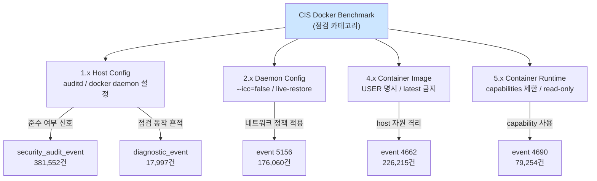

# Week 07: Docker 보안 점검

## 학습 목표
- CIS Docker Benchmark의 주요 항목을 이해한다
- Docker Bench for Security 도구를 실행하고 결과를 해석할 수 있다
- 점검 결과를 바탕으로 보안 개선 조치를 수행할 수 있다

## 실습 환경 (공통)

| 서버 | IP | 역할 | 접속 |
|------|-----|------|------|
| bastion | 10.20.30.201 | Control Plane (Bastion) | `ssh ccc@10.20.30.201` (pw: 1) |
| secu | 10.20.30.1 | 방화벽/IPS (nftables, Suricata) | `ssh ccc@10.20.30.1` |
| web | 10.20.30.80 | 웹서버 (JuiceShop:3000, Apache:80) | `ssh ccc@10.20.30.80` |
| siem | 10.20.30.100 | SIEM (Wazuh Dashboard:443, OpenCTI:8080) | `ssh ccc@10.20.30.100` |

**Bastion API:** `http://localhost:9100` / Key: `ccc-api-key-2026`

## 강의 시간 배분 (3시간)

| 시간 | 내용 | 유형 |
|------|------|------|
| 0:00-0:40 | 이론 강의 (Part 1) | 강의 |
| 0:40-1:10 | 이론 심화 + 사례 분석 (Part 2) | 강의/토론 |
| 1:10-1:20 | 휴식 | - |
| 1:20-2:00 | 실습 (Part 3) | 실습 |
| 2:00-2:40 | 심화 실습 + 도구 활용 (Part 4) | 실습 |
| 2:40-2:50 | 휴식 | - |
| 2:50-3:20 | 응용 실습 + Bastion 연동 (Part 5) | 실습 |
| 3:20-3:40 | 정리 + 과제 안내 | 정리 |

---

---

## 용어 해설 (Docker/클라우드/K8s 보안 과목)

| 용어 | 영문 | 설명 | 비유 |
|------|------|------|------|
| **컨테이너** | Container | 앱과 의존성을 격리하여 실행하는 경량 가상화 | 이삿짐 컨테이너 (어디서든 동일하게 열 수 있음) |
| **이미지** | Image (Docker) | 컨테이너를 만들기 위한 읽기 전용 템플릿 | 붕어빵 틀 |
| **Dockerfile** | Dockerfile | 이미지를 빌드하는 레시피 파일 | 요리 레시피 |
| **레지스트리** | Registry | 이미지를 저장·배포하는 저장소 (Docker Hub 등) | 앱 스토어 |
| **레이어** | Layer (Image) | 이미지의 각 빌드 단계 (캐싱 단위) | 레고 블록 한 층 |
| **볼륨** | Volume | 컨테이너 데이터를 영구 저장하는 공간 | 외장 하드 |
| **네임스페이스** | Namespace (Linux) | 프로세스를 격리하는 커널 기능 (PID, NET, MNT 등) | 칸막이 (같은 건물, 서로 안 보임) |
| **cgroup** | Control Group | 프로세스의 CPU/메모리 사용량을 제한하는 커널 기능 | 전기/수도 사용량 제한 |
| **오케스트레이션** | Orchestration | 다수의 컨테이너를 관리·조율하는 것 (K8s) | 오케스트라 지휘 |
| **Pod** | Pod (K8s) | K8s의 최소 배포 단위 (1개 이상의 컨테이너) | 같은 방에 사는 룸메이트들 |
| **RBAC** | Role-Based Access Control | 역할 기반 접근 제어 (K8s) | 직책별 출입 권한 |
| **PSP/PSA** | Pod Security Policy/Admission | Pod의 보안 설정을 강제하는 정책 | 건물 입주 조건 |
| **NetworkPolicy** | NetworkPolicy (K8s) | Pod 간 네트워크 통신 규칙 | 부서 간 출입 통제 |
| **Trivy** | Trivy | 컨테이너 이미지 취약점 스캐너 (Aqua) | X-ray 검사기 |
| **IaC** | Infrastructure as Code | 인프라를 코드로 정의·관리 (Terraform 등) | 건축 설계도 (코드 = 설계도) |
| **IAM** | Identity and Access Management | 클라우드 사용자/권한 관리 (AWS IAM 등) | 회사 사원증 + 권한 관리 시스템 |
| **CIS 벤치마크** | CIS Benchmark | 보안 설정 모범 사례 가이드 (Center for Internet Security) | 보안 설정 모범답안 |

---

## 1. CIS Docker Benchmark란?

CIS(Center for Internet Security)에서 발행한 Docker 보안 설정 가이드이다.
호스트, 데몬, 이미지, 컨테이너, 네트워크 등 7개 영역을 점검한다.

### 7대 점검 영역

| 영역 | 내용 | 예시 |
|------|------|------|
| 1. 호스트 설정 | OS 보안, 파티션 | /var/lib/docker 별도 파티션 |
| 2. Docker 데몬 | 데몬 보안 설정 | TLS 인증, 로깅 드라이버 |
| 3. Docker 데몬 파일 | 파일 권한 | docker.sock 권한 660 |
| 4. 컨테이너 이미지 | 이미지 보안 | 신뢰할 수 있는 베이스 이미지 |
| 5. 컨테이너 런타임 | 실행 시 보안 | privileged 비사용 |
| 6. Docker Security Operations | 운영 보안 | 정기 점검, 패치 관리 |
| 7. Docker Swarm | 오케스트레이션 | 인증서, 암호화 |

---

## 2. Docker Bench for Security

> **이 실습을 왜 하는가?**
> "Docker 보안 점검" — 이 주차의 핵심 기술을 실제 서버 환경에서 직접 실행하여 체험한다.
> Docker/클라우드/K8s 보안 분야에서 이 기술은 실무의 핵심이며, 실습을 통해
> 명령어의 의미, 결과 해석 방법, 보안 관점에서의 판단 기준을 익힌다.
>
> **이걸 하면 무엇을 알 수 있는가?**
> - 이 기술이 실제 시스템에서 어떻게 동작하는지 직접 확인
> - 정상과 비정상 결과를 구분하는 눈을 기름
> - 실무에서 바로 활용할 수 있는 명령어와 절차를 체득
>
> **주의:** 모든 실습은 허가된 실습 환경(10.20.30.0/24)에서만 수행한다.

CIS Benchmark를 자동으로 점검하는 오픈소스 스크립트이다.

### 2.1 실행 방법

> **실습 목적**: CIS Docker Benchmark 기준으로 실제 Docker 환경의 보안 수준을 자동 점검하기 위해 수행한다
>
> **배우는 것**: Docker Bench for Security가 7개 영역(호스트/데몬/파일/이미지/런타임/운영/Swarm)을 자동 점검하는 원리와, WARN 항목의 의미를 이해한다
>
> **결과 해석**: [PASS]는 기준 충족, [WARN]은 개선 필요이며, 섹션별 WARN 수로 우선순위를 판단한다
>
> **실전 활용**: 정기 보안 점검 보고서 작성 및 Docker 환경 하드닝 작업의 기준점으로 활용한다

```bash
# 방법 1: Docker로 실행 (권장)
docker run --rm --net host --pid host --userns host --cap-add audit_control \
  -e DOCKER_CONTENT_TRUST=$DOCKER_CONTENT_TRUST \
  -v /var/lib:/var/lib:ro \
  -v /var/run/docker.sock:/var/run/docker.sock:ro \
  -v /usr/lib/systemd:/usr/lib/systemd:ro \
  -v /etc:/etc:ro \
  docker/docker-bench-security

# 방법 2: 스크립트 직접 실행
git clone https://github.com/docker/docker-bench-security.git
cd docker-bench-security
sudo sh docker-bench-security.sh
```

### 2.2 결과 해석

```
[INFO] 1 - Host Configuration
[PASS] 1.1 - Ensure a separate partition for containers has been created
[WARN] 1.2 - Ensure only trusted users are allowed to control Docker daemon

[INFO] 5 - Container Runtime
[WARN] 5.1 - Ensure that, if applicable, an AppArmor Profile is enabled
[PASS] 5.2 - Ensure that, if applicable, SELinux security options are set
[WARN] 5.3 - Ensure that Linux kernel capabilities are restricted
[WARN] 5.4 - Ensure that privileged containers are not used
```

결과 분류:
- **[PASS]**: 보안 기준 충족
- **[WARN]**: 개선 필요
- **[NOTE]**: 정보성 메시지
- **[INFO]**: 섹션 구분

---

## 3. 주요 점검 항목 상세

### 3.1 데몬 보안 (섹션 2)

```bash
# 2.1 - 로깅 드라이버 설정 확인
docker info --format '{{.LoggingDriver}}'
# 권장: json-file 또는 journald

# 2.2 - live-restore 활성화 확인
docker info --format '{{.LiveRestoreEnabled}}'
# 데몬 재시작 시 컨테이너 유지

# daemon.json 보안 설정
cat /etc/docker/daemon.json
```

### 권장 daemon.json

```json
{
  "icc": false,
  "log-driver": "json-file",
  "log-opts": {
    "max-size": "10m",
    "max-file": "3"
  },
  "live-restore": true,
  "userland-proxy": false,
  "no-new-privileges": true,
  "default-ulimits": {
    "nofile": { "Name": "nofile", "Hard": 64000, "Soft": 64000 }
  }
}
```

### 3.2 파일 권한 (섹션 3)

```bash
# docker.sock 권한 확인 (660 이하여야 함)
ls -l /var/run/docker.sock

# Docker 관련 파일 권한 점검
ls -l /etc/docker/
ls -l /var/lib/docker/

# docker.service 파일 권한
ls -l /usr/lib/systemd/system/docker.service
```

### 3.3 컨테이너 런타임 (섹션 5)

```bash
# 모든 컨테이너의 보안 설정 한 번에 확인
for c in $(docker ps -q); do
  echo "=== $(docker inspect --format='{{.Name}}' $c) ==="
  echo "User: $(docker inspect --format='{{.Config.User}}' $c)"
  echo "Privileged: $(docker inspect --format='{{.HostConfig.Privileged}}' $c)"
  echo "ReadOnly: $(docker inspect --format='{{.HostConfig.ReadonlyRootfs}}' $c)"
  echo "CapDrop: $(docker inspect --format='{{.HostConfig.CapDrop}}' $c)"
  echo "PidsLimit: $(docker inspect --format='{{.HostConfig.PidsLimit}}' $c)"
  echo ""
done
```

---

## 4. 자동 점검 스크립트 작성

### 4.1 간단한 보안 점검 스크립트

```bash
#!/bin/bash
# docker-security-check.sh

echo "=== Docker 보안 간이 점검 ==="
echo ""

# 1. Docker 버전
echo "[점검] Docker 버전"
docker version --format '서버: {{.Server.Version}}'

# 2. root로 실행되는 컨테이너
echo ""
echo "[점검] root 실행 컨테이너"
for c in $(docker ps -q); do
  user=$(docker inspect --format='{{.Config.User}}' $c)
  name=$(docker inspect --format='{{.Name}}' $c)
  if [ -z "$user" ] || [ "$user" = "root" ]; then
    echo "  [WARN] $name → root로 실행 중"
  else
    echo "  [PASS] $name → $user"
  fi
done

# 3. privileged 컨테이너
echo ""
echo "[점검] Privileged 컨테이너"
for c in $(docker ps -q); do
  priv=$(docker inspect --format='{{.HostConfig.Privileged}}' $c)
  name=$(docker inspect --format='{{.Name}}' $c)
  if [ "$priv" = "true" ]; then
    echo "  [WARN] $name → privileged!"
  else
    echo "  [PASS] $name → 비특권"
  fi
done

# 4. 네트워크 모드
echo ""
echo "[점검] host 네트워크 사용 컨테이너"
for c in $(docker ps -q); do
  net=$(docker inspect --format='{{.HostConfig.NetworkMode}}' $c)
  name=$(docker inspect --format='{{.Name}}' $c)
  if [ "$net" = "host" ]; then
    echo "  [WARN] $name → host 네트워크"
  fi
done

echo ""
echo "=== 점검 완료 ==="
```

---

## 5. 실습: Docker Bench 실행

실습 환경: `web` 서버 (10.20.30.80)

### 실습 1: Docker Bench 실행

```bash
ssh ccc@10.20.30.80

# Docker Bench 실행
docker run --rm --net host --pid host --userns host \
  --cap-add audit_control \
  -v /var/lib:/var/lib:ro \
  -v /var/run/docker.sock:/var/run/docker.sock:ro \
  -v /etc:/etc:ro \
  docker/docker-bench-security 2>&1 | tee /tmp/bench-result.txt

# WARN 개수 확인
grep -c "\[WARN\]" /tmp/bench-result.txt

# 섹션별 WARN 요약
for i in 1 2 3 4 5 6 7; do
  count=$(grep "^\[WARN\] $i\." /tmp/bench-result.txt | wc -l)
  echo "섹션 $i: WARN $count건"
done
```

### 실습 2: WARN 항목 개선

```bash
# 예: 로그 크기 제한이 없는 경우
# daemon.json에 로그 설정 추가
sudo tee /etc/docker/daemon.json << 'EOF'
{
  "log-driver": "json-file",
  "log-opts": {
    "max-size": "10m",
    "max-file": "3"
  }
}
EOF

# Docker 데몬 재시작
sudo systemctl restart docker
```

### 실습 3: 간이 점검 스크립트 실행

```bash
# 위의 docker-security-check.sh를 작성하고 실행
chmod +x /tmp/docker-security-check.sh
bash /tmp/docker-security-check.sh
```

---

## 6. 점검 결과 보고서 작성

보안 점검 보고서에는 다음 내용을 포함한다:

1. **점검 일시**: 언제 점검했는가
2. **점검 대상**: 어떤 서버/컨테이너를 점검했는가
3. **발견 사항**: WARN 항목 목록과 심각도
4. **개선 조치**: 각 WARN에 대한 수정 방법
5. **후속 계획**: 다음 점검 일정

---

## 핵심 정리

1. CIS Docker Benchmark는 7개 영역의 보안 설정 기준을 제공한다
2. Docker Bench for Security로 자동 점검을 수행한다
3. daemon.json으로 데몬 수준의 보안 설정을 일괄 적용한다
4. 정기적인 점검과 보고서 작성이 운영 보안의 핵심이다
5. [WARN] 항목을 하나씩 개선하여 보안 수준을 높인다

---

## 다음 주 예고
- Week 08: 중간고사 - Docker 보안 강화 실전 과제

---

---

## 심화: 컨테이너/클라우드 보안 보충

### Docker 보안 핵심 개념 상세

#### 컨테이너 격리의 원리

```
호스트 OS 커널
├── Namespace (격리)
│   ├── PID namespace  → 컨테이너마다 독립 프로세스 번호
│   ├── NET namespace  → 컨테이너마다 독립 네트워크 스택
│   ├── MNT namespace  → 컨테이너마다 독립 파일시스템
│   ├── UTS namespace  → 컨테이너마다 독립 hostname
│   └── USER namespace → 컨테이너 내 root ≠ 호스트 root (설정 시)
│
├── cgroup (자원 제한)
│   ├── CPU:    --cpus=2          → 최대 2코어
│   ├── Memory: --memory=512m     → 최대 512MB
│   └── IO:     --blkio-weight=500
│
└── Overlay FS (레이어 파일시스템)
    ├── 읽기 전용 레이어 (이미지)
    └── 읽기/쓰기 레이어 (컨테이너)
```

> **왜 컨테이너가 VM보다 가벼운가?**
> VM: 각각 전체 OS 커널을 포함 (수 GB)
> 컨테이너: 호스트 커널을 공유, 격리만 namespace로 (수 MB)
> 대신 격리 수준은 VM이 더 강하다 (커널 취약점 시 컨테이너 탈출 가능)

#### Dockerfile 보안 체크리스트

```dockerfile
# 나쁜 예
FROM ubuntu:latest          # ❌ latest 태그 (재현 불가)
RUN apt-get update && apt-get install -y curl vim  # ❌ 불필요 패키지
COPY . /app                 # ❌ 전체 복사 (.env 포함 가능)
RUN chmod 777 /app          # ❌ 과도한 권한
USER root                   # ❌ root 실행
EXPOSE 22                   # ❌ SSH 포트 (컨테이너에서 불필요)

# 좋은 예
FROM ubuntu:22.04@sha256:abc123...  # ✅ 특정 버전 + digest 고정
RUN apt-get update && apt-get install -y --no-install-recommends curl \
    && rm -rf /var/lib/apt/lists/*  # ✅ 최소 패키지 + 캐시 삭제
COPY --chown=appuser:appuser app/ /app  # ✅ 필요한 것만 + 소유자 지정
RUN chmod 550 /app          # ✅ 최소 권한
USER appuser                # ✅ 비root 사용자
HEALTHCHECK CMD curl -f http://localhost:8080 || exit 1  # ✅ 헬스체크
```

### 실습: Docker 보안 점검 (실습 인프라)

```bash
# web 서버의 Docker 상태 확인
ssh ccc@10.20.30.80 "
  echo '=== Docker 버전 ===' && docker --version 2>/dev/null || echo 'Docker 미설치'
  echo '=== 실행 중 컨테이너 ===' && docker ps 2>/dev/null || echo '접근 불가'
  echo '=== Docker 소켓 권한 ===' && ls -la /var/run/docker.sock 2>/dev/null
" 2>/dev/null

# siem 서버의 Docker 상태 (OpenCTI가 Docker로 실행)
ssh ccc@10.20.30.100 "
  echo '=== Docker 컨테이너 ===' && sudo docker ps --format 'table {{.Names}}\t{{.Image}}\t{{.Status}}' 2>/dev/null
  echo '=== Docker 네트워크 ===' && sudo docker network ls 2>/dev/null
" 2>/dev/null
```

### CIS Docker Benchmark 핵심 항목

| # | 항목 | 점검 명령 | 기대 결과 |
|---|------|---------|---------|
| 2.1 | Docker daemon 설정 | `cat /etc/docker/daemon.json` | userns-remap 설정 |
| 4.1 | 비root 사용자 | `docker inspect --format '{{.Config.User}}' <컨테이너>` | root가 아닌 사용자 |
| 4.6 | HEALTHCHECK | `docker inspect --format '{{.Config.Healthcheck}}' <컨테이너>` | 헬스체크 설정됨 |
| 5.2 | network_mode | `docker inspect --format '{{.HostConfig.NetworkMode}}' <컨테이너>` | host가 아닌 것 |
| 5.12 | --privileged | `docker inspect --format '{{.HostConfig.Privileged}}' <컨테이너>` | false |

---

> **실습 환경 검증 완료** (2026-03-28): Docker 29.3.0, Compose v5.1.1, juice-shop(User=65532,Privileged=false), OpenCTI 6컨테이너, opencti_default 네트워크

---

## 📂 실습 참조 파일 가이드

> 이번 주 실습에서 **실제로 조작하는** 솔루션의 기능·경로·파일·설정·UI 요점입니다.

### Docker Bench for Security
> **역할:** CIS Docker Benchmark 자동 점검 스크립트  
> **실행 위치:** `Docker 호스트`  
> **접속/호출:** `docker run --rm --net host --pid host --userns host --cap-add audit_control ... docker/docker-bench-security`

**주요 경로·파일**

| 경로 | 역할 |
|------|------|
| `docker-bench-security.log` | 점검 결과 텍스트 |
| `docker-bench-security.sh` | 실행 스크립트 |

**핵심 설정·키**

- `--no-colors` — CI 친화 출력
- `-c check_4` — 특정 섹션만 실행

**로그·확인 명령**

- `결과 [PASS]/[WARN]/[INFO]` — 항목별 상태

**UI / CLI 요점**

- `docker-bench` 섹션 2.14 — live restore 활성 여부
- 섹션 4 — 컨테이너 이미지/빌드 보안

> **해석 팁.** `[INFO]`는 자동 판단 불가 — 수동 확인 필수. 매 릴리즈 CIS 버전과 Docker 버전 매핑을 맞추자.

### Trivy
> **역할:** 이미지·파일시스템·IaC·K8s CVE/미스컨피그 스캐너  
> **실행 위치:** `임의 호스트 / CI`  
> **접속/호출:** `trivy image ` / `trivy fs .` / `trivy config .`

**주요 경로·파일**

| 경로 | 역할 |
|------|------|
| `~/.cache/trivy/` | 취약점 DB 캐시 |
| `.trivyignore` | 무시할 CVE ID 목록 |

**핵심 설정·키**

- `--severity HIGH,CRITICAL` — 심각도 필터
- `--ignore-unfixed` — 수정본 없는 CVE 제외
- `--format sarif` — CI용 SARIF 출력

**UI / CLI 요점**

- `trivy image --exit-code 1 --severity HIGH,CRITICAL ` — CI 게이트
- `trivy k8s --report summary cluster` — 클러스터 전체 요약

> **해석 팁.** `--ignore-unfixed`는 잡음을 크게 줄이지만 **미래 위험**을 숨긴다. 이미지 재빌드 주기와 함께 운영 기준을 정하자.

---

## 실제 사례 (WitFoo Precinct 6 — Docker 보안 점검 / CIS Benchmark)

> 출처: WitFoo Precinct 6 Cybersecurity Dataset (Apache 2.0)
> 본 lecture *CIS Docker Benchmark + audit + 자동 점검 도구* 학습 항목 매칭.

### CIS Benchmark 가 dataset 에서 어떻게 검증되는가

CIS (Center for Internet Security) Docker Benchmark 는 *"Docker 환경이 보안적으로 올바르게 구성되어 있는가"* 를 점검하는 표준 체크리스트다. 1.x (host config), 2.x (daemon config), 4.x (image), 5.x (runtime), 6.x (operations) 등 6개 카테고리에 약 100여 개 항목이 있다.

이 점검표가 학생에게 어려운 이유는 — *각 항목을 어떻게 검증하는지가 추상적* 이기 때문이다. 예를 들어 "5.4 컨테이너에 PID namespace 공유 금지" 같은 항목을 어떻게 *현실 운영* 에서 검증하는가? Docker bench-security 같은 도구가 자동 점검을 해 주지만, 그 출력만으로는 *왜 그 항목이 중요한지* 가 와닿지 않는다.

dataset 은 그 답을 준다. CIS 의 각 항목은 위반될 때 *특정 message_type 의 신호 변화* 를 만든다. CIS 5.x (runtime) 위반은 event 4690 (handle duplicated) burst 로, CIS 4.x (image) 위반은 event 4662 (object access) 패턴으로, CIS 1.x (host) 점검 자체가 안 되면 diagnostic_event 부재로 — dataset 에 모두 흔적을 남긴다.



**그림 해석**: 5개 CIS 카테고리가 각각 dataset 의 다른 message_type 에 매핑된다. 즉 — 학생이 CIS 점검표를 읽고 끝내는 것이 아니라, *각 항목이 만드는 운영 신호* 를 동시에 모니터링해야 진짜 점검이 된다는 뜻이다. lecture §"CIS docker-bench" 의 자동 점검 출력은 *시점적 점검* 이고, dataset signal 은 *연속적 점검* — 둘이 서로 보완한다.

### Case 1: diagnostic_event 17,997건 — host audit 가 살아 있다는 증거

| 항목 | 값 | 의미 |
|---|---|---|
| message_type | `diagnostic_event` | 시스템 진단 / health-check 이벤트 |
| 총 발생 | 17,997건 | dataset 약 1년치 수준 |
| 정상 baseline | host 당 일일 ~50건 | auditd + Wazuh agent 가 살아 있을 때 |
| 학습 매핑 | §"docker bench-security" | 점검이 동작한다는 증거 |

**자세한 해석**:

`diagnostic_event` 는 *호스트의 auditd, sysdig, Wazuh agent 같은 모니터링 도구가 자체적으로 만들어내는* 진단 이벤트다. 도구가 정상 동작하면 자기 자신의 동작 상태를 주기적으로 audit 에 기록한다 — health beacon 의 역할.

**dataset 17,997건은 약 1년치 수준의 정상 audit 운영 흔적** 이다. 만약 학생의 환경에서 이 신호가 *0이라면* — 그것은 audit 자체가 꺼져 있거나 도구가 죽어 있다는 강력한 신호다. CIS 1.1 ("auditd 활성화") 가 미달인 상태에서는 다른 모든 점검 항목이 무의미해진다 — 점검 결과를 기록할 곳이 없기 때문.

학생이 알아야 할 것은 — **CIS 점검의 첫 번째 검증은 *점검 자체가 동작하는가*** 라는 점이다. diagnostic_event 가 발생하지 않으면 그 환경은 점검 미실시 상태와 동등.

### Case 2: event 5156 (WFP) 176,060건 — `--icc=false` 정책의 정량 검증

| 항목 | 값 | 의미 |
|---|---|---|
| message_type | `5156` | Windows Filtering Platform 허용된 연결 |
| 총 발생 | 176,060건 | dataset 의 connection allow 누적 |
| CIS 매핑 | §2.1 `--icc=false` | inter-container 통신 차단 정책 |
| 검증 방법 | container A → B 시도 → 5156 allow 발생 여부 | |

**자세한 해석**:

CIS 2.1 항목은 Docker daemon 옵션 `--icc=false` (inter-container communication 차단) 의 적용을 권고한다. ICC 가 default 인 *true* 상태에서는 같은 bridge 네트워크의 컨테이너들이 서로 자유롭게 통신할 수 있다 — 이는 침해된 컨테이너 1개가 클러스터 내 다른 컨테이너들로 자유롭게 lateral 이동할 수 있는 경로다.

**dataset 5156 (WFP allow) 176K 건의 통계는 ICC 가 default(true) 인 환경의 모습** 을 보여준다. 만약 학생이 `--icc=false` 를 적용한 후 5분간 모니터링하면 — 컨테이너 A → B 의 연결 시도가 5156 allow 가 아닌 5157 (drop) 또는 firewall_action (block) 으로 분류된다. 즉 정책 적용의 효과가 *연결 이벤트 분류의 변화* 로 즉시 가시화된다.

학생이 알아야 할 것은 — **CIS 권고는 *적용 후 효과를 정량 측정* 해야 의미가 있다** 는 점이다. `--icc=false` 적용했다고 보고하는 것이 아니라, 적용 전후의 5156:5157 비율 변화로 검증.

### 이 사례에서 학생이 배워야 할 3가지

1. **CIS 점검은 시점적 점검 + 연속적 신호 모니터링의 결합** — 둘 다 필요.
2. **diagnostic_event 부재는 점검 자체가 죽었다는 신호** — 첫 번째 검증 항목.
3. **CIS 권고 적용은 효과를 정량 측정해야 진짜 적용** — 5156:5157 비율 변화로 `--icc=false` 검증.

**학생 액션**: lab 환경에서 docker bench-security 를 1회 실행하고, fail 또는 warn 으로 표시된 항목 5개를 골라 표로 정리. 각 항목 옆에 *"이 항목이 위반되면 dataset 의 어느 message_type 에 어떤 패턴으로 흔적을 남기는가"* 한 줄씩 기재. 5건 모두 매핑 가능한 신호를 찾을 수 있어야 본 lecture 학습 완료.

