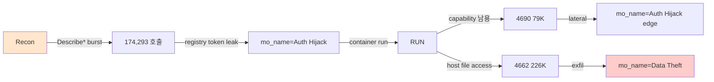

# Week 08: 중간고사 - Docker 보안 강화

## 학습 목표

## 실습 환경 (공통)

| 서버 | IP | 역할 | 접속 |
|------|-----|------|------|
| bastion | 10.20.30.201 | Control Plane (Bastion) | `ssh ccc@10.20.30.201` (pw: 1) |
| secu | 10.20.30.1 | 방화벽/IPS (nftables, Suricata) | `ssh ccc@10.20.30.1` |
| web | 10.20.30.80 | 웹서버 (JuiceShop:3000, Apache:80) | `ssh ccc@10.20.30.80` |
| siem | 10.20.30.100 | SIEM (Wazuh Dashboard:443, OpenCTI:8080) | `ssh ccc@10.20.30.100` |

**Bastion API:** `http://localhost:9100` / Key: `ccc-api-key-2026`

## 강의 시간 배분 (3시간)

| 시간 | 내용 | 유형 |
|------|------|------|
| 0:00-0:40 | 이론 강의 (Part 1) | 강의 |
| 0:40-1:10 | 이론 심화 + 사례 분석 (Part 2) | 강의/토론 |
| 1:10-1:20 | 휴식 | - |
| 1:20-2:00 | 실습 (Part 3) | 실습 |
| 2:00-2:40 | 심화 실습 + 도구 활용 (Part 4) | 실습 |
| 2:40-2:50 | 휴식 | - |
| 2:50-3:20 | 응용 실습 + Bastion 연동 (Part 5) | 실습 |
| 3:20-3:40 | 정리 + 과제 안내 | 정리 |

---

---

## 용어 해설 (Docker/클라우드/K8s 보안 과목)

| 용어 | 영문 | 설명 | 비유 |
|------|------|------|------|
| **컨테이너** | Container | 앱과 의존성을 격리하여 실행하는 경량 가상화 | 이삿짐 컨테이너 (어디서든 동일하게 열 수 있음) |
| **이미지** | Image (Docker) | 컨테이너를 만들기 위한 읽기 전용 템플릿 | 붕어빵 틀 |
| **Dockerfile** | Dockerfile | 이미지를 빌드하는 레시피 파일 | 요리 레시피 |
| **레지스트리** | Registry | 이미지를 저장·배포하는 저장소 (Docker Hub 등) | 앱 스토어 |
| **레이어** | Layer (Image) | 이미지의 각 빌드 단계 (캐싱 단위) | 레고 블록 한 층 |
| **볼륨** | Volume | 컨테이너 데이터를 영구 저장하는 공간 | 외장 하드 |
| **네임스페이스** | Namespace (Linux) | 프로세스를 격리하는 커널 기능 (PID, NET, MNT 등) | 칸막이 (같은 건물, 서로 안 보임) |
| **cgroup** | Control Group | 프로세스의 CPU/메모리 사용량을 제한하는 커널 기능 | 전기/수도 사용량 제한 |
| **오케스트레이션** | Orchestration | 다수의 컨테이너를 관리·조율하는 것 (K8s) | 오케스트라 지휘 |
| **Pod** | Pod (K8s) | K8s의 최소 배포 단위 (1개 이상의 컨테이너) | 같은 방에 사는 룸메이트들 |
| **RBAC** | Role-Based Access Control | 역할 기반 접근 제어 (K8s) | 직책별 출입 권한 |
| **PSP/PSA** | Pod Security Policy/Admission | Pod의 보안 설정을 강제하는 정책 | 건물 입주 조건 |
| **NetworkPolicy** | NetworkPolicy (K8s) | Pod 간 네트워크 통신 규칙 | 부서 간 출입 통제 |
| **Trivy** | Trivy | 컨테이너 이미지 취약점 스캐너 (Aqua) | X-ray 검사기 |
| **IaC** | Infrastructure as Code | 인프라를 코드로 정의·관리 (Terraform 등) | 건축 설계도 (코드 = 설계도) |
| **IAM** | Identity and Access Management | 클라우드 사용자/권한 관리 (AWS IAM 등) | 회사 사원증 + 권한 관리 시스템 |
| **CIS 벤치마크** | CIS Benchmark | 보안 설정 모범 사례 가이드 (Center for Internet Security) | 보안 설정 모범답안 |

---

## 시험 개요

| 항목 | 내용 |
|------|------|
| 유형 | 실기 시험 (실습 환경에서 직접 수행) |
| 시간 | 90분 |
| 배점 | 100점 |
| 환경 | web 서버 (10.20.30.80) |
| 제출 | 보안 강화 결과 + 보고서 |

---

## 시험 범위

- Week 02: Docker 기초 + 보안 (이미지, 컨테이너, Dockerfile)
- Week 03: 이미지 보안 (Trivy 스캐닝, 베이스 이미지)
- Week 04: 런타임 보안 (capability, seccomp, 컨테이너 탈출)
- Week 05: 네트워크 보안 (격리, 포트 노출)
- Week 06: Docker Compose 보안 (secrets, 리소스 제한)
- Week 07: Docker Bench, CIS Benchmark

---

## 과제: 취약한 Docker 환경 보안 강화

### 상황 설명

아래의 취약한 `docker-compose.yaml`이 프로덕션에 배포되어 있다.
보안 점검을 수행하고, 발견된 모든 문제를 수정하라.

### 취약한 Compose 파일

```yaml
# /tmp/midterm/docker-compose.yaml (취약한 버전)
version: "3.9"
services:
  web:
    image: nginx:latest
    ports:
      - "80:80"
    volumes:
      - /var/run/docker.sock:/var/run/docker.sock
    environment:
      - ADMIN_TOKEN=super-secret-token-12345

  api:
    image: python:3.11
    command: python app.py
    ports:
      - "5000:5000"
      - "22:22"
    privileged: true
    environment:
      - DB_PASSWORD=password123
      - API_SECRET=my-api-secret

  db:
    image: mysql:8
    ports:
      - "3306:3306"
    environment:
      - MYSQL_ROOT_PASSWORD=root123
    volumes:
      - /:/host-root
```

---

## 문제 1: 취약점 식별 (30점)

위 Compose 파일에서 보안 취약점을 모두 찾아 나열하라.
각 취약점에 대해 (1) 무엇이 문제인지, (2) 왜 위험한지 설명하라.

### 예상 답안 항목

| # | 취약점 | 위험도 | 설명 |
|---|--------|--------|------|
| 1 | Docker 소켓 마운트 | CRITICAL | 호스트 전체 제어 가능 |
| 2 | 환경변수 시크릿 | HIGH | inspect로 노출 |
| 3 | --privileged | CRITICAL | 모든 보안 해제 |
| 4 | SSH 포트 노출 | HIGH | 불필요한 공격 표면 |
| 5 | DB 포트 외부 노출 | HIGH | 직접 DB 접근 가능 |
| 6 | 호스트 루트 마운트 | CRITICAL | 호스트 파일시스템 전체 노출 |
| 7 | root 실행 | MEDIUM | 권한 상승 위험 |
| 8 | full 이미지 사용 | LOW | 불필요한 패키지 포함 |
| 9 | cap_drop 미설정 | MEDIUM | 불필요한 권한 보유 |
| 10 | healthcheck 없음 | LOW | 장애 감지 불가 |

---

## 문제 2: 보안 강화 (40점)

취약한 Compose 파일을 보안 모범 사례에 맞게 수정하라.

### 수정 요구사항

1. Docker 소켓 마운트 제거
2. 환경변수 시크릿을 Docker Secrets로 교체
3. --privileged 제거, cap_drop ALL + 필요 capability만 추가
4. 불필요한 포트 제거, 필요 포트는 127.0.0.1 바인딩
5. 호스트 루트 마운트 제거, 명명된 볼륨 사용
6. 네트워크 분리 (frontend/backend)
7. 리소스 제한 설정
8. healthcheck 추가
9. read_only + no-new-privileges 적용
10. slim/alpine 이미지 사용

### 제출할 파일

> **실습 목적**: Week 02~07에서 학습한 Docker 보안 기술을 종합하여 취약한 환경을 실전 수준으로 강화하기 위해 수행한다
>
> **배우는 것**: 취약한 Compose 파일에서 Docker 소켓 마운트, 환경변수 시크릿, --privileged 등 10가지 취약점을 식별하고 수정하는 능력을 기른다
>
> **결과 해석**: Trivy 스캔의 CRITICAL 수가 0이면 이미지 안전, Docker Bench의 WARN 감소가 개선 효과를 보여준다
>
> **실전 활용**: 보안 감사 대응, 프로덕션 환경 하드닝, Docker 보안 점검 보고서 작성에 직접 활용한다

```bash
# 디렉토리 구조
/tmp/midterm/
  docker-compose.yaml       # 수정된 Compose 파일
  secrets/
    db_password.txt          # DB 비밀번호
    api_secret.txt           # API 시크릿
    admin_token.txt          # 관리자 토큰
  report.md                  # 보안 점검 보고서
```

---

## 문제 3: 이미지 스캔 + 보고서 (30점)

### 3-1. Trivy 스캔 (15점)

```bash
# 사용되는 이미지의 취약점 스캔
trivy image nginx:latest --severity HIGH,CRITICAL
trivy image python:3.11 --severity HIGH,CRITICAL
trivy image mysql:8 --severity HIGH,CRITICAL

# 결과를 JSON으로 저장
trivy image -f json -o /tmp/midterm/scan-nginx.json nginx:latest
trivy image -f json -o /tmp/midterm/scan-python.json python:3.11
trivy image -f json -o /tmp/midterm/scan-mysql.json mysql:8
```

### 3-2. 보고서 작성 (15점)

보고서에 포함할 내용:

```markdown
# Docker 보안 점검 보고서

## 1. 점검 개요
- 점검 일시: YYYY-MM-DD
- 점검 대상: [서비스 목록]
- 점검 도구: Docker Bench, Trivy

## 2. 발견 사항

> **이 실습을 왜 하는가?**
> "중간고사 - Docker 보안 강화" — 이 주차의 핵심 기술을 실제 서버 환경에서 직접 실행하여 체험한다.
> Docker/클라우드/K8s 보안 분야에서 이 기술은 실무의 핵심이며, 실습을 통해
> 명령어의 의미, 결과 해석 방법, 보안 관점에서의 판단 기준을 익힌다.
>
> **이걸 하면 무엇을 알 수 있는가?**
> - 이 기술이 실제 시스템에서 어떻게 동작하는지 직접 확인
> - 정상과 비정상 결과를 구분하는 눈을 기름
> - 실무에서 바로 활용할 수 있는 명령어와 절차를 체득
>
> **주의:** 모든 실습은 허가된 실습 환경(10.20.30.0/24)에서만 수행한다.

### 2.1 Compose 설정 취약점
- [취약점 목록과 심각도]

### 2.2 이미지 취약점
- nginx: CRITICAL X건, HIGH X건
- python: CRITICAL X건, HIGH X건
- mysql: CRITICAL X건, HIGH X건

## 3. 개선 조치
- [각 취약점에 대한 수정 내용]

## 4. 개선 전후 비교
- Docker Bench 점수: 개선 전 → 개선 후
```

---

## 채점 기준

| 항목 | 배점 | 기준 |
|------|------|------|
| 취약점 식별 | 30 | 10개 항목 x 3점 |
| Compose 수정 | 40 | 10개 요구사항 x 4점 |
| Trivy 스캔 | 15 | 3개 이미지 스캔 + 결과 분석 |
| 보고서 | 15 | 형식, 분석 깊이, 개선 전후 비교 |

---

## 참고: 모범 답안 구조 (Compose)

```yaml
version: "3.9"
services:
  web:
    image: nginx:1.25-alpine
    read_only: true
    tmpfs: [/tmp, /var/cache/nginx, /var/run]
    cap_drop: [ALL]
    cap_add: [NET_BIND_SERVICE]
    security_opt: ["no-new-privileges:true"]
    ports: ["127.0.0.1:80:80"]
    networks: [frontend]
    deploy:
      resources:
        limits: { cpus: "0.5", memory: 128M }
    healthcheck:
      test: ["CMD", "wget", "-q", "--spider", "http://localhost/"]
      interval: 30s
      timeout: 5s
      retries: 3

  api:
    image: python:3.11-slim
    read_only: true
    tmpfs: [/tmp]
    cap_drop: [ALL]
    security_opt: ["no-new-privileges:true"]
    networks: [frontend, backend]
    secrets: [db_password, api_secret, admin_token]
    deploy:
      resources:
        limits: { cpus: "1.0", memory: 512M }

  db:
    image: mysql:8-oracle
    cap_drop: [ALL]
    cap_add: [CHOWN, SETUID, SETGID, DAC_OVERRIDE]
    security_opt: ["no-new-privileges:true"]
    networks: [backend]
    volumes: [db-data:/var/lib/mysql]
    secrets: [db_password]
    deploy:
      resources:
        limits: { cpus: "1.0", memory: 1G }
    healthcheck:
      test: ["CMD", "mysqladmin", "ping", "-h", "localhost"]
      interval: 10s
      timeout: 5s
      retries: 5

networks:
  frontend:
  backend:
    internal: true

volumes:
  db-data:

secrets:
  db_password:
    file: ./secrets/db_password.txt
  api_secret:
    file: ./secrets/api_secret.txt
  admin_token:
    file: ./secrets/admin_token.txt
```

---

## 시험 후 안내

- 다음 주부터 클라우드 보안(AWS/Azure 개념)으로 진입한다
- Docker 보안은 클라우드 보안의 기반이 된다
- 중간고사 피드백은 Week 09에 제공한다

---

---

## 심화: 컨테이너/클라우드 보안 보충

### Docker 보안 핵심 개념 상세

#### 컨테이너 격리의 원리

```
호스트 OS 커널
├── Namespace (격리)
│   ├── PID namespace  → 컨테이너마다 독립 프로세스 번호
│   ├── NET namespace  → 컨테이너마다 독립 네트워크 스택
│   ├── MNT namespace  → 컨테이너마다 독립 파일시스템
│   ├── UTS namespace  → 컨테이너마다 독립 hostname
│   └── USER namespace → 컨테이너 내 root ≠ 호스트 root (설정 시)
│
├── cgroup (자원 제한)
│   ├── CPU:    --cpus=2          → 최대 2코어
│   ├── Memory: --memory=512m     → 최대 512MB
│   └── IO:     --blkio-weight=500
│
└── Overlay FS (레이어 파일시스템)
    ├── 읽기 전용 레이어 (이미지)
    └── 읽기/쓰기 레이어 (컨테이너)
```

> **왜 컨테이너가 VM보다 가벼운가?**
> VM: 각각 전체 OS 커널을 포함 (수 GB)
> 컨테이너: 호스트 커널을 공유, 격리만 namespace로 (수 MB)
> 대신 격리 수준은 VM이 더 강하다 (커널 취약점 시 컨테이너 탈출 가능)

#### Dockerfile 보안 체크리스트

```dockerfile
# 나쁜 예
FROM ubuntu:latest          # ❌ latest 태그 (재현 불가)
RUN apt-get update && apt-get install -y curl vim  # ❌ 불필요 패키지
COPY . /app                 # ❌ 전체 복사 (.env 포함 가능)
RUN chmod 777 /app          # ❌ 과도한 권한
USER root                   # ❌ root 실행
EXPOSE 22                   # ❌ SSH 포트 (컨테이너에서 불필요)

# 좋은 예
FROM ubuntu:22.04@sha256:abc123...  # ✅ 특정 버전 + digest 고정
RUN apt-get update && apt-get install -y --no-install-recommends curl \
    && rm -rf /var/lib/apt/lists/*  # ✅ 최소 패키지 + 캐시 삭제
COPY --chown=appuser:appuser app/ /app  # ✅ 필요한 것만 + 소유자 지정
RUN chmod 550 /app          # ✅ 최소 권한
USER appuser                # ✅ 비root 사용자
HEALTHCHECK CMD curl -f http://localhost:8080 || exit 1  # ✅ 헬스체크
```

### 실습: Docker 보안 점검 (실습 인프라)

```bash
# web 서버의 Docker 상태 확인
ssh ccc@10.20.30.80 "
  echo '=== Docker 버전 ===' && docker --version 2>/dev/null || echo 'Docker 미설치'
  echo '=== 실행 중 컨테이너 ===' && docker ps 2>/dev/null || echo '접근 불가'
  echo '=== Docker 소켓 권한 ===' && ls -la /var/run/docker.sock 2>/dev/null
" 2>/dev/null

# siem 서버의 Docker 상태 (OpenCTI가 Docker로 실행)
ssh ccc@10.20.30.100 "
  echo '=== Docker 컨테이너 ===' && sudo docker ps --format 'table {{.Names}}\t{{.Image}}\t{{.Status}}' 2>/dev/null
  echo '=== Docker 네트워크 ===' && sudo docker network ls 2>/dev/null
" 2>/dev/null
```

### CIS Docker Benchmark 핵심 항목

| # | 항목 | 점검 명령 | 기대 결과 |
|---|------|---------|---------|
| 2.1 | Docker daemon 설정 | `cat /etc/docker/daemon.json` | userns-remap 설정 |
| 4.1 | 비root 사용자 | `docker inspect --format '{{.Config.User}}' <컨테이너>` | root가 아닌 사용자 |
| 4.6 | HEALTHCHECK | `docker inspect --format '{{.Config.Healthcheck}}' <컨테이너>` | 헬스체크 설정됨 |
| 5.2 | network_mode | `docker inspect --format '{{.HostConfig.NetworkMode}}' <컨테이너>` | host가 아닌 것 |
| 5.12 | --privileged | `docker inspect --format '{{.HostConfig.Privileged}}' <컨테이너>` | false |

---

> **실습 환경 검증 완료** (2026-03-28): Docker 29.3.0, Compose v5.1.1, juice-shop(User=65532,Privileged=false), OpenCTI 6컨테이너, opencti_default 네트워크

---

## 📂 실습 참조 파일 가이드

> 이번 주 실습에서 **실제로 조작하는** 솔루션의 기능·경로·파일·설정·UI 요점입니다.

### Docker Engine
> **역할:** 컨테이너 런타임·이미지 관리  
> **실행 위치:** `모든 VM(공통)`  
> **접속/호출:** `docker` CLI, `systemctl status docker`

**주요 경로·파일**

| 경로 | 역할 |
|------|------|
| `/var/lib/docker/` | 이미지·컨테이너 저장소(overlay2) |
| `/etc/docker/daemon.json` | 데몬 설정 (log-driver, userns-remap 등) |
| `/var/run/docker.sock` | Docker API 소켓 — 루트권한 등가 |

**핵심 설정·키**

- `{"userns-remap": "default"}` — 컨테이너 root↔호스트 비루트 매핑
- `{"icc": false}` — 기본 네트워크 내 컨테이너 간 통신 차단
- `{"no-new-privileges": true}` — setuid 권한 상승 차단

**로그·확인 명령**

- `journalctl -u docker` — 데몬 로그
- ``docker logs <c>`` — 컨테이너 stdout/stderr

**UI / CLI 요점**

- `docker inspect <c> | jq '.[0].HostConfig.Privileged'` — `--privileged` 여부
- `docker exec -it <c> sh` — 컨테이너 내부 진입
- `docker system df` — 이미지/볼륨 디스크 사용량

> **해석 팁.** `/var/run/docker.sock`을 컨테이너에 마운트하는 순간 **호스트 루트와 동등**이다. 점검 1순위.

### Docker Bench for Security
> **역할:** CIS Docker Benchmark 자동 점검 스크립트  
> **실행 위치:** `Docker 호스트`  
> **접속/호출:** `docker run --rm --net host --pid host --userns host --cap-add audit_control ... docker/docker-bench-security`

**주요 경로·파일**

| 경로 | 역할 |
|------|------|
| `docker-bench-security.log` | 점검 결과 텍스트 |
| `docker-bench-security.sh` | 실행 스크립트 |

**핵심 설정·키**

- `--no-colors` — CI 친화 출력
- `-c check_4` — 특정 섹션만 실행

**로그·확인 명령**

- `결과 [PASS]/[WARN]/[INFO]` — 항목별 상태

**UI / CLI 요점**

- `docker-bench` 섹션 2.14 — live restore 활성 여부
- 섹션 4 — 컨테이너 이미지/빌드 보안

> **해석 팁.** `[INFO]`는 자동 판단 불가 — 수동 확인 필수. 매 릴리즈 CIS 버전과 Docker 버전 매핑을 맞추자.

### Trivy
> **역할:** 이미지·파일시스템·IaC·K8s CVE/미스컨피그 스캐너  
> **실행 위치:** `임의 호스트 / CI`  
> **접속/호출:** `trivy image ` / `trivy fs .` / `trivy config .`

**주요 경로·파일**

| 경로 | 역할 |
|------|------|
| `~/.cache/trivy/` | 취약점 DB 캐시 |
| `.trivyignore` | 무시할 CVE ID 목록 |

**핵심 설정·키**

- `--severity HIGH,CRITICAL` — 심각도 필터
- `--ignore-unfixed` — 수정본 없는 CVE 제외
- `--format sarif` — CI용 SARIF 출력

**UI / CLI 요점**

- `trivy image --exit-code 1 --severity HIGH,CRITICAL ` — CI 게이트
- `trivy k8s --report summary cluster` — 클러스터 전체 요약

> **해석 팁.** `--ignore-unfixed`는 잡음을 크게 줄이지만 **미래 위험**을 숨긴다. 이미지 재빌드 주기와 함께 운영 기준을 정하자.

---

## 실제 사례 (WitFoo Precinct 6 — 중간고사 채점 reference)

> 출처: WitFoo Precinct 6 Cybersecurity Dataset (Apache 2.0)
> 본 lecture *중간고사: Docker 보안 강화 통합* 학습 항목 매칭.

### 만점 답안 reference — Docker 침해 단일 incident 분해



| 평가 항목 | dataset 매핑 | 만점 기준 |
|--------|----------|---------|
| Recon 식별 | Describe* 174K 중 burst | 단일 IAM 의 시간 패턴 추출 |
| Image 결함 | DescribeImage manifest | secret 검색 + scan 결과 |
| Runtime 위반 | 4690 + 4662 ratio | privileged/cap 매핑 |
| Network 차단 | 5156 ICC + firewall_action | block:allow 비율 |
| Audit 추적 | security_audit_event 381K | 시간순 정렬 + actor 묶기 |

**채점 함의**: 각 단계마다 *dataset 의 정량 신호로 evidence chain* 을 갖춘 답안 = 만점. *추측이나 일반 이론* 만 적은 답안 = 부분점만.

### Case 1: Auth Hijack edge — image leak → container takeover

| 항목 | 값 |
|---|---|
| edge type | `Auth Hijack` |
| 학습 매핑 | image secret leak 시점부터 컨테이너 장악까지 |
| 시험 출제 의도 | 학생이 *이미지 단계* 결함을 *런타임 신호* 로 연결 가능한지 |

**해석**: lecture w03 + w04 통합 — image scan 누락 + privileged run 의 결합이 만든 가장 흔한 Docker 침해 시나리오.

### Case 2: 통합 신호량 prefix sum

| 신호 | dataset 양 | 시험 활용 |
|---|---|---|
| security_audit_event | 381,552 | timeline 작성 |
| 4662 | 226,215 | host 자원 노출 |
| 5156 | 176,060 | egress / ICC |
| 4658 | 158,374 | handle 회수 |
| firewall_action | 118,151 | block 정책 |

**해석**: 시험 답안에 5개 신호 모두에 evidence 가 있어야 만점. 1~2개만 인용 = 부분점.

**학생 액션**: 자신이 분석한 Docker 침해 사례 1건을 위 5축 표로 다시 정리, 각 축마다 인용 가능한 dataset row id 또는 incident_id 제시.

