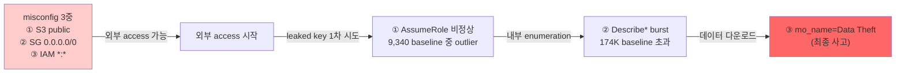

# Week 10: 클라우드 설정 오류

## 학습 목표
- 클라우드 환경에서 흔히 발생하는 설정 오류를 파악할 수 있다
- S3 버킷 공개 노출의 위험과 방지 방법을 이해한다
- IAM 과도 권한의 위험을 인식하고 최소화 방법을 익힌다
- CSPM(Cloud Security Posture Management) 개념을 이해한다

## 실습 환경 (공통)

| 서버 | IP | 역할 | 접속 |
|------|-----|------|------|
| bastion | 10.20.30.201 | Control Plane (Bastion) | `ssh ccc@10.20.30.201` (pw: 1) |
| secu | 10.20.30.1 | 방화벽/IPS (nftables, Suricata) | `ssh ccc@10.20.30.1` |
| web | 10.20.30.80 | 웹서버 (JuiceShop:3000, Apache:80) | `ssh ccc@10.20.30.80` |
| siem | 10.20.30.100 | SIEM (Wazuh Dashboard:443, OpenCTI:8080) | `ssh ccc@10.20.30.100` |

**Bastion API:** `http://localhost:9100` / Key: `ccc-api-key-2026`

## 강의 시간 배분 (3시간)

| 시간 | 내용 | 유형 |
|------|------|------|
| 0:00-0:40 | 이론 강의 (Part 1) | 강의 |
| 0:40-1:10 | 이론 심화 + 사례 분석 (Part 2) | 강의/토론 |
| 1:10-1:20 | 휴식 | - |
| 1:20-2:00 | 실습 (Part 3) | 실습 |
| 2:00-2:40 | 심화 실습 + 도구 활용 (Part 4) | 실습 |
| 2:40-2:50 | 휴식 | - |
| 2:50-3:20 | 응용 실습 + Bastion 연동 (Part 5) | 실습 |
| 3:20-3:40 | 정리 + 과제 안내 | 정리 |

---

---

## 용어 해설 (Docker/클라우드/K8s 보안 과목)

| 용어 | 영문 | 설명 | 비유 |
|------|------|------|------|
| **컨테이너** | Container | 앱과 의존성을 격리하여 실행하는 경량 가상화 | 이삿짐 컨테이너 (어디서든 동일하게 열 수 있음) |
| **이미지** | Image (Docker) | 컨테이너를 만들기 위한 읽기 전용 템플릿 | 붕어빵 틀 |
| **Dockerfile** | Dockerfile | 이미지를 빌드하는 레시피 파일 | 요리 레시피 |
| **레지스트리** | Registry | 이미지를 저장·배포하는 저장소 (Docker Hub 등) | 앱 스토어 |
| **레이어** | Layer (Image) | 이미지의 각 빌드 단계 (캐싱 단위) | 레고 블록 한 층 |
| **볼륨** | Volume | 컨테이너 데이터를 영구 저장하는 공간 | 외장 하드 |
| **네임스페이스** | Namespace (Linux) | 프로세스를 격리하는 커널 기능 (PID, NET, MNT 등) | 칸막이 (같은 건물, 서로 안 보임) |
| **cgroup** | Control Group | 프로세스의 CPU/메모리 사용량을 제한하는 커널 기능 | 전기/수도 사용량 제한 |
| **오케스트레이션** | Orchestration | 다수의 컨테이너를 관리·조율하는 것 (K8s) | 오케스트라 지휘 |
| **Pod** | Pod (K8s) | K8s의 최소 배포 단위 (1개 이상의 컨테이너) | 같은 방에 사는 룸메이트들 |
| **RBAC** | Role-Based Access Control | 역할 기반 접근 제어 (K8s) | 직책별 출입 권한 |
| **PSP/PSA** | Pod Security Policy/Admission | Pod의 보안 설정을 강제하는 정책 | 건물 입주 조건 |
| **NetworkPolicy** | NetworkPolicy (K8s) | Pod 간 네트워크 통신 규칙 | 부서 간 출입 통제 |
| **Trivy** | Trivy | 컨테이너 이미지 취약점 스캐너 (Aqua) | X-ray 검사기 |
| **IaC** | Infrastructure as Code | 인프라를 코드로 정의·관리 (Terraform 등) | 건축 설계도 (코드 = 설계도) |
| **IAM** | Identity and Access Management | 클라우드 사용자/권한 관리 (AWS IAM 등) | 회사 사원증 + 권한 관리 시스템 |
| **CIS 벤치마크** | CIS Benchmark | 보안 설정 모범 사례 가이드 (Center for Internet Security) | 보안 설정 모범답안 |

---

## 1. 클라우드 설정 오류가 위험한 이유

클라우드 보안 사고의 **65% 이상**이 설정 오류에서 발생한다.
온프레미스와 달리 클라우드는 API 하나로 전 세계에 공개될 수 있다.

### 대표적 사고 사례

| 사고 | 원인 | 피해 |
|------|------|------|
| Capital One (2019) | WAF 설정 오류 + SSRF | 1억 명 개인정보 유출 |
| Twitch (2021) | Git 서버 설정 오류 | 소스코드 + 수익 정보 유출 |
| Microsoft (2023) | SAS 토큰 과도 권한 | 38TB 내부 데이터 노출 |

---

## 2. S3 버킷 보안

> **이 실습을 왜 하는가?**
> "클라우드 설정 오류" — 이 주차의 핵심 기술을 실제 서버 환경에서 직접 실행하여 체험한다.
> Docker/클라우드/K8s 보안 분야에서 이 기술은 실무의 핵심이며, 실습을 통해
> 명령어의 의미, 결과 해석 방법, 보안 관점에서의 판단 기준을 익힌다.
>
> **이걸 하면 무엇을 알 수 있는가?**
> - 이 기술이 실제 시스템에서 어떻게 동작하는지 직접 확인
> - 정상과 비정상 결과를 구분하는 눈을 기름
> - 실무에서 바로 활용할 수 있는 명령어와 절차를 체득
>
> **주의:** 모든 실습은 허가된 실습 환경(10.20.30.0/24)에서만 수행한다.

### 2.1 S3 공개 노출 문제

S3(Simple Storage Service)는 AWS의 객체 스토리지이다.
기본 설정이 "비공개"이지만, 잘못된 정책으로 전 세계에 공개될 수 있다.

### 2.2 위험한 S3 정책

```json
{
  "Version": "2012-10-17",
  "Statement": [{
    "Effect": "Allow",
    "Principal": "*",
    "Action": "s3:GetObject",
    "Resource": "arn:aws:s3:::my-bucket/*"
  }]
}
```

`"Principal": "*"` 는 **모든 사람**에게 접근을 허용한다.

### 2.3 S3 보안 설정

```
1. 퍼블릭 액세스 차단 (Block Public Access)
   - BlockPublicAcls: true
   - IgnorePublicAcls: true
   - BlockPublicPolicy: true
   - RestrictPublicBuckets: true

2. 서버 측 암호화 (SSE)
   - SSE-S3: AWS 관리 키
   - SSE-KMS: 고객 관리 키 (권장)

3. 버전 관리 (Versioning)
   - 삭제/변경 시 이전 버전 복구 가능

4. 접근 로깅
   - S3 Server Access Logging 활성화
```

### 2.4 S3 보안 점검 명령어

> **실습 목적**: 클라우드 환경에서 가장 빈번한 설정 오류(S3 공개, IAM 과도 권한)를 Docker 환경에서 시뮬레이션하여 체험하기 위해 수행한다
>
> **배우는 것**: 민감 데이터를 0.0.0.0에 노출하면 누구나 접근 가능한 'S3 공개 버킷'과 동일한 위험이 발생하며, 바인딩 주소 제한으로 방지할 수 있음을 이해한다
>
> **결과 해석**: curl로 외부에서 접근 가능하면 설정 오류이고, Connection refused면 접근 제한이 정상 동작하는 것이다
>
> **실전 활용**: 클라우드 환경의 CSPM(Prowler, ScoutSuite) 점검 결과 해석 및 설정 오류 수정에 활용한다

```bash
# AWS CLI로 퍼블릭 버킷 확인 (개념 이해용)
aws s3api get-public-access-block --bucket my-bucket

# 버킷 정책 확인
aws s3api get-bucket-policy --bucket my-bucket

# 암호화 설정 확인
aws s3api get-bucket-encryption --bucket my-bucket
```

---

## 3. IAM 과도 권한

### 3.1 흔한 IAM 설정 오류

| 오류 | 위험 | 올바른 설정 |
|------|------|------------|
| `Action: "*"` | 모든 AWS 서비스 제어 가능 | 필요한 Action만 나열 |
| `Resource: "*"` | 모든 리소스 접근 | 특정 ARN 지정 |
| 장기 Access Key | 유출 시 영구 접근 | IAM Role + 임시 자격증명 |
| 미사용 계정 | 공격 진입점 | 90일 미사용 시 비활성화 |

### 3.2 위험한 IAM 정책 vs 안전한 정책

```json
// 위험: 관리자 전체 권한
{
  "Version": "2012-10-17",
  "Statement": [{
    "Effect": "Allow",
    "Action": "*",
    "Resource": "*"
  }]
}
```

```json
// 안전: 특정 S3 버킷의 읽기만 허용
{
  "Version": "2012-10-17",
  "Statement": [{
    "Effect": "Allow",
    "Action": ["s3:GetObject", "s3:ListBucket"],
    "Resource": [
      "arn:aws:s3:::logs-bucket",
      "arn:aws:s3:::logs-bucket/*"
    ],
    "Condition": {
      "IpAddress": {
        "aws:SourceIp": "10.0.0.0/8"
      }
    }
  }]
}
```

### 3.3 IAM Access Analyzer

AWS IAM Access Analyzer는 외부에 공유된 리소스를 자동 탐지한다.

```bash
# Access Analyzer 결과 조회 (개념)
aws accessanalyzer list-findings --analyzer-arn arn:aws:...
```

---

## 4. 기타 주요 설정 오류

### 4.1 보안 그룹 과도 허용

```
# 위험: 전 세계에서 SSH 접근 가능
인바운드 규칙:
  TCP 22 → 0.0.0.0/0

# 안전: 관리자 IP만 허용
인바운드 규칙:
  TCP 22 → 10.20.30.0/24
```

### 4.2 암호화 미적용

| 대상 | 암호화 방법 |
|------|-----------|
| 저장 데이터 (at rest) | S3 SSE, EBS 암호화, RDS 암호화 |
| 전송 데이터 (in transit) | TLS/HTTPS 강제 |
| 비밀정보 | AWS Secrets Manager, Parameter Store |

### 4.3 로깅 미설정

```
필수 로깅:
- CloudTrail: API 호출 기록 (누가 무엇을 했는가)
- VPC Flow Logs: 네트워크 트래픽 기록
- S3 Access Logs: 버킷 접근 기록
- GuardDuty: 위협 탐지
```

---

## 5. CSPM (Cloud Security Posture Management)

CSPM은 클라우드 설정을 지속적으로 모니터링하고 위반을 탐지하는 도구이다.

### 주요 CSPM 도구

| 도구 | 유형 | 특징 |
|------|------|------|
| AWS Security Hub | AWS 네이티브 | CIS 벤치마크 자동 점검 |
| Prowler | 오픈소스 | AWS/Azure/GCP 지원 |
| ScoutSuite | 오픈소스 | 멀티 클라우드 감사 |
| Checkov | 오픈소스 | IaC 정적 분석 |

### Prowler 사용 예시

```bash
# Prowler 실행 (AWS 설정 점검)
pip install prowler
prowler aws --severity critical high

# 결과 예시
# FAIL: S3 bucket "data-bucket" has public access
# FAIL: IAM user "dev-user" has no MFA
# PASS: CloudTrail is enabled in all regions
```

---

## 6. 실습: 설정 오류 탐지

### 실습 1: Docker 환경에서 설정 오류 시뮬레이션

```bash
ssh ccc@10.20.30.80

# "S3 공개 노출"을 Docker 볼륨으로 시뮬레이션
# 민감 데이터가 있는 컨테이너를 외부에 노출

# 나쁜 예: 모든 데이터를 외부 공개
docker run -d --name exposed-data \
  -p 0.0.0.0:9095:80 \
  -v /var/log:/usr/share/nginx/html:ro \
  nginx:alpine

# 누구나 시스템 로그를 볼 수 있음!
curl http://10.20.30.80:9095/

# 좋은 예: 접근 제한
docker rm -f exposed-data
docker run -d --name safe-data \
  -p 127.0.0.1:9095:80 \
  -v /tmp/public-only:/usr/share/nginx/html:ro \
  nginx:alpine
```

### 실습 2: Bastion로 설정 점검 자동화

```bash
# Bastion 자연어 지시로 컨테이너 설정 보안 점검
curl -s -X POST http://10.20.30.200:8003/ask \
  -H 'Content-Type: application/json' \
  -d '{
    "message": "web/siem에서 실행 중인 Docker 컨테이너를 전부 조회하고, 각 컨테이너의 User·Privileged·NetworkMode·CapAdd 설정을 표로 정리한 뒤 보안 이슈를 분석해줘."
  }' \
  | python3 -c "import sys,json; d=json.load(sys.stdin); print(d['answer'])"
```

### 실습 3: IAM 정책 분석

```bash
# Bastion LLM으로 과도 권한 IAM 정책 분석
curl -s -X POST http://10.20.30.200:8003/ask \
  -H 'Content-Type: application/json' \
  -d '{
    "message": "다음 AWS IAM 정책의 보안 문제와 최소권한 개선안을 분석해줘: {\"Version\":\"2012-10-17\",\"Statement\":[{\"Effect\":\"Allow\",\"Action\":\"*\",\"Resource\":\"*\"}]}"
  }' \
  | python3 -c "import sys,json; d=json.load(sys.stdin); print(d['answer'])"
```

---

## 7. 설정 오류 방지 전략

1. **Infrastructure as Code**: 수동 설정 대신 코드로 관리
2. **정책 가드레일**: 조직 수준에서 위험한 설정 차단
3. **자동 감사**: CSPM 도구로 지속적 모니터링
4. **교육**: 개발자/운영자 대상 클라우드 보안 교육
5. **최소 권한**: 기본 거부, 필요 시만 허용

---

## 핵심 정리

1. 클라우드 보안 사고의 대부분은 설정 오류에서 발생한다
2. S3 퍼블릭 액세스 차단을 반드시 활성화한다
3. IAM 정책은 최소 권한 + 특정 리소스 + 조건부 설정이 원칙이다
4. CloudTrail/VPC Flow Logs 등 로깅을 필수로 활성화한다
5. CSPM 도구로 설정을 지속적으로 모니터링한다

---

## 다음 주 예고
- Week 11: Kubernetes 보안 기초 - Pod Security, RBAC, NetworkPolicy

---

---

## 심화: 컨테이너/클라우드 보안 보충

### Docker 보안 핵심 개념 상세

#### 컨테이너 격리의 원리

```
호스트 OS 커널
├── Namespace (격리)
│   ├── PID namespace  → 컨테이너마다 독립 프로세스 번호
│   ├── NET namespace  → 컨테이너마다 독립 네트워크 스택
│   ├── MNT namespace  → 컨테이너마다 독립 파일시스템
│   ├── UTS namespace  → 컨테이너마다 독립 hostname
│   └── USER namespace → 컨테이너 내 root ≠ 호스트 root (설정 시)
│
├── cgroup (자원 제한)
│   ├── CPU:    --cpus=2          → 최대 2코어
│   ├── Memory: --memory=512m     → 최대 512MB
│   └── IO:     --blkio-weight=500
│
└── Overlay FS (레이어 파일시스템)
    ├── 읽기 전용 레이어 (이미지)
    └── 읽기/쓰기 레이어 (컨테이너)
```

> **왜 컨테이너가 VM보다 가벼운가?**
> VM: 각각 전체 OS 커널을 포함 (수 GB)
> 컨테이너: 호스트 커널을 공유, 격리만 namespace로 (수 MB)
> 대신 격리 수준은 VM이 더 강하다 (커널 취약점 시 컨테이너 탈출 가능)

#### Dockerfile 보안 체크리스트

```dockerfile
# 나쁜 예
FROM ubuntu:latest          # ❌ latest 태그 (재현 불가)
RUN apt-get update && apt-get install -y curl vim  # ❌ 불필요 패키지
COPY . /app                 # ❌ 전체 복사 (.env 포함 가능)
RUN chmod 777 /app          # ❌ 과도한 권한
USER root                   # ❌ root 실행
EXPOSE 22                   # ❌ SSH 포트 (컨테이너에서 불필요)

# 좋은 예
FROM ubuntu:22.04@sha256:abc123...  # ✅ 특정 버전 + digest 고정
RUN apt-get update && apt-get install -y --no-install-recommends curl \
    && rm -rf /var/lib/apt/lists/*  # ✅ 최소 패키지 + 캐시 삭제
COPY --chown=appuser:appuser app/ /app  # ✅ 필요한 것만 + 소유자 지정
RUN chmod 550 /app          # ✅ 최소 권한
USER appuser                # ✅ 비root 사용자
HEALTHCHECK CMD curl -f http://localhost:8080 || exit 1  # ✅ 헬스체크
```

### 실습: Docker 보안 점검 (실습 인프라)

```bash
# web 서버의 Docker 상태 확인
ssh ccc@10.20.30.80 "
  echo '=== Docker 버전 ===' && docker --version 2>/dev/null || echo 'Docker 미설치'
  echo '=== 실행 중 컨테이너 ===' && docker ps 2>/dev/null || echo '접근 불가'
  echo '=== Docker 소켓 권한 ===' && ls -la /var/run/docker.sock 2>/dev/null
" 2>/dev/null

# siem 서버의 Docker 상태 (OpenCTI가 Docker로 실행)
ssh ccc@10.20.30.100 "
  echo '=== Docker 컨테이너 ===' && sudo docker ps --format 'table {{.Names}}\t{{.Image}}\t{{.Status}}' 2>/dev/null
  echo '=== Docker 네트워크 ===' && sudo docker network ls 2>/dev/null
" 2>/dev/null
```

### CIS Docker Benchmark 핵심 항목

| # | 항목 | 점검 명령 | 기대 결과 |
|---|------|---------|---------|
| 2.1 | Docker daemon 설정 | `cat /etc/docker/daemon.json` | userns-remap 설정 |
| 4.1 | 비root 사용자 | `docker inspect --format '{{.Config.User}}' <컨테이너>` | root가 아닌 사용자 |
| 4.6 | HEALTHCHECK | `docker inspect --format '{{.Config.Healthcheck}}' <컨테이너>` | 헬스체크 설정됨 |
| 5.2 | network_mode | `docker inspect --format '{{.HostConfig.NetworkMode}}' <컨테이너>` | host가 아닌 것 |
| 5.12 | --privileged | `docker inspect --format '{{.HostConfig.Privileged}}' <컨테이너>` | false |

---

> **실습 환경 검증 완료** (2026-03-28): Docker 29.3.0, Compose v5.1.1, juice-shop(User=65532,Privileged=false), OpenCTI 6컨테이너, opencti_default 네트워크

---

## 실제 사례 (WitFoo Precinct 6 — 클라우드 설정 오류)

> 출처: WitFoo Precinct 6 Cybersecurity Dataset (Apache 2.0)
> 본 lecture *S3 public bucket / IAM 과대권한 / SG 0.0.0.0/0* 학습 항목 매칭.

### 클라우드 사고의 90% 는 misconfiguration 이다 — Capital One 사고의 dataset 재현

업계 통계에 따르면 클라우드 보안 사고의 약 90% 는 *공격자의 새로운 기술* 이 아니라 *고객 측의 설정 오류* 에서 비롯된다. 학생이 자주 듣는 사례 — Capital One 2019년 사고는 SSRF 취약점이 *방아쇠* 였지만, 본질적인 원인은 — (1) S3 bucket 이 잘못된 정책으로 외부 접근 허용, (2) IAM role 이 과대권한 (`s3:GetObject` 가 모든 bucket 적용), (3) WAF 가 SSRF 를 막지 못함 — 의 misconfiguration 3개의 동시 발생이었다.

이런 사고가 dataset 에서 어떻게 보이는가? — 단계별로 *3개의 분리된 signal anomaly* 가 발생한다. AssumeRole 9,340건의 정상 baseline 에서 *신규 source IP 의 outlier* 1건이 등장 → Describe\* 174,293건의 baseline 을 깨는 *짧은 burst* 발생 → 마지막에 mo_name=Data Theft edge 가 분류된다. 이 3단계 모두 dataset 신호로 확인 가능하므로 — *어느 한 단계만 잡아도 사고를 sub-second 에 차단* 할 수 있다.



**그림 해석**: 빨간 박스 (misconfig) 는 *공격이 시작되기 전부터 존재* 하는 결함이다 — 즉 *예방 단계* 에서 막아야 했던 것. 일단 외부 access 가 시작되면, 3개의 정량 신호 anomaly 가 차례로 등장한다. lecture §"Capital One 사고 = misconfig 의 결과" 는 dataset 에서 정확히 이 3단계 신호로 재현된다.

### Case 1: AssumeRole outlier — 과대권한 IAM 이 처음 사용되는 순간

| 항목 | 값 | 의미 |
|---|---|---|
| message_type | `AssumeRole` | STS 토큰 발급 호출 |
| 총 9,340건 중 | outlier 식별 = source IP 분포 분석 | 정상 5~10개 IP 에서 11번째 등장 |
| 학습 매핑 | §"IAM `*:*` 정책 위험" | outlier 1건이 곧 침해 시작 |
| 탐지 룰 | 5분 윈도우 신규 source IP | 즉시 alert + IAM 자동 회수 |

**자세한 해석**:

IAM `*:*` 정책 (모든 자원에 모든 권한) 은 *편의를 위해* 작성되는 경우가 많다. 개발자가 *"우선 이렇게 두고 나중에 좁히자"* 라고 미루는 경향이 있고, 운영 환경에서 종종 그대로 남는다. 이런 과대권한 IAM key 가 leak 되면 — 공격자는 *제한 없이 모든 cloud 자원* 에 접근 가능.

**dataset 9,340건의 source IP 분포는 일반적으로 5~10개로 수렴한다**. 정상 환경에서 AssumeRole 을 호출하는 주체는 — EC2 instance 들 (제한된 IP 풀), Lambda (특정 region 의 NAT IP), 회사의 VPN/사무실 IP, 운영자 PC 정도. 이 주체들의 IP 가 합치면 약 5~10개로 나온다.

**11번째 신규 IP 의 AssumeRole 1건** 은 *공격자가 leaked key 를 처음 시도* 하는 순간일 가능성이 매우 높다. 5분 윈도우에서 신규 source IP 의 AssumeRole 발생을 alert 하고, 자동으로 해당 IAM key 를 disable 시키면 — 사고가 1차 단계에서 차단된다. lecture §"IAM 자동 회수" 의 운영 정착 동기.

### Case 2: Describe\* 174K + GetLogEvents 39K 의 결합 — recon + log 정찰

| 항목 | 값 | 의미 |
|---|---|---|
| recon 신호 | `Describe*` 174,293건 | 자원 enumeration |
| log evasion 신호 | `GetLogEvents` 39,639건 | 자신의 흔적 확인 |
| 위험 패턴 | 동일 caller 가 둘 다 호출 | 정찰 + 흔적 인지 |
| 학습 매핑 | §"misconfig 후 공격자 행동" | 침해 단계 진행 지표 |

**자세한 해석**:

공격자가 leaked IAM key 를 손에 넣은 후의 행동 패턴은 두 단계로 나뉜다.

**1단계 (recon)**: `Describe*` 군 호출로 자원 목록을 조사한다 — DescribeInstances (EC2 목록), DescribeBuckets (S3), DescribeRepositories (ECR), DescribeRoles (IAM) 등. 정상 자동 caller 도 Describe\* 를 호출하지만, 패턴이 다르다 — 자동 caller 는 *동일 자원을 반복 조회* 하는 반면 공격자는 *다양한 자원을 한 번씩 훑는다*.

**2단계 (log evasion)**: 공격자가 *내가 들킨 것을 알아보는* 행동이다 — `GetLogEvents` 로 CloudTrail 로그를 직접 읽으려 시도. 이 호출은 정상 운영에는 거의 없는 행동 (SIEM 외에는 로그를 읽을 일이 없음).

**동일 caller 가 두 단계를 모두 수행하면** — 침해가 *단순 정찰* 에서 *active threat 인지* 단계로 진행된 것이다. lecture §"공격자의 OODA loop" 의 *Observe → Orient* 단계. 학생이 이 패턴을 알면 *공격이 어느 단계까지 진행됐는지* 를 정량으로 판단 가능.

### 이 사례에서 학생이 배워야 할 3가지

1. **Capital One 사고 = misconfig 3중의 결과** — IAM 과대권한 + S3 public + SG open. 한 가지만 막아도 사고는 안 났다.
2. **AssumeRole outlier 5분 윈도우 룰이 첫 방어선** — 신규 source IP 1건 = 즉시 alert + 자동 회수.
3. **Describe + GetLogEvents 의 동시 호출 = 침해 단계 격상** — 정찰을 넘어 evasion 단계.

**학생 액션**: lab 의 AWS account 에서 `aws s3 ls --recursive` 를 실행하고 CloudTrail 에 어느 신호가 발생하는지 확인. 그 후 IAM 정책에 `s3:List*` deny 를 추가하고 동일 명령을 재실행하여 — *어느 신호가 발생/소멸하는지* 비교 표 작성. 결과를 *"misconfig 가 어떻게 dataset 신호로 폭로되는가"* 1문단으로 정리.

