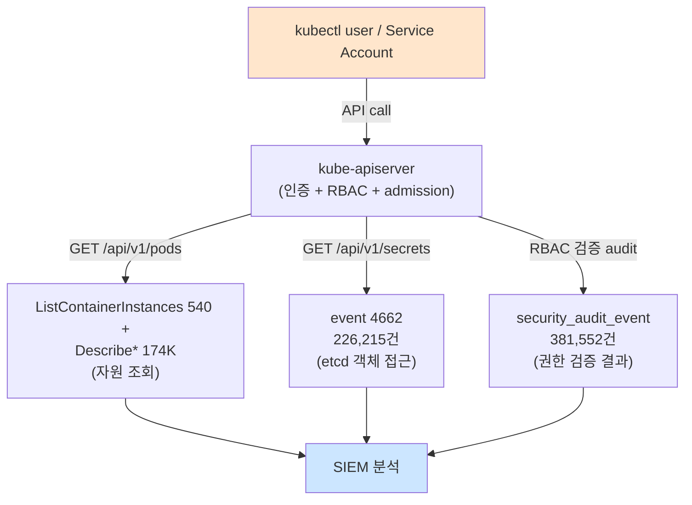

# Week 11: Kubernetes 보안 기초

## 학습 목표
- Kubernetes(K8s)의 기본 구조와 보안 관련 구성요소를 이해한다
- Pod Security Standards를 적용할 수 있다
- RBAC(Role-Based Access Control)으로 접근을 제어할 수 있다
- NetworkPolicy로 Pod 간 통신을 제한할 수 있다

## 실습 환경 (공통)

| 서버 | IP | 역할 | 접속 |
|------|-----|------|------|
| bastion | 10.20.30.201 | Control Plane (Bastion) | `ssh ccc@10.20.30.201` (pw: 1) |
| secu | 10.20.30.1 | 방화벽/IPS (nftables, Suricata) | `ssh ccc@10.20.30.1` |
| web | 10.20.30.80 | 웹서버 (JuiceShop:3000, Apache:80) | `ssh ccc@10.20.30.80` |
| siem | 10.20.30.100 | SIEM (Wazuh Dashboard:443, OpenCTI:8080) | `ssh ccc@10.20.30.100` |

**Bastion API:** `http://localhost:9100` / Key: `ccc-api-key-2026`

## 강의 시간 배분 (3시간)

| 시간 | 내용 | 유형 |
|------|------|------|
| 0:00-0:40 | 이론 강의 (Part 1) | 강의 |
| 0:40-1:10 | 이론 심화 + 사례 분석 (Part 2) | 강의/토론 |
| 1:10-1:20 | 휴식 | - |
| 1:20-2:00 | 실습 (Part 3) | 실습 |
| 2:00-2:40 | 심화 실습 + 도구 활용 (Part 4) | 실습 |
| 2:40-2:50 | 휴식 | - |
| 2:50-3:20 | 응용 실습 + Bastion 연동 (Part 5) | 실습 |
| 3:20-3:40 | 정리 + 과제 안내 | 정리 |

---

---

## 용어 해설 (Docker/클라우드/K8s 보안 과목)

| 용어 | 영문 | 설명 | 비유 |
|------|------|------|------|
| **컨테이너** | Container | 앱과 의존성을 격리하여 실행하는 경량 가상화 | 이삿짐 컨테이너 (어디서든 동일하게 열 수 있음) |
| **이미지** | Image (Docker) | 컨테이너를 만들기 위한 읽기 전용 템플릿 | 붕어빵 틀 |
| **Dockerfile** | Dockerfile | 이미지를 빌드하는 레시피 파일 | 요리 레시피 |
| **레지스트리** | Registry | 이미지를 저장·배포하는 저장소 (Docker Hub 등) | 앱 스토어 |
| **레이어** | Layer (Image) | 이미지의 각 빌드 단계 (캐싱 단위) | 레고 블록 한 층 |
| **볼륨** | Volume | 컨테이너 데이터를 영구 저장하는 공간 | 외장 하드 |
| **네임스페이스** | Namespace (Linux) | 프로세스를 격리하는 커널 기능 (PID, NET, MNT 등) | 칸막이 (같은 건물, 서로 안 보임) |
| **cgroup** | Control Group | 프로세스의 CPU/메모리 사용량을 제한하는 커널 기능 | 전기/수도 사용량 제한 |
| **오케스트레이션** | Orchestration | 다수의 컨테이너를 관리·조율하는 것 (K8s) | 오케스트라 지휘 |
| **Pod** | Pod (K8s) | K8s의 최소 배포 단위 (1개 이상의 컨테이너) | 같은 방에 사는 룸메이트들 |
| **RBAC** | Role-Based Access Control | 역할 기반 접근 제어 (K8s) | 직책별 출입 권한 |
| **PSP/PSA** | Pod Security Policy/Admission | Pod의 보안 설정을 강제하는 정책 | 건물 입주 조건 |
| **NetworkPolicy** | NetworkPolicy (K8s) | Pod 간 네트워크 통신 규칙 | 부서 간 출입 통제 |
| **Trivy** | Trivy | 컨테이너 이미지 취약점 스캐너 (Aqua) | X-ray 검사기 |
| **IaC** | Infrastructure as Code | 인프라를 코드로 정의·관리 (Terraform 등) | 건축 설계도 (코드 = 설계도) |
| **IAM** | Identity and Access Management | 클라우드 사용자/권한 관리 (AWS IAM 등) | 회사 사원증 + 권한 관리 시스템 |
| **CIS 벤치마크** | CIS Benchmark | 보안 설정 모범 사례 가이드 (Center for Internet Security) | 보안 설정 모범답안 |

---

## 1. Kubernetes 기본 구조

### 1.1 주요 구성요소

```
Control Plane (마스터)
├── API Server      ← 모든 요청의 진입점
├── etcd            ← 클러스터 상태 저장소
├── Scheduler       ← Pod 배치 결정
└── Controller      ← 상태 유지 관리

Worker Node
├── kubelet         ← Pod 관리 에이전트
├── kube-proxy      ← 네트워크 프록시
└── Container Runtime (Docker/containerd)
```

### 1.2 보안 관점 핵심 개념

| 개념 | 설명 | 보안 의미 |
|------|------|----------|
| **Pod** | 최소 배포 단위 (1+ 컨테이너) | 격리 단위 |
| **ServiceAccount** | Pod의 ID | API 서버 접근 권한 |
| **Namespace** | 논리적 분리 | 리소스 격리 |
| **Secret** | 비밀정보 저장 | 암호화 필요 |

---

## 2. Pod Security Standards

> **이 실습을 왜 하는가?**
> "Kubernetes 보안 기초" — 이 주차의 핵심 기술을 실제 서버 환경에서 직접 실행하여 체험한다.
> Docker/클라우드/K8s 보안 분야에서 이 기술은 실무의 핵심이며, 실습을 통해
> 명령어의 의미, 결과 해석 방법, 보안 관점에서의 판단 기준을 익힌다.
>
> **이걸 하면 무엇을 알 수 있는가?**
> - 이 기술이 실제 시스템에서 어떻게 동작하는지 직접 확인
> - 정상과 비정상 결과를 구분하는 눈을 기름
> - 실무에서 바로 활용할 수 있는 명령어와 절차를 체득
>
> **주의:** 모든 실습은 허가된 실습 환경(10.20.30.0/24)에서만 수행한다.

Kubernetes는 3가지 보안 수준을 정의한다.

### 2.1 세 가지 보안 수준

| 수준 | 설명 | 제한 |
|------|------|------|
| **Privileged** | 제한 없음 | 모든 설정 허용 |
| **Baseline** | 알려진 위험 차단 | privileged, hostNetwork 등 차단 |
| **Restricted** | 최대 보안 | non-root, read-only, 최소 capability |

### 2.2 안전한 Pod 정의

```yaml
# secure-pod.yaml
apiVersion: v1
kind: Pod
metadata:
  name: secure-app
  namespace: production
spec:
  securityContext:
    runAsNonRoot: true           # root 실행 금지
    runAsUser: 1000              # UID 1000으로 실행
    runAsGroup: 1000
    fsGroup: 1000
    seccompProfile:
      type: RuntimeDefault       # 기본 seccomp 프로파일
  containers:
    - name: app
      image: myapp:v1.0
      securityContext:
        allowPrivilegeEscalation: false  # 권한 상승 금지
        readOnlyRootFilesystem: true     # 읽기 전용
        capabilities:
          drop: ["ALL"]                  # 모든 capability 제거
      resources:
        limits:
          memory: "256Mi"
          cpu: "500m"
        requests:
          memory: "128Mi"
          cpu: "250m"
      volumeMounts:
        - name: tmp
          mountPath: /tmp
  volumes:
    - name: tmp
      emptyDir: {}
  automountServiceAccountToken: false   # 불필요 시 SA 토큰 마운트 안 함
```

### 2.3 위험한 Pod 설정

```yaml
# 절대 사용하지 말 것
spec:
  hostNetwork: true          # 호스트 네트워크 공유 → 모든 트래픽 접근
  hostPID: true              # 호스트 PID 공유 → 호스트 프로세스 조회
  containers:
    - name: bad
      securityContext:
        privileged: true      # 호스트 전체 접근
        runAsUser: 0          # root 실행
```

---

## 3. RBAC (Role-Based Access Control)

### 3.1 RBAC 구성요소

```
Role/ClusterRole          → 무엇을 할 수 있는가 (권한 정의)
RoleBinding/ClusterRoleBinding → 누구에게 부여하는가 (권한 연결)
```

| 리소스 | 범위 | 용도 |
|--------|------|------|
| Role | Namespace 내 | 특정 네임스페이스 권한 |
| ClusterRole | 클러스터 전체 | 전체 클러스터 권한 |
| RoleBinding | Namespace 내 | Role을 사용자에 연결 |
| ClusterRoleBinding | 클러스터 전체 | ClusterRole을 사용자에 연결 |

### 3.2 RBAC 예시

```yaml
# 읽기 전용 Role
apiVersion: rbac.authorization.k8s.io/v1
kind: Role
metadata:
  namespace: production
  name: pod-reader
rules:
  - apiGroups: [""]
    resources: ["pods", "pods/log"]
    verbs: ["get", "list", "watch"]
---
# RoleBinding
apiVersion: rbac.authorization.k8s.io/v1
kind: RoleBinding
metadata:
  namespace: production
  name: read-pods
subjects:
  - kind: ServiceAccount
    name: monitoring-sa
    namespace: production
roleRef:
  kind: Role
  name: pod-reader
  apiGroup: rbac.authorization.k8s.io
```

### 3.3 위험한 RBAC 패턴

```yaml
# 절대 금지: 와일드카드 권한
rules:
  - apiGroups: ["*"]
    resources: ["*"]
    verbs: ["*"]

# 위험: secrets 접근 권한
rules:
  - apiGroups: [""]
    resources: ["secrets"]
    verbs: ["get", "list"]
    # → 클러스터의 모든 비밀정보 조회 가능
```

---

## 4. NetworkPolicy

Pod 간 네트워크 통신을 제어하는 방화벽 역할이다.
기본적으로 모든 Pod는 서로 통신 가능하다.

### 4.1 기본 거부 정책

```yaml
# 모든 인바운드 트래픽 차단
apiVersion: networking.k8s.io/v1
kind: NetworkPolicy
metadata:
  name: default-deny-ingress
  namespace: production
spec:
  podSelector: {}     # 모든 Pod에 적용
  policyTypes:
    - Ingress         # 인바운드 차단 (아웃바운드는 허용)
```

### 4.2 선택적 허용

```yaml
# web → api만 허용
apiVersion: networking.k8s.io/v1
kind: NetworkPolicy
metadata:
  name: allow-web-to-api
  namespace: production
spec:
  podSelector:
    matchLabels:
      app: api           # api Pod에 적용
  policyTypes:
    - Ingress
  ingress:
    - from:
        - podSelector:
            matchLabels:
              app: web   # web Pod에서만 허용
      ports:
        - protocol: TCP
          port: 8080
```

### 4.3 네트워크 격리 패턴

```
[인터넷] → [Ingress] → [web Pod] → [api Pod] → [db Pod]
                         frontend    backend     database
                         네트워크     네트워크     네트워크
```

---

## 5. Kubernetes Secret 보안

### 5.1 Secret의 문제점

> **실습 목적**: Kubernetes의 RBAC, Pod Security, NetworkPolicy 개념을 Docker 환경에서 유사하게 체험하기 위해 수행한다
>
> **배우는 것**: Docker 그룹 권한이 K8s RBAC과 유사하고, nftables 규칙이 NetworkPolicy와 같은 역할이며, Pod Security의 non-root/read-only 설정 원리를 이해한다
>
> **결과 해석**: groups 명령에 docker가 있으면 접근 허용, 없으면 거부이며, 이것이 K8s RBAC의 축소판이다
>
> **실전 활용**: K8s 클러스터 운영 시 namespace별 RBAC 설계, default-deny NetworkPolicy 적용, Pod Security Standards 설정에 활용한다

```bash
# Secret은 기본적으로 Base64 인코딩일 뿐 (암호화 아님!)
echo "cGFzc3dvcmQxMjM=" | base64 -d
# → password123
```

### 5.2 Secret 보안 강화

1. **etcd 암호화**: Secret을 저장할 때 암호화
2. **RBAC 제한**: Secret 접근 권한을 최소화
3. **외부 관리**: HashiCorp Vault, AWS Secrets Manager 사용
4. **환경변수 대신 파일**: volumeMount로 파일로 전달

---

## 6. 실습: Docker Compose로 K8s 개념 체험

실습 환경: `web` 서버 (10.20.30.80)

### 실습 1: RBAC 개념을 Docker 환경에서 이해

```bash
ssh ccc@10.20.30.80

# Docker에서의 접근 제어 = docker.sock 접근 권한
# K8s에서의 접근 제어 = RBAC

# Docker 그룹에 속한 사용자만 Docker 명령 사용 가능
groups  # docker 그룹 확인
```

### 실습 2: NetworkPolicy를 nftables로 시뮬레이션

```bash
# secu 서버에서 Pod 간 통신 제어 개념 이해
ssh ccc@10.20.30.1

# web(10.20.30.80)에서 siem(10.20.30.100)으로의 특정 포트만 허용
# 이것이 K8s NetworkPolicy의 원리
sudo nft list ruleset | head -30
```

### 실습 3: LLM으로 K8s 보안 설정 분석

취약한 Pod YAML 설정을 LLM에게 전달하여 보안 문제를 자동 분석시킨다. privileged, runAsUser: 0, hostNetwork 등의 위험 설정을 식별할 수 있다.

```bash
# Ollama API로 K8s YAML 보안 분석 요청
# system: 역할 지정 / user: 분석 대상 YAML 전달
curl -s http://localhost:8003/v1/chat/completions \
  -H "Content-Type: application/json" \
  -d '{
    "model": "gemma3:12b",
    "messages": [
      {"role": "system", "content": "Kubernetes 보안 전문가로서 YAML 설정을 분석해주세요."},
      {"role": "user", "content": "다음 Pod 설정의 보안 문제를 찾아주세요:\napiVersion: v1\nkind: Pod\nspec:\n  containers:\n  - name: app\n    image: myapp\n    securityContext:\n      privileged: true\n      runAsUser: 0\n  hostNetwork: true\n  hostPID: true"}
    ]
  }' | python3 -m json.tool
```

---

## 7. K8s 보안 체크리스트

- [ ] Pod Security Standards (Restricted) 적용했는가?
- [ ] 모든 컨테이너가 non-root로 실행되는가?
- [ ] RBAC이 최소 권한으로 설정되어 있는가?
- [ ] default NetworkPolicy(deny all)가 적용되어 있는가?
- [ ] Secret이 etcd에서 암호화되는가?
- [ ] ServiceAccount 토큰 자동 마운트를 비활성화했는가?
- [ ] 리소스 limits가 설정되어 있는가?

---

## 핵심 정리

1. Pod Security Standards의 Restricted 수준을 기본으로 적용한다
2. RBAC은 최소 권한 원칙으로 설정하고, 와일드카드(*)를 절대 사용하지 않는다
3. NetworkPolicy로 Pod 간 통신을 명시적으로 허용한 것만 가능하게 한다
4. Secret은 Base64일 뿐이므로 etcd 암호화 + RBAC 제한이 필수이다
5. ServiceAccount 토큰 자동 마운트는 불필요 시 비활성화한다

---

## 다음 주 예고
- Week 12: Kubernetes 공격 - Pod 탈출, ServiceAccount 악용

---

---

## 심화: 컨테이너/클라우드 보안 보충

### Docker 보안 핵심 개념 상세

#### 컨테이너 격리의 원리

```
호스트 OS 커널
├── Namespace (격리)
│   ├── PID namespace  → 컨테이너마다 독립 프로세스 번호
│   ├── NET namespace  → 컨테이너마다 독립 네트워크 스택
│   ├── MNT namespace  → 컨테이너마다 독립 파일시스템
│   ├── UTS namespace  → 컨테이너마다 독립 hostname
│   └── USER namespace → 컨테이너 내 root ≠ 호스트 root (설정 시)
│
├── cgroup (자원 제한)
│   ├── CPU:    --cpus=2          → 최대 2코어
│   ├── Memory: --memory=512m     → 최대 512MB
│   └── IO:     --blkio-weight=500
│
└── Overlay FS (레이어 파일시스템)
    ├── 읽기 전용 레이어 (이미지)
    └── 읽기/쓰기 레이어 (컨테이너)
```

> **왜 컨테이너가 VM보다 가벼운가?**
> VM: 각각 전체 OS 커널을 포함 (수 GB)
> 컨테이너: 호스트 커널을 공유, 격리만 namespace로 (수 MB)
> 대신 격리 수준은 VM이 더 강하다 (커널 취약점 시 컨테이너 탈출 가능)

#### Dockerfile 보안 체크리스트

```dockerfile
# 나쁜 예
FROM ubuntu:latest          # ❌ latest 태그 (재현 불가)
RUN apt-get update && apt-get install -y curl vim  # ❌ 불필요 패키지
COPY . /app                 # ❌ 전체 복사 (.env 포함 가능)
RUN chmod 777 /app          # ❌ 과도한 권한
USER root                   # ❌ root 실행
EXPOSE 22                   # ❌ SSH 포트 (컨테이너에서 불필요)

# 좋은 예
FROM ubuntu:22.04@sha256:abc123...  # ✅ 특정 버전 + digest 고정
RUN apt-get update && apt-get install -y --no-install-recommends curl \
    && rm -rf /var/lib/apt/lists/*  # ✅ 최소 패키지 + 캐시 삭제
COPY --chown=appuser:appuser app/ /app  # ✅ 필요한 것만 + 소유자 지정
RUN chmod 550 /app          # ✅ 최소 권한
USER appuser                # ✅ 비root 사용자
HEALTHCHECK CMD curl -f http://localhost:8080 || exit 1  # ✅ 헬스체크
```

### 실습: Docker 보안 점검 (실습 인프라)

```bash
# web 서버의 Docker 상태 확인
ssh ccc@10.20.30.80 "
  echo '=== Docker 버전 ===' && docker --version 2>/dev/null || echo 'Docker 미설치'
  echo '=== 실행 중 컨테이너 ===' && docker ps 2>/dev/null || echo '접근 불가'
  echo '=== Docker 소켓 권한 ===' && ls -la /var/run/docker.sock 2>/dev/null
" 2>/dev/null

# siem 서버의 Docker 상태 (OpenCTI가 Docker로 실행)
ssh ccc@10.20.30.100 "
  echo '=== Docker 컨테이너 ===' && sudo docker ps --format 'table {{.Names}}\t{{.Image}}\t{{.Status}}' 2>/dev/null
  echo '=== Docker 네트워크 ===' && sudo docker network ls 2>/dev/null
" 2>/dev/null
```

### CIS Docker Benchmark 핵심 항목

| # | 항목 | 점검 명령 | 기대 결과 |
|---|------|---------|---------|
| 2.1 | Docker daemon 설정 | `cat /etc/docker/daemon.json` | userns-remap 설정 |
| 4.1 | 비root 사용자 | `docker inspect --format '{{.Config.User}}' <컨테이너>` | root가 아닌 사용자 |
| 4.6 | HEALTHCHECK | `docker inspect --format '{{.Config.Healthcheck}}' <컨테이너>` | 헬스체크 설정됨 |
| 5.2 | network_mode | `docker inspect --format '{{.HostConfig.NetworkMode}}' <컨테이너>` | host가 아닌 것 |
| 5.12 | --privileged | `docker inspect --format '{{.HostConfig.Privileged}}' <컨테이너>` | false |

---

> **실습 환경 검증 완료** (2026-03-28): Docker 29.3.0, Compose v5.1.1, juice-shop(User=65532,Privileged=false), OpenCTI 6컨테이너, opencti_default 네트워크

---

## 📂 실습 참조 파일 가이드

> 이번 주 실습에서 **실제로 조작하는** 솔루션의 기능·경로·파일·설정·UI 요점입니다.

### Kubernetes + kubectl
> **역할:** 컨테이너 오케스트레이션  
> **실행 위치:** `컨트롤 플레인 / kubeconfig 보유 클라이언트`  
> **접속/호출:** `kubectl` with `~/.kube/config`

**주요 경로·파일**

| 경로 | 역할 |
|------|------|
| `/etc/kubernetes/` | 컨트롤 플레인 설정 (kubeadm) |
| `/var/lib/etcd/` | etcd 저장소 — 전체 클러스터 시크릿 포함 |
| `~/.kube/config` | 사용자 인증 정보 |

**핵심 설정·키**

- `PodSecurity admission (restricted)` — 네임스페이스별 보안 레벨
- `NetworkPolicy default-deny` — 파드 간 기본 차단
- `RBAC Role/RoleBinding` — 최소 권한

**로그·확인 명령**

- ``kubectl logs <pod> -c <container>`` — 파드 로그
- ``kubectl get events -A`` — 클러스터 이벤트

**UI / CLI 요점**

- `kubectl auth can-i --list` — 현재 주체가 가능한 동작 열거
- `kubectl get pods -A -o wide` — 전체 파드 상태
- `kubectl describe pod <p>` — 이벤트/이미지/볼륨 상세

> **해석 팁.** etcd 노출·kubeconfig 유출은 **즉각적 클러스터 장악**. `kubectl auth can-i` 결과가 예상보다 많으면 RBAC 재설계 신호.

---

## 실제 사례 (WitFoo Precinct 6 — Kubernetes 보안 기초)

> 출처: WitFoo Precinct 6 Cybersecurity Dataset (Apache 2.0)
> 본 lecture *RBAC + secrets + network policy + service account* 학습 항목 매칭.

### Kubernetes 보안의 핵심 — RBAC 는 *모든 호출* 에 적용된다

Kubernetes 에서 모든 자원 조작은 *kube-apiserver 를 거치는 API 호출* 로 이루어진다. `kubectl get pods` 명령도, controller 의 자동 reconcile loop 도, scheduler 의 pod 배치도 — 모두 동일한 API 호출 메커니즘을 사용한다. 이 호출 하나하나에 RBAC (Role-Based Access Control) 이 적용되어 *그 호출자가 그 자원에 그 동작을 할 권한이 있는지* 가 검증된다.

dataset 에서 K8s 신호를 분석할 때 — *직접적인 K8s 신호는 dataset 에 적게 등장* 하지만 (ListContainerInstances 540건), 실제로는 *동형 의미* 를 가진 다른 cloud 신호로 분석할 수 있다. K8s 의 `pods list` 는 ECS 의 `ListContainerInstances` 와 의미가 동일하고, K8s 의 `Describe pod/secret` 은 cloud 의 `Describe*` 군과 동형이며, K8s secret read 는 *etcd object access* 로 볼 수 있어 event 4662 (object access) 226K 와 동일 분류 체계를 따른다.



**그림 해석**: 모든 K8s API 호출은 *3개의 audit 신호* 를 만든다 — (1) 자원 조회 자체의 신호, (2) etcd 객체 접근 신호, (3) RBAC 검증 신호. 학생이 `kubectl get pods` 한 번 실행하면 — 정상적으로는 1+1+1 = 3건, RBAC 거부 당하면 *audit 만 발생하고 자원 조회는 안 된 결과* 가 dataset 에 기록된다. 즉 RBAC 거부 audit 의 비율이 높아지면 *공격자가 권한 없는 자원을 시도하는 흔적*.

### Case 1: ListContainerInstances 540건 — K8s `kubectl get pods` 의 정상 baseline

| 항목 | 값 | 의미 |
|---|---|---|
| message_type | `ListContainerInstances` | ECS/K8s 의 pod 목록 조회 |
| 총 호출 | 540건 | 약 30일 분량의 정상 운영 |
| 정상 caller | 5-10개 SA | controller / scheduler / kubelet |
| 학습 매핑 | §"RBAC verb=list" | 권한 분배의 정량 신호 |

**자세한 해석**:

`kubectl get pods` 는 K8s 사용자가 가장 흔히 쓰는 명령이다. RBAC 관점에서 이 명령은 *"verb=list, resource=pods, namespace=default"* 의 권한을 요구한다. 이 권한이 적절히 분배되어야 — 운영자는 자기 namespace 만 보고, 모니터링 도구는 cluster-wide 로 보고, 일반 application SA 는 자기 자원만 본다.

**dataset 540건은 정상 ECS/K8s 운영의 한 달치 baseline** 이다. 정상적으로는 — controller manager 가 reconcile loop 에서 호출하는 분량 + scheduler 가 pod 배치 결정 시 호출하는 분량 + kubelet 가 자기 노드 상태 보고할 때 호출하는 분량. 모두 *5-10개의 SA* 가 만든다.

**위험 신호** — 만약 *일반 application SA 1개가 cluster-wide list 호출* 을 발생시키면 — 그 SA 는 RBAC 가 잘못 부여된 것이다. lecture §"RBAC 최소 권한" 의 위반. 단일 SA 의 시간당 list 호출이 50건을 넘으면 — *cluster 전체 enumeration 의도* 로 분류하고 hunt 시작.

### Case 2: event 4662 (object access) 226,215건 — secret/configmap 접근의 etcd 흔적

| 항목 | 값 | 의미 |
|---|---|---|
| message_type | `4662` | etcd 또는 directory service 객체 접근 |
| 총 발생 | 226,215건 | dataset 에서 두 번째로 많은 신호 |
| 정상 baseline | 호스트 시간당 ~50건 | controller/scheduler 자동 동작 |
| 학습 매핑 | §"K8s secrets = etcd 객체" | secret 읽기 흔적 |

**자세한 해석**:

K8s 의 secret 과 configmap 은 etcd (분산 key-value store) 에 저장된다. SA 가 `kubectl get secret <name>` 또는 pod 가 `volumeMount: secret` 으로 secret 을 마운트하면 — etcd 에서 그 객체를 read 하는 동작이 발생하고, audit 에 event 4662 (object access) 로 기록된다.

**dataset 226K 는 정상 운영의 *모든 controller + admission + scheduler* 가 만든 흔적** 이다. 학생이 알아야 할 것은 — *정상 SA 는 자기 namespace 의 secret 만* 접근하고, *cluster-wide secret access* 는 거의 없다는 점이다.

**위험 신호** — 단일 SA 의 시간당 secret access 가 50건을 넘으면 — *credential harvesting* 의 강력한 신호다. 공격자가 침해된 SA token 1개로 `kubectl get secrets -A` 같은 명령을 실행하면 — cluster 전체의 모든 secret 을 1번에 추출하려 시도. 그 결과 4662 burst 가 발생하고, audit 룰이 즉시 alert 를 발생시켜야 한다.

### 이 사례에서 학생이 배워야 할 3가지

1. **K8s 모든 호출은 audit 의 3중 흔적을 만든다** — 자원 조회 + etcd 접근 + RBAC 검증. 한 신호만 봐도 일부, 셋을 결합해야 전체.
2. **list 호출의 baseline 은 정상 SA 5-10개에서만 발생** — 일반 SA 의 cluster-wide list = RBAC 결함.
3. **secret access 의 namespace 분포가 곧 보안 정책의 정착도** — cluster-wide secret read 는 거의 없어야 정상.

**학생 액션**: lab 환경에서 default SA token 1개로 `kubectl get secrets -A` 와 `kubectl auth can-i --list` 를 실행하고, audit 에 어느 신호가 발생하는지 추적. 그 후 RBAC role 을 *자기 namespace 의 secret list 만 허용* 으로 좁힌 뒤 동일 명령 재실행 — 어느 단계에서 차단되고 어느 audit 가 새로 발생하는지 비교 표 작성.

